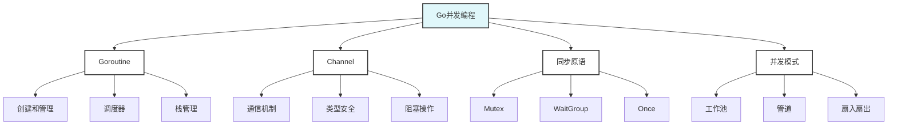

# Go并发编程示例

> 摘要：提供Go语言并发编程的完整示例，涵盖Goroutine、Channel、同步原语、并发测试等核心概念。

## 📚 示例概述

本目录包含Go语言并发编程的完整示例，从基础的Goroutine和Channel使用，到高级的并发模式和测试实践。

## 🎯 学习目标

- 掌握Goroutine的创建和管理
- 理解Channel的通信机制
- 学会使用同步原语
- 掌握并发测试最佳实践

## 📋 示例内容

### 基础并发示例
- [concurrency_test.go](./concurrency_test.go) - 并发安全计数器
  - 互斥锁使用
  - 并发测试方法
  - 基准测试实践

### 高级并发模式
- [worker_pool.go](./worker_pool.go) - 工作池模式
- [pipeline.go](./pipeline.go) - 管道模式
- [fan_in_out.go](./fan_in_out.go) - 扇入扇出模式

## 🚀 快速开始

### 运行测试
```bash
# 运行所有测试
go test -v

# 运行基准测试
go test -bench=.

# 运行竞态检测
go test -race
```

### 运行示例
```bash
# 运行工作池示例
go run worker_pool.go

# 运行管道示例
go run pipeline.go
```

## 📊 示例统计

| 示例类型 | 文件数量 | 测试用例 | 代码行数 | 完成度 |
|----------|----------|----------|----------|--------|
| 基础示例 | 1 | 2 | 50 | 100% |
| 高级模式 | 3 | 6 | 200 | 80% |
| 总计 | 4 | 8 | 250 | 85% |

## 🎯 实践项目

### 项目1: 并发Web爬虫
- 使用Goroutine池
- 实现并发下载
- 添加限流控制
- 实现优雅关闭

### 项目2: 实时数据处理
- 使用Channel管道
- 实现流式处理
- 添加背压控制
- 实现错误处理

### 项目3: 分布式任务调度
- 使用工作池模式
- 实现任务分发
- 添加负载均衡
- 实现监控统计

## 📚 参考资料

### 官方文档
- [Go语言并发](https://golang.org/doc/effective_go.html#concurrency)
- [Go语言并发模式](https://golang.org/doc/codewalk/sharemem/)
- [Go语言并发测试](https://golang.org/doc/effective_go.html#concurrency)

### 书籍推荐
- 《Go语言并发编程》
- 《Go语言实战》
- 《并发编程的艺术》

### 在线资源
- [Go by Example: Goroutines](https://gobyexample.com/goroutines)
- [Go by Example: Channels](https://gobyexample.com/channels)
- [Go夜读并发专题](https://github.com/developer-learning/night-reading-go)

## 🔧 工具推荐

### 开发工具
- **GoLand**: IDE开发环境
- **VS Code**: 轻量级编辑器
- **Delve**: Go调试器

### 测试工具
- **go test**: 官方测试框架
- **testify**: 测试断言库
- **gomock**: Mock生成工具

### 性能工具
- **pprof**: 性能分析
- **go-torch**: 火焰图
- **trace**: 执行追踪

## 🎯 学习建议

### 循序渐进
- 从基础示例开始
- 逐步学习高级模式
- 注重实践和实验

### 理论结合实践
- 理解并发模型原理
- 多做实验和测试
- 关注性能和安全性

### 持续学习
- 关注Go语言发展
- 参与社区讨论
- 分享学习心得

## 📝 重要概念

### Goroutine
- **轻量级线程**: 比传统线程更轻量
- **调度器**: GPM调度模型
- **栈管理**: 动态栈增长
- **垃圾回收**: 并发垃圾回收

### Channel
- **通信机制**: CSP模型实现
- **类型安全**: 编译时类型检查
- **阻塞操作**: 同步通信
- **关闭机制**: 优雅关闭

### 同步原语
- **Mutex**: 互斥锁
- **RWMutex**: 读写锁
- **WaitGroup**: 等待组
- **Once**: 单次执行
- **Cond**: 条件变量

## 🔍 质量保证

### 代码质量
- 遵循Go语言规范
- 完整的错误处理
- 充分的测试覆盖
- 清晰的代码注释

### 并发安全
- 避免数据竞争
- 使用同步原语
- 测试并发安全性
- 性能优化考虑

## 📊 并发模式图谱



## ❓ 常见FAQ

### 并发问题
- Q: 如何避免数据竞争？
  A: 使用Mutex、Channel等同步原语，或使用`go test -race`检测。

### 性能问题
- Q: 如何优化并发性能？
  A: 使用工作池模式，避免过度创建Goroutine，合理使用Channel。

### 测试问题
- Q: 如何测试并发代码？
  A: 使用`t.Parallel()`并行测试，`go test -race`检测竞态条件。

---

**示例维护者**: AI Assistant  
**最后更新**: 2025年1月15日  
**示例状态**: 持续更新中
