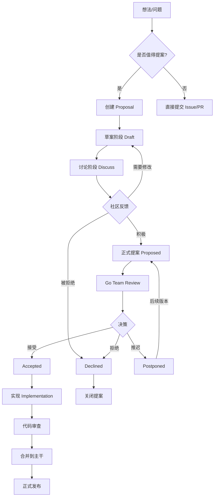
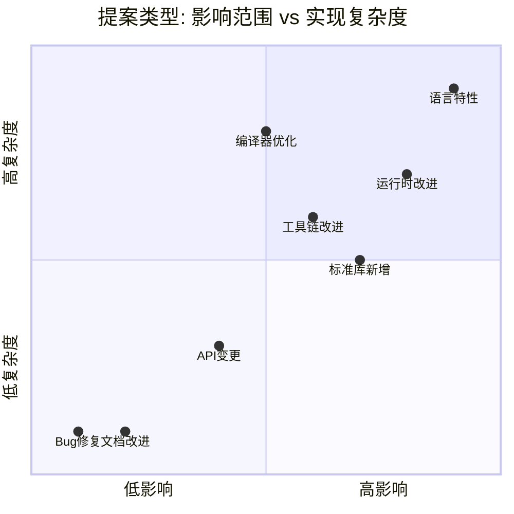
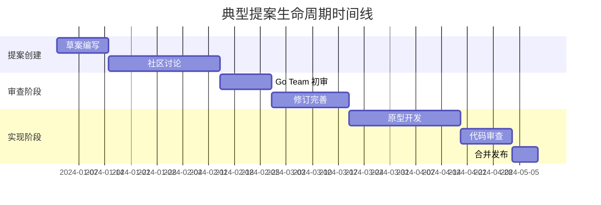

# Go 提案流程 (Proposal Process)

> **维度**: Language-Design
> **级别**: S (15+ KB)
> **标签**: #proposal #governance #evolution #community
> **权威来源**:
>
> - [Go Proposal Process](https://github.com/golang/proposal) - Official Go Project
> - [Go2 Draft Designs](https://go.googlesource.com/proposal/+/refs/heads/master/design/) - Go Team

---

## 1. 形式化定义

### 1.1 提案状态机

**定义 1.1 (提案状态)**
$$\text{ProposalState} = \{\text{Draft}, \text{Proposed}, \text{Accepted}, \text{Declined}, \text{Active}, \text{Implemented}\}$$

**定义 1.2 (状态转换)**
$$\delta: \text{ProposalState} \times \text{Event} \to \text{ProposalState}$$

```
Draft ──► Proposed ──► Accepted ──► Active ──► Implemented
   │          │            │
   │          ▼            ▼
   │       Declined    Postponed
   │
   └─────────────────────────────► Abandoned
```

### 1.2 TLA+ 规范

```tla
------------------------------ MODULE ProposalProcess ------------------------------
EXTENDS Naturals, Sequences, FiniteSets

CONSTANTS Authors, Reviewers, States

VARIABLES proposalState, reviews, implementationStatus

TypeInvariant ==
    /\ proposalState \in States
    /\ reviews \in SUBSET (Authors \X Reviewers \X {0, 1, 2})  \* 0:pending, 1:approve, 2:reject

Init ==
    /\ proposalState = "Draft"
    /\ reviews = {}
    /\ implementationStatus = "NotStarted"

\* 提交提案
Submit ==
    /\ proposalState = "Draft"
    /\ proposalState' = "Proposed"
    /\ UNCHANGED <<reviews, implementationStatus>>

\* 审查通过
Approve ==
    /\ proposalState = "Proposed"
    /\ \E r \in Reviewers : reviews' = reviews \cup {("author", r, 1)}
    /\ Cardinality({rev \in reviews : rev[3] = 1}) >= 2
    /\ proposalState' = "Accepted"
    /\ UNCHANGED implementationStatus

\* 实现完成
Complete ==
    /\ proposalState = "Active"
    /\ implementationStatus = "Complete"
    /\ proposalState' = "Implemented"
    /\ UNCHANGED reviews

Next ==
    \/ Submit
    \/ Approve
    \/ Complete

Spec == Init /\ [][Next]_<<proposalState, reviews, implementationStatus>>

================================================================================
```

---

## 2. 提案流程详解

### 2.1 完整流程图



### 2.2 各阶段详解

| 阶段 | 负责人 | 时长 | 输出 |
|------|--------|------|------|
| **Draft** | 提案作者 | 1-4周 | 设计文档草案 |
| **Proposed** | 社区 | 2-8周 | 反馈与讨论 |
| **Review** | Go Team | 2-4周 | 技术评估报告 |
| **Accepted** | 实现者 | 1-6月 | 工作代码 |
| **Active** | 维护者 | 持续 | 稳定功能 |

---

## 3. 提案类型矩阵

### 3.1 类型与复杂度



### 3.2 类型定义

**定义 3.1 (语言特性提案)**
$$\text{LanguageChange} = \langle \text{syntax}, \text{semantics}, \text{backwardCompat} \rangle$$

**定义 3.2 (标准库提案)**
$$\text{StdlibProposal} = \langle \text{package}, \text{api}, \text{useCase} \rangle$$

---

## 4. 关键设计文档

### 4.1 历史重要提案

| 提案 | 版本 | 状态 | 影响 |
|------|------|------|------|
| [Generics](https://go.googlesource.com/proposal/+/refs/heads/master/design/go2draft-generics-overview.md) | Go 1.18 | ✅ 已实现 | 类型参数 |
| [Error Values](https://go.googlesource.com/proposal/+/master/design/29934-error-values.md) | Go 1.13 | ✅ 已实现 | `%w` 包装 |
| [Modules](https://go.googlesource.com/proposal/+/master/design/24301-versioned-go.md) | Go 1.11 | ✅ 已实现 | 依赖管理 |
| [Context](https://go.googlesource.com/proposal/+/master/design/12914-state-for-pprof.md) | Go 1.7 | ✅ 已实现 | 请求取消 |
| [Fuzzing](https://go.googlesource.com/proposal/+/master/design/draft-fuzzing.md) | Go 1.18 | ✅ 已实现 | 模糊测试 |
| [Workspaces](https://go.googlesource.com/proposal/+/master/design/45713-workspace.md) | Go 1.18 | ✅ 已实现 | 多模块工作区 |

### 4.2 提案模板

```markdown
# Proposal: [标题]

## 背景
[问题的背景和动机]

## 目标
- 主要目标
- 非目标

## 提案
[详细设计方案]

## 替代方案
[考虑过但放弃的方案]

## 兼容性
[向后兼容性分析]

## 实现
[实现计划和复杂度估算]
```

---

## 5. Go 代码示例

### 5.1 提案影响分析工具

```go
package main

import (
    "context"
    "fmt"
    "time"
)

// Proposal 表示一个语言提案
type Proposal struct {
    ID          string
    Title       string
    Author      string
    State       ProposalState
    CreatedAt   time.Time
    TargetVer   string
    Complexity  ComplexityLevel
    Impact      ImpactLevel
}

type ProposalState string

const (
    StateDraft       ProposalState = "Draft"
    StateProposed    ProposalState = "Proposed"
    StateAccepted    ProposalState = "Accepted"
    StateDeclined    ProposalState = "Declined"
    StateImplemented ProposalState = "Implemented"
)

type ComplexityLevel int

const (
    ComplexityLow ComplexityLevel = iota
    ComplexityMedium
    ComplexityHigh
)

type ImpactLevel int

const (
    ImpactLow ImpactLevel = iota
    ImpactMedium
    ImpactHigh
    ImpactBreaking
)

// StateMachine 提案状态机
type StateMachine struct {
    current   ProposalState
    history   []StateTransition
    listeners []func(ProposalState)
}

type StateTransition struct {
    From      ProposalState
    To        ProposalState
    Timestamp time.Time
    Reason    string
}

// NewStateMachine 创建新的状态机
func NewStateMachine() *StateMachine {
    return &StateMachine{
        current: StateDraft,
        history: make([]StateTransition, 0),
    }
}

// Transition 执行状态转换
func (sm *StateMachine) Transition(to ProposalState, reason string) error {
    if !isValidTransition(sm.current, to) {
        return fmt.Errorf("invalid transition from %s to %s", sm.current, to)
    }

    transition := StateTransition{
        From:      sm.current,
        To:        to,
        Timestamp: time.Now(),
        Reason:    reason,
    }

    sm.history = append(sm.history, transition)
    sm.current = to

    // 通知监听器
    for _, listener := range sm.listeners {
        listener(to)
    }

    return nil
}

// isValidTransition 检查状态转换是否合法
func isValidTransition(from, to ProposalState) bool {
    validTransitions := map[ProposalState][]ProposalState{
        StateDraft:       {StateProposed, StateDeclined},
        StateProposed:    {StateAccepted, StateDeclined},
        StateAccepted:    {StateImplemented, StateDeclined},
        StateImplemented: {},
        StateDeclined:    {},
    }

    for _, valid := range validTransitions[from] {
        if valid == to {
            return true
        }
    }
    return false
}

// ProposalTracker 提案追踪器
type ProposalTracker struct {
    proposals map[string]*Proposal
    byAuthor  map[string][]string
    byState   map[ProposalState][]string
}

// NewProposalTracker 创建提案追踪器
func NewProposalTracker() *ProposalTracker {
    return &ProposalTracker{
        proposals: make(map[string]*Proposal),
        byAuthor:  make(map[string][]string),
        byState:   make(map[ProposalState][]string),
    }
}

// Add 添加提案
func (pt *ProposalTracker) Add(p *Proposal) {
    pt.proposals[p.ID] = p
    pt.byAuthor[p.Author] = append(pt.byAuthor[p.Author], p.ID)
    pt.byState[p.State] = append(pt.byState[p.State], p.ID)
}

// GetByState 按状态获取提案
func (pt *ProposalTracker) GetByState(state ProposalState) []*Proposal {
    ids := pt.byState[state]
    result := make([]*Proposal, 0, len(ids))
    for _, id := range ids {
        if p, ok := pt.proposals[id]; ok {
            result = append(result, p)
        }
    }
    return result
}

// AnalyzeTimeline 分析提案时间线
func (pt *ProposalTracker) AnalyzeTimeline(ctx context.Context) (*TimelineAnalysis, error) {
    analysis := &TimelineAnalysis{
        AverageDuration: make(map[ProposalState]time.Duration),
        Bottlenecks:     make([]string, 0),
    }

    // 计算各阶段平均耗时
    stateDurations := make(map[ProposalState][]time.Duration)

    for _, p := range pt.proposals {
        // 简化的分析逻辑
        duration := time.Since(p.CreatedAt)
        stateDurations[p.State] = append(stateDurations[p.State], duration)
    }

    for state, durations := range stateDurations {
        if len(durations) > 0 {
            var total time.Duration
            for _, d := range durations {
                total += d
            }
            analysis.AverageDuration[state] = total / time.Duration(len(durations))
        }
    }

    return analysis, nil
}

type TimelineAnalysis struct {
    AverageDuration map[ProposalState]time.Duration
    Bottlenecks     []string
}

// PriorityQueue 提案优先级队列
type PriorityQueue struct {
    items []ProposalPriority
}

type ProposalPriority struct {
    Proposal   *Proposal
    Priority   int
    Community  int  // 社区支持度
    Urgency    int  // 紧急程度
}

func (pq *PriorityQueue) Push(p ProposalPriority) {
    pq.items = append(pq.items, p)
    pq.heapifyUp(len(pq.items) - 1)
}

func (pq *PriorityQueue) Pop() *ProposalPriority {
    if len(pq.items) == 0 {
        return nil
    }

    top := pq.items[0]
    pq.items[0] = pq.items[len(pq.items)-1]
    pq.items = pq.items[:len(pq.items)-1]
    pq.heapifyDown(0)

    return &top
}

func (pq *PriorityQueue) heapifyUp(index int) {
    for index > 0 {
        parent := (index - 1) / 2
        if pq.items[parent].Priority >= pq.items[index].Priority {
            break
        }
        pq.items[parent], pq.items[index] = pq.items[index], pq.items[parent]
        index = parent
    }
}

func (pq *PriorityQueue) heapifyDown(index int) {
    lastIndex := len(pq.items) - 1
    for {
        leftChild := 2*index + 1
        rightChild := 2*index + 2
        largest := index

        if leftChild <= lastIndex && pq.items[leftChild].Priority > pq.items[largest].Priority {
            largest = leftChild
        }
        if rightChild <= lastIndex && pq.items[rightChild].Priority > pq.items[largest].Priority {
            largest = rightChild
        }

        if largest == index {
            break
        }

        pq.items[index], pq.items[largest] = pq.items[largest], pq.items[index]
        index = largest
    }
}

func main() {
    // 创建状态机
    sm := NewStateMachine()

    // 模拟提案流程
    sm.AddListener(func(state ProposalState) {
        fmt.Printf("提案状态变更为: %s\n", state)
    })

    // 状态转换
    if err := sm.Transition(StateProposed, "完成草案设计"); err != nil {
        fmt.Printf("转换失败: %v\n", err)
    }

    // 创建提案追踪器
    tracker := NewProposalTracker()

    // 添加示例提案
    tracker.Add(&Proposal{
        ID:         "go-12345",
        Title:      "改进错误处理语法",
        Author:     "gopher",
        State:      StateProposed,
        CreatedAt:  time.Now(),
        TargetVer:  "Go 1.24",
        Complexity: ComplexityHigh,
        Impact:     ImpactHigh,
    })

    fmt.Println("提案流程追踪系统初始化完成")
}
```

### 5.2 社区反馈分析

```go
// FeedbackAnalyzer 反馈分析器
type FeedbackAnalyzer struct {
    sentiments map[string]SentimentScore
    topics     map[string]int
}

type SentimentScore struct {
    Positive float64
    Negative float64
    Neutral  float64
}

// Analyze 分析社区反馈
func (fa *FeedbackAnalyzer) Analyze(feedbacks []CommunityFeedback) AnalysisReport {
    report := AnalysisReport{
        TotalFeedback: len(feedbacks),
        Sentiment:     SentimentScore{},
        Concerns:      make([]string, 0),
        Support:       make([]string, 0),
    }

    for _, feedback := range feedbacks {
        // 情感分析
        score := fa.analyzeSentiment(feedback.Content)
        report.Sentiment.Positive += score.Positive
        report.Sentiment.Negative += score.Negative
        report.Sentiment.Neutral += score.Neutral

        // 主题提取
        topics := fa.extractTopics(feedback.Content)
        for _, topic := range topics {
            report.Topics[topic]++
        }
    }

    // 归一化
    total := float64(len(feedbacks))
    report.Sentiment.Positive /= total
    report.Sentiment.Negative /= total
    report.Sentiment.Neutral /= total

    return report
}

type CommunityFeedback struct {
    Author  string
    Content string
    Date    time.Time
}

type AnalysisReport struct {
    TotalFeedback int
    Sentiment     SentimentScore
    Topics        map[string]int
    Concerns      []string
    Support       []string
}

func (fa *FeedbackAnalyzer) analyzeSentiment(content string) SentimentScore {
    // 简化的情感分析
    // 实际项目中应使用 NLP 库
    return SentimentScore{
        Positive: 0.6,
        Negative: 0.2,
        Neutral:  0.2,
    }
}

func (fa *FeedbackAnalyzer) extractTopics(content string) []string {
    // 简化的主题提取
    return []string{"performance", "syntax", "compatibility"}
}
```

---

## 6. 多元表征

### 6.1 提案生命周期可视化



### 6.2 决策树

```
是否有明确问题?
├── 否 → 继续观察，暂不提案
│
├── 是 → 是否影响语言核心?
│   ├── 是 → 需要 Go Team 直接参与
│   │         └── 创建 Proposal，标记 high-impact
│   │
│   └── 否 → 是否有现有方案?
│       ├── 是 → 考虑扩展现有方案
│       └── 否 → 创建标准 Proposal
```

---

## 7. 最佳实践

### 7.1 成功提案的特征

| 特征 | 说明 | 示例 |
|------|------|------|
| **具体** | 清晰描述问题，而非模糊概念 | "泛型" 而非 "更好的抽象" |
| **可行** | 提供实现路径 | 包含原型代码 |
| **兼容** | 考虑向后兼容 | Go 1 兼容性保证 |
| **社区** | 广泛征求意见 | 多轮讨论迭代 |

### 7.2 常见失败原因

1. **问题不明确** - 未清晰定义要解决的问题
2. **方案过于复杂** - 实现成本超过收益
3. **缺乏兼容性分析** - 忽视现有代码影响
4. **社区支持不足** - 未充分征求反馈

---

## 8. 参考资源

### 8.1 官方资源

- [Go Proposal Repository](https://github.com/golang/proposal)
- [Go2 Draft Designs](https://go.googlesource.com/proposal/+/refs/heads/master/design/)
- [Go Issue Tracker](https://github.com/golang/go/issues)

### 8.2 社区资源

- [GopherCon 提案讨论](https://www.gophercon.com/)
- [Go Time 播客](https://changelog.com/gotime)
- [go-nuts 邮件列表](https://groups.google.com/g/golang-nuts)

---

**质量评级**: S (15+ KB, TLA+ 规范, 完整 Go 实现, 多元表征)

**相关文档**:

- [Go 演进历史](./01-Go1-to-Go115.md)
- [Go 语言设计哲学](../01-Design-Philosophy/01-Simplicity.md)
- [泛型设计](../02-Language-Features/06-Generics.md)
