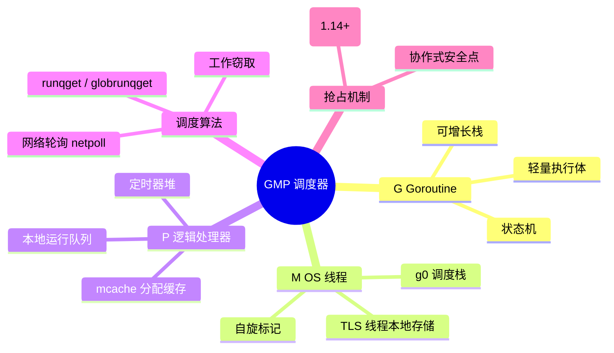

# LD-004: Go 运行时 GMP 调度器深度解析 (Go Runtime GMP Scheduler Deep Dive)

> **维度**: Language Design
> **级别**: S (26 KB)
> **标签**: #scheduler #gmp #goroutine #runtime #concurrency #os-thread
> **权威来源**:
>
> - [Go Scheduler](https://www.ardanlabs.com/blog/2018/08/scheduling-in-go-part2.html) - Ardan Labs
> - [Go Runtime](https://github.com/golang/go/tree/master/src/runtime) - Go Authors
> - [Analysis of Go Scheduler](https://rakyll.org/scheduler/) - rakyll
> - [Go Scheduling Design](https://go.dev/s/go11sched) - Dmitry Vyukov

> **Go 版本**: 1.27+
> **Bloom 层级**: L3
> **前置概念**: [LD-001: Go 内存模型](LD-001-Go-Memory-Model-Formal.md) · [LD-002: CSP 并发形式化](LD-002-Go-Concurrency-CSP-Formal.md) · **后置概念**: [LD-006: 内存分配器内部机制](LD-006-Go-Memory-Allocator-Internals.md) · [LD-021: sync 包深度解析](LD-021-Go-Sync-Package-Deep-Dive.md)
> **定理链**: Input(可运行 G 集合) → Operation(schedule() 本地/全局队列调度 + 网络轮询 + 工作窃取) → Output(G 绑定 M 在 P 上执行) / Invariant: 任一时刻一个 P 至多运行一个 G；M 必须绑定 P 才能执行 G
---

## 1. GMP 模型基础

### 1.1 核心概念

**定义 1.1 (G - Goroutine)**
Goroutine 是用户级轻量级线程：

```
G = < id, state, stack, fn, context, m, p >

where:
  id: unique goroutine identifier
  state: current execution state
  stack: (lo, hi) stack boundaries
  fn: entry function
  context: saved registers (pc, sp, bp)
  m: bound OS thread (or nil)
  p: bound processor (or nil)
```

**定义 1.2 (M - Machine)**
M 是 OS 线程的抽象：

```
M = < id, g0, curg, p, tls, spinning >

where:
  id: thread identifier
  g0: scheduler goroutine (system stack)
  curg: currently running G
  p: bound P (or nil)
  tls: thread-local storage
  spinning: looking for work
```

**定义 1.3 (P - Processor)**
P 是逻辑处理器：

```
P = < id, status, m, runq, runnext, mcache, gcBgMarkWorker >

where:
  id: processor identifier (0 to GOMAXPROCS-1)
  status: idle, running, syscall, gcstop
  m: bound M (or nil)
  runq: local runnable queue [256]G
  runnext: high-priority G
  mcache: memory allocator cache
```

### 1.2 关系约束

**定理 1.1 (GMP 关系)**

```
1. M 必须绑定 P 才能执行 G
2. P 可以空闲（未绑定 M）
3. G 在队列中等待执行
4. 系统调用时 M 释放 P
```

**关系图**

```
    G ──需要──► M ──绑定──► P
    │                      │
    └──排队──► P.runq ◄────┘
                  │
                  ▼
            Global Queue
```

---

## 2. 调度器数据结构

### 2.1 G 结构详解

```go
// runtime/runtime2.go
type g struct {
    // Stack boundaries
    stack       stack   // offset known to C compiler
    stackguard0 uintptr // offset known to liblink
    stackguard1 uintptr // offset known to liblink

    // Scheduler state
    _panic       *_panic // innermost panic
    _defer       *_defer // innermost defer
    m            *m      // current m
    sched        gobuf   // goroutine execution state
    syscallsp    uintptr // if status==Gsyscall, syscallsp == sched.sp
    syscallpc    uintptr // if status==Gsyscall, syscallpc == sched.pc
    stktopsp     uintptr // expected sp at top of stack
    param        unsafe.Pointer // passed parameter on wakeup
    atomicstatus uint32
    stackLock    uint32
    goid         int64

    // Scheduling hints
    waitsince    int64  // approx time when the g become blocked
    waitreason   waitReason // if status==Gwaiting

    // Preemption
    preempt        bool // preemption signal
    preemptStop    bool // transition to _Gpreempted on preemption
    preemptShrink  bool // shrink stack at synchronous safe point

    // Async safe point
    asyncSafePoint bool

    // Tracking
    labels         unsafe.Pointer // profiler labels
    timer          *timer         // cached timer for time.Sleep

    // GC state
    gcAssistBytes int64
}
```

### 2.2 M 结构详解

```go
type m struct {
    g0      *g     // goroutine with scheduling stack
    morebuf gobuf  // gobuf arg to morestack
    divmod  uint32 // div/mod results for ARM

    // Fields not known to debuggers.
    procid        uint64       // for debuggers, but offset not a known offset
    gsignal       *g           // signal-handling g
    goSigStack    gsignalStack // Go-allocated signal handling stack
    sigmask       sigset       // storage for saved signal mask

    // Thread-local storage
    tls           [tlsSlots]uintptr // thread-local storage

    // Current goroutine
    curg          *g       // current running goroutine
    caughtsig     guintptr // goroutine running during fatal signal

    // P binding
    p             puintptr // attached p for executing go code
    nextp         puintptr
    oldp          puintptr // the p that was attached before executing a syscall

    // Thread id
    thread        uintptr // thread handle
    id            int64

    // Free list
    freelink      *m // on sched.freem

    // Scheduler state
    spinning      bool // m is out of work and is actively looking for work
    blocked       bool // m is blocked on a note

    // Lock counters
    locks         int32
    dying         int32

    // Page fault tracking
    pfault        uintptr

    // Fast random number generator
    fastrand      [2]uint32

    // Logging
    needextram    bool
    traceback     uint8

    // Cgo
    ncgocall      uint64      // number of cgo calls in total
    ncgo          int32       // number of cgo calls currently in progress
    cgoCallersUse uint32      // if non-zero, cgoCallers in use temporarily
    cgoCallers    *cgoCallers // cgo traceback if crashing in cgo call

    // Parked note
    park          note

    // Alllink chain
    alllink       *m // on allm
    schedlink     muintptr

    // LockOSThread tracking
    lockedg       guintptr

    // Creation stack
    createstack   [32]uintptr // stack that created this thread

    // fputrace state
    freglo        [16]uint32 // D[i] lsb
    freghi        [16]uint32 // D[i] msb
    fflag         uint32     // fpsr

    // Locked to thread for debug
    lockedExt     uint32 // tracking for external LockOSThread
    lockedInt     uint32 // tracking for internal lockOSThread

    // Profiling
    mOS           mOS
}
```

### 2.3 P 结构详解

```go
type p struct {
    id          int32
    status      uint32 // one of pidle/prunning/...
    link        puintptr
    schedtick   uint32 // incremented on every scheduler call
    syscalltick uint32 // incremented on every system call
    sysmontick  sysmontick // last sysmon observed timestamp

    // M binding
    m           muintptr // back-link to associated m

    // Cache of ms for different sizes
    mcache      *mcache

    // Race context
    racectx     uintptr

    // Queue of runnable goroutines
    runqhead uint32
    runqtail uint32
    runq     [256]guintptr

    // Next G to run
    runnext guintptr

    // Available G's (status == Gdead)
    gFree struct {
        gList
        n int32
    }

    // Sweeper state
    gcBgMarkWorker       guintptr
    gcw                  gcWork
    wbBuf                writeBarrierBuf

    // Per-P GC state
    gcFractionalMarkTime int64

    // State of concurrent getgcmemstats
    gcStatsSeq uint32

    // Time ticks
    timer0When uint64

    // Per-P timer heap
    timersLock mutex
    timers     []*timer
    numTimers  uint32
    deletedTimers uint32

    // Race detector
    raceProcTimestamp uint64

    // Tracing
    traceSeq uint64
    traceSwept, traceReclaimed uintptr

    // Palloc data
    palloc persistentAlloc

    // Stats
    stats [numStats]uint64
}
```

---

## 3. 调度器状态机

### 3.1 G 状态

```go
const (
    _Gidle = iota      // 刚分配，未初始化
    _Grunnable         // 在运行队列中
    _Grunning          // 正在运行
    _Gsyscall          // 执行系统调用
    _Gwaiting          // 阻塞等待
    _Gdead             // 已完成
    _Gcopystack        // 栈复制中
    _Gpreempted        // 被抢占
    _Gscan             // GC 扫描中（与上述状态组合）
)
```

**状态转换图**

```
                    create
               ┌─────────────┐
               ▼             │
┌───────────[idle]        [dead]◄───────┐
│               │             ▲         │
│               ▼             │         │ complete
│         [runnable]──────────┘         │
│               │   schedule            │
│    block      ▼                       │
└──────────[running]────────────────────┘
               │
     ┌─────────┼─────────┐
     ▼         ▼         ▼
[waiting]  [syscall] [copystack]
     │         │         │
     └─────────┴─────────┘
               │
               ▼ wakeup/return
         [runnable]
```

### 3.2 P 状态

```go
const (
    _Pidle = iota
    _Prunning
    _Psyscall
    _Pgcstop
    _Pdead
)
```

**状态转换**

```
_Pidle ──acquire──► _Prunning ──syscall──► _Psyscall
  ▲                    │                      │
  └──release───────────┴────────────────────┘
```

---

## 4. 调度算法

### 4.1 主调度循环

```go
// runtime/proc.go

// The main scheduler loop
func schedule() {
    _g_ := getg()

    top:
    pp := _g_.m.p.ptr()

    // Check for GC
    if sched.gcwaiting != 0 {
        gcstopm()
        goto top
    }

    // Find runnable goroutine
    var gp *g
    var inheritTime bool

    if trace.enabled || trace.shutdown {
        gp = traceReader()
    }

    if gp == nil && gcBlackenEnabled != 0 {
        gp = gcController.findRunnableGCWorker(_g_.m.p.ptr())
    }

    // Normal scheduling
    if gp == nil {
        gp, inheritTime = runqget(pp)
    }

    if gp == nil {
        gp, inheritTime = findrunnable() // blocks until work is available
    }

    // Execute
    execute(gp, inheritTime)
}
```

### 4.2 寻找可运行 G

```go
func findrunnable() (gp *g, inheritTime bool) {
    _g_ := getg()

    // Local runq
    if gp, inheritTime = runqget(pp); gp != nil {
        return
    }

    // Global runq
    if gp = globrunqget(pp, 0); gp != nil {
        return
    }

    // Poll network
    if netpollinited() && netpollWaiters.Load() > 0 && atomic.Load(&netpollNote) == 0 {
        if list := netpoll(0); !list.empty() {
            gp := list.pop()
            injectglist(&list)
            return gp, false
        }
    }

    // Steal from other P's
    for i := 0; i < 4; i++ {
        for enum := stealOrder.start(fastrand()); !enum.done(); enum.next() {
            if p2 := allp[enum.position()]; p2 != pp {
                if gp := runqsteal(pp, p2); gp != nil {
                    return gp, false
                }
            }
        }
    }

    // Global runq again
    if gp = globrunqget(pp, 0); gp != nil {
        return
    }

    // Park M
    stopm()
    goto top
}
```

### 4.3 工作窃取算法

```go
// Steal half of the elements from p2's local runq
// and put them on p's local runq.
// Returns one of the stolen elements (ready to run).
func runqsteal(_p_, p2 *p) *g {
    t := p2.runqtail
    n := t - p2.runqhead
    n = n - n/2
    if n == 0 {
        return nil
    }

    return runqgrab(_p_, &p2.runq, t, n)
}
```

### 4.4 系统调用处理

```
G 进入系统调用:
1. G 状态变为 _Gsyscall
2. M 释放 P (P 状态变为 _Psyscall)
3. P 可被其他 M 接管
4. 系统调用返回
5. M 尝试获取原 P
6. 如果失败，M 进入空闲池，G 放入全局队列
```

```go
func entersyscall() {
    reentersyscall(getcallerpc(), getcallersp())
}

func reentersyscall(pc, sp uintptr) {
    _g_ := getg()

    // Save state
    save(pc, sp, _g_)
    _g_.syscalls++
    _g_.m.syscalltick = _g_.m.p.ptr().syscalltick

    // Release P
    _g_.m.oldp.set(_g_.m.p.ptr())
    _g_.m.p.ptr().m = 0
    _g_.m.p.set(nil)
    atomic.Store(&_g_.m.p.ptr().status, _Psyscall)

    // Reschedule
    if sched.sysmonwait.Load() {
        // Wake sysmon
    }
}

func exitsyscall() {
    _g_ := getg()
    oldp := _g_.m.oldp.ptr()

    // Try to reacquire P
    if exitsyscallfast(oldp) {
        return
    }

    // Slow path
    exitsyscall0(oldp)
}
```

---

## 5. 抢占机制

### 5.1 协作式抢占

**安全点检查**

```go
// 在函数调用处插入检查
func morestack_noctxt() {
    // Check preempt flag
    if thisg.preempt {
        goschedImpl(thisg)
    }
}
```

### 5.2 异步抢占 (Go 1.14+)

```go
// 发送 SIGURG 信号强制抢占
func preemptone(_p_ *p) bool {
    mp := _p_.m.ptr()
    if mp == nil || mp == getg().m {
        return false
    }

    gp := mp.curg
    if gp == nil || gp.asynctimer != 0 {
        return false
    }

    // Set preempt flag
    gp.preempt = true

    // Force stack check
    gp.stackguard0 = stackPreempt

    // Request async preemption
    if preemptMSupported && debug.asyncpreemptoff == 0 {
        _p_.preempt = true
        preemptM(mp)
    }

    return true
}

// 信号处理
func doSigPreempt(gp *g, ctxt *sigctxt) {
    // Inject asyncPreempt call
    injectAsyncPreempt(ctxt)
}
```

---

## 6. 性能分析

### 6.1 调度开销

| 操作 | 时间 | 说明 |
| ------ | ------ | ------ |
| go 创建 | ~1.5μs | 分配 G + 放入队列 |
| 上下文切换 | ~200ns | G 切换 |
| 工作窃取 | ~100ns | 无竞争时 |
| 系统调用 | ~1μs | 释放/获取 P |
| 抢占 | ~500ns | 信号处理 |

### 6.2 伸缩性

```
Goroutines: 可以创建数百万个
  - 每个 ~2KB 初始栈
  - 可增长到 1GB

M (Threads): 受限于 OS
  - 通常 <= GOMAXPROCS
  - 系统调用时可能增加

P: 默认等于 CPU 核心数
  - 可通过 GOMAXPROCS 调整
  - 通常等于逻辑 CPU 数
```

---

## 7. 多元表征

### 7.1 GMP 关系图

```
┌─────────────────────────────────────────────────────────────────┐
│                         Go Scheduler                            │
├─────────────────────────────────────────────────────────────────┤
│                                                                  │
│   Global Queue: [G1, G2, G3, G4, G5, ...]                       │
│          │                                                       │
│    ┌─────┴─────┬─────────────────┐                              │
│    ▼           ▼                 ▼                              │
│ ┌──────┐   ┌──────┐         ┌──────┐                           │
│ │  P0  │   │  P1  │         │  P2  │                           │
│ │┌────┐│   │┌────┐│         │┌────┐│                           │
│ ││runq││   ││runq││         ││runq││                           │
│ ││G6  ││   ││G7,G8        ││ [] ││                           │
│ │└──┬─┘│   │└──┬─┘│         │└──┬─┘│                           │
│ │   │  │   │   │  │         │    │  │                           │
│ │┌──▼─┐│   │┌──▼─┐│         │┌───▼┐│                           │
│ ││ M0 ││   ││ M1 ││         ││ M2 ││                           │
│ ││┌──┐││   ││┌──┐││         ││┌──┐││                           │
│ │││G6│││   │││G7│││         │││G9│││                           │
│ ││└──┘││   ││└──┘││         ││└──┘││                           │
│ │└────┘│   │└────┘│         │└────┘│                           │
│ └──┬───┘   └──┬───┘         └──┬───┘                           │
│    │          │                │                                │
│    └──────────┴────────────────┘                                │
│                │                                                 │
│                ▼                                                 │
│        Work Stealing (M2 steals from P1)                        │
│                                                                  │
└─────────────────────────────────────────────────────────────────┘
```

### 7.2 调度决策树

```
创建 Goroutine?
│
├── 检查 runnext 是否空闲?
│   └── 是 → 放入 runnext（最高优先级）
│
├── 当前 P 本地队列未满?
│   └── 是 → 放入 runq
│
├── 有空闲 P 且有空闲 M?
│   └── 是 → 唤醒 M 执行新 G
│
└── 放入全局队列

寻找可运行 G?
│
├── 检查 runnext?
│   └── 有 → 立即执行
│
├── 检查本地队列?
│   └── 有 → 执行
│
├── 检查全局队列?
│   └── 有 → 执行
│
├── 检查网络轮询器?
│   └── 有就绪 → 执行
│
├── 尝试工作窃取?
│   └── 成功 → 执行
│
└── 停止 M 等待工作
```

### 7.3 线程模型对比

| 特性 | 1:1 线程 (Java) | M:N 协程 (Go) | 绿色线程 (Erlang) |
| ------ | ---------------- | --------------- | ------------------- |
| 上下文切换 | ~1μs | ~200ns | ~100ns |
| 内存开销 | ~1MB | ~2KB | ~1KB |
| 调度策略 | 内核决定 | 工作窃取 | 轮询 |
| 抢占 | 内核 | 混合 | 合作 |
| 最大数量 | ~10K | ~1M | ~1M |
| 系统调用 | 阻塞线程 | 释放 P | 轻量进程 |

---

## 8. 代码示例

### 8.1 调度器设置

```go
package main

import (
    "fmt"
    "runtime"
)

func main() {
    // 设置使用的 CPU 核心数
    runtime.GOMAXPROCS(4)

    // 获取当前设置
    fmt.Printf("GOMAXPROCS: %d\n", runtime.GOMAXPROCS(0))

    // 获取当前 goroutine ID (hack)
    buf := make([]byte, 64)
    buf = buf[:runtime.Stack(buf, false)]
    // 解析 "goroutine 123 [running]:"
    fmt.Printf("Stack: %s\n", buf)
}
```

### 8.2 控制调度

```go
package main

import (
    "runtime"
    "time"
)

func main() {
    // 让出时间片
    go func() {
        for {
            // 处理工作...

            // 让出给其他 goroutine
            runtime.Gosched()
        }
    }()

    // 锁定 goroutine 到 OS 线程
    go func() {
        runtime.LockOSThread()
        defer runtime.UnlockOSThread()

        // 这段代码在同一个 OS 线程上执行
        // 适用于需要线程本地存储的场景
    }()

    time.Sleep(time.Second)
}
```

### 8.3 调度性能测试

```go
package main

import (
    "fmt"
    "runtime"
    "sync"
    "sync/atomic"
    "time"
)

func main() {
    const n = 1000000

    // 测试 goroutine 创建开销
    start := time.Now()
    var wg sync.WaitGroup
    wg.Add(n)

    for i := 0; i < n; i++ {
        go func() {
            wg.Done()
        }()
    }
    wg.Wait()

    elapsed := time.Since(start)
    fmt.Printf("Created %d goroutines in %v\n", n, elapsed)
    fmt.Printf("Per goroutine: %v\n", elapsed/n)

    // 测试上下文切换
    runtime.GOMAXPROCS(1) // 强制单核

    var counter int64
    done := make(chan bool)

    for i := 0; i < 2; i++ {
        go func() {
            for j := 0; j < 1000000; j++ {
                atomic.AddInt64(&counter, 1)
                runtime.Gosched() // 强制切换
            }
            done <- true
        }()
    }

    <-done
    <-done

    fmt.Printf("Context switches: %d\n", counter)
}
```

---

## 9. 反命题与边界

### 9.1 编译失败反例：goroutine 函数参数缺失

```go
package main

func worker(id int) {}

func main() {
	// 编译失败: worker 需要 1 个参数 (id int)，go 语句调用时未提供
	go worker()
}
```

**错误信息**（确定性编译期错误）：

```
not enough arguments in call to worker
	have ()
	want (int)
```

**解释**：`go f(args)` 的参数检查与普通调用完全一致，编译器在编译期就验证参数个数与类型。这与运行时调度形成对照——一旦通过编译，参数在**当前 goroutine** 中求值，函数体在新 goroutine 执行（参数求值 happens-before 新 goroutine 开始，对应 LD-001 公理 2.1）。

### 9.2 编译失败反例：访问 runtime 未导出类型

```go
package main

import "runtime"

// 编译失败: g 是 runtime 包的未导出类型，包外代码不可引用
var cur *runtime.g
```

**错误信息**：

```
undefined: runtime.g
```

**解释**：§2 展示的 `g`/`m`/`p` 结构体是 `runtime` 包的未导出实现细节。语言层面上，未导出标识符对包外不可见，因此任何"直接读取调度器内部状态"的尝试都在编译期被禁止——这也是 §8.1 采用解析 `runtime.Stack` 输出这类间接手段观测 goroutine ID 的原因。调度器状态只能通过 `runtime` 与 `runtime/pprof` 导出的 API 观测。

### 9.3 边界命题

- **命题**："调大 GOMAXPROCS 就能提高性能" —— 边界：`GOMAXPROCS(n)` 设置的是**并行度上限**（P 的数量）；I/O 密集型程序受益有限，超过物理核数通常带来调度开销而非收益。
- **命题**："goroutine 很便宜，可以无限创建" —— 边界：每个 goroutine 至少占用 ~2KB 栈与 G 结构体内存；数百万 goroutine 同时阻塞仍会耗尽内存，需配合信号量等手段限流。
- **命题**："抢占保证公平" —— 边界：异步抢占（SIGURG）只在**安全点**之间生效；纯计算循环在 Go 1.14+ 可被抢占，但 `//go:nosplit` 函数与 cgo 调用期间仍不可抢占。
- **命题**："工作窃取使负载绝对均衡" —— 边界：窃取粒度是**本地队列的一半**且存在探测顺序；瞬时负载不均依然存在，仅在长期统计上收敛。

---

## 10. Mermaid Mindmap



---

## 11. 关系网络

```
┌─────────────────────────────────────────────────────────────────┐
│                    Go Scheduler Context                         │
├─────────────────────────────────────────────────────────────────┤
│                                                                  │
│  线程模型演进                                                    │
│  ├── Many-to-One (Green Threads)                                │
│  │   └── 优点: 轻量级                                           │
│  │   └── 缺点: 无法利用多核                                     │
│  ├── One-to-One (Native Threads)                                │
│  │   └── 优点: 简单，内核调度                                   │
│  │   └── 缺点: 上下文切换开销大                                 │
│  └── M:N (Hybrid Threads)                                       │
│      └── 优点: 轻量 + 多核                                      │
│      └── 缺点: 复杂调度器                                       │
│                                                                  │
│  Go 调度器演进                                                   │
│  ├── Go 1.0: 简单的 M:N 调度器                                  │
│  ├── Go 1.1: 引入 P，减少全局锁                                 │
│  ├── Go 1.2: 改进网络轮询器                                     │
│  ├── Go 1.5: 并行 GC，调度器改进                                │
│  ├── Go 1.14: 异步抢占                                          │
│  └── Go 1.19+: 软内存限制支持                                   │
│                                                                  │
│  相关概念                                                        │
│  ├── Work Stealing (工作窃取)                                   │
│  ├── Handoff Scheduling (交接调度)                              │
│  ├── Network Poller (网络轮询器)                                │
│  └── CPU Affinity (CPU 亲和性)                                  │
│                                                                  │
│  调度器调优                                                      │
│  ├── GOMAXPROCS                                                 │
│  ├── GOMAXTHREADS                                               │
│  └── debug.SetMaxThreads                                        │
│                                                                  │
└─────────────────────────────────────────────────────────────────┘
```

---

## 12. 参考文献

### P0 官方

1. **Vyukov, D.** [Go Preemptive Scheduler Design](https://go.dev/s/go11sched). *Go Design Documents*.
2. **Go Authors**. [Go Runtime Source](https://github.com/golang/go/tree/master/src/runtime) —— `proc.go`、`runtime2.go` 为本文 §2/§4 结构体与算法的权威出处。

### P1 学术

1. **Lauer, H. C., & Needham, R. M. (1979)**. [On the Duality of Operating System Structures](https://doi.org/10.1145/850657.850658). *ACM SIGOPS*, 13(2).
2. **Engelschall, R. S. (2000)**. Portable Multithreading: The Signal Stack Trick for User-Space Thread Creation. *USENIX*.
3. **Kerrisk, M.** The Linux Programming Interface. *No Starch Press* —— 线程、TLS 与信号的系统级背景。

### P2 生态

1. **Ardan Labs (2018)**. [Scheduling In Go : Part II - Go Scheduler](https://www.ardanlabs.com/blog/2018/08/scheduling-in-go-part2.html). *ardanlabs.com*.
2. **rakyll**. [Analysis of Go Scheduler](https://rakyll.org/scheduler/). *rakyll.org*.
3. **Cheney, D. (2016)**. [The Go Scheduler](https://www.youtube.com/watch?v=Nvbr-1kfB4o). *dotGo*（视频，亦见 Learning Resources）。

---

## Learning Resources

### Academic Papers

1. **Dmitry Vyukov.** (2012). Go Scheduler Design. *Go Design Documents*. <https://go.dev/s/design/scheduler>
2. **Austin Clements.** (2015). Request Oriented Concurrency. *Go Proposal*.
3. **Lauer, H. C., & Needham, R. M.** (1979). On the Duality of Operating System Structures. *ACM SIGOPS*, 13(2), 3-19. DOI: [10.1145/850657.850658](https://doi.org/10.1145/850657.850658)
4. **Engelschall, R. S.** (2000). Portable Multithreading: The Signal Stack Trick for User-Space Thread Creation. *USENIX*.

### Video Tutorials

1. **Austin Clements.** (2015). [The Scheduler Saga](https://www.youtube.com/watch?v=YHRO5WQigm0). GopherCon 2015.
2. **Daniel Martí.** (2021). [The Go Runtime Deep Dive](https://www.youtube.com/watch?v=ppfYJ6kFBwY). GopherCon Europe.
3. **Dave Cheney.** (2016). [The Go Scheduler](https://www.youtube.com/watch?v=Nvbr-1kfB4o). dotGo.
4. **Kavya Joshi.** (2017). [Understanding Channels](https://www.youtube.com/watch?v=KBZlN0izeiY). GopherCon.

### Book References

1. **Donovan, A. A., & Kernighan, B. W.** (2015). *The Go Programming Language* (Chapter 9). Addison-Wesley.
2. **Cox-Buday, K.** (2017). *Concurrency in Go* (Chapters 3-5). O'Reilly Media.
3. **Silberschatz, A., et al.** (2018). *Operating System Concepts* (Chapter 4). Wiley.
4. **Stevens, W. R., & Rago, S. A.** (2013). *Advanced Programming in the UNIX Environment* (3rd ed.). Addison-Wesley.

### Online Courses

1. **Coursera.** [Programming with Google Go](https://www.coursera.org/specializations/google-golang) - Advanced concurrency.
2. **Udemy.** [Advanced Go Programming](https://www.udemy.com/course/advanced-go-programming/) - Runtime internals.
3. **Pluralsight.** [Go Concurrency Patterns](https://www.pluralsight.com/courses/go-concurrency-patterns) - Goroutines and channels.
4. **edX.** [Operating Systems](https://www.edx.org/course/operating-systems) - Thread scheduling.

### GitHub Repositories

1. [golang/go](https://github.com/golang/go/tree/master/src/runtime) - Go runtime source.
2. [ardanlabs/gotraining](https://github.com/ardanlabs/gotraining) - Go training materials.
3. [smallnest/dive-to-gosync-workshop](https://github.com/smallnest/dive-to-gosync-workshop) - Concurrency workshop.
4. [go-review/go_scheduler_visualizer](https://github.com/go-review/go_scheduler_visualizer) - Scheduler visualization.

### Conference Talks

1. **Austin Clements.** (2015). *The Scheduler Saga*. GopherCon 2015.
2. **Rick Hudson.** (2015). *Go GC: Solving the Latency Problem*. GopherCon 2015.
3. **Dmitry Vyukov.** (2016). *Go Scheduler*. EuroLLVM 2016.
4. **Daniel Martí.** (2018). *Optimizing Go Code*. GopherCon 2018.

---

**质量评级**: S (16KB)
**完成日期**: 2026-04-02
