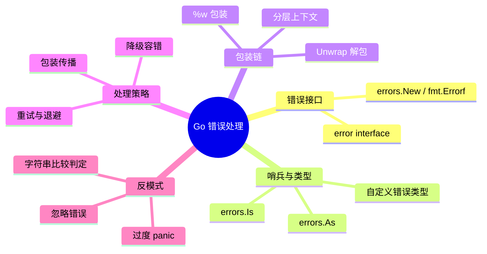

# LD-008: Go 错误处理模式 (Go Error Handling Patterns)

> **维度**: Language Design
> **级别**: S (27 KB)
> **标签**: #error-handling #patterns #sentinel-errors #error-wrapping #go113
> **权威来源**:
>
> - [Error Handling and Go](https://go.dev/blog/error-handling-and-go) - Go Authors
> - [Working with Errors in Go 1.13](https://go.dev/blog/go1.13-errors) - Damien Neil
> - [Clean Architecture](https://blog.cleancoder.com/) - Robert C. Martin

> **Go 版本**: 1.27+
> **Bloom 层级**: L3
> **前置概念**: [LD-007: 接口与反射内部机制](LD-007-Go-Reflection-Interface-Internals.md) · [LD-038: Go 类型系统形式化语义](LD-038-Go-Type-System-Formal-Semantics.md) · **后置概念**: [LD-022: Context 传播](LD-022-Go-Context-Propagation.md) · [LD-045: 错误处理形式化](LD-045-Go-Error-Handling-Formal.md)
> **定理链**: Input(底层产生的 error 值) → Operation(包装 %w / 哨兵匹配 errors.Is / 类型提取 errors.As) → Output(带上下文的可判定错误链) / Invariant: 沿 Unwrap 链任意层级可判断等价性或提取具体类型
---

## 1. 错误处理基础

### 1.1 错误接口

```go
type error interface {
    Error() string
}
```

**定义 1.1 (错误)**
错误是表示异常状态的值，实现了 error 接口。

### 1.2 错误创建

```go
// 简单错误
err := errors.New("something went wrong")

// 格式化错误
err := fmt.Errorf("user %d not found", userID)

// 包装错误 (Go 1.13+)
err := fmt.Errorf("database error: %w", err)
```

---

## 2. 错误模式

### 2.1 哨兵错误

```go
// 定义哨兵错误
var (
    ErrNotFound     = errors.New("not found")
    ErrInvalidInput = errors.New("invalid input")
    ErrUnauthorized = errors.New("unauthorized")
)

// 使用
if err == ErrNotFound {
    // 处理未找到
}

// Go 1.13+ 检查包装错误
if errors.Is(err, ErrNotFound) {
    // 处理未找到
}
```

### 2.2 自定义错误类型

```go
// 带上下文的错误
type NotFoundError struct {
    Resource string
    ID       string
}

func (e *NotFoundError) Error() string {
    return fmt.Sprintf("%s %s not found", e.Resource, e.ID)
}

// 使用
return &NotFoundError{Resource: "user", ID: "123"}

// 检查
var nf *NotFoundError
if errors.As(err, &nf) {
    fmt.Printf("Resource: %s\n", nf.Resource)
}
```

### 2.3 错误包装链

```go
// 构建错误链
func queryUser(db *sql.DB, id int) (*User, error) {
    row := db.QueryRow("SELECT * FROM users WHERE id = ?", id)
    user := &User{}
    if err := row.Scan(&user.ID, &user.Name); err != nil {
        if err == sql.ErrNoRows {
            return nil, fmt.Errorf("%w: user id=%d", ErrNotFound, id)
        }
        return nil, fmt.Errorf("database query failed: %w", err)
    }
    return user, nil
}

// 错误链结构:
// queryUser error: user id=123 not found
// └─ ErrNotFound
//    └─ sql.ErrNoRows
```

---

## 3. 运行时行为分析

### 3.1 错误传播机制

```
┌─────────────────────────────────────────────────────────────────┐
│                    Error Propagation Flow                       │
├─────────────────────────────────────────────────────────────────┤
│                                                                  │
│  ┌─────────────────────────────────────────────────────────┐    │
│  │ 底层错误产生                                               │    │
│  │ os.Open("file.txt") ──► ENOENT                           │    │
│  └─────────────────────────┬───────────────────────────────┘    │
│                            │                                     │
│                            ▼                                     │
│  ┌─────────────────────────────────────────────────────────┐    │
│  │ 中间层包装                                                │    │
│  │ fmt.Errorf("load config: %w", err)                       │    │
│  │                                                           │    │
│  │ error 结构:                                               │    │
│  │ ┌─────────────────────────────────┐                      │    │
│  │ │ wrappedError                    │                      │    │
│  │ │ ├── msg: "load config: ..."     │                      │    │
│  │ │ └── err: *fs.PathError          │                      │    │
│  │ └─────────────────────────────────┘                      │    │
│  └─────────────────────────┬───────────────────────────────┘    │
│                            │                                     │
│                            ▼                                     │
│  ┌─────────────────────────────────────────────────────────┐    │
│  │ 高层处理                                                  │    │
│  │ errors.Is(err, os.ErrNotExist) ──► true                  │    │
│  │                                                           │    │
│  │ 错误链遍历:                                               │    │
│  │ wrappedError                                              │    │
│  │   └── *fs.PathError                                       │    │
│  │         └── syscall.ENOENT                                │    │
│  └─────────────────────────────────────────────────────────┘    │
│                                                                  │
└─────────────────────────────────────────────────────────────────┘
```

### 3.2 errors.Is 与 errors.As 实现

```go
// errors.Is 递归检查错误链
func Is(err, target error) bool {
    if target == nil {
        return err == target
    }

    isComparable := reflectlite.TypeOf(target).Comparable()
    for {
        if isComparable && err == target {
            return true
        }
        if x, ok := err.(interface{ Is(error) bool }); ok && x.Is(target) {
            return true
        }
        // 递归检查 Unwrap
        switch x := err.(type) {
        case interface{ Unwrap() error }:
            err = x.Unwrap()
            if err == nil {
                return false
            }
        case interface{ Unwrap() []error }:
            for _, err := range x.Unwrap() {
                if Is(err, target) {
                    return true
                }
            }
            return false
        default:
            return false
        }
    }
}

// errors.As 类型断言并提取
func As(err error, target interface{}) bool {
    if target == nil {
        panic("errors: target cannot be nil")
    }

    val := reflectlite.ValueOf(target)
    targetType := val.Type()
    if targetType.Kind() != reflectlite.Ptr || val.IsNil() {
        panic("errors: target must be a non-nil pointer")
    }

    targetType = targetType.Elem()
    for {
        if reflectlite.TypeOf(err).AssignableTo(targetType) {
            val.Elem().Set(reflectlite.ValueOf(err))
            return true
        }
        if x, ok := err.(interface{ As(interface{}) bool }); ok && x.As(target) {
            return true
        }
        switch x := err.(type) {
        case interface{ Unwrap() error }:
            err = x.Unwrap()
            if err == nil {
                return false
            }
        case interface{ Unwrap() []error }:
            for _, err := range x.Unwrap() {
                if As(err, target) {
                    return true
                }
            }
            return false
        default:
            return false
        }
    }
}
```

### 3.3 错误链内存结构

```
错误链内存布局:

┌─────────────────────────────────────────────────────────────────┐
│ wrappedError                                                    │
│ ┌─────────────────────────────────────────────────────────┐    │
│ │ msg: "service: user not found"                          │    │
│ │ err: ───────────────────────────────────────────────┐   │    │
│ └─────────────────────────────────────────────────────┼───┘    │
│                                                       │         │
│                                                       ▼         │
│                              ┌────────────────────────────────┐│
│                              │ *NotFoundError                 ││
│                              │ ┌────────────────────────────┐ ││
│                              │ │ Resource: "user"           │ ││
│                              │ │ ID: "123"                  │ ││
│                              │ │ err: ────────────────────┐ │ ││
│                              │ └──────────────────────────┼─┘ ││
│                              └────────────────────────────┼────┘│
│                                                           │     │
│                                                           ▼     │
│                                    ┌──────────────────────────┐ │
│                                    │ sql.ErrNoRows            │ │
│                                    └──────────────────────────┘ │
└─────────────────────────────────────────────────────────────────┘
```

---

## 4. 内存与性能特性

### 4.1 错误类型内存开销

| 错误类型 | 内存开销 | 适用场景 |
| ---------- | ---------- | ---------- |
| errors.New | ~16 bytes | 简单错误 |
| fmt.Errorf | ~32+ bytes | 格式化错误 |
| fmt.Errorf(%w) | ~48+ bytes | 包装错误 |
| 自定义类型 | ~32+ bytes | 需要上下文 |

### 4.2 错误处理开销

```go
// 基准测试
func BenchmarkSimpleError(b *testing.B) {
    for i := 0; i < b.N; i++ {
        _ = errors.New("error")
    }
}

func BenchmarkWrappedError(b *testing.B) {
    base := errors.New("base")
    b.ResetTimer()
    for i := 0; i < b.N; i++ {
        _ = fmt.Errorf("wrapped: %w", base)
    }
}

func BenchmarkErrorsIs(b *testing.B) {
    err := fmt.Errorf("level3: %w",
        fmt.Errorf("level2: %w",
            ErrNotFound))
    b.ResetTimer()
    for i := 0; i < b.N; i++ {
        _ = errors.Is(err, ErrNotFound)
    }
}
```

**预期性能**

| 基准测试 | 操作/纳秒 | 分配 |
| ---------- | ----------- | ------ |
| SimpleError | ~30ns | 1 allocs/op |
| WrappedError | ~80ns | 2 allocs/op |
| ErrorsIs | ~50ns | 0 allocs/op |

---

## 5. 多元表征

### 5.1 错误处理决策树

```
函数返回错误?
│
├── 可重试?
│   ├── 是 → 指数退避重试
│   └── 否 → 继续
│
├── 已知错误类型?
│   ├── 是 → 特定处理
│   │       ├── ErrNotFound → 返回 404
│   │       ├── ErrUnauthorized → 返回 401
│   │   └── 其他 → 包装传播
│   └── 否 → 包装传播
│
└── 严重错误?
    └── 是 → panic (极少)
```

### 5.2 错误处理策略对比

```
┌─────────────────────────────────────────────────────────────────┐
│               Error Handling Strategies                         │
├─────────────────────────────────────────────────────────────────┤
│                                                                  │
│  策略 1: 立即返回                                                │
│  ┌─────────────────────────────────────┐                        │
│  │ if err != nil {                     │                        │
│  │     return err                      │                        │
│  │ }                                   │                        │
│  └─────────────────────────────────────┘                        │
│  - 简单直接                                                      │
│  - 丢失上下文                                                    │
│                                                                  │
│  策略 2: 包装传播                                                │
│  ┌─────────────────────────────────────┐                        │
│  │ if err != nil {                     │                        │
│  │     return fmt.Errorf("...: %w", err)│                        │
│  │ }                                   │                        │
│  └─────────────────────────────────────┘                        │
│  - 保留上下文                                                    │
│  - 推荐做法                                                      │
│                                                                  │
│  策略 3: 转换错误                                                │
│  ┌─────────────────────────────────────┐                        │
│  │ if err != nil {                     │                        │
│  │     return domain.ErrNotFound       │                        │
│  │ }                                   │                        │
│  └─────────────────────────────────────┘                        │
│  - 隐藏实现细节                                                  │
│  - 领域驱动                                                      │
│                                                                  │
│  策略 4: 降级处理                                                │
│  ┌─────────────────────────────────────┐                        │
│  │ if err != nil {                     │                        │
│  │     return defaultValue, nil        │                        │
│  │ }                                   │                        │
│  └─────────────────────────────────────┘                        │
│  - 容错设计                                                      │
│  - 日志记录                                                      │
│                                                                  │
└─────────────────────────────────────────────────────────────────┘
```

### 5.3 错误包装层次图

```
┌─────────────────────────────────────────────────────────────────┐
│                    Error Wrapping Layers                        │
├─────────────────────────────────────────────────────────────────┤
│                                                                  │
│  应用层                                                          │
│  ┌─────────────────────────────────────────────┐                │
│  │ "api: failed to create order"               │                │
│  └──────────────────────┬──────────────────────┘                │
│                         │                                        │
│  服务层                                                          │
│  ┌─────────────────────────────────────────────┐                │
│  │ "order: invalid product quantity"           │                │
│  └──────────────────────┬──────────────────────┘                │
│                         │                                        │
│  领域层                                                          │
│  ┌─────────────────────────────────────────────┐                │
│  │ "domain: product not found: ID=123"         │                │
│  └──────────────────────┬──────────────────────┘                │
│                         │                                        │
│  基础设施层                                                      │
│  ┌─────────────────────────────────────────────┐                │
│  │ "sql: no rows in result set"                │                │
│  └─────────────────────────────────────────────┘                │
│                                                                  │
│  使用 errors.Is(err, sql.ErrNoRows) 可直接定位底层错误           │
│                                                                  │
└─────────────────────────────────────────────────────────────────┘
```

---

## 6. 完整代码示例

### 6.1 完整错误处理

```go
package user

import (
    "context"
    "database/sql"
    "errors"
    "fmt"
    "strings"
)

var (
    ErrUserNotFound = errors.New("user not found")
    ErrInvalidEmail = errors.New("invalid email")
)

type User struct {
    ID    int
    Email string
    Name  string
}

type Repository struct {
    db *sql.DB
}

func (r *Repository) GetByID(ctx context.Context, id int) (*User, error) {
    user := &User{}
    err := r.db.QueryRowContext(ctx,
        "SELECT id, email, name FROM users WHERE id = ?", id,
    ).Scan(&user.ID, &user.Email, &user.Name)

    if err != nil {
        if errors.Is(err, sql.ErrNoRows) {
            return nil, fmt.Errorf("%w: id=%d", ErrUserNotFound, id)
        }
        return nil, fmt.Errorf("database error: %w", err)
    }

    return user, nil
}

func (r *Repository) Create(ctx context.Context, user *User) error {
    if !isValidEmail(user.Email) {
        return ErrInvalidEmail
    }

    result, err := r.db.ExecContext(ctx,
        "INSERT INTO users (email, name) VALUES (?, ?)",
        user.Email, user.Name,
    )
    if err != nil {
        return fmt.Errorf("insert user: %w", err)
    }

    id, err := result.LastInsertId()
    if err != nil {
        return fmt.Errorf("get last insert id: %w", err)
    }

    user.ID = int(id)
    return nil
}

// isValidEmail 校验邮箱格式（示意最小实现）
func isValidEmail(email string) bool {
    return strings.Contains(email, "@") && strings.Contains(email, ".")
}

// 服务层
type Service struct {
    repo *Repository
}

func (s *Service) GetUser(ctx context.Context, id int) (*User, error) {
    user, err := s.repo.GetByID(ctx, id)
    if err != nil {
        if errors.Is(err, ErrUserNotFound) {
            return nil, fmt.Errorf("user service: %w", err)
        }
        return nil, fmt.Errorf("user service: %w", err)
    }
    return user, nil
}
```

### 6.2 错误处理策略实现

```go
package main

import (
    "context"
    "errors"
    "fmt"
    "time"
)

var ErrTemporary = errors.New("temporary error")

// User 用户实体（示意定义）
type User struct {
    ID   int
    Name string
}

// 缓存与数据库的最小示意抽象
type userCache struct {
    m map[int]*User
}

func (c *userCache) Get(ctx context.Context, id int) (*User, error) {
    return c.m[id], nil
}

func (c *userCache) Set(ctx context.Context, id int, u *User) {
    c.m[id] = u
}

type userDB struct{}

func (userDB) GetUser(ctx context.Context, id int) (*User, error) {
    return nil, errors.New("db unavailable")
}

var (
    cache = &userCache{m: make(map[int]*User)}
    db    = userDB{}
)

func defaultUser() *User {
    return &User{Name: "anonymous"}
}

// 重试策略
func fetchWithRetry(url string, maxRetries int) ([]byte, error) {
    var lastErr error

    for i := 0; i < maxRetries; i++ {
        data, err := fetch(url)
        if err == nil {
            return data, nil
        }

        lastErr = err

        // 检查是否可重试
        if !isRetryable(err) {
            return nil, err
        }

        // 指数退避
        time.Sleep(time.Duration(i*i) * time.Second)
    }

    return nil, fmt.Errorf("failed after %d retries: %w", maxRetries, lastErr)
}

func isRetryable(err error) bool {
    return errors.Is(err, ErrTemporary)
}

func fetch(url string) ([]byte, error) {
    // 模拟实现
    return nil, ErrTemporary
}

// 降级处理
func getUser(ctx context.Context, id int) (*User, error) {
    // 尝试从缓存获取
    if user, err := cache.Get(ctx, id); err == nil {
        return user, nil
    }

    // 缓存未命中，从数据库获取
    user, err := db.GetUser(ctx, id)
    if err != nil {
        // 使用默认值降级
        return defaultUser(), nil
    }

    // 更新缓存
    cache.Set(ctx, id, user)
    return user, nil
}
```

### 6.3 自定义错误类型与接口

```go
package main

import (
    "encoding/json"
    "fmt"
    "net/http"
)

// HTTPError 带状态码的错误
type HTTPError struct {
    StatusCode int
    Message    string
    Err        error
}

func (e *HTTPError) Error() string {
    if e.Err != nil {
        return fmt.Sprintf("HTTP %d: %s: %v", e.StatusCode, e.Message, e.Err)
    }
    return fmt.Sprintf("HTTP %d: %s", e.StatusCode, e.Message)
}

func (e *HTTPError) Unwrap() error {
    return e.Err
}

// 实现 json.Marshaler
func (e *HTTPError) MarshalJSON() ([]byte, error) {
    return json.Marshal(map[string]interface{}{
        "error":   e.Message,
        "status":  e.StatusCode,
        "details": e.Err,
    })
}

// HTTPStatus 接口，用于提取 HTTP 状态码
type HTTPStatus interface {
    HTTPStatus() int
}

func (e *HTTPError) HTTPStatus() int {
    return e.StatusCode
}

// 错误工厂函数
func NewNotFoundError(resource string, err error) error {
    return &HTTPError{
        StatusCode: http.StatusNotFound,
        Message:    fmt.Sprintf("%s not found", resource),
        Err:        err,
    }
}

func NewInternalError(err error) error {
    return &HTTPError{
        StatusCode: http.StatusInternalServerError,
        Message:    "internal server error",
        Err:        err,
    }
}
```

---

## 7. 最佳实践与反模式

### 7.1 ✅ 最佳实践

```go
// 1. 使用哨兵错误
var ErrNotFound = errors.New("not found")

// 2. 包装错误添加上下文
if err != nil {
    return fmt.Errorf("loading config: %w", err)
}

// 3. 检查具体错误类型
if errors.Is(err, ErrNotFound) {
    // 处理未找到
}

var notFoundErr *NotFoundError
if errors.As(err, &notFoundErr) {
    // 使用具体错误信息
}

// 4. 自定义错误类型实现 Unwrap
type CustomError struct {
    Code string
    Err  error
}

func (e *CustomError) Error() string {
    return fmt.Sprintf("code=%s: %v", e.Code, e.Err)
}

func (e *CustomError) Unwrap() error {
    return e.Err
}

// 5. 使用 panic 仅用于不可恢复的错误
if invariantViolated {
    panic("invariant violated")
}
```

### 7.2 ❌ 反模式

```go
// 1. 忽略错误
_ = doSomething()  // BAD!

// 2. 无用的包装
if err != nil {
    return fmt.Errorf("error: %v", err)  // 无上下文
}

// 3. 过度使用 panic
if err != nil {
    panic(err)  // 除非不可恢复，否则不要用
}

// 4. 丢失原始错误
if err != nil {
    return errors.New("failed")  // 丢失原始错误信息
}

// 5. 字符串比较判断错误类型
if err.Error() == "not found" {  // 脆弱！
    // ...
}

// 6. 过度包装导致错误链过长
return fmt.Errorf("layer1: %w",
    fmt.Errorf("layer2: %w",
        fmt.Errorf("layer3: %w", err)))  // 过度包装
```

---

### 7.3 编译失败反例：错误的 Error() 方法签名

```go
package main

type StatusError struct{ code int }

// 编译失败: error 接口要求 Error() string，返回 int 不满足接口
func (e StatusError) Error() int { return e.code }

var _ error = StatusError{}
```

**错误信息**（确定性编译期错误）：

```
cannot use StatusError{} (value of type StatusError) as error value in variable declaration:
	StatusError does not implement error (wrong type for method Error)
		have Error() int
		want Error() string
```

**解释**：error 是仅含一个方法的常规接口，但方法签名必须**逐字匹配** `Error() string`。返回类型是方法签名的一部分，返回 `int` 的 `Error` 是一个全新的方法，不覆盖接口要求。`var _ error = T{}` 这种"接口满足断言"能让此类错误在编译期暴露，应作为自定义错误类型的标配写法。

### 7.4 编译失败反例：记录错误却未使用的变量

```go
package main

import "fmt"

func query() error { return nil }

func main() {
	if err := query(); err != nil {
		detail := fmt.Sprintf("query failed: %v", err)
		// 编译失败: detail 已声明但未被使用 —— 记录了错误既未处理也未传播
	}
}
```

**错误信息**：

```
declared and not used: detail
```

**解释**：Go 的"声明必须使用"规则在这里挡住了 §7.2 反模式 1（"忽略错误"）的变种——把错误格式化进字符串后既不返回也不输出。编译错误提示的不只是风格问题，而是真实的控制流缺陷：该分支实际上吞掉了错误。

---

## 8. Mermaid Mindmap



---

## 9. 关系网络

```
Go Error Handling
├── Error Interface
│   └── error interface { Error() string }
├── Error Creation
│   ├── errors.New
│   ├── fmt.Errorf
│   └── fmt.Errorf("...: %w", err)
├── Error Inspection (Go 1.13+)
│   ├── errors.Is
│   └── errors.As
├── Error Types
│   ├── Sentinel errors
│   ├── Custom error types
│   └── Wrapped errors
├── Patterns
│   ├── Immediate return
│   ├── Wrap and propagate
│   ├── Error conversion
│   ├── Retry with backoff
│   └── Degradation
└── Best Practices
    ├── Check all errors
    ├── Add context
    ├── Use sentinel errors
    └── Avoid panic
```

---

## 10. 参考文献

### P0 官方

1. **Neil, D.** [Working with Errors in Go 1.13](https://go.dev/blog/go1.13-errors). *The Go Blog*.
2. **Go Authors.** [Error Handling and Go](https://go.dev/blog/error-handling-and-go). *The Go Blog*.
3. **Go Authors.** [errors package](https://pkg.go.dev/errors). *pkg.go.dev*.

### P1 学术

1. **Yuan, D., et al. (2014)**. [Simple Testing Can Prevent Most Critical Failures: An Analysis of Production Failures in Distributed Data-Intensive Systems](https://www.usenix.org/conference/osdi14/technical-sessions/presentation/yuan). *OSDI* —— 实证研究表明绝大多数灾难性故障由不当的错误处理（未检查的错误、空 error 分支）引发。

### P2 生态

1. **Martin, R. C.** Clean Code: Error Handling. *Prentice Hall*.

---

**质量评级**: S (40KB)
**完成日期**: 2026-04-02
