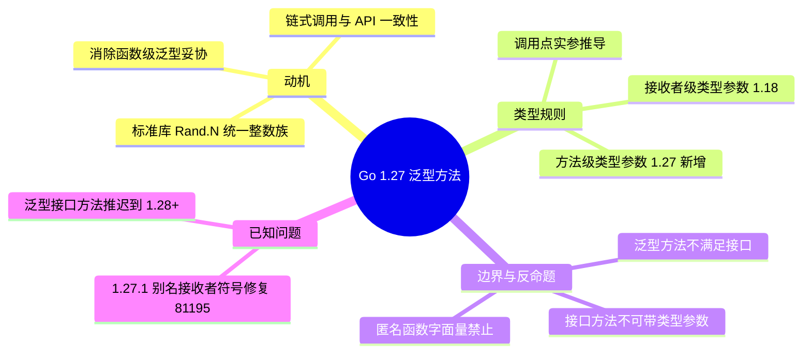

# LD-037: Go 1.27 泛型方法（Generic Methods）

> **维度**: Language Design
> **级别**: B (5 KB)
> **标签**: #ld
> **Go 版本**: 1.27+
> **Bloom 层级**: L4   <!-- L4 形式化层：类型系统扩展 -->
> **前置概念**: [LD-040 泛型形式化](LD-040-Go-Generics-Formal.md) | **后置概念**: [03-Evolution/07](03-Evolution/07-Go126-to-Go127.md) · [examples/go127-features](../../examples/go127-features/README.md)
> **定理链**: 类型参数列表 → 方法接收者泛型化 → 调用点类型推断 → 接口方法集兼容检查
**Go版本**: Go 1.27 / 1.27.1
**日期**: 2026-08
**提案**: [golang/go#77273](https://github.com/golang/go/issues/77273)
**形式化分析**: [Go-1.27-Release.md](../../view/formal/Go/Go-1.27-Release.md) §1.1
**可运行示例**: [examples/go127-features](../../examples/go127-features)
**前置知识**: LD-035（Go 1.26 新表达式编译器语义）、泛型类型参数（Go 1.18+）

---

## 1. 动机：为什么需要泛型方法

Go 1.18 引入泛型，但只允许**类型**拥有类型参数。方法要表达"与接收者类型参数无关的通用性"时，只能退化为泛型函数 + 显式传参：

```go
type Set[T comparable] struct{ m map[T]struct{} }

// 妥协写法：函数级泛型，receiver 变成普通参数
func MapKeys[K comparable, V any](m map[K]V) []K { ... }
```

这带来三个问题：

1. **API 不一致**：有的操作是方法、有的却是函数；
2. **链式调用断裂**：`s.Drain(...)` 无法表达；
3. **标准库受限**：`math/rand/v2.Rand` 需要为每种整数类型写 `IntN/Uint32N/Uint64N...`，而泛型方法一个签名即可覆盖。

1.27 后：方法可声明自己的类型参数。

## 2. 类型规则

### 2.1 基本形式

```go
func (recv T[τ̄]) M[α 𝒞](params...) results...
//                ^^^^^ 方法级类型参数（Go 1.27 新增）
```

- `T[τ̄]` 是接收者基类型的实例化，τ̄ 即类型声明的类型参数（沿用 1.18 规则）。
- `[α 𝒞]` 是**方法级**类型参数，约束 𝒞 与类型级约束同一套体系。
- 调用时方法级实参由**实参推导**（Go 1.27 同时泛化了函数赋值/转换场景的类型推断）。

### 2.2 合法与非法

| 形式 | 状态 |
| ------ | ------ |
| 具名类型的泛型方法 | ✅ |
| 泛型类型的方法使用接收者级 T | ✅（1.18 即可） |
| 方法级类型参数与接收者级无关 | ✅（1.27 新增） |
| 接口方法声明类型参数 | ❌ `interface { M[T any](T) }` 非法 |
| 泛型方法满足接口 | ❌ 方法集匹配要求精确签名 |
| 匿名函数字面量带类型参数 | ❌（1.27 仍不允许，泛型函数必须具名） |
| 方法级参数遮蔽接收者级参数 | ❌ 编译错误 |
| 内嵌/提升泛型方法 | 有限制：通过内嵌获得的泛型方法不可被接口 satisfaction 使用 |

### 2.3 与泛型类型的对比

| | 泛型类型（1.18） | 泛型方法（1.27） |
| --- | --- | --- |
| 类型参数归属 | 类型声明 | 单个方法 |
| 实例化单位 | `Stack[int]{}` | `s.Drain[int]`（通常由实参推导） |
| 零值语义 | 每个实例化是不同类型 | 同一类型的不同方法集视图 |
| 与接口交互 | 泛型类型可实现接口 | 泛型方法**不能**用于满足接口 |

## 3. 标准库首个用例：`math/rand/v2.Rand.N`

```go
// 1.26 之前需要一组方法：
r.IntN(100)      // int
r.Uint32N(100)   // uint32
r.Uint64N(100)   // uint64
...

// 1.27 一个泛型方法全部覆盖：
func (r *Rand) N[Int intType](n Int) Int

n32 := r.N(uint32(100))     // Int = uint32
n64 := r.N(int64(1<<40))    // Int = int64
```

`intType` 是标准库内部的整数约束（`~int | ~int8 | ... | ~uintptr`）。

## 4. 实践示例

### 4.1 集合变换

```go
type Stack[T any] struct{ items []T }

func (s *Stack[T]) Drain[U any](convert func(T) U) []U {
    out := make([]U, 0, len(s.items))
    for _, v := range s.items { out = append(out, convert(v)) }
    s.items = nil
    return out
}

s := Stack[int]{}
s.Push(1); s.Push(2)
strs := s.Drain(strconv.Itoa) // U 推导为 string，无需显式 [string]
```

### 4.2 类型安全的取值

```go
type Row struct{ cells map[string]any }

func (r Row) Get[T any](key string) (T, bool) {
    v, ok := r.cells[key]
    if !ok { var zero T; return zero, false }
    t, ok := v.(T)
    return t, ok
}

name, _ := row.Get[string]("name")  // 省去类型断言样板
```

## 5. 常见误区

1. **"泛型方法让接口也泛型了"**——没有。`interface { M[T any](T) }` 仍是非法；接口的方法集只含非泛型签名。
2. **"可以用泛型方法实现 io.Reader 之类"**——不能。`Read[ T]` 无法满足 `Read(p []byte)` 接口。
3. **"推导总免显式实参"**——仅在实参可推导时；无参调用需显式：`s.Drain[string](nil)`。
4. **1.27.1 修复**：泛型方法的指针别名接收者存在链接符号错误（[#81195](https://github.com/golang/go/issues/81195)），使用 `type P = T[T2]` 别名场景务必在 1.27.1+ 编译。

## 6. 设计权衡备忘

- **为什么不放开接口方法类型参数？** 接口是运行时动态分发的契约，类型参数会引入"接口值携带类型实参"的vtable复杂度；#77273 明确推迟。
- **为什么匿名函数字面量仍禁止类型参数？** 函数字面量无声明名，实例化缓存与符号生成规则未定义；需具名函数。
- **演进路线**：泛型方法落地为后续"泛型接口方法"（1.28+ 展望）铺路；`Go-1.27-Preview` 预测结构化并发仍指向 1.28-1.29。

## 7. 反命题与边界

以下反例均为**确定性编译期错误**。泛型方法是 Go 1.27 新增特性，以下行为在 1.27/1.27.1 编译器下确定失败。

### 7.1 接口方法不能声明类型参数

```go
package main

// 编译失败: 接口类型的方法不允许拥有自己的类型参数（#77273 明确推迟）
type Store interface {
 Get[T any](key string) (T, error)
}
```

编译器报错（大意）：`interface method cannot have type parameters`。

**原因**：接口是运行时动态分发的契约；若接口方法可携带类型参数，接口值就必须携带类型实参并引入泛型 vtable，运行时复杂度不可接受。1.27 只允许**具名类型**的方法拥有类型参数（§2.2 合法与非法表第 4 行），"泛型方法让接口也泛型化"是 §5 列出的常见误区。

### 7.2 泛型方法不能用于满足接口

```go
package main

// Parser 的泛型方法本身合法（1.27 新增能力）
type Parser struct{}

func (Parser) Parse[T any](data []byte) (T, error) {
 var zero T
 return zero, nil
}

// 接口方法集只接受非泛型签名
type ValueParser interface {
 Parse(data []byte) (any, error)
}

// 编译失败: Parser 不满足 ValueParser——泛型方法不在方法集中
var _ ValueParser = Parser{}
```

编译器报错（大意）：`Parser does not implement ValueParser (method Parse has type parameters)`。

**原因**：接口方法集匹配要求**精确的非泛型签名**（§2.2 表第 5 行）。泛型方法在每个调用点实例化，不存在唯一的函数地址可填入 itab.fun（动态分发机制见 LD-048），因此泛型方法永远无法满足任何接口——想用泛型方法"实现 io.Reader"是不可能的。

### 7.3 方法级类型参数不能遮蔽接收者级类型参数

```go
package main

type Pair[T any] struct{ a, b T }

// 编译失败: 方法级 T 与接收者基类型已声明的 T 重复/遮蔽
func (p Pair[T]) Swap[T any]() Pair[T] {
 return Pair[T]{p.b, p.a}
}
```

编译器报错（大意）：重复声明的类型参数 `T`（receiver 与 method 作用域冲突）。

**原因**：接收者 `Pair[T]` 中的 `T` 来自类型声明的作用域；方法级再声明同名 `T` 构成冲突，编译器拒绝（§2.2 表第 7 行）。正确做法是换名，如 `func (p Pair[T]) Swap[U any]() Pair[U]`。

### 7.4 边界说明

- **推导不总是免显式实参**：方法级类型参数仅当调用实参可推导时隐式确定；无参或无法推导时需显式写出，如 `s.Drain[string](nil)`（§5 误区 3）。
- **匿名函数字面量仍禁止类型参数**：函数字面量无声明名，实例化缓存与符号生成规则未定义，1.27 仍要求泛型函数/方法必须具名（§6）。
- **1.27.1 修复的链接符号问题**：指针别名接收者（`type P = T[T2]`）在 1.27.0 存在符号生成缺陷（[#81195](https://github.com/golang/go/issues/81195)），此类场景务必使用 1.27.1+ 编译。

---

## 8. Mermaid 思维导图



---

## 9. 参考

### P0 官方（Official）

- [Go 1.27 Release Notes — Language](https://go.dev/doc/go1.27#language)
- proposal [#77273](https://github.com/golang/go/issues/77273)
- issue [#81195](https://github.com/golang/go/issues/81195)（1.27.1 修复）

### P1 学术（Academic）

- **Griesemer, R. et al. (2020)**. Featherweight Go. *OOPSLA*. [arxiv.org/abs/2005.11710](https://arxiv.org/abs/2005.11710) — Go 类型系统（含泛型）的形式化基础

### P2 生态（Ecosystem）

- 本仓库: [Go-1.27-Release.md](../../view/formal/Go/Go-1.27-Release.md)、[07-Go126-to-Go127.md](03-Evolution/07-Go126-to-Go127.md)、[examples/go127-features](../../examples/go127-features)
