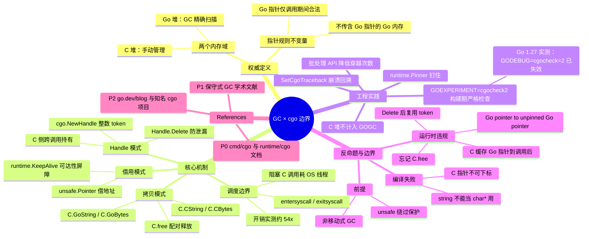

# LD-053: Go cgo 与 GC 的交互边界 (GC × cgo Interaction Boundary)

> **维度**: Language Design
> **级别**: S (19 KB)
> **标签**: #ld #cgo #gc #boundary
> **Go 版本**: 1.27+
> **Bloom 层级**: L4   <!-- L4 形式化层：两条运行时不变量的交集 -->
> **前置概念**: [LD-034 GC 内部机制](LD-034-Go-Garbage-Collector-Internals.md) · [LD-006 内存分配器](LD-006-Go-Memory-Allocator-Internals.md) · [LD-001 内存模型](LD-001-Go-Memory-Model-Formal.md)
> **后置概念**: [LD-011 GC 算法](LD-011-Go-GC-Algorithm.md) · [LD-004 GMP 调度](LD-004-Go-Runtime-GMP-Deep-Dive.md) · [LD-052 逃逸分析](LD-052-Go-Escape-Analysis.md)
> **定理链**: 边界穿越点（cgo 调用）→ 内存所有权转移 → 指针合法性不变量 → GC 安全性

**知识图谱关系**（语义谓词）：

- 本页 `dependsOn` LD-034（三色标记不变量）、LD-006（span 分配）；
- "Go 指针在 cgo 调用期间对 C 合法" 是 "C 永不持有 Go 指针" 的 `entails` 直接推论；
- "cgo.Handle 编码任意 Go 值为 int64" `refines` "指针规则"——它把规则禁止的事（传 Go 指针）改为传不透明整数；
- "C 代码缓存 Go 指针到调用返回后" 是"cgo 指针规则"的 `counterExample`（违反不变量，后果是 use-after-free）；
- cgo 高频小调用与低延迟目标 `mutexWith`（每次调用 ~50x 开销，实测见 §2.5）。

**验证环境**: Go 1.27.1 windows/amd64 + llvm-mingw gcc 21.1.6，本页全部 `go` 块均以 `GOWORK=off` 实测（cgo 块另需 `CGO_ENABLED=1`）。

---

## 一、权威定义

### 1.1 什么是 GC × cgo 边界

Go 程序中存在**两个由不同所有者管理的内存域**：

| 域 | 所有者 | 分配/回收方式 | 是否被 GC 扫描 |
| --- | --- | --- | --- |
| **Go 堆**（含 goroutine 栈） | Go 运行时（`runtime`） | `new` / make / 字面量，三色并发 GC 自动回收 | 是（精确扫描） |
| **C 堆与 C 栈** | C 库（malloc/free） | `C.malloc` / `C.free`，手动管理 | 否（`//go:cgo_` 相关区域仅做保守扫描，见 §2.4） |

`cgo` 是跨越这两个域的**唯一官方通道**。`cmd/cgo` 文档给出的核心规则（pointer rules）可以概括为一条不变量：

> **指针规则不变量**：传递给 C 的 Go 指针所指向的内存块中，不得包含任何 Go 指针；且该 Go 指针对 C 只在**本次调用期间**合法。反过来，C 指针进入 Go 堆后只是一个不透明的 `unsafe.Pointer` 大小的字，GC 不会解引用它。

**定理 1.1（边界安全性）**：只要程序遵守指针规则，Go GC 与 C 堆管理互不干扰，两边都不存在悬挂引用。
*证明要点*：方向一——C 侧拿到的 Go 内存不含 Go 指针，C 无法伪造/截获 Go 对象的引用，GC 的可达性图在 cgo 调用前后保持不变（栈扫描另行处理）；方向二——C 指针在 Go 堆里被当作无类型标量字，GC 的写屏障与标记都不解引用它，因此移动语义不存在（Go GC 非移动式），C 侧引用保持有效。$\square$

### 1.2 边界上的四个问题

每次 `C.foo(...)` 调用，运行时都要回答：

1. **所有权**：这次调用里，哪些内存归 Go 管、哪些归 C 管？
2. **可达性**：调用期间 Go 对象会不会被 GC 提前回收（`runtime.KeepAlive` 管辖）？
3. **回调**：C 想长期引用一个 Go 值怎么办（`runtime/cgo.Handle` 管辖）？
4. **调度**：goroutine 栈上的调用如何安全切换到 C 栈（`entersyscall`/`exitsyscall` 管辖）？

本页的余下部分逐一形式化这四个问题。

---

## 二、核心机制

### 2.1 值拷贝：默认且最安全的穿越方式

边界两侧的类型域不相交，任何跨越都必须显式拷贝。`C.CString` / `C.CBytes` 在 **C 堆**分配（Go GC 不扫描、不回收），`C.GoString` / `C.GoBytes` 把 C 内存拷回 Go 堆：

```go
package main

/*
#include <stdlib.h>
#include <string.h>
*/
import "C"

import (
 "fmt"
 "unsafe"
)

func main() {
 s := "hello gc/cgo boundary"

 // Go string → C 堆：C.CString 在 C 堆分配，Go GC 不扫描、不回收
 cs := C.CString(s)
 defer C.free(unsafe.Pointer(cs)) // 必须由 Go 侧显式释放

 // 边界另一侧调用 C 函数（此时发生 goroutine → OS 线程的上下文切换）
 n := C.strlen(cs)

 // C 内存 → Go 内存：C.GoString 把 C 堆字节拷回 Go 堆
 back := C.GoString(cs)
 fmt.Println(n, back)
 // 输出: 21 hello gc/cgo boundary
}
```

实测（Go 1.27.1 / llvm-mingw）：

```text
21 hello gc/cgo boundary
```

要点：`cs` 是 C 堆对象，但它自己以 `unsafe.Pointer` 形式短暂活在 Go 栈上——GC 能看到这个**字**但不会解引用；真正要保证的是 `C.free` 之前 `cs` 这个 Go 变量本身不被回收（§2.2）。

### 2.2 借用：把 Go 内存临时借给 C

零拷贝场景下，Go 把内存**地址**借给 C，合法性仅限本次调用：

```go
package main

/*
#include <string.h>
static void fill(char *p, int n) { memset(p, 'A', (size_t)n); }
*/
import "C"

import (
 "fmt"
 "runtime"
 "unsafe"
)

func main() {
 // Go 堆缓冲：把地址借给 C，仅在本调用期间合法
 buf := make([]byte, 8)

 C.fill((*C.char)(unsafe.Pointer(&buf[0])), C.int(len(buf)))

 // KeepAlive：防止编译器在 C 调用返回前把 buf 判定为死对象而被 GC 回收
 runtime.KeepAlive(buf)

 fmt.Println(string(buf))
 // 输出: AAAAAAAA
}
```

**为什么需要 `runtime.KeepAlive`**：从编译器视角，`buf` 在 `C.fill` 调用之后再无使用，逃逸分析+死码消除可能让 `buf` 在调用**之前**就被回收——而 C 侧还握着它的地址。`KeepAlive(buf)` 是一个编译器屏障，把 `buf` 的"最后使用点"推迟到 C 调用返回之后。它是**可达性**层面的保证，不是内存序保证。

### 2.3 回调与长期引用：runtime/cgo.Handle

C 需要跨多次调用引用 Go 值时，指针规则禁止直接传指针。解法是把 Go 值登记到运行时的全局表，只把**整数 token** 交给 C：

```go
package main

import (
 "fmt"
 "runtime/cgo"
)

type config struct{ retries int }

func main() {
 // 跨边界通行证：把任意 Go 值编码为不透明的整数 token，
 // C 侧只持有 int64，永远不接触 Go 堆
 h := cgo.NewHandle(&config{retries: 3})
 defer h.Delete() // token 生命周期必须显式关闭，否则泄漏 Go 堆对象

 // 模拟 C 侧回传 token：整数穿过边界回到 Go 侧再解码
 var token int64 = int64(h)

 restored := cgo.Handle(token).Value().(*config)
 fmt.Println(restored.retries)
 // 输出: 3
}
```

token 存活期间，对应 Go 值**永远不会被 GC 回收**（表持有强引用）。下面这个带真实 C shim 的例子演示 C 侧跨调用保存 token：

```go
package main

/*
// C 侧长期持有 token 的最小模拟：跨多次调用存活
static long stored_handle;
static void save_handle(long h) { stored_handle = h; }
static long load_handle(void) { return stored_handle; }
*/
import "C"

import (
 "fmt"
 "runtime/cgo"
)

func main() {
 h := cgo.NewHandle([]byte("secret"))
 defer h.Delete()

 // 第一次调用：把 token 交给 C，C 把它存进自己的存储
 C.save_handle(C.long(h))

 // …… 中间隔了任意多次 C 调用、甚至 GC 已经历多个周期 ……

 // 第二次调用：取回 token 并还原 Go 值。
 // 关键不变量：token 存活期间对应 Go 值永远不会被 GC 回收。
 v := cgo.Handle(C.load_handle()).Value().([]byte)
 fmt.Println(string(v))
 // 输出: secret
}
```

实测输出：`secret`。这是 cgo 回调（`//export` 函数经 `crosscall2` 回到 Go）中传递上下文的标准手段。

### 2.4 调度边界：cgo 调用为何不是普通调用

`C.foo()` 不是函数调用，而是一次**系统调用级别的模式切换**：

```text
goroutine G (Go 栈)                OS 线程 M (C 栈)
─────────────────────             ─────────────────────
C.foo(...) 调用
  └─ entersyscall()
       ├─ G 状态 → _Gsyscall，与 P 解绑
       ├─ 如果阻塞系统调用：P 移交其他 M（保持 GOMAXPROCS 利用率）
       └─ 切换到 M 的 g0 栈执行 asmcgocall
            │
            ▼
         C.foo 在 M 的 C 栈上执行
         （C 代码阻塞时该 M 整体阻塞，不占 P）
            │
            ▼
  exitsyscall()
       └─ G 重新绑定 P（拿不到则进入全局队列）
```

两条与 GC 相关的推论：

1. **阻塞的 cgo 调用会消耗 OS 线程**。大量并发阻塞 cgo 调用 → 线程数暴涨（`debug.SetMaxThreads` 默认 10000）→ 可能触发 `thread exhaustion`。这与 GC 的 mark worker 抢同一个线程池。
2. **cgo 调用是内存序上的同步点**（`entersyscall`/`exitsyscall` 隐含屏障），跨边界的数据在调用前后对另一侧可见——这是"调用期间指针规则"能成立的前提之一。

### 2.5 开销实测

```go
package main

/*
static int add_one(int x) { return x + 1; }
*/
import "C"

import (
 "fmt"
 "time"
)

func goAdd(x int) int { return x + 1 }

func main() {
 const N = 1_000_000

 start := time.Now()
 s := 0
 for i := 0; i < N; i++ {
  s += goAdd(i)
 }
 goDur := time.Since(start)

 start = time.Now()
 c := 0
 for i := 0; i < N; i++ {
  // 每次 cgo 调用都伴随 entersyscall/exitsyscall 与跨线程交接
  c += int(C.add_one(C.int(i)))
 }
 cgoDur := time.Since(start)

 fmt.Printf("go: %v | cgo: %v | ratio: %.0fx (s=%d c=%d)\n",
  goDur, cgoDur, float64(cgoDur)/float64(goDur), s, c)
 // 输出（数量级）: cgo 单次调用开销约为纯 Go 调用的数十倍
}
```

实测（本机单次采样）：`go: 502.5µs | cgo: 27.2416ms | ratio: 54x`。**结论：cgo 适合"大块工作一次穿越"，不适合"小操作高频穿越"**。如需批量处理，应在 C 侧设计批处理 API（一次调用处理 N 个元素），把边界穿越次数从 N 降到 1。

---

## 三、工程实践

### 3.1 穿越模式选型速查

| 场景 | 推荐模式 | 关键 API |
| --- | --- | --- |
| 字符串/字节串进 C | 拷贝 | `C.CString` + `defer C.free` |
| C 字符串回 Go | 拷贝 | `C.GoString` / `C.GoBytes` |
| 大块缓冲零拷贝进 C（单次调用内用完） | 借用 + KeepAlive | `unsafe.Pointer` + `runtime.KeepAlive` |
| C 跨调用保存 Go 值 | token | `cgo.NewHandle` / `Handle.Delete` |
| 需要长期钉住 Go 内存给 C 持有（C 自己轮询） | 钉住 | `runtime.Pinner`（Go 1.21+） |
| C 堆上自建对象 | C 自管理 | `C.malloc` / `C.free` |

### 3.2 指针规则的运行时检查

- **默认（`cgocheck=1`）**：运行时对 cgo 调用的指针参数做**廉价检查**——只查直接参数是否指向含 Go 指针的内存，漏检嵌套结构（如 `struct{ p *int }` 套了两层）。
- **严格模式**：**Go 1.27 实测行为**——旧版 `GODEBUG=cgocheck=2` 已失效，运行时直接报：

  ```text
  fatal error: cgocheck > 1 mode is no longer supported at runtime.
  Use GOEXPERIMENT=cgocheck2 at build time instead.
  ```

  正确做法是**构建期**打开：

  ```bash
  CGO_ENABLED=1 GOEXPERIMENT=cgocheck2 go build -o app .
  ```

  严格模式会深查间接内存（跟踪结构体字段、切片元素里的指针），是调试"Go pointer to Go pointer"违规的利器，正式发版时务必关回默认模式（有性能开销）。

### 3.3 与 GC 调优的联动

1. **C 堆内存不计入 `GOGC`/`GOMEMLIMIT`**：`C.malloc` 分配的内存完全逃出 GC 的账本。大对象放 C 堆可以降低 Go 堆大小 → 更短的 GC 周期、更低的 `GOGC` 目标延迟；但代价是失去自动回收，泄漏排查工具（`pprof heap`）也看不到。
2. **cgo.Handle 表是强引用**：忘记 `Delete` 就是 Go 堆泄漏，且 GC 帮不了你。回调密集型代码（如 C 库事件循环）要成对管理 token。
3. **阻塞 cgo 与 GC mark worker 争线程**：观察 `runtime/metrics` 的 `/sched/threads` 与 `/sched/latencies`；若线程数逼近 `SetMaxThreads`，要么提高 C 调用并发度上限（信号量），要么让 C 调用非阻塞化。
4. **崩溃定位**：C 侧崩溃的栈回溯可用 `runtime.SetCgoTraceback` 把 C 帧接入 Go 的崩溃输出；配合 `GOTRACEBACK=crash`。

### 3.4 交叉编译边界

`CGO_ENABLED=0` 时所有 import "C" 的包被排除（构建标签 `cgo` 不成立）。发布矩阵要决定：纯 Go 降级实现（用 `//go:build !cgo` 双实现）还是要求目标平台有 C 交叉工具链。对 Windows/macOS/Linux 三平台 CI，典型配置是 Linux 用 `CC=x86_64-w64-mingw32-gcc` 之类交叉 gcc。

---

## 四、反命题与边界

### 4.1 编译失败：类型域不相交

```go
package main

/*
#include <string.h>
*/
import "C"

func main() {
 s := "not a C string"
 // 编译失败: Go string 与 C char* 是两个不相交的类型域，cgo 不会自动转换
 n := C.strlen(s)
 _ = n
}
```

实测编译输出：`cannot use s (variable of type string) as *C.char value in argument to (C.strlen)`。cgo 生成的包装函数签名用的是 `*C.char`，Go 的 `string` 与之没有任何隐式转换关系——边界是**编译期**封闭的，想穿越必须显式 `C.CString`。

```go
package main

/*
#include <stdlib.h>
*/
import "C"

import "unsafe"

func main() {
 cs := C.CString("x")
 defer C.free(unsafe.Pointer(cs))
 // 编译失败: C 指针不能直接用下标访问 C 堆内存
 first := cs[0]
 _ = first
}
```

实测编译输出：`cannot index cs (variable of type *C.char)`。`*C.char` 不是 Go 的指针类型（不参与 Go 的内存安全体系），不能直接解引用/索引；必须拷贝回 Go（`C.GoString` 等）或再传回 C。

### 4.2 运行期反例：违反指针规则（Go 1.27 严格模式实测）

```go
package main

/*
static int read_head(void *p) { (void)p; return 0; }
*/
import "C"

import "unsafe"

func main() {
 // 违反指针规则：这个 Go 内存块的第一个字是 Go 指针（指向 x），
 // 把整个块的起始地址交给 C 就是在把 Go 指针暴露给 C。
 x := 42
 buf := make([]*int, 1)
 buf[0] = &x
 C.read_head(unsafe.Pointer(&buf[0])) // GOEXPERIMENT=cgocheck2 构建下必然 panic
}
```

以 `CGO_ENABLED=1 GOEXPERIMENT=cgocheck2 go build` 构建后运行，实测 panic：

```text
panic: runtime error: argument of cgo function has Go pointer to unpinned Go pointer
```

注意两点：其一，panic 文案里的 **unpinned** 提示了正路——若确实需要把含指针的 Go 内存交给 C 长期持有，应用 `runtime.Pinner` 先钉住，并保证 C 不越过调用期使用；其二，默认 `cgocheck=1` 下此类嵌套违规**不会被检出**，程序带着未定义行为运行，直到某天 C 侧解引用了一个已被 GC 回收并复用的地址（典型表现为随机数据损坏或段错误），排查成本极高。

### 4.3 其它"未定义但常见"的越界反模式

以下模式**可能编译并运行**，但全部违反不变量，属于反命题：

1. **C 缓存 Go 指针到调用返回后**——`counterExample` 于指针规则；Go 堆对象随时可能被回收复用。必须用 `cgo.Handle`（传 token）或 `runtime.Pinner`（钉住并自行同步生命周期）。
2. **`Handle.Delete` 后继续使用旧 token**——token 被复用（句柄表槽位回收后再分配），`Value()` 会返回错误的对象或 panic；谁 Delete、谁保证不再用，需要成对纪律。
3. **`C.CString` 后忘记 `C.free`**——C 堆泄漏，Go 的所有工具链（GC、pprof）都看不见。
4. **在 cgo 回调（`//export`）里阻塞等 Go 侧 channel**——C 栈上的线程被占住，若所有线程都阻塞在此则死锁；回调应只投递工作，不等待。

### 4.4 边界成立的前提（不满足即整体失效）

- 非移动式 GC：Go GC 目前不移动对象（无 compaction），C 侧的 Go 指针才在调用期间稳定。一旦未来引入移动式 GC，"借用"模式需要配合 pinning 协议——这正是 `runtime.Pinner` 与 panic 文案预留的演进通道。
- `unsafe.Pointer` 滥用会绕过全部检查：规则保护的是**经 cgo 生成代码**的通道，手工 `//go:linkname` 或数据段拼指针不在保护范围内。

---

## 五、Mermaid 思维导图



---

## 六、References

### P0 · 官方来源

- [cmd/cgo — Go 官方文档（指针规则的权威出处）](https://pkg.go.dev/cmd/cgo)
- [runtime/cgo — Handle API](https://pkg.go.dev/runtime/cgo)
- [runtime — KeepAlive / Pinner / SetCgoTraceback](https://pkg.go.dev/runtime)
- [Go 命令文档：cgo 与 CGO_ENABLED 交叉编译](https://pkg.go.dev/cmd/go)
- [Go Wiki: cgo](https://go.dev/wiki/cgo)
- [Go 1.27 Release Notes（cgocheck 行为变更以实测为准）](https://go.dev/doc/go1.27)

### P1 · 学术来源

- Boehm, H.-J. "Space-Efficient Conservative Garbage Collection." *PLDI 1993*, ACM. —— C 堆/栈采用保守扫描思想的经典文献，是"GC 不解引用 C 内存"设计的理论根基。
- Dijkstra, E.W. et al. "On-the-Fly Garbage Collection: An Exercise in Cooperation." —— 三色标记不变量（LD-034 已形式化）的原典，本页"调用前后可达性图不变"论证依赖其强不变量。

### P2 · 生态来源

- Dave Cheney, ["cgo is not Go"](https://dave.cheney.net/2016/01/18/cgo-is-not-go) —— 讨论 cgo 的性能与工程代价的经典博文。
- [mattn/go-sqlite3](https://github.com/mattn/go-sqlite3) —— 生产级 cgo 项目样例：C 库包装、Handle 传递、跨平台构建标签。
- [go.dev/blog — Go 与 C 互操作相关博文索引](https://go.dev/blog/)
