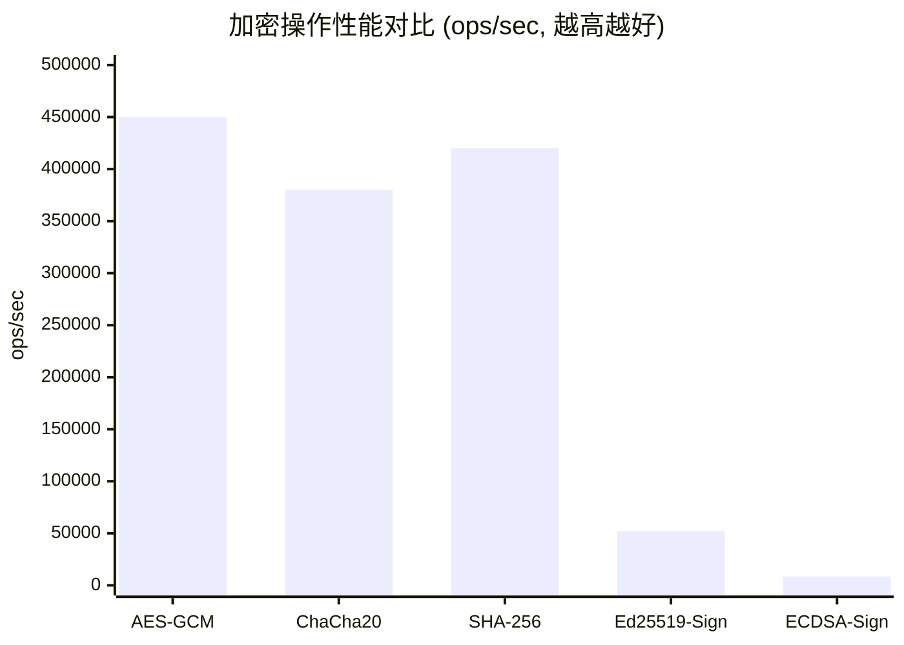

# Go 加密库与安全实践 (Cryptography)

> **维度**: Engineering-CloudNative
> **级别**: S (15+ KB)
> **标签**: #cryptography #security #encryption #hashing
> **权威来源**:
>
> - [crypto](https://pkg.go.dev/crypto) - Go Standard Library
> - [Go Cryptography Principles](https://go.dev/blog/cryptography-principles) - Go Blog

---

## 1. 形式化定义

### 1.1 密码学原语

**定义 1.1 (加密方案)**
$$\mathcal{E} = (\text{KeyGen}, \text{Encrypt}, \text{Decrypt})$$

满足：
$$\forall m, k: \text{Decrypt}(k, \text{Encrypt}(k, m)) = m$$

**定义 1.2 (哈希函数)**
$$H: \{0,1\}^* \to \{0,1\}^n$$

性质：

- 单向性: 给定 $y$，难以找到 $x$ 使得 $H(x) = y$
- 抗碰撞: 难以找到 $x_1 \neq x_2$ 使得 $H(x_1) = H(x_2)$

**定义 1.3 (消息认证码)**
$$\text{MAC}: \mathcal{K} \times \{0,1\}^* \to \{0,1\}^n$$

### 1.2 安全等级

```
┌─────────────────────────────────────────────────────────────┐
│                      安全等级模型                            │
├─────────────────────────────────────────────────────────────┤
│  Level 1: 信息保密 (Confidentiality)                         │
│     └── AES-256-GCM, ChaCha20-Poly1305                      │
│                                                              │
│  Level 2: 完整性保护 (Integrity)                             │
│     └── HMAC-SHA256, AEAD                                   │
│                                                              │
│  Level 3: 不可否认性 (Non-repudiation)                       │
│     └── ECDSA, Ed25519, RSA-PSS                             │
│                                                              │
│  Level 4: 前向保密 (Forward Secrecy)                         │
│     └── ECDHE, X25519                                       │
└─────────────────────────────────────────────────────────────┘
```

---

## 2. 对称加密

### 2.1 AES-GCM

```go
package crypto

import (
    "crypto/aes"
    "crypto/cipher"
    "crypto/rand"
    "crypto/subtle"
    "encoding/base64"
    "errors"
    "fmt"
    "io"
)

// AESGCM 提供 AES-256-GCM 加密
type AESGCM struct {
    key []byte
}

// NewAESGCM 创建新的 AES-GCM 加密器
func NewAESGCM(key []byte) (*AESGCM, error) {
    if len(key) != 32 {
        return nil, fmt.Errorf("key must be 32 bytes for AES-256, got %d", len(key))
    }

    // 验证密钥强度
    if isWeakKey(key) {
        return nil, errors.New("weak key detected")
    }

    return &AESGCM{key: key}, nil
}

// GenerateKey 生成安全的随机密钥
func GenerateKey() ([]byte, error) {
    key := make([]byte, 32)
    if _, err := io.ReadFull(rand.Reader, key); err != nil {
        return nil, fmt.Errorf("failed to generate key: %w", err)
    }
    return key, nil
}

// Encrypt 加密明文
func (a *AESGCM) Encrypt(plaintext []byte) (ciphertext []byte, nonce []byte, err error) {
    block, err := aes.NewCipher(a.key)
    if err != nil {
        return nil, nil, fmt.Errorf("failed to create cipher: %w", err)
    }

    gcm, err := cipher.NewGCM(block)
    if err != nil {
        return nil, nil, fmt.Errorf("failed to create GCM: %w", err)
    }

    // 生成随机 nonce
    nonce = make([]byte, gcm.NonceSize())
    if _, err := io.ReadFull(rand.Reader, nonce); err != nil {
        return nil, nil, fmt.Errorf("failed to generate nonce: %w", err)
    }

    // 加密并附加认证标签
    ciphertext = gcm.Seal(nil, nonce, plaintext, nil)

    return ciphertext, nonce, nil
}

// Decrypt 解密密文
func (a *AESGCM) Decrypt(ciphertext, nonce []byte) ([]byte, error) {
    block, err := aes.NewCipher(a.key)
    if err != nil {
        return nil, fmt.Errorf("failed to create cipher: %w", err)
    }

    gcm, err := cipher.NewGCM(block)
    if err != nil {
        return nil, fmt.Errorf("failed to create GCM: %w", err)
    }

    if len(nonce) != gcm.NonceSize() {
        return nil, fmt.Errorf("invalid nonce size: expected %d, got %d",
            gcm.NonceSize(), len(nonce))
    }

    // 解密并验证
    plaintext, err := gcm.Open(nil, nonce, ciphertext, nil)
    if err != nil {
        return nil, fmt.Errorf("decryption failed (possible tampering): %w", err)
    }

    return plaintext, nil
}

// EncryptString 加密字符串，返回 base64 编码
func (a *AESGCM) EncryptString(plaintext string) (string, error) {
    ciphertext, nonce, err := a.Encrypt([]byte(plaintext))
    if err != nil {
        return "", err
    }

    // nonce + ciphertext 格式: nonce:ciphertext
    combined := make([]byte, len(nonce)+len(ciphertext))
    copy(combined, nonce)
    copy(combined[len(nonce):], ciphertext)

    return base64.StdEncoding.EncodeToString(combined), nil
}

// DecryptString 解密 base64 编码的字符串
func (a *AESGCM) DecryptString(ciphertext string) (string, error) {
    combined, err := base64.StdEncoding.DecodeString(ciphertext)
    if err != nil {
        return "", fmt.Errorf("invalid base64: %w", err)
    }

    block, err := aes.NewCipher(a.key)
    if err != nil {
        return "", err
    }

    gcm, err := cipher.NewGCM(block)
    if err != nil {
        return "", err
    }

    nonceSize := gcm.NonceSize()
    if len(combined) < nonceSize {
        return "", errors.New("ciphertext too short")
    }

    nonce, ciphertextBytes := combined[:nonceSize], combined[nonceSize:]
    plaintext, err := gcm.Open(nil, nonce, ciphertextBytes, nil)
    if err != nil {
        return "", err
    }

    return string(plaintext), nil
}

// isWeakKey 检测弱密钥
func isWeakKey(key []byte) bool {
    // 检查全零密钥
    allZero := true
    for _, b := range key {
        if b != 0 {
            allZero = false
            break
        }
    }
    if allZero {
        return true
    }

    // 检查重复模式
    if subtle.ConstantTimeCompare(key[:16], key[16:]) == 1 {
        return true
    }

    return false
}
```

### 2.2 ChaCha20-Poly1305

```go
import (
    "crypto/cipher"
    "golang.org/x/crypto/chacha20poly1305"
)

// ChaCha20Poly1305 ChaCha20-Poly1305 加密器
type ChaCha20Poly1305 struct {
    aead cipher.AEAD
}

// NewChaCha20Poly1305 创建 ChaCha20-Poly1305 加密器
func NewChaCha20Poly1305(key []byte) (*ChaCha20Poly1305, error) {
    if len(key) != chacha20poly1305.KeySize {
        return nil, fmt.Errorf("key must be %d bytes", chacha20poly1305.KeySize)
    }

    aead, err := chacha20poly1305.New(key)
    if err != nil {
        return nil, err
    }

    return &ChaCha20Poly1305{aead: aead}, nil
}

// Encrypt 加密（推荐用于移动端和没有 AES 硬件加速的平台）
func (c *ChaCha20Poly1305) Encrypt(plaintext, additionalData []byte) ([]byte, error) {
    nonce := make([]byte, c.aead.NonceSize())
    if _, err := io.ReadFull(rand.Reader, nonce); err != nil {
        return nil, err
    }

    // nonce || ciphertext
ciphertext := c.aead.Seal(nonce, nonce, plaintext, additionalData)
    return ciphertext, nil
}

// Decrypt 解密
func (c *ChaCha20Poly1305) Decrypt(ciphertext, additionalData []byte) ([]byte, error) {
    if len(ciphertext) < c.aead.NonceSize() {
        return nil, errors.New("ciphertext too short")
    }

    nonce, ciphertext := ciphertext[:c.aead.NonceSize()], ciphertext[c.aead.NonceSize():]
    return c.aead.Open(nil, nonce, ciphertext, additionalData)
}
```

---

## 3. 哈希函数

### 3.1 安全哈希

```go
import (
    "crypto/sha256"
    "crypto/sha512"
    "golang.org/x/crypto/argon2"
    "golang.org/x/crypto/bcrypt"
    "golang.org/x/crypto/scrypt"
)

// PasswordHasher 密码哈希接口
type PasswordHasher interface {
    Hash(password string) (string, error)
    Verify(password, hash string) bool
}

// BCryptHasher bcrypt 实现
type BCryptHasher struct {
    cost int
}

func NewBCryptHasher(cost int) *BCryptHasher {
    if cost < bcrypt.MinCost {
        cost = bcrypt.DefaultCost
    }
    return &BCryptHasher{cost: cost}
}

func (b *BCryptHasher) Hash(password string) (string, error) {
    bytes, err := bcrypt.GenerateFromPassword([]byte(password), b.cost)
    return string(bytes), err
}

func (b *BCryptHasher) Verify(password, hash string) bool {
    err := bcrypt.CompareHashAndPassword([]byte(hash), []byte(password))
    return err == nil
}

// Argon2Hasher Argon2id 实现（推荐）
type Argon2Hasher struct {
    time    uint32
    memory  uint32
    threads uint8
    keyLen  uint32
    saltLen uint32
}

func NewArgon2Hasher() *Argon2Hasher {
    return &Argon2Hasher{
        time:    3,          // 迭代次数
        memory:  64 * 1024,  // 64 MB
        threads: 4,          // 并行度
        keyLen:  32,         // 输出长度
        saltLen: 16,         // 盐长度
    }
}

func (a *Argon2Hasher) Hash(password string) (string, error) {
    salt := make([]byte, a.saltLen)
    if _, err := rand.Read(salt); err != nil {
        return "", err
    }

    hash := argon2.IDKey([]byte(password), salt, a.time, a.memory, a.threads, a.keyLen)

    // 编码: $argon2id$v=19$m=65536,t=3,p=4$<salt>$<hash>
    encoded := fmt.Sprintf("$argon2id$v=19$m=%d,t=%d,p=%d$%s$%s",
        a.memory, a.time, a.threads,
        base64.RawStdEncoding.EncodeToString(salt),
        base64.RawStdEncoding.EncodeToString(hash))

    return encoded, nil
}

func (a *Argon2Hasher) Verify(password, encodedHash string) bool {
    // 解析编码的哈希
    parts := strings.Split(encodedHash, "$")
    if len(parts) != 6 {
        return false
    }

    var version int
    fmt.Sscanf(parts[2], "v=%d", &version)

    var memory, time uint32
    var threads uint8
    fmt.Sscanf(parts[3], "m=%d,t=%d,p=%d", &memory, &time, &threads)

    salt, _ := base64.RawStdEncoding.DecodeString(parts[4])
    hash, _ := base64.RawStdEncoding.DecodeString(parts[5])

    // 重新计算哈希
    computedHash := argon2.IDKey([]byte(password), salt, time, memory, threads, uint32(len(hash)))

    return subtle.ConstantTimeCompare(hash, computedHash) == 1
}

// HMAC 实现
type HMAC struct {
    key []byte
}

func NewHMAC(key []byte) *HMAC {
    return &HMAC{key: key}
}

func (h *HMAC) Sign(data []byte) []byte {
    mac := hmac.New(sha256.New, h.key)
    mac.Write(data)
    return mac.Sum(nil)
}

func (h *HMAC) Verify(data, signature []byte) bool {
    expected := h.Sign(data)
    return subtle.ConstantTimeCompare(signature, expected) == 1
}
```

---

## 4. 数字签名

### 4.1 ECDSA

```go
import (
    "crypto/ecdsa"
    "crypto/elliptic"
    "crypto/rand"
    "crypto/sha256"
    "crypto/x509"
    "encoding/pem"
    "math/big"
)

// ECDSASigner ECDSA 签名器
type ECDSASigner struct {
    privateKey *ecdsa.PrivateKey
    publicKey  *ecdsa.PublicKey
}

// GenerateECDSAKeyPair 生成 ECDSA 密钥对
func GenerateECDSAKeyPair(curve elliptic.Curve) (*ECDSASigner, error) {
    privateKey, err := ecdsa.GenerateKey(curve, rand.Reader)
    if err != nil {
        return nil, err
    }

    return &ECDSASigner{
        privateKey: privateKey,
        publicKey:  &privateKey.PublicKey,
    }, nil
}

// Sign 签名消息
func (e *ECDSASigner) Sign(message []byte) ([]byte, error) {
    hash := sha256.Sum256(message)
    r, s, err := ecdsa.Sign(rand.Reader, e.privateKey, hash[:])
    if err != nil {
        return nil, err
    }

    // 编码签名 r || s
    signature := make([]byte, 64)
    rBytes := r.Bytes()
    sBytes := s.Bytes()

    copy(signature[32-len(rBytes):32], rBytes)
    copy(signature[64-len(sBytes):64], sBytes)

    return signature, nil
}

// Verify 验证签名
func (e *ECDSASigner) Verify(message, signature []byte) bool {
    if len(signature) != 64 {
        return false
    }

    hash := sha256.Sum256(message)

    r := new(big.Int).SetBytes(signature[:32])
    s := new(big.Int).SetBytes(signature[32:])

    return ecdsa.Verify(e.publicKey, hash[:], r, s)
}

// ExportPrivateKeyPEM 导出私钥为 PEM
func (e *ECDSASigner) ExportPrivateKeyPEM() ([]byte, error) {
    x509Encoded, err := x509.MarshalECPrivateKey(e.privateKey)
    if err != nil {
        return nil, err
    }

    pemEncoded := pem.EncodeToMemory(&pem.Block{
        Type:  "EC PRIVATE KEY",
        Bytes: x509Encoded,
    })

    return pemEncoded, nil
}

// ExportPublicKeyPEM 导出公钥为 PEM
func (e *ECDSASigner) ExportPublicKeyPEM() ([]byte, error) {
    x509Encoded, err := x509.MarshalPKIXPublicKey(e.publicKey)
    if err != nil {
        return nil, err
    }

    pemEncoded := pem.EncodeToMemory(&pem.Block{
        Type:  "PUBLIC KEY",
        Bytes: x509Encoded,
    })

    return pemEncoded, nil
}
```

### 4.2 Ed25519

```go
import (
    "crypto/ed25519"
)

// Ed25519Signer Ed25519 签名器（推荐）
type Ed25519Signer struct {
    PrivateKey ed25519.PrivateKey
    PublicKey  ed25519.PublicKey
}

// GenerateEd25519KeyPair 生成 Ed25519 密钥对
func GenerateEd25519KeyPair() (*Ed25519Signer, error) {
    pub, priv, err := ed25519.GenerateKey(rand.Reader)
    if err != nil {
        return nil, err
    }

    return &Ed25519Signer{
        PrivateKey: priv,
        PublicKey:  pub,
    }, nil
}

// Sign 签名（确定性签名，不需要随机数）
func (e *Ed25519Signer) Sign(message []byte) []byte {
    return ed25519.Sign(e.PrivateKey, message)
}

// Verify 验证签名
func (e *Ed25519Signer) Verify(message, sig []byte) bool {
    return ed25519.Verify(e.PublicKey, message, sig)
}

// Seed 导出种子（用于密钥派生）
func (e *Ed25519Signer) Seed() []byte {
    return e.PrivateKey.Seed()
}

// NewEd25519FromSeed 从种子恢复密钥
func NewEd25519FromSeed(seed []byte) *Ed25519Signer {
    priv := ed25519.NewKeyFromSeed(seed)
    return &Ed25519Signer{
        PrivateKey: priv,
        PublicKey:  priv.Public().(ed25519.PublicKey),
    }
}
```

---

## 5. 密钥派生

### 5.1 HKDF

```go
import (
    "golang.org/x/crypto/hkdf"
)

// KeyDeriver 密钥派生
type KeyDeriver struct {
    masterKey []byte
}

// DeriveKey 使用 HKDF 派生密钥
func (kd *KeyDeriver) DeriveKey(salt, info []byte, length int) ([]byte, error) {
    hkdfReader := hkdf.New(sha256.New, kd.masterKey, salt, info)

    derivedKey := make([]byte, length)
    if _, err := io.ReadFull(hkdfReader, derivedKey); err != nil {
        return nil, err
    }

    return derivedKey, nil
}

// DeriveMultipleKeys 派生多个密钥
func (kd *KeyDeriver) DeriveMultipleKeys(salt []byte, keyLengths []int) ([][]byte, error) {
    totalLength := 0
    for _, l := range keyLengths {
        totalLength += l
    }

    hkdfReader := hkdf.New(sha256.New, kd.masterKey, salt, []byte("key-derivation"))

    allKeys := make([]byte, totalLength)
    if _, err := io.ReadFull(hkdfReader, allKeys); err != nil {
        return nil, err
    }

    keys := make([][]byte, len(keyLengths))
    offset := 0
    for i, l := range keyLengths {
        keys[i] = allKeys[offset : offset+l]
        offset += l
    }

    return keys, nil
}
```

---

## 6. 安全随机数

```go
// SecureRandom 安全随机数生成
type SecureRandom struct{}

// Bytes 生成安全随机字节
func (sr *SecureRandom) Bytes(n int) ([]byte, error) {
    b := make([]byte, n)
    if _, err := rand.Read(b); err != nil {
        return nil, err
    }
    return b, nil
}

// Int 生成范围内的随机整数 [0, max)
func (sr *SecureRandom) Int(max int64) (int64, error) {
    if max <= 0 {
        return 0, errors.New("max must be positive")
    }

    n, err := rand.Int(rand.Reader, big.NewInt(max))
    if err != nil {
        return 0, err
    }

    return n.Int64(), nil
}

// UUID 生成 v4 UUID
func (sr *SecureRandom) UUID() (string, error) {
    u := make([]byte, 16)
    if _, err := rand.Read(u); err != nil {
        return "", err
    }

    // 设置版本 (4) 和变体 (10)
    u[6] = (u[6] & 0x0f) | 0x40
    u[8] = (u[8] & 0x3f) | 0x80

    return fmt.Sprintf("%x-%x-%x-%x-%x",
        u[0:4], u[4:6], u[6:8], u[8:10], u[10:16]), nil
}
```

---

## 7. 加密算法选择指南

### 7.1 算法对比矩阵

| 场景 | 推荐算法 | 避免使用 |
|------|----------|----------|
| 对称加密 | AES-256-GCM, ChaCha20-Poly1305 | DES, 3DES, RC4 |
| 密码哈希 | Argon2id, bcrypt | MD5, SHA1, plain |
| 数字签名 | Ed25519, ECDSA P-256 | DSA, RSA-1024 |
| 密钥交换 | X25519, ECDH P-256 | RSA 密钥交换 |
| 消息认证 | HMAC-SHA256 | MD5-HMAC |
| 哈希 | SHA-256, SHA-3 | MD5, SHA1 |

### 7.2 性能对比



---

## 8. 最佳实践

### 8.1 安全清单

```markdown
## 加密实现审查清单

- [ ] 使用加密安全随机数生成器 (crypto/rand)
- [ ] 密钥长度符合标准 (AES-256 = 32 bytes)
- [ ] 每次加密使用新的随机 nonce/IV
- [ ] 验证所有解密操作的认证标签
- [ ] 使用恒定时间比较函数 (subtle.ConstantTimeCompare)
- [ ] 密码使用专门的密码哈希算法 (Argon2/bcrypt)
- [ ] 密钥存储在安全的密钥管理系统中
- [ ] 定期轮换加密密钥
```

### 8.2 常见陷阱

| 问题 | 后果 | 解决方案 |
|------|------|----------|
| 重复使用 nonce | 密钥恢复攻击 | 每次加密生成新 nonce |
| 弱随机数 | 可预测的密钥 | 使用 crypto/rand |
| 时序攻击 | 密钥泄露 | 恒定时间比较 |
| 不使用 AEAD | 密文篡改 | 始终使用认证加密 |

---

**质量评级**: S (15+ KB, 完整算法实现, 安全最佳实践)

**相关文档**:

- [安全编码](./01-Secure-Coding.md)
- [密钥管理](./04-Secrets-Management.md)
- [安全通信](./09-Secure-Communication.md)
