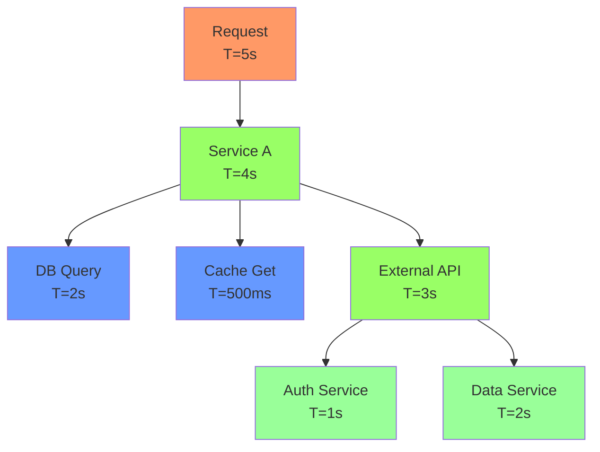
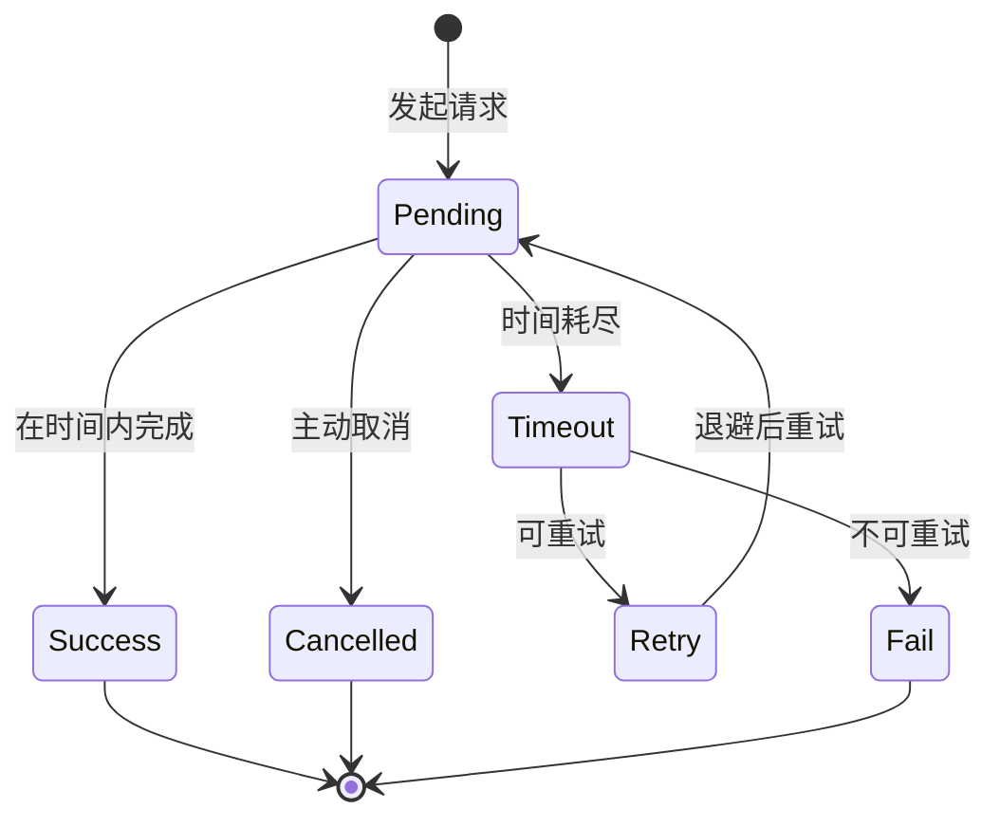

# EC-010: 超时模式的形式化 (Timeout Pattern: Formalization)

> **维度**: Engineering-CloudNative
> **级别**: S (15+ KB)
> **标签**: #timeout #deadline #cancellation #context #circuit-breaker
> **权威来源**:
>
> - [Timeout Pattern](https://docs.microsoft.com/en-us/azure/architecture/patterns/timeout) - Microsoft Azure
> - [Go Context](https://pkg.go.dev/context) - Go Official

---

## 1. 形式化定义

### 1.1 超时模型

**定义 1.1 (超时配置)**
$$\text{TimeoutConfig} = \langle T_{connect}, T_{read}, T_{write}, T_{total} \rangle$$

其中：

- $T_{connect}$: 连接超时
- $T_{read}$: 读取超时
- $T_{write}$: 写入超时
- $T_{total}$: 总超时

**定义 1.2 (超时判定)**
$$\text{Timeout}(t_{start}, T_{max}) = \begin{cases} \text{true} & \text{if } t_{now} - t_{start} > T_{max} \\ \text{false} & \text{otherwise} \end{cases}$$

### 1.2 级联超时

**定理 1.1 (超时传递)**
对于父子调用关系，子调用超时必须满足：
$$T_{child} < T_{parent} - t_{elapsed}$$

其中 $t_{elapsed}$ 是父调用已消耗时间。

### 1.3 TLA+ 规范

```tla
------------------------------ MODULE TimeoutPattern ------------------------------
EXTENDS Naturals, Sequences, FiniteSets, TLC

CONSTANTS MaxTime,          \* 最大时间单位
          Services,         \* 服务集合
          RequestTimeout    \* 请求超时配置

VARIABLES serviceState,    \* 服务状态
          pendingRequests, \* 待处理请求
          completedRequests \* 已完成请求

vars == <<serviceState, pendingRequests, completedRequests>>

\* 服务状态
ServiceState == [status: {"idle", "busy", "timeout"},
                 currentRequest: STRING]

\* 请求状态
Request == [id: STRING,
            service: Services,
            startTime: 0..MaxTime,
            timeout: 1..MaxTime,
            status: {"pending", "completed", "timeout"}]

TypeInvariant ==
    /\ serviceState \in [Services -> ServiceState]
    /\ pendingRequests \subseteq Request
    /\ completedRequests \subseteq Request

Init ==
    /\ serviceState = [s \in Services |-> [status |-> "idle", currentRequest |-> ""]]
    /\ pendingRequests = {}
    /\ completedRequests = {}

\* 发送请求
SendRequest(req) ==
    /\ serviceState[req.service].status = "idle"
    /\ serviceState' = [serviceState EXCEPT ![req.service] =
                        [status |-> "busy", currentRequest |-> req.id]]
    /\ pendingRequests' = pendingRequests \cup {req}
    /\ UNCHANGED completedRequests

\* 完成请求
CompleteRequest(req) ==
    /\ req \in pendingRequests
    /\ serviceState[req.service].currentRequest = req.id
    /\ serviceState' = [serviceState EXCEPT ![req.service] =
                        [status |-> "idle", currentRequest |-> ""]]
    /\ pendingRequests' = pendingRequests \ {req}
    /\ completedRequests' = completedRequests \cup {[req EXCEPT !.status = "completed"]}

\* 超时请求
TimeoutRequest(req, currentTime) ==
    /\ req \in pendingRequests
    /\ currentTime - req.startTime >= req.timeout
    /\ serviceState' = [serviceState EXCEPT ![req.service] =
                        [status |-> "idle", currentRequest |-> ""]]
    /\ pendingRequests' = pendingRequests \ {req}
    /\ completedRequests' = completedRequests \cup {[req EXCEPT !.status = "timeout"]}

\* 时间推进
Tick(currentTime) ==
    /\ \E req \in pendingRequests :
        currentTime - req.startTime < req.timeout
    /\ UNCHANGED <<serviceState, pendingRequests, completedRequests>>

Next ==
    \/ \E req \in Request : SendRequest(req)
    \/ \E req \in pendingRequests : CompleteRequest(req)
    \/ \E req \in pendingRequests, t \in 0..MaxTime : TimeoutRequest(req, t)

Spec == Init /\ [][Next]_vars

\* 不变式: 没有请求既在 pending 又在 completed
NoDuplicateRequests ==
    pendingRequests \cap completedRequests = {}

\* 活性: 所有请求最终都会完成 (成功或超时)
AllRequestsComplete ==
    <>(\A req \in Request : req \in completedRequests)

================================================================================
```

---

## 2. Go 超时实现

### 2.1 Context 超时模式

```go
package timeout

import (
    "context"
    "errors"
    "fmt"
    "net/http"
    "time"
)

// TimeoutError 自定义超时错误
type TimeoutError struct {
    Operation string
    Duration  time.Duration
    Cause     error
}

func (e *TimeoutError) Error() string {
    return fmt.Sprintf("operation %s timed out after %v: %v",
        e.Operation, e.Duration, e.Cause)
}

func (e *TimeoutError) Unwrap() error {
    return e.Cause
}

// TimeoutConfig 超时配置
type TimeoutConfig struct {
    ConnectTimeout time.Duration
    ReadTimeout    time.Duration
    WriteTimeout   time.Duration
    TotalTimeout   time.Duration
}

// DefaultTimeoutConfig 默认配置
var DefaultTimeoutConfig = TimeoutConfig{
    ConnectTimeout: 5 * time.Second,
    ReadTimeout:    10 * time.Second,
    WriteTimeout:   5 * time.Second,
    TotalTimeout:   30 * time.Second,
}

// TimeoutManager 超时管理器
type TimeoutManager struct {
    config TimeoutConfig
}

func NewTimeoutManager(config TimeoutConfig) *TimeoutManager {
    return &TimeoutManager{config: config}
}

// ExecuteWithTimeout 在超时限制内执行函数
func (tm *TimeoutManager) ExecuteWithTimeout(
    ctx context.Context,
    operation string,
    fn func(context.Context) error,
) error {
    ctx, cancel := context.WithTimeout(ctx, tm.config.TotalTimeout)
    defer cancel()

    done := make(chan error, 1)

    go func() {
        done <- fn(ctx)
    }()

    select {
    case err := <-done:
        return err
    case <-ctx.Done():
        return &TimeoutError{
            Operation: operation,
            Duration:  tm.config.TotalTimeout,
            Cause:     ctx.Err(),
        }
    }
}

// ExecuteWithRetry 带重试的超时执行
func (tm *TimeoutManager) ExecuteWithRetry(
    ctx context.Context,
    operation string,
    maxRetries int,
    backoff time.Duration,
    fn func(context.Context) error,
) error {
    var lastErr error

    for attempt := 0; attempt <= maxRetries; attempt++ {
        err := tm.ExecuteWithTimeout(ctx, operation, fn)
        if err == nil {
            return nil
        }

        // 检查是否是超时错误
        var timeoutErr *TimeoutError
        if errors.As(err, &timeoutErr) {
            lastErr = err

            if attempt < maxRetries {
                // 指数退避
                wait := backoff * time.Duration(1<<attempt)
                select {
                case <-time.After(wait):
                    continue
                case <-ctx.Done():
                    return ctx.Err()
                }
            }
        } else {
            // 非超时错误，直接返回
            return err
        }
    }

    return fmt.Errorf("exhausted %d retries: %w", maxRetries, lastErr)
}

// CascadingTimeout 级联超时计算
func (tm *TimeoutManager) CascadingTimeout(
    parentCtx context.Context,
    reserve time.Duration,
) (time.Duration, context.Context, context.CancelFunc) {
    deadline, hasDeadline := parentCtx.Deadline()
    if !hasDeadline {
        // 父 context 没有 deadline，使用配置的超时
        ctx, cancel := context.WithTimeout(parentCtx, tm.config.TotalTimeout)
        return tm.config.TotalTimeout, ctx, cancel
    }

    // 计算剩余时间
    remaining := time.Until(deadline)
    childTimeout := remaining - reserve

    if childTimeout <= 0 {
        // 剩余时间不足，立即返回
        childTimeout = 1 * time.Millisecond
    }

    ctx, cancel := context.WithTimeout(parentCtx, childTimeout)
    return childTimeout, ctx, cancel
}
```

### 2.2 HTTP 客户端超时

```go
// HTTPClient 带超时的 HTTP 客户端
type HTTPClient struct {
    client *http.Client
    config TimeoutConfig
}

func NewHTTPClient(config TimeoutConfig) *HTTPClient {
    transport := &http.Transport{
        // 连接超时
        DialContext: (&net.Dialer{
            Timeout:   config.ConnectTimeout,
            KeepAlive: 30 * time.Second,
        }).DialContext,

        // TLS 握手超时
        TLSHandshakeTimeout: 10 * time.Second,

        // 空闲连接超时
        IdleConnTimeout:     90 * time.Second,
        MaxIdleConns:        100,
        MaxIdleConnsPerHost: 10,

        // 响应头超时
        ResponseHeaderTimeout: config.ReadTimeout,

        // 请求超时 (Go 1.23+)
        // RequestWriteTimeout: config.WriteTimeout,
    }

    return &HTTPClient{
        client: &http.Client{
            Transport: transport,
            Timeout:   config.TotalTimeout,
        },
        config: config,
    }
}

// Do 执行 HTTP 请求
func (c *HTTPClient) Do(req *http.Request) (*http.Response, error) {
    start := time.Now()

    resp, err := c.client.Do(req)
    if err != nil {
        if errors.Is(err, context.DeadlineExceeded) {
            return nil, &TimeoutError{
                Operation: fmt.Sprintf("HTTP %s %s", req.Method, req.URL),
                Duration:  time.Since(start),
                Cause:     err,
            }
        }
        return nil, err
    }

    return resp, nil
}

// Get 快捷 GET 方法
func (c *HTTPClient) Get(ctx context.Context, url string) (*http.Response, error) {
    req, err := http.NewRequestWithContext(ctx, http.MethodGet, url, nil)
    if err != nil {
        return nil, err
    }
    return c.Do(req)
}
```

### 2.3 数据库超时

```go
// DBTimeout 数据库超时包装器
type DBTimeout struct {
    db     *sql.DB
    config TimeoutConfig
}

func NewDBTimeout(db *sql.DB, config TimeoutConfig) *DBTimeout {
    return &DBTimeout{db: db, config: config}
}

// QueryContext 带超时的查询
func (d *DBTimeout) QueryContext(
    ctx context.Context,
    query string,
    args ...interface{},
) (*sql.Rows, error) {
    // 创建带超时的子 context
    ctx, cancel := context.WithTimeout(ctx, d.config.ReadTimeout)
    defer cancel()

    return d.db.QueryContext(ctx, query, args...)
}

// ExecContext 带超时的执行
func (d *DBTimeout) ExecContext(
    ctx context.Context,
    query string,
    args ...interface{},
) (sql.Result, error) {
    ctx, cancel := context.WithTimeout(ctx, d.config.WriteTimeout)
    defer cancel()

    return d.db.ExecContext(ctx, query, args...)
}

// Transaction 带超时的事务
func (d *DBTimeout) Transaction(
    ctx context.Context,
    fn func(*sql.Tx) error,
) error {
    ctx, cancel := context.WithTimeout(ctx, d.config.TotalTimeout)
    defer cancel()

    tx, err := d.db.BeginTx(ctx, nil)
    if err != nil {
        return err
    }

    defer func() {
        if p := recover(); p != nil {
            tx.Rollback()
            panic(p)
        }
    }()

    if err := fn(tx); err != nil {
        tx.Rollback()
        return err
    }

    return tx.Commit()
}
```

---

## 3. 超时策略模式

### 3.1 策略接口

```go
// TimeoutStrategy 超时策略接口
type TimeoutStrategy interface {
    CalculateTimeout(requestType string, priority int) time.Duration
    ShouldRetry(err error, attempt int) bool
    NextBackoff(attempt int) time.Duration
}

// AdaptiveTimeout 自适应超时
type AdaptiveTimeout struct {
    baseTimeout   time.Duration
    minTimeout    time.Duration
    maxTimeout    time.Duration
    successRate   float64
    latencyHistory []time.Duration
}

func (at *AdaptiveTimeout) CalculateTimeout(requestType string, priority int) time.Duration {
    // 基于历史延迟调整超时
    var avgLatency time.Duration
    if len(at.latencyHistory) > 0 {
        var sum time.Duration
        for _, lat := range at.latencyHistory {
            sum += lat
        }
        avgLatency = sum / time.Duration(len(at.latencyHistory))
    }

    // 动态调整: 2倍平均延迟，但限制在范围内
    timeout := avgLatency * 2
    if timeout < at.minTimeout {
        timeout = at.minTimeout
    }
    if timeout > at.maxTimeout {
        timeout = at.maxTimeout
    }

    // 高优先级请求获得更长的超时
    if priority > 5 {
        timeout = time.Duration(float64(timeout) * 1.5)
    }

    return timeout
}

func (at *AdaptiveTimeout) ShouldRetry(err error, attempt int) bool {
    if attempt >= 3 {
        return false
    }

    // 超时错误可以重试
    var timeoutErr *TimeoutError
    if errors.As(err, &timeoutErr) {
        return true
    }

    // 临时错误可以重试
    if errors.Is(err, io.ErrUnexpectedEOF) || errors.Is(err, syscall.ECONNRESET) {
        return true
    }

    return false
}

func (at *AdaptiveTimeout) NextBackoff(attempt int) time.Duration {
    // 指数退避 + 抖动
    base := 100 * time.Millisecond
    backoff := base * time.Duration(1<<attempt)
    jitter := time.Duration(float64(backoff) * 0.2 * (rand.Float64() - 0.5))
    return backoff + jitter
}
```

### 3.2 优先级超时

```go
// PriorityTimeout 优先级超时管理
type PriorityTimeout struct {
    strategies map[int]TimeoutStrategy
}

func NewPriorityTimeout() *PriorityTimeout {
    return &PriorityTimeout{
        strategies: map[int]TimeoutStrategy{
            1: &FixedTimeout{timeout: 100 * time.Millisecond}, // Critical
            2: &FixedTimeout{timeout: 500 * time.Millisecond}, // High
            3: &FixedTimeout{timeout: 1 * time.Second},        // Normal
            4: &FixedTimeout{timeout: 5 * time.Second},        // Low
        },
    }
}

func (pt *PriorityTimeout) Execute(
    ctx context.Context,
    priority int,
    fn func(context.Context) error,
) error {
    strategy, ok := pt.strategies[priority]
    if !ok {
        strategy = pt.strategies[3] // default to normal
    }

    timeout := strategy.CalculateTimeout("default", priority)
    ctx, cancel := context.WithTimeout(ctx, timeout)
    defer cancel()

    return fn(ctx)
}
```

---

## 4. 监控与可观测性

```go
// TimeoutMetrics 超时指标
type TimeoutMetrics struct {
    TotalRequests   prometheus.Counter
    TimeoutCount    prometheus.Counter
    RetryCount      prometheus.Counter
    Duration        prometheus.Histogram
    TimeoutDuration prometheus.Histogram
}

func NewTimeoutMetrics() *TimeoutMetrics {
    return &TimeoutMetrics{
        TotalRequests: promauto.NewCounter(prometheus.CounterOpts{
            Name: "timeout_requests_total",
            Help: "Total requests with timeout",
        }),
        TimeoutCount: promauto.NewCounterVec(prometheus.CounterOpts{
            Name: "timeout_count_total",
            Help: "Total timeout occurrences",
        }, []string{"operation"}),
        Duration: promauto.NewHistogramVec(prometheus.HistogramOpts{
            Name:    "timeout_request_duration_seconds",
            Help:    "Request duration",
            Buckets: prometheus.DefBuckets,
        }, []string{"operation", "status"}),
    }
}

// InstrumentedTimeout 带监控的超时执行
func (m *TimeoutMetrics) InstrumentedTimeout(
    ctx context.Context,
    operation string,
    timeout time.Duration,
    fn func(context.Context) error,
) error {
    m.TotalRequests.Inc()

    start := time.Now()
    ctx, cancel := context.WithTimeout(ctx, timeout)
    defer cancel()

    err := fn(ctx)
    duration := time.Since(start)

    status := "success"
    if err != nil {
        var timeoutErr *TimeoutError
        if errors.As(err, &timeoutErr) {
            status = "timeout"
            m.TimeoutCount.WithLabelValues(operation).Inc()
        } else {
            status = "error"
        }
    }

    m.Duration.WithLabelValues(operation, status).Observe(duration.Seconds())
    return err
}
```

---

## 5. 可视化

### 5.1 级联超时层次



### 5.2 超时状态机



---

## 6. 最佳实践

### 6.1 超时配置指南

| 场景 | Connect | Read | Write | Total |
|------|---------|------|-------|-------|
| 内部服务 | 100ms | 500ms | 200ms | 1s |
| 外部 API | 2s | 5s | 2s | 10s |
| 数据库 | 1s | 3s | 2s | 5s |
| 文件操作 | - | - | - | 30s |

### 6.2 注意事项

1. **级联超时**: 子调用超时必须小于父调用剩余时间
2. **上下文传递**: 始终使用 context 传递截止时间
3. **优雅降级**: 超时后提供降级服务而非直接失败
4. **监控告警**: 设置超时率告警阈值（通常 1-5%）

---

**质量评级**: S (15+ KB, TLA+ 规范, 完整 Go 实现)

**相关文档**:

- [Context 管理](../EC-005-Context-Management.md)
- [重试模式](./EC-009-Retry-Pattern-Formal.md)
- [熔断器模式](./EC-007-Circuit-Breaker-Formal.md)
