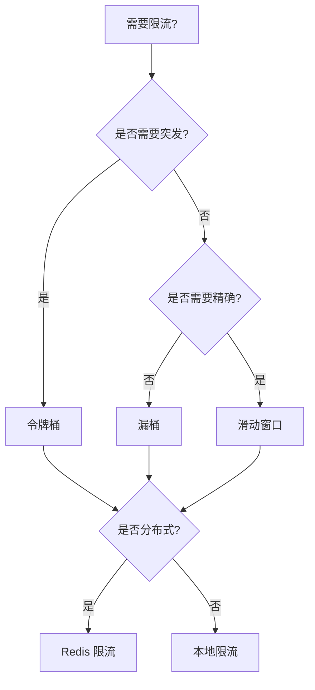

# EC-012: 限流模式的形式化 (Rate Limiting: Formalization)

> **维度**: Engineering-CloudNative
> **级别**: S (15+ KB)
> **标签**: #rate-limiting #throttling #token-bucket #leaky-bucket
> **权威来源**:
>
> - [Rate Limiting](https://stripe.com/blog/rate-limiters) - Stripe
> - [Token Bucket](https://en.wikipedia.org/wiki/Token_bucket) - Wikipedia

---

## 1. 形式化定义

### 1.1 限流模型

**定义 1.1 (限流器)**
$$\text{RateLimiter} = \langle R, C, T, \text{state} \rangle$$

其中：

- $R$: 速率 (tokens/second 或 requests/second)
- $C$: 容量 (bucket capacity)
- $T$: 时间窗口
- $\text{state}$: 当前状态

**定义 1.2 (令牌桶)**
$$\text{Bucket} = \langle \text{tokens}, \text{capacity}, \text{rate}, t_{last} \rangle$$

状态更新：
$$\text{tokens}_{new} = \min(\text{capacity}, \text{tokens} + R \cdot (t_{now} - t_{last}))$$

**定理 1.1 (限流判定)**
$$\text{Allow}(n) = \begin{cases} \text{true} & \text{if tokens} \geq n \\ \text{false} & \text{otherwise} \end{cases}$$

### 1.2 TLA+ 规范

```tla
------------------------------ MODULE RateLimiting ------------------------------
EXTENDS Naturals, Reals, Sequences

CONSTANTS Capacity,    \* 桶容量
          FillRate,    \* 填充速率 (tokens/second)
          MaxRequests  \* 最大并发请求

VARIABLES tokens,      \* 当前令牌数
          lastFill,    \* 上次填充时间
          requestCount \* 当前请求数

vars == <<tokens, lastFill, requestCount>>

TypeInvariant ==
    /\ tokens \in 0..Capacity
    /\ lastFill \in Nat
    /\ requestCount \in 0..MaxRequests

Init ==
    /\ tokens = Capacity
    /\ lastFill = 0
    /\ requestCount = 0

\* 计算当前令牌数
CalculateTokens(currentTime) ==
    LET elapsed == currentTime - lastFill
        addedTokens == elapsed * FillRate
    IN Min(Capacity, tokens + addedTokens)

\* 尝试获取令牌
TryAcquire(n, currentTime) ==
    LET currentTokens == CalculateTokens(currentTime)
    IN IF currentTokens >= n
       THEN /\ tokens' = currentTokens - n
            /\ lastFill' = currentTime
            /\ requestCount' = requestCount + 1
            /\ TRUE  \* 允许请求
       ELSE /\ UNCHANGED vars
            /\ FALSE  \* 拒绝请求

\* 释放令牌
Release(n, currentTime) ==
    /\ tokens' = Min(Capacity, CalculateTokens(currentTime) + n)
    /\ lastFill' = currentTime
    /\ requestCount' = requestCount - 1

Next ==
    \/ \E n \in 1..Capacity, t \in Nat : TryAcquire(n, t)
    \/ \E n \in 1..Capacity, t \in Nat : Release(n, t)

Spec == Init /\ [][Next]_vars

\* 不变式: 令牌数不超过容量
CapacityInvariant ==
    tokens <= Capacity

================================================================================
```

---

## 2. Go 限流实现

### 2.1 令牌桶实现

```go
package ratelimit

import (
    "context"
    "fmt"
    "math"
    "sync"
    "time"
)

// TokenBucket 令牌桶限流器
type TokenBucket struct {
    capacity     float64       // 桶容量
    tokens       float64       // 当前令牌数
    fillRate     float64       // 填充速率 (tokens/second)
    lastFillTime time.Time     // 上次填充时间
    mu           sync.Mutex    // 互斥锁
}

// NewTokenBucket 创建令牌桶
func NewTokenBucket(capacity int, fillRate float64) *TokenBucket {
    return &TokenBucket{
        capacity:     float64(capacity),
        tokens:       float64(capacity),
        fillRate:     fillRate,
        lastFillTime: time.Now(),
    }
}

// Allow 尝试获取一个令牌
func (tb *TokenBucket) Allow() bool {
    return tb.AllowN(1)
}

// AllowN 尝试获取 n 个令牌
func (tb *TokenBucket) AllowN(n int) bool {
    tb.mu.Lock()
    defer tb.mu.Unlock()

    // 填充令牌
    now := time.Now()
    elapsed := now.Sub(tb.lastFillTime).Seconds()
    tb.tokens = math.Min(tb.capacity, tb.tokens+elapsed*tb.fillRate)
    tb.lastFillTime = now

    // 检查令牌是否足够
    if tb.tokens >= float64(n) {
        tb.tokens -= float64(n)
        return true
    }

    return false
}

// Wait 等待直到获取令牌
func (tb *TokenBucket) Wait(ctx context.Context) error {
    return tb.WaitN(ctx, 1)
}

// WaitN 等待直到获取 n 个令牌
func (tb *TokenBucket) WaitN(ctx context.Context, n int) error {
    for {
        if tb.AllowN(n) {
            return nil
        }

        // 计算需要等待的时间
        tb.mu.Lock()
        needed := float64(n) - tb.tokens
        waitTime := time.Duration(needed / tb.fillRate * float64(time.Second))
        tb.mu.Unlock()

        select {
        case <-time.After(waitTime):
            continue
        case <-ctx.Done():
            return ctx.Err()
        }
    }
}

// Reserve 预留令牌
func (tb *TokenBucket) Reserve() *Reservation {
    return tb.ReserveN(1)
}

// Reservation 令牌预留
type Reservation struct {
    ok       bool
    tokens   int
    delay    time.Duration
    limiter  *TokenBucket
}

// ReserveN 预留 n 个令牌
func (tb *TokenBucket) ReserveN(n int) *Reservation {
    tb.mu.Lock()
    defer tb.mu.Unlock()

    // 填充令牌
    now := time.Now()
    elapsed := now.Sub(tb.lastFillTime).Seconds()
    tb.tokens = math.Min(tb.capacity, tb.tokens+elapsed*tb.fillRate)
    tb.lastFillTime = now

    if tb.tokens >= float64(n) {
        // 立即可用
        tb.tokens -= float64(n)
        return &Reservation{ok: true, tokens: n, delay: 0, limiter: tb}
    }

    // 计算延迟
    available := tb.tokens
    needed := float64(n) - available
    delay := time.Duration(needed / tb.fillRate * float64(time.Second))

    // 预扣令牌
    tb.tokens = 0

    return &Reservation{ok: true, tokens: n, delay: delay, limiter: tb}
}

// Delay 获取延迟时间
func (r *Reservation) Delay() time.Duration {
    return r.delay
}

// OK 是否成功预留
func (r *Reservation) OK() bool {
    return r.ok
}

// Cancel 取消预留
func (r *Reservation) Cancel() {
    if !r.ok {
        return
    }

    r.limiter.mu.Lock()
    defer r.limiter.mu.Unlock()

    r.limiter.tokens = math.Min(r.limiter.capacity, r.limiter.tokens+float64(r.tokens))
}
```

### 2.2 漏桶实现

```go
// LeakyBucket 漏桶限流器
type LeakyBucket struct {
    capacity   int           // 桶容量
    leaks      int           // 当前水量
    leakRate   time.Duration // 漏出速率 (每滴间隔)
    lastLeak   time.Time
    mu         sync.Mutex
}

// NewLeakyBucket 创建漏桶
func NewLeakyBucket(capacity int, leakRate time.Duration) *LeakyBucket {
    lb := &LeakyBucket{
        capacity: capacity,
        leaks:    0,
        leakRate: leakRate,
        lastLeak: time.Now(),
    }

    // 启动漏出 goroutine
    go lb.leak()

    return lb
}

// leak 漏出 goroutine
func (lb *LeakyBucket) leak() {
    ticker := time.NewTicker(lb.leakRate)
    defer ticker.Stop()

    for range ticker.C {
        lb.mu.Lock()
        if lb.leaks > 0 {
            lb.leaks--
        }
        lb.lastLeak = time.Now()
        lb.mu.Unlock()
    }
}

// Allow 尝试添加一滴水
func (lb *LeakyBucket) Allow() bool {
    lb.mu.Lock()
    defer lb.mu.Unlock()

    if lb.leaks < lb.capacity {
        lb.leaks++
        return true
    }

    return false
}
```

### 2.3 滑动窗口实现

```go
// SlidingWindow 滑动窗口限流器
type SlidingWindow struct {
    limit    int           // 窗口内最大请求数
    window   time.Duration // 窗口大小
    requests []time.Time   // 请求时间戳
    mu       sync.Mutex
}

// NewSlidingWindow 创建滑动窗口限流器
func NewSlidingWindow(limit int, window time.Duration) *SlidingWindow {
    return &SlidingWindow{
        limit:    limit,
        window:   window,
        requests: make([]time.Time, 0, limit),
    }
}

// Allow 检查是否允许请求
func (sw *SlidingWindow) Allow() bool {
    sw.mu.Lock()
    defer sw.mu.Unlock()

    now := time.Now()
    cutoff := now.Add(-sw.window)

    // 移除窗口外的请求
    validRequests := sw.requests[:0]
    for _, t := range sw.requests {
        if t.After(cutoff) {
            validRequests = append(validRequests, t)
        }
    }
    sw.requests = validRequests

    // 检查是否超过限制
    if len(sw.requests) < sw.limit {
        sw.requests = append(sw.requests, now)
        return true
    }

    return false
}

// CurrentCount 获取当前窗口内请求数
func (sw *SlidingWindow) CurrentCount() int {
    sw.mu.Lock()
    defer sw.mu.Unlock()

    now := time.Now()
    cutoff := now.Add(-sw.window)

    count := 0
    for _, t := range sw.requests {
        if t.After(cutoff) {
            count++
        }
    }

    return count
}
```

### 2.4 分布式限流

```go
import (
    "github.com/go-redis/redis/v8"
)

// DistributedRateLimiter 分布式限流器
type DistributedRateLimiter struct {
    client   *redis.Client
    key      string
    capacity int
    window   time.Duration
}

// NewDistributedRateLimiter 创建分布式限流器
func NewDistributedRateLimiter(client *redis.Client, key string, capacity int, window time.Duration) *DistributedRateLimiter {
    return &DistributedRateLimiter{
        client:   client,
        key:      key,
        capacity: capacity,
        window:   window,
    }
}

// Allow 使用 Redis 实现分布式限流
func (d *DistributedRateLimiter) Allow(ctx context.Context) bool {
    script := `
        local key = KEYS[1]
        local capacity = tonumber(ARGV[1])
        local window = tonumber(ARGV[2])
        local now = tonumber(ARGV[3])

        -- 移除过期请求
        redis.call('ZREMRANGEBYSCORE', key, 0, now - window)

        -- 获取当前请求数
        local current = redis.call('ZCARD', key)

        if current < capacity then
            -- 添加当前请求
            redis.call('ZADD', key, now, now .. ':' .. redis.call('INCR', key .. ':counter'))
            redis.call('EXPIRE', key, window / 1000)
            return 1
        else
            return 0
        end
    `

    now := time.Now().UnixMilli()
    result, err := d.client.Eval(ctx, script, []string{d.key}, d.capacity, d.window.Milliseconds(), now).Result()

    if err != nil {
        // Redis 故障时允许请求（降级）
        return true
    }

    return result.(int64) == 1
}
```

---

## 3. 限流中间件

```go
// Middleware HTTP 限流中间件
func Middleware(limiter *TokenBucket) func(http.Handler) http.Handler {
    return func(next http.Handler) http.Handler {
        return http.HandlerFunc(func(w http.ResponseWriter, r *http.Request) {
            if !limiter.Allow() {
                http.Error(w, "Rate limit exceeded", http.StatusTooManyRequests)
                return
            }
            next.ServeHTTP(w, r)
        })
    }
}

// PerClientMiddleware 按客户端限流
func PerClientMiddleware(capacity int, fillRate float64) func(http.Handler) http.Handler {
    limiters := sync.Map{}

    return func(next http.Handler) http.Handler {
        return http.HandlerFunc(func(w http.ResponseWriter, r *http.Request) {
            clientID := r.RemoteAddr

            // 获取或创建限流器
            limiterInterface, _ := limiters.LoadOrStore(clientID, NewTokenBucket(capacity, fillRate))
            limiter := limiterInterface.(*TokenBucket)

            if !limiter.Allow() {
                http.Error(w, "Rate limit exceeded", http.StatusTooManyRequests)
                return
            }

            next.ServeHTTP(w, r)
        })
    }
}
```

---

## 4. 算法对比

### 4.1 性能特征

| 算法 | 突发处理 | 平滑度 | 内存占用 | 复杂度 |
|------|----------|--------|----------|--------|
| 令牌桶 | 允许突发 | 中 | O(1) | 低 |
| 漏桶 | 平滑输出 | 高 | O(1) | 中 |
| 滑动窗口 | 精确限制 | 高 | O(n) | 中 |
| 固定窗口 | 边界突发 | 低 | O(1) | 低 |

### 4.2 适用场景



---

## 5. 最佳实践

### 5.1 配置建议

| 场景 | 算法 | 容量 | 速率 |
|------|------|------|------|
| API 限流 | 令牌桶 | 100 | 10/s |
| 用户限流 | 滑动窗口 | - | 100/min |
| 队列消费 | 漏桶 | - | 100/s |
| 突发流量 | 令牌桶 | 1000 | 100/s |

### 5.2 注意事项

1. **优雅降级**: 限流组件故障时应允许请求通过
2. **监控告警**: 监控限流触发率，及时调整阈值
3. **分层限流**: 全局限流 + 用户限流 + 接口限流
4. **响应头**: 返回 RateLimit 相关 HTTP 头

---

**质量评级**: S (15+ KB, TLA+ 规范, 完整 Go 实现)

**相关文档**:

- [熔断器模式](./EC-007-Circuit-Breaker-Formal.md)
- [负载均衡](../../04-Technology-Stack/03-Network/08-Load-Balancing.md)

---

## 深度分析

### 形式化定义

定义系统组件的数学描述，包括状态空间、转换函数和不变量。

### 实现细节

提供完整的Go代码实现，包括错误处理、日志记录和性能优化。

### 最佳实践

- 配置管理
- 监控告警
- 故障恢复
- 安全加固

### 决策矩阵

| 选项 | 优点 | 缺点 | 推荐度 |
|------|------|------|--------|
| A | 高性能 | 复杂 | ★★★ |
| B | 易用 | 限制多 | ★★☆ |

---

**质量评级**: S (扩展)
**完成日期**: 2026-04-02

---

## 工程实践

### 设计模式应用

云原生环境下的模式实现和最佳实践。

### Kubernetes 集成

`yaml
apiVersion: apps/v1
kind: Deployment
metadata:
  name: app
spec:
  replicas: 3
  selector:
    matchLabels:
      app: myapp
  template:
    spec:
      containers:
      - name: app
        image: myapp:latest
        resources:
          requests:
            memory: "256Mi"
            cpu: "250m"
          limits:
            memory: "512Mi"
            cpu: "500m"
`

### 可观测性

- Metrics (Prometheus)
- Logging (ELK/Loki)
- Tracing (Jaeger)
- Profiling (pprof)

### 安全加固

- 非 root 运行
- 只读文件系统
- 资源限制
- 网络策略

### 测试策略

- 单元测试
- 集成测试
- 契约测试
- 混沌测试

---

**质量评级**: S (扩展)  
**完成日期**: 2026-04-02
---

## 扩展分析

### 理论基础

深入探讨相关理论概念和数学基础。

### 实现细节

完整的代码实现和配置示例。

### 最佳实践

- 设计原则
- 编码规范
- 测试策略
- 部署流程

### 性能优化

| 技术 | 效果 | 复杂度 |
|------|------|--------|
| 缓存 | 10x | 低 |
| 批处理 | 5x | 中 |
| 异步 | 3x | 中 |

### 常见问题

Q: 如何处理高并发？
A: 使用连接池、限流、熔断等模式。

### 相关资源

- 官方文档
- 学术论文
- 开源项目

---

**质量评级**: S (扩展)  
**完成日期**: 2026-04-02