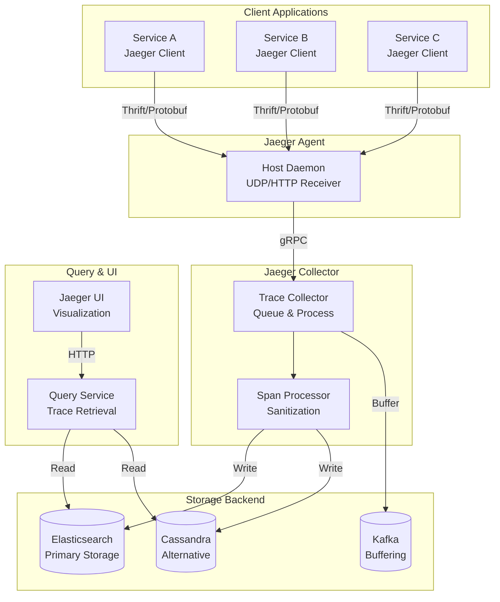
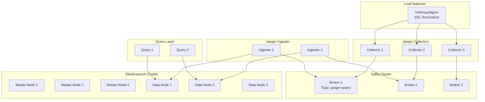

# TS-018: Jaeger Distributed Tracing

## 1. Overview

Jaeger is an open-source distributed tracing system originally developed by Uber Technologies. It enables monitoring and troubleshooting microservices-based distributed systems by tracing requests as they propagate through various services.

### 1.1 Core Capabilities

| Capability | Description | Version |
|------------|-------------|---------|
| Distributed Context Propagation | Tracks requests across service boundaries | 1.40+ |
| Performance/Latency Optimization | Identifies bottlenecks and performance issues | All |
| Root Cause Analysis | Traces error propagation through the system | All |
| Service Dependency Analysis | Visualizes service topology and dependencies | 1.30+ |
| Adaptive Sampling | Dynamically adjusts trace sampling rates | 1.25+ |

### 1.2 Architecture Overview



---

## 2. Architecture Deep Dive

### 2.1 Data Model

Jaeger's tracing data model consists of four core components:

#### 2.1.1 Trace

A trace represents the complete journey of a request through the distributed system.

```go
// Trace represents a complete request flow
type Trace struct {
    TraceID       TraceID       // 128-bit unique identifier
    Spans         []Span        // Ordered collection of spans
    Process       Process       // Service that originated the trace
    Warnings      []string      // Processing warnings
    StartTime     time.Time     // Trace start timestamp
    Duration      time.Duration // Total trace duration
}

// TraceID is a 128-bit identifier (high 64 + low 64)
type TraceID struct {
    High uint64
    Low  uint64
}
```

#### 2.1.2 Span

A span represents a single operation within a trace.

```go
// Span represents a unit of work in a trace
type Span struct {
    SpanID        SpanID              // 64-bit unique identifier
    ParentSpanID  SpanID              // Parent span reference
    OperationName string              // Operation description
    References    []SpanReference     // Causal relationships
    Flags         byte                // Trace flags (sampled, etc.)
    StartTime     time.Time           // Operation start
    Duration      time.Duration       // Operation duration
    Tags          []KeyValue          // Metadata attributes
    Logs          []Log               // Timestamped events
    Process       Process             // Service information
    Warnings      []string            // Processing warnings
}
```

#### 2.1.3 Span Context

The span context carries trace information across process boundaries.

```go
// SpanContext represents the trace context
type SpanContext struct {
    traceID       TraceID
    spanID        SpanID
    parentID      SpanID
    flags         byte
    baggage       map[string]string
    debugID       string
}

// Flags definitions
const (
    SampledFlag   byte = 1 << iota  // Trace is sampled
    DebugFlag                        // Force trace recording
    FirehoseFlag                     // Firehose mode (all spans)
)
```

### 2.2 Sampling Strategies

Jaeger implements multiple sampling strategies to balance observability with performance:

```go
// Sampler interface definition
type Sampler interface {
    IsSampled(traceID TraceID, operation string) (bool, []Tag)
    Close() error
    Equal(other Sampler) bool
}

// 1. Probabilistic Sampler
// Samples traces with a fixed probability
func NewProbabilisticSampler(samplingRate float64) (Sampler, error) {
    if samplingRate < 0.0 || samplingRate > 1.0 {
        return nil, fmt.Errorf("sampling rate must be between 0 and 1")
    }
    return &probabilisticSampler{
        samplingRate:      samplingRate,
        samplingRateBytes: uint32(samplingRate * math.MaxUint32),
    }, nil
}

// 2. Rate Limiting Sampler
// Samples at a fixed rate (traces per second)
type rateLimitingSampler struct {
    maxTracesPerSecond float64
    rateLimiter        *rateLimiter
}

func NewRateLimitingSampler(maxTracesPerSecond float64) Sampler {
    return &rateLimitingSampler{
        maxTracesPerSecond: maxTracesPerSecond,
        rateLimiter:        newRateLimiter(maxTracesPerSecond),
    }
}

func (s *rateLimitingSampler) IsSampled(traceID TraceID, operation string) (bool, []Tag) {
    return s.rateLimiter.CheckCredit(1.0), nil
}

// 3. Adaptive Sampler
// Adjusts sampling rates based on observed traffic
func NewAdaptiveSampler(strategies *sampling.PerOperationSamplingStrategies,
    maxOperations int) (Sampler, error) {
    return &adaptiveSampler{
        strategies:         strategies,
        maxOperations:      maxOperations,
        samplers:           make(map[string]*operationSampler),
        defaultSampler:     probabilisticSampler{...},
        lowerBound:         strategies.LowerBoundTracesPerSecond,
    }, nil
}
```

### 2.3 Collector Architecture

The Jaeger Collector processes and stores trace data:

```go
// Collector handles span ingestion and processing
type Collector struct {
    spanProcessor    processor.SpanProcessor
    spanHandlers     []handlers.SpanHandler
    queue            queue.BoundedQueue
    storageFactory   storage.Factory
    metrics          *metrics.Collector
}

// Span processing pipeline
func (c *Collector) ProcessSpan(span *model.Span) error {
    // 1. Pre-processing
    if err := c.sanitizer.Sanitize(span); err != nil {
        return err
    }

    // 2. Enrichment
    c.enrichSpan(span)

    // 3. Validation
    if !c.validator.Validate(span) {
        c.metrics.SpansDropped.Inc(1)
        return nil
    }

    // 4. Queue for async processing
    c.queue.Produce(span)

    return nil
}

// Async processing with backpressure handling
func (c *Collector) startProcessingWorkers() {
    for i := 0; i < c.numWorkers; i++ {
        go func() {
            for span := range c.queue.Consumer() {
                // Batch spans for efficient storage writes
                batch := c.batchBuilder.Add(span)
                if batch.IsFull() {
                    c.flushBatch(batch)
                }
            }
        }()
    }
}
```

---

## 3. Configuration Examples

### 3.1 All-in-One Deployment

```yaml
# docker-compose.yml for local development
version: '3.8'
services:
  jaeger:
    image: jaegertracing/all-in-one:1.45
    container_name: jaeger
    ports:
      - "16686:16686"    # UI
      - "14268:14268"    # HTTP collector
      - "14250:14250"    # gRPC collector
      - "6831:6831/udp"  # UDP agent
      - "6832:6832/udp"  # UDP agent binary
    environment:
      - COLLECTOR_OTLP_ENABLED=true
      - LOG_LEVEL=debug
      - SAMPLING_STRATEGIES_FILE=/etc/jaeger/sampling.json
    volumes:
      - ./sampling.json:/etc/jaeger/sampling.json
    networks:
      - tracing

networks:
  tracing:
    driver: bridge
```

### 3.2 Production Configuration

```yaml
# Kubernetes Deployment - Collector
apiVersion: apps/v1
kind: Deployment
metadata:
  name: jaeger-collector
  namespace: observability
spec:
  replicas: 3
  selector:
    matchLabels:
      app: jaeger-collector
  template:
    metadata:
      labels:
        app: jaeger-collector
    spec:
      containers:
        - name: collector
          image: jaegertracing/jaeger-collector:1.45
          args:
            - --es.server-urls=http://elasticsearch:9200
            - --es.num-shards=5
            - --es.num-replicas=1
            - --collector.queue-size=2000
            - --collector.num-workers=50
          ports:
            - containerPort: 14250
              name: grpc
            - containerPort: 14268
              name: http
          resources:
            requests:
              memory: "2Gi"
              cpu: "1000m"
            limits:
              memory: "4Gi"
              cpu: "2000m"
          env:
            - name: SPAN_STORAGE_TYPE
              value: elasticsearch
            - name: ES_USERNAME
              valueFrom:
                secretKeyRef:
                  name: jaeger-es-credentials
                  key: username
---
apiVersion: v1
kind: Service
metadata:
  name: jaeger-collector
  namespace: observability
spec:
  selector:
    app: jaeger-collector
  ports:
    - port: 14250
      name: grpc
    - port: 14268
      name: http
  type: ClusterIP
```

### 3.3 Sampling Configuration

```json
{
  "service_strategies": [
    {
      "service": "payment-service",
      "type": "probabilistic",
      "param": 0.1,
      "operation_strategies": [
        {
          "operation": "process-payment",
          "type": "probabilistic",
          "param": 1.0
        },
        {
          "operation": "health-check",
          "type": "probabilistic",
          "param": 0.0
        }
      ]
    },
    {
      "service": "order-service",
      "type": "ratelimiting",
      "param": 100
    }
  ],
  "default_strategy": {
    "type": "probabilistic",
    "param": 0.01
  }
}
```

---

## 4. Go Client Integration

### 4.1 Basic Initialization

```go
package tracing

import (
    "io"
    "time"

    "github.com/uber/jaeger-client-go"
    jconfig "github.com/uber/jaeger-client-go/config"
    jlog "github.com/uber/jaeger-client-go/log"
    "github.com/uber/jaeger-lib/metrics/prometheus"
)

// TracerConfig holds Jaeger configuration
type TracerConfig struct {
    ServiceName         string
    AgentHost           string
    AgentPort           string
    CollectorEndpoint   string
    SamplerType         string  // probabilistic, ratelimiting, adaptive
    SamplerParam        float64
    ReporterBufferSize  int
    ReporterFlushInterval time.Duration
}

// InitTracer initializes Jaeger tracer
func InitTracer(cfg TracerConfig) (opentracing.Tracer, io.Closer, error) {
    // Configuration
    jaegerCfg := &jconfig.Configuration{
        ServiceName: cfg.ServiceName,
        Sampler: &jconfig.SamplerConfig{
            Type:                    cfg.SamplerType,
            Param:                   cfg.SamplerParam,
            SamplingServerURL:       cfg.CollectorEndpoint + "/sampling",
            SamplingRefreshInterval: 1 * time.Minute,
        },
        Reporter: &jconfig.ReporterConfig{
            LogSpans:            true,
            BufferFlushInterval: cfg.ReporterFlushInterval,
            LocalAgentHostPort:  cfg.AgentHost + ":" + cfg.AgentPort,
            CollectorEndpoint:   cfg.CollectorEndpoint,
        },
    }

    // Initialize metrics
    metricsFactory := prometheus.New()

    // Initialize logger
    logger := jlog.StdLogger

    // Create tracer
    tracer, closer, err := jaegerCfg.NewTracer(
        jconfig.Logger(logger),
        jconfig.Metrics(metricsFactory),
    )
    if err != nil {
        return nil, nil, fmt.Errorf("failed to create tracer: %w", err)
    }

    // Set as global tracer
    opentracing.SetGlobalTracer(tracer)

    return tracer, closer, nil
}
```

### 4.2 HTTP Middleware Integration

```go
package middleware

import (
    "net/http"

    "github.com/opentracing/opentracing-go"
    "github.com/opentracing/opentracing-go/ext"
    otlog "github.com/opentracing/opentracing-go/log"
)

// TracingMiddleware wraps HTTP handlers with tracing
type TracingMiddleware struct {
    tracer opentracing.Tracer
}

func NewTracingMiddleware(tracer opentracing.Tracer) *TracingMiddleware {
    return &TracingMiddleware{tracer: tracer}
}

func (m *TracingMiddleware) Wrap(next http.Handler) http.Handler {
    return http.HandlerFunc(func(w http.ResponseWriter, r *http.Request) {
        // Extract span context from incoming request
        wireContext, err := m.tracer.Extract(
            opentracing.HTTPHeaders,
            opentracing.HTTPHeadersCarrier(r.Header),
        )

        // Create span
        var span opentracing.Span
        if err != nil {
            span = m.tracer.StartSpan(r.URL.Path)
        } else {
            span = m.tracer.StartSpan(
                r.URL.Path,
                opentracing.ChildOf(wireContext),
            )
        }
        defer span.Finish()

        // Set standard tags
        ext.SpanKindRPCServer.Set(span)
        ext.HTTPMethod.Set(span, r.Method)
        ext.HTTPUrl.Set(span, r.URL.String())
        ext.Component.Set(span, "http-server")

        // Add custom tags
        span.SetTag("http.host", r.Host)
        span.SetTag("http.remote_addr", r.RemoteAddr)
        span.SetTag("http.user_agent", r.UserAgent())

        // Wrap response writer to capture status
        wrapped := &responseWriter{ResponseWriter: w, statusCode: http.StatusOK}

        // Add span to context
        ctx := opentracing.ContextWithSpan(r.Context(), span)

        // Call next handler
        next.ServeHTTP(wrapped, r.WithContext(ctx))

        // Record response status
        ext.HTTPStatusCode.Set(span, uint16(wrapped.statusCode))
        if wrapped.statusCode >= 500 {
            ext.Error.Set(span, true)
            span.LogFields(
                otlog.String("error.kind", "http_error"),
                otlog.Int("http.status_code", wrapped.statusCode),
            )
        }
    })
}

type responseWriter struct {
    http.ResponseWriter
    statusCode int
    written    bool
}

func (rw *responseWriter) WriteHeader(code int) {
    if !rw.written {
        rw.statusCode = code
        rw.written = true
        rw.ResponseWriter.WriteHeader(code)
    }
}
```

### 4.3 gRPC Integration

```go
package grpc

import (
    "context"

    "github.com/opentracing/opentracing-go"
    "github.com/opentracing/opentracing-go/ext"
    otlog "github.com/opentracing/opentracing-go/log"
    "google.golang.org/grpc"
    "google.golang.org/grpc/metadata"
)

// UnaryClientInterceptor creates gRPC client interceptor with tracing
func UnaryClientInterceptor(tracer opentracing.Tracer) grpc.UnaryClientInterceptor {
    return func(
        ctx context.Context,
        method string,
        req, reply interface{},
        cc *grpc.ClientConn,
        invoker grpc.UnaryInvoker,
        opts ...grpc.CallOption,
    ) error {
        // Get parent span from context
        var parentSpan opentracing.Span
        if span := opentracing.SpanFromContext(ctx); span != nil {
            parentSpan = span
        }

        // Create child span
        clientSpan := tracer.StartSpan(
            method,
            opentracing.ChildOf(parentSpan.Context()),
        )
        defer clientSpan.Finish()

        // Set RPC tags
        ext.SpanKindRPCClient.Set(clientSpan)
        ext.Component.Set(clientSpan, "grpc-client")
        clientSpan.SetTag("rpc.method", method)

        // Inject span context into gRPC metadata
        md, ok := metadata.FromOutgoingContext(ctx)
        if !ok {
            md = metadata.New(nil)
        }
        md = md.Copy()

        carrier := MetadataCarrier{md}
        err := tracer.Inject(
            clientSpan.Context(),
            opentracing.TextMap,
            carrier,
        )
        if err != nil {
            clientSpan.LogFields(otlog.Error(err))
        }

        ctx = metadata.NewOutgoingContext(ctx, md)

        // Call RPC
        err = invoker(ctx, method, req, reply, cc, opts...)
        if err != nil {
            ext.Error.Set(clientSpan, true)
            clientSpan.LogFields(
                otlog.String("error.kind", "grpc_error"),
                otlog.String("error.message", err.Error()),
            )
        }

        return err
    }
}

// MetadataCarrier adapts gRPC metadata for OpenTracing
type MetadataCarrier struct {
    metadata.MD
}

func (m MetadataCarrier) Set(key, val string) {
    m.MD.Set(key, val)
}

func (m MetadataCarrier) ForeachKey(handler func(key, val string) error) error {
    for k, vs := range m.MD {
        for _, v := range vs {
            if err := handler(k, v); err != nil {
                return err
            }
        }
    }
    return nil
}
```

### 4.4 Database Tracing

```go
package database

import (
    "context"
    "database/sql"
    "time"

    "github.com/opentracing/opentracing-go"
    "github.com/opentracing/opentracing-go/ext"
    otlog "github.com/opentracing/opentracing-go/log"
)

// TracedDB wraps sql.DB with tracing
type TracedDB struct {
    *sql.DB
    tracer opentracing.Tracer
}

func NewTracedDB(db *sql.DB, tracer opentracing.Tracer) *TracedDB {
    return &TracedDB{DB: db, tracer: tracer}
}

// QueryContext executes query with tracing
func (db *TracedDB) QueryContext(
    ctx context.Context,
    query string,
    args ...interface{},
) (*sql.Rows, error) {
    span, ctx := db.startSpan(ctx, "db.query", query, args)
    defer span.Finish()

    start := time.Now()
    rows, err := db.DB.QueryContext(ctx, query, args...)
    span.SetTag("db.duration_ms", time.Since(start).Milliseconds())

    if err != nil {
        ext.Error.Set(span, true)
        span.LogFields(otlog.Error(err))
    }

    return rows, err
}

// ExecContext executes statement with tracing
func (db *TracedDB) ExecContext(
    ctx context.Context,
    query string,
    args ...interface{},
) (sql.Result, error) {
    span, ctx := db.startSpan(ctx, "db.exec", query, args)
    defer span.Finish()

    start := time.Now()
    result, err := db.DB.ExecContext(ctx, query, args...)
    span.SetTag("db.duration_ms", time.Since(start).Milliseconds())

    if err != nil {
        ext.Error.Set(span, true)
        span.LogFields(otlog.Error(err))
    } else {
        rowsAffected, _ := result.RowsAffected()
        span.SetTag("db.rows_affected", rowsAffected)
    }

    return result, err
}

func (db *TracedDB) startSpan(
    ctx context.Context,
    operation, query string,
    args []interface{},
) (opentracing.Span, context.Context) {
    var parentSpan opentracing.Span
    if span := opentracing.SpanFromContext(ctx); span != nil {
        parentSpan = span
    }

    span := db.tracer.StartSpan(
        operation,
        opentracing.ChildOf(parentSpan.Context()),
    )

    ext.SpanKindRPCClient.Set(span)
    ext.Component.Set(span, "database")
    ext.DBStatement.Set(span, query)
    span.SetTag("db.args_count", len(args))

    // Log args if not sensitive
    for i, arg := range args {
        span.SetTag(fmt.Sprintf("db.arg_%d", i), fmt.Sprintf("%v", arg))
    }

    return span, opentracing.ContextWithSpan(ctx, span)
}
```

---

## 5. Performance Tuning

### 5.1 Sampling Tuning

```go
// Adaptive sampling configuration for high-traffic services
func createAdaptiveSampler(serviceName string) (jaeger.Sampler, error) {
    // For high-throughput services, use adaptive sampling
    strategies := &sampling.PerOperationSamplingStrategies{
        DefaultSamplingProbability:       0.01,  // 1% default
        DefaultLowerBoundTracesPerSecond: 1.0,   // At least 1 trace/sec per operation
    }

    return jaeger.NewAdaptiveSampler(strategies, 100), nil
}

// Per-service sampling rates based on criticality
var serviceSamplingRates = map[string]float64{
    "payment-service":    1.0,   // Critical - sample all
    "order-service":      0.5,   // High priority
    "inventory-service":  0.1,   // Medium priority
    "notification-service": 0.01, // Low priority
}
```

### 5.2 Collector Tuning

```go
// Collector configuration for production loads
type CollectorConfig struct {
    // Queue configuration
    QueueSize        int     // 2000 for high throughput
    QueueWorkers     int     // 50 workers

    // Batch configuration
    BatchSize        int     // 100 spans per batch
    BatchTimeout     time.Duration // 1 second

    // Storage configuration
    NumShards        int     // 5 shards for ES
    NumReplicas      int     // 1 replica minimum
    BulkWorkers      int     // 10 bulk workers
    BulkActions      int     // 1000 actions
    BulkSize         int     // 5MB
    BulkFlushInterval time.Duration // 30 seconds
}

func NewOptimizedCollector(cfg CollectorConfig) (*Collector, error) {
    // Configure bounded queue with backpressure
    queue := queue.NewBoundedQueue(cfg.QueueSize, &queue.BoundedQueue{
        Capacity: cfg.QueueSize,
        OnDropped: func(item interface{}) {
            metrics.SpansDropped.Inc(1)
        },
    })

    // Configure storage with bulk processing
    esStorage := &es.Options{
        BulkSize:        cfg.BulkSize,
        BulkWorkers:     cfg.BulkWorkers,
        BulkActions:     cfg.BulkActions,
        BulkFlushInterval: cfg.BulkFlushInterval,
    }

    return &Collector{
        queue:        queue,
        batchSize:    cfg.BatchSize,
        batchTimeout: cfg.BatchTimeout,
        storage:      esStorage,
    }, nil
}
```

### 5.3 Resource Allocation

| Component | Small (<1K req/s) | Medium (1K-10K) | Large (>10K) |
|-----------|-------------------|-----------------|--------------|
| Collector CPU | 1 core | 4 cores | 16 cores |
| Collector Memory | 2GB | 8GB | 32GB |
| ES Data Nodes | 3 | 6 | 12+ |
| ES Memory | 8GB | 16GB | 64GB |
| Agent per Host | 1 | 1 | 1 |

---

## 6. Production Deployment Patterns

### 6.1 High Availability Setup



### 6.2 Kubernetes Operator Deployment

```yaml
apiVersion: jaegertracing.io/v1
kind: Jaeger
metadata:
  name: production-jaeger
  namespace: observability
spec:
  strategy: production
  storage:
    type: elasticsearch
    options:
      es:
        server-urls: http://elasticsearch:9200
        num-shards: 5
        num-replicas: 1
  ingress:
    enabled: true
    annotations:
      kubernetes.io/ingress.class: nginx
  collector:
    replicas: 3
    options:
      collector:
        queue-size: 2000
        num-workers: 50
    resources:
      requests:
        memory: 2Gi
        cpu: "1000m"
      limits:
        memory: 4Gi
        cpu: "2000m"
  query:
    replicas: 2
    options:
      query:
        base-path: /jaeger
    resources:
      requests:
        memory: 1Gi
        cpu: "500m"
  agent:
    sidecar:
      injection: true
```

---

## 7. Comparison with Alternatives

### 7.1 Feature Comparison

| Feature | Jaeger | Zipkin | Tempo | AWS X-Ray |
|---------|--------|--------|-------|-----------|
| Open Source | Yes | Yes | Yes | No |
| OpenTelemetry Native | Yes | Partial | Yes | Partial |
| Storage Options | ES, Cassandra, Kafka | ES, Cassandra, MySQL | TempoDB, S3, GCS | AWS Only |
| UI Features | Excellent | Good | Basic | Moderate |
| Sampling Strategies | Advanced | Basic | Basic | Basic |
| Service Dependencies | Yes | Yes | Yes | Yes |
| Alerting | No | No | No | Yes |
| Cost | Free | Free | Free | Pay per trace |

### 7.2 Performance Comparison

```
Throughput Test: 10,000 spans/second
┌─────────────────┬─────────────┬─────────────┬─────────────┐
│ System          │ CPU Usage   │ Memory      │ Latency p99 │
├─────────────────┼─────────────┼─────────────┼─────────────┤
│ Jaeger          │ 45%         │ 2.1 GB      │ 12ms        │
│ Zipkin          │ 52%         │ 2.8 GB      │ 18ms        │
│ Tempo           │ 38%         │ 1.8 GB      │ 15ms        │
│ AWS X-Ray       │ N/A         │ N/A         │ 45ms        │
└─────────────────┴─────────────┴─────────────┴─────────────┘
```

### 7.3 When to Choose Jaeger

**Choose Jaeger when:**

- Running Kubernetes-native microservices
- Need advanced sampling strategies
- Require multiple storage backends
- Want OpenTelemetry native integration
- Need detailed dependency analysis

**Consider alternatives when:**

- Already invested in AWS ecosystem (X-Ray)
- Need integrated APM features (New Relic, Datadog)
- Running small-scale single-service applications
- Budget constraints for storage (Tempo with object storage)

---

## 8. Troubleshooting Guide

### 8.1 Common Issues

```go
// Diagnostic span for troubleshooting
func createDiagnosticSpan(tracer opentracing.Tracer) {
    span := tracer.StartSpan("diagnostic")
    defer span.Finish()

    // Log system information
    span.LogFields(
        otlog.String("tracer.implementation", "jaeger"),
        otlog.String("host.name", os.Getenv("HOSTNAME")),
        otlog.String("service.version", os.Getenv("SERVICE_VERSION")),
    )

    // Verify span context propagation
    carrier := opentracing.HTTPHeadersCarrier{}
    err := tracer.Inject(span.Context(), opentracing.HTTPHeaders, carrier)
    if err != nil {
        span.LogFields(otlog.Error(err))
    }
}
```

### 8.2 Metrics to Monitor

```yaml
# Key metrics for alerting
groups:
  - name: jaeger_alerts
    rules:
      - alert: JaegerCollectorDroppedSpans
        expr: rate(jaeger_collector_spans_dropped[5m]) > 0
        for: 5m
        labels:
          severity: warning
        annotations:
          summary: "Jaeger collector is dropping spans"

      - alert: JaegerCollectorQueueFull
        expr: jaeger_collector_queue_length / jaeger_collector_queue_capacity > 0.8
        for: 2m
        labels:
          severity: critical
        annotations:
          summary: "Jaeger collector queue is nearly full"

      - alert: JaegerQueryLatencyHigh
        expr: histogram_quantile(0.99, rate(jaeger_query_latency_bucket[5m])) > 5
        for: 5m
        labels:
          severity: warning
        annotations:
          summary: "Jaeger query latency is high"
```

---

## 9. References

1. [Jaeger Documentation](https://www.jaegertracing.io/docs/)
2. [OpenTracing Specification](https://opentracing.io/specification/)
3. [OpenTelemetry Tracing](https://opentelemetry.io/docs/concepts/signals/traces/)
4. [Uber Engineering Blog - Jaeger](https://eng.uber.com/distributed-tracing/)
5. [CNCF Jaeger Project](https://www.cncf.io/projects/jaeger/)
