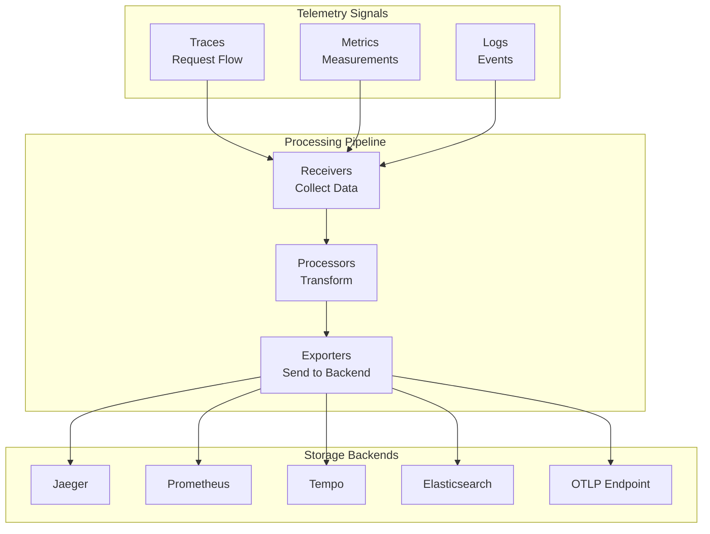

# TS-019: OpenTelemetry Instrumentation

## 1. Overview

OpenTelemetry is a vendor-neutral, open-source observability framework for instrumenting, generating, collecting, and exporting telemetry data (traces, metrics, and logs). It is a CNCF incubating project that merged OpenTracing and OpenCensus.

### 1.1 Core Components

| Component | Description | Go Package |
|-----------|-------------|------------|
| API | Provides interfaces for instrumentation | go.opentelemetry.io/otel |
| SDK | Implements the API, exports telemetry | go.opentelemetry.io/otel/sdk |
| Collector | Receives, processes, and exports data | opentelemetry-collector |
| Instrumentation Libraries | Pre-built instrumentation | otel/* |
| Semantic Conventions | Standard attribute names | semconv |

### 1.2 Signal Types



---

## 2. Architecture Deep Dive

### 2.1 Tracing Architecture

#### 2.1.1 Tracer Provider

The `TracerProvider` is the entry point for creating tracers:

```go
// TracerProvider manages tracer lifecycle and configuration
type TracerProvider struct {
    mu             sync.Mutex
    namedTracer    map[instrumentation.Scope]*tracer
    spanProcessors []SpanProcessor
    idGenerator    IDGenerator
    sampler        Sampler
    resource       *resource.Resource
    attributeLimit int
    eventLimit     int
    linkLimit      int
}

// Creates configured tracer provider
func NewTracerProvider(opts ...TracerProviderOption) *TracerProvider {
    provider := &TracerProvider{
        namedTracer:    make(map[instrumentation.Scope]*tracer),
        spanProcessors: make([]SpanProcessor, 0),
        idGenerator:    defaultIDGenerator(),
        sampler:        ParentBased(AlwaysSample()),
        attributeLimit: DefaultAttributeCountLimit,
        eventLimit:     DefaultEventCountLimit,
        linkLimit:      DefaultLinkCountLimit,
    }

    for _, opt := range opts {
        opt(provider)
    }

    return provider
}
```

#### 2.1.2 Span Lifecycle

```go
// Span implementation with full OpenTelemetry compliance
type span struct {
    // Identification
    spanContext    trace.SpanContext
    parent         trace.SpanContext
    spanKind       trace.SpanKind

    // Timing
    startTime      time.Time
    endTime        time.Time

    // Data
    name           string
    attributes     *attributeSet
    events         []trace.Event
    links          []trace.Link
    status         Status
    statusMessage  string

    // State
    tracerProvider *TracerProvider
    spanProcessor  SpanProcessor
    resource       *resource.Resource
    instrumentationScope instrumentation.Scope

    // Concurrency
    mu             sync.Mutex
    ended          bool
}

// End completes the span and exports it
func (s *span) End(options ...trace.SpanEndOption) {
    s.mu.Lock()
    defer s.mu.Unlock()

    if s.ended {
        return
    }

    // Apply end options
    cfg := trace.NewSpanEndConfig(options...)
    if cfg.Timestamp().IsZero() {
        s.endTime = time.Now()
    } else {
        s.endTime = cfg.Timestamp()
    }

    s.ended = true

    // Process and export
    if s.spanProcessor != nil {
        s.spanProcessor.OnEnd(export.SpanSnapshot{
            SpanContext:           s.spanContext,
            Parent:                s.parent,
            SpanKind:              s.spanKind,
            StartTime:             s.startTime,
            EndTime:               s.endTime,
            Name:                  s.name,
            Attributes:            s.attributes.ToSlice(),
            Events:                s.events,
            Links:                 s.links,
            Status:                s.status,
            Resource:              s.resource,
            InstrumentationScope:  s.instrumentationScope,
        })
    }
}
```

### 2.2 Context Propagation

OpenTelemetry uses a pluggable propagation system:

```go
// Propagators extract and inject context across boundaries
type TextMapPropagator interface {
    // Inject sets cross-cutting concerns into carrier
    Inject(ctx context.Context, carrier TextMapCarrier)

    // Extract reads cross-cutting concerns from carrier
    Extract(ctx context.Context, carrier TextMapCarrier) context.Context

    // Fields returns fields managed by this propagator
    Fields() []string
}

// Composite propagator for multiple concerns
type compositePropagator struct {
    propagators []TextMapPropagator
}

func (p *compositePropagator) Inject(ctx context.Context, carrier TextMapCarrier) {
    for _, propagator := range p.propagators {
        propagator.Inject(ctx, carrier)
    }
}

func (p *compositePropagator) Extract(ctx context.Context, carrier TextMapCarrier) context.Context {
    for _, propagator := range p.propagators {
        ctx = propagator.Extract(ctx, carrier)
    }
    return ctx
}

// Standard propagators
var (
    TraceContext = propagation.TraceContext{}  // W3C Trace Context
    Baggage      = propagation.Baggage{}       // W3C Baggage
)
```

### 2.3 Sampling Strategies

```go
// Sampler decides whether to sample a span
type Sampler interface {
    // ShouldSample returns sampling decision
    ShouldSample(parameters SamplingParameters) SamplingResult

    // Description returns sampler description
    Description() string
}

// SamplingParameters contains input for sampling decision
type SamplingParameters struct {
    ParentContext   context.Context
    TraceID         trace.TraceID
    Name            string
    Kind            trace.SpanKind
    Attributes      []attribute.KeyValue
    Links           []trace.Link
}

// Parent-based sampler delegates to parent or root sampler
type parentBasedSampler struct {
    root            Sampler
    remoteSampled   Sampler
    remoteNotSampled Sampler
    localSampled    Sampler
    localNotSampled Sampler
}

func ParentBased(root Sampler, samplers ...ParentBasedSamplerOption) Sampler {
    s := &parentBasedSampler{
        root:             root,
        remoteSampled:    AlwaysOn(),
        remoteNotSampled: AlwaysOff(),
        localSampled:     AlwaysOn(),
        localNotSampled:  AlwaysOff(),
    }
    // Apply options...
    return s
}

func (pb *parentBasedSampler) ShouldSample(p SamplingParameters) SamplingResult {
    parentSpanContext := trace.SpanContextFromContext(p.ParentContext)

    if parentSpanContext.IsValid() {
        if parentSpanContext.IsRemote() {
            if parentSpanContext.IsSampled() {
                return pb.remoteSampled.ShouldSample(p)
            }
            return pb.remoteNotSampled.ShouldSample(p)
        }
        if parentSpanContext.IsSampled() {
            return pb.localSampled.ShouldSample(p)
        }
        return pb.localNotSampled.ShouldSample(p)
    }

    return pb.root.ShouldSample(p)
}

// Trace ID ratio-based sampler
func TraceIDRatioBased(fraction float64) Sampler {
    if fraction >= 1 {
        return AlwaysOn()
    }
    if fraction <= 0 {
        return AlwaysOff()
    }

    return &traceIDRatioSampler{
        fraction: fraction,
        threshold: uint64(fraction * (1 << 63)),
    }
}
```

---

## 3. Configuration Examples

### 3.1 Basic SDK Configuration

```go
package otel

import (
    "context"
    "time"

    "go.opentelemetry.io/otel"
    "go.opentelemetry.io/otel/attribute"
    "go.opentelemetry.io/otel/exporters/otlp/otlptrace"
    "go.opentelemetry.io/otel/exporters/otlp/otlptrace/otlptracegrpc"
    "go.opentelemetry.io/otel/propagation"
    "go.opentelemetry.io/otel/sdk/resource"
    sdktrace "go.opentelemetry.io/otel/sdk/trace"
    semconv "go.opentelemetry.io/otel/semconv/v1.21.0"
    "go.opentelemetry.io/otel/trace"
)

// Config holds OpenTelemetry configuration
type Config struct {
    ServiceName         string
    ServiceVersion      string
    ServiceNamespace    string
    Environment         string
    OTLPEndpoint        string
    Insecure            bool
    SamplingRatio       float64
    BatchTimeout        time.Duration
    ExportTimeout       time.Duration
    MaxQueueSize        int
    MaxExportBatchSize  int
}

// InitTracerProvider initializes tracer with OTLP exporter
func InitTracerProvider(cfg Config) (*sdktrace.TracerProvider, error) {
    ctx := context.Background()

    // Create OTLP exporter
    opts := []otlptracegrpc.Option{
        otlptracegrpc.WithEndpoint(cfg.OTLPEndpoint),
        otlptracegrpc.WithRetry(otlptracegrpc.RetryConfig{
            Enabled:         true,
            InitialInterval: 1 * time.Second,
            MaxInterval:     10 * time.Second,
            MaxElapsedTime:  1 * time.Minute,
        }),
    }

    if cfg.Insecure {
        opts = append(opts, otlptracegrpc.WithInsecure())
    }

    client := otlptracegrpc.NewClient(opts...)
    exporter, err := otlptrace.New(ctx, client)
    if err != nil {
        return nil, fmt.Errorf("failed to create OTLP exporter: %w", err)
    }

    // Create resource
    res, err := resource.New(ctx,
        resource.WithAttributes(
            semconv.ServiceName(cfg.ServiceName),
            semconv.ServiceVersion(cfg.ServiceVersion),
            semconv.DeploymentEnvironment(cfg.Environment),
            attribute.String("service.namespace", cfg.ServiceNamespace),
        ),
        resource.WithProcessRuntimeDescription(),
        resource.WithOSType(),
        resource.WithHost(),
    )
    if err != nil {
        return nil, fmt.Errorf("failed to create resource: %w", err)
    }

    // Configure batch span processor
    bsp := sdktrace.NewBatchSpanProcessor(exporter,
        sdktrace.WithBatchTimeout(cfg.BatchTimeout),
        sdktrace.WithExportTimeout(cfg.ExportTimeout),
        sdktrace.WithMaxQueueSize(cfg.MaxQueueSize),
        sdktrace.WithMaxExportBatchSize(cfg.MaxExportBatchSize),
    )

    // Create tracer provider
    tp := sdktrace.NewTracerProvider(
        sdktrace.WithResource(res),
        sdktrace.WithSpanProcessor(bsp),
        sdktrace.WithSampler(sdktrace.TraceIDRatioBased(cfg.SamplingRatio)),
        sdktrace.WithIDGenerator(sdktrace.RandomIDGenerator()),
    )

    // Set as global provider
    otel.SetTracerProvider(tp)

    // Set propagators
    otel.SetTextMapPropagator(propagation.NewCompositeTextMapPropagator(
        propagation.TraceContext{},
        propagation.Baggage{},
    ))

    return tp, nil
}
```

### 3.2 Multiple Exporter Configuration

```go
// InitMultiExporterProvider configures multiple exporters
func InitMultiExporterProvider(cfg Config) (*sdktrace.TracerProvider, error) {
    ctx := context.Background()

    var exporters []sdktrace.SpanExporter

    // OTLP exporter for Jaeger/Tempo
    otlpExp, err := initOTLPExporter(cfg)
    if err != nil {
        return nil, err
    }
    exporters = append(exporters, otlpExp)

    // Jaeger exporter (deprecated but still supported)
    if cfg.JaegerEndpoint != "" {
        jaegerExp, err := jaeger.New(
            jaeger.WithCollectorEndpoint(cfg.JaegerEndpoint),
        )
        if err != nil {
            return nil, err
        }
        exporters = append(exporters, jaegerExp)
    }

    // Zipkin exporter
    if cfg.ZipkinEndpoint != "" {
        zipkinExp, err := zipkin.New(cfg.ZipkinEndpoint)
        if err != nil {
            return nil, err
        }
        exporters = append(exporters, zipkinExp)
    }

    // Console exporter for debugging
    if cfg.Debug {
        exporters = append(exporters, stdouttrace.New())
    }

    // Create resource
    res, _ := resource.New(ctx,
        resource.WithAttributes(
            semconv.ServiceName(cfg.ServiceName),
        ),
    )

    // Create tracer provider with all exporters
    opts := []sdktrace.TracerProviderOption{
        sdktrace.WithResource(res),
        sdktrace.WithSampler(createSampler(cfg)),
    }

    // Add span processors for each exporter
    for _, exp := range exporters {
        opts = append(opts, sdktrace.WithSpanProcessor(
            sdktrace.NewBatchSpanProcessor(exp),
        ))
    }

    return sdktrace.NewTracerProvider(opts...), nil
}

func createSampler(cfg Config) sdktrace.Sampler {
    // Parent-based sampling with different rates per environment
    var baseSampler sdktrace.Sampler

    switch cfg.Environment {
    case "production":
        baseSampler = sdktrace.TraceIDRatioBased(0.1)  // 10% sampling
    case "staging":
        baseSampler = sdktrace.TraceIDRatioBased(0.5)  // 50% sampling
    default:
        baseSampler = sdktrace.AlwaysSample()          // 100% sampling
    }

    return sdktrace.ParentBased(baseSampler,
        sdktrace.WithRemoteParentSampled(sdktrace.AlwaysSample()),
        sdktrace.WithRemoteParentNotSampled(sdktrace.NeverSample()),
    )
}
```

### 3.3 Collector Configuration

```yaml
# otel-collector-config.yaml
receivers:
  otlp:
    protocols:
      grpc:
        endpoint: 0.0.0.0:4317
        max_recv_msg_size_mib: 64
      http:
        endpoint: 0.0.0.0:4318
        cors:
          allowed_origins: ["*"]
          allowed_headers: ["*"]

  prometheus:
    config:
      scrape_configs:
        - job_name: 'otel-collector'
          scrape_interval: 10s
          static_configs:
            - targets: ['localhost:8888']

processors:
  batch:
    timeout: 1s
    send_batch_size: 1024
    send_batch_max_size: 2048

  memory_limiter:
    limit_mib: 1500
    spike_limit_mib: 512
    check_interval: 5s

  resource:
    attributes:
      - key: environment
        value: production
        action: upsert
      - key: service.namespace
        from_attribute: k8s.namespace.name
        action: insert

  tail_sampling:
    decision_wait: 10s
    num_traces: 100000
    expected_new_traces_per_sec: 1000
    policies:
      - name: errors
        type: status_code
        status_code: {status_codes: [ERROR]}
      - name: latency
        type: latency
        latency: {threshold_ms: 500}
      - name: probabilistic
        type: probabilistic
        probabilistic: {sampling_percentage: 10}

exporters:
  otlp/jaeger:
    endpoint: jaeger-collector:4317
    tls:
      insecure: true

  prometheusremotewrite:
    endpoint: http://prometheus:9090/api/v1/write

  logging:
    loglevel: debug

  file:
    path: ./traces.json

service:
  pipelines:
    traces:
      receivers: [otlp]
      processors: [memory_limiter, batch, tail_sampling, resource]
      exporters: [otlp/jaeger, logging]

    metrics:
      receivers: [otlp, prometheus]
      processors: [memory_limiter, batch, resource]
      exporters: [prometheusremotewrite]

  telemetry:
    logs:
      level: info
    metrics:
      level: detailed
      address: 0.0.0.0:8888
```

---

## 4. Go Client Integration

### 4.1 HTTP Server Instrumentation

```go
package middleware

import (
    "net/http"

    "go.opentelemetry.io/otel"
    "go.opentelemetry.io/otel/attribute"
    "go.opentelemetry.io/otel/codes"
    "go.opentelemetry.io/otel/propagation"
    semconv "go.opentelemetry.io/otel/semconv/v1.21.0"
    "go.opentelemetry.io/otel/trace"
)

var tracer = otel.Tracer("http-server")

// OtelMiddleware provides OpenTelemetry instrumentation
func OtelMiddleware(serviceName string) func(http.Handler) http.Handler {
    return func(next http.Handler) http.Handler {
        return http.HandlerFunc(func(w http.ResponseWriter, r *http.Request) {
            ctx := r.Context()

            // Extract trace context from incoming request
            ctx = otel.GetTextMapPropagator().Extract(ctx, propagation.HeaderCarrier(r.Header))

            // Create span
            spanName := r.Method + " " + r.URL.Path
            ctx, span := tracer.Start(ctx, spanName,
                trace.WithSpanKind(trace.SpanKindServer),
                trace.WithAttributes(
                    semconv.HTTPMethod(r.Method),
                    semconv.HTTPScheme(r.URL.Scheme),
                    semconv.HTTPTarget(r.URL.Path),
                    semconv.HTTPHost(r.Host),
                    semconv.HTTPUserAgent(r.UserAgent()),
                    semconv.NetSockPeerAddr(r.RemoteAddr),
                    semconv.HTTPRequestContentLength(int(r.ContentLength)),
                ),
            )
            defer span.End()

            // Wrap response writer to capture status
            wrapped := &responseRecorder{ResponseWriter: w, statusCode: http.StatusOK}

            // Execute handler
            next.ServeHTTP(wrapped, r.WithContext(ctx))

            // Record response attributes
            span.SetAttributes(
                semconv.HTTPStatusCode(wrapped.statusCode),
                semconv.HTTPResponseContentLength(wrapped.bytesWritten),
            )

            // Set status based on HTTP code
            if wrapped.statusCode >= 500 {
                span.SetStatus(codes.Error, "server error")
                span.RecordError(fmt.Errorf("HTTP %d", wrapped.statusCode))
            } else if wrapped.statusCode >= 400 {
                span.SetStatus(codes.Error, "client error")
            }
        })
    }
}

type responseRecorder struct {
    http.ResponseWriter
    statusCode   int
    bytesWritten int64
    written      bool
}

func (rr *responseRecorder) WriteHeader(code int) {
    if !rr.written {
        rr.statusCode = code
        rr.written = true
        rr.ResponseWriter.WriteHeader(code)
    }
}

func (rr *responseRecorder) Write(p []byte) (int, error) {
    if !rr.written {
        rr.WriteHeader(http.StatusOK)
    }
    n, err := rr.ResponseWriter.Write(p)
    rr.bytesWritten += int64(n)
    return n, err
}
```

### 4.2 gRPC Instrumentation

```go
package grpc

import (
    "context"
    "time"

    "google.golang.org/grpc"
    "google.golang.org/grpc/metadata"
    "google.golang.org/grpc/status"

    "go.opentelemetry.io/otel"
    "go.opentelemetry.io/otel/attribute"
    "go.opentelemetry.io/otel/codes"
    "go.opentelemetry.io/otel/propagation"
    semconv "go.opentelemetry.io/otel/semconv/v1.21.0"
    "go.opentelemetry.io/otel/trace"
)

var tracer = otel.Tracer("grpc-client")

// UnaryClientInterceptor creates OpenTelemetry client interceptor
func UnaryClientInterceptor() grpc.UnaryClientInterceptor {
    return func(
        ctx context.Context,
        method string,
        req, reply interface{},
        cc *grpc.ClientConn,
        invoker grpc.UnaryInvoker,
        opts ...grpc.CallOption,
    ) error {
        // Create span
        ctx, span := tracer.Start(ctx, method,
            trace.WithSpanKind(trace.SpanKindClient),
            trace.WithAttributes(
                semconv.RPCSystemGRPC,
                semconv.RPCMethod(method),
                semconv.RPCService(getServiceName(method)),
            ),
        )
        defer span.End()

        // Inject trace context into gRPC metadata
        md, ok := metadata.FromOutgoingContext(ctx)
        if !ok {
            md = metadata.New(nil)
        }
        md = md.Copy()

        otel.GetTextMapPropagator().Inject(ctx, &metadataCarrier{md})
        ctx = metadata.NewOutgoingContext(ctx, md)

        // Execute RPC
        start := time.Now()
        err := invoker(ctx, method, req, reply, cc, opts...)

        // Record metrics
        span.SetAttributes(
            semconv.RPCGRPCStatusCodeKey.Int64(int64(status.Code(err))),
        )
        span.SetAttributes(
            attribute.Int64("rpc.duration_ms", time.Since(start).Milliseconds()),
        )

        if err != nil {
            span.SetStatus(codes.Error, err.Error())
            span.RecordError(err)
        }

        return err
    }
}

// UnaryServerInterceptor creates OpenTelemetry server interceptor
func UnaryServerInterceptor() grpc.UnaryServerInterceptor {
    return func(
        ctx context.Context,
        req interface{},
        info *grpc.UnaryServerInfo,
        handler grpc.UnaryHandler,
    ) (interface{}, error) {
        // Extract trace context from metadata
        md, ok := metadata.FromIncomingContext(ctx)
        if !ok {
            md = metadata.New(nil)
        }

        ctx = otel.GetTextMapPropagator().Extract(ctx, &metadataCarrier{md})

        // Create span
        ctx, span := tracer.Start(ctx, info.FullMethod,
            trace.WithSpanKind(trace.SpanKindServer),
            trace.WithAttributes(
                semconv.RPCSystemGRPC,
                semconv.RPCMethod(info.FullMethod),
                semconv.RPCService(getServiceName(info.FullMethod)),
            ),
        )
        defer span.End()

        // Execute handler
        start := time.Now()
        resp, err := handler(ctx, req)

        // Record response
        span.SetAttributes(
            semconv.RPCGRPCStatusCodeKey.Int64(int64(status.Code(err))),
            attribute.Int64("rpc.duration_ms", time.Since(start).Milliseconds()),
        )

        if err != nil {
            span.SetStatus(codes.Error, err.Error())
            span.RecordError(err)
        }

        return resp, err
    }
}

// metadataCarrier adapts gRPC metadata for propagation
type metadataCarrier struct {
    metadata.MD
}

func (m *metadataCarrier) Get(key string) string {
    values := m.MD.Get(key)
    if len(values) == 0 {
        return ""
    }
    return values[0]
}

func (m *metadataCarrier) Set(key, value string) {
    m.MD.Set(key, value)
}

func (m *metadataCarrier) Keys() []string {
    keys := make([]string, 0, len(m.MD))
    for k := range m.MD {
        keys = append(keys, k)
    }
    return keys
}
```

### 4.3 Database Instrumentation

```go
package database

import (
    "context"
    "database/sql"
    "database/sql/driver"
    "fmt"
    "time"

    "go.opentelemetry.io/otel"
    "go.opentelemetry.io/otel/attribute"
    "go.opentelemetry.io/otel/codes"
    semconv "go.opentelemetry.io/otel/semconv/v1.21.0"
    "go.opentelemetry.io/otel/trace"
)

var dbTracer = otel.Tracer("database")

// OTelDriver wraps database/sql/driver with tracing
type OTelDriver struct {
    driver.Driver
    dbName string
    attrs  []attribute.KeyValue
}

// Open creates a new connection with tracing
func (d *OTelDriver) Open(name string) (driver.Conn, error) {
    conn, err := d.Driver.Open(name)
    if err != nil {
        return nil, err
    }
    return &otelConn{Conn: conn, driver: d}, nil
}

type otelConn struct {
    driver.Conn
    driver *OTelDriver
}

func (c *otelConn) Prepare(query string) (driver.Stmt, error) {
    stmt, err := c.Conn.Prepare(query)
    if err != nil {
        return nil, err
    }
    return &otelStmt{Stmt: stmt, query: query, driver: c.driver}, nil
}

func (c *otelConn) Begin() (driver.Tx, error) {
    ctx, span := dbTracer.Start(context.Background(), "sql.transaction.begin",
        trace.WithSpanKind(trace.SpanKindClient),
        trace.WithAttributes(c.driver.attrs...),
    )
    defer span.End()

    tx, err := c.Conn.Begin()
    if err != nil {
        span.SetStatus(codes.Error, err.Error())
        span.RecordError(err)
        return nil, err
    }

    return &otelTx{Tx: tx, ctx: ctx, span: span, driver: c.driver}, nil
}

type otelTx struct {
    driver.Tx
    ctx    context.Context
    span   trace.Span
    driver *OTelDriver
}

func (t *otelTx) Commit() error {
    defer t.span.End()

    err := t.Tx.Commit()
    if err != nil {
        t.span.SetStatus(codes.Error, err.Error())
        t.span.RecordError(err)
    } else {
        t.span.SetAttributes(attribute.String("transaction.result", "committed"))
    }
    return err
}

func (t *otelTx) Rollback() error {
    defer t.span.End()

    err := t.Tx.Rollback()
    if err != nil {
        t.span.SetStatus(codes.Error, err.Error())
        t.span.RecordError(err)
    } else {
        t.span.SetAttributes(attribute.String("transaction.result", "rolled_back"))
    }
    return err
}

type otelStmt struct {
    driver.Stmt
    query  string
    driver *OTelDriver
}

func (s *otelStmt) Query(args []driver.Value) (driver.Rows, error) {
    ctx, span := s.startSpan("sql.query")
    defer span.End()

    start := time.Now()
    rows, err := s.Stmt.Query(args)

    s.recordSpan(span, start, err)
    return rows, err
}

func (s *otelStmt) Exec(args []driver.Value) (driver.Result, error) {
    ctx, span := s.startSpan("sql.exec")
    defer span.End()

    start := time.Now()
    result, err := s.Stmt.Exec(args)

    s.recordSpan(span, start, err)

    if err == nil {
        rowsAffected, _ := result.RowsAffected()
        span.SetAttributes(attribute.Int64("db.rows_affected", rowsAffected))
    }

    return result, err
}

func (s *otelStmt) startSpan(operation string) (context.Context, trace.Span) {
    return dbTracer.Start(context.Background(), operation,
        trace.WithSpanKind(trace.SpanKindClient),
        trace.WithAttributes(
            append(s.driver.attrs,
                semconv.DBStatement(s.query),
                semconv.DBOperation(operation),
            )...,
        ),
    )
}

func (s *otelStmt) recordSpan(span trace.Span, start time.Time, err error) {
    span.SetAttributes(
        attribute.Int64("db.duration_ms", time.Since(start).Milliseconds()),
    )

    if err != nil {
        span.SetStatus(codes.Error, err.Error())
        span.RecordError(err)
    }
}

// RegisterOTelDriver registers a traced database driver
func RegisterOTelDriver(driverName, dbName string, attrs ...attribute.KeyValue) {
    driver := sql.Drivers()[driverName]
    if driver == nil {
        panic(fmt.Sprintf("driver %s not found", driverName))
    }

    sql.Register(driverName+"-otel", &OTelDriver{
        Driver: driver,
        dbName: dbName,
        attrs:  attrs,
    })
}
```

---

## 5. Performance Tuning

### 5.1 Batch Processing Configuration

```go
// Optimized batch processor configuration
func NewOptimizedBatchProcessor(exporter sdktrace.SpanExporter) sdktrace.SpanProcessor {
    return sdktrace.NewBatchSpanProcessor(exporter,
        // Batch timeout - maximum wait before sending
        sdktrace.WithBatchTimeout(100*time.Millisecond),

        // Export timeout - maximum time for single export
        sdktrace.WithExportTimeout(30*time.Second),

        // Maximum queue size - spans waiting to be processed
        sdktrace.WithMaxQueueSize(2048),

        // Maximum batch size - spans per export
        sdktrace.WithMaxExportBatchSize(512),
    )
}
```

### 5.2 Sampling Configuration

```go
// Production sampling strategy
func NewProductionSampler(env string) sdktrace.Sampler {
    var base sdktrace.Sampler

    switch env {
    case "production":
        // 1% base sampling, but always sample errors and slow requests
        base = sdktrace.ParentBased(
            sdktrace.TraceIDRatioBased(0.01),
            sdktrace.WithRemoteParentSampled(sdktrace.AlwaysSample()),
        )
    case "staging":
        // 50% sampling in staging
        base = sdktrace.TraceIDRatioBased(0.5)
    default:
        // 100% sampling in development
        base = sdktrace.AlwaysSample()
    }

    return base
}
```

### 5.3 Resource Limits

```yaml
# Resource limits configuration
limits:
  # Attribute limits
  attribute_value_length_limit: 4096
  attribute_count_limit: 128

  # Event limits
  event_count_limit: 128

  # Link limits
  link_count_limit: 128

  # Span limits
  span_attribute_value_length_limit: 4096
  span_attribute_count_limit: 128
  span_event_count_limit: 128
  span_link_count_limit: 128
  span_event_attribute_count_limit: 128
  span_link_attribute_count_limit: 128
```

---

## 6. Production Deployment Patterns

### 6.1 Kubernetes Deployment

```yaml
apiVersion: apps/v1
kind: Deployment
metadata:
  name: otel-collector
  namespace: observability
spec:
  replicas: 2
  selector:
    matchLabels:
      app: otel-collector
  template:
    metadata:
      labels:
        app: otel-collector
    spec:
      containers:
        - name: collector
          image: otel/opentelemetry-collector-contrib:0.88.0
          args:
            - --config=/conf/collector.yaml
          ports:
            - containerPort: 4317   # OTLP gRPC
            - containerPort: 4318   # OTLP HTTP
            - containerPort: 8888   # Metrics
          resources:
            requests:
              memory: "512Mi"
              cpu: "250m"
            limits:
              memory: "2Gi"
              cpu: "1000m"
          volumeMounts:
            - name: config
              mountPath: /conf
      volumes:
        - name: config
          configMap:
            name: otel-collector-config
---
apiVersion: v1
kind: Service
metadata:
  name: otel-collector
  namespace: observability
  annotations:
    prometheus.io/scrape: "true"
    prometheus.io/port: "8888"
spec:
  selector:
    app: otel-collector
  ports:
    - port: 4317
      name: otlp-grpc
    - port: 4318
      name: otlp-http
  type: ClusterIP
```

### 6.2 Auto-Instrumentation

```yaml
# Instrumentation CRD for auto-instrumentation
apiVersion: opentelemetry.io/v1alpha1
kind: Instrumentation
metadata:
  name: default-instrumentation
  namespace: observability
spec:
  exporter:
    endpoint: http://otel-collector:4317
  propagators:
    - tracecontext
    - baggage
  sampler:
    type: parentbased_traceidratio
    argument: "0.1"
  java:
    image: ghcr.io/open-telemetry/opentelemetry-operator/autoinstrumentation-java:latest
  nodejs:
    image: ghcr.io/open-telemetry/opentelemetry-operator/autoinstrumentation-nodejs:latest
  python:
    image: ghcr.io/open-telemetry/opentelemetry-operator/autoinstrumentation-python:latest
```

---

## 7. Comparison with Alternatives

### 7.1 Feature Matrix

| Feature | OpenTelemetry | Jaeger SDK | Zipkin | New Relic |
|---------|---------------|------------|--------|-----------|
| Open Standard | Yes | No | Partial | No |
| Multi-signal | Yes (T+M+L) | Traces only | Traces only | Yes |
| Vendor Lock-in | No | Low | Low | High |
| Go Support | Excellent | Good | Good | Good |
| Auto-instrumentation | Extensive | Limited | Limited | Extensive |
| Collector | Yes | No | No | N/A |
| Semantic Conventions | Rich | Basic | Basic | Rich |

### 7.2 Migration from Jaeger SDK

```go
// Before: Jaeger SDK
import "github.com/uber/jaeger-client-go"

tracer, closer, _ := cfg.NewTracer()
defer closer.Close()

// After: OpenTelemetry
import (
    "go.opentelemetry.io/otel"
    sdktrace "go.opentelemetry.io/otel/sdk/trace"
)

tp, _ := sdktrace.NewTracerProvider(...)
defer tp.Shutdown(context.Background())
otel.SetTracerProvider(tp)
```

---

## 8. References

1. [OpenTelemetry Documentation](https://opentelemetry.io/docs/)
2. [OpenTelemetry Go SDK](https://github.com/open-telemetry/opentelemetry-go)
3. [Semantic Conventions](https://opentelemetry.io/docs/concepts/semantic-conventions/)
4. [OTLP Specification](https://github.com/open-telemetry/opentelemetry-specification/blob/main/specification/protocol/otlp.md)
5. [CNCF OpenTelemetry Project](https://www.cncf.io/projects/opentelemetry/)
