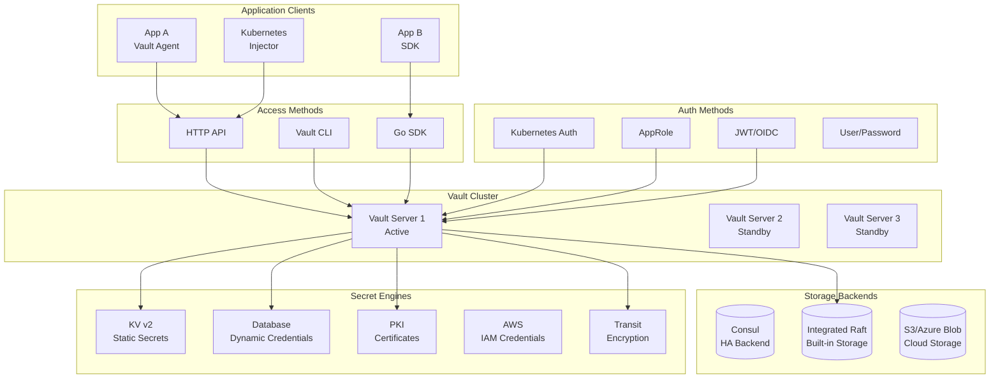
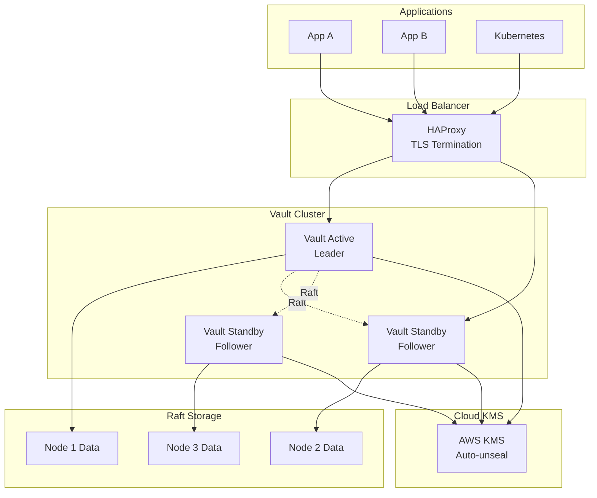

# TS-020: Vault Secrets Management

## 1. Overview

HashiCorp Vault is an identity-based secrets and encryption management system. It provides secure secret storage, dynamic secrets, data encryption, and identity-based access control for applications and infrastructure.

### 1.1 Core Capabilities

| Capability | Description | Use Case |
|------------|-------------|----------|
| Static Secrets | Store and retrieve static secrets | API keys, passwords |
| Dynamic Secrets | Generate on-demand credentials | Database credentials |
| PKI Certificates | Certificate lifecycle management | TLS/SSL certificates |
| Encryption as a Service | Application data encryption | PII protection |
| Identity-based Access | Fine-grained access control | Multi-tenant apps |

### 1.2 Architecture Overview



---

## 2. Architecture Deep Dive

### 2.1 Core Components

#### 2.1.1 Vault Server Architecture

```go
// Vault server core components
type VaultServer struct {
    // Core components
    Core        *Core           // Core vault logic
    HA          *HAController   // High availability
    Seal        Seal            // Seal/unseal mechanism
    
    // Storage
    Storage     PhysicalBackend // Physical storage
    Barrier     SecurityBarrier // Encryption barrier
    
    // Authentication and authorization
    TokenStore  *TokenStore     // Token management
    PolicyStore *PolicyStore    // Policy management
    
    // Plugin system
    Catalog     *PluginCatalog  // Plugin management
    Router      *Router         // Request routing
}

// Core handles the main vault operations
type Core struct {
    state         CoreState      // Sealed/Unsealed
    masterKey     []byte         // Master encryption key
    sealConfig    *SealConfig    // Seal configuration
    
    // Mount tables
    authMount     *MountTable    // Auth method mounts
    credentialMount *MountTable  // Credential backends
    secretMount   *MountTable    // Secret engine mounts
    
    // Replication
    replicationState *ReplicationState
}
```

#### 2.1.2 Seal/Unseal Mechanism

```go
// Seal is the interface for seal operations
type Seal interface {
    Init(ctx context.Context) error
    Finalize(ctx context.Context) error
    Seal(ctx context.Context) error
    Unseal(ctx context.Context, key []byte) error
    BarrierConfig(ctx context.Context) (*SealConfig, error)
    RecoveryConfig(ctx context.Context) (*SealConfig, error)
}

// Shamir seal implementation using Shamir's Secret Sharing
type ShamirSeal struct {
    secretThreshold int           // Shares needed to unseal
    secretShares    int           // Total shares generated
    keyring         *Keyring      // Master key storage
}

// AutoUnseal using cloud KMS
type AutoUnseal struct {
    kmsClient     cloudkms.Client
    kmsKeyName    string
    keyring       *Keyring
}

func (a *AutoUnseal) Unseal(ctx context.Context, _ []byte) error {
    // 1. Retrieve encrypted master key from storage
    blob, err := a.getMasterKeyBlob(ctx)
    if err != nil {
        return err
    }
    
    // 2. Decrypt using cloud KMS
    plaintext, err := a.kmsClient.Decrypt(ctx, a.kmsKeyName, blob)
    if err != nil {
        return err
    }
    
    // 3. Restore keyring
    return a.keyring.Restore(plaintext)
}
```

### 2.2 Secret Engines

#### 2.2.1 KV Secrets Engine (v2)

```go
// KV v2 with versioning support
type KVv2Engine struct {
    maxVersions        int           // Maximum versions per key
    casRequired        bool          // Check-and-set required
    deleteVersionAfter time.Duration // Auto-delete after
}

// Secret data with metadata
type KVSecret struct {
    Data     map[string]interface{} `json:"data"`
    Metadata struct {
        Version         int       `json:"version"`
        CreatedTime     time.Time `json:"created_time"`
        DeletionTime    time.Time `json:"deletion_time"`
        Destroyed       bool      `json:"destroyed"`
    } `json:"metadata"`
}

// Versioned write operation
func (e *KVv2Engine) Write(ctx context.Context, path string, data map[string]interface{}, opts WriteOptions) (*KVSecret, error) {
    // 1. Check-and-set validation
    if e.casRequired && opts.CAS != 0 {
        current, err := e.Read(ctx, path)
        if err != nil {
            return nil, err
        }
        if current.Metadata.Version != opts.CAS {
            return nil, ErrCheckAndSetFailed
        }
    }
    
    // 2. Encrypt data
    ciphertext, err := e.barrier.Encrypt(ctx, serialize(data))
    if err != nil {
        return nil, err
    }
    
    // 3. Store with new version
    version := e.incrementVersion(path)
    if err := e.storeVersion(ctx, path, version, ciphertext); err != nil {
        return nil, err
    }
    
    // 4. Cleanup old versions
    e.cleanupOldVersions(ctx, path)
    
    return e.Read(ctx, path)
}
```

#### 2.2.2 Database Secrets Engine

```go
// Database engine for dynamic credentials
type DatabaseEngine struct {
    connections map[string]*DBConnection
    credentials map[string]*DynamicCredential
    rotationQueue chan *RotationEntry
}

type DBConnection struct {
    PluginName    string                 // MySQL, PostgreSQL, etc.
    ConnectionURL string
    AllowedRoles  []string
    MaxOpenConns  int
    MaxIdleConns  int
    VerifyConnection bool
}

// Generate dynamic credentials
func (e *DatabaseEngine) GenerateCredentials(ctx context.Context, role string) (*DynamicCredential, error) {
    // 1. Get role configuration
    roleConfig, err := e.getRole(role)
    if err != nil {
        return nil, err
    }
    
    // 2. Generate unique credentials
    username := generateUsername(role)
    password := generateSecurePassword(roleConfig.PasswordLength)
    
    // 3. Create user in database
    conn := e.connections[roleConfig.Connection]
    if err := conn.plugin.CreateUser(ctx, username, password, roleConfig); err != nil {
        return nil, err
    }
    
    // 4. Schedule revocation
    cred := &DynamicCredential{
        Username:    username,
        Password:    password,
        LeaseID:     generateLeaseID(),
        TTL:         roleConfig.DefaultTTL,
        MaxTTL:      roleConfig.MaxTTL,
        RevokeAfter: time.Now().Add(roleConfig.DefaultTTL),
    }
    
    e.scheduleRevocation(cred)
    
    return cred, nil
}
```

### 2.3 Authentication Methods

#### 2.3.1 Kubernetes Auth

```go
// Kubernetes authentication method
type KubernetesAuth struct {
    kubernetesHost       string
    kubernetesCACert     []byte
    tokenReviewerJWT     string
    issuer               string
    disableLocalCAJWT    bool
}

// Login validates Kubernetes service account token
type KubernetesLoginRequest struct {
    Role     string // Vault role name
    JWT      string // Kubernetes service account token
}

func (k *KubernetesAuth) Login(ctx context.Context, req *KubernetesLoginRequest) (*AuthResponse, error) {
    // 1. Validate JWT signature
    token, err := jwt.Parse(req.JWT, k.getKeyFunc())
    if err != nil {
        return nil, ErrInvalidToken
    }
    
    // 2. Validate with TokenReview API
    review := &authv1.TokenReview{
        Spec: authv1.TokenReviewSpec{
            Token: req.JWT,
        },
    }
    
    reviewed, err := k.k8sClient.AuthenticationV1().TokenReviews().Create(ctx, review, metav1.CreateOptions{})
    if err != nil {
        return nil, err
    }
    
    if !reviewed.Status.Authenticated {
        return nil, ErrAuthenticationFailed
    }
    
    // 3. Get role configuration
    role, err := k.getRole(req.Role)
    if err != nil {
        return nil, err
    }
    
    // 4. Validate service account name and namespace
    saName := reviewed.Status.User.Username
    namespace := reviewed.Status.User.Extra["authentication.kubernetes.io/pod-uid"]
    
    if !role.allowedServiceAccount(saName) || !role.allowedNamespace(namespace) {
        return nil, ErrUnauthorized
    }
    
    // 5. Generate Vault token
    return k.generateToken(role, saName, namespace)
}
```

---

## 3. Configuration Examples

### 3.1 Development Configuration

```hcl
# vault-dev.hcl - Development configuration
storage "raft" {
  path    = "./vault/data"
  node_id = "node1"
}

listener "tcp" {
  address     = "127.0.0.1:8200"
  tls_disable = "true"
}

api_addr = "http://127.0.0.1:8200"
cluster_addr = "https://127.0.0.1:8201"

ui = true

# Enable audit logging
audit_file {
  path = "./vault/audit.log"
}
```

### 3.2 Production HA Configuration

```hcl
# vault-prod.hcl - Production configuration
storage "raft" {
  path    = "/opt/vault/data"
  node_id = "vault-node-1"
  
  retry_leader_election = true
  retry_raft_leader_election = true
  
  autopilot {
    cleanup_dead_servers = true
    last_contact_threshold = "200ms"
    last_contact_failure_threshold = "10s"
    max_trailing_logs = 250
    min_quorum = 3
    server_stabilization_time = "10s"
  }
}

listener "tcp" {
  address       = "0.0.0.0:8200"
  tls_cert_file = "/opt/vault/tls/vault.crt"
  tls_key_file  = "/opt/vault/tls/vault.key"
  tls_min_version = "tls12"
  
  # TLS cipher suites
  tls_cipher_suites = "TLS_ECDHE_RSA_WITH_AES_128_GCM_SHA256,TLS_ECDHE_ECDSA_WITH_AES_128_GCM_SHA256"
  
  # X-Forwarded-For support
  x_forwarded_for_authorized_addrs = "10.0.0.0/8"
  x_forwarded_for_hop_skips = 1
}

# Cluster listener
listener "tcp" {
  address       = "0.0.0.0:8201"
  tls_cert_file = "/opt/vault/tls/vault.crt"
  tls_key_file  = "/opt/vault/tls/vault.key"
  cluster_address = "0.0.0.0:8201"
}

api_addr     = "https://vault.example.com:8200"
cluster_addr = "https://vault-node-1:8201"

# Performance tuning
cache_size = 131072
disable_cache = false
disable_mlock = false

# Telemetry
telemetry {
  statsite_address = "statsite.example.com:8125"
  disable_hostname = false
  usage_gauge_period = "10m"
  maximum_gauge_cardinality = 500
  add_unique_aliases_to_cache = false
}

# Seal configuration - Auto-unseal with AWS KMS
seal "awskms" {
  region     = "us-east-1"
  kms_key_id = "arn:aws:kms:us-east-1:123456789:key/vault-unseal"
}

ui = true
log_level = "warn"
```

### 3.3 Kubernetes Deployment

```yaml
# vault-statefulset.yaml
apiVersion: apps/v1
kind: StatefulSet
metadata:
  name: vault
  namespace: vault
spec:
  serviceName: vault-internal
  replicas: 3
  podManagementPolicy: Parallel
  selector:
    matchLabels:
      app.kubernetes.io/name: vault
  template:
    metadata:
      labels:
        app.kubernetes.io/name: vault
      annotations:
        prometheus.io/scrape: "true"
        prometheus.io/port: "8200"
    spec:
      affinity:
        podAntiAffinity:
          requiredDuringSchedulingIgnoredDuringExecution:
            - labelSelector:
                matchLabels:
                  app.kubernetes.io/name: vault
              topologyKey: kubernetes.io/hostname
      terminationGracePeriodSeconds: 10
      securityContext:
        runAsUser: 100
        runAsGroup: 1000
        fsGroup: 1000
      containers:
        - name: vault
          image: hashicorp/vault:1.15.0
          args:
            - "server"
          securityContext:
            allowPrivilegeEscalation: false
            capabilities:
              add:
                - IPC_LOCK
          env:
            - name: VAULT_ADDR
              value: "https://127.0.0.1:8200"
            - name: VAULT_CACERT
              value: "/vault/tls/ca.crt"
            - name: VAULT_LOG_LEVEL
              value: "info"
            - name: POD_IP_ADDR
              valueFrom:
                fieldRef:
                  fieldPath: status.podIP
          ports:
            - containerPort: 8200
              name: http
            - containerPort: 8201
              name: internal
          readinessProbe:
            exec:
              command:
                - /bin/sh
                - -c
                - |
                  vault status -tls-skip-verify
            initialDelaySeconds: 5
            periodSeconds: 5
          resources:
            requests:
              memory: "256Mi"
              cpu: "250m"
            limits:
              memory: "512Mi"
              cpu: "500m"
          volumeMounts:
            - name: data
              mountPath: /vault/data
            - name: config
              mountPath: /vault/config
            - name: tls
              mountPath: /vault/tls
  volumeClaimTemplates:
    - metadata:
        name: data
      spec:
        accessModes: ["ReadWriteOnce"]
        storageClassName: "fast-ssd"
        resources:
          requests:
            storage: 10Gi
---
apiVersion: v1
kind: Service
metadata:
  name: vault-active
  namespace: vault
spec:
  selector:
    app.kubernetes.io/name: vault
    vault-active: "true"
  ports:
    - port: 8200
      targetPort: 8200
  publishNotReadyAddresses: false
```

---

## 4. Go Client Integration

### 4.1 Client Initialization

```go
package vault

import (
    "context"
    "fmt"
    "os"
    "time"
    
    vault "github.com/hashicorp/vault/api"
    "github.com/hashicorp/vault/api/auth/kubernetes"
)

// Config holds Vault client configuration
type Config struct {
    Address         string
    Token           string
    AuthMethod      string // token, kubernetes, approle
    
    // Kubernetes auth
    K8sRole         string
    K8sTokenPath    string
    
    // AppRole auth
    RoleID          string
    SecretID        string
    
    // TLS configuration
    CACertPath      string
    InsecureSkipVerify bool
    
    // Timeouts
    Timeout         time.Duration
    MaxRetries      int
}

// NewClient creates configured Vault client
func NewClient(cfg Config) (*vault.Client, error) {
    // Configure Vault client
    vConfig := vault.DefaultConfig()
    vConfig.Address = cfg.Address
    
    // Configure TLS
    if cfg.CACertPath != "" {
        tlsConfig := &vault.TLSConfig{
            CACert: cfg.CACertPath,
            Insecure: cfg.InsecureSkipVerify,
        }
        if err := vConfig.ConfigureTLS(tlsConfig); err != nil {
            return nil, fmt.Errorf("failed to configure TLS: %w", err)
        }
    }
    
    // Configure timeouts
    vConfig.Timeout = cfg.Timeout
    vConfig.MaxRetries = cfg.MaxRetries
    
    // Create client
    client, err := vault.NewClient(vConfig)
    if err != nil {
        return nil, fmt.Errorf("failed to create vault client: %w", err)
    }
    
    // Authenticate
    if err := authenticate(client, cfg); err != nil {
        return nil, fmt.Errorf("authentication failed: %w", err)
    }
    
    return client, nil
}

func authenticate(client *vault.Client, cfg Config) error {
    ctx := context.Background()
    
    switch cfg.AuthMethod {
    case "token":
        client.SetToken(cfg.Token)
        
    case "kubernetes":
        k8sAuth, err := kubernetes.NewKubernetesAuth(
            cfg.K8sRole,
            kubernetes.WithServiceAccountTokenPath(cfg.K8sTokenPath),
        )
        if err != nil {
            return err
        }
        
        secret, err := client.Auth().Login(ctx, k8sAuth)
        if err != nil {
            return err
        }
        
        if secret == nil || secret.Auth == nil {
            return fmt.Errorf("no auth info returned")
        }
        
        client.SetToken(secret.Auth.ClientToken)
        
    case "approle":
        // Implement AppRole authentication
        data := map[string]interface{}{
            "role_id":   cfg.RoleID,
            "secret_id": cfg.SecretID,
        }
        
        secret, err := client.Logical().Write("auth/approle/login", data)
        if err != nil {
            return err
        }
        
        client.SetToken(secret.Auth.ClientToken)
        
    default:
        return fmt.Errorf("unknown auth method: %s", cfg.AuthMethod)
    }
    
    return nil
}
```

### 4.2 Secret Management

```go
package vault

import (
    "context"
    "encoding/json"
    "fmt"
    "time"
    
    vault "github.com/hashicorp/vault/api"
)

// SecretManager handles Vault secret operations
type SecretManager struct {
    client *vault.Client
    prefix string // Mount path prefix
}

func NewSecretManager(client *vault.Client, prefix string) *SecretManager {
    return &SecretManager{
        client: client,
        prefix: prefix,
    }
}

// GetSecret retrieves a secret from Vault
func (sm *SecretManager) GetSecret(ctx context.Context, path string) (map[string]interface{}, error) {
    secret, err := sm.client.KVv2(sm.prefix).Get(ctx, path)
    if err != nil {
        return nil, fmt.Errorf("failed to get secret: %w", err)
    }
    
    return secret.Data, nil
}

// GetSecretWithVersion retrieves a specific version
func (sm *SecretManager) GetSecretWithVersion(ctx context.Context, path string, version int) (map[string]interface{}, error) {
    secret, err := sm.client.KVv2(sm.prefix).GetVersion(ctx, path, version)
    if err != nil {
        return nil, fmt.Errorf("failed to get secret version: %w", err)
    }
    
    return secret.Data, nil
}

// PutSecret stores a secret with versioning
func (sm *SecretManager) PutSecret(ctx context.Context, path string, data map[string]interface{}) error {
    _, err := sm.client.KVv2(sm.prefix).Put(ctx, path, data)
    if err != nil {
        return fmt.Errorf("failed to put secret: %w", err)
    }
    
    return nil
}

// PutSecretWithCAS stores with check-and-set
func (sm *SecretManager) PutSecretWithCAS(ctx context.Context, path string, data map[string]interface{}, casVersion int) error {
    opts := vault.KVOption{
        CAS: casVersion,
    }
    
    _, err := sm.client.KVv2(sm.prefix).Put(ctx, path, data, opts)
    if err != nil {
        return fmt.Errorf("CAS failed: %w", err)
    }
    
    return nil
}

// DeleteSecret soft-deletes a secret (keeps versions)
func (sm *SecretManager) DeleteSecret(ctx context.Context, path string) error {
    err := sm.client.KVv2(sm.prefix).Delete(ctx, path)
    if err != nil {
        return fmt.Errorf("failed to delete secret: %w", err)
    }
    
    return nil
}

// DestroySecret permanently destroys all versions
func (sm *SecretManager) DestroySecret(ctx context.Context, path string) error {
    err := sm.client.KVv2(sm.prefix).DeleteMetadata(ctx, path)
    if err != nil {
        return fmt.Errorf("failed to destroy secret: %w", err)
    }
    
    return nil
}

// ListSecrets lists all secrets under a path
func (sm *SecretManager) ListSecrets(ctx context.Context, path string) ([]string, error) {
    secret, err := sm.client.KVv2(sm.prefix).List(ctx, path)
    if err != nil {
        return nil, fmt.Errorf("failed to list secrets: %w", err)
    }
    
    keys, ok := secret.Data["keys"].([]interface{})
    if !ok {
        return nil, nil
    }
    
    result := make([]string, len(keys))
    for i, k := range keys {
        result[i] = k.(string)
    }
    
    return result, nil
}
```

### 4.3 Database Dynamic Credentials

```go
package vault

import (
    "context"
    "database/sql"
    "fmt"
    "sync"
    "time"
    
    _ "github.com/lib/pq"
    vault "github.com/hashicorp/vault/api"
)

// DynamicDBCredentials manages database credentials
type DynamicDBCredentials struct {
    client     *vault.Client
    role       string
    dbPath     string
    
    mu         sync.RWMutex
    creds      *DBCredentials
    leaseExpiry time.Time
}

type DBCredentials struct {
    Username string
    Password string
    LeaseID  string
}

func NewDynamicDBCredentials(client *vault.Client, dbPath, role string) *DynamicDBCredentials {
    d := &DynamicDBCredentials{
        client: client,
        role:   role,
        dbPath: dbPath,
    }
    
    // Start background renewal
    go d.renewalLoop()
    
    return d
}

// GetCredentials returns current or new credentials
func (d *DynamicDBCredentials) GetCredentials(ctx context.Context) (*DBCredentials, error) {
    d.mu.RLock()
    if d.creds != nil && time.Now().Before(d.leaseExpiry.Add(-5*time.Minute)) {
        d.mu.RUnlock()
        return d.creds, nil
    }
    d.mu.RUnlock()
    
    return d.generateCredentials(ctx)
}

func (d *DynamicDBCredentials) generateCredentials(ctx context.Context) (*DBCredentials, error) {
    d.mu.Lock()
    defer d.mu.Unlock()
    
    // Double-check after acquiring lock
    if d.creds != nil && time.Now().Before(d.leaseExpiry.Add(-5*time.Minute)) {
        return d.creds, nil
    }
    
    path := fmt.Sprintf("%s/creds/%s", d.dbPath, d.role)
    secret, err := d.client.Logical().ReadWithContext(ctx, path)
    if err != nil {
        return nil, fmt.Errorf("failed to generate credentials: %w", err)
    }
    
    if secret == nil || secret.Data == nil {
        return nil, fmt.Errorf("no credentials returned")
    }
    
    d.creds = &DBCredentials{
        Username: secret.Data["username"].(string),
        Password: secret.Data["password"].(string),
        LeaseID:  secret.LeaseID,
    }
    
    d.leaseExpiry = time.Now().Add(time.Duration(secret.LeaseDuration) * time.Second)
    
    return d.creds, nil
}

func (d *DynamicDBCredentials) renewalLoop() {
    ticker := time.NewTicker(1 * time.Minute)
    defer ticker.Stop()
    
    for range ticker.C {
        d.mu.RLock()
        if d.creds == nil || d.creds.LeaseID == "" {
            d.mu.RUnlock()
            continue
        }
        leaseID := d.creds.LeaseID
        d.mu.RUnlock()
        
        // Renew if close to expiry
        if time.Now().After(d.leaseExpiry.Add(-10 * time.Minute)) {
            if err := d.renewLease(context.Background(), leaseID); err != nil {
                // Force credential regeneration on next use
                d.mu.Lock()
                d.creds = nil
                d.mu.Unlock()
            }
        }
    }
}

func (d *DynamicDBCredentials) renewLease(ctx context.Context, leaseID string) error {
    secret, err := d.client.Sys().RenewWithContext(ctx, leaseID, 0)
    if err != nil {
        return err
    }
    
    d.mu.Lock()
    d.leaseExpiry = time.Now().Add(time.Duration(secret.LeaseDuration) * time.Second)
    d.mu.Unlock()
    
    return nil
}

// OpenDB creates a database connection using dynamic credentials
func (d *DynamicDBCredentials) OpenDB(ctx context.Context, connStr string) (*sql.DB, error) {
    creds, err := d.GetCredentials(ctx)
    if err != nil {
        return nil, err
    }
    
    connStr = fmt.Sprintf(connStr, creds.Username, creds.Password)
    
    db, err := sql.Open("postgres", connStr)
    if err != nil {
        return nil, err
    }
    
    return db, nil
}
```

### 4.4 Transit Encryption

```go
package vault

import (
    "context"
    "encoding/base64"
    "fmt"
    
    vault "github.com/hashicorp/vault/api"
)

// TransitEncryption provides encryption as a service
type TransitEncryption struct {
    client  *vault.Client
    mountPath string
}

func NewTransitEncryption(client *vault.Client, mountPath string) *TransitEncryption {
    return &TransitEncryption{
        client:    client,
        mountPath: mountPath,
    }
}

// Encrypt encrypts plaintext using specified key
func (t *TransitEncryption) Encrypt(ctx context.Context, keyName string, plaintext []byte) (string, error) {
    path := fmt.Sprintf("%s/encrypt/%s", t.mountPath, keyName)
    
    data := map[string]interface{}{
        "plaintext": base64.StdEncoding.EncodeToString(plaintext),
    }
    
    secret, err := t.client.Logical().WriteWithContext(ctx, path, data)
    if err != nil {
        return "", fmt.Errorf("encryption failed: %w", err)
    }
    
    ciphertext, ok := secret.Data["ciphertext"].(string)
    if !ok {
        return "", fmt.Errorf("no ciphertext in response")
    }
    
    return ciphertext, nil
}

// Decrypt decrypts ciphertext
func (t *TransitEncryption) Decrypt(ctx context.Context, keyName string, ciphertext string) ([]byte, error) {
    path := fmt.Sprintf("%s/decrypt/%s", t.mountPath, keyName)
    
    data := map[string]interface{}{
        "ciphertext": ciphertext,
    }
    
    secret, err := t.client.Logical().WriteWithContext(ctx, path, data)
    if err != nil {
        return nil, fmt.Errorf("decryption failed: %w", err)
    }
    
    plaintextB64, ok := secret.Data["plaintext"].(string)
    if !ok {
        return nil, fmt.Errorf("no plaintext in response")
    }
    
    return base64.StdEncoding.DecodeString(plaintextB64)
}

// RotateKey rotates the specified encryption key
func (t *TransitEncryption) RotateKey(ctx context.Context, keyName string) error {
    path := fmt.Sprintf("%s/keys/%s/rotate", t.mountPath, keyName)
    
    _, err := t.client.Logical().WriteWithContext(ctx, path, nil)
    if err != nil {
        return fmt.Errorf("key rotation failed: %w", err)
    }
    
    return nil
}

// Rewrap re-encrypts ciphertext with latest key version
func (t *TransitEncryption) Rewrap(ctx context.Context, keyName string, ciphertext string) (string, error) {
    path := fmt.Sprintf("%s/rewrap/%s", t.mountPath, keyName)
    
    data := map[string]interface{}{
        "ciphertext": ciphertext,
    }
    
    secret, err := t.client.Logical().WriteWithContext(ctx, path, data)
    if err != nil {
        return "", fmt.Errorf("rewrap failed: %w", err)
    }
    
    newCiphertext, ok := secret.Data["ciphertext"].(string)
    if !ok {
        return "", fmt.Errorf("no ciphertext in response")
    }
    
    return newCiphertext, nil
}

// BatchEncrypt encrypts multiple items efficiently
func (t *TransitEncryption) BatchEncrypt(ctx context.Context, keyName string, plaintexts [][]byte) ([]string, error) {
    path := fmt.Sprintf("%s/encrypt/%s", t.mountPath, keyName)
    
    batchItems := make([]map[string]interface{}, len(plaintexts))
    for i, pt := range plaintexts {
        batchItems[i] = map[string]interface{}{
            "plaintext": base64.StdEncoding.EncodeToString(pt),
        }
    }
    
    data := map[string]interface{}{
        "batch_input": batchItems,
    }
    
    secret, err := t.client.Logical().WriteWithContext(ctx, path, data)
    if err != nil {
        return nil, fmt.Errorf("batch encryption failed: %w", err)
    }
    
    results, ok := secret.Data["batch_results"].([]interface{})
    if !ok {
        return nil, fmt.Errorf("no batch results in response")
    }
    
    ciphertexts := make([]string, len(results))
    for i, result := range results {
        r := result.(map[string]interface{})
        ciphertexts[i] = r["ciphertext"].(string)
    }
    
    return ciphertexts, nil
}
```

---

## 5. Performance Tuning

### 5.1 Connection Pooling

```go
// Optimized Vault client configuration
func NewOptimizedClient(cfg Config) (*vault.Client, error) {
    vConfig := vault.DefaultConfig()
    
    // HTTP client tuning
    httpClient := &http.Client{
        Timeout: cfg.Timeout,
        Transport: &http.Transport{
            MaxIdleConns:        100,
            MaxIdleConnsPerHost: 100,
            MaxConnsPerHost:     100,
            IdleConnTimeout:     90 * time.Second,
            TLSHandshakeTimeout: 10 * time.Second,
            DisableCompression:  false,
        },
    }
    
    vConfig.HttpClient = httpClient
    vConfig.Timeout = cfg.Timeout
    vConfig.MaxRetries = cfg.MaxRetries
    
    return vault.NewClient(vConfig)
}
```

### 5.2 Lease Renewal Strategy

```go
// SmartLeaseManager handles lease lifecycle
type SmartLeaseManager struct {
    client       *vault.Client
    leases       map[string]*LeaseInfo
    renewWindow  time.Duration
    mu           sync.RWMutex
}

type LeaseInfo struct {
    ID          string
    Expiry      time.Time
    LastRenewed time.Time
    RenewCount  int
}

func (m *SmartLeaseManager) RenewIfNeeded(ctx context.Context, leaseID string) error {
    m.mu.RLock()
    info, exists := m.leases[leaseID]
    m.mu.RUnlock()
    
    if !exists {
        return fmt.Errorf("unknown lease: %s", leaseID)
    }
    
    // Check if renewal is needed
    if time.Until(info.Expiry) > m.renewWindow {
        return nil // Not yet time to renew
    }
    
    // Perform renewal
    secret, err := m.client.Sys().RenewWithContext(ctx, leaseID, 0)
    if err != nil {
        return fmt.Errorf("lease renewal failed: %w", err)
    }
    
    m.mu.Lock()
    info.Expiry = time.Now().Add(time.Duration(secret.LeaseDuration) * time.Second)
    info.LastRenewed = time.Now()
    info.RenewCount++
    m.mu.Unlock()
    
    return nil
}
```

### 5.3 Caching Strategy

```go
// VaultCache implements client-side caching
type VaultCache struct {
    client    *vault.Client
    cache     map[string]*CacheEntry
    ttl       time.Duration
    mu        sync.RWMutex
}

type CacheEntry struct {
    Data      map[string]interface{}
    Expiry    time.Time
    Version   int
}

func (c *VaultCache) GetSecret(ctx context.Context, path string) (map[string]interface{}, error) {
    // Check cache
    c.mu.RLock()
    entry, exists := c.cache[path]
    c.mu.RUnlock()
    
    if exists && time.Now().Before(entry.Expiry) {
        return entry.Data, nil
    }
    
    // Fetch from Vault
    secret, err := c.client.KVv2("secret").Get(ctx, path)
    if err != nil {
        // Return stale data if available
        if exists {
            return entry.Data, nil
        }
        return nil, err
    }
    
    // Update cache
    c.mu.Lock()
    c.cache[path] = &CacheEntry{
        Data:   secret.Data,
        Expiry: time.Now().Add(c.ttl),
    }
    c.mu.Unlock()
    
    return secret.Data, nil
}
```

---

## 6. Production Deployment Patterns

### 6.1 High Availability Architecture



### 6.2 Disaster Recovery

```go
// DR configuration and operations
type DRConfig struct {
    PrimaryCluster    string
    DRCluster         string
    ReplicationMode   string // dr-performance or dr
    MountFilter       []string
}

// EnableDRReplication configures DR replication
func EnableDRReplication(client *vault.Client, cfg DRConfig) error {
    // 1. Enable replication on primary
    _, err := client.Logical().Write("sys/replication/performance/primary/enable", nil)
    if err != nil {
        return err
    }
    
    // 2. Generate secondary token
    tokenData := map[string]interface{}{
        "id":           cfg.DRCluster,
        "mount_filter": cfg.MountFilter,
    }
    
    secret, err := client.Logical().Write(
        "sys/replication/performance/primary/secondary-token",
        tokenData,
    )
    if err != nil {
        return err
    }
    
    token := secret.Data["token"].(string)
    
    // 3. On DR cluster, enable secondary
    drClient, _ := vault.NewClient(&vault.Config{Address: cfg.DRCluster})
    _, err = drClient.Logical().Write("sys/replication/performance/secondary/enable", map[string]interface{}{
        "token":   token,
        "ca_file": "/path/to/ca.crt",
    })
    
    return err
}

// PromoteDR promotes DR cluster to primary during disaster
func PromoteDR(client *vault.Client, force bool) error {
    data := map[string]interface{}{
        "force": force,
    }
    
    _, err := client.Logical().Write(
        "sys/replication/performance/secondary/promote",
        data,
    )
    
    return err
}
```

---

## 7. Comparison with Alternatives

| Feature | Vault | AWS Secrets Manager | Azure Key Vault | CyberArk |
|---------|-------|---------------------|-----------------|----------|
| Multi-cloud | Yes | AWS only | Azure only | Yes |
| Dynamic Secrets | Yes | Limited | Limited | Yes |
| PKI | Built-in | ACM | Yes | Limited |
| Encryption as Service | Yes | No | Yes | No |
| Kubernetes Integration | Excellent | Good | Good | Good |
| Price | Free/OSS | Pay per secret | Pay per operation | Enterprise $$$ |
| Self-hosted | Yes | No | No | Yes |
| HSM Support | Yes | CloudHSM | Managed HSM | Yes |

---

## 8. Security Best Practices

### 8.1 Token Policies

```hcl
# Application-specific policy
path "secret/data/{{identity.entity.name}}/*" {
  capabilities = ["create", "read", "update", "delete"]
}

path "secret/data/{{identity.entity.name}}/config" {
  capabilities = ["deny"]
}

path "database/creds/{{identity.entity.name}}-role" {
  capabilities = ["read"]
}

path "transit/encrypt/{{identity.entity.name}}" {
  capabilities = ["create", "update"]
}

path "transit/decrypt/{{identity.entity.name}}" {
  capabilities = ["create", "update"]
}

path "auth/token/renew-self" {
  capabilities = ["update"]
}
```

### 8.2 Audit Logging

```go
// Enable audit logging
func EnableAudit(client *vault.Client) error {
    auditPath := "audit/file"
    
    _, err := client.Logical().Write(fmt.Sprintf("sys/audit/%s", auditPath), map[string]interface{}{
        "type": "file",
        "options": map[string]string{
            "file_path": "/var/log/vault/audit.log",
        },
        "description": "Primary audit log",
    })
    
    return err
}
```

---

## 9. References

1. [Vault Documentation](https://developer.hashicorp.com/vault/docs)
2. [Vault API Documentation](https://developer.hashicorp.com/vault/api-docs)
3. [Vault Security Model](https://developer.hashicorp.com/vault/docs/internals/security)
4. [Vault Architecture](https://developer.hashicorp.com/vault/docs/internals/architecture)
5. [Go Vault Client](https://github.com/hashicorp/vault/tree/main/api)
