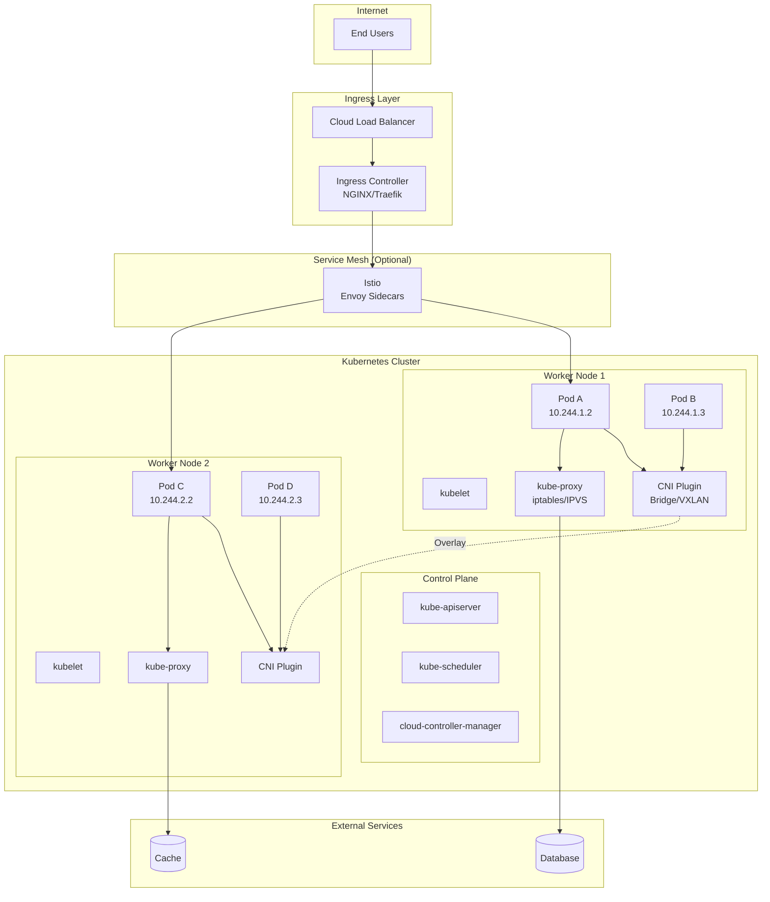

# TS-021: Kubernetes Networking

## 1. Overview

Kubernetes networking is fundamentally different from traditional Docker networking. It operates on a flat network model where every Pod gets its own IP address, enabling direct Pod-to-Pod communication without NAT across the cluster.

### 1.1 Core Principles

| Principle | Description | Implementation |
|-----------|-------------|----------------|
| Pod IP Uniqueness | Every Pod has a unique IP | CNI Plugin |
| Pod-to-Pod Connectivity | Direct communication without NAT | Overlay/Underlay Network |
| Pod-to-Service Abstraction | Stable endpoints for dynamic Pods | kube-proxy + iptables/IPVS |
| External-to-Service Access | Ingress traffic routing | Ingress Controller |

### 1.2 Network Architecture



---

## 2. Architecture Deep Dive

### 2.1 Container Network Interface (CNI)

The CNI specification defines how network interfaces are created and configured for containers:

```go
// CNI configuration structure
type NetConf struct {
    CNIVersion string `json:"cniVersion"`
    Name       string `json:"name"`
    Type       string `json:"type"` // e.g., "bridge", "calico", "cilium"

    // IPAM configuration
    IPAM *IPAMConfig `json:"ipam"`

    // DNS configuration
    DNS *DNSConfig `json:"dns"`

    // Plugin-specific configuration
    Bridge    string `json:"bridge,omitempty"`
    IsGateway bool   `json:"isGateway,omitempty"`
    IPMasq    bool   `json:"ipMasq,omitempty"`
    MTU       int    `json:"mtu,omitempty"`
    HairpinMode bool `json:"hairpinMode,omitempty"`
}

type IPAMConfig struct {
    Type       string            `json:"type"` // "host-local", "dhcp", "calico-ipam"
    RangeStart string            `json:"rangeStart,omitempty"`
    RangeEnd   string            `json:"rangeEnd,omitempty"`
    Subnet     string            `json:"subnet"`
    Gateway    string            `json:"gateway,omitempty"`
    Routes     []Route           `json:"routes,omitempty"`
    DataDir    string            `json:"dataDir,omitempty"`
    ResolvConf string            `json:"resolvConf,omitempty"`
}
```

### 2.2 CNI Plugin Execution Flow

```go
// CNI plugin interface
package main

import (
    "context"
    "encoding/json"
    "fmt"

    "github.com/containernetworking/cni/pkg/skel"
    "github.com/containernetworking/cni/pkg/types"
    "github.com/containernetworking/plugins/pkg/ipam"
    "github.com/containernetworking/plugins/pkg/ns"
)

// CmdAdd is called when a container is created
func CmdAdd(args *skel.CmdArgs) error {
    // 1. Parse CNI configuration
    netConf := &NetConf{}
    if err := json.Unmarshal(args.StdinData, netConf); err != nil {
        return fmt.Errorf("failed to parse config: %v", err)
    }

    // 2. Enter container network namespace
    netns, err := ns.GetNS(args.Netns)
    if err != nil {
        return fmt.Errorf("failed to open netns %q: %v", args.Netns, err)
    }
    defer netns.Close()

    // 3. Allocate IP address via IPAM
    result := &types.Result{}
    if netConf.IPAM.Type != "" {
        ipamResult, err := ipam.ExecAdd(netConf.IPAM.Type, args.StdinData)
        if err != nil {
            return err
        }
        result.IPs = ipamResult.IPs
        result.Routes = ipamResult.Routes
        result.DNS = ipamResult.DNS
    }

    // 4. Create network interface
    err = netns.Do(func(hostNS ns.NetNS) error {
        // Create veth pair
        hostVeth, containerVeth, err := setupVeth(args.ContainerID, netConf.MTU, hostNS)
        if err != nil {
            return err
        }

        // Configure container interface
        if err := configureContainerInterface(containerVeth, result.IPs); err != nil {
            return err
        }

        // Add routes
        for _, route := range result.Routes {
            if err := addRoute(containerVeth, route); err != nil {
                return err
            }
        }

        return nil
    })
    if err != nil {
        ipam.ExecDel(netConf.IPAM.Type, args.StdinData)
        return err
    }

    // 5. Configure host side
    if err := configureHostInterface(hostVeth, netConf); err != nil {
        ipam.ExecDel(netConf.IPAM.Type, args.StdinData)
        return err
    }

    // 6. Setup port mapping if needed
    if err := setupPortMapping(netConf, result.IPs[0].Address.IP); err != nil {
        ipam.ExecDel(netConf.IPAM.Type, args.StdinData)
        return err
    }

    return types.PrintResult(result, netConf.CNIVersion)
}

// CmdDel is called when a container is deleted
func CmdDel(args *skel.CmdArgs) error {
    netConf := &NetConf{}
    if err := json.Unmarshal(args.StdinData, netConf); err != nil {
        return err
    }

    // Release IP address
    if netConf.IPAM.Type != "" {
        if err := ipam.ExecDel(netConf.IPAM.Type, args.StdinData); err != nil {
            return err
        }
    }

    // Clean up network interfaces
    return cleanupInterfaces(args.ContainerID)
}
```

### 2.3 kube-proxy Implementation

kube-proxy manages Service endpoints and load balancing:

```go
// Service proxy implementation
type Proxier struct {
    // iptables/IPVS rules management
    iptables       utiliptables.Interface
    ipvs           utilipvs.Interface

    // Endpoint tracking
    endpointsMap   map[ServicePortName][]Endpoint
    serviceMap     map[ServicePortName]ServiceInfo

    // Sync period
    syncPeriod     time.Duration
    minSyncPeriod  time.Duration
}

// Sync updates iptables/IPVS rules based on current endpoints
func (p *Proxier) Sync() {
    p.mu.Lock()
    defer p.mu.Unlock()

    // 1. Build current rules snapshot
    activeEndpoints := make(map[ServicePortName]int)
    currentEndpoints := make(map[ServicePortName][]Endpoint)

    for svcName, endpoints := range p.endpointsMap {
        activeEndpoints[svcName] = len(endpoints)
        currentEndpoints[svcName] = endpoints
    }

    // 2. Update iptables rules for each service
    for svcName, svcInfo := range p.serviceMap {
        endpoints := currentEndpoints[svcName]

        // Create KUBE-SVC chain for this service
        svcChain := servicePortChainName(svcName, protocol)

        // Create endpoint chains
        for i, ep := range endpoints {
            epChain := servicePortEndpointChainName(svcName, protocol, ep)

            // Add endpoint-specific rules
            p.writeEndpointRules(epChain, ep, svcInfo)
        }

        // Add load balancing rules (random/round-robin)
        p.writeLoadBalancingRules(svcChain, endpoints)

        // Add service portal rules
        p.writeServicePortalRules(svcName, svcInfo, svcChain)
    }

    // 3. Apply changes
    p.applyIptablesRules()
}

// writeLoadBalancingRules implements load balancing
func (p *Proxier) writeLoadBalancingRules(svcChain utiliptables.Chain, endpoints []Endpoint) {
    // Using random mode with equal probability
    numEndpoints := len(endpoints)
    if numEndpoints == 0 {
        return
    }

    for i, ep := range endpoints {
        epChain := servicePortEndpointChainName(svcName, protocol, ep)

        // Calculate probability for this endpoint
        // With n endpoints, each has 1/n probability
        // After k endpoints processed, remaining probability is (n-k)/n
        probability := 1.0 / float64(numEndpoints-i)

        p.iptables.AppendRule(
            svcChain,
            "-m", "statistic",
            "--mode", "random",
            "--probability", fmt.Sprintf("%.4f", probability),
            "-j", string(epChain),
        )
    }
}
```

### 2.4 IPVS Mode Implementation

```go
// IPVS proxier for high-performance load balancing
type IPVSProxier struct {
    ipvs           utilipvs.Interface
    ipset          utilipset.Interface

    // Virtual services
    virtualServers map[ServicePortName]*utilipvs.VirtualServer

    // Real servers (endpoints)
    realServers    map[ServicePortName][]*utilipvs.RealServer
}

func (p *IPVSProxier) syncProxyRules() {
    // 1. Get current IPVS virtual servers
    vServers, err := p.ipvs.GetVirtualServers()
    if err != nil {
        return
    }

    // 2. Create/update virtual servers for each service
    for svcName, svcInfo := range p.serviceMap {
        vs := &utilipvs.VirtualServer{
            Address:   svcInfo.ClusterIP(),
            Port:      svcInfo.Port(),
            Protocol:  svcInfo.Protocol(),
            Scheduler: "rr", // Round-robin
        }

        // Add virtual server
        err := p.ipvs.AddVirtualServer(vs)
        if err != nil {
            // Might already exist
            p.ipvs.UpdateVirtualServer(vs)
        }

        // 3. Add real servers (endpoints)
        endpoints := p.endpointsMap[svcName]
        for _, ep := range endpoints {
            rs := &utilipvs.RealServer{
                Address: ep.IP(),
                Port:    ep.Port(),
                Weight:  1,
            }

            p.ipvs.AddRealServer(vs, rs)
        }

        // 4. Cleanup old real servers
        existingRS, _ := p.ipvs.GetRealServers(vs)
        for _, rs := range existingRS {
            if !endpointExists(rs, endpoints) {
                p.ipvs.DeleteRealServer(vs, rs)
            }
        }
    }
}
```

---

## 3. Configuration Examples

### 3.1 CNI Configuration (Calico)

```yaml
# calico-config.yaml
apiVersion: v1
kind: ConfigMap
metadata:
  name: calico-config
  namespace: kube-system
data:
  # Typha configuration
  typha_service_name: "calico-typha"

  # Configure Calico networking backend
  calico_backend: "bird"  # or vxlan

  # Configure MTU
  veth_mtu: "1440"

  # CNI network configuration
  cni_network_config: |-
    {
      "name": "k8s-pod-network",
      "cniVersion": "0.3.1",
      "plugins": [
        {
          "type": "calico",
          "log_level": "info",
          "datastore_type": "kubernetes",
          "nodename": "__KUBERNETES_NODE_NAME__",
          "mtu": __CNI_MTU__,
          "ipam": {
              "type": "calico-ipam"
          },
          "policy": {
              "type": "k8s"
          },
          "kubernetes": {
              "kubeconfig": "__KUBECONFIG_FILEPATH__"
          }
        },
        {
          "type": "portmap",
          "snat": true,
          "capabilities": {"portMappings": true}
        },
        {
          "type": "bandwidth",
          "capabilities": {"bandwidth": true}
        }
      ]
    }
---
# Calico IPPool configuration
apiVersion: crd.projectcalico.org/v1
kind: IPPool
metadata:
  name: default-pool
spec:
  cidr: 10.244.0.0/16
  natOutgoing: true
  disabled: false
  blockSize: 26
  nodeSelector: all()
  vxlanMode: Always  # or Never for BGP
---
# BGP Peering configuration
apiVersion: crd.projectcalico.org/v1
kind: BGPPeer
metadata:
  name: global-peer
spec:
  peerIP: 192.168.1.1
  asNumber: 64512
```

### 3.2 kube-proxy IPVS Configuration

```yaml
# kube-proxy-config.yaml
apiVersion: kubeproxy.config.k8s.io/v1alpha1
kind: KubeProxyConfiguration
mode: ipvs
ipvs:
  scheduler: rr  # round-robin (also: lc, dh, sh, sed, nq)
  excludeCIDRs:
    - 10.244.0.0/16
  minSyncPeriod: 5s
  syncPeriod: 30s

  # IPVS timeout settings
  tcpTimeout: 0
  tcpFinTimeout: 0
  udpTimeout: 0

  # Strict ARP for MetalLB compatibility
  strictARP: true

# Cluster CIDR for SNAT
clusterCIDR: 10.244.0.0/16

# Iptables settings
iptables:
  masqueradeAll: false
  masqueradeBit: 14
  minSyncPeriod: 5s
  syncPeriod: 30s

# Metrics bind address
metricsBindAddress: 0.0.0.0:10249

# Healthz bind address
healthzBindAddress: 0.0.0.0:10256
```

### 3.3 Network Policy Examples

```yaml
# Deny all ingress by default
apiVersion: networking.k8s.io/v1
kind: NetworkPolicy
metadata:
  name: default-deny-ingress
  namespace: production
spec:
  podSelector: {}
  policyTypes:
    - Ingress
---
# Allow frontend to backend
apiVersion: networking.k8s.io/v1
kind: NetworkPolicy
metadata:
  name: backend-allow-frontend
  namespace: production
spec:
  podSelector:
    matchLabels:
      app: backend
  policyTypes:
    - Ingress
  ingress:
    - from:
        - podSelector:
            matchLabels:
              app: frontend
      ports:
        - protocol: TCP
          port: 8080
---
# Egress policy for database access
apiVersion: networking.k8s.io/v1
kind: NetworkPolicy
metadata:
  name: backend-egress-db
  namespace: production
spec:
  podSelector:
    matchLabels:
      app: backend
  policyTypes:
    - Egress
  egress:
    - to:
        - podSelector:
            matchLabels:
              app: database
      ports:
        - protocol: TCP
          port: 5432
    # Allow DNS
    - to:
        - namespaceSelector: {}
          podSelector:
            matchLabels:
              k8s-app: kube-dns
      ports:
        - protocol: UDP
          port: 53
```

---

## 4. Go Client Integration

### 4.1 Pod Network Information

```go
package k8snetwork

import (
    "context"
    "fmt"
    "net"

    corev1 "k8s.io/api/core/v1"
    metav1 "k8s.io/apimachinery/pkg/apis/meta/v1"
    "k8s.io/client-go/kubernetes"
    "k8s.io/client-go/rest"
)

// NetworkInfo provides pod network information
type NetworkInfo struct {
    clientset kubernetes.Interface
}

// PodNetworkInfo contains network details for a Pod
type PodNetworkInfo struct {
    Name        string
    Namespace   string
    NodeName    string
    PodIP       string
    HostIP      string
    PodCIDR     string
    Phase       corev1.PodPhase

    // Container network details
    ContainerIPs []ContainerIPInfo
}

type ContainerIPInfo struct {
    ContainerID string
    Interface   string
    IP          string
    MAC         string
}

// GetPodNetworkInfo retrieves network information for a pod
func (n *NetworkInfo) GetPodNetworkInfo(ctx context.Context, namespace, name string) (*PodNetworkInfo, error) {
    pod, err := n.clientset.CoreV1().Pods(namespace).Get(ctx, name, metav1.GetOptions{})
    if err != nil {
        return nil, fmt.Errorf("failed to get pod: %w", err)
    }

    // Get node information for PodCIDR
    node, err := n.clientset.CoreV1().Nodes().Get(ctx, pod.Spec.NodeName, metav1.GetOptions{})
    if err != nil {
        return nil, fmt.Errorf("failed to get node: %w", err)
    }

    info := &PodNetworkInfo{
        Name:      pod.Name,
        Namespace: pod.Namespace,
        NodeName:  pod.Spec.NodeName,
        PodIP:     pod.Status.PodIP,
        HostIP:    pod.Status.HostIP,
        PodCIDR:   node.Spec.PodCIDR,
        Phase:     pod.Status.Phase,
    }

    // Extract container network info from pod status
    for _, status := range pod.Status.ContainerStatuses {
        if status.ContainerID != "" {
            info.ContainerIPs = append(info.ContainerIPs, ContainerIPInfo{
                ContainerID: extractContainerID(status.ContainerID),
            })
        }
    }

    return info, nil
}

// ListPodsByIP finds pods with specific IP address
func (n *NetworkInfo) ListPodsByIP(ctx context.Context, ip string) ([]corev1.Pod, error) {
    pods, err := n.clientset.CoreV1().Pods("").List(ctx, metav1.ListOptions{
        FieldSelector: fmt.Sprintf("status.podIP=%s", ip),
    })
    if err != nil {
        return nil, err
    }

    return pods.Items, nil
}
```

### 4.2 Network Policy Controller

```go
package k8snetwork

import (
    "context"
    "fmt"

    networkingv1 "k8s.io/api/networking/v1"
    metav1 "k8s.io/apimachinery/pkg/apis/meta/v1"
    "k8s.io/client-go/informers"
    "k8s.io/client-go/tools/cache"
)

// PolicyController manages NetworkPolicy lifecycle
type PolicyController struct {
    clientset kubernetes.Interface
    informer  cache.SharedIndexInformer
}

// CreateDefaultDenyPolicy creates a default deny policy for namespace
func (p *PolicyController) CreateDefaultDenyPolicy(ctx context.Context, namespace string) error {
    policy := &networkingv1.NetworkPolicy{
        ObjectMeta: metav1.ObjectMeta{
            Name:      "default-deny-all",
            Namespace: namespace,
        },
        Spec: networkingv1.NetworkPolicySpec{
            PodSelector: metav1.LabelSelector{}, // Empty = all pods
            PolicyTypes: []networkingv1.PolicyType{
                networkingv1.PolicyTypeIngress,
                networkingv1.PolicyTypeEgress,
            },
        },
    }

    _, err := p.clientset.NetworkingV1().NetworkPolicies(namespace).Create(ctx, policy, metav1.CreateOptions{})
    return err
}

// CreateAllowPolicy creates an allow policy between services
func (p *PolicyController) CreateAllowPolicy(ctx context.Context, opts AllowPolicyOptions) error {
    policy := &networkingv1.NetworkPolicy{
        ObjectMeta: metav1.ObjectMeta{
            Name:      opts.Name,
            Namespace: opts.Namespace,
        },
        Spec: networkingv1.NetworkPolicySpec{
            PodSelector: metav1.LabelSelector{
                MatchLabels: opts.TargetLabels,
            },
            PolicyTypes: []networkingv1.PolicyType{opts.PolicyType},
        },
    }

    if opts.PolicyType == networkingv1.PolicyTypeIngress {
        rule := networkingv1.NetworkPolicyIngressRule{}

        // Add from selectors
        for _, from := range opts.From {
            peer := networkingv1.NetworkPolicyPeer{}
            if from.PodSelector != nil {
                peer.PodSelector = &metav1.LabelSelector{
                    MatchLabels: from.PodSelector,
                }
            }
            if from.NamespaceSelector != nil {
                peer.NamespaceSelector = &metav1.LabelSelector{
                    MatchLabels: from.NamespaceSelector,
                }
            }
            rule.From = append(rule.From, peer)
        }

        // Add ports
        for _, port := range opts.Ports {
            rule.Ports = append(rule.Ports, networkingv1.NetworkPolicyPort{
                Protocol: &port.Protocol,
                Port:     &port.Port,
            })
        }

        policy.Spec.Ingress = []networkingv1.NetworkPolicyIngressRule{rule}
    }

    _, err := p.clientset.NetworkingV1().NetworkPolicies(opts.Namespace).Create(ctx, policy, metav1.CreateOptions{})
    return err
}

type AllowPolicyOptions struct {
    Name            string
    Namespace       string
    TargetLabels    map[string]string
    PolicyType      networkingv1.PolicyType
    From            []PeerSelector
    Ports           []PortConfig
}

type PeerSelector struct {
    PodSelector       map[string]string
    NamespaceSelector map[string]string
}

type PortConfig struct {
    Protocol corev1.Protocol
    Port     intstr.IntOrString
}
```

### 4.3 Service Endpoint Manager

```go
package k8snetwork

import (
    "context"
    "fmt"

    corev1 "k8s.io/api/core/v1"
    metav1 "k8s.io/apimachinery/pkg/apis/meta/v1"
    "k8s.io/apimachinery/pkg/labels"
)

// EndpointManager handles service endpoints
type EndpointManager struct {
    clientset kubernetes.Interface
}

// GetServiceEndpoints returns current endpoints for a service
func (e *EndpointManager) GetServiceEndpoints(ctx context.Context, namespace, serviceName string) (*corev1.Endpoints, error) {
    endpoints, err := e.clientset.CoreV1().Endpoints(namespace).Get(ctx, serviceName, metav1.GetOptions{})
    if err != nil {
        return nil, fmt.Errorf("failed to get endpoints: %w", err)
    }

    return endpoints, nil
}

// GetReadyEndpoints returns only ready endpoints
func (e *EndpointManager) GetReadyEndpoints(ctx context.Context, namespace, serviceName string) ([]EndpointInfo, error) {
    endpoints, err := e.GetServiceEndpoints(ctx, namespace, serviceName)
    if err != nil {
        return nil, err
    }

    var ready []EndpointInfo
    for _, subset := range endpoints.Subsets {
        for _, addr := range subset.Addresses {
            // Only include ready addresses (not in NotReadyAddresses)
            for _, port := range subset.Ports {
                ready = append(ready, EndpointInfo{
                    IP:       addr.IP,
                    Port:     port.Port,
                    Protocol: port.Protocol,
                    NodeName: addr.NodeName,
                    TargetRef: addr.TargetRef,
                })
            }
        }
    }

    return ready, nil
}

type EndpointInfo struct {
    IP        string
    Port      int32
    Protocol  corev1.Protocol
    NodeName  *string
    TargetRef *corev1.ObjectReference
}

// WatchEndpointChanges watches for endpoint changes
func (e *EndpointManager) WatchEndpointChanges(ctx context.Context, namespace string) (<-chan EndpointEvent, error) {
    watch, err := e.clientset.CoreV1().Endpoints(namespace).Watch(ctx, metav1.ListOptions{})
    if err != nil {
        return nil, err
    }

    events := make(chan EndpointEvent)

    go func() {
        defer close(events)
        defer watch.Stop()

        for {
            select {
            case event, ok := <-watch.ResultChan():
                if !ok {
                    return
                }

                endpoints, ok := event.Object.(*corev1.Endpoints)
                if !ok {
                    continue
                }

                events <- EndpointEvent{
                    Type:      event.Type,
                    Endpoints: endpoints,
                }

            case <-ctx.Done():
                return
            }
        }
    }()

    return events, nil
}

type EndpointEvent struct {
    Type      watch.EventType
    Endpoints *corev1.Endpoints
}
```

---

## 5. Performance Tuning

### 5.1 CNI Performance Optimization

```yaml
# Calico performance tuning
apiVersion: projectcalico.org/v3
kind: FelixConfiguration
metadata:
  name: default
spec:
  # Increase conntrack table size
  conntrackTableMaxSize: 1000000

  # Optimize iptables backend
  iptablesBackend: NFT  # or Legacy

  # Reduce logging overhead
  logSeverityScreen: Warning

  # Enable BPF dataplane for better performance (requires kernel 5.3+)
  bpfEnabled: true
  bpfLogLevel: ""

  # Optimize route table ranges
  routeTableRange:
    min: 1
    max: 250

  # Disable IPv6 if not needed
  ipv6Support: false

  # MTU optimization
  vethMTU: 8950  # For jumbo frames on AWS/Azure

  # Enable WireGuard encryption
  wireguardEnabled: true
  wireguardListeningPort: 51820
```

### 5.2 kube-proxy Tuning

```yaml
# kube-proxy performance configuration
apiVersion: v1
kind: ConfigMap
metadata:
  name: kube-proxy
  namespace: kube-system
data:
  config.conf: |
    apiVersion: kubeproxy.config.k8s.io/v1alpha1
    kind: KubeProxyConfiguration
    mode: ipvs
    ipvs:
      scheduler: lc  # least connections for better distribution
      syncPeriod: 30s
      minSyncPeriod: 5s
      tcpTimeout: 900s
      tcpFinTimeout: 120s
      udpTimeout: 300s
    clusterCIDR: 10.244.0.0/16
    healthzBindAddress: 0.0.0.0:10256
    metricsBindAddress: 0.0.0.0:10249
    conntrack:
      maxPerCore: 32768
      min: 131072
      tcpCloseWaitTimeout: 1h0m0s
      tcpEstablishedTimeout: 24h0m0s
```

### 5.3 Network Policy Optimization

```yaml
# Optimize network policy processing
apiVersion: crd.projectcalico.org/v1
kind: FelixConfiguration
metadata:
  name: default
spec:
  # Reduce policy sync interval
  policySyncPathPrefix: /var/run/nodeagent

  # Enable eBPF for policy enforcement
  bpfConnectTimeLoadBalancing: Enabled
  bpfHostConntrackBypass: true

  # Optimize policy programming
  deviceRouteSourceAddress: ""
  deviceRouteProtocol: 110

  # Disable unnecessary features
  floatingIPs: Disabled
  ipipEnabled: false
  vxlanEnabled: true
```

---

## 6. Production Deployment Patterns

### 6.1 Multi-Region Network Architecture

```mermaid
flowchart TB
    subgraph Region1["Region: US-East"]
        subgraph VPC1["VPC 10.0.0.0/16"]
            subgraph Cluster1["Cluster 1"]
                Node1["Node 10.0.1.0/24"]
                Node2["Node 10.0.2.0/24"]
            end
        end
    end

    subgraph Region2["Region: EU-West"]
        subgraph VPC2["VPC 10.1.0.0/16"]
            subgraph Cluster2["Cluster 2"]
                Node3["Node 10.1.1.0/24"]
                Node4["Node 10.1.2.0/24"]
            end
        end
    end

    subgraph Connectivity["Inter-Region Connectivity"]
        Peering["VPC Peering / Transit Gateway"]
        DNS["Global DNS"]
    end

    Node1 -.Pod CIDR 10.244.0.0/16.-> Peering
    Node3 -.Pod CIDR 10.245.0.0/16.-> Peering
    Peering --> DNS
```

### 6.2 Cluster Mesh with Cilium

```yaml
# Cilium Cluster Mesh configuration
apiVersion: cilium.io/v2alpha1
kind: CiliumClusterwideNetworkPolicy
metadata:
  name: cluster-mesh
spec:
  clusterSelector: {}
  endpointSelector: {}
  ingress:
    - fromEndpoints:
        - matchLabels:
            k8s:io.kubernetes.pod.namespace: kube-system
  egress:
    - toEndpoints:
        - matchLabels:
            k8s:io.kubernetes.pod.namespace: kube-system
---
# Cluster mesh connectivity
apiVersion: v1
kind: ConfigMap
metadata:
  name: cilium-config
  namespace: kube-system
data:
  cluster-id: "1"
  cluster-name: "cluster-east"
  clustermesh-config: |
    clusters:
      - name: cluster-west
        address: cluster-west.mesh.cilium.io:2379
        tls:
          cert: /var/lib/cilium/clustermesh/cluster-west.crt
          key: /var/lib/cilium/clustermesh/cluster-west.key
          caCert: /var/lib/cilium/clustermesh/ca.crt
```

---

## 7. Comparison with Alternatives

| Feature | Calico | Cilium | Flannel | Weave Net |
|---------|--------|--------|---------|-----------|
| Network Policy | Full support | Full + eBPF | Limited | Full |
| Encryption | WireGuard/IPsec | WireGuard | VXLAN | NaCl |
| Performance | Good | Excellent (eBPF) | Good | Good |
| Observability | Good | Excellent | Basic | Good |
| Service Mesh Integration | Istio | Native + Istio | None | Mesh |
| Multi-cluster | Yes | Cluster Mesh | Limited | Yes |
| Resource Usage | Medium | Low | Low | Medium |
| Learning Curve | Medium | High | Low | Low |

---

## 8. Troubleshooting

### 8.1 Common Network Issues

```bash
# Check CNI plugin status
kubectl get pods -n kube-system -l k8s-app=calico-node
kubectl logs -n kube-system -l k8s-app=calico-node

# Verify IP allocation
kubectl get ippools.crd.projectcalico.org

# Check kube-proxy
kubectl get pods -n kube-system -l k8s-app=kube-proxy
kubectl logs -n kube-system -l k8s-app=kube-proxy

# Test pod connectivity
kubectl run test --image=nicolaka/netshoot -it --rm -- /bin/bash
ping <pod-ip>
telnet <service-ip> <port>

# Check iptables rules
iptables -t nat -L -n -v | grep KUBE

# Check IPVS configuration
ipvsadm -Ln
```

### 8.2 Network Debugging Pod

```yaml
apiVersion: v1
kind: Pod
metadata:
  name: network-debug
  namespace: default
spec:
  hostNetwork: true
  containers:
    - name: netshoot
      image: nicolaka/netshoot
      command: ["sleep", "3600"]
      securityContext:
        capabilities:
          add:
            - NET_ADMIN
            - NET_RAW
```

---

## 9. References

1. [Kubernetes Networking Concepts](https://kubernetes.io/docs/concepts/cluster-administration/networking/)
2. [CNI Specification](https://github.com/containernetworking/cni/blob/main/SPEC.md)
3. [Calico Documentation](https://docs.tigera.io/)
4. [Cilium Documentation](https://docs.cilium.io/)
5. [Kubernetes Network Policies](https://kubernetes.io/docs/concepts/services-networking/network-policies/)
