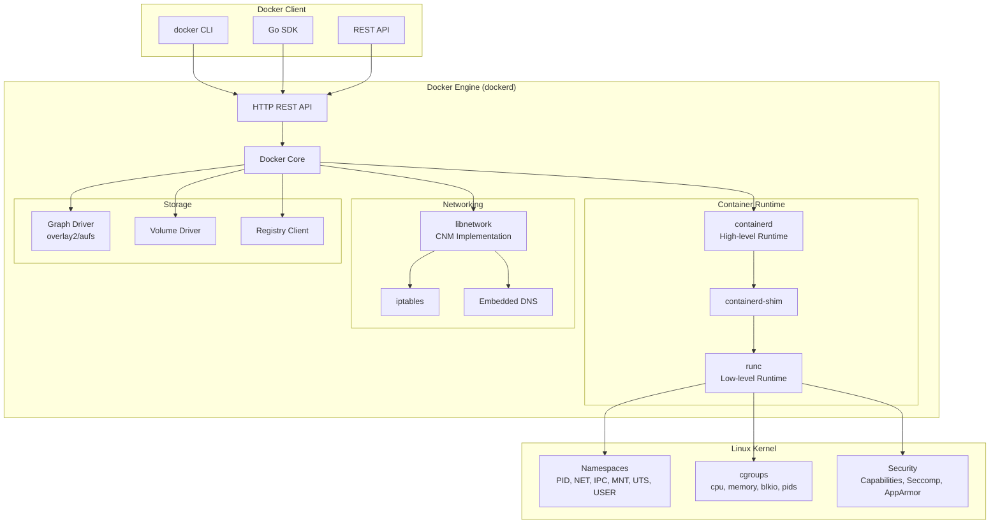

# TS-022: Docker Container Runtime

## 1. Overview

Docker is a platform for developing, shipping, and running applications in containers. It uses OS-level virtualization to deliver software in packages called containers, which are isolated from each other and bundle their own software, libraries, and configuration files.

### 1.1 Core Components

| Component | Description | Technology |
|-----------|-------------|------------|
| Docker Engine | Container runtime daemon | containerd + runc |
| Docker Image | Read-only template for containers | Union filesystem |
| Docker Container | Running instance of an image | Namespaces + Cgroups |
| Docker Network | Container networking | Bridge, Overlay, Macvlan |
| Docker Volume | Persistent data storage | Bind mounts, Volumes |

### 1.2 Architecture Overview



---

## 2. Architecture Deep Dive

### 2.1 Container Runtime Architecture

#### 2.1.1 OCI Runtime Specification

The Open Container Initiative (OCI) defines the standard for container runtimes:

```go
// OCI Runtime Specification
type Spec struct {
    Version string      `json:"ociVersion"`
    Process *Process    `json:"process,omitempty"`
    Root    *Root       `json:"root,omitempty"`
    Hostname string     `json:"hostname,omitempty"`
    Mounts  []Mount     `json:"mounts,omitempty"`
    Linux   *Linux      `json:"linux,omitempty"`
}

type Process struct {
    Terminal    bool          `json:"terminal,omitempty"`
    ConsoleSize *Box          `json:"consoleSize,omitempty"`
    User        User          `json:"user"`
    Args        []string      `json:"args"`
    Env         []string      `json:"env,omitempty"`
    Cwd         string        `json:"cwd"`
    Rlimits     []Rlimit      `json:"rlimits,omitempty"`
    Capabilities *Capabilities `json:"capabilities,omitempty"`
}

type Linux struct {
    Namespaces []Namespace      `json:"namespaces,omitempty"`
    UIDMappings []IDMapping     `json:"uidMappings,omitempty"`
    GIDMappings []IDMapping     `json:"gidMappings,omitempty"`
    Resources  *Resources       `json:"resources,omitempty"`
    CgroupsPath string          `json:"cgroupsPath,omitempty"`
    RootfsPropagation string    `json:"rootfsPropagation,omitempty"`
    Seccomp    *Seccomp         `json:"seccomp,omitempty"`
}

type Namespace struct {
    Type NamespaceType `json:"type"`
    Path string        `json:"path,omitempty"`
}

type NamespaceType string

const (
    PIDNamespace  NamespaceType = "pid"
    NetworkNamespace NamespaceType = "network"
    IPCNamespace  NamespaceType = "ipc"
    UTSNamespace  NamespaceType = "uts"
    MountNamespace NamespaceType = "mount"
    UserNamespace NamespaceType = "user"
    CgroupNamespace NamespaceType = "cgroup"
)
```

#### 2.1.2 runc Implementation

```go
// runc container creation flow
func CreateContainer(id string, spec *specs.Spec, opts *CreateOpts) (*Container, error) {
    // 1. Validate spec
    if err := validateSpec(spec); err != nil {
        return nil, err
    }
    
    // 2. Create container directory
    containerDir := filepath.Join(opts.Root, id)
    if err := os.MkdirAll(containerDir, 0700); err != nil {
        return nil, err
    }
    
    // 3. Write config.json
    configPath := filepath.Join(containerDir, "config.json")
    if err := writeJSON(configPath, spec); err != nil {
        return nil, err
    }
    
    // 4. Create rootfs
    rootfs := filepath.Join(containerDir, "rootfs")
    if err := setupRootfs(rootfs, spec); err != nil {
        return nil, err
    }
    
    // 5. Create init pipe for synchronization
    parentPipe, childPipe, err := utils.NewSockPair("init")
    if err != nil {
        return nil, err
    }
    defer parentPipe.Close()
    
    // 6. Start container process
    cmd, err := StartContainer(spec, childPipe, opts)
    if err != nil {
        return nil, err
    }
    
    // 7. Set up cgroups
    if spec.Linux != nil && spec.Linux.Resources != nil {
        cgroupMgr, err := createCgroupManager(id, spec.Linux.CgroupsPath, spec.Linux.Resources)
        if err != nil {
            return nil, err
        }
        if err := cgroupMgr.Apply(cmd.Process.Pid); err != nil {
            return nil, err
        }
    }
    
    // 8. Wait for initialization
    if err := waitForInit(parentPipe); err != nil {
        return nil, err
    }
    
    return &Container{
        ID:     id,
        State:  StateCreating,
        Pid:    cmd.Process.Pid,
        Bundle: containerDir,
    }, nil
}

func StartContainer(spec *specs.Spec, pipe *os.File, opts *CreateOpts) (*exec.Cmd, error) {
    cmd := exec.Command("/proc/self/exe", "init")
    cmd.SysProcAttr = &syscall.SysProcAttr{
        Cloneflags: syscall.CLONE_NEWUTS |
            syscall.CLONE_NEWPID |
            syscall.CLONE_NEWNS |
            syscall.CLONE_NEWNET |
            syscall.CLONE_NEWIPC,
    }
    
    // Set up stdio
    cmd.Stdin = opts.Stdin
    cmd.Stdout = opts.Stdout
    cmd.Stderr = opts.Stderr
    
    // Pass state to init process
    cmd.Env = append(cmd.Env, "_LIBCONTAINER_INITPIPE="+strconv.Itoa(int(pipe.Fd())))
    
    if err := cmd.Start(); err != nil {
        return nil, err
    }
    
    return cmd, nil
}
```

### 2.2 containerd Architecture

```go
// containerd client interface
type Client struct {
    conn    *grpc.ClientConn
    runtime runtime.RuntimeServiceClient
    image   images.ImagesClient
    content content.ContentClient
    task    tasks.TasksClient
    snapshot snapshots.Snapshotter
}

// Container creation through containerd
func (c *Client) CreateContainer(ctx context.Context, id string, spec *oci.Spec, opts ...NewContainerOpts) (Container, error) {
    // 1. Create snapshot for container rootfs
    snapshotter := c.SnapshotService("overlayfs")
    mounts, err := snapshotter.Prepare(ctx, id+"-snapshot", spec.Root.Readonly)
    if err != nil {
        return nil, err
    }
    defer func() {
        if err != nil {
            snapshotter.Remove(ctx, id+"-snapshot")
        }
    }()
    
    // 2. Mount rootfs
    root, err := os.MkdirTemp("", "containerd-")
    if err != nil {
        return nil, err
    }
    if err := mount.All(mounts, root); err != nil {
        return nil, err
    }
    
    // 3. Update spec with root path
    spec.Root.Path = root
    
    // 4. Create containerd container
    r := &runtime.CreateContainerRequest{
        PodSandboxId: id,
        Config: &runtime.ContainerConfig{
            Metadata: &runtime.ContainerMetadata{
                Name:    id,
                Attempt: 1,
            },
            Image:    &runtime.ImageSpec{Image: spec.Root.Path},
            Command:  spec.Process.Args,
            WorkingDir: spec.Process.Cwd,
            Envs:     convertEnvs(spec.Process.Env),
            Labels:   map[string]string{},
        },
        SandboxConfig: &runtime.PodSandboxConfig{},
    }
    
    resp, err := c.runtime.CreateContainer(ctx, r)
    if err != nil {
        return nil, err
    }
    
    return &container{
        id:  resp.ContainerId,
        c:   c,
    }, nil
}

// Task management
func (c *container) NewTask(ctx context.Context, ioCreate cio.Creator, opts ...NewTaskOpts) (Task, error) {
    // 1. Create IO
    i, err := ioCreate(c.id)
    if err != nil {
        return nil, err
    }
    
    // 2. Create task request
    request := &tasks.CreateTaskRequest{
        ContainerId: c.id,
        Terminal:    i.Terminal,
        Stdin:       i.Stdin,
        Stdout:      i.Stdout,
        Stderr:      i.Stderr,
    }
    
    // 3. Create task
    response, err := c.c.task.Create(ctx, request)
    if err != nil {
        return nil, err
    }
    
    return &task{
        id:     response.ContainerId,
        pid:    response.Pid,
        c:      c.c,
    }, nil
}
```

### 2.3 Storage Drivers

```go
// Overlay2 driver implementation
type Driver struct {
    home          string
    idMap         *idtools.IdentityMapping
    options       graphdriver.Options
    naiveDiff     graphdriver.DiffDriver
}

// Create creates a new layer
func (d *Driver) Create(id, parent string, opts *graphdriver.CreateOpts) error {
    dir := d.dir(id)
    
    // Create layer directories
    root := path.Join(dir, "root")
    diff := path.Join(dir, "diff")
    work := path.Join(dir, "work")
    lower := path.Join(dir, "lower")
    merged := path.Join(dir, "merged")
    
    if err := os.MkdirAll(root, 0700); err != nil {
        return err
    }
    if err := os.MkdirAll(diff, 0755); err != nil {
        return err
    }
    if err := os.MkdirAll(work, 0700); err != nil {
        return err
    }
    if err := os.MkdirAll(merged, 0755); err != nil {
        return err
    }
    
    // Set up lower directories
    var lowerDirs []string
    if parent != "" {
        parentDir := d.dir(parent)
        parentLower, err := os.ReadFile(path.Join(parentDir, "lower"))
        if err != nil {
            parentLower = []byte(path.Join(parentDir, "diff"))
        }
        lowerDirs = append([]string{path.Join(parentDir, "diff")}, 
            strings.Split(string(parentLower), ":")...)
    }
    
    // Write lower file
    if len(lowerDirs) > 0 {
        if err := os.WriteFile(lower, []byte(strings.Join(lowerDirs, ":")), 0666); err != nil {
            return err
        }
    }
    
    return nil
}

// Get returns the mount point for a layer
func (d *Driver) Get(id, mountLabel string) (containerfs.ContainerFS, error) {
    dir := d.dir(id)
    diff := path.Join(dir, "diff")
    lower := path.Join(dir, "lower")
    merged := path.Join(dir, "merged")
    work := path.Join(dir, "work")
    
    lowerDirs := []string{diff}
    
    // Read parent layers
    if lowerData, err := os.ReadFile(lower); err == nil {
        lowerDirs = append(lowerDirs, strings.Split(string(lowerData), ":")...)
    }
    
    // Create overlay mount
    opts := fmt.Sprintf("lowerdir=%s,upperdir=%s,workdir=%s",
        strings.Join(lowerDirs[1:], ":"),
        lowerDirs[0],
        work)
    
    if err := mount.Mount("overlay", merged, "overlay", opts); err != nil {
        return nil, err
    }
    
    return containerfs.NewLocalContainerFS(merged), nil
}
```

---

## 3. Configuration Examples

### 3.1 Docker Daemon Configuration

```json
{
  "storage-driver": "overlay2",
  "storage-opts": [
    "overlay2.override_kernel_check=true",
    "overlay2.size=20G"
  ],
  "data-root": "/var/lib/docker",
  "exec-opts": ["native.cgroupdriver=systemd"],
  "log-driver": "json-file",
  "log-opts": {
    "max-size": "100m",
    "max-file": "3"
  },
  "live-restore": true,
  "userland-proxy": false,
  "max-concurrent-downloads": 10,
  "max-concurrent-uploads": 5,
  "default-ulimits": {
    "nofile": {
      "Name": "nofile",
      "Hard": 64000,
      "Soft": 64000
    }
  },
  "default-address-pools": [
    {
      "base": "172.30.0.0/16",
      "size": 24
    },
    {
      "base": "172.31.0.0/16",
      "size": 24
    }
  ],
  "metrics-addr": "0.0.0.0:9323",
  "experimental": false,
  "features": {
    "buildkit": true
  },
  "builder": {
    "gc": {
      "enabled": true,
      "defaultKeepStorage": "20GB"
    }
  },
  "dns": ["8.8.8.8", "8.8.4.4"],
  "dns-opts": ["ndots:2"],
  "insecure-registries": ["localhost:5000", "10.0.0.0/8"],
  "registry-mirrors": ["https://mirror.example.com"],
  "mtu": 1450
}
```

### 3.2 Container Security Profile

```yaml
# docker-compose.security.yml
version: '3.8'
services:
  app:
    image: myapp:latest
    
    # Security options
    security_opt:
      - no-new-privileges:true
      - seccomp:./seccomp-profile.json
      - apparmor:docker-default
    
    # Capabilities
    cap_drop:
      - ALL
    cap_add:
      - NET_BIND_SERVICE
      - CHOWN
      - SETGID
      - SETUID
    
    # Resource limits
    deploy:
      resources:
        limits:
          cpus: '2.0'
          memory: 4G
        reservations:
          cpus: '0.5'
          memory: 512M
    
    # Read-only root filesystem
    read_only: true
    
    # Tmpfs for writable areas
    tmpfs:
      - /tmp:noexec,nosuid,size=100m
      - /var/cache:size=50m
    
    # User namespace
    user: "1000:1000"
    
    # Network isolation
    networks:
      - isolated
    
    # Logging
    logging:
      driver: json-file
      options:
        max-size: "10m"
        max-file: "3"
        labels: "service_name,environment"
        env: "OS_VERSION"

networks:
  isolated:
    internal: true
```

### 3.3 Multi-Stage Dockerfile

```dockerfile
# Build stage
FROM golang:1.21-alpine AS builder

# Security: Use non-root user
RUN adduser -D -g '' appuser

# Install build dependencies
RUN apk add --no-cache git ca-certificates

WORKDIR /build

# Download dependencies first (for layer caching)
COPY go.mod go.sum ./
RUN go mod download && go mod verify

# Copy source
COPY . .

# Build with security flags
RUN CGO_ENABLED=0 GOOS=linux GOARCH=amd64 go build \
    -ldflags='-w -s -extldflags "-static"' \
    -a -installsuffix cgo \
    -o app \
    ./cmd/app

# Final stage - minimal image
FROM scratch

# Import from builder
COPY --from=builder /etc/ssl/certs/ca-certificates.crt /etc/ssl/certs/
COPY --from=builder /etc/passwd /etc/passwd
COPY --from=builder /build/app /app

# Use non-root user
USER appuser

# Health check
HEALTHCHECK --interval=30s --timeout=3s --start-period=5s --retries=3 \
    CMD ["/app", "healthcheck"] || exit 1

# Expose port
EXPOSE 8080

# Run
ENTRYPOINT ["/app"]
```

---

## 4. Go Client Integration

### 4.1 Docker Client Initialization

```go
package docker

import (
    "context"
    "fmt"
    "io"
    "time"
    
    "github.com/docker/docker/api/types"
    "github.com/docker/docker/api/types/container"
    "github.com/docker/docker/api/types/mount"
    "github.com/docker/docker/api/types/network"
    "github.com/docker/docker/client"
    "github.com/docker/go-connections/nat"
)

// Client wraps Docker client
type Client struct {
    cli *client.Client
}

// NewClient creates a new Docker client
func NewClient() (*Client, error) {
    cli, err := client.NewClientWithOpts(
        client.FromEnv,
        client.WithAPIVersionNegotiation(),
    )
    if err != nil {
        return nil, fmt.Errorf("failed to create Docker client: %w", err)
    }
    
    return &Client{cli: cli}, nil
}

// Ping checks Docker daemon connectivity
func (c *Client) Ping(ctx context.Context) error {
    pong, err := c.cli.Ping(ctx)
    if err != nil {
        return err
    }
    
    fmt.Printf("Docker API Version: %s\n", pong.APIVersion)
    fmt.Printf("Docker Version: %s\n", pong.Version)
    
    return nil
}

// Close closes the client
func (c *Client) Close() error {
    return c.cli.Close()
}
```

### 4.2 Container Management

```go
package docker

import (
    "context"
    "fmt"
    "io"
    
    "github.com/docker/docker/api/types"
    "github.com/docker/docker/api/types/container"
    "github.com/docker/docker/api/types/mount"
    "github.com/docker/docker/api/types/network"
    "github.com/docker/docker/pkg/stdcopy"
)

// ContainerConfig holds container configuration
type ContainerConfig struct {
    Image       string
    Name        string
    Command     []string
    Entrypoint  []string
    Env         []string
    WorkingDir  string
    User        string
    
    // Network
    NetworkMode string
    Hostname    string
    DNS         []string
    
    // Resources
    CPUShares   int64
    CPULimit    float64
    MemoryLimit int64
    
    // Security
    Privileged  bool
    CapAdd      []string
    CapDrop     []string
    ReadOnly    bool
    
    // Volumes
    Mounts      []mount.Mount
    
    // Ports
    PortBindings map[nat.Port][]nat.PortBinding
}

// CreateAndStartContainer creates and starts a container
func (c *Client) CreateAndStartContainer(ctx context.Context, cfg *ContainerConfig) (string, error) {
    // 1. Pull image if needed
    reader, err := c.cli.ImagePull(ctx, cfg.Image, types.ImagePullOptions{})
    if err != nil {
        return "", fmt.Errorf("failed to pull image: %w", err)
    }
    defer reader.Close()
    
    // Copy pull output (optional)
    io.Copy(io.Discard, reader)
    
    // 2. Create container config
    containerConfig := &container.Config{
        Image:        cfg.Image,
        Cmd:          cfg.Command,
        Entrypoint:   cfg.Entrypoint,
        Env:          cfg.Env,
        WorkingDir:   cfg.WorkingDir,
        User:         cfg.User,
        Hostname:     cfg.Hostname,
        Labels: map[string]string{
            "managed-by": "go-client",
            "created":    time.Now().Format(time.RFC3339),
        },
    }
    
    // 3. Host config
    hostConfig := &container.HostConfig{
        NetworkMode:  container.NetworkMode(cfg.NetworkMode),
        DNS:          cfg.DNS,
        Privileged:   cfg.Privileged,
        CapAdd:       cfg.CapAdd,
        CapDrop:      cfg.CapDrop,
        ReadonlyRootfs: cfg.ReadOnly,
        Mounts:       cfg.Mounts,
        PortBindings: cfg.PortBindings,
        Resources: container.Resources{
            CPUShares:  cfg.CPUShares,
            NanoCPUs:   int64(cfg.CPULimit * 1e9),
            Memory:     cfg.MemoryLimit,
        },
        RestartPolicy: container.RestartPolicy{
            Name:              "unless-stopped",
            MaximumRetryCount: 3,
        },
        LogConfig: container.LogConfig{
            Type: "json-file",
            Config: map[string]string{
                "max-size": "10m",
                "max-file": "3",
            },
        },
    }
    
    // 4. Network config
    networkConfig := &network.NetworkingConfig{}
    
    // 5. Create container
    resp, err := c.cli.ContainerCreate(
        ctx,
        containerConfig,
        hostConfig,
        networkConfig,
        nil,
        cfg.Name,
    )
    if err != nil {
        return "", fmt.Errorf("failed to create container: %w", err)
    }
    
    // 6. Start container
    if err := c.cli.ContainerStart(ctx, resp.ID, types.ContainerStartOptions{}); err != nil {
        c.cli.ContainerRemove(ctx, resp.ID, types.ContainerRemoveOptions{Force: true})
        return "", fmt.Errorf("failed to start container: %w", err)
    }
    
    return resp.ID, nil
}

// StopContainer gracefully stops a container
func (c *Client) StopContainer(ctx context.Context, containerID string, timeout *time.Duration) error {
    if timeout == nil {
        t := 30 * time.Second
        timeout = &t
    }
    
    if err := c.cli.ContainerStop(ctx, containerID, container.StopOptions{
        Timeout: timeout,
    }); err != nil {
        return fmt.Errorf("failed to stop container: %w", err)
    }
    
    return nil
}

// RemoveContainer removes a container
func (c *Client) RemoveContainer(ctx context.Context, containerID string, force, removeVolumes bool) error {
    options := types.ContainerRemoveOptions{
        Force:         force,
        RemoveVolumes: removeVolumes,
    }
    
    if err := c.cli.ContainerRemove(ctx, containerID, options); err != nil {
        return fmt.Errorf("failed to remove container: %w", err)
    }
    
    return nil
}

// StreamLogs streams container logs
func (c *Client) StreamLogs(ctx context.Context, containerID string, follow bool, stdout, stderr io.Writer) error {
    options := types.ContainerLogsOptions{
        ShowStdout: true,
        ShowStderr: true,
        Follow:     follow,
        Timestamps: true,
        Tail:       "100",
    }
    
    reader, err := c.cli.ContainerLogs(ctx, containerID, options)
    if err != nil {
        return fmt.Errorf("failed to get logs: %w", err)
    }
    defer reader.Close()
    
    _, err = stdcopy.StdCopy(stdout, stderr, reader)
    return err
}

// ExecuteCommand executes a command in a running container
func (c *Client) ExecuteCommand(ctx context.Context, containerID string, cmd []string, stdin io.Reader, stdout, stderr io.Writer) error {
    execConfig := types.ExecConfig{
        AttachStdin:  stdin != nil,
        AttachStdout: true,
        AttachStderr: true,
        Cmd:          cmd,
        Tty:          false,
    }
    
    execResp, err := c.cli.ContainerExecCreate(ctx, containerID, execConfig)
    if err != nil {
        return fmt.Errorf("failed to create exec: %w", err)
    }
    
    attachResp, err := c.cli.ContainerExecAttach(ctx, execResp.ID, types.ExecStartCheck{
        Tty: false,
    })
    if err != nil {
        return fmt.Errorf("failed to attach to exec: %w", err)
    }
    defer attachResp.Close()
    
    // Copy output
    _, err = stdcopy.StdCopy(stdout, stderr, attachResp.Reader)
    return err
}
```

### 4.3 Image Management

```go
package docker

import (
    "bufio"
    "context"
    "encoding/json"
    "fmt"
    "io"
    
    "github.com/docker/docker/api/types"
    "github.com/docker/docker/api/types/filters"
    "github.com/docker/docker/pkg/archive"
)

// BuildImage builds an image from Dockerfile
func (c *Client) BuildImage(ctx context.Context, dockerfilePath, tag string, buildArgs map[string]string) error {
    // Create build context
    tar, err := archive.TarWithOptions(dockerfilePath, &archive.TarOptions{})
    if err != nil {
        return fmt.Errorf("failed to create build context: %w", err)
    }
    defer tar.Close()
    
    // Build options
    opts := types.ImageBuildOptions{
        Dockerfile: "Dockerfile",
        Tags:       []string{tag},
        Remove:     true,
        ForceRemove: true,
        PullParent: true,
        BuildArgs:  make(map[string]*string),
    }
    
    for k, v := range buildArgs {
        value := v
        opts.BuildArgs[k] = &value
    }
    
    // Build image
    resp, err := c.cli.ImageBuild(ctx, tar, opts)
    if err != nil {
        return fmt.Errorf("failed to build image: %w", err)
    }
    defer resp.Body.Close()
    
    // Read build output
    scanner := bufio.NewScanner(resp.Body)
    for scanner.Scan() {
        var msg map[string]interface{}
        if err := json.Unmarshal(scanner.Bytes(), &msg); err == nil {
            if stream, ok := msg["stream"].(string); ok {
                fmt.Print(stream)
            }
            if errMsg, ok := msg["error"].(string); ok {
                return fmt.Errorf("build error: %s", errMsg)
            }
        }
    }
    
    return scanner.Err()
}

// ListImages lists Docker images
func (c *Client) ListImages(ctx context.Context, filter string) ([]types.ImageSummary, error) {
    filterArgs := filters.NewArgs()
    if filter != "" {
        filterArgs.Add("reference", filter)
    }
    
    images, err := c.cli.ImageList(ctx, types.ImageListOptions{
        Filters: filterArgs,
    })
    if err != nil {
        return nil, fmt.Errorf("failed to list images: %w", err)
    }
    
    return images, nil
}

// RemoveImage removes an image
func (c *Client) RemoveImage(ctx context.Context, imageID string, force bool) error {
    _, err := c.cli.ImageRemove(ctx, imageID, types.ImageRemoveOptions{
        Force:         force,
        PruneChildren: true,
    })
    if err != nil {
        return fmt.Errorf("failed to remove image: %w", err)
    }
    
    return nil
}

// PushImage pushes an image to registry
func (c *Client) PushImage(ctx context.Context, image, registryAuth string) error {
    pushOpts := types.ImagePushOptions{
        RegistryAuth: registryAuth,
    }
    
    reader, err := c.cli.ImagePush(ctx, image, pushOpts)
    if err != nil {
        return fmt.Errorf("failed to push image: %w", err)
    }
    defer reader.Close()
    
    // Read push output
    io.Copy(io.Discard, reader)
    
    return nil
}
```

### 4.4 Volume Management

```go
package docker

import (
    "context"
    "fmt"
    
    "github.com/docker/docker/api/types/filters"
    "github.com/docker/docker/api/types/volume"
)

// CreateVolume creates a named volume
func (c *Client) CreateVolume(ctx context.Context, name, driver string, opts map[string]string, labels map[string]string) (*volume.Volume, error) {
    vol, err := c.cli.VolumeCreate(ctx, volume.CreateOptions{
        Name:       name,
        Driver:     driver,
        DriverOpts: opts,
        Labels:     labels,
    })
    if err != nil {
        return nil, fmt.Errorf("failed to create volume: %w", err)
    }
    
    return &vol, nil
}

// ListVolumes lists volumes
func (c *Client) ListVolumes(ctx context.Context, filterName string) (volume.ListResponse, error) {
    filterArgs := filters.NewArgs()
    if filterName != "" {
        filterArgs.Add("name", filterName)
    }
    
    resp, err := c.cli.VolumeList(ctx, filterArgs)
    if err != nil {
        return volume.ListResponse{}, fmt.Errorf("failed to list volumes: %w", err)
    }
    
    return resp, nil
}

// RemoveVolume removes a volume
func (c *Client) RemoveVolume(ctx context.Context, name string, force bool) error {
    if err := c.cli.VolumeRemove(ctx, name, force); err != nil {
        return fmt.Errorf("failed to remove volume: %w", err)
    }
    
    return nil
}

// PruneVolumes removes unused volumes
func (c *Client) PruneVolumes(ctx context.Context) (*volume.PruneReport, error) {
    report, err := c.cli.VolumesPrune(ctx, filters.NewArgs())
    if err != nil {
        return nil, fmt.Errorf("failed to prune volumes: %w", err)
    }
    
    return &report, nil
}
```

---

## 5. Performance Tuning

### 5.1 Resource Limits

```yaml
# docker-compose.prod.yml
version: '3.8'
services:
  web:
    image: webapp:latest
    deploy:
      replicas: 3
      resources:
        limits:
          cpus: '2.0'
          memory: 2G
          pids: 100
        reservations:
          cpus: '0.5'
          memory: 512M
      restart_policy:
        condition: on-failure
        delay: 5s
        max_attempts: 3
      update_config:
        parallelism: 1
        delay: 10s
        failure_action: rollback
        order: start-first
      rollback_config:
        parallelism: 1
        delay: 10s
        failure_action: pause
    
    # CPU and memory tuning
    cpu_count: 2
    cpu_percent: 80
    cpu_shares: 2048
    cpu_quota: 200000
    cpu_period: 100000
    
    mem_limit: 2G
    memswap_limit: 2G
    mem_swappiness: 0
    mem_reservation: 512M
    oom_kill_disable: false
    oom_score_adj: -500
    
    # Kernel parameters
    sysctls:
      - net.core.somaxconn=65535
      - net.ipv4.tcp_syncookies=0
      - net.ipv4.ip_local_port_range=1024 65535
```

### 5.2 Storage Optimization

```json
{
  "storage-driver": "overlay2",
  "storage-opts": [
    "overlay2.override_kernel_check=true",
    "overlay2.size=50G",
    "dm.basesize=50G",
    "dm.fs=xfs"
  ],
  "data-root": "/var/lib/docker",
  "exec-root": "/var/run/docker",
  "experimental": false,
  "features": {
    "buildkit": true
  },
  "builder": {
    "gc": {
      "enabled": true,
      "policy": [
        {
          "keepStorage": "20GB",
          "filter": ["unused-for=168h"]
        }
      ]
    }
  }
}
```

### 5.3 Network Tuning

```json
{
  "mtu": 1450,
  "default-address-pools": [
    {
      "base": "172.30.0.0/16",
      "size": 24
    }
  ],
  "userland-proxy": false,
  "ip6tables": true,
  "fixed-cidr-v6": "2001:db8::/64",
  "default-gateway-v6": "2001:db8::1"
}
```

---

## 6. Production Deployment Patterns

### 6.1 Multi-Stage Build Pipeline

```dockerfile
# Base image
FROM golang:1.21-alpine AS base
WORKDIR /app
RUN apk add --no-cache git ca-certificates

# Development stage
FROM base AS development
RUN go install github.com/cosmtrek/air@latest
COPY go.mod go.sum ./
RUN go mod download
COPY . .
CMD ["air"]

# Build stage
FROM base AS builder
COPY go.mod go.sum ./
RUN go mod download
COPY . .
RUN CGO_ENABLED=0 GOOS=linux go build -ldflags="-w -s" -o app ./cmd/app

# Test stage
FROM builder AS tester
RUN go test -v -race -coverprofile=coverage.out ./...

# Production stage
FROM gcr.io/distroless/static:nonroot AS production
COPY --from=builder /app/app /app
USER nonroot:nonroot
EXPOSE 8080
ENTRYPOINT ["/app"]
```

### 6.2 Health Checks and Monitoring

```dockerfile
FROM alpine:latest

# Install required tools
RUN apk add --no-cache curl jq

COPY --from=builder /app/myapp /usr/local/bin/myapp

# Health check
HEALTHCHECK --interval=30s --timeout=5s --start-period=10s --retries=3 \
    CMD curl -f http://localhost:8080/health || exit 1

# Liveness and readiness probes
COPY healthcheck.sh /usr/local/bin/healthcheck.sh
RUN chmod +x /usr/local/bin/healthcheck.sh

EXPOSE 8080 9090
ENTRYPOINT ["myapp"]
```

---

## 7. Comparison with Alternatives

| Feature | Docker | containerd | Podman | CRI-O |
|---------|--------|------------|--------|-------|
| Daemon Required | Yes | Yes | No | Yes |
| Rootless | Partial | Partial | Full | No |
| Docker API | Yes | Partial | Compatible | No |
| Kubernetes CRI | Via shim | Yes | No | Yes |
| Image Build | Yes | No | Yes | No |
| Compose Support | Native | No | Yes | No |
| Windows Support | Yes | Yes | Limited | No |
| Learning Curve | Low | Medium | Low | Medium |

---

## 8. Security Best Practices

### 8.1 Container Hardening Checklist

```go
// Security options builder
type SecurityOptions struct {
    NoNewPrivileges bool
    ReadOnlyRootFS  bool
    DropAllCaps     bool
    AddCaps         []string
    SeccompProfile  string
    AppArmorProfile string
    UserNSMode      string
}

func (s *SecurityOptions) ToHostConfig() *container.HostConfig {
    hc := &container.HostConfig{
        SecurityOpt: []string{},
    }
    
    if s.NoNewPrivileges {
        hc.SecurityOpt = append(hc.SecurityOpt, "no-new-privileges:true")
    }
    
    if s.ReadOnlyRootFS {
        hc.ReadonlyRootfs = true
    }
    
    if s.DropAllCaps {
        hc.CapDrop = []string{"ALL"}
    }
    
    if len(s.AddCaps) > 0 {
        hc.CapAdd = s.AddCaps
    }
    
    if s.SeccompProfile != "" {
        hc.SecurityOpt = append(hc.SecurityOpt, fmt.Sprintf("seccomp=%s", s.SeccompProfile))
    }
    
    if s.AppArmorProfile != "" {
        hc.SecurityOpt = append(hc.SecurityOpt, fmt.Sprintf("apparmor=%s", s.AppArmorProfile))
    }
    
    return hc
}
```

---

## 9. References

1. [Docker Documentation](https://docs.docker.com/)
2. [OCI Runtime Spec](https://github.com/opencontainers/runtime-spec)
3. [containerd Documentation](https://containerd.io/docs/)
4. [Docker Go SDK](https://pkg.go.dev/github.com/docker/docker/client)
5. [Docker Security Best Practices](https://docs.docker.com/develop/security-best-practices/)
