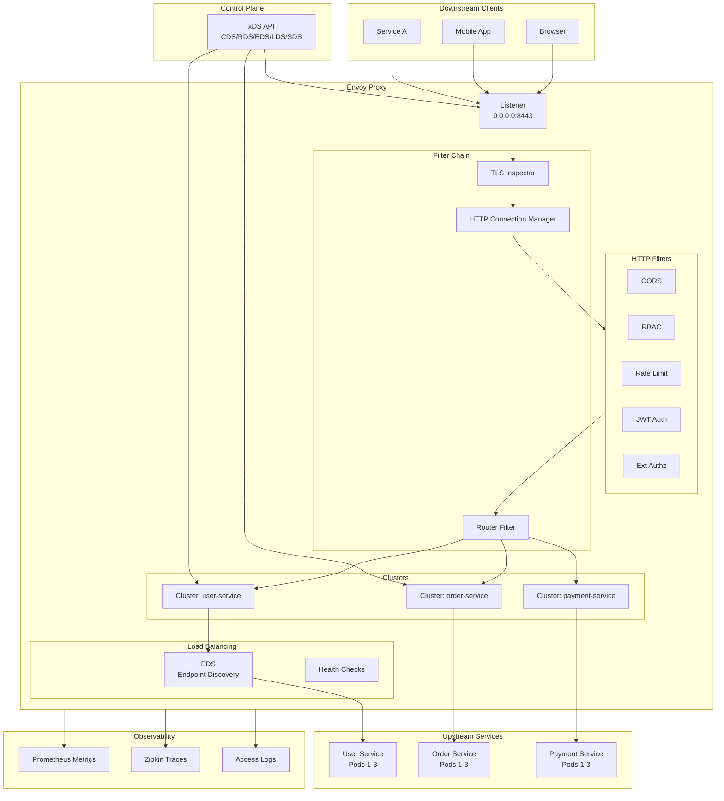
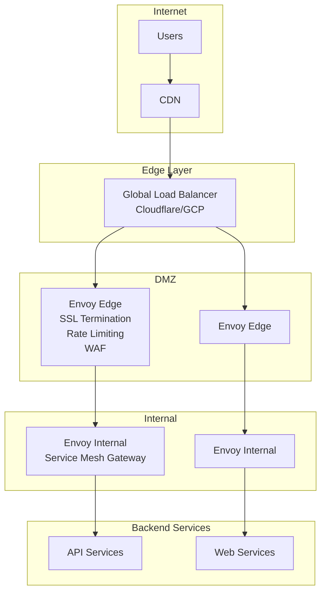

# TS-023: Envoy Proxy Configuration

## 1. Overview

Envoy is a high-performance C++ distributed proxy designed for single services and applications, as well as a large communication bus and "universal data plane" designed for large microservice mesh architectures. Originally built at Lyft, Envoy is now a graduated CNCF project.

### 1.1 Core Capabilities

| Capability | Description | Use Case |
|------------|-------------|----------|
| L3/L4 Proxy | TCP/UDP proxy with TLS termination | Edge gateway |
| HTTP L7 Proxy | Advanced HTTP routing and manipulation | API gateway |
| gRPC Support | Native gRPC proxy and transcoding | Microservices |
| Service Discovery | Dynamic endpoint discovery | Cloud-native |
| Load Balancing | Multiple LB algorithms | High availability |
| Observability | Metrics, tracing, and access logs | Monitoring |
| Extensibility | WASM and Lua extensions | Custom logic |

### 1.2 Architecture Overview



---

## 2. Architecture Deep Dive

### 2.1 Listener and Filter Chain

```go
// Listener configuration structure
type Listener struct {
    Name            string
    Address         *core.Address
    FilterChains    []*listener.FilterChain
    DefaultFilterChain *listener.FilterChain
    PerConnectionBufferLimitBytes *wrappers.UInt32Value
    
    // Drain settings
    DrainType       listener.Listener_DrainType
    
    // Deprecated v1 TLS config
    DeprecatedV1    *listener.Listener_DeprecatedV1
    
    // Listener filters (before protocol detection)
    ListenerFilters []*listener.ListenerFilter
    
    // Connection limit
    ConnectionLimit *listener.ConnectionLimit
    
    // Enable reuse port
    EnableReusePort *wrappers.BoolValue
    
    // Transport socket (TLS)
    TransportSocket *core.TransportSocket
}

// Filter chain matching
type FilterChainMatch struct {
    // Application protocol to match
    ApplicationProtocols []string
    
    // Destination port to match
    DestinationPort *wrappers.UInt32Value
    
    // Server name (SNI) to match
    ServerNames []string
    
    // Transport protocol to match
    TransportProtocol string
    
    // Source type (Any/Local/External)
    SourceType core.FilterChainMatch_ConnectionSourceType
    
    // Source IP prefix ranges
    SourcePrefixRanges []*core.CidrRange
    
    // Source ports
    SourcePorts []uint32
}
```

### 2.2 HTTP Connection Manager

```go
// HTTP Connection Manager configuration
type HttpConnectionManager struct {
    // Codec type: AUTO, HTTP1, HTTP2, HTTP3
    CodecType HttpConnectionManager_CodecType
    
    // Stat prefix for metrics
    StatPrefix string
    
    // Route specification
    RouteSpecifier *HttpConnectionManager_Rds
    
    // HTTP filters chain
    HttpFilters []*HttpFilter
    
    // Add user agent
    AddUserAgent *wrappers.BoolValue
    
    // Common HTTP protocol options
    CommonHttpProtocolOptions *core.HttpProtocolOptions
    
    // HTTP/1 specific options
    HttpProtocolOptions *core.Http1ProtocolOptions
    
    // HTTP/2 specific options
    Http2ProtocolOptions *core.Http2ProtocolOptions
    
    // Server name header
    ServerName string
    
    // Max request headers size
    MaxRequestHeadersKb *wrappers.UInt32Value
    
    // Idle timeout
    IdleTimeout *duration.Duration
    
    // Stream idle timeout
    StreamIdleTimeout *duration.Duration
    
    // Request timeout
    RequestTimeout *duration.Duration
    
    // Drain timeout
    DrainTimeout *duration.Duration
    
    // Generate request ID
    GenerateRequestId *wrappers.BoolValue
    
    // Tracing configuration
    Tracing *HttpConnectionManager_Tracing
    
    // Access logging
    AccessLog []*accesslog.AccessLog
}

// HTTP Filter definition
type HttpFilter struct {
    Name string
    ConfigType *HttpFilter_TypedConfig
}
```

### 2.3 Cluster Architecture

```go
// Cluster configuration
type Cluster struct {
    Name                 string
    AltStatName          string
    Type                 Cluster_DiscoveryType
    EdsClusterConfig     *Cluster_EdsClusterConfig
    ConnectTimeout       *duration.Duration
    PerConnectionBufferLimitBytes *wrappers.UInt32Value
    LbPolicy             Cluster_LbPolicy
    LoadAssignment       *endpoint.ClusterLoadAssignment
    HealthChecks         []*core.HealthCheck
    MaxRequestsPerConnection *wrappers.UInt32Value
    CircuitBreakers      *circuitbreakers.CircuitBreakers
    TransportSocket      *core.TransportSocket
    
    // Load balancing subset configuration
    LbSubsetConfig *Cluster_LbSubsetConfig
    
    // Ring hash or Maglev configuration
    RingHashLbConfig *Cluster_RingHashLbConfig
    MaglevLbConfig   *Cluster_MaglevLbConfig
    
    // Original destination load balancing
    OriginalDstLbConfig *Cluster_OriginalDstLbConfig
    
    // Least request configuration
    LeastRequestLbConfig *Cluster_LeastRequestLbConfig
    
    // Common configuration for all load balancers
    CommonLbConfig *Cluster_CommonLbConfig
    
    // Upstream connection options
    UpstreamConnectionOptions *Cluster_UpstreamConnectionOptions
    
    // Close connections on host health failure
    CloseConnectionsOnHostHealthFailure bool
    
    // Consistent hashing for HTTP headers
    CommonHttpProtocolOptions *core.HttpProtocolOptions
    HttpProtocolOptions       *core.Http1ProtocolOptions
    Http2ProtocolOptions      *core.Http2ProtocolOptions
}
```

### 2.4 xDS Control Plane Protocol

```go
// DiscoveryRequest for xDS
type DiscoveryRequest struct {
    // Node making the request
    Node *core.Node
    
    // List of resources to subscribe/unsubscribe
    ResourceNames []string
    
    // Type of resource (type.googleapis.com/envoy.config.cluster.v3.Cluster)
    TypeUrl string
    
    // Version info of last accepted response
    ResponseNonce string
    
    // Error details if last response failed
    ErrorDetail *status.Status
}

// DiscoveryResponse from control plane
type DiscoveryResponse struct {
    // Version info for cache validation
    VersionInfo string
    
    // List of resources
    Resources []*any.Any
    
    // Canary to test new config
    Canary bool
    
    // Type URL for resources
    TypeUrl string
    
    // Nonce for ACK/NACK
    Nonce string
    
    // Control plane identifier
    ControlPlane *core.ControlPlane
}

// Simple control plane implementation
type XDSControlPlane struct {
    snapshots  map[string]cache.Snapshot
    callbacks  xdscache.Callbacks
    server     server.Server
}

func (cp *XDSControlPlane) StreamClusters(stream cds.ClusterDiscoveryService_StreamClustersServer) error {
    for {
        req, err := stream.Recv()
        if err != nil {
            return err
        }
        
        // Get snapshot for node
        snapshot := cp.snapshots[req.Node.Id]
        
        // Send resources
        resp := &discovery.DiscoveryResponse{
            VersionInfo: snapshot.Version,
            Resources:   snapshot.Resources[resource.ClusterType],
            TypeUrl:     resource.ClusterType,
        }
        
        if err := stream.Send(resp); err != nil {
            return err
        }
    }
}
```

---

## 3. Configuration Examples

### 3.1 Static Configuration (Bootstrap)

```yaml
# envoy.yaml - Bootstrap configuration
static_resources:
  listeners:
    - name: listener_0
      address:
        socket_address:
          address: 0.0.0.0
          port_value: 8443
      filter_chains:
        - filters:
            - name: envoy.filters.network.http_connection_manager
              typed_config:
                "@type": type.googleapis.com/envoy.extensions.filters.network.http_connection_manager.v3.HttpConnectionManager
                stat_prefix: ingress_http
                codec_type: AUTO
                
                # Route configuration
                rds:
                  route_config_name: local_route
                  config_source:
                    path: /etc/envoy/routes.yaml
                
                # HTTP filters
                http_filters:
                  - name: envoy.filters.http.cors
                    typed_config:
                      "@type": type.googleapis.com/envoy.extensions.filters.http.cors.v3.Cors
                  
                  - name: envoy.filters.http.ext_authz
                    typed_config:
                      "@type": type.googleapis.com/envoy.extensions.filters.http.ext_authz.v3.ExtAuthz
                      grpc_service:
                        envoy_grpc:
                          cluster_name: ext_authz
                        timeout: 0.5s
                      include_peer_certificate: true
                  
                  - name: envoy.filters.http.local_ratelimit
                    typed_config:
                      "@type": type.googleapis.com/envoy.extensions.filters.http.local_ratelimit.v3.LocalRateLimit
                      stat_prefix: http_local_rate_limiter
                      token_bucket:
                        max_tokens: 1000
                        tokens_per_fill: 100
                        fill_interval: 1s
                      filter_enabled:
                        runtime_key: local_rate_limit_enabled
                        default_value:
                          numerator: 100
                          denominator: HUNDRED
                  
                  - name: envoy.filters.http.router
                    typed_config:
                      "@type": type.googleapis.com/envoy.extensions.filters.http.router.v3.Router
                
                # Access logging
                access_log:
                  - name: envoy.access_loggers.stdout
                    typed_config:
                      "@type": type.googleapis.com/envoy.extensions.access_loggers.stream.v3.StdoutAccessLog
                      log_format:
                        json_format:
                          start_time: "%START_TIME%"
                          method: "%REQ(:METHOD)%"
                          path: "%REQ(X-ENVOY-ORIGINAL-PATH?:PATH)%"
                          protocol: "%PROTOCOL%"
                          response_code: "%RESPONSE_CODE%"
                          response_flags: "%RESPONSE_FLAGS%"
                          bytes_received: "%BYTES_RECEIVED%"
                          bytes_sent: "%BYTES_SENT%"
                          duration: "%DURATION%"
                          upstream_service_time: "%RESP(X-ENVOY-UPSTREAM-SERVICE-TIME)%"
                          forwarded_for: "%REQ(X-FORWARDED-FOR)%"
                          user_agent: "%REQ(USER-AGENT)%"
                          request_id: "%REQ(X-REQUEST-ID)%"
                          authority: "%REQ(:AUTHORITY)%"
                          upstream_host: "%UPSTREAM_HOST%"
                
                # Timeouts
                request_timeout: 30s
                stream_idle_timeout: 300s
                drain_timeout: 30s
                
                # Tracing
                tracing:
                  provider:
                    name: envoy.tracers.zipkin
                    typed_config:
                      "@type": type.googleapis.com/envoy.config.trace.v3.ZipkinConfig
                      collector_cluster: zipkin
                      collector_endpoint: /api/v2/spans
                      collector_endpoint_version: HTTP_JSON
                      shared_span_context: false
          
          # TLS termination
          transport_socket:
            name: envoy.transport_sockets.tls
            typed_config:
              "@type": type.googleapis.com/envoy.extensions.transport_sockets.tls.v3.DownstreamTlsContext
              common_tls_context:
                tls_certificate_sds_secret_configs:
                  - name: server_cert
                    sds_config:
                      path: /etc/envoy/tls_certificate_sds_secret.yaml
                validation_context_sds_secret_config:
                  name: validation_context
                  sds_config:
                    path: /etc/envoy/validation_context_sds_secret.yaml
  
  clusters:
    - name: user_service
      connect_timeout: 5s
      type: STRICT_DNS
      lb_policy: ROUND_ROBIN
      load_assignment:
        cluster_name: user_service
        endpoints:
          - lb_endpoints:
              - endpoint:
                  address:
                    socket_address:
                      address: user-service
                      port_value: 8080
                  health_check_config:
                    port_value: 8080
      health_checks:
        - timeout: 5s
          interval: 10s
          unhealthy_threshold: 3
          healthy_threshold: 2
          http_health_check:
            path: /health
      circuit_breakers:
        thresholds:
          - priority: DEFAULT
            max_connections: 1000
            max_pending_requests: 1000
            max_requests: 1000
            max_retries: 3
      outlier_detection:
        consecutive_5xx: 5
        interval: 10s
        base_ejection_time: 30s
      common_http_protocol_options:
        idle_timeout: 300s
      upstream_connection_options:
        tcp_keepalive:
          keepalive_time: 300
          keepalive_interval: 75
          keepalive_probes: 9
    
    - name: order_service
      connect_timeout: 5s
      type: EDS
      eds_cluster_config:
        eds_config:
          api_config_source:
            api_type: GRPC
            transport_api_version: V3
            grpc_services:
              - envoy_grpc:
                  cluster_name: xds_cluster
        service_name: order-service
      lb_policy: LEAST_REQUEST
      least_request_lb_config:
        choice_count: 2
        active_request_bias:
          runtime_key: least_request_active_request_bias
          default_value: 1.0
    
    - name: ext_authz
      connect_timeout: 1s
      type: STRICT_DNS
      lb_policy: ROUND_ROBIN
      http2_protocol_options: {}
      load_assignment:
        cluster_name: ext_authz
        endpoints:
          - lb_endpoints:
              - endpoint:
                  address:
                    socket_address:
                      address: authz-service
                      port_value: 9001
    
    - name: zipkin
      connect_timeout: 1s
      type: STRICT_DNS
      lb_policy: ROUND_ROBIN
      load_assignment:
        cluster_name: zipkin
        endpoints:
          - lb_endpoints:
              - endpoint:
                  address:
                    socket_address:
                      address: zipkin
                      port_value: 9411

dynamic_resources:
  cds_config:
    resource_api_version: V3
    api_config_source:
      api_type: GRPC
      transport_api_version: V3
      grpc_services:
        - envoy_grpc:
            cluster_name: xds_cluster
  lds_config:
    resource_api_version: V3
    api_config_source:
      api_type: GRPC
      transport_api_version: V3
      grpc_services:
        - envoy_grpc:
            cluster_name: xds_cluster

admin:
  address:
    socket_address:
      address: 0.0.0.0
      port_value: 9901
  access_log:
    - name: envoy.access_loggers.stdout
      typed_config:
        "@type": type.googleapis.com/envoy.extensions.access_loggers.stream.v3.StdoutAccessLog
  profile_path: /tmp/envoy.prof
  address:
    socket_address:
      address: 0.0.0.0
      port_value: 9901

node:
  id: envoy_node_1
  cluster: gateway_cluster
  locality:
    region: us-east-1
    zone: us-east-1a
    sub_zone: rack-1
  metadata:
    instance_id: i-1234567890abcdef0
    role: edge-gateway

layered_runtime:
  layers:
    - name: static_layer
      static_layer:
        envoy.resource_limits.listener.listener_0.connection_limit: 10000
        overload.global_downstream_max_connections: 50000
    - name: admin_layer
      admin_layer: {}
```

### 3.2 Route Configuration

```yaml
# routes.yaml
virtual_hosts:
  - name: api
    domains:
      - "api.example.com"
      - "api.example.com:8443"
    routes:
      # User service routes
      - match:
          prefix: /api/v1/users
          headers:
            - name: x-api-version
              exact_match: v1
        route:
          cluster: user_service
          prefix_rewrite: /v1/users
          timeout: 30s
          retry_policy:
            retry_on: gateway-error,connect-failure,refused-stream
            num_retries: 3
            per_try_timeout: 10s
            retry_back_off:
              base_interval: 0.25s
              max_interval: 1s
          rate_limits:
            - stage: 0
              actions:
                - remote_address: {}
                - generic_key:
                    descriptor_value: api_limit
      
      # Order service routes with weighted traffic split
      - match:
          prefix: /api/v1/orders
        route:
          weighted_clusters:
            runtime_key_prefix: routing.orders
            clusters:
              - name: order_service_v1
                weight: 80
                metadata_match:
                  filter_metadata:
                    envoy.lb:
                      version: v1
              - name: order_service_v2
                weight: 20
                metadata_match:
                  filter_metadata:
                    envoy.lb:
                      version: v2
          hash_policy:
            - header:
                header_name: x-user-id
            - cookie:
                name: session_id
                ttl: 3600s
      
      # Payment service with header-based routing
      - match:
          prefix: /api/v1/payments
          headers:
            - name: x-region
              safe_regex_match:
                google_re2: {}
                regex: "us-.*"
        route:
          cluster: payment_service_us
          request_mirror_policies:
            - cluster: payment_service_shadow
              runtime_fraction:
                default_value:
                  numerator: 10
                  denominator: HUNDRED
                runtime_key: payment.shadow_enabled
      
      # Direct response for health checks
      - match:
          path: /health
        direct_response:
          status: 200
          body:
            inline_string: '{"status":"healthy"}'
        response_headers_to_add:
          - header:
              key: content-type
              value: application/json
      
      # Redirect HTTP to HTTPS
      - match:
          prefix: /
          headers:
            - name: x-forwarded-proto
              exact_match: http
        redirect:
          https_redirect: true
          port_redirect: 443
      
      # Default route
      - match:
          prefix: /
        route:
          cluster: default_service
          cors:
            allow_origin_string_match:
              - prefix: "*"
            allow_methods: GET, POST, PUT, DELETE, OPTIONS
            allow_headers: authorization,content-type,x-request-id
            max_age: "86400"
  
  - name: internal
    domains:
      - "internal.local"
    require_tls: EXTERNAL_ONLY
    routes:
      - match:
          prefix: /admin/
        route:
          cluster: admin_service
          request_headers_to_add:
            - header:
                key: x-internal
                value: "true"
              append_action: OVERWRITE_IF_EXISTS_OR_ADD
```

---

## 4. Go Client Integration

### 4.1 Envoy Control Plane (Go-Control-Plane)

```go
package envoy

import (
    "context"
    "fmt"
    "net"
    "sync"
    "time"
    
    cluster "github.com/envoyproxy/go-control-plane/envoy/config/cluster/v3"
    endpoint "github.com/envoyproxy/go-control-plane/envoy/config/endpoint/v3"
    listener "github.com/envoyproxy/go-control-plane/envoy/config/listener/v3"
    route "github.com/envoyproxy/go-control-plane/envoy/config/route/v3"
    "github.com/envoyproxy/go-control-plane/pkg/cache/types"
    "github.com/envoyproxy/go-control-plane/pkg/cache/v3"
    "github.com/envoyproxy/go-control-plane/pkg/resource/v3"
    "github.com/envoyproxy/go-control-plane/pkg/server/v3"
    "github.com/envoyproxy/go-control-plane/pkg/wellknown"
    "google.golang.org/grpc"
    "google.golang.org/protobuf/types/known/anypb"
    "google.golang.org/protobuf/types/known/durationpb"
)

// ControlPlane implements Envoy xDS server
type ControlPlane struct {
    snapshots cache.SnapshotCache
    server    server.Server
    
    mu        sync.RWMutex
    services  map[string]*Service
    nodes     map[string]*Node
}

type Service struct {
    Name      string
    Endpoints []Endpoint
    Port      uint32
    Weight    uint32
}

type Endpoint struct {
    Address string
    Port    uint32
    Weight  uint32
    Healthy bool
}

type Node struct {
    ID       string
    Cluster  string
    Services []string
}

// NewControlPlane creates new xDS control plane
func NewControlPlane(ctx context.Context) *ControlPlane {
    snapshots := cache.NewSnapshotCache(false, cache.IDHash{}, nil)
    
    cp := &ControlPlane{
        snapshots: snapshots,
        server:    server.NewServer(ctx, snapshots, nil),
        services:  make(map[string]*Service),
        nodes:     make(map[string]*Node),
    }
    
    return cp
}

// Start starts the gRPC server
func (cp *ControlPlane) Start(port int) error {
    grpcServer := grpc.NewServer()
    
    // Register xDS services
    server.RegisterServer(grpcServer, cp.server)
    
    lis, err := net.Listen("tcp", fmt.Sprintf(":%d", port))
    if err != nil {
        return err
    }
    
    return grpcServer.Serve(lis)
}

// AddService registers a new service
func (cp *ControlPlane) AddService(svc *Service) error {
    cp.mu.Lock()
    defer cp.mu.Unlock()
    
    cp.services[svc.Name] = svc
    
    // Update snapshots for all nodes
    for nodeID := range cp.nodes {
        if err := cp.updateSnapshot(nodeID); err != nil {
            return err
        }
    }
    
    return nil
}

// updateSnapshot generates and updates snapshot for a node
func (cp *ControlPlane) updateSnapshot(nodeID string) error {
    node := cp.nodes[nodeID]
    
    // Build clusters
    clusters := make([]types.Resource, 0)
    endpoints := make([]types.Resource, 0)
    routes := make([]types.Resource, 0)
    listeners := make([]types.Resource, 0)
    
    for _, svcName := range node.Services {
        svc := cp.services[svcName]
        if svc == nil {
            continue
        }
        
        // Create cluster
        c := cp.makeCluster(svc)
        clusters = append(clusters, c)
        
        // Create endpoints
        e := cp.makeEndpoints(svc)
        endpoints = append(endpoints, e)
        
        // Create route
        r := cp.makeRoute(svc)
        routes = append(routes, r)
    }
    
    // Create listener
    listener := cp.makeListener(node)
    listeners = append(listeners, listener)
    
    // Create snapshot
    snapshot, err := cache.NewSnapshot(
        time.Now().Format(time.RFC3339Nano),
        endpoints,
        clusters,
        routes,
        listeners,
        nil, // runtimes
        nil, // secrets
    )
    if err != nil {
        return err
    }
    
    return cp.snapshots.SetSnapshot(context.Background(), nodeID, snapshot)
}

func (cp *ControlPlane) makeCluster(svc *Service) *cluster.Cluster {
    return &cluster.Cluster{
        Name:                 svc.Name,
        ConnectTimeout:       durationpb.New(5 * time.Second),
        ClusterDiscoveryType: &cluster.Cluster_Type{Type: cluster.Cluster_EDS},
        EdsClusterConfig: &cluster.Cluster_EdsClusterConfig{
            ServiceName: svc.Name,
            EdsConfig: &core.ConfigSource{
                ConfigSourceSpecifier: &core.ConfigSource_Ads{
                    Ads: &core.AggregatedConfigSource{},
                },
            },
        },
        LbPolicy: cluster.Cluster_ROUND_ROBIN,
        HealthChecks: []*core.HealthCheck{
            {
                Timeout:            durationpb.New(5 * time.Second),
                Interval:           durationpb.New(10 * time.Second),
                UnhealthyThreshold: &wrappers.UInt32Value{Value: 3},
                HealthyThreshold:   &wrappers.UInt32Value{Value: 2},
                HealthChecker: &core.HealthCheck_HttpHealthCheck{
                    HttpHealthCheck: &core.HealthCheck_HttpHealthCheck{
                        Path: "/health",
                    },
                },
            },
        },
    }
}

func (cp *ControlPlane) makeEndpoints(svc *Service) *endpoint.ClusterLoadAssignment {
    lbEndpoints := make([]*endpoint.LbEndpoint, 0, len(svc.Endpoints))
    
    for _, ep := range svc.Endpoints {
        lbEndpoints = append(lbEndpoints, &endpoint.LbEndpoint{
            HostIdentifier: &endpoint.LbEndpoint_Endpoint{
                Endpoint: &endpoint.Endpoint{
                    Address: &core.Address{
                        Address: &core.Address_SocketAddress{
                            SocketAddress: &core.SocketAddress{
                                Address: ep.Address,
                                PortSpecifier: &core.SocketAddress_PortValue{
                                    PortValue: ep.Port,
                                },
                            },
                        },
                    },
                    HealthCheckConfig: &endpoint.Endpoint_HealthCheckConfig{
                        PortValue: ep.Port,
                    },
                },
            },
            HealthStatus: core.HealthStatus_HEALTHY,
            LoadBalancingWeight: &wrappers.UInt32Value{Value: ep.Weight},
        })
    }
    
    return &endpoint.ClusterLoadAssignment{
        ClusterName: svc.Name,
        Endpoints: []*endpoint.LocalityLbEndpoints{
            {
                LbEndpoints: lbEndpoints,
            },
        },
    }
}

func (cp *ControlPlane) makeRoute(svc *Service) *route.RouteConfiguration {
    return &route.RouteConfiguration{
        Name: "local_route",
        VirtualHosts: []*route.VirtualHost{
            {
                Name:    svc.Name,
                Domains: []string{"*"},
                Routes: []*route.Route{
                    {
                        Match: &route.RouteMatch{
                            PathSpecifier: &route.RouteMatch_Prefix{
                                Prefix: "/" + svc.Name,
                            },
                        },
                        Action: &route.Route_Route{
                            Route: &route.RouteAction{
                                ClusterSpecifier: &route.RouteAction_Cluster{
                                    Cluster: svc.Name,
                                },
                            },
                        },
                    },
                },
            },
        },
    }
}

func (cp *ControlPlane) makeListener(node *Node) *listener.Listener {
    // HTTP connection manager filter
    hcm := &hcm.HttpConnectionManager{
        CodecType:  hcm.HttpConnectionManager_AUTO,
        StatPrefix: "ingress_http",
        RouteSpecifier: &hcm.HttpConnectionManager_Rds{
            Rds: &hcm.Rds{
                ConfigSource: &core.ConfigSource{
                    ConfigSourceSpecifier: &core.ConfigSource_Ads{
                        Ads: &core.AggregatedConfigSource{},
                    },
                },
                RouteConfigName: "local_route",
            },
        },
        HttpFilters: []*hcm.HttpFilter{
            {
                Name: wellknown.Router,
                ConfigType: &hcm.HttpFilter_TypedConfig{
                    TypedConfig: mustAny(&router.Router{}),
                },
            },
        },
    }
    
    hcmAny, _ := anypb.New(hcm)
    
    return &listener.Listener{
        Name: "listener_0",
        Address: &core.Address{
            Address: &core.Address_SocketAddress{
                SocketAddress: &core.SocketAddress{
                    Address: "0.0.0.0",
                    PortSpecifier: &core.SocketAddress_PortValue{
                        PortValue: 8080,
                    },
                },
            },
        },
        FilterChains: []*listener.FilterChain{
            {
                Filters: []*listener.Filter{
                    {
                        Name: wellknown.HTTPConnectionManager,
                        ConfigType: &listener.Filter_TypedConfig{
                            TypedConfig: hcmAny,
                        },
                    },
                },
            },
        },
    }
}

func mustAny(msg proto.Message) *anypb.Any {
    a, _ := anypb.New(msg)
    return a
}
```

---

## 5. Performance Tuning

### 5.1 Connection and Buffer Tuning

```yaml
# Performance optimized Envoy configuration
static_resources:
  listeners:
    - name: listener_0
      per_connection_buffer_limit_bytes: 32768  # 32KB
      filter_chains:
        - filters:
            - name: envoy.filters.network.http_connection_manager
              typed_config:
                "@type": type.googleapis.com/envoy.extensions.filters.network.http_connection_manager.v3.HttpConnectionManager
                
                # Connection limits
                common_http_protocol_options:
                  idle_timeout: 3600s
                  max_headers_count: 100
                  max_stream_duration: 0s
                
                http2_protocol_options:
                  max_concurrent_streams: 100
                  initial_stream_window_size: 65536
                  initial_connection_window_size: 1048576
                  allow_connect: true
                
                # Request buffer
                per_request_buffer_limit_bytes: 65536
                
                # Timeouts
                request_timeout: 300s
                stream_idle_timeout: 300s
  
  clusters:
    - name: service_cluster
      connect_timeout: 5s
      per_connection_buffer_limit_bytes: 32768
      
      # Connection pool settings
      common_http_protocol_options:
        idle_timeout: 3600s
      
      upstream_connection_options:
        tcp_keepalive:
          keepalive_time: 300
          keepalive_interval: 75
          keepalive_probes: 9
      
      # Circuit breaker settings
      circuit_breakers:
        thresholds:
          - priority: DEFAULT
            max_connections: 1024
            max_pending_requests: 1024
            max_requests: 1024
            max_retries: 3
            retry_budget:
              budget_percent:
                value: 25.0
              min_retry_concurrency: 10
      
      # Outlier detection
      outlier_detection:
        consecutive_5xx: 5
        interval: 10s
        base_ejection_time: 30s
        max_ejection_percent: 50
        success_rate_minimum_hosts: 5
        success_rate_request_volume: 100
```

### 5.2 Load Balancing Optimization

```yaml
clusters:
  # Least Request with active request bias
  - name: api_cluster
    lb_policy: LEAST_REQUEST
    least_request_lb_config:
      choice_count: 2
      active_request_bias:
        runtime_key: least_request_active_request_bias
        default_value: 1.0
  
  # Ring Hash for session affinity
  - name: websocket_cluster
    lb_policy: RING_HASH
    ring_hash_lb_config:
      minimum_ring_size: 1024
      maximum_ring_size: 8388608
      use_std_hash: false
    
  # Maglev for consistent hashing with better distribution
  - name: cache_cluster
    lb_policy: MAGLEV
    maglev_lb_config:
      table_size: 65537
```

---

## 6. Production Deployment Patterns

### 6.1 Edge Proxy Architecture



---

## 7. Comparison with Alternatives

| Feature | Envoy | NGINX | HAProxy | Traefik |
|---------|-------|-------|---------|---------|
| Dynamic Config | Full xDS | Reload | Partial | Full |
| gRPC Support | Native | Limited | Limited | Good |
| Observability | Excellent | Good | Good | Good |
| Service Mesh | Istio default | No | No | Limited |
| WebAssembly | Yes | No | No | No |
| Hot Reload | Yes | Signal | Yes | Yes |
| Memory Usage | Higher | Lower | Lower | Medium |
| Learning Curve | High | Medium | Medium | Low |

---

## 8. References

1. [Envoy Documentation](https://www.envoyproxy.io/docs)
2. [Envoy Architecture](https://www.envoyproxy.io/docs/envoy/latest/intro/arch_overview/arch_overview)
3. [xDS Protocol](https://www.envoyproxy.io/docs/envoy/latest/api-docs/xds_protocol)
4. [Go Control Plane](https://github.com/envoyproxy/go-control-plane)
5. [Envoy Config Examples](https://www.envoyproxy.io/docs/envoy/latest/configuration/overview/examples)
