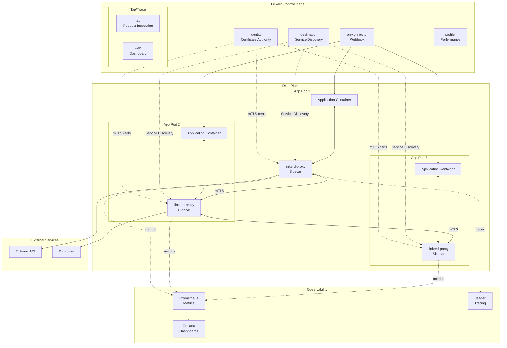

# TS-024: Linkerd Service Mesh

## 1. Overview

Linkerd is an ultralight, security-first service mesh for Kubernetes. It provides runtime debugging, observability, reliability, and security without requiring any code changes. Linkerd is a CNCF graduated project and is the lightest and fastest service mesh available.

### 1.1 Core Capabilities

| Capability | Description | Implementation |
|------------|-------------|----------------|
| mTLS | Automatic mutual TLS | Linkerd-proxy (Rust) |
| Load Balancing | EWMA-based | Proxy auto-configuration |
| Retries & Timeouts | Configurable per route | CRD-based |
| Traffic Split | Canary/Blue-Green | TrafficSplit CRD |
| Observability | Golden metrics | Prometheus + Grafana |
| Security | Network policies + mTLS | CA + Identity |

### 1.2 Architecture Overview



---

## 2. Architecture Deep Dive

### 2.1 Linkerd-Proxy (Data Plane)

The Linkerd proxy is a Rust-based ultralight transparent proxy:

```rust
// Simplified proxy architecture
pub struct Proxy {
    // Incoming/outgoing connections
    inbound: Inbound,
    outbound: Outbound,

    // Identity for mTLS
    identity: identity::Client,

    // Service discovery
    dst: dst::Resolver,

    // Metrics
    metrics: metrics::Registry,
}

// Connection handling
impl Proxy {
    async fn run(self) -> Result<(), Error> {
        // 1. Initialize identity (get certificate)
        let id = self.identity.await?;

        // 2. Start inbound proxy (accepting connections)
        let inbound = self.inbound.run(id.clone());

        // 3. Start outbound proxy (making connections)
        let outbound = self.outbound.run(id);

        // 4. Wait for either to complete
        tokio::select! {
            res = inbound => res,
            res = outbound => res,
        }
    }
}

// Protocol detection
pub async fn detect_protocol<I>(io: I) -> Result<Protocol, Error>
where
    I: AsyncRead + AsyncWrite + Unpin,
{
    let mut buf = [0u8; 1024];
    let n = io.peek(&mut buf).await?;

    // Check for HTTP/2 preface
    if &buf[..n] == b"PRI * HTTP/2.0\r\n\r\nSM\r\n\r\n" {
        return Ok(Protocol::Http2);
    }

    // Check for HTTP/1.x
    if buf[..n].starts_with(b"GET ") ||
       buf[..n].starts_with(b"POST ") ||
       buf[..n].starts_with(b"PUT ") ||
       buf[..n].starts_with(b"DELETE ") {
        return Ok(Protocol::Http1);
    }

    // Fallback to opaque TCP
    Ok(Protocol::Opaque)
}
```

### 2.2 Identity and mTLS

```go
// Identity service manages certificates
type IdentityService struct {
    ca         *CA
    validator  *Validator
    certTTL    time.Duration
}

// Certificate issuance flow
func (s *IdentityService) IssueCertificate(ctx context.Context, req *pb.CertifyRequest) (*pb.CertifyResponse, error) {
    // 1. Validate CSR
    csr, err := x509.ParseCertificateRequest(req.Csr)
    if err != nil {
        return nil, status.Errorf(codes.InvalidArgument, "invalid CSR: %v", err)
    }

    // 2. Extract identity from CSR
    identity := csr.Subject.CommonName

    // 3. Validate identity matches pod (via token review)
    if err := s.validateIdentity(ctx, identity, req.Token); err != nil {
        return nil, status.Errorf(codes.PermissionDenied, "identity validation failed: %v", err)
    }

    // 4. Sign certificate
    cert, expiry, err := s.ca.SignCSR(csr, s.certTTL)
    if err != nil {
        return nil, status.Errorf(codes.Internal, "failed to sign CSR: %v", err)
    }

    // 5. Get trust anchors
    trustAnchors := s.ca.TrustAnchors()

    return &pb.CertifyResponse{
        LeafCertificate:  cert,
        IntermediateCertificates: nil, // Direct trust
        TrustAnchors:     trustAnchors,
        ValidUntil:       timestamppb.New(expiry),
    }, nil
}

// TLS handshake in proxy
func (p *Proxy) handleTLSConnection(conn net.Conn) error {
    // Load identity certificate
    cert, err := tls.LoadX509KeyPair(p.identityCert, p.identityKey)
    if err != nil {
        return err
    }

    // Configure TLS
    config := &tls.Config{
        Certificates: []tls.Certificate{cert},
        ClientAuth:   tls.VerifyClientCertIfGiven,
        RootCAs:      p.trustAnchors,
    }

    // Perform handshake
    tlsConn := tls.Server(conn, config)
    if err := tlsConn.Handshake(); err != nil {
        return err
    }

    // Extract client identity from certificate
    if len(tlsConn.ConnectionState().PeerCertificates) > 0 {
        identity := tlsConn.ConnectionState().PeerCertificates[0].Subject.CommonName
        // Apply per-identity policies
        if !p.allowIdentity(identity) {
            return fmt.Errorf("identity %s not allowed", identity)
        }
    }

    return p.proxy(tlsConn)
}
```

### 2.3 Destination Service

```go
// Destination service provides service discovery
type DestinationService struct {
    k8sClient kubernetes.Interface
    endpoints map[string]*EndpointSet
    watchers  map[string][]chan *pb.Update
    mu        sync.RWMutex
}

// Get endpoints for a service
func (d *DestinationService) Get(ctx context.Context, req *pb.GetDestination) (*pb.Destination, error) {
    host := req.GetPath()

    // Parse service name and namespace
    name, namespace, port := parseHost(host)

    // Get endpoints from Kubernetes
    endpoints, err := d.k8sClient.CoreV1().Endpoints(namespace).Get(ctx, name, metav1.GetOptions{})
    if err != nil {
        return nil, err
    }

    // Convert to Linkerd endpoint format
    addrs := make([]*pb.WeightedAddr, 0)
    for _, subset := range endpoints.Subsets {
        for _, addr := range subset.Addresses {
            for _, p := range subset.Ports {
                if port == 0 || p.Port == port {
                    addrs = append(addrs, &pb.WeightedAddr{
                        Addr: &net.TcpAddress{
                            Ip:   ipToBytes(addr.IP),
                            Port: uint32(p.Port),
                        },
                        Weight: 1,
                        MetricLabels: map[string]string{
                            "namespace": namespace,
                            "service":   name,
                            "pod":       addr.TargetRef.Name,
                        },
                    })
                }
            }
        }
    }

    return &pb.Destination{
        Addrs: addrs,
    }, nil
}

// Watch for endpoint changes
func (d *DestinationService) Watch(req *pb.GetDestination, stream pb.Destination_WatchServer) error {
    host := req.GetPath()
    name, namespace, port := parseHost(host)

    // Create watcher
    watcher, err := d.k8sClient.CoreV1().Endpoints(namespace).Watch(context.Background(), metav1.ListOptions{
        FieldSelector: fmt.Sprintf("metadata.name=%s", name),
    })
    if err != nil {
        return err
    }
    defer watcher.Stop()

    // Stream updates
    for event := range watcher.ResultChan() {
        endpoints, ok := event.Object.(*corev1.Endpoints)
        if !ok {
            continue
        }

        update := d.convertEndpoints(endpoints, port)
        if err := stream.Send(update); err != nil {
            return err
        }
    }

    return nil
}
```

---

## 3. Configuration Examples

### 3.1 Installation and Configuration

```bash
# Install Linkerd CLI
curl --proto '=https' --tlsv1.2 -sSfL https://run.linkerd.io/install | sh

# Verify cluster readiness
linkerd check --pre

# Install control plane
linkerd install --crds | kubectl apply -f -
linkerd install | kubectl apply -f -

# Verify installation
linkerd check

# Install Viz extension (observability)
linkerd viz install | kubectl apply -f -

# Install multicluster extension
linkerd multicluster install | kubectl apply -f -
```

### 3.2 Automatic Proxy Injection

```yaml
# namespace.yaml - Enable automatic injection
apiVersion: v1
kind: Namespace
metadata:
  name: production
  annotations:
    linkerd.io/inject: enabled
---
# Or via label
apiVersion: v1
kind: Namespace
metadata:
  name: staging
  labels:
    linkerd.io/inject: enabled
---
# Pod-level opt-out
apiVersion: apps/v1
kind: Deployment
metadata:
  name: debug-tool
  namespace: production
spec:
  template:
    metadata:
      annotations:
        linkerd.io/inject: disabled
    spec:
      containers:
        - name: debug
          image: busybox
```

### 3.3 Traffic Management

```yaml
# TrafficSplit for canary deployment
apiVersion: split.smi-spec.io/v1alpha4
kind: TrafficSplit
metadata:
  name: web-canary
  namespace: production
spec:
  service: web
  backends:
    - service: web-v1
      weight: 90
    - service: web-v2
      weight: 10
---
# HTTPRoute for header-based routing
apiVersion: policy.linkerd.io/v1beta3
kind: HTTPRoute
metadata:
  name: web-routes
  namespace: production
spec:
  parentRefs:
    - name: web
      kind: Service
      group: core
  rules:
    - matches:
        - headers:
            - name: x-canary
              value: "true"
      backendRefs:
        - name: web-v2
          port: 8080
    - backendRefs:
        - name: web-v1
          port: 8080
---
# Retry policy
apiVersion: policy.linkerd.io/v1beta1
kind: Retry
metadata:
  name: web-retry
  namespace: production
spec:
  targetRef:
    group: core
    kind: Service
    name: web
  timeouts:
    request: 10s
  retryBudget:
    retryRatio: 0.2
    minRetriesPerSecond: 10
    ttl: 10s
---
# Circuit breaker
apiVersion: policy.linkerd.io/v1alpha1
kind: CircuitBreaker
metadata:
  name: db-circuit-breaker
  namespace: production
spec:
  targetRef:
    group: core
    kind: Service
    name: database
  failureAccrual:
    consecutiveFailures: 5
    mode: consecutive
  successRate:
    minimumHosts: 2
    requestVolume: 100
    successRate: 95
```

### 3.4 Security Policies

```yaml
# Server authentication policy - require mTLS
apiVersion: policy.linkerd.io/v1beta1
kind: MeshTLSAuthentication
metadata:
  name: api-auth
  namespace: production
spec:
  identities:
    - "*.production.serviceaccount.identity.linkerd.cluster.local"
---
# Network authentication for external services
apiVersion: policy.linkerd.io/v1beta1
kind: NetworkAuthentication
metadata:
  name: monitoring-nets
  namespace: linkerd-viz
spec:
  networks:
    - cidr: 10.0.0.0/8
    - cidr: 172.16.0.0/12
---
# Authorization policy
apiVersion: policy.linkerd.io/v1beta1
kind: AuthorizationPolicy
metadata:
  name: api-authz
  namespace: production
spec:
  targetRef:
    group: policy.linkerd.io
    kind: HTTPRoute
    name: api-routes
  requiredAuthenticationRefs:
    - kind: MeshTLSAuthentication
      name: api-auth
---
# Server configuration
apiVersion: policy.linkerd.io/v1beta1
kind: Server
metadata:
  name: api-server
  namespace: production
spec:
  podSelector:
    matchLabels:
      app: api
  port: http
  proxyProtocol: HTTP/2
```

---

## 4. Go Client Integration

### 4.1 Linkerd Client

```go
package linkerd

import (
    "context"
    "fmt"
    "os/exec"

    "k8s.io/client-go/kubernetes"
    "k8s.io/client-go/rest"
    "k8s.io/client-go/tools/clientcmd"
)

// Client wraps Linkerd operations
type Client struct {
    k8sClient kubernetes.Interface
    namespace string
}

// NewClient creates Linkerd client
func NewClient(kubeconfig, namespace string) (*Client, error) {
    var config *rest.Config
    var err error

    if kubeconfig != "" {
        config, err = clientcmd.BuildConfigFromFlags("", kubeconfig)
    } else {
        config, err = rest.InClusterConfig()
    }
    if err != nil {
        return nil, err
    }

    clientset, err := kubernetes.NewForConfig(config)
    if err != nil {
        return nil, err
    }

    return &Client{
        k8sClient: clientset,
        namespace: namespace,
    }, nil
}

// Check runs Linkerd check
func (c *Client) Check(ctx context.Context) error {
    cmd := exec.CommandContext(ctx, "linkerd", "check", "-o", "json")
    output, err := cmd.CombinedOutput()
    if err != nil {
        return fmt.Errorf("linkerd check failed: %s: %w", output, err)
    }
    return nil
}

// Inject adds Linkerd proxy to a resource
func (c *Client) Inject(ctx context.Context, yaml []byte) ([]byte, error) {
    cmd := exec.CommandContext(ctx, "linkerd", "inject", "-")
    cmd.Stdin = bytes.NewReader(yaml)

    output, err := cmd.Output()
    if err != nil {
        return nil, fmt.Errorf("linkerd inject failed: %w", err)
    }

    return output, nil
}

// Edges shows connections between services
func (c *Client) Edges(ctx context.Context, namespace string) (string, error) {
    args := []string{"viz", "edges", "deploy"}
    if namespace != "" {
        args = append(args, "-n", namespace)
    }

    cmd := exec.CommandContext(ctx, "linkerd", args...)
    output, err := cmd.Output()
    if err != nil {
        return "", err
    }

    return string(output), nil
}

// Stat shows traffic statistics
func (c *Client) Stat(ctx context.Context, resource, namespace string) (string, error) {
    args := []string{"viz", "stat", resource}
    if namespace != "" {
        args = append(args, "-n", namespace)
    }

    cmd := exec.CommandContext(ctx, "linkerd", args...)
    output, err := cmd.Output()
    if err != nil {
        return "", err
    }

    return string(output), nil
}
```

### 4.2 Metrics Collection

```go
package linkerd

import (
    "context"
    "encoding/json"
    "fmt"
    "net/http"
    "time"
)

// MetricsClient fetches metrics from Linkerd Prometheus
type MetricsClient struct {
    baseURL string
    client  *http.Client
}

// LinkerdMetrics represents key metrics
type LinkerdMetrics struct {
    RequestRate      float64
    SuccessRate      float64
    LatencyP50       time.Duration
    LatencyP95       time.Duration
    LatencyP99       time.Duration
    TCPConnections   int
    TCPReadBytes     uint64
    TCPWriteBytes    uint64
}

// GetDeploymentMetrics fetches metrics for a deployment
func (m *MetricsClient) GetDeploymentMetrics(ctx context.Context, namespace, deployment string) (*LinkerdMetrics, error) {
    query := fmt.Sprintf(`
        sum(rate(request_total{namespace="%s", deployment="%s"}[1m]))`,
        namespace, deployment)

    req, err := http.NewRequestWithContext(ctx, "GET",
        fmt.Sprintf("%s/api/v1/query?query=%s", m.baseURL, url.QueryEscape(query)), nil)
    if err != nil {
        return nil, err
    }

    resp, err := m.client.Do(req)
    if err != nil {
        return nil, err
    }
    defer resp.Body.Close()

    var result PrometheusResponse
    if err := json.NewDecoder(resp.Body).Decode(&result); err != nil {
        return nil, err
    }

    metrics := &LinkerdMetrics{}

    // Parse request rate
    if len(result.Data.Result) > 0 {
        v := result.Data.Result[0].Value[1].(string)
        fmt.Sscanf(v, "%f", &metrics.RequestRate)
    }

    // Fetch success rate
    successQuery := fmt.Sprintf(`
        sum(rate(response_total{namespace="%s", deployment="%s", classification="success"}[1m])) /
        sum(rate(response_total{namespace="%s", deployment="%s"}[1m]))`,
        namespace, deployment, namespace, deployment)

    // ... fetch and parse

    return metrics, nil
}

type PrometheusResponse struct {
    Status string `json:"status"`
    Data   struct {
        ResultType string `json:"resultType"`
        Result     []struct {
            Metric map[string]string `json:"metric"`
            Value  []interface{}     `json:"value"`
        } `json:"result"`
    } `json:"data"`
}
```

---

## 5. Performance Tuning

### 5.1 Proxy Resource Configuration

```yaml
# config.yaml - Linkerd configuration
apiVersion: v1
kind: ConfigMap
metadata:
  name: linkerd-config
  namespace: linkerd
data:
  values: |
    proxy:
      resources:
        cpu:
          limit: "1"
          request: "100m"
        memory:
          limit: "250Mi"
          request: "50Mi"

      # Connection pool settings
      outboundConnectTimeout: "1000ms"
      inboundConnectTimeout: "100ms"

      # Protocol detection
      disableProtocolDetectionTimeout: false
      protocolDetectionTimeout: "10s"

      # Shutdown grace period
      shutdownGracePeriod: "30s"

      # Log level
      logLevel: warn,linkerd=info

      # Enable debug endpoints
      enableDebugEndpoints: false
---
# Pod-level override
apiVersion: apps/v1
kind: Deployment
metadata:
  name: high-traffic-service
spec:
  template:
    metadata:
      annotations:
        config.linkerd.io/proxy-cpu-limit: "2"
        config.linkerd.io/proxy-memory-limit: "500Mi"
        config.linkerd.io/proxy-log-level: "warn"
```

### 5.2 Load Balancing Configuration

```yaml
# ServiceProfile for advanced routing
apiVersion: linkerd.io/v1alpha2
kind: ServiceProfile
metadata:
  name: web.production.svc.cluster.local
  namespace: production
spec:
  # Retry budget
  retryBudget:
    retryRatio: 0.2
    minRetriesPerSecond: 10
    ttl: 10s

  # Route-specific configuration
  routes:
    - name: GET /api/v1/users
      condition:
        method: GET
        pathRegex: /api/v1/users

      # Per-route retry
      retryBudget:
        retryRatio: 0.1
        minRetriesPerSecond: 5
        ttl: 10s

      # Timeout
      timeout: 2s

      # Failure accrual
      failureAccrual:
        kind: consecutive
        consecutiveFailures: 3
        backoff:
          minBackoff: 1s
          maxBackoff: 10s

    - name: POST /api/v1/orders
      condition:
        method: POST
        pathRegex: /api/v1/orders
      timeout: 5s
      isRetryable: true
```

---

## 6. Production Deployment Patterns

### 6.1 Multi-Cluster Service Mesh

```yaml
# Link service across clusters
apiVersion: multicluster.linkerd.io/v1alpha1
kind: Link
metadata:
  name: east
  namespace: linkerd-multicluster
spec:
  targetClusterName: east
  targetClusterDomain: cluster.local
  gatewayAddress: east-gateway.example.com
  gatewayPort: 4143
  probeSpec:
    path: /health
    port: 4181
    period: 3s
---
# Export service to other clusters
apiVersion: multicluster.linkerd.io/v1alpha1
kind: ServiceExport
metadata:
  name: payment-service
  namespace: production
```

---

## 7. Comparison with Alternatives

| Feature | Linkerd | Istio | Consul Connect | Kuma |
|---------|---------|-------|----------------|------|
| Resource Usage | Very Low | High | Medium | Medium |
| Sidecar Proxy | linkerd-proxy (Rust) | Envoy | Envoy | Envoy |
| mTLS by Default | Yes | Yes | Yes | Yes |
| Multicluster | Yes | Yes | Yes | Yes |
| UI/Dashboard | Built-in | Kiali | Consul UI | Built-in |
| Installation | Simple | Complex | Medium | Simple |
| Performance | Best | Good | Good | Good |
| CNI Plugin | Yes | Optional | No | Yes |

---

## 8. References

1. [Linkerd Documentation](https://linkerd.io/docs/)
2. [Linkerd Architecture](https://linkerd.io/2020/12/03/why-linkerd-doesnt-use-envoy/)
3. [Linkerd Performance](https://linkerd.io/2021/05/27/linkerd-vs-istio-benchmarks/)
4. [SMI Specification](https://smi-spec.io/)
5. [Linkerd GitHub](https://github.com/linkerd/linkerd2)
