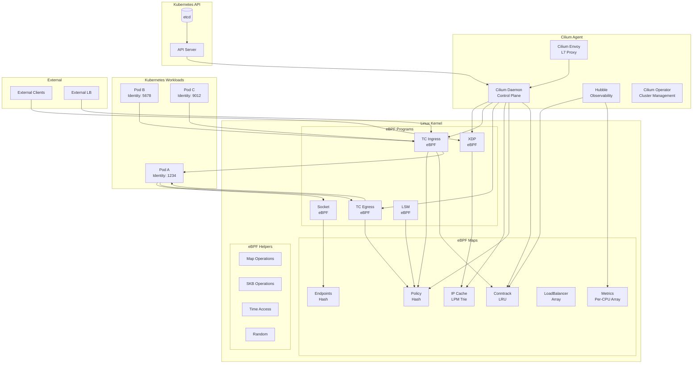

# TS-025: Cilium eBPF Networking

## 1. Overview

Cilium is an open-source software for providing, securing, and observing network connectivity between container workloads. It leverages eBPF (Extended Berkeley Packet Filter) to provide high-performance networking, security, and observability for cloud-native environments.

### 1.1 Core Capabilities

| Capability | Description | eBPF Program Type |
|------------|-------------|-------------------|
| Networking | High-performance overlay/underlay | TC/XDP |
| Security | Identity-based L3-L7 policies | LSM/Tracepoint |
| Observability | Hubble flow visibility | kprobe/tracepoint |
| Load Balancing | Maglev/Random consistent hashing | TC |
| Encryption | WireGuard/IPsec transparent encryption | TC |
| Bandwidth Management | Pod-level rate limiting | TC |

### 1.2 Architecture Overview



---

## 2. Architecture Deep Dive

### 2.1 eBPF Program Architecture

Cilium uses multiple eBPF program types for different networking layers:

```c
// bpf/bpf_xdp.c - XDP program for node-level processing
__section("from-netdev")
int bpf_xdp_entry(struct __ctx_buff *ctx)
{
    __u32 src_identity = 0;
    struct iphdr *ip4;
    struct ipv6hdr *ip6;
    void *data, *data_end;
    int ret;

    // Parse packet
    if (!revalidate_data(ctx, &data, &data_end, &ip4))
        return CTX_ACT_OK;

    // Check if packet is for local endpoint
    struct endpoint_key key = {};
    key.ip4 = ip4->daddr;
    key.family = ENDPOINT_KEY_IPV4;

    struct endpoint_info *ep = map_lookup_endpoint(&key);
    if (ep) {
        // Fast-path to local pod
        return redirect_ep(ctx, ep->ifindex, ep->sec_id);
    }

    // Check if packet is for remote node (cluster mesh)
    struct remote_endpoint_info *remote = ipcache_lookup4(&IPCACHE_MAP, ip4->daddr);
    if (remote) {
        // Encapsulate for remote node
        return encap_and_redirect_with_nodeid(ctx, remote->tunnel_endpoint, remote->sec_id);
    }

    // Allow to external
    return CTX_ACT_OK;
}

// bpf/bpf_lxc.c - Container TC program
__section("from-container")
int handle_ingress(struct __ctx_buff *ctx)
{
    struct ep_config *ep = lookup_ep_config();
    __u32 dst_id = 0;
    void *data, *data_end;
    struct iphdr *ip4;

    // Get source identity from socket
    __u32 src_id = get_identity(ctx);

    // Parse destination
    if (!revalidate_data(ctx, &data, &data_end, &ip4))
        return DROP_INVALID;

    // Look up destination in ipcache
    struct remote_endpoint_info *info = ipcache_lookup4(&IPCACHE_MAP, ip4->daddr);
    if (info)
        dst_id = info->sec_id;

    // Policy check
    int verdict = policy_can_access(&POLICY_MAP, src_id, dst_id, ip4->protocol,
                                     bpf_ntohs(dport), DIRECTION_EGRESS);
    if (verdict != CTX_ACT_OK)
        return verdict;

    // Conntrack lookup/create
    struct ct_state ct_state_new = {};
    struct ct_state ct_state = {};

    ret = ct_lookup4(&CT_MAP_TCP4, &tuple, ctx, ip4, CT_EGRESS, &ct_state, &monitor);

    if (ret == CT_NEW) {
        // Create new conntrack entry
        ct_create4(&CT_MAP_TCP4, &CT_MAP_ANY4, &tuple, ctx, CT_EGRESS, &ct_state_new, false);
    }

    // L3 forwarding
    if (is_local_endpoint(dst_id)) {
        return redirect_peer(ctx, dst_id);
    } else if (is_remote_endpoint(dst_id)) {
        return encap_and_redirect_lxc(ctx, ip4->daddr, 0, dst_id, &ct_state);
    }

    // To external - masquerade if needed
    return ipv4_l3(ctx, ip4->daddr, NULL, NULL);
}

// bpf/bpf_sock.c - Socket-level load balancing
__section("connect4")
int sock4_connect(struct bpf_sock_addr *ctx)
{
    struct lb4_backend *backend;
    struct lb4_service *svc;
    struct lb4_key key = {};

    // Check if destination is a service IP
    key.address = ctx->user_ip4;
    key.dport = ctx->user_port;

    svc = map_lookup_elem(&LB4_SERVICES_MAP_V2, &key);
    if (!svc)
        return SYS_PROCEED;

    // Select backend using Maglev or random
    backend = lb4_lookup_backend(ctx, svc);
    if (!backend)
        return SYS_REJECT;

    // Redirect connection to backend
    ctx->user_ip4 = backend->address;
    ctx->user_port = backend->port;

    return SYS_PROCEED;
}
```

### 2.2 Identity-Based Security

```go
// Identity is the numeric identity of an endpoint
type Identity struct {
    ID      uint32
    Labels  labels.Labels
    SHA256  string
}

// Security policy enforcement in eBPF
const (
    // Special identities
    IdentityUnknown       = 0
    IdentityWorld         = 2
    IdentityCluster       = 4
    IdentityHealth        = 4
    IdentityInit          = 5
    IdentityRemoteNode    = 6
    IdentityKubeAPIServer = 7

    // Reserved identities
    IdentityReservedMin = 1
    IdentityReservedMax = 65535
)

// ResolveIdentityFromIP looks up identity from IP
type IdentityCache struct {
    mutex       lock.RWMutex
    ipToIdentity map[string]Identity
}

func (c *IdentityCache) LookupByIP(ip net.IP) (Identity, bool) {
    c.mutex.RLock()
    defer c.mutex.RUnlock()

    id, ok := c.ipToIdentity[ip.String()]
    return id, ok
}

// Policy computation
func (r *rule) resolveL4Policy(ctx *SearchContext, result *L4Policy) *L4Policy {
    // Iterate over rules and populate policy map
    for _, ingressRule := range r.Ingress {
        for _, sel := range ingressRule.FromEndpoints {
            if sel.Matches(ctx.From) {
                // Allow from this identity
                for _, portRule := range ingressRule.ToPorts {
                    key := L4PolicyMapKey{
                        Protocol: portRule.Protocol,
                        Port:     portRule.Port,
                    }
                    result.Ingress[key] = L4Filter{
                        Port:     portRule.Port,
                        Protocol: portRule.Protocol,
                        Endpoints: sel,
                        DerivedFromRules: []labels.LabelArray{r.Labels},
                    }
                }
            }
        }
    }

    return result
}
```

### 2.3 Conntrack and NAT

```c
// Conntrack map structure
struct ct_entry {
    __u64 rx_packets;
    __u64 rx_bytes;
    __u64 tx_packets;
    __u64 tx_bytes;
    __u32 lifetime;
    __u16 rx_closing:1,
          tx_closing:1,
          nat46:1,
          lb_loopback:1,
          seen_non_syn:1,
          node_port:1,
          proxy_redirect:1,
          from_l7lb:1,
          from_tunnel:1,
          dsr_internal:1,
          from_netdev:1;
    __u16 rev_nat_index;
    __u16 slave;
    __u32 src_sec_id;
    __u32 last_rx_report;
    __u32 last_tx_report;
};

// Conntrack lookup
static __always_inline int ct_lookup4(const void *map, struct ipv4_ct_tuple *tuple,
                                       struct __ctx_buff *ctx, const struct iphdr *ip4,
                                       enum ct_dir dir, struct ct_state *ct_state,
                                       __u32 *monitor)
{
    int ret = CT_NEW;
    struct ct_entry *entry;

    // Lookup forward direction
    entry = map_lookup_elem(map, tuple);
    if (entry) {
        ret = ct_update_entry(ctx, entry, dir, ct_state, monitor);
        return ret;
    }

    // Lookup reverse direction
    ipv4_ct_tuple_reverse(tuple);
    entry = map_lookup_elem(map, tuple);
    if (entry) {
        ret = CT_ESTABLISHED;
        ct_state->rev_nat_index = entry->rev_nat_index;
    }

    return ret;
}

// SNAT handling for external traffic
static __always_inline int snat_v4_process(struct __ctx_buff *ctx, int dir)
{
    struct ipv4_ct_tuple tuple = {};
    struct iphdr *ip4;
    struct l4_header l4;
    void *data, *data_end;
    struct snat_mapping *mapping;

    // Parse packet
    if (!revalidate_data(ctx, &data, &data_end, &ip4))
        return DROP_INVALID;

    // Build tuple
    tuple.nexthdr = ip4->protocol;
    tuple.saddr = ip4->saddr;
    tuple.daddr = ip4->daddr;

    // Get source port from L4 header
    if (l4_load_ports(ctx, ip4, &tuple.sport, &tuple.dport) < 0)
        return DROP_INVALID;

    // Lookup existing mapping
    mapping = map_lookup_elem(&SNAT_MAPPING_IPV4, &tuple);
    if (mapping) {
        // Rewrite source IP and port
        return snat_v4_rewrite(ctx, ip4, &l4, mapping->to_saddr, mapping->to_sport);
    }

    // Create new mapping
    struct snat_mapping new_mapping = {};
    new_mapping.to_saddr = IPV4_MASQUERADE;
    new_mapping.to_sport = get_snat_port(&tuple);

    map_update_elem(&SNAT_MAPPING_IPV4, &tuple, &new_mapping, 0);

    return snat_v4_rewrite(ctx, ip4, &l4, new_mapping.to_saddr, new_mapping.to_sport);
}
```

---

## 3. Configuration Examples

### 3.1 Cilium Installation

```yaml
# cilium-values.yaml - Production configuration
kubeProxyReplacement: strict
k8sServiceHost: "auto"
k8sServicePort: "6443"

# Tunnel mode
tunnel: vxlan  # or "geneve", "disabled" for direct routing

# Enable IPv6
ipv6:
  enabled: true

# Identity allocation
identityAllocationMode: "crd"  # or "kvstore"

# IPAM mode
ipam:
  mode: "cluster-pool"
  operator:
    clusterPoolIPv4PodCIDRList: ["10.0.0.0/8"]
    clusterPoolIPv4MaskSize: 24
    clusterPoolIPv6PodCIDRList: ["fd00::/104"]
    clusterPoolIPv6MaskSize: 120

# Enable Hubble
hubble:
  enabled: true
  relay:
    enabled: true
  ui:
    enabled: true
  metrics:
    enabled:
      - dns:query;drop;capture
      - tcp
      - flow
      - icmp
      - http
    serviceMonitor:
      enabled: true

# Enable WireGuard encryption
encryption:
  enabled: true
  type: wireguard  # or "ipsec"

# Bandwidth manager
bandwidthManager:
  enabled: true

# eBPF-based host routing
bpf:
  masquerade: true
  hostRouting: true

# Load balancing
loadBalancer:
  algorithm: maglev  # or "random"
  mode: dsr  # or "snat", "hybrid"

# Performance tuning
bpf:
  mapDynamicSizeRatio: 0.0025
  policyMapMax: 16384
  lbMapMax: 65536

# Prometheus metrics
prometheus:
  enabled: true
  port: 9090
  serviceMonitor:
    enabled: true

# Operator configuration
operator:
  replicas: 2
  prometheus:
    enabled: true
    serviceMonitor:
      enabled: true
```

### 3.2 Network Policies (CiliumNetworkPolicy)

```yaml
# Deny all ingress by default
apiVersion: cilium.io/v2
kind: CiliumNetworkPolicy
metadata:
  name: default-deny-ingress
  namespace: production
spec:
  endpointSelector: {}
  ingressDeny:
    - {}
---
# Allow frontend to backend
apiVersion: cilium.io/v2
kind: CiliumNetworkPolicy
metadata:
  name: backend-allow-frontend
  namespace: production
spec:
  endpointSelector:
    matchLabels:
      app: backend
  ingress:
    - fromEndpoints:
        - matchLabels:
            app: frontend
            k8s:io.kubernetes.pod.namespace: production
      toPorts:
        - ports:
            - port: "8080"
              protocol: TCP
          rules:
            http:
              - method: GET
                path: "/api/v1/.*"
              - method: POST
                path: "/api/v1/orders"
---
# L7 HTTP policy with rate limiting
apiVersion: cilium.io/v2
kind: CiliumNetworkPolicy
metadata:
  name: api-rate-limit
  namespace: production
spec:
  endpointSelector:
    matchLabels:
      app: api
  ingress:
    - fromEndpoints:
        - matchLabels:
            app: gateway
      toPorts:
        - ports:
            - port: "80"
              protocol: TCP
          rules:
            http:
              - method: "^GET$"
                path: "/health"
              - method: "^GET$"
                path: "/api/.*"
                headers:
                  - name: X-RateLimit
                    presence: true
---
# Egress policy to external
apiVersion: cilium.io/v2
kind: CiliumNetworkPolicy
metadata:
  name: egress-external
  namespace: production
spec:
  endpointSelector:
    matchLabels:
      app: worker
  egress:
    - toFQDNs:
        - matchName: "api.stripe.com"
        - matchPattern: "*.amazonaws.com"
      toPorts:
        - ports:
            - port: "443"
              protocol: TCP
---
# DNS policy
apiVersion: cilium.io/v2
kind: CiliumNetworkPolicy
metadata:
  name: dns-policy
  namespace: production
spec:
  endpointSelector:
    matchLabels:
      app: backend
  egress:
    - toEndpoints:
        - matchLabels:
            k8s:io.kubernetes.pod.namespace: kube-system
            k8s-app: kube-dns
      toPorts:
        - ports:
            - port: "53"
              protocol: UDP
          rules:
            dns:
              - matchPattern: "*.cluster.local"
              - matchPattern: "*.amazonaws.com"
```

### 3.3 Load Balancer Configuration

```yaml
# Cilium LoadBalancer IPAM
apiVersion: cilium.io/v2alpha1
kind: CiliumLoadBalancerIPPool
metadata:
  name: blue-pool
spec:
  cidrs:
    - cidr: 10.100.0.0/24
  disabled: false
---
# BGP peering for external access
apiVersion: cilium.io/v2alpha1
kind: CiliumBGPPeeringPolicy
metadata:
  name: rack-1
spec:
  nodeSelector:
    matchLabels:
      rack: "1"
  virtualRouters:
    - localASN: 64512
      exportPodCIDR: true
      neighbors:
        - peerAddress: 10.0.0.1/32
          peerASN: 64513
---
# L2 announcements (MetalLB alternative)
apiVersion: cilium.io/v2alpha1
kind: CiliumL2AnnouncementPolicy
metadata:
  name: default-l2
spec:
  interfaces:
    - eth0
  externalIPs: true
  loadBalancerIPs: true
  nodeSelector:
    matchExpressions:
      - key: node-role.kubernetes.io/control-plane
        operator: DoesNotExist
```

---

## 4. Go Client Integration

### 4.1 Cilium Client

```go
package cilium

import (
    "context"
    "fmt"

    ciliumv2 "github.com/cilium/cilium/pkg/k8s/apis/cilium.io/v2"
    "github.com/cilium/cilium/pkg/k8s/client/clientset/versioned"
    metav1 "k8s.io/apimachinery/pkg/apis/meta/v1"
    "k8s.io/client-go/rest"
    "k8s.io/client-go/tools/clientcmd"
)

// Client wraps Cilium operations
type Client struct {
    ciliumClient versioned.Interface
}

// NewClient creates Cilium client
func NewClient(kubeconfig string) (*Client, error) {
    var config *rest.Config
    var err error

    if kubeconfig != "" {
        config, err = clientcmd.BuildConfigFromFlags("", kubeconfig)
    } else {
        config, err = rest.InClusterConfig()
    }
    if err != nil {
        return nil, err
    }

    ciliumClient, err := versioned.NewForConfig(config)
    if err != nil {
        return nil, err
    }

    return &Client{ciliumClient: ciliumClient}, nil
}

// GetCiliumEndpoints returns Cilium endpoints for a namespace
func (c *Client) GetCiliumEndpoints(ctx context.Context, namespace string) (*ciliumv2.CiliumEndpointList, error) {
    return c.ciliumClient.CiliumV2().CiliumEndpoints(namespace).List(ctx, metav1.ListOptions{})
}

// GetCiliumIdentity returns identity details
func (c *Client) GetCiliumIdentity(ctx context.Context, id int64) (*ciliumv2.CiliumIdentity, error) {
    return c.ciliumClient.CiliumV2().CiliumIdentities().Get(ctx, fmt.Sprintf("%d", id), metav1.GetOptions{})
}

// CreateNetworkPolicy creates a CiliumNetworkPolicy
func (c *Client) CreateNetworkPolicy(ctx context.Context, policy *ciliumv2.CiliumNetworkPolicy) (*ciliumv2.CiliumNetworkPolicy, error) {
    return c.ciliumClient.CiliumV2().CiliumNetworkPolicies(policy.Namespace).Create(ctx, policy, metav1.CreateOptions{})
}

// DeleteNetworkPolicy deletes a CiliumNetworkPolicy
func (c *Client) DeleteNetworkPolicy(ctx context.Context, namespace, name string) error {
    return c.ciliumClient.CiliumV2().CiliumNetworkPolicies(namespace).Delete(ctx, name, metav1.DeleteOptions{})
}
```

### 4.2 Hubble Flow Collection

```go
package cilium

import (
    "context"
    "io"

    observerpb "github.com/cilium/cilium/api/v1/observer"
    "google.golang.org/grpc"
)

// HubbleClient wraps Hubble operations
type HubbleClient struct {
    client observerpb.ObserverClient
    conn   *grpc.ClientConn
}

// NewHubbleClient creates Hubble client
func NewHubbleClient(serverAddr string) (*HubbleClient, error) {
    conn, err := grpc.Dial(serverAddr, grpc.WithInsecure())
    if err != nil {
        return nil, err
    }

    return &HubbleClient{
        client: observerpb.NewObserverClient(conn),
        conn:   conn,
    }, nil
}

// GetFlows streams flow records
func (h *HubbleClient) GetFlows(ctx context.Context, req *observerpb.GetFlowsRequest) (<-chan *observerpb.Flow, error) {
    stream, err := h.client.GetFlows(ctx, req)
    if err != nil {
        return nil, err
    }

    flows := make(chan *observerpb.Flow)

    go func() {
        defer close(flows)

        for {
            response, err := stream.Recv()
            if err == io.EOF {
                return
            }
            if err != nil {
                return
            }

            if flow := response.GetFlow(); flow != nil {
                select {
                case flows <- flow:
                case <-ctx.Done():
                    return
                }
            }
        }
    }()

    return flows, nil
}

// GetNetworkPolicy return flow with specific filter
func (h *HubbleClient) GetDroppedFlows(ctx context.Context, namespace string) (<-chan *observerpb.Flow, error) {
    req := &observerpb.GetFlowsRequest{
        Follow: true,
        Blacklist: []*observerpb.FlowFilter{
            {
                EventType: []*observerpb.EventTypeFilter{
                    {Type: 1}, // DROP
                },
            },
        },
        Whitelist: []*observerpb.FlowFilter{
            {
                SourcePod: []string{namespace + "/"},
            },
        },
    }

    return h.GetFlows(ctx, req)
}

func (h *HubbleClient) Close() error {
    return h.conn.Close()
}
```

---

## 5. Performance Tuning

### 5.1 eBPF Map Sizing

```yaml
# Optimize eBPF map sizes for high-scale
bpf:
  # Policy map size (per endpoint)
  policyMapMax: 65536

  # Conntrack map size
  # Formula: max_connections * 2 (for both directions)
  ctMapMax: 2000000

  # NAT map size
  natMapMax: 2000000

  # Load balancer backend map
  lbMapMax: 65536

  # Neighbor map (ARP)
  neighborMapMax: 524288

  # IP cache size
  ipcacheMapMax: 512000

  # Dynamic sizing based on memory
  mapDynamicSizeRatio: 0.0025  # 0.25% of total memory
```

### 5.2 XDP Mode Selection

```yaml
# XDP configuration
bpf:
  # XDP modes: native, generic, disabled
  # native: hardware/driver XDP (best performance)
  # generic: skb-mode XDP (compatibility)
  xdpMode: native

# For incompatible drivers, use generic mode
# or skip XDP for specific interfaces
devices: eth0,eth1

# Enable host firewall with XDP
hostFirewall:
  enabled: true
```

---

## 6. Production Deployment Patterns

### 6.1 Cluster Mesh

```yaml
# Cluster mesh configuration
cluster:
  name: cluster-east
  id: 1

clustermesh:
  useAPIServer: true
  apiserver:
    replicas: 2
    service:
      type: LoadBalancer
      annotations:
        service.beta.kubernetes.io/aws-load-balancer-type: "nlb"

  # Connect to remote clusters
  config:
    enabled: true
    clusters:
      - name: cluster-west
        address: cluster-west.mesh.cilium.io:2379
        tls:
          cert: /etc/cilium/clustermesh/cluster-west.crt
          key: /etc/cilium/clustermesh/cluster-west.key
          caCert: /etc/cilium/clustermesh/ca.crt
```

---

## 7. Comparison with Alternatives

| Feature | Cilium | Calico | Flannel | Weave Net |
|---------|--------|--------|---------|-----------|
| Data Plane | eBPF | eBPF/iptables | iptables | userspace |
| Performance | Excellent | Good | Good | Medium |
| Observability | Hubble | Limited | None | Limited |
| Encryption | WireGuard/IPsec | WireGuard/IPsec | None | NaCl |
| L7 Policies | Yes | Yes | No | No |
| Service Mesh | Yes (beta) | No | No | No |
| BGP Support | Yes | Yes | No | No |
| Multi-cluster | Yes | Yes | No | Yes |

---

## 8. References

1. [Cilium Documentation](https://docs.cilium.io/)
2. [eBPF.io](https://ebpf.io/)
3. [Cilium GitHub](https://github.com/cilium/cilium)
4. [BPF and XDP Reference](https://cilium.readthedocs.io/en/stable/bpf/)
5. [Hubble Documentation](https://docs.cilium.io/en/stable/observability/hubble/)
