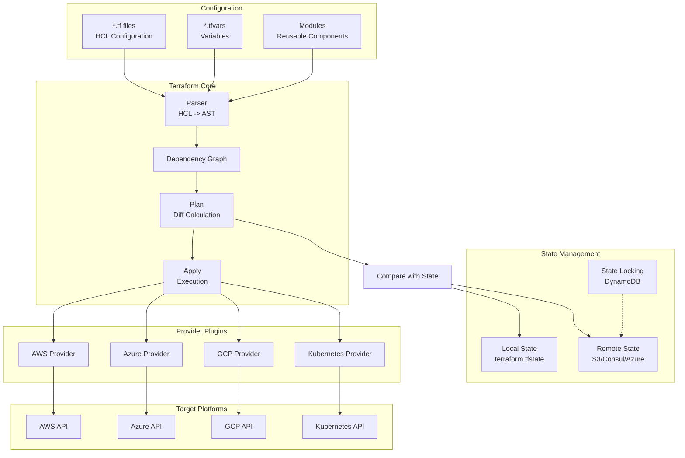

# TS-026: Terraform Infrastructure

## 1. Overview

Terraform is an open-source infrastructure as code (IaC) tool created by HashiCorp. It enables users to define and provision data center infrastructure using a declarative configuration language known as HashiCorp Configuration Language (HCL), or optionally JSON.

### 1.1 Core Capabilities

| Capability | Description | Use Case |
|------------|-------------|----------|
| Infrastructure Provisioning | Create/modify/destroy resources | Multi-cloud deployment |
| State Management | Track infrastructure state | Team collaboration |
| Module System | Reusable infrastructure components | Standardization |
| Plan & Apply | Preview changes before execution | Risk mitigation |
| Remote Backends | State storage and locking | CI/CD integration |

### 1.2 Architecture Overview



---

## 2. Architecture Deep Dive

### 2.1 Terraform Core Workflow

```go
// Simplified Terraform core workflow
type Terraform struct {
    config    *configs.Config
    state     *states.State
    graph     *Graph
    providers map[string]providers.Interface
}

// Load and validate configuration
func (t *Terraform) LoadConfig(path string) error {
    // 1. Parse HCL files
    parser := configs.NewParser(fs)
    cfg, diags := parser.LoadConfigDir(path)
    if diags.HasErrors() {
        return diags
    }

    // 2. Build module tree
    cfg, diags = configs.BuildConfig(cfg, configs.ModuleWalkerFunc(...))
    if diags.HasErrors() {
        return diags
    }

    t.config = cfg
    return nil
}

// Build dependency graph
func (t *Terraform) BuildGraph() (*Graph, error) {
    graph := &Graph{}

    // 1. Add provider nodes
    for name, provider := range t.config.ProviderConfigs {
        node := &NodeProvider{
            Name:   name,
            Config: provider,
        }
        graph.Add(node)
    }

    // 2. Add resource nodes
    for _, resource := range t.config.ManagedResources {
        node := &NodeResource{
            Addr:   resource.Addr(),
            Config: resource,
        }
        graph.Add(node)

        // Connect to provider
        providerNode := graph.GetNode("provider." + resource.Provider)
        graph.Connect(providerNode, node)
    }

    // 3. Add data source nodes
    for _, dataSource := range t.config.DataResources {
        node := &NodeDataResource{
            Addr:   dataSource.Addr(),
            Config: dataSource,
        }
        graph.Add(node)
    }

    // 4. Resolve dependencies
    for _, edge := range t.config.Module.Variables {
        if ref, ok := edge.Expr.(*hclsyntax.ScopeTraversalExpr); ok {
            src := graph.GetNode(ref.Traversal.RootName())
            dst := graph.GetNode(edge.Name)
            graph.Connect(src, dst)
        }
    }

    // 5. Validate graph
    if cycles := graph.DetectCycles(); len(cycles) > 0 {
        return nil, fmt.Errorf("dependency cycle detected: %v", cycles)
    }

    return graph, nil
}

// Plan phase
func (t *Terraform) Plan() (*Plan, error) {
    plan := &Plan{}

    // Walk the graph
    walkFn := func(n dag.Vertex) (dag.Diagnostics, error) {
        switch node := n.(type) {
        case *NodeResource:
            // Get current state
            priorState := t.state.ResourceInstance(node.Addr)

            // Evaluate configuration
            configVal, err := t.evalContext.Evaluate(node.Config.Config)
            if err != nil {
                return nil, err
            }

            // Compare with prior state
            action, err := t.planResourceChange(node, priorState, configVal)
            if err != nil {
                return nil, err
            }

            plan.Changes = append(plan.Changes, &ResourceChange{
                Addr:   node.Addr,
                Action: action,
                Before: priorState,
                After:  configVal,
            })
        }
        return nil, nil
    }

    if _, err := t.graph.Walk(walkFn); err != nil {
        return nil, err
    }

    return plan, nil
}

// Apply phase
func (t *Terraform) Apply(plan *Plan) error {
    return t.graph.Walk(func(n dag.Vertex) (dag.Diagnostics, error) {
        switch node := n.(type) {
        case *NodeResource:
            change := plan.GetChange(node.Addr)
            if change == nil {
                return nil, nil
            }

            provider := t.providers[node.Config.Provider]

            switch change.Action {
            case plans.Create:
                return t.createResource(provider, node, change)
            case plans.Update:
                return t.updateResource(provider, node, change)
            case plans.Delete:
                return t.deleteResource(provider, node, change)
            case plans.DeleteThenCreate, plans.CreateThenDelete:
                return t.replaceResource(provider, node, change)
            }
        }
        return nil, nil
    })
}
```

### 2.2 Provider Interface

```go
// Provider interface definition
type Interface interface {
    // GetSchema returns the schema for the provider configuration,
    // data sources, and resources.
    GetProviderSchema() GetProviderSchemaResponse

    // ValidateProviderConfig validates the provider configuration.
    ValidateProviderConfig(ValidateProviderConfigRequest) ValidateProviderConfigResponse

    // Configure configures the provider with the given configuration.
    ConfigureProvider(ConfigureProviderRequest) ConfigureProviderResponse

    // Stop requests the provider to stop operations.
    StopProvider(StopProviderRequest) StopProviderResponse

    // ValidateResourceConfig validates a resource configuration.
    ValidateResourceConfig(ValidateResourceConfigRequest) ValidateResourceConfigResponse

    // ValidateDataResourceConfig validates a data source configuration.
    ValidateDataResourceConfig(ValidateDataResourceConfigRequest) ValidateDataResourceConfigResponse

    // UpgradeResourceState upgrades a resource state to the current schema version.
    UpgradeResourceState(UpgradeResourceStateRequest) UpgradeResourceStateResponse

    // ReadResource refreshes a resource.
    ReadResource(ReadResourceRequest) ReadResourceResponse

    // PlanResourceChange calculates the planned change for a resource.
    PlanResourceChange(PlanResourceChangeRequest) PlanResourceChangeResponse

    // ApplyResourceChange applies the planned change to a resource.
    ApplyResourceChange(ApplyResourceChangeRequest) ApplyResourceChangeResponse

    // ImportResourceState imports a resource into state.
    ImportResourceState(ImportResourceStateRequest) ImportResourceStateResponse

    // ReadDataSource reads a data source.
    ReadDataSource(ReadDataSourceRequest) ReadDataSourceResponse
}

// AWS Provider implementation example
type AWSProvider struct {
    config    Config
    client    *aws.Client
    region    string
    accountID string
}

func (p *AWSProvider) Configure(req ConfigureProviderRequest) ConfigureProviderResponse {
    // Parse configuration
    var config Config
    if diags := req.Config.As(&config); diags.HasErrors() {
        return ConfigureProviderResponse{Diagnostics: diags}
    }

    p.config = config
    p.region = config.Region

    // Create AWS client
    cfg, err := awsconfig.LoadDefaultConfig(context.Background(),
        awsconfig.WithRegion(config.Region),
        awsconfig.WithCredentialsProvider(credentials.NewStaticCredentialsProvider(
            config.AccessKey,
            config.SecretKey,
            "",
        )),
    )
    if err != nil {
        return ConfigureProviderResponse{
            Diagnostics: diag.Errorf("failed to load AWS config: %s", err),
        }
    }

    p.client = aws.NewFromConfig(cfg)

    // Get account ID
    stsClient := sts.NewFromConfig(cfg)
    identity, err := stsClient.GetCallerIdentity(context.Background(), &sts.GetCallerIdentityInput{})
    if err != nil {
        return ConfigureProviderResponse{
            Diagnostics: diag.Errorf("failed to get account ID: %s", err),
        }
    }
    p.accountID = *identity.Account

    return ConfigureProviderResponse{}
}

func (p *AWSProvider) ApplyResourceChange(req ApplyResourceChangeRequest) ApplyResourceChangeResponse {
    resourceType := req.TypeName

    switch resourceType {
    case "aws_instance":
        return p.applyInstance(req)
    case "aws_s3_bucket":
        return p.applyS3Bucket(req)
    // ... other resource types
    default:
        return ApplyResourceChangeResponse{
            Diagnostics: diag.Errorf("unsupported resource type: %s", resourceType),
        }
    }
}
```

### 2.3 State Management

```go
// State structure
type State struct {
    Version   int
    Serial    uint64
    Lineage   string
    RootModule *Module
}

type Module struct {
    Resources   map[string]*Resource
    Outputs     map[string]*OutputValue
}

type Resource struct {
    Mode         ResourceMode  // Managed or Data
    Type         string
    Name         string
    Provider     string
    Instances    map[string]*ResourceInstance
    Module       string
}

type ResourceInstance struct {
    Current    *ResourceInstanceObject
    Deposed    []*ResourceInstanceObject
    Dependencies []ResourceInstanceAddress
}

type ResourceInstanceObject struct {
    IndexKey      interface{}
    SchemaVersion int
    Attrs         map[string]interface{}
    Private       []byte
    Status        ObjectStatus
    Dependencies  []ResourceInstanceAddress
    CreateBeforeDestroy bool
}

// State manager for remote state
type StateManager interface {
    RefreshState() error
    WriteState(state *State) error
    PersistState(schemas *terraform.Schemas) error
    Lock(info *LockInfo) (string, error)
    Unlock(id string) error
}

// S3 backend state manager
type S3StateManager struct {
    bucket    string
    key       string
    region    string
    dynamoDB  string // for locking
    encrypt   bool
    kmsKeyID  string
    s3Client  *s3.Client
    dynamoClient *dynamodb.Client
}

func (m *S3StateManager) WriteState(state *State) error {
    // Serialize state
    data, err := json.Marshal(state)
    if err != nil {
        return err
    }

    // Upload to S3
    input := &s3.PutObjectInput{
        Bucket: aws.String(m.bucket),
        Key:    aws.String(m.key),
        Body:   bytes.NewReader(data),
    }

    if m.encrypt {
        input.ServerSideEncryption = types.ServerSideEncryptionAwsKms
        input.SSEKMSKeyId = aws.String(m.kmsKeyID)
    }

    _, err = m.s3Client.PutObject(context.Background(), input)
    return err
}

func (m *S3StateManager) Lock(info *LockInfo) (string, error) {
    // Create lock in DynamoDB
    item := map[string]types.AttributeValue{
        "LockID": &types.AttributeValueMemberS{
            S: fmt.Sprintf("%s/%s", m.bucket, m.key),
        },
        "Info": &types.AttributeValueMemberS{
            S: info.String(),
        },
        "Created": &types.AttributeValueMemberS{
            S: time.Now().Format(time.RFC3339),
        },
    }

    _, err := m.dynamoClient.PutItem(context.Background(), &dynamodb.PutItemInput{
        TableName: aws.String(m.dynamoDB),
        Item:      item,
        ConditionExpression: aws.String("attribute_not_exists(LockID)"),
    })

    if err != nil {
        return "", fmt.Errorf("state lock failed: %w", err)
    }

    return info.ID, nil
}
```

---

## 3. Configuration Examples

### 3.1 Provider Configuration

```hcl
# providers.tf
terraform {
  required_version = ">= 1.5.0"

  required_providers {
    aws = {
      source  = "hashicorp/aws"
      version = "~> 5.0"
    }
    kubernetes = {
      source  = "hashicorp/kubernetes"
      version = "~> 2.23"
    }
    helm = {
      source  = "hashicorp/helm"
      version = "~> 2.11"
    }
  }

  backend "s3" {
    bucket         = "terraform-state-prod"
    key            = "infrastructure/terraform.tfstate"
    region         = "us-west-2"
    encrypt        = true
    kms_key_id     = "arn:aws:kms:us-west-2:123456789:key/terraform-state"
    dynamodb_table = "terraform-locks"

    # Workspace key prefix for multiple environments
    workspace_key_prefix = "workspaces"
  }
}

# Configure AWS Provider
provider "aws" {
  region = var.aws_region

  default_tags {
    tags = {
      Environment = var.environment
      Project     = var.project_name
      ManagedBy   = "Terraform"
    }
  }

  assume_role {
    role_arn     = "arn:aws:iam::${var.account_id}:role/TerraformExecutionRole"
    session_name = "terraform-session"
  }
}

# Multiple provider aliases
provider "aws" {
  alias  = "us_east_1"
  region = "us-east-1"
}

provider "aws" {
  alias  = "eu_west_1"
  region = "eu-west-1"
}
```

### 3.2 Variable Definitions

```hcl
# variables.tf
variable "environment" {
  description = "Environment name (dev, staging, prod)"
  type        = string

  validation {
    condition     = contains(["dev", "staging", "prod"], var.environment)
    error_message = "Environment must be dev, staging, or prod."
  }
}

variable "vpc_cidr" {
  description = "CIDR block for VPC"
  type        = string
  default     = "10.0.0.0/16"

  validation {
    condition     = can(cidrhost(var.vpc_cidr, 0))
    error_message = "Must be a valid CIDR block."
  }
}

variable "availability_zones" {
  description = "List of availability zones"
  type        = list(string)
  default     = ["a", "b", "c"]
}

variable "instance_types" {
  description = "Map of instance types per environment"
  type        = map(string)
  default = {
    dev     = "t3.micro"
    staging = "t3.small"
    prod    = "t3.medium"
  }
}

variable "enable_monitoring" {
  description = "Enable CloudWatch monitoring"
  type        = bool
  default     = true
}

variable "allowed_cidr_blocks" {
  description = "List of allowed CIDR blocks"
  type        = list(string)
  default     = []

  validation {
    condition     = alltrue([for cidr in var.allowed_cidr_blocks : can(cidrhost(cidr, 0))])
    error_message = "All elements must be valid CIDR blocks."
  }
}

# Sensitive variable
variable "database_password" {
  description = "Database administrator password"
  type        = string
  sensitive   = true

  validation {
    condition     = length(var.database_password) >= 16
    error_message = "Password must be at least 16 characters long."
  }
}

# Object variable with nested structure
variable "eks_cluster" {
  description = "EKS cluster configuration"
  type = object({
    name                    = string
    version                 = string
    endpoint_private_access = optional(bool, true)
    endpoint_public_access  = optional(bool, false)
    public_access_cidrs     = optional(list(string), [])

    node_groups = map(object({
      instance_types = list(string)
      min_size       = number
      max_size       = number
      desired_size   = number

      labels = optional(map(string), {})
      taints = optional(list(object({
        key    = string
        value  = optional(string)
        effect = string
      })), [])
    }))
  })
}
```

### 3.3 Module Structure

```hcl
# modules/vpc/main.tf
locals {
  common_tags = {
    Module = "vpc"
  }
}

resource "aws_vpc" "main" {
  cidr_block           = var.cidr_block
  enable_dns_hostnames = true
  enable_dns_support   = true

  tags = merge(
    local.common_tags,
    {
      Name = "${var.name_prefix}-vpc"
    }
  )
}

resource "aws_subnet" "public" {
  count = length(var.availability_zones)

  vpc_id                  = aws_vpc.main.id
  cidr_block              = cidrsubnet(var.cidr_block, 8, count.index)
  availability_zone       = "${var.region}${var.availability_zones[count.index]}"
  map_public_ip_on_launch = true

  tags = merge(
    local.common_tags,
    {
      Name = "${var.name_prefix}-public-${var.availability_zones[count.index]}"
      Type = "public"
    }
  )
}

resource "aws_subnet" "private" {
  count = length(var.availability_zones)

  vpc_id            = aws_vpc.main.id
  cidr_block        = cidrsubnet(var.cidr_block, 8, count.index + length(var.availability_zones))
  availability_zone = "${var.region}${var.availability_zones[count.index]}"

  tags = merge(
    local.common_tags,
    {
      Name = "${var.name_prefix}-private-${var.availability_zones[count.index]}"
      Type = "private"
    }
  )
}

resource "aws_internet_gateway" "main" {
  vpc_id = aws_vpc.main.id

  tags = {
    Name = "${var.name_prefix}-igw"
  }
}

resource "aws_nat_gateway" "main" {
  count = var.enable_nat_gateway ? length(var.availability_zones) : 0

  allocation_id = aws_eip.nat[count.index].id
  subnet_id     = aws_subnet.public[count.index].id

  tags = {
    Name = "${var.name_prefix}-nat-${var.availability_zones[count.index]}"
  }
}

# modules/vpc/variables.tf
variable "name_prefix" {
  description = "Prefix for resource names"
  type        = string
}

variable "cidr_block" {
  description = "CIDR block for VPC"
  type        = string
}

variable "region" {
  description = "AWS region"
  type        = string
}

variable "availability_zones" {
  description = "List of availability zone suffixes"
  type        = list(string)
}

variable "enable_nat_gateway" {
  description = "Enable NAT gateways"
  type        = bool
  default     = true
}

# modules/vpc/outputs.tf
output "vpc_id" {
  description = "ID of the created VPC"
  value       = aws_vpc.main.id
}

output "public_subnet_ids" {
  description = "IDs of public subnets"
  value       = aws_subnet.public[*].id
}

output "private_subnet_ids" {
  description = "IDs of private subnets"
  value       = aws_subnet.private[*].id
}

output "nat_gateway_ips" {
  description = "Public IPs of NAT gateways"
  value       = aws_nat_gateway.main[*].public_ip
}
```

### 3.4 Resource Definitions

```hcl
# main.tf - Using the VPC module
module "vpc" {
  source = "./modules/vpc"

  name_prefix        = var.project_name
  cidr_block         = var.vpc_cidr
  region             = var.aws_region
  availability_zones = var.availability_zones
  enable_nat_gateway = var.environment == "prod"
}

# Security Group
resource "aws_security_group" "app" {
  name_prefix = "${var.project_name}-app-"
  vpc_id      = module.vpc.vpc_id

  dynamic "ingress" {
    for_each = var.app_ports
    content {
      from_port   = ingress.value
      to_port     = ingress.value
      protocol    = "tcp"
      cidr_blocks = [var.vpc_cidr]
    }
  }

  egress {
    from_port   = 0
    to_port     = 0
    protocol    = "-1"
    cidr_blocks = ["0.0.0.0/0"]
  }

  tags = {
    Name = "${var.project_name}-app"
  }

  lifecycle {
    create_before_destroy = true
  }
}

# Launch Template
resource "aws_launch_template" "app" {
  name_prefix   = "${var.project_name}-"
  image_id      = data.aws_ami.amazon_linux_2.id
  instance_type = var.instance_types[var.environment]

  vpc_security_group_ids = [aws_security_group.app.id]

  iam_instance_profile {
    name = aws_iam_instance_profile.app.name
  }

  user_data = base64encode(templatefile("${path.module}/templates/user_data.sh", {
    environment = var.environment
    app_version = var.app_version
  }))

  tag_specifications {
    resource_type = "instance"
    tags = {
      Name = "${var.project_name}-app"
    }
  }

  lifecycle {
    ignore_changes = [latest_version]
  }
}

# Auto Scaling Group
resource "aws_autoscaling_group" "app" {
  name                = "${var.project_name}-app"
  vpc_zone_identifier = module.vpc.private_subnet_ids
  target_group_arns   = [aws_lb_target_group.app.arn]
  health_check_type   = "ELB"

  min_size         = var.environment == "prod" ? 3 : 1
  max_size         = var.environment == "prod" ? 10 : 3
  desired_capacity = var.environment == "prod" ? 3 : 1

  launch_template {
    id      = aws_launch_template.app.id
    version = "$Latest"
  }

  tag {
    key                 = "Name"
    value               = "${var.project_name}-app"
    propagate_at_launch = true
  }

  dynamic "tag" {
    for_each = var.additional_tags
    content {
      key                 = tag.key
      value               = tag.value
      propagate_at_launch = true
    }
  }

  instance_refresh {
    strategy = "Rolling"
    preferences {
      min_healthy_percentage = 66
    }
    triggers = ["tag"]
  }
}

# Conditional resource creation
resource "aws_cloudwatch_dashboard" "main" {
  count = var.enable_monitoring ? 1 : 0

  dashboard_name = "${var.project_name}-${var.environment}"
  dashboard_body = jsonencode({
    widgets = [
      {
        type   = "metric"
        x      = 0
        y      = 0
        width  = 12
        height = 6
        properties = {
          title  = "CPU Utilization"
          region = var.aws_region
          metrics = [
            ["AWS/EC2", "CPUUtilization", "AutoScalingGroupName", aws_autoscaling_group.app.name]
          ]
          period = 300
          stat   = "Average"
        }
      }
    ]
  })
}
```

---

## 4. Go Client Integration

### 4.1 Terraform CDK for Go

```go
package main

import (
    "github.com/aws/constructs-go/constructs/v10"
    "github.com/aws/jsii-runtime-go"
    "github.com/hashicorp/terraform-cdk-go/cdktf"
    "github.com/cdktf/cdktf-provider-aws-go/aws/v18"
    "github.com/cdktf/cdktf-provider-aws-go/aws/v18/vpc"
)

type MyStack struct {
    cdktf.TerraformStack
}

func NewMyStack(scope constructs.Construct, id string) cdktf.TerraformStack {
    stack := cdktf.NewTerraformStack(scope, &id)

    // Configure AWS provider
    aws.NewAwsProvider(stack, jsii.String("AWS"), &aws.AwsProviderConfig{
        Region: jsii.String("us-west-2"),
    })

    // Create VPC
    vpc := vpc.NewVpc(stack, jsii.String("MyVpc"), &vpc.VpcConfig{
        CidrBlock:          jsii.String("10.0.0.0/16"),
        EnableDnsHostnames: jsii.Bool(true),
        EnableDnsSupport:   jsii.Bool(true),
        Tags: &map[string]*string{
            "Name": jsii.String("cdktf-vpc"),
        },
    })

    // Create subnets
    publicSubnets := cdktf.NewTerraformLocal(stack, jsii.String("public_subnets"),
        []map[string]interface{}{
            {
                "cidr": "10.0.1.0/24",
                "az":   "us-west-2a",
            },
            {
                "cidr": "10.0.2.0/24",
                "az":   "us-west-2b",
            },
        },
    )

    // Create EC2 instances
    instance := aws.NewInstance(stack, jsii.String("web"), &aws.InstanceConfig{
        Ami:          jsii.String("ami-12345678"),
        InstanceType: jsii.String("t3.micro"),
        SubnetId:     vpc.PublicSubnets().Get(jsii.Number(0)),
        Tags: &map[string]*string{
            "Name": jsii.String("web-server"),
        },
    })

    // Output values
    cdktf.NewTerraformOutput(stack, jsii.String("vpc_id"), &cdktf.TerraformOutputConfig{
        Value: vpc.Id(),
    })

    cdktf.NewTerraformOutput(stack, jsii.String("instance_ip"), &cdktf.TerraformOutputConfig{
        Value: instance.PublicIp(),
    })

    return stack
}

func main() {
    app := cdktf.NewApp(nil)

    stack := NewMyStack(app, "cdktf-go-example")

    cdktf.NewS3Backend(stack, &cdktf.S3BackendConfig{
        Bucket:        jsii.String("my-terraform-state"),
        Key:           jsii.String("cdktf/terraform.tfstate"),
        Region:        jsii.String("us-west-2"),
        Encrypt:       jsii.Bool(true),
        DynamodbTable: jsii.String("terraform-locks"),
    })

    app.Synth()
}
```

### 4.2 Terraform State Management in Go

```go
package terraform

import (
    "encoding/json"
    "fmt"
    "os"

    "github.com/hashicorp/terraform-exec/tfexec"
    "github.com/hashicorp/terraform-exec/tfinstall"
)

// StateManager manages Terraform state operations
type StateManager struct {
    workingDir string
    execPath   string
    tf         *tfexec.Terraform
}

// NewStateManager creates a new state manager
func NewStateManager(workingDir string) (*StateManager, error) {
    // Install Terraform if not present
    execPath, err := tfinstall.Find(context.Background(), tfinstall.LatestVersion("", false))
    if err != nil {
        return nil, err
    }

    tf, err := tfexec.NewTerraform(workingDir, execPath)
    if err != nil {
        return nil, err
    }

    return &StateManager{
        workingDir: workingDir,
        execPath:   execPath,
        tf:         tf,
    }, nil
}

// Init initializes Terraform
func (m *StateManager) Init(opts ...tfexec.InitOption) error {
    return m.tf.Init(context.Background(), opts...)
}

// Plan generates an execution plan
func (m *StateManager) Plan(opts ...tfexec.PlanOption) (bool, error) {
    return m.tf.Plan(context.Background(), opts...)
}

// Apply applies the Terraform configuration
func (m *StateManager) Apply(opts ...tfexec.ApplyOption) error {
    return m.tf.Apply(context.Background(), opts...)
}

// Destroy destroys all resources
func (m *StateManager) Destroy(opts ...tfexec.DestroyOption) error {
    return m.tf.Destroy(context.Background(), opts...)
}

// StateList lists all resources in state
func (m *StateManager) StateList() ([]string, error) {
    state, err := m.tf.ShowStateFile(context.Background(), "terraform.tfstate")
    if err != nil {
        return nil, err
    }

    var resources []string
    for _, resource := range state.Values.RootModule.Resources {
        resources = append(resources, resource.Address)
    }

    return resources, nil
}

// StateRemove removes resources from state
func (m *StateManager) StateRemove(addresses ...string) error {
    _, err := m.tf.StateRm(context.Background(), addresses...)
    return err
}

// StateImport imports a resource into state
func (m *StateManager) StateImport(address, id string) error {
    return m.tf.Import(context.Background(), address, id)
}

// Output retrieves output values
func (m *StateManager) Output(key string) (string, error) {
    outputs, err := m.tf.Output(context.Background())
    if err != nil {
        return "", err
    }

    output, ok := outputs[key]
    if !ok {
        return "", fmt.Errorf("output %s not found", key)
    }

    return string(output.Value), nil
}

// Workspace operations
func (m *StateManager) WorkspaceList() ([]string, string, error) {
    return m.tf.WorkspaceList(context.Background())
}

func (m *StateManager) WorkspaceSelect(name string) error {
    return m.tf.WorkspaceSelect(context.Background(), name)
}

func (m *StateManager) WorkspaceNew(name string, opts ...tfexec.WorkspaceNewCmdOption) error {
    return m.tf.WorkspaceNew(context.Background(), name, opts...)
}
```

---

## 5. Performance Tuning

### 5.1 Parallelism and Concurrency

```hcl
# terraform.tf
terraform {
  # Increase parallelism (default: 10)
  # Higher values speed up resource creation
  # But may hit API rate limits
}
```

```bash
# Run with increased parallelism
terraform apply -parallelism=50

# For large-scale operations
terraform apply -parallelism=100
```

### 5.2 State Optimization

```hcl
# Use -refresh=false to skip state refresh
terraform plan -refresh=false

# Use -target for targeted operations
terraform apply -target=module.vpc

# Partial configuration evaluation
terraform plan -out=tfplan
terraform apply tfplan
```

---

## 6. Production Deployment Patterns

### 6.1 Multi-Environment Workspace Pattern

```bash
# Directory structure
terraform/
├── modules/
│   ├── vpc/
│   ├── eks/
│   └── rds/
├── environments/
│   ├── dev/
│   │   └── main.tf
│   ├── staging/
│   │   └── main.tf
│   └── prod/
│       └── main.tf
└── global/
    └── iam/
```

```hcl
# environments/dev/main.tf
terraform {
  backend "s3" {
    bucket = "terraform-state-dev"
    key    = "dev/terraform.tfstate"
    region = "us-west-2"
  }
}

module "infrastructure" {
  source = "../../modules/infrastructure"

  environment = "dev"

  # Dev-specific overrides
  instance_count = 1
  instance_type  = "t3.micro"

  enable_monitoring = false
  enable_backup     = false
}
```

### 6.2 CI/CD Integration

```yaml
# .github/workflows/terraform.yml
name: Terraform

on:
  push:
    branches: [ main ]
  pull_request:
    branches: [ main ]

jobs:
  terraform:
    runs-on: ubuntu-latest
    environment: production

    steps:
      - uses: actions/checkout@v3

      - name: Setup Terraform
        uses: hashicorp/setup-terraform@v2
        with:
          terraform_version: "1.5.0"
          terraform_wrapper: false

      - name: Terraform Format
        run: terraform fmt -check -recursive

      - name: Terraform Init
        run: terraform init
        env:
          AWS_ACCESS_KEY_ID: ${{ secrets.AWS_ACCESS_KEY_ID }}
          AWS_SECRET_ACCESS_KEY: ${{ secrets.AWS_SECRET_ACCESS_KEY }}

      - name: Terraform Validate
        run: terraform validate

      - name: Terraform Plan
        run: terraform plan -out=tfplan
        env:
          AWS_ACCESS_KEY_ID: ${{ secrets.AWS_ACCESS_KEY_ID }}
          AWS_SECRET_ACCESS_KEY: ${{ secrets.AWS_SECRET_ACCESS_KEY }}

      - name: Upload Plan
        uses: actions/upload-artifact@v3
        with:
          name: tfplan
          path: tfplan

      - name: Terraform Apply
        if: github.ref == 'refs/heads/main'
        run: terraform apply -auto-approve tfplan
        env:
          AWS_ACCESS_KEY_ID: ${{ secrets.AWS_ACCESS_KEY_ID }}
          AWS_SECRET_ACCESS_KEY: ${{ secrets.AWS_SECRET_ACCESS_KEY }}
```

---

## 7. Comparison with Alternatives

| Feature | Terraform | Pulumi | CloudFormation | ARM/Bicep |
|---------|-----------|--------|----------------|-----------|
| Multi-Cloud | Yes | Yes | AWS only | Azure only |
| Language | HCL | TypeScript/Python/Go | YAML/JSON | Bicep/JSON |
| State Management | Required | Service | AWS-managed | Azure-managed |
| Drift Detection | Yes | Yes | Yes | Yes |
| Modules | Yes | Packages | Yes | Yes |
| Community | Large | Growing | Large | Azure-focused |
| Import | Yes | Yes | Limited | Limited |
| Cost Estimation | Yes (infracost) | Yes | No | No |

---

## 8. References

1. [Terraform Documentation](https://developer.hashicorp.com/terraform/docs)
2. [Terraform Language Documentation](https://developer.hashicorp.com/terraform/language)
3. [Terraform Provider Registry](https://registry.terraform.io/)
4. [Terraform Best Practices](https://www.terraform-best-practices.com/)
5. [Terraform CDK](https://developer.hashicorp.com/terraform/cdktf)
