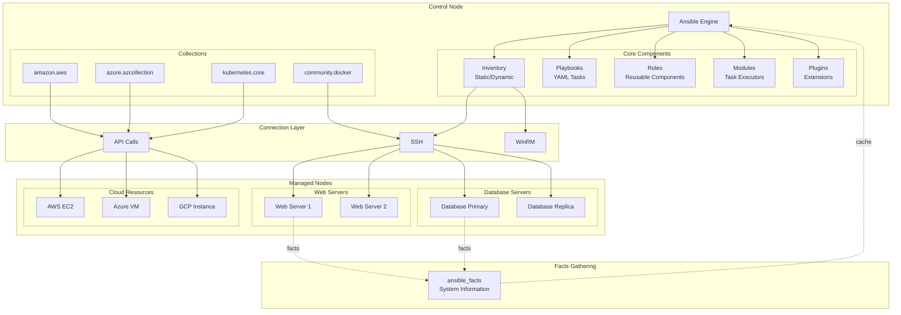

# TS-027: Ansible Configuration

## 1. Overview

Ansible is an open-source automation tool for configuration management, application deployment, and task automation. It uses a simple, human-readable YAML syntax and operates agentlessly over SSH, making it easy to deploy and manage infrastructure at scale.

### 1.1 Core Capabilities

| Capability | Description | Use Case |
|------------|-------------|----------|
| Configuration Management | Idempotent system configuration | Server provisioning |
| Application Deployment | Multi-tier app deployment | CI/CD pipelines |
| Orchestration | Workflow coordination | Complex deployments |
| Provisioning | Infrastructure creation | Cloud resource management |
| Security Compliance | Policy enforcement | Security baselines |

### 1.2 Architecture Overview



---

## 2. Architecture Deep Dive

### 2.1 Ansible Execution Flow

```python
# Simplified Ansible execution flow
class PlaybookExecutor:
    def __init__(self, playbooks, inventory, variable_manager, loader, options):
        self.playbooks = playbooks
        self.inventory = inventory
        self.variable_manager = variable_manager
        self.loader = loader
        self.options = options

    def run(self):
        result = 0
        for playbook_path in self.playbooks:
            # 1. Parse playbook
            playbook = Playbook.load(
                playbook_path,
                variable_manager=self.variable_manager,
                loader=self.loader
            )

            # 2. Execute plays
            for play in playbook.get_plays():
                result |= self.run_play(play)

        return result

    def run_play(self, play):
        # 1. Get target hosts
        hosts = self.inventory.get_hosts(play.hosts)

        # 2. Build task queue
        task_queue_manager = TaskQueueManager(
            inventory=self.inventory,
            variable_manager=self.variable_manager,
            loader=self.loader,
            options=self.options,
            passwords=self.passwords,
            stdout_callback=self.callback
        )

        # 3. Run tasks on all hosts
        result = task_queue_manager.run(play)

        return result

class TaskQueueManager:
    def __init__(self, ...):
        self._workers = []
        self._result_q = multiprocessing.Queue()

    def run(self, play):
        # 1. Strategy plugin selection (linear, free, host_pinned)
        strategy = strategy_loader.get(play.strategy, self)

        # 2. Fork workers (default: 5 forks)
        for i in range(forks):
            worker = WorkerProcess(self._result_q)
            worker.start()
            self._workers.append(worker)

        # 3. Run strategy
        result = strategy.run(iterator, play_context)

        # 4. Cleanup
        self.terminate_workers()

        return result
```

### 2.2 Module Execution

```python
# Module execution flow
class ActionBase:
    def run(self, tmp=None, task_vars=None):
        # 1. Template task arguments
        task_args = self._task.args

        # 2. Build module payload
        module_data = self._execute_module(
            module_name=self._task.action,
            module_args=task_args,
            task_vars=task_vars
        )

        # 3. Transfer to remote host (if not builtin)
        if not self._task.delegate_to:
            self._transfer_data(remote_module_path, module_data)

        # 4. Execute on remote
        result = self._low_level_execute_command(
            cmd=remote_module_path,
            executable=None
        )

        # 5. Parse and return result
        return self._parse_returned_data(result)

# Example: Custom module structure
DOCUMENTATION = '''
---
module: custom_facts
description:
    - Gathers custom system facts
options:
    fact_name:
        description: Name of fact to gather
        required: true
        type: str
author:
    - Your Name
'''

EXAMPLES = '''
- name: Gather custom fact
  custom_facts:
    fact_name: database_version
'''

RETURN = '''
fact_value:
    description: The value of the custom fact
    returned: always
    type: str
'''

from ansible.module_utils.basic import AnsibleModule

def main():
    module = AnsibleModule(
        argument_spec=dict(
            fact_name=dict(type='str', required=True),
        ),
        supports_check_mode=True
    )

    fact_name = module.params['fact_name']

    # Gather fact logic
    if fact_name == 'database_version':
        rc, stdout, stderr = module.run_command(['psql', '--version'])
        if rc == 0:
            version = stdout.strip().split()[-1]
            module.exit_json(
                changed=False,
                fact_value=version,
                ansible_facts={'db_version': version}
            )
        else:
            module.fail_json(msg=f"Failed to get {fact_name}: {stderr}")

    module.exit_json(changed=False)

if __name__ == '__main__':
    main()
```

### 2.3 Inventory Management

```python
# Inventory manager implementation
class InventoryManager:
    def __init__(self, loader, sources=None):
        self._loader = loader
        self._hosts = {}
        self._groups = {}
        self._sources = []

        # Add default groups
        self.add_group('all')
        self.add_group('ungrouped')

        # Parse inventory sources
        if sources:
            for source in sources:
                self.parse_source(source)

    def parse_source(self, source):
        # Determine inventory plugin
        if ',' in source:
            # Host list
            plugin = HostListParser()
        elif os.path.isdir(source):
            # Directory
            plugin = InventoryDirectory()
        elif self._is_script(source):
            # Dynamic inventory script
            plugin = ScriptInventory()
        else:
            # YAML/INI file
            plugin = InventoryFile()

        # Parse and add hosts
        plugin.parse(self._loader, source)

    def add_host(self, host, group='all', port=None):
        if host not in self._hosts:
            self._hosts[host] = Host(host, port)

        g = self._groups.get(group, Group(group))
        g.add_host(self._hosts[host])
        self._groups[group] = g

        return self._hosts[host]

    def get_hosts(self, pattern='all'):
        # Pattern matching (supports wildcards and groups)
        if pattern == 'all':
            return list(self._hosts.values())

        hosts = []
        for name, host in self._hosts.items():
            if fnmatch.fnmatch(name, pattern):
                hosts.append(host)
            elif pattern in self._groups:
                if host in self._groups[pattern].hosts:
                    hosts.append(host)

        return hosts

# Dynamic inventory from cloud
class AWSInventory:
    def __init__(self):
        self.ec2 = boto3.client('ec2')

    def get_inventory(self):
        inventory = {'_meta': {'hostvars': {}}}

        # Get all instances
        response = self.ec2.describe_instances(
            Filters=[{'Name': 'instance-state-name', 'Values': ['running']}]
        )

        for reservation in response['Reservations']:
            for instance in reservation['Instances']:
                hostname = instance['PrivateIpAddress']

                # Group by tags
                for tag in instance.get('Tags', []):
                    group_name = tag['Value']
                    if group_name not in inventory:
                        inventory[group_name] = {'hosts': []}
                    inventory[group_name]['hosts'].append(hostname)

                # Host variables
                inventory['_meta']['hostvars'][hostname] = {
                    'ansible_host': instance['PrivateIpAddress'],
                    'ec2_instance_id': instance['InstanceId'],
                    'ec2_instance_type': instance['InstanceType'],
                    'ec2_region': instance['Placement']['AvailabilityZone'][:-1],
                }

        return inventory
```

---

## 3. Configuration Examples

### 3.1 Inventory Configuration

```yaml
# inventory/production/hosts.yml
all:
  children:
    webservers:
      hosts:
        web01.prod.example.com:
          ansible_host: 10.0.1.10
          ansible_user: deploy
          ansible_ssh_private_key_file: ~/.ssh/deploy_key

        web02.prod.example.com:
          ansible_host: 10.0.1.11
          ansible_user: deploy

      vars:
        nginx_workers: 4
        php_fpm_children: 20

    databases:
      hosts:
        db01.prod.example.com:
          ansible_host: 10.0.2.10
          mysql_role: primary

        db02.prod.example.com:
          ansible_host: 10.0.2.11
          mysql_role: replica

    cache:
      hosts:
        redis01.prod.example.com:
        redis02.prod.example.com:

    loadbalancers:
      hosts:
        lb01.prod.example.com:
          ansible_host: 10.0.0.10

  vars:
    ansible_python_interpreter: /usr/bin/python3
    datacenter: us-east-1
    environment: production

    # Vault-encrypted variables
    database_password: "{{ vault_database_password }}"

# Dynamic inventory (AWS)
# aws_ec2.yml
plugin: amazon.aws.aws_ec2
regions:
  - us-east-1
  - us-west-2
filters:
  instance-state-name: running
  tag:Environment: production
keyed_groups:
  - key: tags.Role
    prefix: role
  - key: tags.Environment
    prefix: env
  - key: placement.availability_zone
    prefix: az
hostnames:
  - tag:Name
  - private-ip-address
compose:
  ansible_host: private_ip_address
```

### 3.2 Playbook Structure

```yaml
# site.yml - Main playbook
---
- name: Apply common configuration to all servers
  hosts: all
  become: yes

  pre_tasks:
    - name: Update apt cache
      apt:
        update_cache: yes
        cache_valid_time: 3600
      when: ansible_os_family == "Debian"
      tags: [always]

  roles:
    - role: common
      tags: [common]
    - role: monitoring
      tags: [monitoring]
      when: "'monitoring' in group_names"

- name: Configure web servers
  hosts: webservers
  become: yes

  vars_files:
    - vars/web.yml
    - vars/secrets.yml

  roles:
    - role: nginx
      tags: [nginx]
    - role: php
      tags: [php]
    - role: application
      tags: [app]

  post_tasks:
    - name: Verify nginx is responding
      uri:
        url: "http://{{ ansible_default_ipv4.address }}/health"
        status_code: 200
      register: health_check
      retries: 5
      delay: 10
      until: health_check.status == 200

- name: Configure database servers
  hosts: databases
  become: yes
  serial: 1  # One at a time for databases

  vars:
    mysql_max_connections: 500
    mysql_innodb_buffer_pool_size: "{{ (ansible_memtotal_mb * 0.7) | int }}M"

  roles:
    - role: mysql
      tags: [mysql]

  tasks:
    - name: Create application database
      mysql_db:
        name: "{{ app_database_name }}"
        state: present

    - name: Create application user
      mysql_user:
        name: "{{ app_database_user }}"
        password: "{{ app_database_password }}"
        priv: "{{ app_database_name }}.*:ALL"
        host: '%'
        state: present
```

### 3.3 Role Structure

```yaml
# roles/nginx/tasks/main.yml
---
- name: Install nginx
  package:
    name: nginx
    state: present
  notify: restart nginx

- name: Create nginx configuration
  template:
    src: nginx.conf.j2
    dest: /etc/nginx/nginx.conf
    owner: root
    group: root
    mode: '0644'
  notify: reload nginx

- name: Create sites-available directory
  file:
    path: /etc/nginx/sites-available
    state: directory
    mode: '0755'

- name: Create sites-enabled directory
  file:
    path: /etc/nginx/sites-enabled
    state: directory
    mode: '0755'

- name: Configure virtual hosts
  template:
    src: virtualhost.conf.j2
    dest: "/etc/nginx/sites-available/{{ item.server_name }}"
  loop: "{{ nginx_virtual_hosts }}"
  loop_control:
    label: "{{ item.server_name }}"
  notify: reload nginx

- name: Enable virtual hosts
  file:
    src: "/etc/nginx/sites-available/{{ item.server_name }}"
    dest: "/etc/nginx/sites-enabled/{{ item.server_name }}"
    state: link
  loop: "{{ nginx_virtual_hosts }}"
  notify: reload nginx

- name: Remove default site
  file:
    path: /etc/nginx/sites-enabled/default
    state: absent
  notify: reload nginx

- name: Ensure nginx is running
  service:
    name: nginx
    state: started
    enabled: yes

# roles/nginx/templates/nginx.conf.j2
user {{ nginx_user }};
worker_processes {{ nginx_workers | default(ansible_processor_vcpus) }};
pid /run/nginx.pid;

events {
    worker_connections {{ nginx_worker_connections | default(1024) }};
    use epoll;
    multi_accept on;
}

http {
    include /etc/nginx/mime.types;
    default_type application/octet-stream;

    log_format main '$remote_addr - $remote_user [$time_local] "$request" '
                    '$status $body_bytes_sent "$http_referer" '
                    '"$http_user_agent" "$http_x_forwarded_for" '
                    'rt=$request_time uct="$upstream_connect_time" '
                    'uht="$upstream_header_time" urt="$upstream_response_time"';

    access_log /var/log/nginx/access.log main;
    error_log /var/log/nginx/error.log warn;

    sendfile on;
    tcp_nopush on;
    tcp_nodelay on;
    keepalive_timeout {{ nginx_keepalive_timeout | default(65) }};
    types_hash_max_size 2048;

    gzip on;
    gzip_vary on;
    gzip_proxied any;
    gzip_comp_level 6;
    gzip_types text/plain text/css text/xml application/json application/javascript application/rss+xml application/atom+xml image/svg+xml;

    include /etc/nginx/sites-enabled/*;
}

# roles/nginx/handlers/main.yml
---
- name: restart nginx
  service:
    name: nginx
    state: restarted

- name: reload nginx
  service:
    name: nginx
    state: reloaded

- name: validate nginx configuration
  command: nginx -t
  changed_when: false
```

### 3.4 Variable Files

```yaml
# group_vars/all.yml
---
# System settings
ntp_servers:
  - 0.pool.ntp.org
  - 1.pool.ntp.org
  - 2.pool.ntp.org

dns_servers:
  - 8.8.8.8
  - 8.8.4.4

# Security settings
ssh_port: 22
ssh_password_authentication: "no"
ssh_root_login: "no"
ssh_max_auth_tries: 3

# Monitoring
prometheus_retention: "30d"
grafana_admin_user: admin

# Backup settings
backup_retention_days: 30
backup_schedule: "0 2 * * *"  # Daily at 2 AM

# group_vars/webservers.yml
---
nginx_user: www-data
nginx_workers: "{{ ansible_processor_vcpus }}"
nginx_worker_connections: 4096
nginx_keepalive_timeout: 30

nginx_virtual_hosts:
  - server_name: api.example.com
    listen: 80
    root: /var/www/api/current/public
    index: index.php
    ssl: true
    ssl_certificate: /etc/ssl/certs/api.example.com.crt
    ssl_certificate_key: /etc/ssl/private/api.example.com.key
    locations:
      - path: /
        try_files: $uri $uri/ /index.php?$query_string
      - path: ~ \.php$
        fastcgi_pass: unix:/run/php/php8.1-fpm.sock
        fastcgi_index: index.php
        fastcgi_param: SCRIPT_FILENAME $document_root$fastcgi_script_name
        include: fastcgi_params

php_version: "8.1"
php_fpm_pm_max_children: 50
php_fpm_pm_start_servers: 5
php_fpm_pm_min_spare_servers: 5
php_fpm_pm_max_spare_servers: 35

# host_vars/web01.prod.example.com.yml
---
# Host-specific overrides
nginx_workers: 8
php_fpm_pm_max_children: 100

# Special mount points
additional_mounts:
  - path: /var/www/uploads
    src: /dev/vdb1
    fstype: xfs
    opts: defaults,noatime
```

---

## 4. Go Integration

### 4.1 Ansible Runner in Go

```go
package ansible

import (
    "bytes"
    "context"
    "fmt"
    "os"
    "os/exec"
    "path/filepath"
    "strings"
)

// Runner executes Ansible playbooks
type Runner struct {
    workingDir   string
    inventory    string
    privateKey   string
    vaultPassword string
    extraVars    map[string]string
    forks        int
    verbose      bool
}

// NewRunner creates a new Ansible runner
func NewRunner(workingDir string) *Runner {
    return &Runner{
        workingDir: workingDir,
        forks:      5,
        extraVars:  make(map[string]string),
    }
}

// WithInventory sets the inventory file
func (r *Runner) WithInventory(inventory string) *Runner {
    r.inventory = inventory
    return r
}

// WithPrivateKey sets the SSH private key
func (r *Runner) WithPrivateKey(keyPath string) *Runner {
    r.privateKey = keyPath
    return r
}

// WithVaultPassword sets the vault password
func (r *Runner) WithVaultPassword(password string) *Runner {
    r.vaultPassword = password
    return r
}

// WithExtraVar adds an extra variable
func (r *Runner) WithExtraVar(key, value string) *Runner {
    r.extraVars[key] = value
    return r
}

// WithForks sets the number of parallel forks
func (r *Runner) WithForks(forks int) *Runner {
    r.forks = forks
    return r
}

// RunPlaybook executes an Ansible playbook
func (r *Runner) RunPlaybook(ctx context.Context, playbook string) (*RunResult, error) {
    args := []string{"ansible-playbook"}

    // Inventory
    if r.inventory != "" {
        args = append(args, "-i", r.inventory)
    }

    // Forks
    args = append(args, "--forks", fmt.Sprintf("%d", r.forks))

    // SSH private key
    if r.privateKey != "" {
        args = append(args, "--private-key", r.privateKey)
    }

    // Vault password file
    if r.vaultPassword != "" {
        vaultFile, err := r.createVaultPasswordFile()
        if err != nil {
            return nil, err
        }
        defer os.Remove(vaultFile)
        args = append(args, "--vault-password-file", vaultFile)
    }

    // Extra variables
    if len(r.extraVars) > 0 {
        extraVars := make([]string, 0, len(r.extraVars))
        for k, v := range r.extraVars {
            extraVars = append(extraVars, fmt.Sprintf("%s=%s", k, v))
        }
        args = append(args, "--extra-vars", strings.Join(extraVars, " "))
    }

    // Verbosity
    if r.verbose {
        args = append(args, "-vvv")
    }

    // Playbook
    args = append(args, playbook)

    // Execute
    cmd := exec.CommandContext(ctx, args[0], args[1:]...)
    cmd.Dir = r.workingDir

    var stdout, stderr bytes.Buffer
    cmd.Stdout = &stdout
    cmd.Stderr = &stderr

    err := cmd.Run()

    return &RunResult{
        ExitCode: cmd.ProcessState.ExitCode(),
        Stdout:   stdout.String(),
        Stderr:   stderr.String(),
        Success:  err == nil,
    }, err
}

// RunAdHoc executes an ad-hoc command
func (r *Runner) RunAdHoc(ctx context.Context, pattern, module string, args map[string]string) (*RunResult, error) {
    cmdArgs := []string{"ansible"}

    // Pattern (host/group)
    cmdArgs = append(cmdArgs, pattern)

    // Module
    cmdArgs = append(cmdArgs, "-m", module)

    // Module arguments
    if len(args) > 0 {
        argList := make([]string, 0, len(args))
        for k, v := range args {
            argList = append(argList, fmt.Sprintf("%s=%s", k, v))
        }
        cmdArgs = append(cmdArgs, "-a", strings.Join(argList, " "))
    }

    // Inventory
    if r.inventory != "" {
        cmdArgs = append(cmdArgs, "-i", r.inventory)
    }

    cmd := exec.CommandContext(ctx, cmdArgs[0], cmdArgs[1:]...)
    cmd.Dir = r.workingDir

    var stdout, stderr bytes.Buffer
    cmd.Stdout = &stdout
    cmd.Stderr = &stderr

    err := cmd.Run()

    return &RunResult{
        ExitCode: cmd.ProcessState.ExitCode(),
        Stdout:   stdout.String(),
        Stderr:   stderr.String(),
        Success:  err == nil,
    }, err
}

func (r *Runner) createVaultPasswordFile() (string, error) {
    f, err := os.CreateTemp("", "vault-pass-*")
    if err != nil {
        return "", err
    }
    defer f.Close()

    if _, err := f.WriteString(r.vaultPassword); err != nil {
        os.Remove(f.Name())
        return "", err
    }

    return f.Name(), nil
}

type RunResult struct {
    ExitCode int
    Stdout   string
    Stderr   string
    Success  bool
}
```

### 4.2 Dynamic Inventory in Go

```go
package ansible

import (
    "encoding/json"
    "fmt"
    "os"
)

// DynamicInventory represents Ansible dynamic inventory
type DynamicInventory struct {
    Meta   Meta                     `json:"_meta"`
    Groups map[string]Group         `json:"-"`
}

type Meta struct {
    HostVars map[string]map[string]interface{} `json:"hostvars"`
}

type Group struct {
    Hosts    []string               `json:"hosts,omitempty"`
    Children []string               `json:"children,omitempty"`
    Vars     map[string]interface{} `json:"vars,omitempty"`
}

// NewDynamicInventory creates a new dynamic inventory
func NewDynamicInventory() *DynamicInventory {
    return &DynamicInventory{
        Meta: Meta{
            HostVars: make(map[string]map[string]interface{}),
        },
        Groups: make(map[string]Group),
    }
}

// AddHost adds a host to the inventory
func (di *DynamicInventory) AddHost(hostname string, hostvars map[string]interface{}, groups ...string) {
    di.Meta.HostVars[hostname] = hostvars

    for _, group := range groups {
        g := di.Groups[group]
        g.Hosts = append(g.Hosts, hostname)
        di.Groups[group] = g
    }
}

// AddGroup adds a group with children
func (di *DynamicInventory) AddGroup(name string, children ...string) {
    g := di.Groups[name]
    g.Children = append(g.Children, children...)
    di.Groups[name] = g
}

// SetGroupVars sets variables for a group
func (di *DynamicInventory) SetGroupVars(name string, vars map[string]interface{}) {
    g := di.Groups[name]
    g.Vars = vars
    di.Groups[name] = g
}

// JSON returns the inventory as JSON
func (di *DynamicInventory) JSON() ([]byte, error) {
    // Create output map
    output := make(map[string]interface{})

    for name, group := range di.Groups {
        output[name] = group
    }

    output["_meta"] = di.Meta

    return json.MarshalIndent(output, "", "  ")
}

// AWSInventory generates inventory from AWS
type AWSInventory struct {
    region string
}

func (a *AWSInventory) Generate() (*DynamicInventory, error) {
    // Create AWS client
    // ... AWS SDK initialization

    di := NewDynamicInventory()

    // Get EC2 instances
    // ... EC2 describe instances

    // Example: Add instances
    di.AddHost("10.0.1.10", map[string]interface{}{
        "ansible_host":      "10.0.1.10",
        "ec2_instance_id":   "i-1234567890",
        "ec2_instance_type": "t3.medium",
    }, "webservers", "production")

    di.AddHost("10.0.2.10", map[string]interface{}{
        "ansible_host":      "10.0.2.10",
        "ec2_instance_id":   "i-0987654321",
        "ec2_instance_type": "r5.large",
    }, "databases", "production")

    return di, nil
}

// Main function for dynamic inventory script
func main() {
    if len(os.Args) > 1 && os.Args[1] == "--list" {
        inv, err := generateInventory()
        if err != nil {
            fmt.Fprintf(os.Stderr, "Error: %v\n", err)
            os.Exit(1)
        }

        json, err := inv.JSON()
        if err != nil {
            fmt.Fprintf(os.Stderr, "Error: %v\n", err)
            os.Exit(1)
        }

        fmt.Println(string(json))
    } else if len(os.Args) > 1 && os.Args[1] == "--host" {
        // Return empty for --host (use _meta instead)
        fmt.Println("{}")
    } else {
        fmt.Println("Usage: inventory --list | --host <hostname>")
        os.Exit(1)
    }
}
```

---

## 5. Performance Tuning

### 5.1 SSH Optimization

```yaml
# ansible.cfg
[defaults]
# Performance
forks = 50
host_key_checking = False
timeout = 30

# Fact caching
gathering = smart
fact_caching = jsonfile
fact_caching_connection = /tmp/ansible_facts
fact_caching_timeout = 3600

# SSH pipelining
[ssh_connection]
pipelining = True
ssh_args = -o ControlMaster=auto -o ControlPersist=60s -o PreferredAuthentications=publickey
control_path = /tmp/ansible-ssh-%%h-%%p-%%r
retries = 3

# Use native scp for file transfers
scp_if_ssh = True
```

### 5.2 Strategy Plugins

```yaml
# Use free strategy for non-dependent tasks
- name: Update all servers
  hosts: all
  strategy: free  # Tasks run as fast as possible

  tasks:
    - name: Update packages
      package:
        name: "*"
        state: latest

    - name: Restart service
      service:
        name: myapp
        state: restarted

# Use linear for order-dependent tasks (default)
- name: Deploy database
  hosts: databases
  strategy: linear
  serial: 1  # One host at a time

# Use host_pinned for per-host completion
- name: Configure application
  hosts: webservers
  strategy: host_pinned
```

---

## 6. Production Deployment Patterns

### 6.1 Blue-Green Deployment

```yaml
# deploy.yml
- name: Blue-Green Deployment
  hosts: localhost
  gather_facts: no

  vars:
    app_name: myapp
    current_color: "{{ lookup('file', '/var/lib/deployment/current_color') | default('blue') }}"
    new_color: "greenblue"

  tasks:
    - name: Deploy to inactive environment
      include_role:
        name: deploy
      vars:
        deploy_environment: "{{ new_color }}"

    - name: Run smoke tests
      uri:
        url: "http://{{ new_color }}.{{ app_name }}.internal/health"
        status_code: 200
      register: health_check
      retries: 10
      delay: 10
      until: health_check.status == 200

    - name: Switch load balancer
      haproxy:
        state: enabled
        host: "{{ new_color }}"
        socket: /var/run/haproxy.sock
        wait: yes

    - name: Disable old environment
      haproxy:
        state: disabled
        host: "{{ current_color }}"
        socket: /var/run/haproxy.sock
        wait: yes

    - name: Update current color
      copy:
        content: "{{ new_color }}"
        dest: /var/lib/deployment/current_color
```

### 6.2 Rolling Deployment

```yaml
# rolling-deploy.yml
- name: Rolling Deployment
  hosts: webservers
  serial: "25%"  # Deploy to 25% at a time

  pre_tasks:
    - name: Deregister from load balancer
      haproxy:
        state: disabled
        host: "{{ inventory_hostname }}"
        socket: /var/run/haproxy.sock
        wait: yes

  roles:
    - role: deploy

  post_tasks:
    - name: Verify deployment
      uri:
        url: "http://localhost:8080/health"
        status_code: 200

    - name: Register with load balancer
      haproxy:
        state: enabled
        host: "{{ inventory_hostname }}"
        socket: /var/run/haproxy.sock
        wait: yes

    - name: Wait for connections to drain from old version
      pause:
        seconds: 30
```

---

## 7. Comparison with Alternatives

| Feature | Ansible | Puppet | Chef | SaltStack |
|---------|---------|--------|------|-----------|
| Agentless | Yes | No | No | Optional |
| Language | YAML | DSL | Ruby | YAML/Python |
| Master/Agent | No | Yes | Yes | Yes/Optional |
| Learning Curve | Low | Medium | High | Medium |
| Push/Pull | Push | Pull | Pull | Both |
| Cloud Native | Good | Moderate | Moderate | Good |
| Windows Support | Good | Good | Good | Good |
| Community | Large | Large | Medium | Medium |

---

## 8. References

1. [Ansible Documentation](https://docs.ansible.com/)
2. [Ansible Best Practices](https://docs.ansible.com/ansible/latest/tips_tricks/index.html)
3. [Ansible Galaxy](https://galaxy.ansible.com/)
4. [Ansible Module Development](https://docs.ansible.com/ansible/latest/dev_guide/developing_modules_general.html)
5. [Red Hat Ansible Automation Platform](https://www.ansible.com/products/automation-platform)
