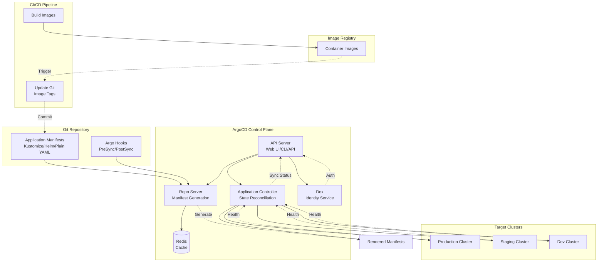

# TS-028: ArgoCD GitOps

## 1. Overview

Argo CD is a declarative, GitOps continuous delivery tool for Kubernetes. It follows the GitOps pattern of using Git repositories as the source of truth for defining the desired application state, automatically synchronizing the cluster state with the repository.

### 1.1 Core Capabilities

| Capability | Description | Implementation |
|------------|-------------|----------------|
| GitOps Deployment | Declarative app deployment from Git | Git repository as source |
| Multi-Cluster | Manage multiple K8s clusters | Cluster credentials |
| Auto-Sync | Automatic sync on Git changes | Webhooks/Polling |
| Sync Phases | Pre/post sync hooks | Resource hooks |
| App Health | Resource health assessment | Custom health checks |
| SSO/RBAC | Single sign-on and access control | OIDC/Dex |

### 1.2 Architecture Overview



---

## 2. Architecture Deep Dive

### 2.1 Application Controller

The Application Controller is the core component that continuously monitors running applications:

```go
// Application controller reconciliation loop
type ApplicationController struct {
    appClientset    appclientset.Interface
    appInformer     cache.SharedIndexInformer

    ksonnetAPM      ksonnet.Interface
    kubeClientset   kubernetes.Interface
    appStateManager AppStateManager

    repoClientset   apiclient.Clientset

    appRefreshQueue     workqueue.RateLimitingInterface
    appOperationQueue   workqueue.RateLimitingInterface

    namespace       string
}

// Main reconciliation loop
func (ctrl *ApplicationController) Run(ctx context.Context, statusProcessors int) {
    // Start informers
    go ctrl.appInformer.Run(ctx.Done())

    // Wait for cache sync
    if !cache.WaitForCacheSync(ctx.Done(), ctrl.appInformer.HasSynced) {
        return
    }

    // Start workers
    for i := 0; i < statusProcessors; i++ {
        go wait.Until(func() {
            for ctrl.processAppRefreshQueueItem() {
            }
        }, time.Second, ctx.Done())
    }

    // Start operation processors
    for i := 0; i < statusProcessors; i++ {
        go wait.Until(func() {
            for ctrl.processAppOperationQueueItem() {
            }
        }, time.Second, ctx.Done())
    }

    <-ctx.Done()
}

// Process app refresh request
func (ctrl *ApplicationController) processAppRefreshQueueItem() bool {
    key, shutdown := ctrl.appRefreshQueue.Get()
    if shutdown {
        return false
    }
    defer ctrl.appRefreshQueue.Done(key)

    // Get app from cache
    obj, exists, err := ctrl.appInformer.GetIndexer().GetByKey(key.(string))
    if err != nil {
        ctrl.appRefreshQueue.AddRateLimited(key)
        return true
    }
    if !exists {
        return true
    }

    app := obj.(*appv1.Application)

    // Refresh app state
    ctrl.refreshAppConditions(app)

    // Compare with desired state from Git
    comparisonResult, err := ctrl.appStateManager.CompareAppState(
        app,
        app.Spec.GetProject(),
        app.Spec.Source,
        app.Spec.Destination,
        app.Spec.SyncPolicy,
    )
    if err != nil {
        ctrl.setAppCondition(app, appv1.ApplicationCondition{
            Type:    appv1.ApplicationConditionComparisonError,
            Message: err.Error(),
        })
        return true
    }

    // Update app status
    app.Status.Sync.Status = comparisonResult.Status
    app.Status.Sync.ComparedTo = appv1.ComparedTo{
        Source:      app.Spec.Source,
        Destination: app.Spec.Destination,
    }
    app.Status.Sync.Revision = comparisonResult.Revision
    app.Status.Resources = comparisonResult.Resources

    // Auto-sync if enabled and out of sync
    if app.Spec.SyncPolicy != nil &&
       app.Spec.SyncPolicy.Automated != nil &&
       comparisonResult.Status != appv1.SyncStatusCodeSynced {
        if !app.Spec.SyncPolicy.Automated.Prune {
            // Check if only prune is needed
            hasPruneOnly := true
            for _, resource := range comparisonResult.Resources {
                if resource.Status != appv1.SyncStatusCodeOutOfSync ||
                   resource.RequiresPruning {
                    hasPruneOnly = false
                    break
                }
            }
            if hasPruneOnly {
                return true
            }
        }

        // Trigger sync
        ctrl.appOperationQueue.Add(key)
    }

    // Update CRD
    _, err = ctrl.appClientset.ArgoprojV1alpha1().Applications(app.Namespace).Update(
        context.Background(),
        app,
        metav1.UpdateOptions{},
    )
    if err != nil {
        ctrl.appRefreshQueue.AddRateLimited(key)
    }

    return true
}

// Sync application
func (ctrl *ApplicationController) syncApplication(app *appv1.Application, revision string, strategies ...SyncStrategy) error {
    // Get manifest for target revision
    manifestInfo, err := ctrl.repoClientset.GetManifests(context.Background(), &apiclient.ManifestRequest{
        Repo:        app.Spec.Source.RepoURL,
        Revision:    revision,
        Path:        app.Spec.Source.Path,
        AppLabelKey: common.LabelKeyAppInstance,
        AppName:     app.Name,
    })
    if err != nil {
        return err
    }

    // Apply manifests
    for _, manifest := range manifestInfo.Manifests {
        // Parse resource
        obj := &unstructured.Unstructured{}
        if err := yaml.Unmarshal([]byte(manifest), obj); err != nil {
            return err
        }

        // Apply to cluster
        if err := ctrl.kubectl.ApplyResource(
            context.Background(),
            app.Spec.Destination.Server,
            obj,
            app.Spec.Destination.Namespace,
            kubectl.ApplyOpts{
                Force:   strategies[0].Force,
                Validate: true,
            },
        ); err != nil {
            return err
        }
    }

    return nil
}
```

### 2.2 Repository Server

```go
// Repo server generates manifests from Git repositories
type RepoServer struct {
    cache       reposervercache.Cache
    gitClients  map[string]*git.Client
    helmCmd     helm.Cmd

    // Manifest generation timeout
    timeout     time.Duration
    parallelism int
}

// GenerateManifests generates Kubernetes manifests from a Git repository
func (s *RepoServer) GenerateManifests(ctx context.Context, req *apiclient.ManifestRequest) (*apiclient.ManifestResponse, error) {
    // Check cache
    cacheKey := generateCacheKey(req)
    if cached, ok := s.cache.GetManifests(cacheKey); ok {
        return cached, nil
    }

    // Clone or fetch repository
    gitClient, err := s.getGitClient(req.Repo)
    if err != nil {
        return nil, err
    }

    // Checkout revision
    if err := gitClient.Checkout(req.Revision); err != nil {
        return nil, err
    }

    repoPath := gitClient.Root()

    // Generate manifests based on tool type
    var manifests []string

    switch {
    case isHelmChart(repoPath, req.Path):
        manifests, err = s.generateHelmManifests(repoPath, req.Path, req.Helm)
    case isKustomize(repoPath, req.Path):
        manifests, err = s.generateKustomizeManifests(repoPath, req.Path, req.Kustomize)
    default:
        manifests, err = s.generatePlainManifests(repoPath, req.Path)
    }

    if err != nil {
        return nil, err
    }

    response := &apiclient.ManifestResponse{
        Manifests: manifests,
        Revision:  req.Revision,
    }

    // Cache result
    s.cache.SetManifests(cacheKey, response)

    return response, nil
}

// Generate Helm manifests
func (s *RepoServer) generateHelmManifests(repoPath, chartPath string, opts *v1alpha1.ApplicationSourceHelm) ([]string, error) {
    helmApp := &helmapplication.Application{
        ChartPath: filepath.Join(repoPath, chartPath),
    }

    // Set values
    if opts != nil {
        helmApp.ValueFiles = opts.ValueFiles
        helmApp.Values = opts.Values
        helmApp.Parameters = opts.Parameters
    }

    // Template chart
    out, err := s.helmCmd.Template(helmApp)
    if err != nil {
        return nil, fmt.Errorf("helm template failed: %w", err)
    }

    // Split into individual manifests
    return splitYAML(out), nil
}

// Generate Kustomize manifests
func (s *RepoServer) generateKustomizeManifests(repoPath, kustomizePath string, opts *v1alpha1.ApplicationSourceKustomize) ([]string, error) {
    kustomizeApp := &kustomizeapplication.Application{
        Path: filepath.Join(repoPath, kustomizePath),
    }

    if opts != nil {
        kustomizeApp.NamePrefix = opts.NamePrefix
        kustomizeApp.NameSuffix = opts.NameSuffix
        kustomizeApp.Images = opts.Images
    }

    // Build kustomization
    out, err := kustomizeApp.Build(nil)
    if err != nil {
        return nil, fmt.Errorf("kustomize build failed: %w", err)
    }

    return splitYAML(out), nil
}
```

### 2.3 Health Assessment

```go
// Health assessment for various resource types
type HealthCheck interface {
    GetResourceHealth(obj *unstructured.Unstructured) (*HealthStatus, error)
}

type HealthStatus struct {
    Status  HealthStatusCode
    Message string
}

type HealthStatusCode string

const (
    HealthStatusHealthy     HealthStatusCode = "Healthy"
    HealthStatusProgressing HealthStatusCode = "Progressing"
    HealthStatusDegraded    HealthStatusCode = "Degraded"
    HealthStatusSuspended   HealthStatusCode = "Suspended"
    HealthStatusMissing     HealthStatusCode = "Missing"
    HealthStatusUnknown     HealthStatusCode = "Unknown"
)

// Deployment health check
func getDeploymentHealth(obj *unstructured.Unstructured) (*HealthStatus, error) {
    deployment := &appsv1.Deployment{}
    if err := runtime.DefaultUnstructuredConverter.FromUnstructured(obj.Object, deployment); err != nil {
        return nil, err
    }

    // Check if paused
    if deployment.Spec.Paused {
        return &HealthStatus{
            Status:  HealthStatusSuspended,
            Message: "Deployment is paused",
        }, nil
    }

    // Get replica status
    desired := *deployment.Spec.Replicas
    replicas := deployment.Status.Replicas
    updated := deployment.Status.UpdatedReplicas
    available := deployment.Status.AvailableReplicas

    // Check progress
    if replicas < desired {
        return &HealthStatus{
            Status:  HealthStatusProgressing,
            Message: fmt.Sprintf("Waiting for rollout: %d out of %d new replicas", replicas, desired),
        }, nil
    }

    if updated < replicas {
        return &HealthStatus{
            Status:  HealthStatusProgressing,
            Message: fmt.Sprintf("Waiting for rollout: %d out of %d replicas updated", updated, replicas),
        }, nil
    }

    if available < replicas {
        return &HealthStatus{
            Status:  HealthStatusProgressing,
            Message: fmt.Sprintf("Waiting for rollout: %d out of %d replicas available", available, replicas),
        }, nil
    }

    // Check for degraded conditions
    for _, condition := range deployment.Status.Conditions {
        if condition.Type == appsv1.DeploymentReplicaFailure &&
           condition.Status == corev1.ConditionTrue {
            return &HealthStatus{
                Status:  HealthStatusDegraded,
                Message: condition.Message,
            }, nil
        }
    }

    return &HealthStatus{
        Status:  HealthStatusHealthy,
        Message: fmt.Sprintf("deployment successfully rolled out (%d replicas)", available),
    }, nil
}

// Pod health check
func getPodHealth(obj *unstructured.Unstructured) (*HealthStatus, error) {
    pod := &corev1.Pod{}
    if err := runtime.DefaultUnstructuredConverter.FromUnstructured(obj.Object, pod); err != nil {
        return nil, err
    }

    // Check phase
    switch pod.Status.Phase {
    case corev1.PodSucceeded:
        return &HealthStatus{
            Status:  HealthStatusHealthy,
            Message: "Pod completed successfully",
        }, nil

    case corev1.PodFailed:
        return &HealthStatus{
            Status:  HealthStatusDegraded,
            Message: getPodErrorMessage(pod),
        }, nil

    case corev1.PodPending:
        return &HealthStatus{
            Status:  HealthStatusProgressing,
            Message: getPodPendingReason(pod),
        }, nil

    case corev1.PodRunning:
        // Check container statuses
        for _, containerStatus := range pod.Status.ContainerStatuses {
            if !containerStatus.Ready {
                if containerStatus.State.Waiting != nil {
                    return &HealthStatus{
                        Status:  HealthStatusProgressing,
                        Message: fmt.Sprintf("Container %s is waiting: %s",
                            containerStatus.Name,
                            containerStatus.State.Waiting.Reason),
                    }, nil
                }
                if containerStatus.State.Terminated != nil &&
                   containerStatus.State.Terminated.ExitCode != 0 {
                    return &HealthStatus{
                        Status:  HealthStatusDegraded,
                        Message: fmt.Sprintf("Container %s terminated with error", containerStatus.Name),
                    }, nil
                }
            }
        }

        return &HealthStatus{
            Status:  HealthStatusHealthy,
            Message: "Pod is running and ready",
        }, nil
    }

    return &HealthStatus{Status: HealthStatusUnknown}, nil
}
```

---

## 3. Configuration Examples

### 3.1 Application CRD

```yaml
# Application definition
apiVersion: argoproj.io/v1alpha1
kind: Application
metadata:
  name: production-app
  namespace: argocd
  finalizers:
    - resources-finalizer.argocd.argoproj.io
  labels:
    environment: production
    team: platform
spec:
  project: production

  source:
    repoURL: https://github.com/company/gitops-repo.git
    targetRevision: main
    path: overlays/production

    # Helm specific
    helm:
      valueFiles:
        - values-production.yaml
      parameters:
        - name: replicaCount
          value: "5"
        - name: resources.limits.cpu
          value: "2000m"
        - name: resources.limits.memory
          value: "4Gi"
      values: |
        ingress:
          enabled: true
          hosts:
            - host: app.example.com
              paths:
                - path: /
                  pathType: Prefix

    # Kustomize specific
    kustomize:
      namePrefix: prod-
      nameSuffix: -v1
      images:
        - gcr.io/project/app:v1.2.3

  destination:
    server: https://kubernetes.default.svc
    namespace: production

  syncPolicy:
    # Automated sync
    automated:
      prune: true
      selfHeal: true
      allowEmpty: false

    # Sync options
    syncOptions:
      - CreateNamespace=true
      - PrunePropagationPolicy=foreground
      - PruneLast=true
      - RespectIgnoreDifferences=true
      - ApplyOutOfSyncOnly=true

    # Retry configuration
    retry:
      limit: 5
      backoff:
        duration: 5s
        factor: 2
        maxDuration: 3m

  # Ignore certain differences
  ignoreDifferences:
    - group: apps
      kind: Deployment
      jsonPointers:
        - /spec/replicas
    - group: ""
      kind: Secret
      managedFieldsManagers:
        - external-secrets

  # Revision history limit
  revisionHistoryLimit: 10
```

### 3.2 App of Apps Pattern

```yaml
# bootstrap/app-of-apps.yaml
apiVersion: argoproj.io/v1alpha1
kind: Application
metadata:
  name: app-of-apps
  namespace: argocd
spec:
  project: default
  source:
    repoURL: https://github.com/company/gitops-repo.git
    targetRevision: main
    path: apps
  destination:
    server: https://kubernetes.default.svc
    namespace: argocd
  syncPolicy:
    automated:
      prune: true
      selfHeal: true
---
# apps/namespace-apps.yaml
apiVersion: argoproj.io/v1alpha1
kind: Application
metadata:
  name: namespaces
  namespace: argocd
  annotations:
    argocd.argoproj.io/sync-wave: "-1"
spec:
  project: default
  source:
    repoURL: https://github.com/company/gitops-repo.git
    targetRevision: main
    path: infrastructure/namespaces
  destination:
    server: https://kubernetes.default.svc
  syncPolicy:
    automated:
      prune: true
      selfHeal: true
---
# apps/monitoring.yaml
apiVersion: argoproj.io/v1alpha1
kind: Application
metadata:
  name: monitoring
  namespace: argocd
  annotations:
    argocd.argoproj.io/sync-wave: "1"
spec:
  project: infrastructure
  source:
    repoURL: https://github.com/company/gitops-repo.git
    targetRevision: main
    path: infrastructure/monitoring
    helm:
      valueFiles:
        - values.yaml
  destination:
    server: https://kubernetes.default.svc
    namespace: monitoring
  syncPolicy:
    automated:
      prune: true
      selfHeal: true
    syncOptions:
      - CreateNamespace=true
```

### 3.3 ApplicationSet for Multi-Cluster

```yaml
apiVersion: argoproj.io/v1alpha1
kind: ApplicationSet
metadata:
  name: guestbook
  namespace: argocd
spec:
  generators:
    # Cluster generator
    - clusters:
        selector:
          matchLabels:
            argocd.argoproj.io/secret-type: cluster
        values:
          revision: HEAD
          path: applications/guestbook

    # List generator
    - list:
        elements:
          - cluster: engineering-dev
            url: https://kubernetes.default.svc
            path: applications/guestbook/overlays/dev
          - cluster: engineering-prod
            url: https://prod-cluster.example.com
            path: applications/guestbook/overlays/prod

    # Git generator
    - git:
        repoURL: https://github.com/company/tenants.git
        revision: HEAD
        directories:
          - path: tenants/*

  template:
    metadata:
      name: '{{path.basename}}-guestbook'
      labels:
        app.kubernetes.io/name: guestbook
        cluster: '{{name}}'
    spec:
      project: default
      source:
        repoURL: https://github.com/company/gitops-repo.git
        targetRevision: '{{values.revision}}'
        path: '{{values.path}}'
      destination:
        server: '{{server}}'
        namespace: guestbook
      syncPolicy:
        automated:
          prune: true
          selfHeal: true
        syncOptions:
          - CreateNamespace=true

  # Progressive sync
  strategy:
    type: RollingSync
    rollingSync:
      steps:
        - matchExpressions:
            - key: environment
              operator: In
              values:
                - dev
          maxUpdate: 100%
        - matchExpressions:
            - key: environment
              operator: In
              values:
                - staging
          maxUpdate: 50%
        - matchExpressions:
            - key: environment
              operator: In
              values:
                - production
          maxUpdate: 25%
```

### 3.4 Resource Hooks

```yaml
# Pre-sync job
apiVersion: batch/v1
kind: Job
metadata:
  name: database-migration
  annotations:
    argocd.argoproj.io/hook: PreSync
    argocd.argoproj.io/hook-delete-policy: BeforeHookCreation
spec:
  template:
    spec:
      containers:
        - name: migration
          image: myapp-migrations:latest
          command: ["migrate", "up"]
          env:
            - name: DATABASE_URL
              valueFrom:
                secretKeyRef:
                  name: db-credentials
                  key: url
      restartPolicy: Never
  backoffLimit: 2
---
# Post-sync job
apiVersion: batch/v1
kind: Job
metadata:
  name: smoke-tests
  annotations:
    argocd.argoproj.io/hook: PostSync
    argocd.argoproj.io/hook-delete-policy: HookSucceeded
spec:
  template:
    spec:
      containers:
        - name: tests
          image: myapp-tests:latest
          command: ["run-tests", "--smoke"]
          env:
            - name: APP_URL
              value: http://myapp.production.svc.cluster.local
      restartPolicy: Never
  backoffLimit: 0
---
# Sync wave for ordering
apiVersion: v1
kind: ConfigMap
metadata:
  name: app-config
  annotations:
    argocd.argoproj.io/sync-wave: "1"
data:
  config.json: '{"version": "1.0.0"}'
---
apiVersion: apps/v1
kind: Deployment
metadata:
  name: app
  annotations:
    argocd.argoproj.io/sync-wave: "2"
spec:
  replicas: 3
  selector:
    matchLabels:
      app: myapp
  template:
    metadata:
      labels:
        app: myapp
    spec:
      containers:
        - name: app
          image: myapp:latest
```

---

## 4. Go Client Integration

### 4.1 ArgoCD Go Client

```go
package argocd

import (
    "context"
    "fmt"

    "github.com/argoproj/argo-cd/v2/pkg/apiclient"
    "github.com/argoproj/argo-cd/v2/pkg/apiclient/application"
    "github.com/argoproj/argo-cd/v2/pkg/apiclient/cluster"
    "github.com/argoproj/argo-cd/v2/pkg/apiclient/project"
    "github.com/argoproj/argo-cd/v2/pkg/apis/application/v1alpha1"
    "k8s.io/apimachinery/pkg/watch"
)

// Client wraps ArgoCD API client
type Client struct {
    conn                apiclient.Client
    appClient           application.ApplicationServiceClient
    clusterClient       cluster.ClusterServiceClient
    projectClient       project.ProjectServiceClient
}

// NewClient creates ArgoCD client
func NewClient(server, authToken string, insecure bool) (*Client, error) {
    opts := apiclient.ClientOptions{
        ServerAddr: server,
        AuthToken:  authToken,
        Insecure:   insecure,
    }

    conn, appClient, err := apiclient.NewClient(&opts)
    if err != nil {
        return nil, fmt.Errorf("failed to create ArgoCD client: %w", err)
    }

    return &Client{
        conn:          conn,
        appClient:     appClient,
        clusterClient: cluster.NewClusterServiceClient(conn.(*grpc.ClientConn)),
        projectClient: project.NewProjectServiceClient(conn.(*grpc.ClientConn)),
    }, nil
}

// Close closes the client connection
func (c *Client) Close() error {
    return c.conn.Close()
}

// CreateApplication creates a new application
func (c *Client) CreateApplication(ctx context.Context, app *v1alpha1.Application) (*v1alpha1.Application, error) {
    resp, err := c.appClient.Create(ctx, &application.ApplicationCreateRequest{
        Application: app,
    })
    if err != nil {
        return nil, fmt.Errorf("failed to create application: %w", err)
    }
    return resp, nil
}

// GetApplication retrieves an application
func (c *Client) GetApplication(ctx context.Context, name string) (*v1alpha1.Application, error) {
    resp, err := c.appClient.Get(ctx, &application.ApplicationQuery{
        Name: &name,
    })
    if err != nil {
        return nil, fmt.Errorf("failed to get application: %w", err)
    }
    return resp, nil
}

// SyncApplication triggers a sync
func (c *Client) SyncApplication(ctx context.Context, name, revision string, prune, dryRun bool) (*v1alpha1.Application, error) {
    syncReq := &application.ApplicationSyncRequest{
        Name:     &name,
        Revision: &revision,
        Prune:    prune,
        DryRun:   dryRun,
        Strategy: &v1alpha1.SyncStrategy{
            Apply: &v1alpha1.SyncStrategyApply{
                Force: false,
            },
        },
    }

    resp, err := c.appClient.Sync(ctx, syncReq)
    if err != nil {
        return nil, fmt.Errorf("failed to sync application: %w", err)
    }
    return resp, nil
}

// WatchApplications watches for application changes
func (c *Client) WatchApplications(ctx context.Context, selector string) (<-chan *v1alpha1.ApplicationWatchEvent, error) {
    stream, err := c.appClient.Watch(ctx, &application.ApplicationQuery{
        Selector: &selector,
    })
    if err != nil {
        return nil, err
    }

    events := make(chan *v1alpha1.ApplicationWatchEvent)

    go func() {
        defer close(events)

        for {
            event, err := stream.Recv()
            if err != nil {
                return
            }

            select {
            case events <- event:
            case <-ctx.Done():
                return
            }
        }
    }()

    return events, nil
}

// WaitForSync waits for application to reach synced state
func (c *Client) WaitForSync(ctx context.Context, name string, timeout time.Duration) error {
    ctx, cancel := context.WithTimeout(ctx, timeout)
    defer cancel()

    events, err := c.WatchApplications(ctx, fmt.Sprintf("metadata.name=%s", name))
    if err != nil {
        return err
    }

    for {
        select {
        case event, ok := <-events:
            if !ok {
                return fmt.Errorf("watch closed")
            }

            app := event.Application
            if app.Status.Sync.Status == v1alpha1.SyncStatusCodeSynced {
                return nil
            }

            if app.Status.OperationState != nil &&
               app.Status.OperationState.Phase == v1alpha1.OperationFailed {
                return fmt.Errorf("sync failed: %s", app.Status.OperationState.Message)
            }

        case <-ctx.Done():
            return ctx.Err()
        }
    }
}

// DeleteApplication deletes an application
func (c *Client) DeleteApplication(ctx context.Context, name string, cascade bool) error {
    _, err := c.appClient.Delete(ctx, &application.ApplicationDeleteRequest{
        Name:    &name,
        Cascade: &cascade,
    })
    return err
}
```

### 4.2 Application Creation Helper

```go
package argocd

import (
    "github.com/argoproj/argo-cd/v2/pkg/apis/application/v1alpha1"
    metav1 "k8s.io/apimachinery/pkg/apis/meta/v1"
)

// ApplicationBuilder helps build Application CRDs
type ApplicationBuilder struct {
    app *v1alpha1.Application
}

// NewApplication creates a new application builder
func NewApplication(name, namespace string) *ApplicationBuilder {
    return &ApplicationBuilder{
        app: &v1alpha1.Application{
            TypeMeta: metav1.TypeMeta{
                APIVersion: "argoproj.io/v1alpha1",
                Kind:       "Application",
            },
            ObjectMeta: metav1.ObjectMeta{
                Name:      name,
                Namespace: namespace,
            },
            Spec: v1alpha1.ApplicationSpec{
                Source: &v1alpha1.ApplicationSource{},
                Destination: v1alpha1.ApplicationDestination{
                    Server:    "https://kubernetes.default.svc",
                    Namespace: "default",
                },
            },
        },
    }
}

// WithProject sets the project
func (b *ApplicationBuilder) WithProject(project string) *ApplicationBuilder {
    b.app.Spec.Project = project
    return b
}

// WithSource sets the source repository
func (b *ApplicationBuilder) WithSource(repoURL, targetRevision, path string) *ApplicationBuilder {
    b.app.Spec.Source.RepoURL = repoURL
    b.app.Spec.Source.TargetRevision = targetRevision
    b.app.Spec.Source.Path = path
    return b
}

// WithHelmValues sets Helm values
func (b *ApplicationBuilder) WithHelmValues(values string, valueFiles []string) *ApplicationBuilder {
    b.app.Spec.Source.Helm = &v1alpha1.ApplicationSourceHelm{
        Values:     values,
        ValueFiles: valueFiles,
    }
    return b
}

// WithKustomize sets Kustomize options
func (b *ApplicationBuilder) WithKustomize(namePrefix, nameSuffix string, images v1alpha1.KustomizeImages) *ApplicationBuilder {
    b.app.Spec.Source.Kustomize = &v1alpha1.ApplicationSourceKustomize{
        NamePrefix: namePrefix,
        NameSuffix: nameSuffix,
        Images:     images,
    }
    return b
}

// WithDestination sets the destination cluster and namespace
func (b *ApplicationBuilder) WithDestination(server, namespace string) *ApplicationBuilder {
    b.app.Spec.Destination.Server = server
    b.app.Spec.Destination.Namespace = namespace
    return b
}

// WithAutoSync enables automated sync
func (b *ApplicationBuilder) WithAutoSync(prune, selfHeal bool) *ApplicationBuilder {
    if b.app.Spec.SyncPolicy == nil {
        b.app.Spec.SyncPolicy = &v1alpha1.SyncPolicy{}
    }
    b.app.Spec.SyncPolicy.Automated = &v1alpha1.SyncPolicyAutomated{
        Prune:    prune,
        SelfHeal: selfHeal,
    }
    return b
}

// WithSyncOptions sets sync options
func (b *ApplicationBuilder) WithSyncOptions(options ...string) *ApplicationBuilder {
    if b.app.Spec.SyncPolicy == nil {
        b.app.Spec.SyncPolicy = &v1alpha1.SyncPolicy{}
    }
    b.app.Spec.SyncPolicy.SyncOptions = options
    return b
}

// WithRetry enables retry configuration
func (b *ApplicationBuilder) WithRetry(limit int, duration, maxDuration string) *ApplicationBuilder {
    if b.app.Spec.SyncPolicy == nil {
        b.app.Spec.SyncPolicy = &v1alpha1.SyncPolicy{}
    }
    b.app.Spec.SyncPolicy.Retry = &v1alpha1.RetryStrategy{
        Limit: limit,
        Backoff: &v1alpha1.Backoff{
            Duration:    duration,
            Factor:      2,
            MaxDuration: maxDuration,
        },
    }
    return b
}

// WithFinalizer adds a finalizer
func (b *ApplicationBuilder) WithFinalizer(finalizer string) *ApplicationBuilder {
    b.app.Finalizers = append(b.app.Finalizers, finalizer)
    return b
}

// WithLabel adds a label
func (b *ApplicationBuilder) WithLabel(key, value string) *ApplicationBuilder {
    if b.app.Labels == nil {
        b.app.Labels = make(map[string]string)
    }
    b.app.Labels[key] = value
    return b
}

// Build returns the constructed Application
func (b *ApplicationBuilder) Build() *v1alpha1.Application {
    return b.app
}
```

---

## 5. Performance Tuning

### 5.1 Controller Tuning

```yaml
apiVersion: apps/v1
kind: Deployment
metadata:
  name: argocd-application-controller
  namespace: argocd
spec:
  template:
    spec:
      containers:
        - name: argocd-application-controller
          args:
            - /usr/local/bin/argocd-application-controller
            # Increase parallelism
            - --repo-server-timeout-seconds
            - "180"
            # Status processors
            - --status-processors
            - "20"
            # Operation processors
            - --operation-processors
            - "10"
            # GRPC max message size
            - --grpc-max-message-size
            - "209715200"  # 200MB
            # Application resync period
            - --app-resync
            - "300"  # 5 minutes
          resources:
            requests:
              memory: "512Mi"
              cpu: "500m"
            limits:
              memory: "4Gi"
              cpu: "2000m"
```

### 5.2 Redis Tuning

```yaml
apiVersion: apps/v1
kind: Deployment
metadata:
  name: argocd-redis
  namespace: argocd
spec:
  template:
    spec:
      containers:
        - name: redis
          args:
            - --save
            - ""
            - --appendonly
            - "no"
            - --maxmemory
            - "2gb"
            - --maxmemory-policy
            - "allkeys-lru"
```

---

## 6. Production Deployment Patterns

### 6.1 Progressive Delivery with Argo Rollouts

```yaml
apiVersion: argoproj.io/v1alpha1
kind: Rollout
metadata:
  name: myapp
spec:
  replicas: 5
  strategy:
    canary:
      canaryService: myapp-canary
      stableService: myapp-stable
      trafficRouting:
        nginx:
          stableIngress: myapp-ingress
          annotationPrefix: nginx.ingress.kubernetes.io
      steps:
        - setWeight: 10
        - pause: {duration: 2m}
        - analysis:
            templates:
              - templateName: success-rate
        - setWeight: 25
        - pause: {duration: 2m}
        - setWeight: 50
        - pause: {duration: 2m}
        - analysis:
            templates:
              - templateName: success-rate
            args:
              - name: service-name
                value: myapp-canary
        - setWeight: 75
        - pause: {duration: 2m}
        - setWeight: 100
  selector:
    matchLabels:
      app: myapp
  template:
    metadata:
      labels:
        app: myapp
    spec:
      containers:
        - name: myapp
          image: myapp:v2
---
apiVersion: argoproj.io/v1alpha1
kind: AnalysisTemplate
metadata:
  name: success-rate
spec:
  args:
    - name: service-name
  metrics:
    - name: success-rate
      interval: 1m
      count: 3
      successCondition: result[0] >= 0.95
      provider:
        prometheus:
          address: http://prometheus:9090
          query: |
            sum(rate(http_requests_total{service="{{args.service-name}}",status=~"2.."}[5m]))
            /
            sum(rate(http_requests_total{service="{{args.service-name}}"}[5m]))
```

---

## 7. Comparison with Alternatives

| Feature | ArgoCD | Flux | Spinnaker | Jenkins X |
|---------|--------|------|-----------|-----------|
| GitOps Native | Yes | Yes | No | Yes |
| UI | Excellent | CLI only | Good | Limited |
| Multi-Cluster | Yes | Yes | Yes | Yes |
| Progressive Delivery | Yes (Rollouts) | Yes (Flagger) | Yes | Yes |
| Helm Support | Native | Native | Yes | Yes |
| Kustomize Support | Native | Native | Yes | Yes |
| Notification | Yes | Yes | Yes | Limited |
| RBAC | Granular | Kubernetes RBAC | Granular | Kubernetes RBAC |
| Learning Curve | Medium | Low | High | Medium |

---

## 8. References

1. [ArgoCD Documentation](https://argo-cd.readthedocs.io/)
2. [ArgoCD GitHub](https://github.com/argoproj/argo-cd)
3. [GitOps Guide](https://www.gitops.tech/)
4. [Argo Rollouts](https://argoproj.github.io/argo-rollouts/)
5. [ArgoCD Operator](https://operatorhub.io/operator/argocd-operator)
