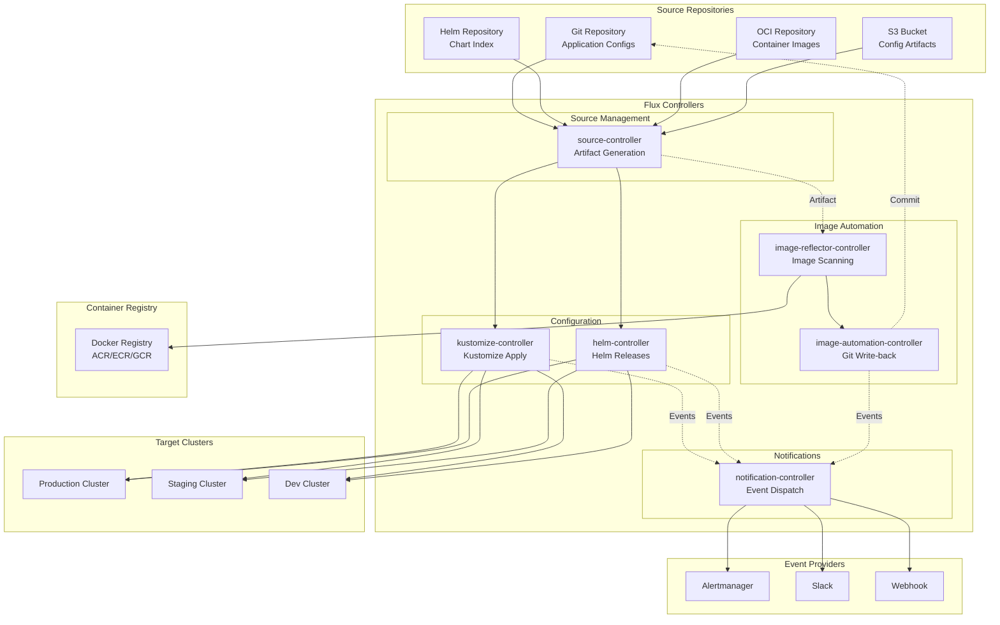

# TS-029: Flux CD GitOps

## 1. Overview

Flux CD is a set of continuous and progressive delivery solutions for Kubernetes that are open and extensible. It is a CNCF incubating project that implements GitOps principles to manage infrastructure and application configurations declaratively.

### 1.1 Core Capabilities

| Capability | Description | Controller |
|------------|-------------|------------|
| Source Management | Git/Helm/OCI repository sync | source-controller |
| Kustomize | Native Kustomize support | kustomize-controller |
| Helm | Helm chart and release management | helm-controller |
| Image Automation | Image scanning and update | image-{reflector,automation}-controller |
| Notifications | Event-based notifications | notification-controller |
| Multi-tenancy | RBAC-based multi-tenancy | All controllers |

### 1.2 Architecture Overview



---

## 2. Architecture Deep Dive

### 2.1 Source Controller

The Source Controller manages artifact acquisition from various sources:

```go
// Source controller reconciliation loop
package controllers

import (
    "context"
    "fmt"
    "time"

    sourcev1 "github.com/fluxcd/source-controller/api/v1"
    "github.com/fluxcd/pkg/runtime/conditions"
    "github.com/go-git/go-git/v5"
    "github.com/go-git/go-git/v5/plumbing/object"
    metav1 "k8s.io/apimachinery/pkg/apis/meta/v1"
    "sigs.k8s.io/controller-runtime/pkg/client"
)

// GitRepositoryReconciler reconciles a GitRepository object
type GitRepositoryReconciler struct {
    client.Client
    Storage        *Storage
    GitReader      git.Reader

    // Requeue interval
    RequeueInterval time.Duration
}

// Reconcile implements the reconciliation loop
func (r *GitRepositoryReconciler) Reconcile(ctx context.Context, req ctrl.Request) (ctrl.Result, error) {
    // Fetch the GitRepository
    repository := &sourcev1.GitRepository{}
    if err := r.Get(ctx, req.NamespacedName, repository); err != nil {
        return ctrl.Result{}, client.IgnoreNotFound(err)
    }

    // Add finalizer
    if !controllerutil.ContainsFinalizer(repository, sourcev1.SourceFinalizer) {
        controllerutil.AddFinalizer(repository, sourcev1.SourceFinalizer)
        if err := r.Update(ctx, repository); err != nil {
            return ctrl.Result{}, err
        }
        return ctrl.Result{Requeue: true}, nil
    }

    // Check if object is being deleted
    if !repository.ObjectMeta.DeletionTimestamp.IsZero() {
        return r.reconcileDelete(ctx, repository)
    }

    // Reconcile source
    return r.reconcileSource(ctx, repository)
}

func (r *GitRepositoryReconciler) reconcileSource(ctx context.Context, repository *sourcev1.GitRepository) (ctrl.Result, error) {
    reconcileStart := time.Now()

    // Set reconciling condition
    conditions.MarkReconciling(repository, meta.ReconcilingReason, "Cloning repository")

    // Build checkout options
    checkoutOpts := &git.CheckoutOptions{
        URL:      repository.Spec.URL,
        Ref:      repository.Spec.Reference,
        Auth:     r.buildAuth(repository),
        RecurseSubmodules: repository.Spec.RecurseSubmodules,
    }

    // Clone or fetch repository
    commit, err := r.GitReader.CloneOrFetch(ctx, checkoutOpts)
    if err != nil {
        conditions.MarkFalse(repository, sourcev1.SourceConditionReady, sourcev1.GitOperationFailedReason, err.Error())
        return ctrl.Result{RequeueAfter: r.RequeueInterval}, err
    }

    // Check if we already have this revision
    artifact := r.Storage.NewArtifactFor(repository.Kind, repository, commit.Hash, commit.Message)

    hasNewRevision := !r.Storage.ArtifactExist(artifact)

    if hasNewRevision {
        // Archive repository
        if err := r.Storage.Archive(artifact, r.GitReader.Path(), nil); err != nil {
            conditions.MarkFalse(repository, sourcev1.SourceConditionReady, sourcev1.ArchiveOperationFailedReason, err.Error())
            return ctrl.Result{RequeueAfter: r.RequeueInterval}, err
        }

        // Update status with artifact
        repository.Status.Artifact = artifact
    }

    // Update status
    repository.Status.LastUpdateTime = &metav1.Time{Time: reconcileStart}
    repository.Status.ObservedInclude = repository.Spec.Include
    repository.Status.ObservedRecurseSubmodules = repository.Spec.RecurseSubmodules

    conditions.MarkTrue(repository, sourcev1.SourceConditionReady, meta.SucceededReason, "Stored artifact")

    return ctrl.Result{RequeueAfter: repository.Spec.Interval.Duration}, nil
}

func (r *GitRepositoryReconciler) reconcileDelete(ctx context.Context, repository *sourcev1.GitRepository) (ctrl.Result, error) {
    // Garbage collect artifacts
    if err := r.Storage.RemoveAll(r.Storage.NewArtifactFor(repository.Kind, repository, "", "")); err != nil {
        return ctrl.Result{}, err
    }

    // Remove finalizer
    controllerutil.RemoveFinalizer(repository, sourcev1.SourceFinalizer)
    if err := r.Update(ctx, repository); err != nil {
        return ctrl.Result{}, err
    }

    return ctrl.Result{}, nil
}
```

### 2.2 Kustomize Controller

```go
// Kustomize controller applies Kustomize configurations
package controllers

import (
    "context"
    "fmt"

    kustomizev1 "github.com/fluxcd/kustomize-controller/api/v1"
    "github.com/fluxcd/pkg/runtime/predicates"
    "k8s.io/apimachinery/pkg/runtime"
    "sigs.k8s.io/controller-runtime/pkg/client"
    "sigs.k8s.io/kustomize/api/krusty"
    "sigs.k8s.io/kustomize/kyaml/filesys"
)

// KustomizationReconciler reconciles a Kustomization object
type KustomizationReconciler struct {
    client.Client
    Scheme *runtime.Scheme

    KubeConfig secrets.KubeConfig

    // HTTP client for fetching artifacts
    HTTPGetter http.Getter
}

// Reconcile implements the reconciliation loop
func (r *KustomizationReconciler) Reconcile(ctx context.Context, req ctrl.Request) (ctrl.Result, error) {
    kustomization := &kustomizev1.Kustomization{}
    if err := r.Get(ctx, req.NamespacedName, kustomization); err != nil {
        return ctrl.Result{}, client.IgnoreNotFound(err)
    }

    // Reconcile
    return r.reconcile(ctx, kustomization)
}

func (r *KustomizationReconciler) reconcile(ctx context.Context, kustomization *kustomizev1.Kustomization) (ctrl.Result, error) {
    reconcileStart := time.Now()

    // Set reconciling condition
    conditions.MarkReconciling(kustomization, meta.ReconcilingReason, "Reconciling Kustomization")

    // Get source reference
    source, err := r.getSource(ctx, kustomization)
    if err != nil {
        conditions.MarkFalse(kustomization, kustomizev1.ReadyCondition, kustomizev1.ArtifactFailedReason, err.Error())
        return ctrl.Result{RequeueAfter: kustomization.Spec.Interval.Duration}, err
    }

    // Check if source is ready
    if !conditions.IsReady(source) {
        msg := fmt.Sprintf("Source '%s' is not ready", kustomization.Spec.SourceRef.Name)
        conditions.MarkFalse(kustomization, kustomizev1.ReadyCondition, kustomizev1.ArtifactFailedReason, msg)
        return ctrl.Result{RequeueAfter: kustomization.Spec.Interval.Duration}, fmt.Errorf(msg)
    }

    // Check dependencies
    if len(kustomization.Spec.DependsOn) > 0 {
        if err := r.checkDependencies(kustomization); err != nil {
            conditions.MarkFalse(kustomization, kustomizev1.ReadyCondition, kustomizev1.DependencyNotReadyReason, err.Error())
            return ctrl.Result{RequeueAfter: kustomization.Spec.Interval.Duration}, err
        }
    }

    // Download artifact
    artifact := source.GetArtifact()
    tmpDir, err := r.download(artifact)
    if err != nil {
        conditions.MarkFalse(kustomization, kustomizev1.ReadyCondition, kustomizev1.ArtifactFailedReason, err.Error())
        return ctrl.Result{RequeueAfter: kustomization.Spec.Interval.Duration}, err
    }
    defer os.RemoveAll(tmpDir)

    // Build Kustomization
    resources, err := r.build(tmpDir, kustomization.Spec.Path)
    if err != nil {
        conditions.MarkFalse(kustomization, kustomizev1.ReadyCondition, kustomizev1.BuildFailedReason, err.Error())
        return ctrl.Result{RequeueAfter: kustomization.Spec.Interval.Duration}, err
    }

    // Apply resources
    drifted, err := r.apply(ctx, kustomization, resources)
    if err != nil {
        conditions.MarkFalse(kustomization, kustomizev1.ReadyCondition, kustomizev1.ReconciliationFailedReason, err.Error())
        return ctrl.Result{RequeueAfter: kustomization.Spec.Interval.Duration}, err
    }

    // Update status
    kustomization.Status.LastAppliedRevision = artifact.Revision
    kustomization.Status.LastAttemptedRevision = artifact.Revision
    kustomization.Status.LastAppliedAt = &metav1.Time{Time: reconcileStart}

    if drifted {
        conditions.MarkReconciling(kustomization, kustomizev1.ProgressingReason, "Detected drift")
    } else {
        conditions.MarkTrue(kustomization, kustomizev1.ReadyCondition, meta.SucceededReason, "Applied revision: "+artifact.Revision)
    }

    return ctrl.Result{RequeueAfter: kustomization.Spec.Interval.Duration}, nil
}

func (r *KustomizationReconciler) build(root, path string) (string, error) {
    fs := filesys.MakeFsOnDisk()

    k := krusty.MakeKustomizer(krusty.MakeDefaultOptions())

    resMap, err := k.Run(fs, filepath.Join(root, path))
    if err != nil {
        return "", err
    }

    yaml, err := resMap.AsYaml()
    if err != nil {
        return "", err
    }

    return string(yaml), nil
}

func (r *KustomizationReconciler) apply(ctx context.Context, kustomization *kustomizev1.Kustomization, resources string) (bool, error) {
    // Create sandboxed impersonation client
    kubeClient, err := r.getKubeClient(kustomization)
    if err != nil {
        return false, err
    }

    // Server-side apply with field manager
    objs, err := ssa.ReadObjects(strings.NewReader(resources))
    if err != nil {
        return false, err
    }

    // Sort resources by kind and name
    sort.Sort(ssa.SortableUnstructureds(objs))

    // Apply resources
    changeSet := ssa.NewChangeSet()
    for _, object := range objs {
        // Add labels/annotations
        ssa.SetNativeKindsDefaults([]*unstructured.Unstructured{object})

        if err := ssa.SetLastAppliedConfig(object, object); err != nil {
            return false, err
        }

        // Server-side apply
        changeSetEntry, err := r.resourceManager.Apply(ctx, object, ssa.ApplyOptions{
            Force: kustomization.Spec.Force,
            FieldManager: kustomization.Name,
        })
        if err != nil {
            return false, err
        }

        if changeSetEntry != nil {
            changeSet.Add(*changeSetEntry)
        }
    }

    // Prune if enabled
    if kustomization.Spec.Prune {
        err := r.prune(ctx, kustomization, kubeClient, changeSet)
        if err != nil {
            return false, err
        }
    }

    return len(changeSet.Entries) > 0, nil
}
```

### 2.3 Image Automation

```go
// Image reflector controller scans registries
type ImageRepositoryReconciler struct {
    client.Client
    Database   *Database
    Expiries   *ExpiringCache
}

func (r *ImageRepositoryReconciler) Reconcile(ctx context.Context, req ctrl.Request) (ctrl.Result, error) {
    imageRepo := &imagev1.ImageRepository{}
    if err := r.Get(ctx, req.NamespacedName, imageRepo); err != nil {
        return ctrl.Result{}, client.IgnoreNotFound(err)
    }

    // Parse image URL
    ref, err := name.ParseReference(imageRepo.Spec.Image)
    if err != nil {
        return ctrl.Result{}, err
    }

    // Get authentication
    auth, err := r.getAuth(ctx, imageRepo)
    if err != nil {
        return ctrl.Result{}, err
    }

    // Scan registry for tags
    tags, err := r.scanTags(ref, auth)
    if err != nil {
        return ctrl.Result{}, err
    }

    // Filter tags based on policy
    filteredTags := r.filterTags(tags, imageRepo.Spec.Policy)

    // Sort by policy
    sortedTags := r.sortTags(filteredTags, imageRepo.Spec.Policy)

    // Update status with latest tag
    if len(sortedTags) > 0 {
        latestTag := sortedTags[0]
        imageRepo.Status.LastScanResult = &imagev1.ScanResult{
            LatestTags: sortedTags[:min(10, len(sortedTags))],
            ScanTime:   metav1.Now(),
        }

        // Store in database for image policy
        r.Database.Store(imageRepo.Spec.Image, latestTag)
    }

    return ctrl.Result{RequeueAfter: imageRepo.Spec.Interval.Duration}, nil
}

// Image automation controller updates Git
type ImageUpdateAutomationReconciler struct {
    client.Client
    GitWriter git.Writer
}

func (r *ImageUpdateAutomationReconciler) Reconcile(ctx context.Context, req ctrl.Request) (ctrl.Result, error) {
    auto := &imagev1.ImageUpdateAutomation{}
    if err := r.Get(ctx, req.NamespacedName, auto); err != nil {
        return ctrl.Result{}, client.IgnoreNotFound(err)
    }

    // Get source
    gitRepo := &sourcev1.GitRepository{}
    if err := r.Get(ctx, types.NamespacedName{
        Name:      auto.Spec.SourceRef.Name,
        Namespace: auto.Namespace,
    }, gitRepo); err != nil {
        return ctrl.Result{}, err
    }

    // Clone repository
    repo, err := r.GitWriter.Clone(gitRepo.Spec.URL, git.Spec.Reference)
    if err != nil {
        return ctrl.Result{}, err
    }

    // Get image policies
    policies := &imagev1.ImagePolicyList{}
    if err := r.List(ctx, policies, client.InNamespace(auto.Namespace)); err != nil {
        return ctrl.Result{}, err
    }

    // Update files based on policies
    changes := false
    for _, policy := range policies.Items {
        if policy.Status.LatestImage == "" {
            continue
        }

        // Find and update markers in files
        updated, err := r.updateMarkers(repo, policy.Spec.Policy, policy.Status.LatestImage)
        if err != nil {
            return ctrl.Result{}, err
        }

        if updated {
            changes = true
        }
    }

    // Commit and push if there are changes
    if changes {
        commitMsg := auto.Spec.Commit.MessageTemplate
        if commitMsg == "" {
            commitMsg = "Update images"
        }

        if err := repo.Commit(commitMsg, auto.Spec.Commit.SigningKey); err != nil {
            return ctrl.Result{}, err
        }

        if err := repo.Push(); err != nil {
            return ctrl.Result{}, err
        }
    }

    return ctrl.Result{RequeueAfter: auto.Spec.Interval.Duration}, nil
}
```

---

## 3. Configuration Examples

### 3.1 Flux Installation

```bash
# Install Flux CLI
curl -s https://fluxcd.io/install.sh | sudo bash

# Bootstrap Flux on a cluster
flux bootstrap github \
  --owner=company \
  --repository=gitops-repo \
  --branch=main \
  --path=clusters/production \
  --personal

# Bootstrap with GitLab
flux bootstrap gitlab \
  --owner=company \
  --repository=gitops-repo \
  --branch=main \
  --path=clusters/production

# Bootstrap with generic Git
flux bootstrap git \
  --url=ssh://git@github.com/company/gitops-repo \
  --branch=main \
  --path=clusters/production \
  --ssh-key-algorithm=ed25519
```

### 3.2 Source Resources

```yaml
# GitRepository
apiVersion: source.toolkit.fluxcd.io/v1
kind: GitRepository
metadata:
  name: podinfo
  namespace: flux-system
spec:
  interval: 1m0s
  url: https://github.com/stefanprodan/podinfo
  ref:
    branch: master
  ignore: |
    # exclude all
    /*
    # include deploy dir
    !/deploy
---
# HelmRepository
apiVersion: source.toolkit.fluxcd.io/v1beta2
kind: HelmRepository
metadata:
  name: bitnami
  namespace: flux-system
spec:
  interval: 1h
  url: https://charts.bitnami.com/bitnami
---
# OCIRepository
apiVersion: source.toolkit.fluxcd.io/v1beta2
kind: OCIRepository
metadata:
  name: podinfo
  namespace: flux-system
spec:
  interval: 5m
  url: oci://ghcr.io/stefanprodan/manifests/podinfo
  ref:
    semver: ">=6.0.0"
  verify:
    provider: cosign
---
# Bucket (S3)
apiVersion: source.toolkit.fluxcd.io/v1beta2
kind: Bucket
metadata:
  name: my-bucket
  namespace: flux-system
spec:
  interval: 5m
  bucketName: my-configs
  endpoint: s3.amazonaws.com
  region: us-east-1
  provider: aws
  secretRef:
    name: aws-credentials
```

### 3.3 Kustomization

```yaml
apiVersion: kustomize.toolkit.fluxcd.io/v1
kind: Kustomization
metadata:
  name: infrastructure
  namespace: flux-system
spec:
  interval: 10m
  path: ./infrastructure/overlays/production
  prune: true
  sourceRef:
    kind: GitRepository
    name: flux-system
  healthChecks:
    - apiVersion: apps/v1
      kind: Deployment
      name: cert-manager
      namespace: cert-manager
    - apiVersion: apps/v1
      kind: Deployment
      name: cert-manager-webhook
      namespace: cert-manager
  timeout: 2m
  dependsOn:
    - name: namespaces
---
apiVersion: kustomize.toolkit.fluxcd.io/v1
kind: Kustomization
metadata:
  name: apps
  namespace: flux-system
spec:
  interval: 5m
  path: ./apps/production
  prune: true
  sourceRef:
    kind: GitRepository
    name: flux-system
  dependsOn:
    - name: infrastructure
  decryption:
    provider: sops
    secretRef:
      name: sops-gpg
  postBuild:
    substitute:
      cluster_name: production
      cluster_region: us-east-1
    substituteFrom:
      - kind: ConfigMap
        name: cluster-vars
      - kind: Secret
        name: cluster-secrets
```

### 3.4 Helm Release

```yaml
apiVersion: helm.toolkit.fluxcd.io/v2beta1
kind: HelmRelease
metadata:
  name: nginx-ingress
  namespace: nginx
spec:
  interval: 5m
  chart:
    spec:
      chart: nginx-ingress-controller
      version: "9.x"
      sourceRef:
        kind: HelmRepository
        name: bitnami
        namespace: flux-system
      interval: 1m
  install:
    remediation:
      retries: 3
  upgrade:
    remediation:
      retries: 3
      remediateLastFailure: true
    cleanupOnFail: true
  test:
    enable: true
  rollback:
    timeout: 5m
    recreate: true
  values:
    replicaCount: 2
    service:
      type: LoadBalancer
      annotations:
        service.beta.kubernetes.io/aws-load-balancer-type: "nlb"
    resources:
      requests:
        cpu: 100m
        memory: 128Mi
      limits:
        cpu: 500m
        memory: 512Mi
---
# HelmRelease with values from ConfigMap/Secret
apiVersion: helm.toolkit.fluxcd.io/v2beta1
kind: HelmRelease
metadata:
  name: myapp
  namespace: default
spec:
  interval: 5m
  chart:
    spec:
      chart: myapp
      sourceRef:
        kind: HelmRepository
        name: myrepo
  valuesFrom:
    - kind: ConfigMap
      name: myapp-values
      valuesKey: values-production.yaml
    - kind: Secret
      name: myapp-secrets
      targetPath: database.password
  values:
    replicaCount: 3
```

### 3.5 Image Automation

```yaml
# ImageRepository - scan registry
apiVersion: image.toolkit.fluxcd.io/v1beta2
kind: ImageRepository
metadata:
  name: podinfo
  namespace: flux-system
spec:
  image: ghcr.io/stefanprodan/podinfo
  interval: 5m
  secretRef:
    name: ghcr-auth
---
# ImagePolicy - define update policy
apiVersion: image.toolkit.fluxcd.io/v1beta2
kind: ImagePolicy
metadata:
  name: podinfo
  namespace: flux-system
spec:
  imageRepositoryRef:
    name: podinfo
  policy:
    semver:
      range: ">=6.0.0 <7.0.0"
  filterTags:
    pattern: '^v(?P<version>.*)$'
    extract: '$version'
---
# ImageUpdateAutomation - write back to Git
apiVersion: image.toolkit.fluxcd.io/v1beta1
kind: ImageUpdateAutomation
metadata:
  name: flux-system
  namespace: flux-system
spec:
  interval: 1m
  sourceRef:
    kind: GitRepository
    name: flux-system
  git:
    checkout:
      ref:
        branch: main
    commit:
      author:
        name: Flux Bot
        email: flux@example.com
      messageTemplate: |
        Automated image update

        Images:
        {{ range .Updated.Images -}}
        - {{.}}
        {{ end }}
      signingKey:
        secretRef:
          name: flux-gpg-signing-key
    push:
      branch: main
  policy:
    alphabetical:
      order: asc
```

### 3.6 Notifications

```yaml
# Provider configuration
apiVersion: notification.toolkit.fluxcd.io/v1beta3
kind: Provider
metadata:
  name: slack
  namespace: flux-system
spec:
  type: slack
  channel: deployments
  secretRef:
    name: slack-webhook-url
---
# Alert configuration
apiVersion: notification.toolkit.fluxcd.io/v1beta3
kind: Alert
metadata:
  name: on-call-webapp
  namespace: flux-system
spec:
  summary: "Webapp cluster"  # Custom summary
  providerRef:
    name: slack
  eventSeverity: info
  eventSources:
    - kind: GitRepository
      name: '*'
    - kind: Kustomization
      name: webapp-frontend
    - kind: Kustomization
      name: webapp-backend
  exclusionList:
    - "Succeeded"  # Exclude success messages
  suspend: false
```

---

## 4. Go Client Integration

### 4.1 Flux Go Client

```go
package flux

import (
    "context"
    "fmt"

    kustomizev1 "github.com/fluxcd/kustomize-controller/api/v1"
    sourcev1 "github.com/fluxcd/source-controller/api/v1"
    helmv2 "github.com/fluxcd/helm-controller/api/v2beta1"
    imagev1 "github.com/fluxcd/image-automation-controller/api/v1beta1"
    "github.com/fluxcd/pkg/apis/meta"
    "sigs.k8s.io/controller-runtime/pkg/client"
    "k8s.io/client-go/tools/clientcmd"
)

// Client wraps Flux operations
type Client struct {
    client client.Client
}

// NewClient creates Flux client
func NewClient(kubeconfig string) (*Client, error) {
    config, err := clientcmd.BuildConfigFromFlags("", kubeconfig)
    if err != nil {
        return nil, err
    }

    scheme := runtime.NewScheme()
    _ = sourcev1.AddToScheme(scheme)
    _ = kustomizev1.AddToScheme(scheme)
    _ = helmv2.AddToScheme(scheme)
    _ = imagev1.AddToScheme(scheme)

    c, err := client.New(config, client.Options{Scheme: scheme})
    if err != nil {
        return nil, err
    }

    return &Client{client: c}, nil
}

// CreateGitRepository creates a GitRepository
func (c *Client) CreateGitRepository(ctx context.Context, name, namespace, url, branch string, interval time.Duration) error {
    repo := &sourcev1.GitRepository{
        ObjectMeta: metav1.ObjectMeta{
            Name:      name,
            Namespace: namespace,
        },
        Spec: sourcev1.GitRepositorySpec{
            URL: url,
            Interval: metav1.Duration{Duration: interval},
            Reference: &sourcev1.GitRepositoryRef{
                Branch: branch,
            },
        },
    }

    return c.client.Create(ctx, repo)
}

// CreateKustomization creates a Kustomization
func (c *Client) CreateKustomization(ctx context.Context, name, namespace, path, sourceName string, interval time.Duration) error {
    kustomization := &kustomizev1.Kustomization{
        ObjectMeta: metav1.ObjectMeta{
            Name:      name,
            Namespace: namespace,
        },
        Spec: kustomizev1.KustomizationSpec{
            Interval: metav1.Duration{Duration: interval},
            Path:     path,
            Prune:    true,
            SourceRef: kustomizev1.CrossNamespaceSourceReference{
                Kind: sourcev1.GitRepositoryKind,
                Name: sourceName,
            },
        },
    }

    return c.client.Create(ctx, kustomization)
}

// GetKustomizationStatus returns Kustomization status
func (c *Client) GetKustomizationStatus(ctx context.Context, name, namespace string) (string, error) {
    kustomization := &kustomizev1.Kustomization{}
    if err := c.client.Get(ctx, types.NamespacedName{Name: name, Namespace: namespace}, kustomization); err != nil {
        return "", err
    }

    if conditions.IsReady(kustomization) {
        return "Ready", nil
    }

    for _, condition := range kustomization.Status.Conditions {
        if condition.Status == metav1.ConditionFalse {
            return fmt.Sprintf("NotReady: %s", condition.Message), nil
        }
    }

    return "Unknown", nil
}

// SuspendKustomization suspends/resumes a Kustomization
func (c *Client) SuspendKustomization(ctx context.Context, name, namespace string, suspend bool) error {
    kustomization := &kustomizev1.Kustomization{}
    if err := c.client.Get(ctx, types.NamespacedName{Name: name, Namespace: namespace}, kustomization); err != nil {
        return err
    }

    kustomization.Spec.Suspend = suspend
    return c.client.Update(ctx, kustomization)
}

// ForceReconcile triggers immediate reconciliation
func (c *Client) ForceReconcile(ctx context.Context, name, namespace string) error {
    kustomization := &kustomizev1.Kustomization{}
    if err := c.client.Get(ctx, types.NamespacedName{Name: name, Namespace: namespace}, kustomization); err != nil {
        return err
    }

    // Set reconcile annotation to force reconciliation
    if kustomization.Annotations == nil {
        kustomization.Annotations = make(map[string]string)
    }
    kustomization.Annotations[meta.ReconcileRequestAnnotation] = time.Now().Format(time.RFC3339Nano)

    return c.client.Update(ctx, kustomization)
}

// ListKustomizations lists all Kustomizations
func (c *Client) ListKustomizations(ctx context.Context, namespace string) (*kustomizev1.KustomizationList, error) {
    list := &kustomizev1.KustomizationList{}
    err := c.client.List(ctx, list, client.InNamespace(namespace))
    return list, err
}
```

### 4.2 Reconciliation Watcher

```go
package flux

import (
    "context"

    kustomizev1 "github.com/fluxcd/kustomize-controller/api/v1"
    "sigs.k8s.io/controller-runtime/pkg/cache"
    "sigs.k8s.io/controller-runtime/pkg/client"
)

// Watcher watches Flux resources for changes
type Watcher struct {
    cache cache.Cache
}

// WatchKustomizations watches for Kustomization changes
func (w *Watcher) WatchKustomizations(ctx context.Context, handler func(*kustomizev1.Kustomization, bool)) error {
    informer, err := w.cache.GetInformer(ctx, &kustomizev1.Kustomization{})
    if err != nil {
        return err
    }

    informer.AddEventHandler(cache.ResourceEventHandlerFuncs{
        AddFunc: func(obj interface{}) {
            if k, ok := obj.(*kustomizev1.Kustomization); ok {
                handler(k, true)
            }
        },
        UpdateFunc: func(old, new interface{}) {
            if k, ok := new.(*kustomizev1.Kustomization); ok {
                handler(k, false)
            }
        },
        DeleteFunc: func(obj interface{}) {
            // Handle deletion
        },
    })

    <-ctx.Done()
    return nil
}

// WaitForKustomization waits for Kustomization to be ready
func (w *Watcher) WaitForKustomization(ctx context.Context, name, namespace string, timeout time.Duration) error {
    ctx, cancel := context.WithTimeout(ctx, timeout)
    defer cancel()

    kustomization := &kustomizev1.Kustomization{}

    return wait.PollImmediateUntil(2*time.Second, func() (bool, error) {
        if err := w.cache.Get(ctx, client.ObjectKey{Name: name, Namespace: namespace}, kustomization); err != nil {
            return false, err
        }

        return conditions.IsReady(kustomization), nil
    }, ctx.Done())
}
```

---

## 5. Performance Tuning

### 5.1 Controller Resources

```yaml
apiVersion: apps/v1
kind: Deployment
metadata:
  name: kustomize-controller
  namespace: flux-system
spec:
  template:
    spec:
      containers:
        - name: manager
          resources:
            limits:
              cpu: 2000m
              memory: 2Gi
            requests:
              cpu: 500m
              memory: 512Mi
          args:
            - --events-addr=http://notification-controller/
            - --watch-all-namespaces=true
            - --log-level=info
            - --log-encoding=json
            - --enable-leader-election
            # Concurrency settings
            - --concurrent=10
            - --requeue-dependency=30s
```

### 5.2 Git Optimization

```yaml
apiVersion: source.toolkit.fluxcd.io/v1
kind: GitRepository
metadata:
  name: large-repo
spec:
  interval: 5m
  url: https://github.com/company/large-repo
  ref:
    branch: main
  # Shallow clone for performance
  depth: 1
  # Sparse checkout
  ignore: |
    /*
    !/kubernetes/
  # Recurse submodules (careful with large repos)
  recurseSubmodules: false
```

---

## 6. Production Deployment Patterns

### 6.1 Multi-Cluster Setup

```yaml
# clusters/production/flux-system/gotk-sync.yaml
apiVersion: source.toolkit.fluxcd.io/v1
kind: GitRepository
metadata:
  name: flux-system
  namespace: flux-system
spec:
  interval: 1m0s
  ref:
    branch: main
  secretRef:
    name: flux-system
  url: ssh://git@github.com/company/gitops
---
# clusters/staging/flux-system/gotk-sync.yaml
apiVersion: source.toolkit.fluxcd.io/v1
kind: GitRepository
metadata:
  name: flux-system
  namespace: flux-system
spec:
  interval: 1m0s
  ref:
    branch: staging
  url: ssh://git@github.com/company/gitops
```

### 6.2 Tenant Isolation

```yaml
# Platform team creates namespace and RBAC per tenant
apiVersion: v1
kind: Namespace
metadata:
  name: team-alpha
  labels:
    toolkit.fluxcd.io/tenant: team-alpha
---
apiVersion: rbac.authorization.k8s.io/v1
kind: RoleBinding
metadata:
  name: flux-admin
  namespace: team-alpha
roleRef:
  apiGroup: rbac.authorization.k8s.io
  kind: ClusterRole
  name: cluster-admin
subjects:
  - kind: ServiceAccount
    name: kustomize-controller
    namespace: flux-system
---
# Tenant's Kustomization limited to their namespace
apiVersion: kustomize.toolkit.fluxcd.io/v1
kind: Kustomization
metadata:
  name: team-alpha-apps
  namespace: team-alpha
spec:
  interval: 5m
  path: ./apps
  prune: true
  sourceRef:
    kind: GitRepository
    name: team-alpha-repo
  serviceAccountName: team-alpha  # Impersonation
```

---

## 7. Comparison with Alternatives

| Feature | Flux CD | ArgoCD | Rancher Fleet | Jenkins X |
|---------|---------|--------|---------------|-----------|
| GitOps Model | Pull-based | Pull-based | Pull-based | Pull-based |
| UI | No | Yes | Yes | Limited |
| Multi-Cluster | Yes | Yes | Yes | Yes |
| Helm Support | Native | Native | Yes | Yes |
| Image Automation | Native | Argo Rollouts | No | Yes |
| Notification | Native | Native | Limited | Limited |
| Multi-tenancy | Yes | Yes | Yes | Yes |
| Resource Usage | Low | Medium | Medium | High |

---

## 8. References

1. [Flux Documentation](https://fluxcd.io/docs/)
2. [Flux GitHub](https://github.com/fluxcd)
3. [GitOps Toolkit](https://fluxcd.io/flux/components/)
4. [Flux CLI](https://fluxcd.io/flux/cmd/)
5. [CNCF Flux Project](https://www.cncf.io/projects/flux/)
