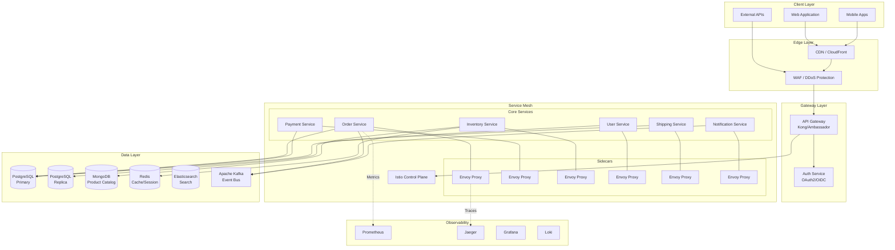
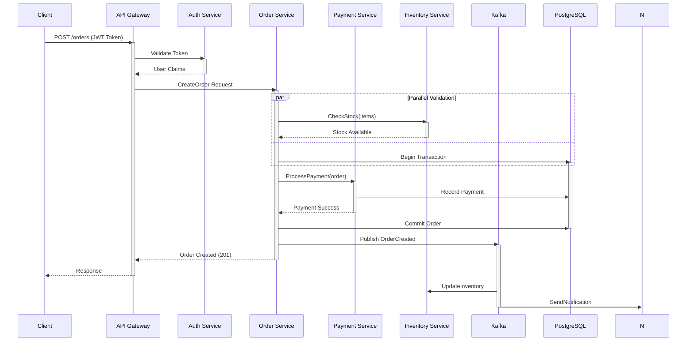

# AD-003: Microservices Architecture Design

## 1. Architecture Overview

### 1.1 Definition and Philosophy

Microservices architecture is an architectural style that structures an application as a collection of loosely coupled services, which implement business capabilities. Each service is:

- **Independently deployable**: Services can be deployed without affecting others
- **Organized around business domains**: Following Domain-Driven Design principles
- **Owned by small teams**: Enabling team autonomy and parallel development
- **Highly maintainable and testable**: Smaller codebase per service
- **Loosely coupled**: Services communicate through well-defined APIs

### 1.2 Core Characteristics

| Characteristic | Description | Benefits |
|---------------|-------------|----------|
| **Single Responsibility** | Each service focuses on one business capability | Easier maintenance, focused teams |
| **Decentralized Data Management** | Each service owns its data | Data encapsulation, independent scaling |
| **Independent Deployment** | Services deploy independently | Faster release cycles, reduced risk |
| **Polyglot Persistence** | Different databases per service | Technology optimization per use case |
| **Infrastructure Automation** | CI/CD pipelines for each service | Consistent deployments, faster feedback |
| **Design for Failure** | Expect services to fail, build resilience | System reliability, graceful degradation |

### 1.3 When to Use Microservices

**Ideal Scenarios:**

- Large, complex applications with multiple business domains
- Teams with 100+ developers needing parallel development
- Applications requiring independent scaling of components
- Organizations with strong DevOps culture
- Systems requiring high availability and fault isolation

**When NOT to Use:**

- Small applications (<10 developers)
- Simple CRUD applications
- Early-stage startups (start with monolith)
- Tight latency requirements (<100ms end-to-end)
- Limited operational expertise

---

## 2. Architecture Formalization

### 2.1 Logical Architecture

```
┌─────────────────────────────────────────────────────────────────────────────┐
│                           CLIENT LAYER                                       │
├─────────────────────────────────────────────────────────────────────────────┤
│  Web Apps │ Mobile Apps │ Third-party │ IoT Devices │ External APIs         │
└─────────────────────────────────────────────────────────────────────────────┘
                                    │
                                    ▼
┌─────────────────────────────────────────────────────────────────────────────┐
│                         API GATEWAY LAYER                                    │
├─────────────────────────────────────────────────────────────────────────────┤
│  Authentication │ Rate Limiting │ Routing │ Load Balancing │ SSL Termination│
└─────────────────────────────────────────────────────────────────────────────┘
                                    │
                                    ▼
┌─────────────────────────────────────────────────────────────────────────────┐
│                      MICROSERVICES LAYER                                     │
├─────────────────────────────────────────────────────────────────────────────┤
│  ┌──────────────┐ ┌──────────────┐ ┌──────────────┐ ┌──────────────┐        │
│  │   Order      │ │   Payment    │ │  Inventory   │ │   Shipping   │        │
│  │   Service    │ │   Service    │ │   Service    │ │   Service    │        │
│  └──────────────┘ └──────────────┘ └──────────────┘ └──────────────┘        │
│  ┌──────────────┐ ┌──────────────┐ ┌──────────────┐ ┌──────────────┐        │
│  │    User      │ │Notification  │ │  Analytics   │ │   Search     │        │
│  │   Service    │ │   Service    │ │   Service    │ │   Service    │        │
│  └──────────────┘ └──────────────┘ └──────────────┘ └──────────────┘        │
└─────────────────────────────────────────────────────────────────────────────┘
                                    │
                                    ▼
┌─────────────────────────────────────────────────────────────────────────────┐
│                        DATA LAYER                                            │
├─────────────────────────────────────────────────────────────────────────────┤
│  PostgreSQL │ MongoDB │ Redis │ Elasticsearch │ Kafka │ S3/MinIO            │
└─────────────────────────────────────────────────────────────────────────────┘
```

### 2.2 Service Decomposition Strategies

#### 2.2.1 Domain-Driven Decomposition

```
┌─────────────────────────────────────────────────────────────────────────────┐
│                     DOMAIN DECOMPOSITION MODEL                               │
├─────────────────────────────────────────────────────────────────────────────┤
│                                                                             │
│  ┌─────────────────┐     ┌─────────────────┐     ┌─────────────────┐       │
│  │   Core Domain   │     │ Supporting      │     │  Generic        │       │
│  │   (Competitive  │     │ Domain          │     │  Domain         │       │
│  │   Advantage)    │     │ (Custom dev)    │     │  (Buy/Outsource)│       │
│  ├─────────────────┤     ├─────────────────┤     ├─────────────────┤       │
│  │ • Order Mgmt    │     │ • Notification  │     │ • Auth          │       │
│  │ • Pricing Eng   │     │ • Analytics     │     │ • Payment       │       │
│  │ • Recommendation│     │ • Search        │     │ • Email         │       │
│  └─────────────────┘     └─────────────────┘     └─────────────────┘       │
│                                                                             │
└─────────────────────────────────────────────────────────────────────────────┘
```

#### 2.2.2 Bounded Context Mapping

```
┌─────────────────────────────────────────────────────────────────────────────┐
│                    BOUNDED CONTEXT RELATIONSHIPS                             │
├─────────────────────────────────────────────────────────────────────────────┤
│                                                                             │
│     ┌─────────────┐         Partnership         ┌─────────────┐            │
│     │   Order     │◄───────────────────────────►│  Inventory  │            │
│     │   Context   │    Shared Kernel            │   Context   │            │
│     └──────┬──────┘                             └──────┬──────┘            │
│            │                                          │                     │
│            │ Customer-Supplier                       │ Conformist          │
│            ▼                                          ▼                     │
│     ┌─────────────┐         ACL              ┌─────────────┐               │
│     │  Payment    │◄─────────────────────────│  Shipping   │               │
│     │   Context   │    Anti-Corruption Layer │   Context   │               │
│     └──────┬──────┘                          └─────────────┘               │
│            │                                                                │
│            │ Published Language                                             │
│            ▼                                                                │
│     ┌─────────────┐                                                          │
│     │Notification │                                                          │
│     │   Context   │                                                          │
│     └─────────────┘                                                          │
│                                                                             │
└─────────────────────────────────────────────────────────────────────────────┘
```

### 2.3 Communication Patterns

#### 2.3.1 Synchronous Communication (REST/gRPC)

```
┌─────────────────────────────────────────────────────────────────────────────┐
│                    SYNCHRONOUS COMMUNICATION FLOW                            │
├─────────────────────────────────────────────────────────────────────────────┤
│                                                                             │
│   Client                    API Gateway              Service A              │
│     │                           │                       │                   │
│     │  1. POST /orders          │                       │                   │
│     │──────────────────────────►│                       │                   │
│     │                           │  2. Authenticate      │                   │
│     │                           │  3. Route Request     │                   │
│     │                           │                       │                   │
│     │                           │  4. POST /orders      │                   │
│     │                           │──────────────────────►│                   │
│     │                           │                       │  5. Validate      │
│     │                           │                       │  6. Process       │
│     │                           │                       │                   │
│     │                           │  7. 201 Created       │                   │
│     │                           │◄──────────────────────│                   │
│     │  8. Response              │                       │                   │
│     │◄──────────────────────────│                       │                   │
│     │                           │                       │                   │
│                                                                             │
│   Timeout: 5s | Retry: 3x | Circuit Breaker: Enabled | Idempotency Key: Yes │
└─────────────────────────────────────────────────────────────────────────────┘
```

#### 2.3.2 Asynchronous Communication (Message Queue)

```
┌─────────────────────────────────────────────────────────────────────────────┐
│                   ASYNCHRONOUS COMMUNICATION FLOW                            │
├─────────────────────────────────────────────────────────────────────────────┤
│                                                                             │
│  ┌──────────┐    ┌──────────┐    ┌──────────┐    ┌──────────┐              │
│  │  Order   │    │  Kafka/  │    │ Payment  │    │Inventory │              │
│  │ Service  │───►│ RabbitMQ │───►│ Service  │    │ Service  │              │
│  └──────────┘    └──────────┘    └──────────┘    └──────────┘              │
│       │                               │               │                    │
│       │ 1. OrderCreated Event         │ 2. Process    │ 3. Reserve         │
│       │──────────────────────────────►│   Payment     │   Stock            │
│       │                               │──────────────►│                    │
│       │                               │               │                    │
│       │                               │               │ 4. StockReserved   │
│       │                               │◄──────────────│                    │
│       │                               │               │                    │
│       │                               │ 5. PaymentCompleted                │
│       │◄──────────────────────────────│               │                    │
│       │                               │               │                    │
│                                                                             │
│   Event Store: Persistent | Dead Letter Queue: Enabled | Replay: Supported  │
└─────────────────────────────────────────────────────────────────────────────┘
```

---

## 3. Design Patterns Application

### 3.1 Service Design Patterns

#### 3.1.1 API Gateway Pattern

```go
// API Gateway Implementation
package gateway

import (
    "context"
    "time"
    "github.com/go-kit/kit/circuitbreaker"
    "github.com/go-kit/kit/ratelimit"
    "github.com/sony/gobreaker"
    "golang.org/x/time/rate"
)

// Gateway defines the API Gateway interface
type Gateway interface {
    Route(ctx context.Context, request Request) (Response, error)
    Authenticate(ctx context.Context, token string) (*User, error)
    RateLimit(key string) error
}

type apiGateway struct {
    routers         map[string]Router
    authService     AuthService
    rateLimiter     *rate.Limiter
    circuitBreakers map[string]*gobreaker.CircuitBreaker
    cache           Cache
}

// Route routes requests to appropriate microservice
func (g *apiGateway) Route(ctx context.Context, req Request) (Response, error) {
    // 1. Authentication
    user, err := g.authService.ValidateToken(ctx, req.Token)
    if err != nil {
        return Response{}, ErrUnauthorized
    }

    // 2. Rate Limiting
    if err := g.rateLimiter.Wait(ctx); err != nil {
        return Response{}, ErrRateLimited
    }

    // 3. Route Resolution
    router, ok := g.routers[req.Service]
    if !ok {
        return Response{}, ErrServiceNotFound
    }

    // 4. Circuit Breaker Check
    cb, ok := g.circuitBreakers[req.Service]
    if !ok {
        cb = gobreaker.NewCircuitBreaker(gobreaker.Settings{
            Name:        req.Service,
            MaxRequests: 3,
            Interval:    10 * time.Second,
            Timeout:     30 * time.Second,
            ReadyToTrip: func(counts gobreaker.Counts) bool {
                failureRatio := float64(counts.TotalFailures) / float64(counts.Requests)
                return counts.Requests >= 10 && failureRatio >= 0.5
            },
        })
        g.circuitBreakers[req.Service] = cb
    }

    // 5. Execute with Circuit Breaker
    result, err := cb.Execute(func() (interface{}, error) {
        return router.Handle(ctx, req)
    })

    if err != nil {
        return Response{}, err
    }

    return result.(Response), nil
}
```

#### 3.1.2 Backend for Frontend (BFF) Pattern

```go
// BFF Pattern for Mobile vs Web
package bff

// MobileBFF optimized for mobile constraints
type MobileBFF struct {
    orderService    OrderClient
    userService     UserClient
    productService  ProductClient
    aggregator      ResponseAggregator
}

func (b *MobileBFF) GetDashboard(ctx context.Context, userID string) (*MobileDashboard, error) {
    // Parallel fetching optimized for mobile (lightweight responses)
    var wg sync.WaitGroup
    errChan := make(chan error, 3)

    var orders *OrderSummary
    var profile *UserProfile
    var recommendations *ProductRecommendations

    wg.Add(3)

    go func() {
        defer wg.Done()
        var err error
        // Mobile-optimized: only last 3 orders, summary fields only
        orders, err = b.orderService.GetRecentOrdersSummary(ctx, userID, 3)
        if err != nil {
            errChan <- err
        }
    }()

    go func() {
        defer wg.Done()
        var err error
        // Mobile-optimized: minimal profile fields
        profile, err = b.userService.GetProfileEssentials(ctx, userID)
        if err != nil {
            errChan <- err
        }
    }()

    go func() {
        defer wg.Done()
        var err error
        // Mobile-optimized: small batch recommendations with compressed images
        recommendations, err = b.productService.GetPersonalizedRecommendations(ctx, userID, 10, Compressed)
        if err != nil {
            errChan <- err
        }
    }()

    wg.Wait()
    close(errChan)

    // Aggregate results
    return &MobileDashboard{
        RecentOrders:     orders,
        Profile:          profile,
        Recommendations:  recommendations,
        Timestamp:        time.Now(),
    }, nil
}

// WebBFF optimized for web experience
type WebBFF struct {
    orderService     OrderClient
    userService      UserClient
    productService   ProductClient
    analyticsService AnalyticsClient
}

func (b *WebBFF) GetDashboard(ctx context.Context, userID string) (*WebDashboard, error) {
    // Web-optimized: rich data, pagination, filtering options
    orders, err := b.orderService.GetOrders(ctx, userID, GetOrdersRequest{
        Limit:      50,
        Offset:     0,
        IncludeDetails: true,
        IncludeInvoice: true,
    })
    if err != nil {
        return nil, err
    }

    profile, err := b.userService.GetFullProfile(ctx, userID)
    if err != nil {
        return nil, err
    }

    // Web-specific: include analytics and detailed recommendations
    analytics, err := b.analyticsService.GetUserMetrics(ctx, userID)
    if err != nil {
        // Non-critical, continue without
        analytics = nil
    }

    return &WebDashboard{
        Orders:      orders,
        Profile:     profile,
        Analytics:   analytics,
        FullWidth:   true,
    }, nil
}
```

#### 3.1.3 Strangler Fig Pattern

```go
// Strangler Fig Pattern for Migration
package strangler

type StranglerProxy struct {
    legacyService   LegacyService
    newService      ModernService
    featureFlags    FeatureFlagClient
    trafficSplit    TrafficSplitter
    metrics         MetricsCollector
}

func (s *StranglerProxy) ProcessOrder(ctx context.Context, order Order) (*OrderResult, error) {
    // Determine routing based on feature flags and traffic split
    route := s.determineRoute(ctx, order)

    start := time.Now()
    var result *OrderResult
    var err error

    switch route {
    case RouteLegacy:
        result, err = s.legacyService.ProcessOrder(ctx, order)
        s.metrics.RecordLatency("legacy", time.Since(start))

    case RouteNew:
        result, err = s.newService.ProcessOrder(ctx, order)
        s.metrics.RecordLatency("modern", time.Since(start))

    case RouteBoth:
        // Shadow traffic: call both, compare results, return legacy result
        legacyResult, legacyErr := s.legacyService.ProcessOrder(ctx, order)

        go func() {
            newResult, newErr := s.newService.ProcessOrder(ctx, order)
            s.compareAndLog(order.ID, legacyResult, newResult, legacyErr, newErr)
        }()

        result, err = legacyResult, legacyErr
        s.metrics.RecordLatency("shadow", time.Since(start))
    }

    return result, err
}

func (s *StranglerProxy) determineRoute(ctx context.Context, order Order) Route {
    // Feature flag check
    if s.featureFlags.IsEnabled(ctx, "modern-order-processing") {
        // Gradual rollout based on customer segment
        if order.CustomerTier == "premium" || s.trafficSplit.ShouldRoute(order.ID, 10) {
            return RouteNew
        }
    }

    // Shadow mode for validation
    if s.featureFlags.IsEnabled(ctx, "shadow-order-validation") {
        return RouteBoth
    }

    return RouteLegacy
}
```

### 3.2 Data Management Patterns

#### 3.2.1 Database per Service

```go
// Database Per Service Implementation
package persistence

// OrderService owns its database
type OrderRepository struct {
    db     *sql.DB  // PostgreSQL for transactional data
    cache  *redis.Client  // Redis for caching
    logger *zap.Logger
}

type Order struct {
    ID          string    `db:"id" json:"id"`
    CustomerID  string    `db:"customer_id" json:"customer_id"`
    Items       []Item    `db:"-" json:"items"`  // Stored as JSONB
    Total       decimal.Decimal `db:"total" json:"total"`
    Status      OrderStatus `db:"status" json:"status"`
    CreatedAt   time.Time `db:"created_at" json:"created_at"`
    UpdatedAt   time.Time `db:"updated_at" json:"updated_at"`
}

func (r *OrderRepository) Create(ctx context.Context, order *Order) error {
    return r.withTransaction(ctx, func(tx *sql.Tx) error {
        // Insert order
        query := `
            INSERT INTO orders (id, customer_id, items, total, status, created_at, updated_at)
            VALUES ($1, $2, $3, $4, $5, $6, $7)
        `
        itemsJSON, _ := json.Marshal(order.Items)

        _, err := tx.ExecContext(ctx, query,
            order.ID, order.CustomerID, itemsJSON,
            order.Total, order.Status, order.CreatedAt, order.UpdatedAt,
        )
        if err != nil {
            return fmt.Errorf("failed to create order: %w", err)
        }

        // Publish domain event
        event := OrderCreatedEvent{
            OrderID:    order.ID,
            CustomerID: order.CustomerID,
            Total:      order.Total,
            Timestamp:  time.Now(),
        }

        return r.publishEvent(ctx, tx, event)
    })
}

// ProductService uses different database technology
type ProductRepository struct {
    mongoClient *mongo.Client  // MongoDB for flexible product catalog
    esClient    *elastic.Client  // Elasticsearch for search
}

func (r *ProductRepository) Search(ctx context.Context, query SearchQuery) (*SearchResult, error) {
    // Use Elasticsearch for complex search
    esQuery := elastic.NewBoolQuery()

    if query.Keyword != "" {
        esQuery.Must(elastic.NewMultiMatchQuery(query.Keyword,
            "name^3", "description", "tags", "category"))
    }

    if len(query.Categories) > 0 {
        esQuery.Filter(elastic.NewTermsQuery("category", query.Categories...))
    }

    if query.PriceRange != nil {
        esQuery.Filter(elastic.NewRangeQuery("price").
            Gte(query.PriceRange.Min).
            Lte(query.PriceRange.Max))
    }

    // Faceted search for filtering
    facetAgg := elastic.NewTermsAggregation().Field("category")
    priceAgg := elastic.NewHistogramAggregation().Field("price").Interval(50)

    result, err := r.esClient.Search().
        Index("products").
        Query(esQuery).
        Aggregation("categories", facetAgg).
        Aggregation("price_distribution", priceAgg).
        From(query.Offset).
        Size(query.Limit).
        Do(ctx)

    return r.parseSearchResult(result), err
}
```

#### 3.2.2 CQRS (Command Query Responsibility Segregation)

```go
// CQRS Implementation
package cqrs

// Command Side - Optimized for writes
type OrderCommandHandler struct {
    eventStore EventStore
    publisher  EventPublisher
}

func (h *OrderCommandHandler) HandleCreateOrder(ctx context.Context, cmd CreateOrderCommand) error {
    // 1. Load aggregate
    order, err := h.eventStore.Load(ctx, cmd.OrderID)
    if err != nil {
        return err
    }

    // 2. Execute business logic
    events, err := order.Create(cmd.CustomerID, cmd.Items, cmd.ShippingAddress)
    if err != nil {
        return err
    }

    // 3. Persist events atomically
    if err := h.eventStore.Save(ctx, cmd.OrderID, events); err != nil {
        return err
    }

    // 4. Publish events asynchronously
    for _, event := range events {
        if err := h.publisher.Publish(ctx, event); err != nil {
            // Log but don't fail - event store is source of truth
            h.logger.Warn("failed to publish event", zap.Error(err))
        }
    }

    return nil
}

// Query Side - Optimized for reads
type OrderQueryHandler struct {
    readDB     *sql.DB  // Denormalized read model
    projections map[string]Projection
}

func (h *OrderQueryHandler) HandleGetOrderSummary(ctx context.Context, query GetOrderSummaryQuery) (*OrderSummary, error) {
    // Direct query from denormalized view - no joins needed
    const q = `
        SELECT
            order_id, customer_name, total_amount,
            item_count, status, created_date,
            shipping_city, tracking_number
        FROM order_summary_view
        WHERE order_id = $1
    `

    var summary OrderSummary
    err := h.readDB.QueryRowContext(ctx, q, query.OrderID).Scan(
        &summary.OrderID, &summary.CustomerName, &summary.TotalAmount,
        &summary.ItemCount, &summary.Status, &summary.CreatedDate,
        &summary.ShippingCity, &summary.TrackingNumber,
    )

    return &summary, err
}

func (h *OrderQueryHandler) HandleSearchOrders(ctx context.Context, query SearchOrdersQuery) (*OrderSearchResult, error) {
    // Pre-computed search index
    searchQuery := `
        SELECT order_id, customer_name, total_amount, status, created_date
        FROM order_search_index
        WHERE search_vector @@ plainto_tsquery($1)
        AND created_date BETWEEN $2 AND $3
        ORDER BY created_date DESC
        LIMIT $4 OFFSET $5
    `

    rows, err := h.readDB.QueryContext(ctx, searchQuery,
        query.SearchTerm, query.DateFrom, query.DateTo, query.Limit, query.Offset)
    if err != nil {
        return nil, err
    }
    defer rows.Close()

    var results []OrderSummary
    for rows.Next() {
        var s OrderSummary
        rows.Scan(&s.OrderID, &s.CustomerName, &s.TotalAmount, &s.Status, &s.CreatedDate)
        results = append(results, s)
    }

    return &OrderSearchResult{Orders: results}, nil
}

// Projection Builder
type OrderProjection struct {
    readDB *sql.DB
}

func (p *OrderProjection) HandleOrderCreated(ctx context.Context, event OrderCreatedEvent) error {
    // Update denormalized read model
    _, err := p.readDB.ExecContext(ctx, `
        INSERT INTO order_summary_view
            (order_id, customer_id, total_amount, item_count, status, created_date)
        VALUES ($1, $2, $3, $4, $5, $6)
    `, event.OrderID, event.CustomerID, event.Total, len(event.Items), "created", event.Timestamp)

    return err
}
```

#### 3.2.3 Saga Pattern for Distributed Transactions

```go
// Saga Pattern Implementation
package saga

// Saga Orchestrator
type OrderSaga struct {
    id            string
    status        SagaStatus
    steps         []SagaStep
    currentStep   int
    compensationStack []func() error
    log           SagaLog
}

type SagaStep struct {
    Name        string
    Action      func() error
    Compensate  func() error
    MaxRetries  int
}

func (s *OrderSaga) Execute() error {
    s.status = SagaRunning

    for i, step := range s.steps {
        s.currentStep = i

        // Log step start
        s.log.LogStepStarted(s.id, step.Name)

        // Execute with retry
        err := s.executeWithRetry(step)
        if err != nil {
            s.log.LogStepFailed(s.id, step.Name, err)
            // Trigger compensation
            return s.compensate()
        }

        // Push compensation onto stack
        if step.Compensate != nil {
            s.compensationStack = append(s.compensationStack, step.Compensate)
        }

        s.log.LogStepCompleted(s.id, step.Name)
    }

    s.status = SagaCompleted
    return nil
}

func (s *OrderSaga) compensate() error {
    s.status = SagaCompensating

    // Execute compensations in reverse order
    for i := len(s.compensationStack) - 1; i >= 0; i-- {
        if err := s.compensationStack[i](); err != nil {
            // Log compensation failure - requires manual intervention
            s.log.LogCompensationFailed(s.id, i, err)
        }
    }

    s.status = SagaCompensated
    return ErrSagaFailed
}

// Order Creation Saga Builder
func NewOrderCreationSaga(orderID string, deps SagaDependencies) *OrderSaga {
    saga := &OrderSaga{id: orderID, status: SagaPending}

    // Step 1: Reserve Inventory
    saga.steps = append(saga.steps, SagaStep{
        Name: "ReserveInventory",
        Action: func() error {
            return deps.InventoryService.Reserve(orderID, deps.Items)
        },
        Compensate: func() error {
            return deps.InventoryService.ReleaseReservation(orderID)
        },
        MaxRetries: 3,
    })

    // Step 2: Process Payment
    saga.steps = append(saga.steps, SagaStep{
        Name: "ProcessPayment",
        Action: func() error {
            return deps.PaymentService.Charge(deps.CustomerID, deps.TotalAmount, orderID)
        },
        Compensate: func() error {
            return deps.PaymentService.Refund(orderID)
        },
        MaxRetries: 0, // Payment should not retry automatically
    })

    // Step 3: Create Shipment
    saga.steps = append(saga.steps, SagaStep{
        Name: "CreateShipment",
        Action: func() error {
            _, err := deps.ShippingService.CreateShipment(orderID, deps.ShippingAddress, deps.Items)
            return err
        },
        Compensate: func() error {
            return deps.ShippingService.CancelShipment(orderID)
        },
        MaxRetries: 2,
    })

    // Step 4: Send Notification
    saga.steps = append(saga.steps, SagaStep{
        Name: "SendNotification",
        Action: func() error {
            return deps.NotificationService.SendOrderConfirmation(deps.CustomerEmail, orderID)
        },
        Compensate: nil, // Non-critical, no compensation needed
        MaxRetries: 3,
    })

    return saga
}
```

### 3.3 Resilience Patterns

#### 3.3.1 Circuit Breaker

```go
// Advanced Circuit Breaker Implementation
package resilience

type CircuitBreaker struct {
    name           string
    maxFailures    int
    timeout        time.Duration
    resetTimeout   time.Duration

    state          State
    failures       int
    lastFailureTime time.Time
    halfOpenAttempts int

    onStateChange  func(from, to State)
    metrics        MetricsCollector
}

type State int

const (
    StateClosed State = iota    // Normal operation
    StateOpen                   // Failing, reject requests
    StateHalfOpen              // Testing if service recovered
)

func (cb *CircuitBreaker) Execute(ctx context.Context, fn func() error) error {
    if err := cb.canExecute(); err != nil {
        cb.metrics.RecordRejection(cb.name)
        return err
    }

    err := fn()
    cb.recordResult(err)

    return err
}

func (cb *CircuitBreaker) canExecute() error {
    cb.mutex.Lock()
    defer cb.mutex.Unlock()

    switch cb.state {
    case StateClosed:
        return nil

    case StateOpen:
        if time.Since(cb.lastFailureTime) > cb.resetTimeout {
            cb.transitionTo(StateHalfOpen)
            cb.halfOpenAttempts = 0
            return nil
        }
        return ErrCircuitOpen

    case StateHalfOpen:
        if cb.halfOpenAttempts < 3 { // Limited attempts in half-open
            cb.halfOpenAttempts++
            return nil
        }
        return ErrCircuitOpen
    }

    return nil
}

func (cb *CircuitBreaker) recordResult(err error) {
    cb.mutex.Lock()
    defer cb.mutex.Unlock()

    if err == nil {
        // Success
        switch cb.state {
        case StateHalfOpen:
            cb.transitionTo(StateClosed)
            cb.failures = 0
        case StateClosed:
            cb.failures = 0
        }
        cb.metrics.RecordSuccess(cb.name)
    } else {
        // Failure
        cb.failures++
        cb.lastFailureTime = time.Now()

        switch cb.state {
        case StateHalfOpen:
            cb.transitionTo(StateOpen)
        case StateClosed:
            if cb.failures >= cb.maxFailures {
                cb.transitionTo(StateOpen)
            }
        }
        cb.metrics.RecordFailure(cb.name)
    }
}

func (cb *CircuitBreaker) transitionTo(newState State) {
    oldState := cb.state
    cb.state = newState

    if cb.onStateChange != nil {
        go cb.onStateChange(oldState, newState)
    }

    cb.metrics.RecordStateChange(cb.name, oldState, newState)
}
```

#### 3.3.2 Bulkhead Pattern

```go
// Bulkhead Pattern for Resource Isolation
package resilience

type Bulkhead struct {
    name           string
    maxConcurrent  int
    maxWait        time.Duration
    queueSize      int

    semaphore      chan struct{}
    queue          chan bulkheadTask
    executor       *WorkerPool

    metrics        MetricsCollector
}

type bulkheadTask struct {
    fn       func()
    done     chan error
    deadline time.Time
}

func NewBulkhead(name string, maxConcurrent, queueSize int, maxWait time.Duration) *Bulkhead {
    b := &Bulkhead{
        name:          name,
        maxConcurrent: maxConcurrent,
        maxWait:       maxWait,
        queueSize:     queueSize,
        semaphore:     make(chan struct{}, maxConcurrent),
        queue:         make(chan bulkheadTask, queueSize),
        metrics:       GetMetricsCollector(),
    }

    // Start worker pool
    b.executor = NewWorkerPool(maxConcurrent)
    go b.processQueue()

    return b
}

func (b *Bulkhead) Execute(ctx context.Context, fn func() error) error {
    done := make(chan error, 1)

    task := bulkheadTask{
        fn:       func() { done <- fn() },
        done:     done,
        deadline: time.Now().Add(b.maxWait),
    }

    select {
    case b.queue <- task:
        b.metrics.RecordQueued(b.name)

        select {
        case err := <-done:
            return err
        case <-ctx.Done():
            return ctx.Err()
        }

    default:
        b.metrics.RecordRejection(b.name)
        return ErrBulkheadFull
    }
}

func (b *Bulkhead) processQueue() {
    for task := range b.queue {
        // Check deadline
        if time.Now().After(task.deadline) {
            task.done <- ErrBulkheadTimeout
            b.metrics.RecordTimeout(b.name)
            continue
        }

        // Acquire semaphore
        b.semaphore <- struct{}{}

        // Execute in worker pool
        b.executor.Submit(func() {
            defer func() { <-b.semaphore }()
            task.fn()
        })
    }
}

// Multi-Bulkhead Manager
type BulkheadManager struct {
    bulkheads map[string]*Bulkhead
    mu        sync.RWMutex
}

func (m *BulkheadManager) GetOrCreate(name string, config BulkheadConfig) *Bulkhead {
    m.mu.RLock()
    if bh, ok := m.bulkheads[name]; ok {
        m.mu.RUnlock()
        return bh
    }
    m.mu.RUnlock()

    m.mu.Lock()
    defer m.mu.Unlock()

    // Double-check after acquiring write lock
    if bh, ok := m.bulkheads[name]; ok {
        return bh
    }

    bh := NewBulkhead(name, config.MaxConcurrent, config.QueueSize, config.MaxWait)
    m.bulkheads[name] = bh
    return bh
}
```

---

## 4. Scalability Analysis

### 4.1 Scaling Dimensions

```
┌─────────────────────────────────────────────────────────────────────────────┐
│                    MICROSERVICES SCALING DIMENSIONS                          │
├─────────────────────────────────────────────────────────────────────────────┤
│                                                                             │
│  ┌─────────────────────────────────────────────────────────────────────┐   │
│  │                     X-AXIS: HORIZONTAL DUPLICATION                   │   │
│  │                                                                      │   │
│  │   Load Balancer                                                      │   │
│  │        │                                                             │   │
│  │        ▼                                                             │   │
│  │   ┌────┴────┐    ┌────┐    ┌────┐    ┌────┐                        │   │
│  │   │ Request │───►│ S1 │───►│ S2 │───►│ S3 │  (Stateless instances)   │   │
│  │   └─────────┘    └────┘    └────┘    └────┘                        │   │
│  │                                                                      │   │
│  │   Scaling: Number of instances based on CPU/Memory/Request count    │   │
│  └─────────────────────────────────────────────────────────────────────┘   │
│                                                                             │
│  ┌─────────────────────────────────────────────────────────────────────┐   │
│  │                     Y-AXIS: FUNCTIONAL DECOMPOSITION                 │   │
│  │                                                                      │   │
│  │   ┌──────────┐  ┌──────────┐  ┌──────────┐  ┌──────────┐            │   │
│  │   │  Order   │  │ Payment  │  │ Inventory│  │ Shipping │            │   │
│  │   │ Service  │  │ Service  │  │ Service  │  │ Service  │            │   │
│  │   │  (10)    │  │  (5)     │  │  (8)     │  │  (4)     │            │   │
│  │   └──────────┘  └──────────┘  └──────────┘  └──────────┘            │   │
│  │                                                                      │   │
│  │   Scaling: Independent scaling per service based on demand           │   │
│  └─────────────────────────────────────────────────────────────────────┘   │
│                                                                             │
│  ┌─────────────────────────────────────────────────────────────────────┐   │
│  │                     Z-AXIS: DATA PARTITIONING                        │   │
│  │                                                                      │   │
│  │   ┌─────────┐  ┌─────────┐  ┌─────────┐  ┌─────────┐                │   │
│  │   │Shard A  │  │Shard B  │  │Shard C  │  │Shard D  │                │   │
│  │   │(A-D)    │  │(E-H)    │  │(I-L)    │  │(M-P)    │                │   │
│  │   │Users    │  │Users    │  │Users    │  │Users    │                │   │
│  │   └─────────┘  └─────────┘  └─────────┘  └─────────┘                │   │
│  │                                                                      │   │
│  │   Scaling: Partition data to reduce load per shard                   │   │
│  └─────────────────────────────────────────────────────────────────────┘   │
│                                                                             │
└─────────────────────────────────────────────────────────────────────────────┘
```

### 4.2 Scalability Metrics

| Metric | Target | Measurement |
|--------|--------|-------------|
| **Throughput** | 10,000 RPS per service instance | Load testing with realistic traffic patterns |
| **Latency (p50)** | < 50ms for 95% of requests | Distributed tracing with OpenTelemetry |
| **Latency (p99)** | < 200ms for 99.9% of requests | Tail latency monitoring |
| **Availability** | 99.99% (52 min downtime/year) | Multi-region deployment with automatic failover |
| **Auto-scaling** | < 30 seconds to add instance | Kubernetes HPA with custom metrics |
| **Recovery Time** | < 5 minutes for service recovery | Automated health checks and restart policies |

### 4.3 Load Balancing Strategies

```go
// Advanced Load Balancer with Multiple Strategies
package loadbalancer

type Strategy interface {
    Select(instances []Instance, request Request) (Instance, error)
}

// Round Robin Strategy
type RoundRobinStrategy struct {
    counter uint32
}

func (r *RoundRobinStrategy) Select(instances []Instance, request Request) (Instance, error) {
    if len(instances) == 0 {
        return nil, ErrNoInstances
    }

    n := atomic.AddUint32(&r.counter, 1)
    return instances[n%uint32(len(instances))], nil
}

// Weighted Response Time Strategy
type WeightedResponseTimeStrategy struct {
    stats StatsCollector
}

func (w *WeightedResponseTimeStrategy) Select(instances []Instance, request Request) (Instance, error) {
    if len(instances) == 0 {
        return nil, ErrNoInstances
    }

    // Calculate weights based on response time (lower = higher weight)
    type weightedInstance struct {
        instance Instance
        weight   float64
    }

    var weighted []weightedInstance
    totalWeight := 0.0

    for _, inst := range instances {
        if !inst.IsHealthy() {
            continue
        }

        avgResponseTime := w.stats.GetAverageResponseTime(inst.ID())
        if avgResponseTime == 0 {
            avgResponseTime = 1 // Avoid division by zero
        }

        weight := 1.0 / avgResponseTime
        weighted = append(weighted, weightedInstance{inst, weight})
        totalWeight += weight
    }

    if len(weighted) == 0 {
        return nil, ErrNoHealthyInstances
    }

    // Weighted random selection
    r := rand.Float64() * totalWeight
    cumulative := 0.0

    for _, wi := range weighted {
        cumulative += wi.weight
        if r <= cumulative {
            return wi.instance, nil
        }
    }

    return weighted[len(weighted)-1].instance, nil
}

// Consistent Hashing Strategy (for cache locality)
type ConsistentHashStrategy struct {
    ring *ConsistentHashRing
}

func (c *ConsistentHashStrategy) Select(instances []Instance, request Request) (Instance, error) {
    // Use request key for consistent routing
    key := request.GetKey()
    return c.ring.Get(key), nil
}
```

---

## 5. Technology Stack Recommendations

### 5.1 Core Infrastructure

| Layer | Technology | Purpose |
|-------|------------|---------|
| **Container Orchestration** | Kubernetes (EKS/GKE/AKS) | Container management, auto-scaling |
| **Service Mesh** | Istio / Linkerd | mTLS, traffic management, observability |
| **API Gateway** | Kong / Ambassador / AWS API Gateway | Request routing, rate limiting, auth |
| **Service Discovery** | Consul / etcd / Kubernetes DNS | Service registration and discovery |
| **Configuration** | Vault + Consul / AWS Secrets Manager | Secrets and configuration management |

### 5.2 Communication Stack

| Pattern | Technology | Use Case |
|---------|------------|----------|
| **Synchronous** | gRPC + Protocol Buffers | Internal service communication |
| **REST API** | Go/Gin + OpenAPI | External APIs, third-party integration |
| **Message Queue** | Apache Kafka / NATS | Event streaming, high throughput |
| **Pub/Sub** | Redis Pub/Sub / Google Pub/Sub | Real-time notifications |
| **RPC** | gRPC / Twirp | Internal microservices calls |

### 5.3 Data Storage

| Service Type | Primary Store | Cache | Search |
|--------------|---------------|-------|--------|
| **User Service** | PostgreSQL | Redis | Elasticsearch |
| **Order Service** | PostgreSQL | Redis | - |
| **Product Catalog** | MongoDB | Redis | Elasticsearch |
| **Analytics** | ClickHouse / BigQuery | Redis | - |
| **Session Store** | Redis | - | - |

### 5.4 Observability Stack

```
┌─────────────────────────────────────────────────────────────────────────────┐
│                      OBSERVABILITY STACK                                     │
├─────────────────────────────────────────────────────────────────────────────┤
│                                                                             │
│  ┌─────────────┐  ┌─────────────┐  ┌─────────────┐                         │
│  │   Metrics   │  │    Logs     │  │   Traces    │                         │
│  │  Prometheus │  │  Fluentd/   │  │   Jaeger/   │                         │
│  │  + Grafana  │  │  Loki/ELK   │  │  Zipkin/OTel│                         │
│  └──────┬──────┘  └──────┬──────┘  └──────┬──────┘                         │
│         │                │                │                                 │
│         └────────────────┴────────────────┘                                 │
│                          │                                                  │
│                          ▼                                                  │
│  ┌─────────────────────────────────────────────────────────────────────┐   │
│  │                      Correlation IDs                                │   │
│  │  trace_id=abc123 │ span_id=def456 │ service=order-service │ user_id  │   │
│  └─────────────────────────────────────────────────────────────────────┘   │
│                                                                             │
│  Alerts: PagerDuty + Slack │ SLOs: 99.9% availability, p99 < 200ms          │
│                                                                             │
└─────────────────────────────────────────────────────────────────────────────┘
```

---

## 6. Case Studies

### 6.1 Case Study: Netflix Microservices Migration

**Background:**

- Monolithic DVD rental application (2008)
- Scaled to 150M+ subscribers globally
- Handles 1B+ hours of video per month

**Architecture Decisions:**

| Challenge | Solution | Outcome |
|-----------|----------|---------|
| Data consistency | Eventual consistency with Kafka | 99.99% accuracy |
| Global distribution | Multi-region active-active | < 50ms latency globally |
| Personalization | 500+ microservices for recommendations | 80% content discovery |
| Fault tolerance | Chaos Engineering (Chaos Monkey) | Resilience validation |

**Key Learnings:**

1. Start with monolith, extract when needed
2. Data consistency models must match business requirements
3. Observability is non-negotiable at scale
4. Cultural change is harder than technical change

### 6.2 Case Study: Uber Service Mesh Evolution

**Evolution Phases:**

```
┌─────────────────────────────────────────────────────────────────────────────┐
│                    UBER ARCHITECTURE EVOLUTION                               │
├─────────────────────────────────────────────────────────────────────────────┤
│                                                                             │
│  2014: Monolithic                                                            │
│  ┌─────────────────────────────────────────┐                                │
│  │      PHP Monolith (Node.js for API)     │                                │
│  │              ~500K LOC                  │                                │
│  └─────────────────────────────────────────┘                                │
│                                                                             │
│  2016: Microservices (1,000+ services)                                       │
│  ┌────────┐ ┌────────┐ ┌────────┐ ┌────────┐ ┌────────┐ ┌────────┐         │
│  │Dispatch│ │Pricing │ │Payment │ │Geo     │ │Matching│ │Surge   │         │
│  │        │ │        │ │        │ │        │ │        │ │        │         │
│  └────────┘ └────────┘ └────────┘ └────────┘ └────────┘ └────────┘         │
│                                                                             │
│  2018: Service Mesh (2,200+ services)                                        │
│  ┌─────────────────────────────────────────────────────────────────┐       │
│  │                        Istio Service Mesh                        │       │
│  │  ┌────────┐ ┌────────┐ ┌────────┐ ┌────────┐ ┌────────┐        │       │
│  │  │Service │ │Service │ │Service │ │Service │ │Service │ ...    │       │
│  │  │  +Envoy│ │  +Envoy│ │  +Envoy│ │  +Envoy│ │  +Envoy│        │       │
│  │  └────────┘ └────────┘ └────────┘ └────────┘ └────────┘        │       │
│  └─────────────────────────────────────────────────────────────────┘       │
│                                                                             │
│  2020+: Domain-Oriented (4,000+ services)                                    │
│  ┌──────────────┐ ┌──────────────┐ ┌──────────────┐ ┌──────────────┐       │
│  │   Mobility   │ │   Delivery   │ │   Freight    │ │   Freight    │       │
│  │   Platform   │ │   Platform   │ │   Platform   │ │   Platform   │       │
│  │  (1500 svc)  │ │  (1200 svc)  │ │   (800 svc)  │ │   (500 svc)  │       │
│  └──────────────┘ └──────────────┘ └──────────────┘ └──────────────┘       │
│                                                                             │
└─────────────────────────────────────────────────────────────────────────────┘
```

**Technical Metrics:**

- Request rate: 50M+ requests/second
- Services: 4,000+ microservices
- Engineering teams: 4,000+ engineers
- Deployment frequency: 3,000+ deploys/day

### 6.3 Case Study: Shopify's Modular Monolith to Microservices

**Journey:**

| Phase | Approach | Result |
|-------|----------|--------|
| 2012-2016 | Modular Monolith | Rapid development, single deploy |
| 2017-2019 | Critical path extraction | Checkout service separated |
| 2020+ | Selective microservices | 5 core services + monolith |

**Lessons Learned:**

1. Monoliths scale further than expected
2. Extract by business criticality, not technical purity
3. Keep data together initially
4. API contracts matter more than technology choice

---

## 7. Visual Representations

### 7.1 System Architecture Diagram



### 7.2 Request Flow Sequence Diagram



### 7.3 Deployment Architecture Diagram

```mermaid
graph TB
    subgraph "Multi-Region Deployment"
        subgraph "Region: US-East"
            subgraph "Availability Zone A"
                POD1A[Order Service<br/>Pod 1]
                POD2A[Payment Service<br/>Pod 1]
                POD3A[User Service<br/>Pod 1]
            end

            subgraph "Availability Zone B"
                POD1B[Order Service<br/>Pod 2]
                POD2B[Payment Service<br/>Pod 2]
                POD3B[User Service<br/>Pod 2]
            end

            LB1[Internal LB]
            DB1[(Primary DB)]
        end

        subgraph "Region: US-West"
            subgraph "Availability Zone C"
                POD1C[Order Service<br/>Pod 3]
                POD2C[Payment Service<br/>Pod 3]
            end

            subgraph "Availability Zone D"
                POD1D[Order Service<br/>Pod 4]
                POD2D[Payment Service<br/>Pod 4]
            end

            LB2[Internal LB]
            DB2[(Read Replica)]
        end

        subgraph "Region: EU-Central"
            subgraph "Availability Zone E"
                POD1E[Order Service<br/>Pod 5]
            end

            subgraph "Availability Zone F"
                POD2E[Order Service<br/>Pod 6]
            end

            LB3[Internal LB]
            DB3[(Read Replica)]
        end
    end

    GLB[Global Load Balancer<br/>Geo-DNS]

    GLB --> LB1
    GLB --> LB2
    GLB --> LB3

    LB1 --> POD1A & POD2A & POD3A & POD1B & POD2B & POD3B
    LB2 --> POD1C & POD2C & POD1D & POD2D
    LB3 --> POD1E & POD2E

    DB1 -. Replication .-> DB2
    DB1 -. Replication .-> DB3

    style GLB fill:#e1f5fe
    style DB1 fill:#fff3e0
    style DB2 fill:#f3e5f5
    style DB3 fill:#f3e5f5
```



---

## 8. Implementation Checklist

### 8.1 Pre-Implementation

- [ ] Domain analysis and bounded context definition
- [ ] Service boundary identification
- [ ] API contract design (OpenAPI/Protobuf)
- [ ] Data ownership mapping
- [ ] Communication pattern selection
- [ ] Infrastructure provisioning plan

### 8.2 Development Phase

- [ ] Service template/scaffolding setup
- [ ] CI/CD pipeline configuration
- [ ] API Gateway configuration
- [ ] Service mesh deployment
- [ ] Database per service setup
- [ ] Event bus implementation
- [ ] Observability instrumentation

### 8.3 Production Readiness

- [ ] Load testing completed (target RPS achieved)
- [ ] Chaos engineering scenarios executed
- [ ] Runbooks and playbooks documented
- [ ] On-call rotation established
- [ ] Disaster recovery tested
- [ ] Security audit passed
- [ ] Performance benchmarks established

---

## 9. Anti-Patterns and Pitfalls

| Anti-Pattern | Problem | Solution |
|--------------|---------|----------|
| **Distributed Monolith** | Services tightly coupled, require coordinated deployment | Proper bounded contexts, async communication |
| **Shared Database** | Services coupled through database schema | Database per service pattern |
| **Chatty Services** | Excessive inter-service calls | Batch operations, caching, CQRS |
| **Cascading Failures** | One failure causes system-wide outage | Circuit breakers, bulkheads, timeouts |
| **Data Inconsistency** | No strategy for eventual consistency | Saga pattern, event sourcing |
| **Over-engineering** | Too many services for small domain | Start with monolith, extract gradually |

---

## 10. References and Resources

### Books

- "Building Microservices" by Sam Newman
- "The Phoenix Project" by Gene Kim
- "Domain-Driven Design" by Eric Evans
- "Release It!" by Michael Nygard

### Online Resources

- [Microservices.io](https://microservices.io) - Patterns and practices
- [12 Factor App](https://12factor.net) - Methodology
- [CNCF Trail Map](https://landscape.cncf.io) - Cloud-native technologies

### Tools and Frameworks

- **Go**: Go kit, Micro, Gin, Echo
- **Java**: Spring Boot, Spring Cloud, Micronaut
- **Python**: FastAPI, Flask, Nameko
- **Node.js**: NestJS, Express, Seneca

---

*Document Version: 1.0*
*Last Updated: 2026-04-02*
*Classification: S-Level Technical Reference*
