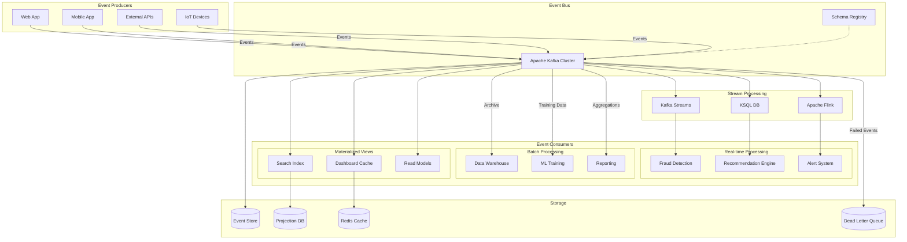
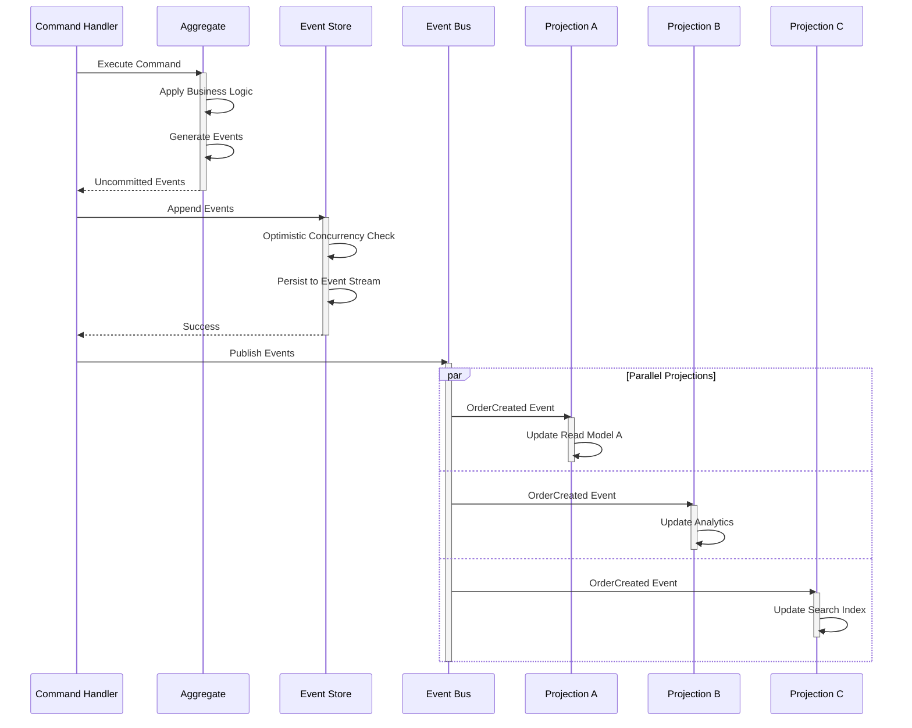
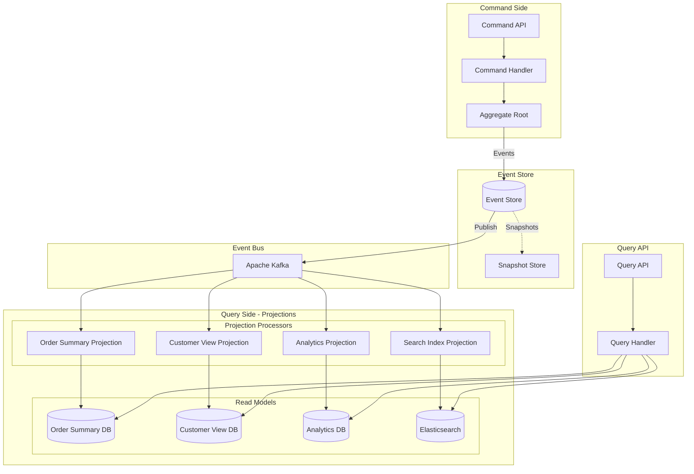

# AD-006: Event-Driven Architecture Design

## 1. Architecture Overview

### 1.1 Definition and Philosophy

Event-Driven Architecture (EDA) is a software architecture paradigm promoting the production, detection, consumption of, and reaction to events. An event represents a significant change in state—something that has happened in the business domain.

**Core Principles:**

- **Event-Centric**: Events are first-class citizens representing business facts
- **Loose Coupling**: Producers and consumers operate independently
- **Asynchronous Communication**: Non-blocking, reactive processing
- **Scalable**: Horizontal scaling through event partitioning
- **Resilient**: Fault tolerance through event persistence and replay

### 1.2 Event Taxonomy

```
┌─────────────────────────────────────────────────────────────────────────────┐
│                         EVENT CLASSIFICATION                                 │
├─────────────────────────────────────────────────────────────────────────────┤
│                                                                             │
│  ┌─────────────────────────────────────────────────────────────────────┐   │
│  │                        DOMAIN EVENTS                                 │   │
│  │  Significant business occurrences that domain experts care about     │   │
│  │                                                                      │   │
│  │  • OrderCreated         • PaymentReceived                           │   │
│  │  • InventoryReserved    • ShipmentDelivered                         │   │
│  │  • CustomerRegistered   • ProductDiscontinued                       │   │
│  └─────────────────────────────────────────────────────────────────────┘   │
│                                                                             │
│  ┌─────────────────────────────────────────────────────────────────────┐   │
│  │                      INTEGRATION EVENTS                              │   │
│  │  Events used to communicate between bounded contexts/services        │   │
│  │                                                                      │   │
│  │  • UserAuthenticated    • DataSynchronized                          │   │
│  │  • ServiceHealthCheck   • ConfigurationChanged                      │   │
│  └─────────────────────────────────────────────────────────────────────┘   │
│                                                                             │
│  ┌─────────────────────────────────────────────────────────────────────┐   │
│  │                       SYSTEM EVENTS                                  │   │
│  │  Infrastructure-level events for monitoring and operations           │   │
│  │                                                                      │   │
│  │  • ServiceStarted       • ErrorOccurred                             │   │
│  │  • MetricRecorded       • LogEntryCreated                           │   │
│  └─────────────────────────────────────────────────────────────────────┘   │
│                                                                             │
│  ┌─────────────────────────────────────────────────────────────────────┐   │
│  │                       TEMPORAL EVENTS                                │   │
│  │  Time-based events triggering scheduled processes                    │   │
│  │                                                                      │   │
│  │  • DailyReportScheduled • SubscriptionRenewalDue                    │   │
│  │  • BackupTriggered      • CacheExpiration                           │   │
│  └─────────────────────────────────────────────────────────────────────┘   │
│                                                                             │
└─────────────────────────────────────────────────────────────────────────────┘
```

### 1.3 Event Anatomy

```go
// Standard Event Structure
package events

import (
    "time"
    "github.com/google/uuid"
)

// Event represents a domain event with full traceability
type Event interface {
    EventID() string
    EventType() string
    EventVersion() string
    AggregateID() string
    AggregateType() string
    OccurredAt() time.Time
    CorrelationID() string
    CausationID() string
    Payload() interface{}
    Metadata() Metadata
}

// BaseEvent provides common event structure
type BaseEvent struct {
    ID            string      `json:"event_id"`
    Type          string      `json:"event_type"`
    Version       string      `json:"event_version"`
    AggregateID   string      `json:"aggregate_id"`
    AggregateType string      `json:"aggregate_type"`
    Timestamp     time.Time   `json:"timestamp"`
    CorrelationID string      `json:"correlation_id"`
    CausationID   string      `json:"causation_id"`
    Payload       interface{} `json:"payload"`
    Meta          Metadata    `json:"metadata"`
}

// Metadata contains operational and business context
type Metadata struct {
    SourceService   string            `json:"source_service"`
    SourceHost      string            `json:"source_host"`
    UserID          string            `json:"user_id,omitempty"`
    TenantID        string            `json:"tenant_id,omitempty"`
    ClientVersion   string            `json:"client_version,omitempty"`
    CustomHeaders   map[string]string `json:"custom_headers,omitempty"`
    TraceContext    TraceContext      `json:"trace_context"`
}

type TraceContext struct {
    TraceID    string `json:"trace_id"`
    SpanID     string `json:"span_id"`
    ParentSpan string `json:"parent_span,omitempty"`
}

// OrderCreatedEvent example domain event
type OrderCreatedEvent struct {
    BaseEvent
    Payload OrderCreatedPayload `json:"payload"`
}

type OrderCreatedPayload struct {
    OrderID       string          `json:"order_id"`
    CustomerID    string          `json:"customer_id"`
    Items         []OrderItem     `json:"items"`
    TotalAmount   decimal.Decimal `json:"total_amount"`
    Currency      string          `json:"currency"`
    ShippingAddress Address       `json:"shipping_address"`
    PaymentMethod string          `json:"payment_method"`
}

// NewOrderCreated creates a properly initialized event
func NewOrderCreated(correlationID string, payload OrderCreatedPayload) *OrderCreatedEvent {
    return &OrderCreatedEvent{
        BaseEvent: BaseEvent{
            ID:            uuid.New().String(),
            Type:          "OrderCreated",
            Version:       "1.0",
            AggregateID:   payload.OrderID,
            AggregateType: "Order",
            Timestamp:     time.Now().UTC(),
            CorrelationID: correlationID,
            CausationID:   "", // Set by event store
            Meta: Metadata{
                SourceService: "order-service",
                TraceContext:  getCurrentTraceContext(),
            },
        },
        Payload: payload,
    }
}
```

---

## 2. Architecture Patterns

### 2.1 Event-Driven Communication Patterns

#### 2.1.1 Publisher-Subscriber Pattern

```
┌─────────────────────────────────────────────────────────────────────────────┐
│                     PUBLISHER-SUBSCRIBER PATTERN                             │
├─────────────────────────────────────────────────────────────────────────────┤
│                                                                             │
│                              ┌─────────────┐                                │
│                              │   Event     │                                │
│                              │   Bus       │                                │
│                              │  (Broker)   │                                │
│                              └──────┬──────┘                                │
│                                     │                                       │
│           ┌─────────────────────────┼─────────────────────────┐             │
│           │                         │                         │             │
│           ▼                         ▼                         ▼             │
│    ┌─────────────┐           ┌─────────────┐           ┌─────────────┐     │
│    │  Inventory  │           │  Analytics  │           │Notification │     │
│    │   Service   │           │   Service   │           │   Service   │     │
│    │  (Consumer) │           │  (Consumer) │           │  (Consumer) │     │
│    └─────────────┘           └─────────────┘           └─────────────┘     │
│                                                                             │
│  Characteristics:                                                           │
│  • One-to-many communication                                                │
│  • Decoupled producers and consumers                                        │
│  • Consumers can join/leave dynamically                                     │
│  • Fan-out capability                                                       │
└─────────────────────────────────────────────────────────────────────────────┘
```

```go
// Pub/Sub Implementation
package pubsub

import (
    "context"
    "sync"
    "github.com/nats-io/nats.go"
)

// EventBus defines the pub/sub interface
type EventBus interface {
    Publish(ctx context.Context, topic string, event Event) error
    Subscribe(topic string, handler Handler) (Subscription, error)
    SubscribePattern(pattern string, handler Handler) (Subscription, error)
    Close() error
}

// NATS implementation
type NATSEventBus struct {
    conn         *nats.Conn
    js           nats.JetStreamContext
    serializers  map[string]EventSerializer
    subscribers  map[string]*nats.Subscription
    mu           sync.RWMutex
    metrics      MetricsCollector
}

func (b *NATSEventBus) Publish(ctx context.Context, topic string, event Event) error {
    start := time.Now()

    // Serialize event
    data, err := b.serialize(event)
    if err != nil {
        return fmt.Errorf("failed to serialize event: %w", err)
    }

    // Add headers for metadata
    headers := nats.Header{
        "EventType":     []string{event.EventType()},
        "EventVersion":  []string{event.EventVersion()},
        "CorrelationID": []string{event.CorrelationID()},
        "TraceID":       []string{event.Metadata().TraceContext.TraceID},
    }

    msg := &nats.Msg{
        Subject: topic,
        Data:    data,
        Header:  headers,
    }

    // Publish with acknowledgment
    _, err = b.js.PublishMsg(msg, nats.Context(ctx))

    b.metrics.RecordPublish(topic, time.Since(start), err)

    return err
}

func (b *NATSEventBus) Subscribe(topic string, handler Handler) (Subscription, error) {
    sub, err := b.js.Subscribe(topic, func(msg *nats.Msg) {
        start := time.Now()

        // Deserialize event
        event, err := b.deserialize(msg.Data, msg.Header.Get("EventType"))
        if err != nil {
            b.metrics.RecordDeserializationError(topic)
            msg.Nak() // Negative acknowledgment
            return
        }

        // Create context with trace information
        ctx := b.extractContext(msg)

        // Execute handler
        if err := handler.Handle(ctx, event); err != nil {
            b.metrics.RecordHandlerError(topic, err)

            // Decide: retry, dead-letter, or drop
            if isRetryable(err) {
                msg.NakWithDelay(time.Second * 5)
            } else {
                msg.Term() // Send to dead letter queue
            }
            return
        }

        msg.Ack()
        b.metrics.RecordProcessing(topic, time.Since(start))
    },
        nats.Durable("consumer-"+topic),
        nats.ManualAck(),
        nats.MaxDeliver(3),
        nats.AckWait(time.Second * 30),
    )

    if err != nil {
        return nil, err
    }

    b.mu.Lock()
    b.subscribers[topic] = sub
    b.mu.Unlock()

    return &natsSubscription{sub: sub}, nil
}
```

#### 2.1.2 Event Sourcing Pattern

```go
// Event Sourcing Implementation
package eventsourcing

import (
    "context"
    "encoding/json"
    "errors"
    "time"
)

// AggregateRoot base interface for event-sourced aggregates
type AggregateRoot interface {
    AggregateID() string
    AggregateVersion() int
    ApplyEvent(event Event) error
    UncommittedEvents() []Event
    MarkCommitted()
}

// EventStore interface for persistence
type EventStore interface {
    Append(ctx context.Context, streamID string, events []Event, expectedVersion int) error
    ReadStream(ctx context.Context, streamID string, fromVersion int) (EventStream, error)
    ReadAll(ctx context.Context, position int64, batchSize int) (EventStream, error)
    Subscribe(ctx context.Context, streamID string, fromVersion int) (<-chan Event, error)
    SubscribeAll(ctx context.Context, position int64) (<-chan Event, error)
}

// Aggregate base implementation
type Aggregate struct {
    ID               string
    Version          int
    uncommittedEvents []Event
    isReplaying      bool
}

func (a *Aggregate) RaiseEvent(event Event) {
    if !a.isReplaying {
        a.uncommittedEvents = append(a.uncommittedEvents, event)
    }
    a.apply(event)
}

func (a *Aggregate) apply(event Event) {
    a.Version++
}

func (a *Aggregate) UncommittedEvents() []Event {
    return a.uncommittedEvents
}

func (a *Aggregate) MarkCommitted() {
    a.uncommittedEvents = nil
}

// Order aggregate example
type Order struct {
    Aggregate
    CustomerID  string
    Status      OrderStatus
    Items       []OrderItem
    Total       decimal.Decimal
    ShippingAddress Address
}

func NewOrder(id, customerID string) *Order {
    order := &Order{}
    order.ID = id
    order.RaiseEvent(&OrderCreatedEvent{
        BaseEvent: BaseEvent{
            AggregateID: id,
            Type:        "OrderCreated",
            Version:     "1.0",
            Timestamp:   time.Now(),
        },
        CustomerID: customerID,
    })
    return order
}

func (o *Order) AddItem(productID string, quantity int, price decimal.Decimal) error {
    if o.Status != OrderStatusPending {
        return errors.New("cannot modify confirmed order")
    }

    o.RaiseEvent(&ItemAddedEvent{
        BaseEvent: BaseEvent{
            AggregateID: o.ID,
            Type:        "ItemAdded",
            Version:     "1.0",
            Timestamp:   time.Now(),
        },
        ProductID: productID,
        Quantity:  quantity,
        Price:     price,
    })

    return nil
}

func (o *Order) Confirm() error {
    if o.Status != OrderStatusPending {
        return errors.New("order already confirmed")
    }

    if len(o.Items) == 0 {
        return errors.New("cannot confirm empty order")
    }

    o.RaiseEvent(&OrderConfirmedEvent{
        BaseEvent: BaseEvent{
            AggregateID: o.ID,
            Type:        "OrderConfirmed",
            Version:     "1.0",
            Timestamp:   time.Now(),
        },
        Total: o.calculateTotal(),
    })

    return nil
}

// ApplyEvent implementations
func (o *Order) ApplyEvent(event Event) error {
    switch e := event.(type) {
    case *OrderCreatedEvent:
        o.CustomerID = e.CustomerID
        o.Status = OrderStatusPending
        o.Items = []OrderItem{}

    case *ItemAddedEvent:
        o.Items = append(o.Items, OrderItem{
            ProductID: e.ProductID,
            Quantity:  e.Quantity,
            Price:     e.Price,
        })
        o.Total = o.calculateTotal()

    case *OrderConfirmedEvent:
        o.Status = OrderStatusConfirmed

    default:
        return fmt.Errorf("unknown event type: %T", event)
    }

    return nil
}

func (o *Order) calculateTotal() decimal.Decimal {
    total := decimal.Zero
    for _, item := range o.Items {
        total = total.Add(item.Price.Mul(decimal.NewFromInt(int64(item.Quantity))))
    }
    return total
}

// Event Store Repository
type Repository struct {
    eventStore EventStore
    snapshotStore SnapshotStore
    factory     AggregateFactory
}

func (r *Repository) Load(ctx context.Context, aggregateID string) (AggregateRoot, error) {
    aggregate := r.factory.Create(aggregateID)

    // Try to load from snapshot first
    snapshot, err := r.snapshotStore.GetLatest(ctx, aggregateID)
    if err == nil && snapshot != nil {
        if err := aggregate.ApplySnapshot(snapshot); err != nil {
            return nil, err
        }
    }

    // Load events after snapshot
    fromVersion := 0
    if snapshot != nil {
        fromVersion = snapshot.Version + 1
    }

    stream, err := r.eventStore.ReadStream(ctx, aggregateID, fromVersion)
    if err != nil {
        return nil, err
    }
    defer stream.Close()

    for stream.HasNext() {
        event, err := stream.Next()
        if err != nil {
            return nil, err
        }

        if err := aggregate.ApplyEvent(event); err != nil {
            return nil, err
        }
    }

    return aggregate, nil
}

func (r *Repository) Save(ctx context.Context, aggregate AggregateRoot) error {
    events := aggregate.UncommittedEvents()
    if len(events) == 0 {
        return nil
    }

    expectedVersion := aggregate.AggregateVersion() - len(events)

    if err := r.eventStore.Append(ctx, aggregate.AggregateID(), events, expectedVersion); err != nil {
        return err
    }

    aggregate.MarkCommitted()

    // Create snapshot if needed
    if aggregate.AggregateVersion()%100 == 0 {
        go r.createSnapshot(aggregate)
    }

    return nil
}
```

#### 2.1.3 CQRS with Event Sourcing

```go
// CQRS with Event Sourcing Implementation
package cqrs

import (
    "context"
    "encoding/json"
    "sync"
)

// Command Side
type CommandHandler interface {
    Handle(ctx context.Context, cmd Command) error
}

type OrderCommandHandler struct {
    repository *Repository
    eventBus   EventBus
}

func (h *OrderCommandHandler) HandleCreateOrder(ctx context.Context, cmd CreateOrderCommand) error {
    // 1. Create aggregate
    order := NewOrder(cmd.OrderID, cmd.CustomerID)

    // 2. Execute business logic
    for _, item := range cmd.Items {
        if err := order.AddItem(item.ProductID, item.Quantity, item.Price); err != nil {
            return err
        }
    }

    if err := order.Confirm(); err != nil {
        return err
    }

    // 3. Persist events
    if err := h.repository.Save(ctx, order); err != nil {
        return err
    }

    // 4. Publish integration events
    for _, event := range order.UncommittedEvents() {
        if err := h.eventBus.Publish(ctx, "order.events", event); err != nil {
            // Log but don't fail - event store is source of truth
        }
    }

    return nil
}

// Query Side - Projections
type Projection interface {
    Handle(ctx context.Context, event Event) error
    GetView() View
}

// OrderSummaryProjection
type OrderSummaryProjection struct {
    mu    sync.RWMutex
    views map[string]*OrderSummaryView
    db    *sql.DB
}

func (p *OrderSummaryProjection) Handle(ctx context.Context, event Event) error {
    p.mu.Lock()
    defer p.mu.Unlock()

    switch e := event.(type) {
    case *OrderCreatedEvent:
        view := &OrderSummaryView{
            OrderID:     e.AggregateID(),
            CustomerID:  e.CustomerID,
            Status:      "pending",
            ItemCount:   0,
            Total:       decimal.Zero,
            CreatedAt:   e.Timestamp,
        }
        p.views[e.AggregateID()] = view
        return p.persistView(ctx, view)

    case *ItemAddedEvent:
        view, ok := p.views[e.AggregateID()]
        if !ok {
            return fmt.Errorf("order not found: %s", e.AggregateID())
        }
        view.ItemCount++
        view.Total = view.Total.Add(e.Price.Mul(decimal.NewFromInt(int64(e.Quantity))))
        return p.persistView(ctx, view)

    case *OrderConfirmedEvent:
        view, ok := p.views[e.AggregateID()]
        if !ok {
            return fmt.Errorf("order not found: %s", e.AggregateID())
        }
        view.Status = "confirmed"
        view.ConfirmedAt = &e.Timestamp
        return p.persistView(ctx, view)

    default:
        return nil
    }
}

func (p *OrderSummaryProjection) persistView(ctx context.Context, view *OrderSummaryView) error {
    query := `
        INSERT INTO order_summary (order_id, customer_id, status, item_count, total, created_at, confirmed_at)
        VALUES ($1, $2, $3, $4, $5, $6, $7)
        ON CONFLICT (order_id) DO UPDATE SET
            status = EXCLUDED.status,
            item_count = EXCLUDED.item_count,
            total = EXCLUDED.total,
            confirmed_at = EXCLUDED.confirmed_at
    `
    _, err := p.db.ExecContext(ctx, query,
        view.OrderID, view.CustomerID, view.Status,
        view.ItemCount, view.Total, view.CreatedAt, view.ConfirmedAt,
    )
    return err
}

// Query Handler
type OrderQueryHandler struct {
    db *sql.DB
}

func (h *OrderQueryHandler) GetOrderSummary(ctx context.Context, query GetOrderSummaryQuery) (*OrderSummaryDTO, error) {
    const sql = `
        SELECT order_id, customer_id, status, item_count, total, created_at
        FROM order_summary
        WHERE order_id = $1
    `

    var dto OrderSummaryDTO
    err := h.db.QueryRowContext(ctx, sql, query.OrderID).Scan(
        &dto.OrderID, &dto.CustomerID, &dto.Status,
        &dto.ItemCount, &dto.Total, &dto.CreatedAt,
    )

    return &dto, err
}

func (h *OrderQueryHandler) SearchOrders(ctx context.Context, query SearchOrdersQuery) (*OrderSearchResult, error) {
    sql := `
        SELECT order_id, customer_id, status, total, created_at
        FROM order_summary
        WHERE ($1 = '' OR customer_id = $1)
        AND ($2 = '' OR status = $2)
        AND created_at BETWEEN $3 AND $4
        ORDER BY created_at DESC
        LIMIT $5 OFFSET $6
    `

    rows, err := h.db.QueryContext(ctx, sql,
        query.CustomerID, query.Status,
        query.DateFrom, query.DateTo,
        query.Limit, query.Offset,
    )
    if err != nil {
        return nil, err
    }
    defer rows.Close()

    var orders []OrderSummaryDTO
    for rows.Next() {
        var o OrderSummaryDTO
        rows.Scan(&o.OrderID, &o.CustomerID, &o.Status, &o.Total, &o.CreatedAt)
        orders = append(orders, o)
    }

    return &OrderSearchResult{Orders: orders}, nil
}

// Projection Rebuilder for recovery
type ProjectionRebuilder struct {
    eventStore  EventStore
    projections []Projection
}

func (r *ProjectionRebuilder) Rebuild(ctx context.Context, projection Projection) error {
    // Clear projection state
    if err := projection.Reset(); err != nil {
        return err
    }

    // Replay all events
    stream, err := r.eventStore.ReadAll(ctx, 0, 1000)
    if err != nil {
        return err
    }
    defer stream.Close()

    for stream.HasNext() {
        event, err := stream.Next()
        if err != nil {
            return err
        }

        if err := projection.Handle(ctx, event); err != nil {
            return err
        }
    }

    return nil
}
```

### 2.2 Event Processing Patterns

#### 2.2.1 Event Processor with Ordering Guarantees

```go
package processing

import (
    "context"
    "sync"
    "time"
)

// OrderedEventProcessor ensures events are processed in order per aggregate
type OrderedEventProcessor struct {
    partitions     int
    workers        []*partitionWorker
    partitionFunc  PartitionFunction
    eventStore     EventStore
    handler        EventHandler

    ctx    context.Context
    cancel context.CancelFunc
    wg     sync.WaitGroup
}

type partitionWorker struct {
    id          int
    partitions  []string
    eventChan   chan Event
    handler     EventHandler
    checkpoint  CheckpointStore
}

func (w *partitionWorker) run(ctx context.Context) {
    // Group events by aggregate for ordering
    aggregateQueues := make(map[string]chan Event)
    var mu sync.Mutex

    for {
        select {
        case <-ctx.Done():
            return

        case event := <-w.eventChan:
            aggregateID := event.AggregateID()

            mu.Lock()
            queue, exists := aggregateQueues[aggregateID]
            if !exists {
                queue = make(chan Event, 100)
                aggregateQueues[aggregateID] = queue
                // Start dedicated goroutine for this aggregate
                go w.processAggregateQueue(ctx, aggregateID, queue)
            }
            mu.Unlock()

            select {
            case queue <- event:
            case <-ctx.Done():
                return
            }
        }
    }
}

func (w *partitionWorker) processAggregateQueue(ctx context.Context, aggregateID string, queue chan Event) {
    // Ensure sequential processing per aggregate
    for {
        select {
        case <-ctx.Done():
            return

        case event := <-queue:
            // Check for gaps (event sourcing ordering)
            expectedVersion := w.checkpoint.GetLastProcessedVersion(aggregateID)
            if event.Version() != expectedVersion+1 {
                // Wait or fetch missing events
                if err := w.waitForMissingEvents(ctx, aggregateID, expectedVersion+1, event.Version()); err != nil {
                    // Log error, potentially dead-letter
                    continue
                }
            }

            // Process event
            if err := w.handler.Handle(ctx, event); err != nil {
                w.handleError(ctx, event, err)
                continue
            }

            // Update checkpoint
            w.checkpoint.Save(aggregateID, event.Version())
        }
    }
}

func (w *partitionWorker) waitForMissingEvents(ctx context.Context, aggregateID string, from, to int) error {
    // Fetch missing events from event store
    stream, err := w.eventStore.ReadStream(ctx, aggregateID, from)
    if err != nil {
        return err
    }
    defer stream.Close()

    for i := from; i < to; i++ {
        if !stream.HasNext() {
            return fmt.Errorf("missing event version %d", i)
        }

        event, err := stream.Next()
        if err != nil {
            return err
        }

        if err := w.handler.Handle(ctx, event); err != nil {
            return err
        }

        w.checkpoint.Save(aggregateID, i)
    }

    return nil
}
```

#### 2.2.2 Competing Consumers Pattern

```go
package processing

import (
    "context"
    "sync"
    "time"
)

// CompetingConsumers for load balancing across multiple instances
type CompetingConsumers struct {
    consumerGroup    string
    instanceID       string
    partitionCount   int

    coordinator      Coordinator
    messageBroker    MessageBroker
    handler          MessageHandler

    assignedPartitions []int
    stopChan         chan struct{}
    wg               sync.WaitGroup
}

func (cc *CompetingConsumers) Start(ctx context.Context) error {
    // Join consumer group
    if err := cc.coordinator.JoinGroup(ctx, cc.consumerGroup, cc.instanceID); err != nil {
        return err
    }

    // Get partition assignment
    partitions, err := cc.coordinator.GetPartitionAssignment(ctx, cc.consumerGroup, cc.instanceID)
    if err != nil {
        return err
    }
    cc.assignedPartitions = partitions

    // Start consuming assigned partitions
    for _, partition := range partitions {
        cc.wg.Add(1)
        go cc.consumePartition(ctx, partition)
    }

    // Start heartbeat and rebalancing
    go cc.maintainMembership(ctx)

    return nil
}

func (cc *CompetingConsumers) consumePartition(ctx context.Context, partition int) {
    defer cc.wg.Done()

    consumer, err := cc.messageBroker.ConsumePartition(cc.consumerGroup, partition, OffsetLatest)
    if err != nil {
        return
    }
    defer consumer.Close()

    for {
        select {
        case <-ctx.Done():
            return

        case <-cc.stopChan:
            return

        case msg := <-consumer.Messages():
            // Process message with retry and dead-letter
            if err := cc.processWithRetry(ctx, msg); err != nil {
                cc.sendToDeadLetter(msg, err)
            }

            // Commit offset
            if err := consumer.CommitOffset(msg.Offset); err != nil {
                cc.logger.Error("failed to commit offset", zap.Error(err))
            }
        }
    }
}

func (cc *CompetingConsumers) processWithRetry(ctx context.Context, msg Message) error {
    backoff := []time.Duration{100 * time.Millisecond, 500 * time.Millisecond, time.Second, 5 * time.Second}

    var lastErr error
    for attempt, delay := range backoff {
        if attempt > 0 {
            time.Sleep(delay)
        }

        if err := cc.handler.Handle(ctx, msg); err != nil {
            lastErr = err
            if !isRetryable(err) {
                return err // Don't retry non-retryable errors
            }
            continue
        }

        return nil // Success
    }

    return lastErr // Exhausted retries
}

func (cc *CompetingConsumers) maintainMembership(ctx context.Context) {
    ticker := time.NewTicker(3 * time.Second)
    defer ticker.Stop()

    for {
        select {
        case <-ctx.Done():
            return

        case <-ticker.C:
            if err := cc.coordinator.Heartbeat(ctx, cc.consumerGroup, cc.instanceID); err != nil {
                // Heartbeat failed, may need to rebalance
                cc.handleRebalance(ctx)
            }
        }
    }
}

func (cc *CompetingConsumers) handleRebalance(ctx context.Context) {
    // Stop current consumers
    close(cc.stopChan)
    cc.wg.Wait()

    // Re-join and get new assignment
    partitions, err := cc.coordinator.GetPartitionAssignment(ctx, cc.consumerGroup, cc.instanceID)
    if err != nil {
        // Handle error
        return
    }

    cc.assignedPartitions = partitions
    cc.stopChan = make(chan struct{})

    // Restart with new assignment
    for _, partition := range partitions {
        cc.wg.Add(1)
        go cc.consumePartition(ctx, partition)
    }
}
```

---

## 3. Design Patterns Application

### 3.1 Event Schema Evolution

```go
package schema

import (
    "encoding/json"
    "fmt"
)

// SchemaRegistry manages event schema versions
type SchemaRegistry struct {
    schemas map[string]map[string]Schema // event type -> version -> schema
    migrators map[string]MigratorChain  // event type -> migrator
}

type Schema struct {
    Version     string            `json:"version"`
    EventType   string            `json:"event_type"`
    Schema      json.RawMessage   `json:"schema"`
    Upgrader    EventUpgrader     `json:"-"`
    Downgrader  EventDowngrader   `json:"-"`
}

// EventUpgrader transforms events from older versions
type EventUpgrader func(fromVersion string, data json.RawMessage) (json.RawMessage, error)

// Schema Evolution Example: OrderCreated Event
// v1.0: Basic order creation
// v1.1: Added priority field
// v2.0: Changed items structure (breaking change)

func (r *SchemaRegistry) RegisterOrderCreatedSchemas() {
    // v1.0 Schema
    r.RegisterSchema("OrderCreated", "1.0", Schema{
        Upgrader: nil, // Base version
    })

    // v1.1 Schema - Added priority
    r.RegisterSchema("OrderCreated", "1.1", Schema{
        Upgrader: func(fromVersion string, data json.RawMessage) (json.RawMessage, error) {
            var v1Event struct {
                OrderID    string      `json:"order_id"`
                CustomerID string      `json:"customer_id"`
                Items      []OrderItem `json:"items"`
                Total      string      `json:"total"`
            }

            if err := json.Unmarshal(data, &v1Event); err != nil {
                return nil, err
            }

            v11Event := struct {
                OrderID    string      `json:"order_id"`
                CustomerID string      `json:"customer_id"`
                Items      []OrderItem `json:"items"`
                Total      string      `json:"total"`
                Priority   string      `json:"priority"`
            }{
                OrderID:    v1Event.OrderID,
                CustomerID: v1Event.CustomerID,
                Items:      v1Event.Items,
                Total:      v1Event.Total,
                Priority:   "normal", // Default value for new field
            }

            return json.Marshal(v11Event)
        },
    })

    // v2.0 Schema - Restructured items
    r.RegisterSchema("OrderCreated", "2.0", Schema{
        Upgrader: func(fromVersion string, data json.RawMessage) (json.RawMessage, error) {
            var oldEvent struct {
                OrderID    string `json:"order_id"`
                CustomerID string `json:"customer_id"`
                Items      []struct {
                    SKU      string `json:"sku"`
                    Quantity int    `json:"qty"`
                    Price    string `json:"price"`
                } `json:"items"`
                Total    string `json:"total"`
                Priority string `json:"priority"`
            }

            if err := json.Unmarshal(data, &oldEvent); err != nil {
                return nil, err
            }

            // Transform to new structure
            newItems := make([]NewOrderItem, len(oldEvent.Items))
            for i, item := range oldEvent.Items {
                newItems[i] = NewOrderItem{
                    ProductID: item.SKU,
                    Quantity:  item.Quantity,
                    UnitPrice: item.Price,
                    Subtotal:  calculateSubtotal(item.Price, item.Quantity),
                }
            }

            v2Event := OrderCreatedV2{
                OrderID:     oldEvent.OrderID,
                CustomerID:  oldEvent.CustomerID,
                LineItems:   newItems,
                GrandTotal:  oldEvent.Total,
                Priority:    Priority(oldEvent.Priority),
                Metadata:    OrderMetadata{Source: "legacy_migration"},
            }

            return json.Marshal(v2Event)
        },
    })
}

func (r *SchemaRegistry) UpgradeEvent(eventType string, data json.RawMessage, fromVersion, toVersion string) (json.RawMessage, error) {
    currentVersion := fromVersion
    currentData := data

    for currentVersion != toVersion {
        // Find next version in upgrade chain
        nextSchema, err := r.findNextVersion(eventType, currentVersion)
        if err != nil {
            return nil, fmt.Errorf("no upgrade path from %s to %s: %w", currentVersion, toVersion, err)
        }

        if nextSchema.Upgrader == nil {
            return nil, fmt.Errorf("no upgrader for version %s", nextSchema.Version)
        }

        upgraded, err := nextSchema.Upgrader(currentVersion, currentData)
        if err != nil {
            return nil, fmt.Errorf("upgrade failed: %w", err)
        }

        currentVersion = nextSchema.Version
        currentData = upgraded
    }

    return currentData, nil
}

// Canonical Event Model - All versions map to this
type OrderCreatedCanonical struct {
    EventID     string          `json:"event_id"`
    OrderID     string          `json:"order_id"`
    CustomerID  string          `json:"customer_id"`
    Items       []CanonicalItem `json:"items"`
    TotalAmount decimal.Decimal `json:"total_amount"`
    Currency    string          `json:"currency"`
    Priority    Priority        `json:"priority"`
    CreatedAt   time.Time       `json:"created_at"`
}
```

### 3.2 Dead Letter Queue Pattern

```go
package dql

import (
    "context"
    "encoding/json"
    "time"
)

// DeadLetterQueue handles failed message processing
type DeadLetterQueue struct {
    store       DLQStore
    analyzer    ErrorAnalyzer
    notifier    AlertNotifier
    retryPolicy RetryPolicy
}

type DeadLetterEntry struct {
    ID              string          `json:"id"`
    OriginalTopic   string          `json:"original_topic"`
    OriginalEvent   json.RawMessage `json:"original_event"`
    EventType       string          `json:"event_type"`
    EventID         string          `json:"event_id"`
    FailureReason   string          `json:"failure_reason"`
    FailureType     FailureType     `json:"failure_type"`
    StackTrace      string          `json:"stack_trace"`
    ProcessingCount int             `json:"processing_count"`
    FirstFailedAt   time.Time       `json:"first_failed_at"`
    LastFailedAt    time.Time       `json:"last_failed_at"`
    Status          DLQStatus       `json:"status"`
}

type FailureType string

const (
    FailureTypeDeserialization FailureType = "DESERIALIZATION"
    FailureTypeValidation      FailureType = "VALIDATION"
    FailureTypeProcessing      FailureType = "PROCESSING"
    FailureTypeTimeout         FailureType = "TIMEOUT"
    FailureTypeDependency      FailureType = "DEPENDENCY_FAILURE"
)

type DLQStatus string

const (
    DLQStatusPending     DLQStatus = "PENDING"
    DLQStatusRetrying    DLQStatus = "RETRYING"
    DLQStatusResolved    DLQStatus = "RESOLVED"
    DLQStatusDiscarded   DLQStatus = "DISCARDED"
    DLQStatusManualReview DLQStatus = "MANUAL_REVIEW"
)

func (dlq *DeadLetterQueue) Send(ctx context.Context, event Event, err error, processingCount int) error {
    failureType := dlq.analyzer.Analyze(err)

    entry := DeadLetterEntry{
        ID:              uuid.New().String(),
        OriginalTopic:   event.Topic(),
        OriginalEvent:   event.RawData(),
        EventType:       event.EventType(),
        EventID:         event.EventID(),
        FailureReason:   err.Error(),
        FailureType:     failureType,
        StackTrace:      getStackTrace(err),
        ProcessingCount: processingCount,
        FirstFailedAt:   time.Now(),
        LastFailedAt:    time.Now(),
        Status:          DLQStatusPending,
    }

    if err := dlq.store.Save(ctx, entry); err != nil {
        return fmt.Errorf("failed to save to DLQ: %w", err)
    }

    // Alert for critical failures
    if failureType == FailureTypeDeserialization || processingCount >= 3 {
        dlq.notifier.SendAlert(ctx, Alert{
            Severity:    AlertSeverityHigh,
            Title:       fmt.Sprintf("Event %s moved to DLQ", entry.EventID),
            Description: fmt.Sprintf("Type: %s, Reason: %s", failureType, err.Error()),
            Metadata:    entry,
        })
    }

    return nil
}

func (dlq *DeadLetterQueue) ProcessRetries(ctx context.Context) error {
    // Find entries eligible for retry
    entries, err := dlq.store.FindByStatus(ctx, DLQStatusPending, 100)
    if err != nil {
        return err
    }

    for _, entry := range entries {
        if !dlq.retryPolicy.ShouldRetry(entry) {
            continue
        }

        // Update status
        entry.Status = DLQStatusRetrying
        entry.ProcessingCount++
        entry.LastFailedAt = time.Now()
        dlq.store.Update(ctx, entry)

        // Attempt retry
        if err := dlq.retryEvent(ctx, entry); err != nil {
            entry.LastFailedAt = time.Now()

            if entry.ProcessingCount >= dlq.retryPolicy.MaxRetries {
                entry.Status = DLQStatusManualReview
            } else {
                entry.Status = DLQStatusPending
            }

            dlq.store.Update(ctx, entry)
        } else {
            entry.Status = DLQStatusResolved
            dlq.store.Update(ctx, entry)
        }
    }

    return nil
}

func (dlq *DeadLetterQueue) retryEvent(ctx context.Context, entry DeadLetterEntry) error {
    // Deserialize event
    event, err := deserializeEvent(entry.OriginalEvent, entry.EventType)
    if err != nil {
        return fmt.Errorf("failed to deserialize: %w", err)
    }

    // Route to appropriate handler
    handler := dlq.getHandler(entry.EventType)

    return handler.Handle(ctx, event)
}

// DLQ Management UI Support
func (dlq *DeadLetterQueue) GetEntries(ctx context.Context, filter DLQFilter) ([]DeadLetterEntry, error) {
    return dlq.store.Find(ctx, filter)
}

func (dlq *DeadLetterQueue) ReplayEntry(ctx context.Context, entryID string) error {
    entry, err := dlq.store.Get(ctx, entryID)
    if err != nil {
        return err
    }

    if err := dlq.retryEvent(ctx, *entry); err != nil {
        return err
    }

    entry.Status = DLQStatusResolved
    return dlq.store.Update(ctx, *entry)
}

func (dlq *DeadLetterQueue) DiscardEntry(ctx context.Context, entryID string, reason string) error {
    return dlq.store.UpdateStatus(ctx, entryID, DLQStatusDiscarded, reason)
}
```

### 3.3 Event Replay and Time Travel

```go
package replay

import (
    "context"
    "time"
)

// EventReplayer provides time-travel capabilities
type EventReplayer struct {
    eventStore   EventStore
    projections  []Projection
    checkpointStore CheckpointStore
}

type ReplayConfig struct {
    StartTime       time.Time
    EndTime         time.Time
    EventTypes      []string
    AggregateIDs    []string
    Speed           float64 // 1.0 = realtime, 2.0 = 2x speed
    Filter          EventFilter
    DryRun          bool
}

func (r *EventReplayer) Replay(ctx context.Context, config ReplayConfig) (*ReplayResult, error) {
    result := &ReplayResult{
        StartedAt: time.Now(),
        Config:    config,
    }

    // Build query
    query := EventStoreQuery{
        FromTimestamp: config.StartTime,
        ToTimestamp:   config.EndTime,
        EventTypes:    config.EventTypes,
        AggregateIDs:  config.AggregateIDs,
    }

    // Get event stream
    stream, err := r.eventStore.Query(ctx, query)
    if err != nil {
        return nil, err
    }
    defer stream.Close()

    // Process events
    ticker := time.NewTicker(time.Second / time.Duration(config.Speed*10))
    defer ticker.Stop()

    for stream.HasNext() {
        select {
        case <-ctx.Done():
            result.StoppedAt = time.Now()
            return result, ctx.Err()

        case <-ticker.C:
            event, err := stream.Next()
            if err != nil {
                result.Errors = append(result.Errors, ReplayError{
                    EventID: "",
                    Error:   err.Error(),
                })
                continue
            }

            result.TotalEvents++

            // Apply filter
            if config.Filter != nil && !config.Filter(event) {
                result.FilteredEvents++
                continue
            }

            if config.DryRun {
                // Just log what would happen
                result.WouldProcess = append(result.WouldProcess, event.EventID())
                continue
            }

            // Replay to projections
            for _, projection := range r.projections {
                if err := projection.Handle(ctx, event); err != nil {
                    result.Errors = append(result.Errors, ReplayError{
                        EventID:     event.EventID(),
                        Projection:  projection.Name(),
                        Error:       err.Error(),
                    })
                }
            }

            result.ProcessedEvents++
            result.LastEventTime = event.OccurredAt()

            // Update checkpoint periodically
            if result.ProcessedEvents%1000 == 0 {
                r.checkpointStore.SaveCheckpoint(ctx, Checkpoint{
                    ReplayID:      result.ID,
                    LastEventTime: event.OccurredAt(),
                    Processed:     result.ProcessedEvents,
                })
            }
        }
    }

    result.CompletedAt = time.Now()
    return result, nil
}

// Point-in-time recovery
type PointInTimeRecovery struct {
    replayer *EventReplayer
}

func (r *PointInTimeRecovery) Recover(ctx context.Context, targetTime time.Time, aggregateIDs []string) error {
    // 1. Reset projections to initial state
    for _, projection := range r.replayer.projections {
        if err := projection.Reset(); err != nil {
            return fmt.Errorf("failed to reset projection %s: %w", projection.Name(), err)
        }
    }

    // 2. Replay all events up to target time
    config := ReplayConfig{
        EndTime:      targetTime,
        AggregateIDs: aggregateIDs,
        Speed:        100.0, // Fast replay
    }

    result, err := r.replayer.Replay(ctx, config)
    if err != nil {
        return err
    }

    if len(result.Errors) > 0 {
        return fmt.Errorf("recovery completed with %d errors", len(result.Errors))
    }

    return nil
}
```

---

## 4. Scalability Analysis

### 4.1 Throughput Scaling

```
┌─────────────────────────────────────────────────────────────────────────────┐
│                    EVENT-DRIVEN SCALING STRATEGIES                           │
├─────────────────────────────────────────────────────────────────────────────┤
│                                                                             │
│  ┌─────────────────────────────────────────────────────────────────────┐   │
│  │                    PARTITIONING STRATEGIES                           │   │
│  │                                                                      │   │
│  │  By Aggregate ID (Event Sourcing)                                     │   │
│  │  ┌─────┐ ┌─────┐ ┌─────┐ ┌─────┐ ┌─────┐ ┌─────┐                   │   │
│  │  │ P0  │ │ P1  │ │ P2  │ │ P3  │ │ P4  │ │ P5  │                   │   │
│  │  │A-C  │ │D-F  │ │G-I  │ │J-L  │ │M-O  │ │P-Z  │                   │   │
│  │  └─────┘ └─────┘ └─────┘ └─────┘ └─────┘ └─────┘                   │   │
│  │  • Same aggregate always same partition (ordering guarantee)         │   │
│  │  • Scale consumers with partition count                              │   │
│  │                                                                      │   │
│  │  By Event Type                                                        │   │
│  │  ┌──────────────┐ ┌──────────────┐ ┌──────────────┐                 │   │
│  │  │ Order Events │ │Payment Events│ │Inventory Evts│                 │   │
│  │  │   (12 partitions)  │   (8 parts)    │   (6 parts)    │                 │   │
│  │  └──────────────┘ └──────────────┘ └──────────────┘                 │   │
│  │  • Independent scaling per event type                                │   │
│  │  • Different SLA guarantees                                          │   │
│  │                                                                      │   │
│  │  By Time Window                                                       │   │
│  │  ┌─────────────┐ ┌─────────────┐ ┌─────────────┐                     │   │
│  │  │  2024-Q1    │ │  2024-Q2    │ │  2024-Q3    │                     │   │
│  │  └─────────────┘ └─────────────┘ └─────────────┘                     │   │
│  │  • Time-series data optimization                                     │   │
│  │  • Easy archival of old data                                         │   │
│  └─────────────────────────────────────────────────────────────────────┘   │
│                                                                             │
│  ┌─────────────────────────────────────────────────────────────────────┐   │
│  │                    HORIZONTAL SCALING PATTERNS                       │   │
│  │                                                                      │   │
│  │  Publisher ──► Topic with N partitions ──► Consumer Group           │   │
│  │                                              │                       │   │
│  │                                              ▼                       │   │
│  │                                    ┌─────────┬─────────┐             │   │
│  │                                    │ C1      │ C2      │ C3...       │   │
│  │                                    │ P0,P1   │ P2,P3   │             │   │
│  │                                    └─────────┴─────────┘             │   │
│  │                                                                      │   │
│  │  • Max parallelism = partition count                                 │   │
│  │  • Rebalance on consumer join/leave                                  │   │
│  │  • Fault tolerance through redistribution                            │   │
│  └─────────────────────────────────────────────────────────────────────┘   │
│                                                                             │
└─────────────────────────────────────────────────────────────────────────────┘
```

### 4.2 Performance Characteristics

| Metric | Target | Optimization Strategy |
|--------|--------|----------------------|
| **Event Ingestion** | 1M+ events/second | Batch writes, partition scaling |
| **Event Propagation** | < 100ms end-to-end | In-memory buffers, direct routing |
| **Projection Latency** | < 500ms | Async processing, read replicas |
| **Event Store Read** | 10K+ reads/second | SSD storage, connection pooling |
| **Snapshot Recovery** | < 30 seconds | Incremental snapshots, caching |
| **Replay Throughput** | 100K+ events/second | Parallel processing, skip validation |

---

## 5. Technology Stack Recommendations

### 5.1 Event Streaming Platforms

| Platform | Best For | Throughput | Ordering | Cloud Native |
|----------|----------|------------|----------|--------------|
| **Apache Kafka** | High throughput, log storage | 1M+ msg/s | Partition-level | Yes |
| **NATS JetStream** | Simplicity, low latency | 100K+ msg/s | Stream-level | Yes |
| **Redis Streams** | Simple use cases, caching | 50K+ msg/s | Stream-level | Partial |
| **AWS Kinesis** | AWS ecosystem | 1000+ records/s/shard | Shard-level | AWS only |
| **Azure Event Hubs** | Azure ecosystem | 1M+ events/s | Partition-level | Azure only |
| **Google Pub/Sub** | GCP ecosystem | 10M+ msg/s | Best-effort | GCP only |
| **Apache Pulsar** | Multi-tenancy, geo-replication | 1M+ msg/s | Partition-level | Yes |

### 5.2 Event Store Solutions

| Solution | Type | Best For |
|----------|------|----------|
| **EventStoreDB** | Specialized | Full event sourcing, projections |
| **Axon Server** | Specialized | CQRS/ES with Axon Framework |
| **PostgreSQL** | Relational | Simple event sourcing, existing infrastructure |
| **CockroachDB** | Distributed | Global distribution, consistency |
| **ScyllaDB** | NoSQL | High write throughput |

### 5.3 Go Libraries

```go
// Recommended Go Libraries for EDA

// Event Streaming
import (
    "github.com/segmentio/kafka-go"           // Kafka client
    "github.com/nats-io/nats.go"              // NATS client
    "github.com/redis/go-redis/v9"            // Redis client
)

// Event Sourcing
import (
    "github.com/looplab/eventhorizon"         // CQRS/ES framework
    "github.com/ThreeDotsLabs/watermill"      // Event-driven messaging
    "github.com/google/go-eventsource"        // Event sourcing utilities
)

// Serialization
import (
    "google.golang.org/protobuf"              // Protocol Buffers
    "github.com/apache/avro"                  // Avro serialization
    "github.com/linkedin/goavro"              // Avro for Go
)

// Schema Management
import (
    "github.com/confluentinc/schema-registry" // Schema Registry client
)
```

---

## 6. Case Studies

### 6.1 Case Study: LinkedIn's Real-time Event Processing

**Architecture:**

- **Kafka Cluster**: 100+ brokers, 7 trillion messages/day
- **Samza**: Stream processing framework
- **Brooklin**: Data streaming service

**Event Flow:**

```
User Action ──► Kafka ──► Samza Job ──► Real-time Analytics
                │
                └──► Brooklin ──► Data Warehouse
```

**Key Metrics:**

- Peak: 7 trillion messages/day
- Latency: < 100ms for real-time features
- Topics: 50,000+

### 6.2 Case Study: Shopify's Event Sourcing Implementation

**Challenge**: Shopping cart consistency across devices

**Solution**:

```
Cart Actions ──► Event Store ──► Projections ──► Cart Views
                      │
                      └──► Order Service ──► Orders
```

**Results**:

- 99.99% cart consistency
- Sub-second sync across devices
- Complete audit trail

---

## 7. Visual Representations

### 7.1 High-Level EDA Architecture



### 7.2 Event Sourcing Data Flow



### 7.3 CQRS with Event Sourcing Architecture



---

## 8. Anti-Patterns and Best Practices

### 8.1 Common Anti-Patterns

| Anti-Pattern | Problem | Solution |
|--------------|---------|----------|
| **Distributed Monolith** | Services not truly decoupled | Proper bounded contexts |
| **CRUD Events** | Events just mirror state changes | Domain events with intent |
| **Event Hell** | Too many event types | Event granularity guidelines |
| **Projection Lag** | Query side significantly behind | Monitoring, backpressure |
| **Missing Correlation IDs** | Cannot trace event flows | Mandatory context propagation |

### 8.2 Best Practices

1. **Event Design**
   - Use past tense for event names (OrderCreated, not CreateOrder)
   - Include enough context for consumers
   - Version your event schemas

2. **Error Handling**
   - Always use dead letter queues
   - Distinguish retryable vs non-retryable errors
   - Monitor projection lag

3. **Observability**
   - Trace events end-to-end
   - Monitor event processing rates
   - Alert on DLQ growth

4. **Performance**
   - Batch event writes
   - Use snapshots for fast aggregate loading
   - Scale partitions appropriately

---

*Document Version: 1.0*
*Last Updated: 2026-04-02*
*Classification: S-Level Technical Reference*
