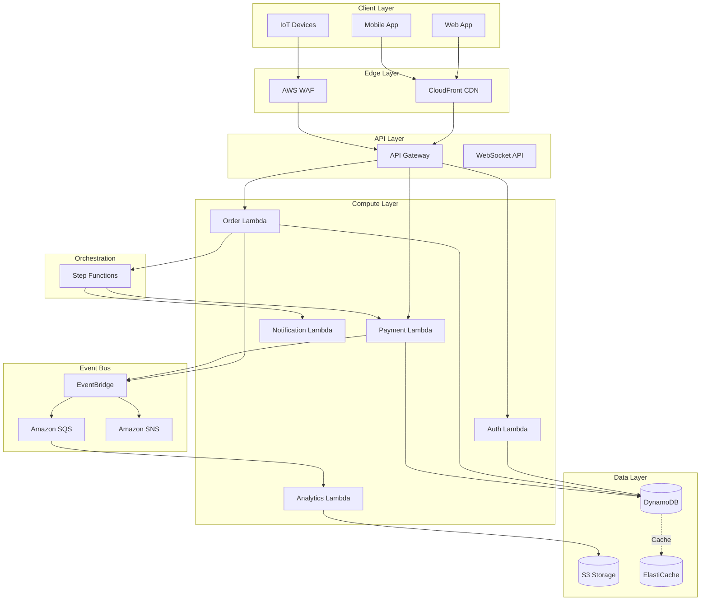
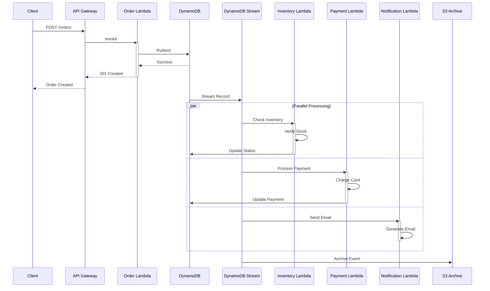
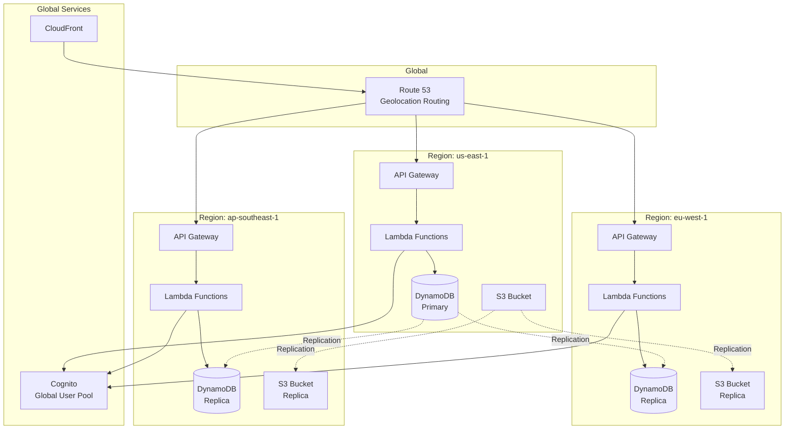

# AD-007: Serverless Architecture Design

## 1. Architecture Overview

### 1.1 Definition and Philosophy

Serverless architecture is a cloud-native development model that allows developers to build and run applications without managing infrastructure. The cloud provider dynamically manages the allocation and provisioning of servers, enabling:

- **Zero Server Management**: No server provisioning, maintenance, or patching
- **Automatic Scaling**: Resources scale automatically with demand
- **Pay-per-Use**: Billed only for actual compute time consumed
- **Event-Driven**: Functions triggered by events from various sources
- **High Availability**: Built-in redundancy across availability zones

### 1.2 Serverless Computing Models

```
┌─────────────────────────────────────────────────────────────────────────────┐
│                      SERVERLESS COMPUTING MODELS                             │
├─────────────────────────────────────────────────────────────────────────────┤
│                                                                             │
│  ┌─────────────────────────────────────────────────────────────────────┐   │
│  │                    FUNCTION-as-a-SERVICE (FaaS)                      │   │
│  │                                                                      │   │
│  │  ┌─────────────┐    ┌─────────────┐    ┌─────────────┐              │   │
│  │  │   HTTP      │    │  Database   │    │   Queue     │              │   │
│  │  │   Trigger   │    │   Trigger   │    │   Trigger   │              │   │
│  │  └──────┬──────┘    └──────┬──────┘    └──────┬──────┘              │   │
│  │         │                  │                  │                      │   │
│  │         └──────────────────┼──────────────────┘                      │   │
│  │                            ▼                                        │   │
│  │                   ┌─────────────────┐                               │   │
│  │                   │ Lambda/Function │                               │   │
│  │                   │   Handler       │                               │   │
│  │                   └────────┬────────┘                               │   │
│  │                            │                                        │   │
│  │         ┌──────────────────┼──────────────────┐                     │   │
│  │         ▼                  ▼                  ▼                     │   │
│  │  ┌─────────────┐    ┌─────────────┐    ┌─────────────┐              │   │
│  │  │   DynamoDB  │    │     S3      │    │   SNS/SQS   │              │   │
│  │  └─────────────┘    └─────────────┘    └─────────────┘              │   │
│  │                                                                      │   │
│  │  Examples: AWS Lambda, Azure Functions, Google Cloud Functions      │   │
│  └─────────────────────────────────────────────────────────────────────┘   │
│                                                                             │
│  ┌─────────────────────────────────────────────────────────────────────┐   │
│  │              CONTAINER-as-a-SERVICE (CaaS) Serverless                │   │
│  │                                                                      │   │
│  │  ┌─────────────────────────────────────────────────────────────┐    │   │
│  │  │                      Container Runtime                       │    │   │
│  │  │  ┌──────────┐  ┌──────────┐  ┌──────────┐  ┌──────────┐    │    │   │
│  │  │  │ Service A│  │ Service B│  │ Service C│  │ Service D│    │    │   │
│  │  │  │ (micro)  │  │ (micro)  │  │ (micro)  │  │ (micro)  │    │    │   │
│  │  │  └──────────┘  └──────────┘  └──────────┘  └──────────┘    │    │   │
│  │  └─────────────────────────────────────────────────────────────┘    │   │
│  │                                                                      │   │
│  │  Examples: AWS Fargate, Azure Container Instances, Google Cloud Run │   │
│  └─────────────────────────────────────────────────────────────────────┘   │
│                                                                             │
│  ┌─────────────────────────────────────────────────────────────────────┐   │
│  │            BACKEND-as-a-SERVICE (BaaS)                               │   │
│  │                                                                      │   │
│  │  ┌─────────────┐  ┌─────────────┐  ┌─────────────┐  ┌─────────────┐ │   │
│  │  │ Auth0       │  │ Firebase    │  │ Hasura      │  │ AWS         │ │   │
│  │  │ Cognito     │  │ Auth/Firestore│  │ GraphQL     │  │ AppSync     │ │   │
│  │  └─────────────┘  └─────────────┘  └─────────────┘  └─────────────┘ │   │
│  │                                                                      │   │
│  │  Managed services for authentication, databases, storage, etc.      │   │
│  └─────────────────────────────────────────────────────────────────────┘   │
│                                                                             │
└─────────────────────────────────────────────────────────────────────────────┘
```

### 1.3 Serverless vs Traditional Architecture

| Aspect | Traditional | Serverless |
|--------|-------------|------------|
| **Provisioning** | Manual/Scripted | Automatic |
| **Scaling** | Manual/Auto-scaling groups | Automatic, instant |
| **Billing** | Per hour/Reserved capacity | Per request/execution time |
| **Maintenance** | OS patches, security updates | Managed by provider |
| **Availability** | Requires configuration | Built-in multi-AZ |
| **Cold Start** | N/A | 100ms-10s depending on runtime |
| **State Management** | In-memory, attached storage | Stateless, external storage |
| **Execution Limits** | Hardware defined | Timeout (typically 15 min) |

---

## 2. Architecture Formalization

### 2.1 Serverless Application Architecture

```
┌─────────────────────────────────────────────────────────────────────────────┐
│                    SERVERLESS APPLICATION ARCHITECTURE                       │
├─────────────────────────────────────────────────────────────────────────────┤
│                                                                             │
│  ┌─────────────────────────────────────────────────────────────────────┐   │
│  │                         CLIENT LAYER                                 │   │
│  │  ┌─────────────┐  ┌─────────────┐  ┌─────────────┐  ┌─────────────┐ │   │
│  │  │    Web      │  │   Mobile    │  │    CLI      │  │   IoT       │ │   │
│  │  │  (React/Vue)│  │(iOS/Android)│  │   Tools     │  │  Devices    │ │   │
│  │  └──────┬──────┘  └──────┬──────┘  └──────┬──────┘  └──────┬──────┘ │   │
│  │         │                │                │                │        │   │
│  │         └────────────────┴────────────────┴────────────────┘        │   │
│  └─────────────────────────────────────────────────────────────────────┘   │
│                                    │                                        │
│                                    ▼                                        │
│  ┌─────────────────────────────────────────────────────────────────────┐   │
│  │                       EDGE LAYER                                     │   │
│  │  ┌─────────────┐  ┌─────────────┐  ┌─────────────┐  ┌─────────────┐ │   │
│  │  │  CloudFront │  │ Cloudflare  │  │    CDN      │  │   WAF       │ │   │
│  │  │   (CDN)     │  │   Workers   │  │  (Caching)  │  │ (Security)  │ │   │
│  │  └─────────────┘  └─────────────┘  └─────────────┘  └─────────────┘ │   │
│  └─────────────────────────────────────────────────────────────────────┘   │
│                                    │                                        │
│                                    ▼                                        │
│  ┌─────────────────────────────────────────────────────────────────────┐   │
│  │                      API LAYER                                       │   │
│  │  ┌─────────────────────────────────────────────────────────────┐    │   │
│  │  │                    API Gateway                               │    │   │
│  │  │  ┌───────────┐ ┌───────────┐ ┌───────────┐ ┌───────────┐   │    │   │
│  │  │  │ REST API  │ │GraphQL API│ │WebSocket  │ │  gRPC     │   │    │   │
│  │  │  │ Endpoints │ │ Endpoint  │ │  Endpoint │ │ Endpoint  │   │    │   │
│  │  │  └─────┬─────┘ └─────┬─────┘ └─────┬─────┘ └─────┬─────┘   │    │   │
│  │  └────────┼─────────────┼─────────────┼─────────────┼─────────┘    │   │
│  │           │             │             │             │              │   │
│  └───────────┼─────────────┼─────────────┼─────────────┼──────────────┘   │
│              │             │             │             │                   │
│  ┌───────────┼─────────────┼─────────────┼─────────────┼──────────────┐   │
│  │           ▼             ▼             ▼             ▼              │   │
│  │  ┌─────────────────────────────────────────────────────────────┐   │   │
│  │  │                COMPUTE LAYER (Serverless)                    │   │   │
│  │  │                                                              │   │   │
│  │  │  ┌──────────────┐  ┌──────────────┐  ┌──────────────┐       │   │   │
│  │  │  │   Auth       │  │   Order      │  │  Payment     │       │   │   │
│  │  │  │  Function    │  │  Function    │  │  Function    │       │   │   │
│  │  │  └──────────────┘  └──────────────┘  └──────────────┘       │   │   │
│  │  │  ┌──────────────┐  ┌──────────────┐  ┌──────────────┐       │   │   │
│  │  │  │ Notification │  │  Analytics   │  │   Image      │       │   │   │
│  │  │  │  Function    │  │   Function   │  │  Processor   │       │   │   │
│  │  │  └──────────────┘  └──────────────┘  └──────────────┘       │   │   │
│  │  │                                                              │   │   │
│  │  └─────────────────────────────────────────────────────────────┘   │   │
│  └────────────────────────────────────────────────────────────────────┘   │
│                                    │                                      │
│                                    ▼                                      │
│  ┌─────────────────────────────────────────────────────────────────────┐ │
│  │                      DATA LAYER                                      │ │
│  │  ┌─────────────┐  ┌─────────────┐  ┌─────────────┐  ┌─────────────┐ │ │
│  │  │  DynamoDB   │  │   Aurora    │  │ ElastiCache │  │    S3       │ │ │
│  │  │ (NoSQL)     │  │  Serverless │  │  (Redis)    │  │  (Object)   │ │ │
│  │  └─────────────┘  └─────────────┘  └─────────────┘  └─────────────┘ │ │
│  │  ┌─────────────┐  ┌─────────────┐  ┌─────────────┐  ┌─────────────┐ │ │
│  │  │ DocumentDB  │  │ Timestream  │  │   Keyspaces │  │   OpenSearch│ │ │
│  │  │  (Mongo)    │  │  (Time series)│  │  (Cassandra)│  │  (Search)   │ │ │
│  │  └─────────────┘  └─────────────┘  └─────────────┘  └─────────────┘ │ │
│  └─────────────────────────────────────────────────────────────────────┘ │
│                                                                          │
└──────────────────────────────────────────────────────────────────────────┘
```

### 2.2 Serverless Compute Patterns

#### 2.2.1 Function-as-a-Service (FaaS)

```go
// AWS Lambda Handler Example
package main

import (
    "context"
    "encoding/json"
    "log"

    "github.com/aws/aws-lambda-go/events"
    "github.com/aws/aws-lambda-go/lambda"
    "github.com/aws/aws-sdk-go-v2/aws"
    "github.com/aws/aws-sdk-go-v2/config"
    "github.com/aws/aws-sdk-go-v2/service/dynamodb"
    "github.com/aws/aws-sdk-go-v2/service/sns"
)

// Request/Response types
type OrderRequest struct {
    CustomerID string      `json:"customer_id"`
    Items      []OrderItem `json:"items"`
    Total      float64     `json:"total"`
}

type OrderResponse struct {
    OrderID   string `json:"order_id"`
    Status    string `json:"status"`
    CreatedAt string `json:"created_at"`
}

// Dependencies (initialized once per container, reused across invocations)
var (
    dbClient  *dynamodb.Client
    snsClient *sns.Client
    tableName string
)

// init runs once when the Lambda container starts
func init() {
    cfg, err := config.LoadDefaultConfig(context.Background())
    if err != nil {
        log.Fatalf("unable to load SDK config: %v", err)
    }

    dbClient = dynamodb.NewFromConfig(cfg)
    snsClient = sns.NewFromConfig(cfg)
    tableName = "Orders"

    // Warm-up connections
    // This improves cold start performance for subsequent invocations
}

// Handler is the Lambda function entry point
func handler(ctx context.Context, request events.APIGatewayProxyRequest) (events.APIGatewayProxyResponse, error) {
    // Parse request
    var orderReq OrderRequest
    if err := json.Unmarshal([]byte(request.Body), &orderReq); err != nil {
        return respond(400, ErrorResponse{Error: "Invalid request body"}), nil
    }

    // Validate request
    if err := validateOrder(orderReq); err != nil {
        return respond(400, ErrorResponse{Error: err.Error()}), nil
    }

    // Generate order ID
    orderID := generateOrderID()

    // Create order item
    order := Order{
        ID:         orderID,
        CustomerID: orderReq.CustomerID,
        Items:      orderReq.Items,
        Total:      orderReq.Total,
        Status:     "pending",
        CreatedAt:  time.Now().UTC(),
        TTL:        time.Now().Add(30 * 24 * time.Hour).Unix(), // DynamoDB TTL
    }

    // Save to DynamoDB
    av, err := attributevalue.MarshalMap(order)
    if err != nil {
        log.Printf("Failed to marshal order: %v", err)
        return respond(500, ErrorResponse{Error: "Internal server error"}), nil
    }

    _, err = dbClient.PutItem(ctx, &dynamodb.PutItemInput{
        TableName:           aws.String(tableName),
        Item:                av,
        ConditionExpression: aws.String("attribute_not_exists(id)"), // Prevent overwrites
    })
    if err != nil {
        log.Printf("Failed to save order: %v", err)
        return respond(500, ErrorResponse{Error: "Failed to create order"}), nil
    }

    // Publish event
    event := OrderCreatedEvent{
        OrderID:    orderID,
        CustomerID: orderReq.CustomerID,
        Total:      orderReq.Total,
        Timestamp:  time.Now().UTC(),
    }

    eventJSON, _ := json.Marshal(event)
    _, err = snsClient.Publish(ctx, &sns.PublishInput{
        TopicArn: aws.String(getTopicArn()),
        Message:  aws.String(string(eventJSON)),
        MessageAttributes: map[string]sns.MessageAttributeValue{
            "EventType": {DataType: aws.String("String"), StringValue: aws.String("OrderCreated")},
        },
    })
    if err != nil {
        log.Printf("Failed to publish event: %v", err)
        // Don't fail the request, event publishing is async
    }

    // Return response
    response := OrderResponse{
        OrderID:   orderID,
        Status:    "created",
        CreatedAt: order.CreatedAt.Format(time.RFC3339),
    }

    return respond(201, response), nil
}

func respond(statusCode int, body interface{}) events.APIGatewayProxyResponse {
    jsonBody, _ := json.Marshal(body)
    return events.APIGatewayProxyResponse{
        StatusCode: statusCode,
        Headers: map[string]string{
            "Content-Type":                 "application/json",
            "Access-Control-Allow-Origin":  "*",
            "Access-Control-Allow-Headers": "Content-Type,Authorization",
        },
        Body: string(jsonBody),
    }
}

func main() {
    lambda.Start(handler)
}
```

#### 2.2.2 Container-based Serverless

```yaml
# AWS App Runner Service Definition
# apprunner.yaml
version: 1.0
runtime: nodejs18
build:
  commands:
    pre-build:
      - npm ci
    build:
      - npm run build
run:
  command: node dist/server.js
  network:
    port: 3000
    env: PORT
  env:
    - name: NODE_ENV
      value: production
    - name: DATABASE_URL
      value-from: arn:aws:secretsmanager:...
  cpu: 1 vCPU
  memory: 2 GB
  concurrency:
    min: 1
    max: 100
auto-scaling:
  min-instances: 1
  max-instances: 25
  cpu-utilization: 60
  memory-utilization: 60
```

```go
// Cloud Run Service (Google Cloud)
package main

import (
    "context"
    "fmt"
    "log"
    "net/http"
    "os"
    "time"

    "cloud.google.com/go/pubsub"
    "cloud.google.com/go/storage"
)

// Serverless container with graceful shutdown
type Server struct {
    router      *http.ServeMux
    pubsubClient *pubsub.Client
    storageClient *storage.Client
}

func NewServer(ctx context.Context) (*Server, error) {
    projectID := os.Getenv("GOOGLE_CLOUD_PROJECT")

    psClient, err := pubsub.NewClient(ctx, projectID)
    if err != nil {
        return nil, fmt.Errorf("pubsub.NewClient: %v", err)
    }

    stClient, err := storage.NewClient(ctx)
    if err != nil {
        return nil, fmt.Errorf("storage.NewClient: %v", err)
    }

    s := &Server{
        router:        http.NewServeMux(),
        pubsubClient:  psClient,
        storageClient: stClient,
    }

    s.routes()
    return s, nil
}

func (s *Server) routes() {
    s.router.HandleFunc("/health", s.handleHealth)
    s.router.HandleFunc("/api/v1/process", s.handleProcess)
    s.router.HandleFunc("/api/v1/upload", s.handleUpload)
}

func (s *Server) handleHealth(w http.ResponseWriter, r *http.Request) {
    // Health check for Cloud Run
    w.WriteHeader(http.StatusOK)
    json.NewEncoder(w).Encode(map[string]string{"status": "healthy"})
}

func (s *Server) handleProcess(w http.ResponseWriter, r *http.Request) {
    if r.Method != http.MethodPost {
        http.Error(w, "Method not allowed", http.StatusMethodNotAllowed)
        return
    }

    ctx := r.Context()

    // Cloud Run: respect request context for timeout handling
    var req ProcessRequest
    if err := json.NewDecoder(r.Body).Decode(&req); err != nil {
        http.Error(w, "Invalid request", http.StatusBadRequest)
        return
    }

    // Process with timeout awareness
    result, err := s.processWithTimeout(ctx, req)
    if err != nil {
        if ctx.Err() == context.DeadlineExceeded {
            http.Error(w, "Request timeout", http.StatusGatewayTimeout)
            return
        }
        http.Error(w, err.Error(), http.StatusInternalServerError)
        return
    }

    w.Header().Set("Content-Type", "application/json")
    json.NewEncoder(w).Encode(result)
}

func (s *Server) processWithTimeout(ctx context.Context, req ProcessRequest) (*ProcessResult, error) {
    // Cloud Run has configurable timeout (default 300s, max 3600s)
    ctx, cancel := context.WithTimeout(ctx, 55*time.Second)
    defer cancel()

    // Process work
    return s.doWork(ctx, req)
}

func (s *Server) Shutdown(ctx context.Context) error {
    // Graceful shutdown
    if err := s.pubsubClient.Close(); err != nil {
        log.Printf("Error closing pubsub client: %v", err)
    }
    if err := s.storageClient.Close(); err != nil {
        log.Printf("Error closing storage client: %v", err)
    }
    return nil
}

func main() {
    ctx := context.Background()

    server, err := NewServer(ctx)
    if err != nil {
        log.Fatalf("Failed to create server: %v", err)
    }

    port := os.Getenv("PORT")
    if port == "" {
        port = "8080"
    }

    httpServer := &http.Server{
        Addr:    ":" + port,
        Handler: server.router,
    }

    // Graceful shutdown handling
    go func() {
        sigChan := make(chan os.Signal, 1)
        <-sigChan

        shutdownCtx, cancel := context.WithTimeout(context.Background(), 10*time.Second)
        defer cancel()

        server.Shutdown(shutdownCtx)
        httpServer.Shutdown(shutdownCtx)
    }()

    log.Printf("Server starting on port %s", port)
    if err := httpServer.ListenAndServe(); err != nil && err != http.ErrServerClosed {
        log.Fatalf("Server error: %v", err)
    }
}
```

### 2.3 Event-Driven Serverless Patterns

```go
// Event-driven Lambda triggers

// 1. S3 Trigger - Image Processing
package main

import (
    "context"
    "fmt"
    "image"
    "image/jpeg"
    "image/png"
    "log"
    "os"

    "github.com/aws/aws-lambda-go/events"
    "github.com/aws/aws-lambda-go/lambda"
    "github.com/aws/aws-sdk-go-v2/service/s3"
    "github.com/disintegration/imaging"
)

func handleS3Event(ctx context.Context, s3Event events.S3Event) error {
    for _, record := range s3Event.Records {
        bucket := record.S3.Bucket.Name
        key := record.S3.Object.URLDecodedKey

        log.Printf("Processing s3://%s/%s", bucket, key)

        // Download original
        obj, err := s3Client.GetObject(ctx, &s3.GetObjectInput{
            Bucket: &bucket,
            Key:    &key,
        })
        if err != nil {
            log.Printf("Failed to get object: %v", err)
            continue
        }
        defer obj.Body.Close()

        // Decode image
        img, format, err := image.Decode(obj.Body)
        if err != nil {
            log.Printf("Failed to decode image: %v", err)
            continue
        }

        // Generate thumbnails
        sizes := map[string]int{
            "thumbnail": 150,
            "medium":    500,
            "large":     1000,
        }

        for suffix, width := range sizes {
            resized := imaging.Resize(img, width, 0, imaging.Lanczos)

            // Upload resized
            var buf bytes.Buffer
            switch format {
            case "jpeg":
                jpeg.Encode(&buf, resized, &jpeg.Options{Quality: 85})
            case "png":
                png.Encode(&buf, resized)
            }

            newKey := fmt.Sprintf("processed/%s/%s", suffix, key)
            _, err := s3Client.PutObject(ctx, &s3.PutObjectInput{
                Bucket:      &bucket,
                Key:         &newKey,
                Body:        bytes.NewReader(buf.Bytes()),
                ContentType: aws.String(fmt.Sprintf("image/%s", format)),
            })
            if err != nil {
                log.Printf("Failed to upload %s: %v", newKey, err)
            }
        }
    }

    return nil
}

// 2. DynamoDB Stream Trigger
func handleDynamoDBStream(ctx context.Context, event events.DynamoDBEvent) error {
    for _, record := range event.Records {
        if record.EventName == "INSERT" {
            // New order created
            orderID := record.Change.NewImage["id"].String()
            customerID := record.Change.NewImage["customer_id"].String()
            total := record.Change.NewImage["total"].Number()

            // Update customer analytics
            if err := updateCustomerMetrics(ctx, customerID, total); err != nil {
                log.Printf("Failed to update metrics: %v", err)
            }

            // Send welcome email for new customers
            if isNewCustomer(record.Change.NewImage) {
                if err := sendWelcomeEmail(ctx, customerID); err != nil {
                    log.Printf("Failed to send email: %v", err)
                }
            }
        }
    }
    return nil
}

// 3. SNS/SQS Trigger
func handleSQSEvent(ctx context.Context, sqsEvent events.SQSEvent) error {
    // Batch processing
    var batchItemFailures []events.SQSBatchItemFailure

    for _, message := range sqsEvent.Records {
        if err := processMessage(ctx, message); err != nil {
            log.Printf("Failed to process message %s: %v", message.MessageId, err)
            batchItemFailures = append(batchItemFailures, events.SQSBatchItemFailure{
                ItemIdentifier: message.MessageId,
            })
        }
    }

    // Partial batch response - only failed items return to queue
    return &events.SQSEventResponse{
        BatchItemFailures: batchItemFailures,
    }
}

// 4. EventBridge Scheduled Event
func handleScheduledEvent(ctx context.Context, event events.CloudWatchEvent) error {
    // Daily cleanup job
    if event.DetailType == "Daily Cleanup" {
        return cleanupExpiredData(ctx)
    }

    // Hourly aggregation
    if event.DetailType == "Hourly Aggregation" {
        return runHourlyAggregation(ctx)
    }

    return nil
}

func main() {
    // Use environment variable to determine handler
    handlerType := os.Getenv("HANDLER_TYPE")

    switch handlerType {
    case "S3":
        lambda.Start(handleS3Event)
    case "DYNAMODB":
        lambda.Start(handleDynamoDBStream)
    case "SQS":
        lambda.Start(handleSQSEvent)
    case "SCHEDULED":
        lambda.Start(handleScheduledEvent)
    default:
        lambda.Start(handleHTTP)
    }
}
```

---

## 3. Design Patterns

### 3.1 Serverless Pattern Catalog

#### 3.1.1 Function Chaining Pattern

```go
// Step Functions for orchestration
package main

import (
    "github.com/aws/aws-sdk-go-v2/service/sfn"
)

// State machine definition (ASL - Amazon States Language)
const orderProcessingStateMachine = `{
    "Comment": "Order Processing Workflow",
    "StartAt": "ValidateOrder",
    "States": {
        "ValidateOrder": {
            "Type": "Task",
            "Resource": "arn:aws:lambda:...:function:validate-order",
            "Next": "CheckInventory",
            "Catch": [{
                "ErrorEquals": ["ValidationException"],
                "Next": "OrderFailed"
            }]
        },
        "CheckInventory": {
            "Type": "Task",
            "Resource": "arn:aws:lambda:...:function:check-inventory",
            "Next": "InventoryChoice",
            "Catch": [{
                "ErrorEquals": ["States.ALL"],
                "Next": "OrderFailed"
            }]
        },
        "InventoryChoice": {
            "Type": "Choice",
            "Choices": [{
                "Variable": "$.inventory.available",
                "BooleanEquals": true,
                "Next": "ProcessPayment"
            }],
            "Default": "NotifyBackorder"
        },
        "ProcessPayment": {
            "Type": "Task",
            "Resource": "arn:aws:lambda:...:function:process-payment",
            "Next": "ParallelProcessing",
            "Catch": [{
                "ErrorEquals": ["PaymentException"],
                "Next": "PaymentFailed"
            }]
        },
        "ParallelProcessing": {
            "Type": "Parallel",
            "Branches": [
                {
                    "StartAt": "SendConfirmation",
                    "States": {
                        "SendConfirmation": {
                            "Type": "Task",
                            "Resource": "arn:aws:lambda:...:function:send-email",
                            "End": true
                        }
                    }
                },
                {
                    "StartAt": "UpdateAnalytics",
                    "States": {
                        "UpdateAnalytics": {
                            "Type": "Task",
                            "Resource": "arn:aws:lambda:...:function:update-analytics",
                            "End": true
                        }
                    }
                },
                {
                    "StartAt": "CreateShipment",
                    "States": {
                        "CreateShipment": {
                            "Type": "Task",
                            "Resource": "arn:aws:lambda:...:function:create-shipment",
                            "End": true
                        }
                    }
                }
            ],
            "Next": "OrderComplete"
        },
        "OrderComplete": {
            "Type": "Succeed",
            "Output": "Order processed successfully"
        },
        "OrderFailed": {
            "Type": "Task",
            "Resource": "arn:aws:lambda:...:function:handle-failure",
            "Next": "Fail"
        },
        "PaymentFailed": {
            "Type": "Task",
            "Resource": "arn:aws:lambda:...:function:release-inventory",
            "Next": "OrderFailed"
        },
        "NotifyBackorder": {
            "Type": "Task",
            "Resource": "arn:aws:lambda:...:function:notify-backorder",
            "Next": "OrderComplete"
        },
        "Fail": {
            "Type": "Fail",
            "Error": "OrderProcessingFailed",
            "Cause": "Order could not be processed"
        }
    }
}`
```

#### 3.1.2 Fan-Out/Fan-In Pattern

```go
// Fan-Out: One trigger, multiple parallel processors
// Fan-In: Aggregate results from multiple processors

// Fan-Out Implementation
func fanOutProcessor(ctx context.Context, batch BatchRequest) error {
    // Split batch into chunks
    chunks := splitIntoChunks(batch.Items, 25) // 25 = SQS batch size

    // Send to SQS for parallel processing
    entries := make([]sqs.SendMessageBatchRequestEntry, len(chunks))
    for i, chunk := range chunks {
        body, _ := json.Marshal(chunk)
        entries[i] = sqs.SendMessageBatchRequestEntry{
            Id:          aws.String(fmt.Sprintf("chunk-%d", i)),
            MessageBody: aws.String(string(body)),
            MessageAttributes: map[string]sqs.MessageAttributeValue{
                "BatchID": {StringValue: aws.String(batch.ID)},
                "ChunkIndex": {StringValue: aws.String(strconv.Itoa(i))},
            },
        }
    }

    _, err := sqsClient.SendMessageBatch(ctx, &sqs.SendMessageBatchInput{
        QueueUrl: aws.String(getProcessingQueueURL()),
        Entries:  entries,
    })

    return err
}

// Individual processor
func chunkProcessor(ctx context.Context, sqsEvent events.SQSEvent) error {
    for _, record := range sqsEvent.Records {
        var chunk Chunk
        if err := json.Unmarshal([]byte(record.Body), &chunk); err != nil {
            return err
        }

        // Process items in this chunk
        results := make([]Result, len(chunk.Items))
        for i, item := range chunk.Items {
            result, err := processItem(ctx, item)
            if err != nil {
                results[i] = Result{ItemID: item.ID, Error: err.Error()}
            } else {
                results[i] = result
            }
        }

        // Store partial results
        batchID := record.MessageAttributes["BatchID"].StringValue
        chunkIndex := record.MessageAttributes["ChunkIndex"].StringValue

        if err := storePartialResult(ctx, batchID, chunkIndex, results); err != nil {
            return err
        }

        // Check if all chunks completed
        if completed, err := checkAllChunksComplete(ctx, batchID); err != nil {
            return err
        } else if completed {
            // Trigger fan-in
            if err := triggerAggregation(ctx, batchID); err != nil {
                return err
            }
        }
    }

    return nil
}

// Fan-In Implementation
func aggregationHandler(ctx context.Context, event AggregationTrigger) error {
    batchID := event.BatchID

    // Retrieve all partial results
    partials, err := getPartialResults(ctx, batchID)
    if err != nil {
        return err
    }

    // Aggregate
    finalResult := aggregateResults(partials)

    // Store final result
    if err := storeFinalResult(ctx, batchID, finalResult); err != nil {
        return err
    }

    // Notify completion
    return notifyCompletion(ctx, batchID, finalResult)
}
```

#### 3.1.3 Circuit Breaker for Serverless

```go
// Circuit breaker using DynamoDB
package main

import (
    "context"
    "fmt"
    "time"

    "github.com/aws/aws-sdk-go-v2/aws"
    "github.com/aws/aws-sdk-go-v2/feature/dynamodb/attributevalue"
    "github.com/aws/aws-sdk-go-v2/service/dynamodb"
)

type CircuitState string

const (
    StateClosed    CircuitState = "CLOSED"
    StateOpen      CircuitState = "OPEN"
    StateHalfOpen  CircuitState = "HALF_OPEN"
)

type CircuitBreaker struct {
    name          string
    dbClient      *dynamodb.Client
    tableName     string

    failureThreshold   int
    successThreshold   int
    timeout            time.Duration
}

func (cb *CircuitBreaker) CanExecute(ctx context.Context) (bool, error) {
    state, err := cb.getState(ctx)
    if err != nil {
        return false, err
    }

    switch state.CurrentState {
    case StateClosed:
        return true, nil

    case StateOpen:
        if time.Since(state.LastFailureTime) > cb.timeout {
            // Try half-open
            if err := cb.transition(ctx, StateHalfOpen); err != nil {
                return false, err
            }
            return true, nil
        }
        return false, fmt.Errorf("circuit breaker is OPEN for %s", cb.name)

    case StateHalfOpen:
        return true, nil
    }

    return false, nil
}

func (cb *CircuitBreaker) RecordSuccess(ctx context.Context) error {
    state, err := cb.getState(ctx)
    if err != nil {
        return err
    }

    switch state.CurrentState {
    case StateHalfOpen:
        state.ConsecutiveSuccesses++
        if state.ConsecutiveSuccesses >= cb.successThreshold {
            return cb.transition(ctx, StateClosed)
        }
        return cb.updateState(ctx, state)

    case StateClosed:
        state.FailureCount = 0
        return cb.updateState(ctx, state)
    }

    return nil
}

func (cb *CircuitBreaker) RecordFailure(ctx context.Context) error {
    state, err := cb.getState(ctx)
    if err != nil {
        return err
    }

    state.FailureCount++
    state.LastFailureTime = time.Now()
    state.ConsecutiveSuccesses = 0

    switch state.CurrentState {
    case StateHalfOpen:
        return cb.transition(ctx, StateOpen)

    case StateClosed:
        if state.FailureCount >= cb.failureThreshold {
            return cb.transition(ctx, StateOpen)
        }
        return cb.updateState(ctx, state)
    }

    return nil
}

func (cb *CircuitBreaker) transition(ctx context.Context, newState CircuitState) error {
    state := CircuitStateRecord{
        Name:               cb.name,
        CurrentState:       newState,
        FailureCount:       0,
        ConsecutiveSuccesses: 0,
        LastFailureTime:    time.Now(),
        TTL:                time.Now().Add(24 * time.Hour).Unix(),
    }

    av, _ := attributevalue.MarshalMap(state)
    _, err := cb.dbClient.PutItem(ctx, &dynamodb.PutItemInput{
        TableName: aws.String(cb.tableName),
        Item:      av,
    })

    return err
}

// Lambda middleware using circuit breaker
func WithCircuitBreaker(name string, next LambdaHandler) LambdaHandler {
    cb := &CircuitBreaker{
        name:             name,
        failureThreshold: 5,
        successThreshold: 3,
        timeout:          30 * time.Second,
    }

    return func(ctx context.Context, event interface{}) (interface{}, error) {
        canExecute, err := cb.CanExecute(ctx)
        if err != nil {
            return nil, err
        }
        if !canExecute {
            return nil, fmt.Errorf("service temporarily unavailable")
        }

        result, err := next(ctx, event)
        if err != nil {
            cb.RecordFailure(ctx)
            return nil, err
        }

        cb.RecordSuccess(ctx)
        return result, nil
    }
}
```

---

## 4. Scalability Analysis

### 4.1 Scaling Characteristics

```
┌─────────────────────────────────────────────────────────────────────────────┐
│                    SERVERLESS SCALING CHARACTERISTICS                        │
├─────────────────────────────────────────────────────────────────────────────┤
│                                                                             │
│  Request Rate                                                               │
│      │                                                                      │
│  10K ┤                              ┌─────────┐                           │
│      │                              │         │                           │
│   5K ┤          ┌─────────┐         │         │                           │
│      │          │         │         │         │                           │
│   1K ┤  ┌───┐   │         │         │         │                           │
│      │  │   │   │         │         │         │                           │
│    0 ┼──┴───┴───┴─────────┴─────────┴─────────┴────────► Time            │
│                                                                             │
│  Concurrent Executions                                                      │
│      │                                                                      │
│  100 ┤                              ════════════════                       │
│      │                              (Max 1000 on AWS)                      │
│   50 ┤          ═══════════                                                │
│      │                                                                      │
│   10 ┤  ═══════                                                            │
│      │                                                                      │
│    0 ┼────────────────────────────────────────────────► Time               │
│                                                                             │
│  Cold Starts                                                                │
│      │                                                                      │
│    █ ┤██                                                                    │
│ 100ms┤  ██                                                                 │
│      │    ██                                                                │
│      │      ██                                                              │
│    0 ┼───────────┬───────────┬───────────┬───────────► Time                │
│                 Warm        Warm        Warm                                │
│                                                                             │
│  Memory Usage                                                               │
│      │                                                                      │
│ 512MB┤                              ┌──────────────┐                       │
│      │                              │              │                       │
│ 256MB┤          ┌──────────┐        │              │                       │
│      │          │          │        │              │                       │
│ 128MB┤  ┌──────┐│          │        │              │                       │
│      │  │      ││          │        │              │                       │
│    0 ┼──┴──────┴┴──────────┴────────┴──────────────┴────────► Time        │
│                                                                             │
└─────────────────────────────────────────────────────────────────────────────┘
```

### 4.2 Concurrency Limits by Provider

| Provider | Default Limit | Maximum | Burst Limit |
|----------|---------------|---------|-------------|
| **AWS Lambda** | 1,000 | 10,000+ (adjustable) | 500-3000 (region dependent) |
| **Azure Functions** | 200 | Unlimited (Premium) | Varies by plan |
| **Google Cloud Functions** | 1,000 | 3,000 (adjustable) | 1,000 |
| **Cloudflare Workers** | No limit | No limit | Unlimited |

### 4.3 Cold Start Optimization

```go
// Cold start optimization techniques

// 1. Provisioned Concurrency (AWS Lambda)
// Keeps specified number of instances warm

// 2. Runtime optimization - Use provided.al2 (Amazon Linux 2)
// Smaller package = faster cold start

// 3. Initialization outside handler
var (
    db     *sql.DB
    cache  *redis.Client
    s3     *s3.Client
)

func init() {
    // Initialize connections once per container
    db = initDatabase()
    cache = initCache()
    s3 = initS3()
}

// 4. Lazy loading for heavy dependencies
var heavyService HeavyService
var once sync.Once

func getHeavyService() HeavyService {
    once.Do(func() {
        heavyService = initHeavyService()
    })
    return heavyService
}

// 5. Keep-alive for database connections
func initDatabase() *sql.DB {
    db, err := sql.Open("postgres", connectionString)
    if err != nil {
        log.Fatal(err)
    }

    db.SetMaxIdleConns(2)
    db.SetMaxOpenConns(10)
    db.SetConnMaxIdleTime(5 * time.Minute)

    // Test connection
    if err := db.Ping(); err != nil {
        log.Fatal(err)
    }

    return db
}
```

---

## 5. Technology Stack Recommendations

### 5.1 AWS Serverless Stack

| Component | Service | Use Case |
|-----------|---------|----------|
| **Compute** | Lambda | Event-driven functions |
| **API** | API Gateway | REST/WebSocket endpoints |
| **Storage** | S3 | Object storage, static hosting |
| **Database** | DynamoDB | NoSQL, key-value, document |
| **Cache** | ElastiCache (Serverless) | Redis/Memcached caching |
| **Search** | OpenSearch Serverless | Full-text search |
| **Queue** | SQS | Message queuing |
| **Pub/Sub** | SNS | Notifications, fan-out |
| **Events** | EventBridge | Event routing, scheduling |
| **Orchestration** | Step Functions | Workflow orchestration |
| **Stream** | Kinesis | Real-time data streaming |
| **Auth** | Cognito | User authentication |

### 5.2 Multi-Cloud Comparison

| Feature | AWS | Azure | GCP |
|---------|-----|-------|-----|
| **Functions** | Lambda | Functions | Cloud Functions |
| **Container Serverless** | Fargate | Container Instances | Cloud Run |
| **HTTP Gateway** | API Gateway | API Management | API Gateway |
| **NoSQL** | DynamoDB | Cosmos DB | Firestore |
| **Workflows** | Step Functions | Logic Apps | Workflows |
| **Event Bus** | EventBridge | Event Grid | Eventarc |

---

## 6. Case Studies

### 6.1 Case Study: Coca-Cola Vending Machine (AWS Lambda)

**Architecture:**

- IoT sensors in vending machines
- Lambda functions process telemetry
- DynamoDB for state management
- S3 for long-term analytics

**Results:**

- 99.9% availability
- Reduced infrastructure costs by 80%
- Real-time inventory tracking

### 6.2 Case Study: Netflix (AWS Lambda)

**Use Cases:**

- Video encoding pipeline
- Security automation
- Personalized recommendations

**Scale:**

- Billions of Lambda invocations per day
- Media processing: petabytes daily

---

## 7. Visual Representations

### 7.1 Serverless Application Architecture



### 7.2 Event-Driven Processing Flow



### 7.3 Multi-Region Serverless Deployment



---

## 8. Anti-Patterns

| Anti-Pattern | Problem | Solution |
|--------------|---------|----------|
| **Monolithic Lambda** | Single function does everything | Single responsibility functions |
| **Synchronous Waiting** | Functions waiting for long operations | Async patterns, Step Functions |
| **Fat Functions** | Large deployment packages | Lambda layers, container images |
| **No Dead Letter Queue** | Lost failed events | Always configure DLQ |
| **Hardcoded Config** | Environment-specific configs | Environment variables, Parameter Store |

---

*Document Version: 1.0*
*Last Updated: 2026-04-02*
*Classification: S-Level Technical Reference*
