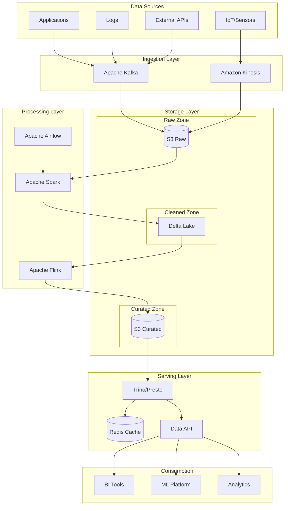
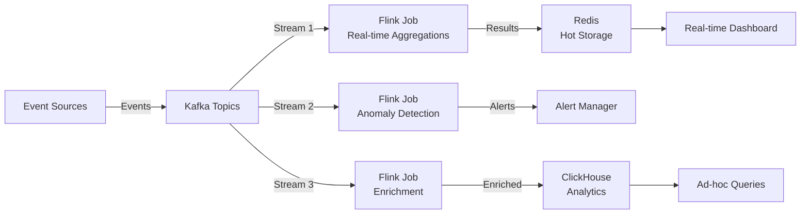
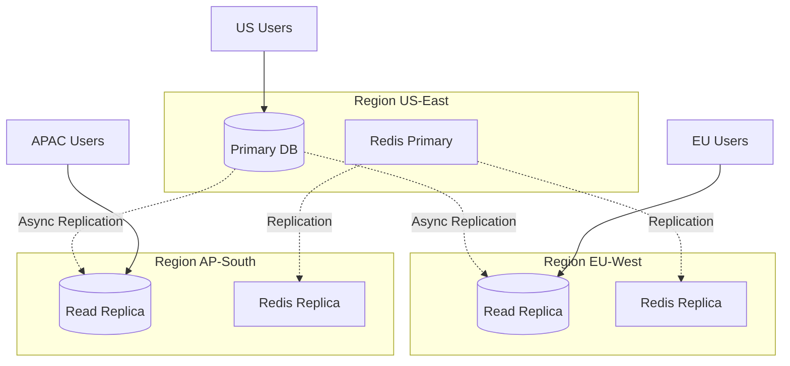

# AD-008: Data-Intensive Architecture Design

## 1. Architecture Overview

### 1.1 Definition and Philosophy

Data-intensive applications are systems where data volume, complexity, or velocity is the primary challenge. These applications are characterized by:

- **High Data Volume**: Terabytes to petabytes of data
- **High Velocity**: Thousands to millions of events per second
- **High Variety**: Structured, semi-structured, and unstructured data
- **Complex Processing**: Real-time analytics, machine learning, graph processing

The architecture focuses on:

- **Scalability**: Handling growing data volumes
- **Reliability**: Data integrity and fault tolerance
- **Maintainability**: Evolvable data systems
- **Performance**: Low-latency access and processing

### 1.2 Data System Classification

```
┌─────────────────────────────────────────────────────────────────────────────┐
│                      DATA SYSTEM TAXONOMY                                    │
├─────────────────────────────────────────────────────────────────────────────┤
│                                                                             │
│  ┌─────────────────────────────────────────────────────────────────────┐   │
│  │                      DATA STORAGE SYSTEMS                            │   │
│  │                                                                      │   │
│  │  ┌─────────────┐  ┌─────────────┐  ┌─────────────┐  ┌─────────────┐ │   │
│  │  │ Relational  │  │  Document   │  │  Wide-Column│  │    Graph    │ │   │
│  │  │ PostgreSQL  │  │  MongoDB    │  │  Cassandra  │  │   Neo4j     │ │   │
│  │  │   MySQL     │  │  DynamoDB   │  │    HBase    │  │  ArangoDB   │ │   │
│  │  └─────────────┘  └─────────────┘  └─────────────┘  └─────────────┘ │   │
│  │                                                                      │   │
│  │  ┌─────────────┐  ┌─────────────┐  ┌─────────────┐  ┌─────────────┐ │   │
│  │  │   Search    │  │    Time     │  │    Key      │  │   Object    │ │   │
│  │  │ Elasticsearch│  │   Series    │  │   Value     │  │   Storage   │ │   │
│  │  │    Solr     │  │InfluxDB/TSDB│  │    Redis    │  │ S3/MinIO    │ │   │
│  │  └─────────────┘  └─────────────┘  └─────────────┘  └─────────────┘ │   │
│  └─────────────────────────────────────────────────────────────────────┘   │
│                                                                             │
│  ┌─────────────────────────────────────────────────────────────────────┐   │
│  │                      DATA PROCESSING SYSTEMS                         │   │
│  │                                                                      │   │
│  │  ┌─────────────────┐  ┌─────────────────┐  ┌─────────────────────┐  │   │
│  │  │  Batch Processing│  │ Stream Processing│  │  Interactive Query  │  │   │
│  │  │   Apache Spark   │  │ Apache Flink    │  │   Apache Drill      │  │   │
│  │  │   Apache Hadoop  │  │ Kafka Streams   │  │   Presto/Trino      │  │   │
│  │  │   Databricks     │  │ Apache Storm    │  │   Apache Impala     │  │   │
│  │  └─────────────────┘  └─────────────────┘  └─────────────────────┘  │   │
│  └─────────────────────────────────────────────────────────────────────┘   │
│                                                                             │
│  ┌─────────────────────────────────────────────────────────────────────┐   │
│  │                      DATA INTEGRATION PATTERNS                       │   │
│  │                                                                      │   │
│  │  ETL (Extract-Transform-Load)  →  Traditional data warehousing      │   │
│  │  ELT (Extract-Load-Transform)  →  Modern cloud data lakes           │   │
│  │  CDC (Change Data Capture)     →  Real-time data synchronization    │   │
│  │  Event Sourcing               →  Audit trail and replay             │   │
│  └─────────────────────────────────────────────────────────────────────┘   │
│                                                                             │
└─────────────────────────────────────────────────────────────────────────────┘
```

### 1.3 CAP and PACELC Theorems

```
┌─────────────────────────────────────────────────────────────────────────────┐
│                      CAP THEOREM IN PRACTICE                                 │
├─────────────────────────────────────────────────────────────────────────────┤
│                                                                             │
│                            CAP Triangle                                     │
│                                                                             │
│                               Consistency                                   │
│                              (All nodes see                                 │
│                               same data)                                    │
│                                    △                                        │
│                                   /  \                                      │
│                                  /    \                                     │
│                                 /      \                                    │
│                                /   CP   \                                   │
│                               /  Systems  \                                  │
│                              /              \                               │
│                             /                \                              │
│            Availability    /──────────────────\    Partition                │
│            (Every request /      AP Systems    \    Tolerance               │
│             gets response/                      \    (System works           │
│                         /       CA Systems       \    despite network        │
│                        /  (Single-node, network   \    failures)             │
│                       /      failures = system      \                        │
│                      /          failure)             \                       │
│                     ▽────────────────────────────────▽                      │
│                                                                             │
│  System Examples:                                                           │
│  ┌─────────────┬─────────────┬─────────────────────────────────────┐       │
│  │    CP       │     AP      │                CA                   │       │
│  ├─────────────┼─────────────┼─────────────────────────────────────┤       │
│  │ MongoDB     │ Cassandra   │ Traditional RDBMS (single node)     │       │
│  │ HBase       │ DynamoDB    │                                     │       │
│  │ Redis (sent)│ Couchbase   │ Note: CA only works when there are  │       │
│  │ etcd        │ Riak        │ no partitions (network is reliable) │       │
│  │ Consul      │ SimpleDB    │                                     │       │
│  │ ZooKeeper   │ Voldemort   │                                     │       │
│  └─────────────┴─────────────┴─────────────────────────────────────┘       │
│                                                                             │
│  PACELC Theorem (Extended CAP):                                             │
│  If there is a Partition (P), how does the system tradeoff between          │
│  Availability (A) and Consistency (C);                                      │
│  Else (E), when the system is running normally, how does it tradeoff        │
│  between Latency (L) and Consistency (C)?                                   │
│                                                                             │
└─────────────────────────────────────────────────────────────────────────────┘
```

---

## 2. Architecture Patterns

### 2.1 Lambda Architecture

```
┌─────────────────────────────────────────────────────────────────────────────┐
│                      LAMBDA ARCHITECTURE                                     │
├─────────────────────────────────────────────────────────────────────────────┤
│                                                                             │
│  ┌─────────────────────────────────────────────────────────────────────┐   │
│  │                         DATA SOURCES                                 │   │
│  │  ┌─────────┐  ┌─────────┐  ┌─────────┐  ┌─────────┐  ┌─────────┐   │   │
│  │  │  Logs   │  │ Events  │  │  IoT    │  │   DB    │  │  Files  │   │   │
│  │  └────┬────┘  └────┬────┘  └────┬────┘  └────┬────┘  └────┬────┘   │   │
│  │       └─────────────┴─────────────┴─────────────┴─────────────┘      │   │
│  └──────────────────────────────────┬──────────────────────────────────┘   │
│                                     │                                       │
│                              ┌──────┴──────┐                                │
│                              │  Ingestion  │                                │
│                              │    Layer    │                                │
│                              └──────┬──────┘                                │
│                                     │                                       │
│                    ┌────────────────┼────────────────┐                      │
│                    │                │                │                      │
│                    ▼                ▼                ▼                      │
│          ┌────────────────┐ ┌──────────────┐ ┌──────────────┐               │
│          │   BATCH LAYER  │ │ SPEED LAYER  │ │  SERVING     │               │
│          │                │ │              │ │  LAYER       │               │
│          │ ┌────────────┐ │ │ ┌──────────┐ │ │              │               │
│          │ │   Store    │ │ │ │  Stream  │ │ │ ┌──────────┐ │               │
│          │ │  Immutable │ │ │ │Processing│ │ │ │  Batch   │ │               │
│          │ │   Dataset  │ │ │ │          │ │ │ │  Views   │ │               │
│          │ └─────┬──────┘ │ │ └────┬─────┘ │ │ └────┬─────┘ │               │
│          │       │        │ │      │       │ │      │       │               │
│          │ ┌─────▼──────┐ │ │ ┌────▼─────┐ │ │ ┌────▼─────┐ │               │
│          │ │  Compute   │ │ │ │ Real-time│ │ │ │ Real-time│ │               │
│          │ │   Views    │ │ │ │  Views   │ │ │ │  Merge   │ │               │
│          │ └─────┬──────┘ │ │ └────┬─────┘ │ │ └────┬─────┘ │               │
│          └───────┼────────┘ └──────┼───────┘ └──────┼───────┘               │
│                  │                 │                │                       │
│                  └─────────────────┴────────────────┘                       │
│                                    │                                        │
│                                    ▼                                        │
│                           ┌─────────────────┐                               │
│                           │   QUERY LAYER   │                               │
│                           │  Merged Results │                               │
│                           │  (Batch + Real- │                               │
│                           │     time)       │                               │
│                           └─────────────────┘                               │
│                                                                             │
│  Characteristics:                                                           │
│  • Batch layer: High latency, high accuracy (complete dataset)              │
│  • Speed layer: Low latency, approximate (recent data only)                 │
│  • Serving layer: Merges both for complete, timely answers                  │
│                                                                             │
└─────────────────────────────────────────────────────────────────────────────┘
```

```go
// Lambda Architecture Implementation
package lambda

import (
    "context"
    "time"

    "github.com/apache/spark/sql"
    "github.com/confluentinc/ksql"
)

// Batch Layer: Process historical data
type BatchLayer struct {
    sparkSession *sql.SparkSession
    storage      BatchStorage
}

func (bl *BatchLayer) ProcessBatch(ctx context.Context, date time.Time) error {
    // Read raw data from data lake
    rawData := bl.sparkSession.Read().
        Option("basePath", "/data/raw").
        Parquet(fmt.Sprintf("/data/raw/date=%s", date.Format("2006-01-02")))

    // Transform and aggregate
    aggregated := rawData.GroupBy("user_id").
        Agg(
            functions.Sum("amount").Alias("total_spend"),
            functions.Count("*").Alias("transaction_count"),
            functions.Max("timestamp").Alias("last_activity"),
        )

    // Write to batch views
    aggregated.Write().
        Mode("overwrite").
        Parquet(fmt.Sprintf("/data/batch-views/user-stats/date=%s", date.Format("2006-01-02")))

    return nil
}

// Speed Layer: Process real-time stream
type SpeedLayer struct {
    ksqlClient *ksql.Client
    streams    map[string]Stream
}

func (sl *SpeedLayer) CreateRealtimeView() error {
    // Create KSQL stream for real-time aggregations
    query := `
        CREATE TABLE user_activity_realtime AS
        SELECT
            user_id,
            SUM(amount) as realtime_spend,
            COUNT(*) as realtime_transactions,
            WINDOWSTART as window_start
        FROM transactions
        WINDOW TUMBLING (SIZE 5 MINUTES)
        GROUP BY user_id
        EMIT CHANGES;
    `

    _, err := sl.ksqlClient.Execute(query)
    return err
}

// Serving Layer: Merge batch and speed views
type ServingLayer struct {
    queryEngine QueryEngine
}

func (sl *ServingLayer) Query(ctx context.Context, userID string) (*UserActivity, error) {
    // Query batch view (complete, but stale)
    batchQuery := `
        SELECT user_id, total_spend, transaction_count, last_activity
        FROM batch_views.user_stats
        WHERE user_id = ?
        ORDER BY date DESC
        LIMIT 1
    `
    batchResult, err := sl.queryEngine.Query(batchQuery, userID)
    if err != nil {
        return nil, err
    }

    // Query speed view (incomplete, but fresh)
    speedQuery := `
        SELECT user_id, realtime_spend, realtime_transactions
        FROM speed_views.user_activity_realtime
        WHERE user_id = ?
        AND window_start > ?
    `
    speedResult, err := sl.queryEngine.Query(speedQuery, userID, batchResult.LastActivity)
    if err != nil {
        // Fall back to batch only
        return batchResult.ToUserActivity(), nil
    }

    // Merge results
    return &UserActivity{
        UserID:             userID,
        TotalSpend:         batchResult.TotalSpend + speedResult.RealtimeSpend,
        TransactionCount:   batchResult.TransactionCount + speedResult.RealtimeTransactions,
        LastUpdated:        time.Now(),
    }, nil
}
```

### 2.2 Kappa Architecture

```
┌─────────────────────────────────────────────────────────────────────────────┐
│                      KAPPA ARCHITECTURE                                      │
├─────────────────────────────────────────────────────────────────────────────┤
│                                                                             │
│  ┌─────────────────────────────────────────────────────────────────────┐   │
│  │                         DATA SOURCES                                 │   │
│  │  ┌─────────┐  ┌─────────┐  ┌─────────┐  ┌─────────┐  ┌─────────┐   │   │
│  │  │  Logs   │  │ Events  │  │  IoT    │  │   DB    │  │  Files  │   │   │
│  │  └────┬────┘  └────┬────┘  └────┬────┘  └────┬────┘  └────┬────┘   │   │
│  │       └─────────────┴─────────────┴─────────────┴─────────────┘      │   │
│  └──────────────────────────────────┬──────────────────────────────────┘   │
│                                     │                                       │
│                              ┌──────┴──────┐                                │
│                              │  Ingestion  │                                │
│                              │    Queue    │                                │
│                              │  (Kafka)    │                                │
│                              └──────┬──────┘                                │
│                                     │                                       │
│                    ┌────────────────┼────────────────┐                      │
│                    │                │                │                      │
│                    ▼                ▼                ▼                      │
│           ┌──────────────┐  ┌──────────────┐  ┌──────────────┐              │
│           │   Stream 1   │  │   Stream 2   │  │   Stream N   │              │
│           │  Processing  │  │  Processing  │  │  Processing  │              │
│           │              │  │              │  │              │              │
│           │ • Real-time  │  │ • Hourly     │  │ • Daily      │              │
│           │   metrics    │  │   rollup     │  │   reports    │              │
│           └──────┬───────┘  └──────┬───────┘  └──────┬───────┘              │
│                  │                 │                 │                      │
│                  ▼                 ▼                 ▼                      │
│           ┌──────────────┐  ┌──────────────┐  ┌──────────────┐              │
│           │  Real-time   │  │   Serving    │  │   Archive    │              │
│           │    Store     │  │    Store     │  │    Store     │              │
│           │   (Redis)    │  │  (Druid)     │  │   (S3)       │              │
│           └──────────────┘  └──────────────┘  └──────────────┘              │
│                                                                             │
│  Key Insight: Only streaming processing, reprocess when needed              │
│                                                                             │
│  When to Reprocess:                                                         │
│  • Schema evolution requires new views                                      │
│  • Bug fix in processing logic                                              │
│  • New feature requires historical context                                  │
│  • Compliance/audit requirements                                            │
│                                                                             │
└─────────────────────────────────────────────────────────────────────────────┘
```

### 2.3 Data Lake Architecture

```go
// Data Lake Implementation with Lakehouse Pattern
package datalake

import (
    "context"
    "fmt"
    "time"

    "github.com/databricks/delta-go"
)

// Data Lake Zones
type Zone string

const (
    ZoneRaw      Zone = "raw"      // Immutable source data
    ZoneCleaned  Zone = "cleaned"  // Validated, cleaned data
    ZoneCurated  Zone = "curated"  // Business-level aggregates
    ZoneSandbox  Zone = "sandbox"  // Experimental/prototyping
)

// DataLakeManager manages multi-zone data lake
type DataLakeManager struct {
    storage    StorageInterface
    metastore  Metastore
    catalog    DataCatalog
}

// Ingest raw data with metadata tracking
func (dlm *DataLakeManager) IngestRaw(ctx context.Context, source DataSource, data DataBatch) error {
    // Generate unique path with partitioning
    path := fmt.Sprintf("s3://datalake/raw/%s/%s/%s",
        source.Name,
        data.ArrivalTime.Format("year=2006/month=01/day=02"),
        data.Filename)

    // Write with checksum for integrity
    checksum := calculateChecksum(data.Content)
    if err := dlm.storage.Write(ctx, path, data.Content); err != nil {
        return err
    }

    // Register in metastore
    metadata := DataAssetMetadata{
        Path:        path,
        Source:      source.Name,
        Format:      data.Format,
        Size:        data.Size,
        Checksum:    checksum,
        RecordCount: data.RecordCount,
        Schema:      data.Schema,
        IngestedAt:  time.Now(),
        Partitions:  []string{"year", "month", "day"},
        Tags:        source.Tags,
    }

    return dlm.metastore.Register(ctx, metadata)
}

// Transform data between zones using Delta Lake
type TransformationPipeline struct {
    deltaTable *delta.Table
}

func (tp *TransformationPipeline) CleanRawData(ctx context.Context, date time.Time) error {
    // Read raw data
    rawDF := tp.deltaTable.Read().
        Format("delta").
        Load("/data-lake/raw/events")

    // Apply transformations
    cleanedDF := rawDF.
        Filter("_corrupt_record IS NULL").
        WithColumn("processed_at", current_timestamp()).
        WithColumn("year", year(col("timestamp"))).
        WithColumn("month", month(col("timestamp"))).
        WithColumn("day", dayofmonth(col("timestamp"))).
        DropDuplicates("event_id")

    // Write to cleaned zone with ACID guarantees
    return cleanedDF.Write().
        Format("delta").
        Mode("overwrite").
        PartitionBy("year", "month", "day").
        Save("/data-lake/cleaned/events")
}

// Unified Batch and Streaming with Delta Lake
func (tp *TransformationPipeline) UnifiedProcessing(ctx context.Context) error {
    // Stream processing with exactly-once semantics
    stream := tp.deltaTable.ReadStream().
        Format("delta").
        Load("/data-lake/cleaned/events")

    // Same transformation logic for batch and streaming
    aggregated := stream.
        WithWatermark("timestamp", "10 minutes").
        GroupBy(
            window(col("timestamp"), "5 minutes"),
            col("event_type"),
        ).
        Count()

    // Write to curated zone
    query := aggregated.WriteStream().
        Format("delta").
        OutputMode("append").
        Option("checkpointLocation", "/checkpoints/events").
        Start("/data-lake/curated/event-aggregates")

    return query.AwaitTermination()
}
```

---

## 3. Scalability Analysis

### 3.1 Scaling Strategies

| Strategy | When to Use | Implementation |
|----------|-------------|----------------|
| **Horizontal Partitioning** | Single table too large | Shard by user_id, date, region |
| **Vertical Partitioning** | Wide tables, different access patterns | Split hot/cold columns |
| **Read Replicas** | Read-heavy workloads | Async replication |
| **Caching Layer** | Frequent access to hot data | Redis/Memcached |
| **CDN** | Static content delivery | Edge caching |
| **Data Archival** | Old data rarely accessed | S3 Glacier, time-based TTL |

### 3.2 Performance Benchmarks

| Operation | Target Latency | Throughput |
|-----------|----------------|------------|
| **Point Query** | < 10ms | 100K+ QPS |
| **Range Scan** | < 100ms | 10K+ QPS |
| **Full Scan** | < 30s | 1GB/s |
| **Batch Write** | < 1s (1MB batch) | 100MB/s |
| **Stream Processing** | < 100ms end-to-end | 1M+ events/s |
| **OLAP Query** | < 5s | Complex aggregations |

---

## 4. Technology Stack Recommendations

### 4.1 Storage Technologies

| Use Case | Primary | Secondary |
|----------|---------|-----------|
| **Transactional** | PostgreSQL | CockroachDB |
| **Document** | MongoDB | DynamoDB |
| **Key-Value** | Redis | etcd |
| **Time Series** | TimescaleDB | InfluxDB |
| **Search** | Elasticsearch | OpenSearch |
| **Graph** | Neo4j | ArangoDB |
| **Data Lake** | Delta Lake | Apache Iceberg |
| **OLAP** | ClickHouse | Apache Druid |

### 4.2 Processing Technologies

| Pattern | Technology | Use Case |
|---------|------------|----------|
| **Batch** | Apache Spark | Large-scale ETL |
| **Streaming** | Apache Flink | Real-time analytics |
| **SQL** | Trino/Presto | Interactive queries |
| **Workflow** | Apache Airflow | Data pipelines |

---

## 5. Case Studies

### 5.1 Case Study: LinkedIn Data Infrastructure

**Scale:**

- 7 trillion events/day
- 500+ Kafka brokers
- Real-time and batch processing

**Architecture:**

- Kafka for event streaming
- Samza for stream processing
- Pinot for OLAP
- Spark for batch

### 5.2 Case Study: Uber's Data Platform

**Components:**

- Hadoop/HDFS for storage
- Spark for processing
- Hive/Presto for querying
- Kafka for streaming
- Pinot for real-time analytics

---

## 6. Visual Representations

### 6.1 Data Lakehouse Architecture



### 6.2 Real-time Processing Pipeline



### 6.3 Multi-Region Data Replication



---

## 7. Anti-Patterns

| Anti-Pattern | Problem | Solution |
|--------------|---------|----------|
| **Single Database** | Can't scale reads/writes independently | Read replicas, sharding |
| **No Data Partitioning** | Full table scans | Partition by time/tenant |
| **Synchronous Replication** | High write latency | Async replication |
| **Missing TTL** | Unbounded data growth | Implement data lifecycle |
| **Schema in Application** | Data inconsistency | Schema registry |

---

*Document Version: 1.0*
*Last Updated: 2026-04-02*
*Classification: S-Level Technical Reference*
