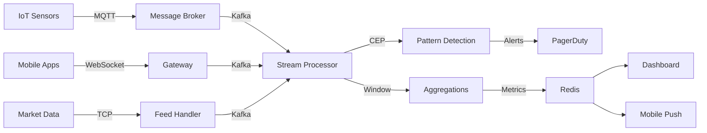
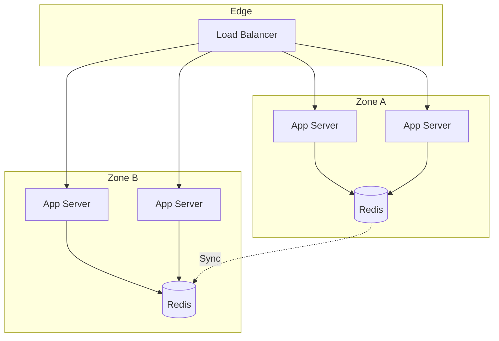
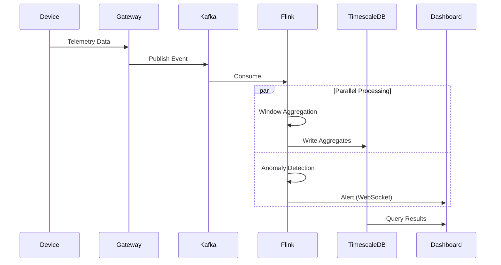

# AD-011: Real-Time System Design

## 1. Architecture Overview

### 1.1 Definition and Philosophy

Real-time systems are computing systems that must respond to external events within strict timing constraints. The response time must be predictable and bounded, making timing correctness as important as logical correctness.

**Classification by Timing Constraints:**

| Type | Deadline | Example | Consequence of Miss |
|------|----------|---------|---------------------|
| **Hard Real-Time** | Must always meet | Airbag deployment, brake control | Catastrophic failure |
| **Firm Real-Time** | Should meet | Video streaming, VoIP | Quality degradation |
| **Soft Real-Time** | Best effort | Analytics dashboard, alerts | Minor inconvenience |

**Key Characteristics:**

- **Determinism**: Predictable response times
- **Responsiveness**: Low latency under all conditions
- **Concurrency**: Handling multiple simultaneous events
- **Reliability**: Continuous operation without failure

### 1.2 Real-Time System Architecture

```
┌─────────────────────────────────────────────────────────────────────────────┐
│                    REAL-TIME SYSTEM ARCHITECTURE                             │
├─────────────────────────────────────────────────────────────────────────────┤
│                                                                             │
│  ┌─────────────────────────────────────────────────────────────────────┐   │
│  │                         DATA SOURCES                                 │   │
│  │  ┌─────────┐  ┌─────────┐  ┌─────────┐  ┌─────────┐  ┌─────────┐   │   │
│  │  │  IoT    │  │  Web    │  │ Mobile  │  │  Market │  │ Sensors │   │   │
│  │  │ Devices │  │Sockets  │  │   Apps  │  │  Data   │  │         │   │   │
│  │  └────┬────┘  └────┬────┘  └────┬────┘  └────┬────┘  └────┬────┘   │   │
│  │       └─────────────┴─────────────┴─────────────┴─────────────┘      │   │
│  └──────────────────────────────────┬──────────────────────────────────┘   │
│                                     │                                       │
│                              ┌──────┴──────┐                                │
│                              │   INGESTION  │                                │
│                              │    LAYER     │                                │
│                              └──────┬──────┘                                │
│                                     │                                       │
│                    ┌────────────────┼────────────────┐                      │
│                    │                │                │                      │
│                    ▼                ▼                ▼                      │
│           ┌──────────────┐  ┌──────────────┐  ┌──────────────┐              │
│           │   MESSAGE    │  │   STREAM     │  │   COMPLEX    │              │
│           │    QUEUE     │  │  PROCESSING  │  │   EVENT      │              │
│           │              │  │              │  │  PROCESSING  │              │
│           │ • Ordering   │  │ • Windows    │  │ • Patterns   │              │
│           │ • Batching   │  │ • Joins      │  │ • Rules      │              │
│           │ • Routing    │  │ • State      │  │ • Aggregates │              │
│           └──────┬───────┘  └──────┬───────┘  └──────┬───────┘              │
│                  │                 │                 │                      │
│                  └─────────────────┼─────────────────┘                      │
│                                    │                                        │
│                           ┌────────┴────────┐                               │
│                           │  DECISION LAYER │                               │
│                           │                 │                               │
│                           │ • ML Inference  │                               │
│                           │ • Rule Engine   │                               │
│                           │ • Optimization  │                               │
│                           └────────┬────────┘                               │
│                                    │                                        │
│                    ┌───────────────┼───────────────┐                        │
│                    ▼               ▼               ▼                        │
│           ┌──────────────┐ ┌──────────────┐ ┌──────────────┐              │
│           │   ACTIONS    │ │   ALERTS     │ │  STORAGE     │              │
│           │              │ │              │ │              │              │
│           │ • Control    │ │ • PagerDuty  │ │ • Hot Store  │              │
│           │ • Trading    │ │ • Slack      │ │ • Cold Store │              │
│           │ • Automation │ │ • SMS        │ │ • Archive    │              │
│           └──────────────┘ └──────────────┘ └──────────────┘              │
│                                                                             │
└─────────────────────────────────────────────────────────────────────────────┘
```

---

## 2. Design Patterns

### 2.1 Stream Processing Patterns

#### 2.1.1 Event Time vs Processing Time

```go
// Windowed Stream Processing with Watermarks
package streamprocessing

import (
    "context"
    "time"

    "github.com/apache/flink-go/pkg/flink"
)

// WatermarkStrategy defines how watermarks are generated
type WatermarkStrategy struct {
    maxOutOfOrderness time.Duration
    idlenessTimeout   time.Duration
}

func (ws *WatermarkStrategy) CreateWatermarkGenerator() WatermarkGenerator {
    return &BoundedOutOfOrdernessGenerator{
        maxOutOfOrderness: ws.maxOutOfOrderness,
        currentMaxTimestamp: 0,
    }
}

// Tumbling Window Aggregation
func TumblingWindowExample() {
    env := flink.NewExecutionEnvironment()

    stream := env.AddSource(&KafkaSource{
        Topic:     "events",
        Brokers:   []string{"kafka:9092"},
        Deserializer: &JSONDeserializer{},
    })

    // Assign timestamps and watermarks
    withTimestamps := stream.
        AssignTimestampsAndWatermarks(
            WatermarkStrategy.
                ForBoundedOutOfOrderness[Event](time.Second * 5).
                WithTimestampAssigner(func(event Event) int64 {
                    return event.Timestamp.UnixMilli()
                }),
        )

    // Tumbling window: 5-minute fixed windows
    tumblingResult := withTimestamps.
        KeyBy(func(e Event) string { return e.UserID }).
        Window(TumblingEventTimeWindows.of(Time.minutes(5))).
        Aggregate(func(acc AggregatedStats, e Event) AggregatedStats {
            return acc.Add(e)
        }, func(acc AggregatedStats) SessionStats {
            return acc.ToStats()
        })

    // Sliding window: 10-minute windows every 1 minute
    slidingResult := withTimestamps.
        KeyBy(func(e Event) string { return e.UserID }).
        Window(SlidingEventTimeWindows.of(Time.minutes(10), Time.minutes(1))).
        Aggregate(new AverageAggregate())

    // Session window: Dynamic gap-based windows
    sessionResult := withTimestamps.
        KeyBy(func(e Event) string { return e.UserID }).
        Window(EventTimeSessionWindows.withDynamicGap(func(e Event) time.Duration {
            // Longer sessions for premium users
            if e.UserTier == "premium" {
                return time.Minute * 30
            }
            return time.Minute * 10
        })).
        AllowedLateness(time.Minute * 5).
        SideOutputLateData(lateDataTag).
        Aggregate(new SessionAggregate())

    tumblingResult.AddSink(&ClickHouseSink{Table: "user_stats_5min"})
    slidingResult.AddSink(&ClickHouseSink{Table: "user_stats_sliding"})
    sessionResult.AddSink(&RedisSink{KeyPrefix: "session:"})

    env.Execute("Real-time Analytics")
}
```

#### 2.1.2 Complex Event Processing (CEP)

```go
// CEP Pattern Detection
package cep

import (
    "context"
    "time"
)

// Fraud Detection Pattern Example
type FraudPatternDetector struct {
    pattern Pattern
    engine  CEPEngine
}

func NewFraudDetector() *FraudPatternDetector {
    // Define fraud pattern:
    // 3+ transactions within 10 minutes from different countries
    pattern := Pattern.
        Begin[Transaction]("first").
        Where(func(t Transaction) bool {
            return t.Amount > 100
        }).
        FollowedBy[Transaction]("second").
        Where(func(t Transaction) bool {
            return t.Amount > 100
        }).
        Where(func(first, second Transaction) bool {
            return first.Country != second.Country &&
                second.Timestamp.Sub(first.Timestamp) < 10*time.Minute
        }).
        FollowedBy[Transaction]("third").
        Where(func(t Transaction) bool {
            return t.Amount > 100
        }).
        Where(func(prev, current Transaction) bool {
            return prev.Country != current.Country
        }).
        Within(10 * time.Minute)

    return &FraudPatternDetector{pattern: pattern}
}

func (fd *FraudPatternDetector) Detect(ctx context.Context, stream EventStream) {
    matches := fd.engine.Process(stream, fd.pattern)

    for match := range matches {
        // Extract matched events
        first := match.Get("first").(Transaction)
        second := match.Get("second").(Transaction)
        third := match.Get("third").(Transaction)

        // Raise fraud alert
        alert := FraudAlert{
            UserID:        first.UserID,
            PatternType:   "RapidMultiCountry",
            Transactions:  []Transaction{first, second, third},
            RiskScore:     calculateRiskScore(first, second, third),
            DetectedAt:    time.Now(),
        }

        fd.sendAlert(ctx, alert)
        fd.blockAccount(ctx, first.UserID, "suspicious_activity")
    }
}
```

### 2.2 Low-Latency Communication

```go
// WebSocket Server for Real-Time Updates
package realtime

import (
    "context"
    "net/http"
    "sync"
    "time"

    "github.com/gorilla/websocket"
)

// Hub maintains active connections and broadcasts messages
type Hub struct {
    clients    map[string]*Client
    broadcast  chan Message
    register   chan *Client
    unregister chan *Client
    rooms      map[string]map[*Client]bool
    mu         sync.RWMutex
}

type Client struct {
    hub      *Hub
    conn     *websocket.Conn
    send     chan []byte
    userID   string
    rooms    map[string]bool
}

func NewHub() *Hub {
    return &Hub{
        clients:    make(map[string]*Client),
        broadcast:  make(chan Message, 256),
        register:   make(chan *Client),
        unregister: make(chan *Client),
        rooms:      make(map[string]map[*Client]bool),
    }
}

func (h *Hub) Run() {
    for {
        select {
        case client := <-h.register:
            h.mu.Lock()
            h.clients[client.userID] = client
            h.mu.Unlock()

        case client := <-h.unregister:
            h.mu.Lock()
            if _, ok := h.clients[client.userID]; ok {
                delete(h.clients, client.userID)
                close(client.send)

                // Remove from all rooms
                for roomID := range client.rooms {
                    delete(h.rooms[roomID], client)
                }
            }
            h.mu.Unlock()

        case message := <-h.broadcast:
            h.mu.RLock()

            switch message.Type {
            case BroadcastAll:
                for _, client := range h.clients {
                    select {
                    case client.send <- message.Data:
                    default:
                        // Channel full, drop message
                    }
                }

            case BroadcastRoom:
                if clients, ok := h.rooms[message.RoomID]; ok {
                    for client := range clients {
                        select {
                        case client.send <- message.Data:
                        default:
                            // Channel full
                        }
                    }
                }

            case DirectMessage:
                if client, ok := h.clients[message.TargetUserID]; ok {
                    select {
                    case client.send <- message.Data:
                    default:
                        // Channel full
                    }
                }
            }

            h.mu.RUnlock()
        }
    }
}

func (c *Client) ReadPump() {
    defer func() {
        c.hub.unregister <- c
        c.conn.Close()
    }()

    c.conn.SetReadLimit(maxMessageSize)
    c.conn.SetReadDeadline(time.Now().Add(pongWait))
    c.conn.SetPongHandler(func(string) error {
        c.conn.SetReadDeadline(time.Now().Add(pongWait))
        return nil
    })

    for {
        _, message, err := c.conn.ReadMessage()
        if err != nil {
            if websocket.IsUnexpectedCloseError(err, websocket.CloseGoingAway, websocket.CloseAbnormalClosure) {
                log.Printf("error: %v", err)
            }
            break
        }

        // Process incoming message
        c.handleMessage(message)
    }
}

func (c *Client) WritePump() {
    ticker := time.NewTicker(pingPeriod)
    defer func() {
        ticker.Stop()
        c.conn.Close()
    }()

    for {
        select {
        case message, ok := <-c.send:
            c.conn.SetWriteDeadline(time.Now().Add(writeWait))
            if !ok {
                c.conn.WriteMessage(websocket.CloseMessage, []byte{})
                return
            }

            w, err := c.conn.NextWriter(websocket.TextMessage)
            if err != nil {
                return
            }
            w.Write(message)

            // Add queued messages
            n := len(c.send)
            for i := 0; i < n; i++ {
                w.Write(newline)
                w.Write(<-c.send)
            }

            if err := w.Close(); err != nil {
                return
            }

        case <-ticker.C:
            c.conn.SetWriteDeadline(time.Now().Add(writeWait))
            if err := c.conn.WriteMessage(websocket.PingMessage, nil); err != nil {
                return
            }
        }
    }
}
```

---

## 3. Scalability Analysis

### 3.1 Latency Budget

```
┌─────────────────────────────────────────────────────────────────────────────┐
│                    REAL-TIME LATENCY BUDGET (100ms Target)                   │
├─────────────────────────────────────────────────────────────────────────────┤
│                                                                             │
│  Component                    Latency Allocation                            │
│  ─────────────────────────────────────────────────────────                  │
│                                                                             │
│  Network (Client→Server)      ████████████████ 20ms                        │
│  Load Balancer                ████████ 10ms                                │
│  Message Queue                ████████████████ 20ms                        │
│  Stream Processing            ██████████████████████ 30ms                  │
│  Decision Engine              ██████████ 15ms                              │
│  Response (Server→Client)     ██████ 5ms                                   │
│                                                                             │
│  ─────────────────────────────────────────────────────────                  │
│  Total                        ████████████████████████████████████ 100ms   │
│                                                                             │
│  Buffer for unpredictability: 10ms (90ms hard limit)                        │
│                                                                             │
└─────────────────────────────────────────────────────────────────────────────┘
```

### 3.2 Scaling Strategies

| Strategy | Use Case | Implementation |
|----------|----------|----------------|
| **Partitioning** | High throughput streams | Kafka partitioning by key |
| **Pipelining** | CPU-bound processing | Stage separation |
| **Parallelism** | Independent operations | Worker pools |
| **Load Shedding** | Overload protection | Drop non-critical data |
| **Backpressure** | Resource protection | Rate limiting, buffering |

---

## 4. Technology Stack

| Component | Technology | Latency |
|-----------|------------|---------|
| **Streaming** | Apache Kafka, Pulsar | < 10ms |
| **Processing** | Apache Flink, Kafka Streams | < 50ms |
| **CEP** | Esper, Siddhi, Flink CEP | < 10ms |
| **Storage** | Redis, Aerospike | < 1ms |
| **Pub/Sub** | NATS, Redis Pub/Sub | < 1ms |
| **Messaging** | ZeroMQ, nanomsg | < 100μs |

---

## 5. Case Studies

### 5.1 Financial Trading System

**Requirements:**

- Market data latency: < 10μs
- Order execution: < 100μs
- 99.99% uptime

**Architecture:**

- FPGA-based market data feed handlers
- Kernel bypass networking (DPDK)
- Shared memory IPC
- Lock-free data structures

### 5.2 IoT Telemetry Platform

**Scale:**

- 10M connected devices
- 1M events/second
- < 1s alert latency

**Architecture:**

- MQTT brokers with clustering
- Apache Flink for processing
- InfluxDB for time-series
- Grafana for real-time dashboards

---

## 6. Visual Representations

### 6.1 Real-Time Processing Pipeline



### 6.2 Latency-Optimized Architecture



### 6.3 Event Processing Flow



---

## 7. Anti-Patterns

| Anti-Pattern | Problem | Solution |
|--------------|---------|----------|
| **Synchronous Processing** | Blocking delays | Async with callbacks |
| **No Backpressure** | System overload | Flow control mechanisms |
| **Global Locks** | Contention | Lock-free structures |
| **Unbounded Queues** | Memory exhaustion | Bounded queues with dropping |
| **Single Thread** | Bottleneck | Event loops, worker pools |

---

*Document Version: 1.0*
*Last Updated: 2026-04-02*
*Classification: S-Level Technical Reference*
