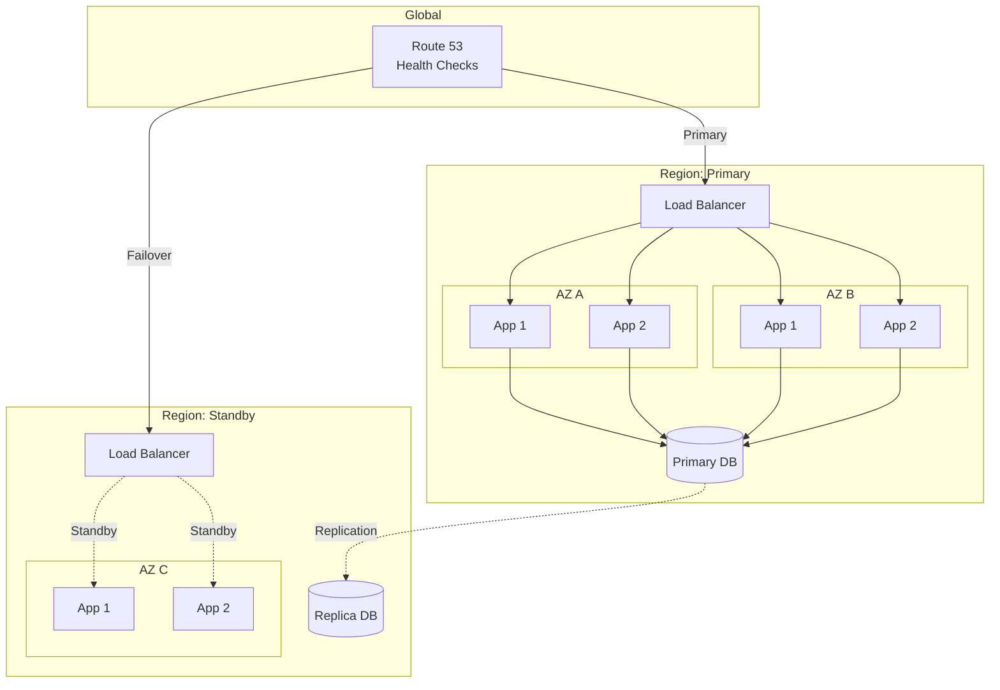
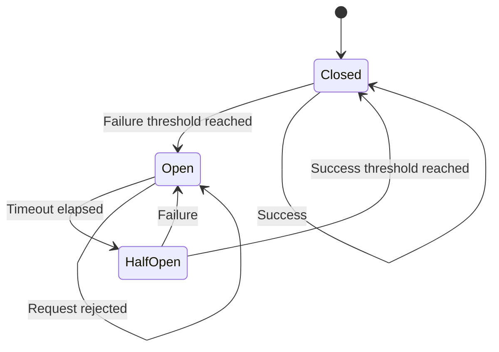
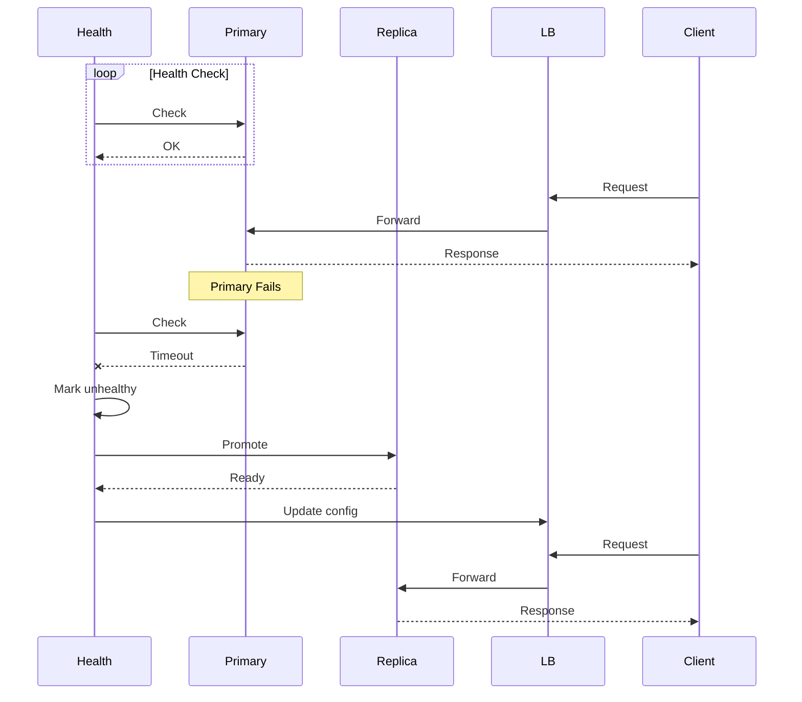

# AD-012: High Availability Design

## 1. Architecture Overview

### 1.1 Definition and Philosophy

High Availability (HA) refers to systems that are durable and likely to operate continuously without failure for a long time. The goal is to ensure an agreed level of operational performance, usually uptime, for a higher than normal period.

**Availability Metrics:**

| Availability Level | Downtime per Year | Description |
|-------------------|-------------------|-------------|
| 99% (Two Nines) | 3.65 days | Unmanaged |
| 99.9% (Three Nines) | 8.76 hours | Managed |
| 99.99% (Four Nines) | 52.6 minutes | High Availability |
| 99.999% (Five Nines) | 5.26 minutes | Very High Availability |
| 99.9999% (Six Nines) | 31.5 seconds | Ultra High Availability |

**Key Principles:**

- **Redundancy**: No single point of failure
- **Fault Tolerance**: Continue operating during failures
- **Automatic Failover**: Detect and recover without human intervention
- **Graceful Degradation**: Reduced functionality vs. complete failure

### 1.2 High Availability Architecture Patterns

```
┌─────────────────────────────────────────────────────────────────────────────┐
│                    HIGH AVAILABILITY ARCHITECTURE                            │
├─────────────────────────────────────────────────────────────────────────────┤
│                                                                             │
│  ┌─────────────────────────────────────────────────────────────────────┐   │
│  │                         GLOBAL LAYER                                 │   │
│  │  ┌─────────────┐  ┌─────────────┐  ┌─────────────┐  ┌─────────────┐ │   │
│  │  │   DNS       │  │   CDN       │  │   WAF       │  │   DDoS      │ │   │
│  │  │  Route 53   │  │ CloudFront  │  │    AWS      │  │  Protection │ │   │
│  │  │             │  │             │  │   Shield    │  │             │ │   │
│  │  └─────────────┘  └─────────────┘  └─────────────┘  └─────────────┘ │   │
│  └─────────────────────────────────────────────────────────────────────┘   │
│                                    │                                        │
│                                    ▼                                        │
│  ┌─────────────────────────────────────────────────────────────────────┐   │
│  │                      MULTI-REGION LAYER                              │   │
│  │                                                                      │   │
│  │   ┌─────────────────────┐  ┌─────────────────────┐                  │   │
│  │   │     Region A        │  │     Region B        │                  │   │
│  │   │   ┌─────────────┐   │  │   ┌─────────────┐   │                  │   │
│  │   │   │   AZ 1      │   │  │   │   AZ 3      │   │                  │   │
│  │   │   │  ┌───────┐  │   │  │   │  ┌───────┐  │   │                  │   │
│  │   │   │  │App 1A │  │   │  │   │  │App 1B │  │   │                  │   │
│  │   │   │  └───────┘  │   │  │   │  └───────┘  │   │                  │   │
│  │   │   │  ┌───────┐  │   │  │   │  ┌───────┐  │   │                  │   │
│  │   │   │  │App 2A │  │   │  │   │  │App 2B │  │   │                  │   │
│  │   │   │  └───────┘  │   │  │   │  └───────┘  │   │                  │   │
│  │   │   └─────────────┘   │  │   └─────────────┘   │                  │   │
│  │   │   ┌─────────────┐   │  │   ┌─────────────┐   │                  │   │
│  │   │   │   AZ 2      │   │  │   │   AZ 4      │   │                  │   │
│  │   │   │  (Standby)  │   │  │   │  (Standby)  │   │                  │   │
│  │   │   └─────────────┘   │  │   └─────────────┘   │                  │   │
│  │   └─────────────────────┘  └─────────────────────┘                  │   │
│  │                                                                      │   │
│  │   Active-Active Configuration with Cross-Region Replication         │   │
│  └─────────────────────────────────────────────────────────────────────┘   │
│                                    │                                        │
│                                    ▼                                        │
│  ┌─────────────────────────────────────────────────────────────────────┐   │
│  │                        DATA LAYER                                    │   │
│  │  ┌─────────────┐  ┌─────────────┐  ┌─────────────┐  ┌─────────────┐ │   │
│  │  │  Primary    │  │  Replica    │  │   Read      │  │   Cross     │ │   │
│  │  │   Store     │  │   Store     │  │  Replica    │  │   Region    │ │   │
│  │  │             │  │             │  │             │  │   Replica   │ │   │
│  │  └─────────────┘  └─────────────┘  └─────────────┘  └─────────────┘ │   │
│  │                                                                      │   │
│  │  Synchronous: 0ms RPO │ Asynchronous: <1s-60s RPO                   │   │
│  └─────────────────────────────────────────────────────────────────────┘   │
│                                                                             │
└─────────────────────────────────────────────────────────────────────────────┘
```

---

## 2. Design Patterns

### 2.1 Redundancy Patterns

#### 2.1.1 Active-Active Configuration

```go
// Multi-Region Active-Active Implementation
package ha

import (
    "context"
    "sync"
    "time"
)

// RegionManager manages multi-region deployment
type RegionManager struct {
    regions       map[string]*Region
    healthChecker HealthChecker
    router        TrafficRouter
    mu            sync.RWMutex
}

type Region struct {
    ID            string
    Endpoint      string
    Status        RegionStatus
    HealthScore   float64
    Latency       time.Duration
    LastChecked   time.Time
}

type RegionStatus int

const (
    RegionHealthy RegionStatus = iota
    RegionDegraded
    RegionUnhealthy
    RegionMaintenance
)

func (rm *RegionManager) Route(ctx context.Context, request Request) (Response, error) {
    // Get healthy regions
    regions := rm.getHealthyRegions()
    if len(regions) == 0 {
        return Response{}, ErrNoHealthyRegions
    }

    // Route based on latency and load
    region := rm.router.Select(regions, request)

    // Execute with failover
    return rm.executeWithFailover(ctx, region, request)
}

func (rm *RegionManager) executeWithFailover(ctx context.Context, primary *Region, request Request) (Response, error) {
    // Try primary
    response, err := rm.execute(ctx, primary, request)
    if err == nil {
        return response, nil
    }

    // Mark primary unhealthy
    rm.markUnhealthy(primary)

    // Try other regions
    for _, region := range rm.getHealthyRegions() {
        if region.ID == primary.ID {
            continue
        }

        response, err = rm.execute(ctx, region, request)
        if err == nil {
            return response, nil
        }
    }

    return Response{}, ErrAllRegionsFailed
}

// Conflict-free Replicated Data Type (CRDT) for Active-Active
// Allows concurrent writes in multiple regions

type CRDTCounter struct {
    values map[string]int64 // region -> value
    mu     sync.RWMutex
}

func (c *CRDTCounter) Increment(region string, delta int64) {
    c.mu.Lock()
    defer c.mu.Unlock()
    c.values[region] += delta
}

func (c *CRDTCounter) Merge(other *CRDTCounter) {
    c.mu.Lock()
    defer c.mu.Unlock()

    for region, value := range other.values {
        if value > c.values[region] {
            c.values[region] = value
        }
    }
}

func (c *CRDTCounter) Value() int64 {
    c.mu.RLock()
    defer c.mu.RUnlock()

    var total int64
    for _, v := range c.values {
        total += v
    }
    return total
}
```

#### 2.1.2 Circuit Breaker with Health Checks

```go
// Advanced Circuit Breaker with Health Checks
package ha

import (
    "context"
    "sync"
    "time"
)

type AdaptiveCircuitBreaker struct {
    name           string

    // Thresholds
    failureThreshold    int
    successThreshold    int
    timeout             time.Duration
    halfOpenMaxCalls    int

    // State
    state          CircuitState
    failures       int
    successes      int
    consecutiveSuccesses int
    lastFailureTime time.Time
    halfOpenCalls  int

    // Health check integration
    healthChecker  HealthChecker
    recoveryFunc   RecoveryFunction

    // Metrics
    metrics        CircuitBreakerMetrics

    mu             sync.RWMutex
}

type CircuitState int

const (
    StateClosed CircuitState = iota
    StateOpen
    StateHalfOpen
)

func (cb *AdaptiveCircuitBreaker) Execute(ctx context.Context, fn func() error) error {
    if err := cb.preCall(); err != nil {
        cb.metrics.RecordRejection(cb.name)
        return err
    }

    err := fn()
    cb.postCall(err)

    return err
}

func (cb *AdaptiveCircuitBreaker) preCall() error {
    cb.mu.Lock()
    defer cb.mu.Unlock()

    switch cb.state {
    case StateClosed:
        return nil

    case StateOpen:
        // Check if recovery time elapsed
        if time.Since(cb.lastFailureTime) > cb.timeout {
            // Perform health check before allowing traffic
            if cb.healthChecker.Check(cb.name) {
                cb.transitionTo(StateHalfOpen)
                cb.halfOpenCalls = 0
                return nil
            }
        }
        return ErrCircuitOpen

    case StateHalfOpen:
        if cb.halfOpenCalls >= cb.halfOpenMaxCalls {
            return ErrCircuitOpen
        }
        cb.halfOpenCalls++
        return nil
    }

    return nil
}

func (cb *AdaptiveCircuitBreaker) postCall(err error) {
    cb.mu.Lock()
    defer cb.mu.Unlock()

    if err == nil {
        cb.handleSuccess()
    } else {
        cb.handleFailure()
    }
}

func (cb *AdaptiveCircuitBreaker) handleSuccess() {
    cb.consecutiveSuccesses++

    switch cb.state {
    case StateHalfOpen:
        if cb.consecutiveSuccesses >= cb.successThreshold {
            cb.transitionTo(StateClosed)
        }

    case StateClosed:
        // Decay failure count slowly
        if cb.failures > 0 {
            cb.failures--
        }
    }

    cb.metrics.RecordSuccess(cb.name)
}

func (cb *AdaptiveCircuitBreaker) handleFailure() {
    cb.failures++
    cb.consecutiveSuccesses = 0
    cb.lastFailureTime = time.Now()

    switch cb.state {
    case StateHalfOpen:
        cb.transitionTo(StateOpen)
        // Trigger recovery procedure
        if cb.recoveryFunc != nil {
            go cb.recoveryFunc()
        }

    case StateClosed:
        if cb.failures >= cb.failureThreshold {
            cb.transitionTo(StateOpen)
        }
    }

    cb.metrics.RecordFailure(cb.name)
}

func (cb *AdaptiveCircuitBreaker) transitionTo(newState CircuitState) {
    oldState := cb.state
    cb.state = newState

    // Reset counters
    switch newState {
    case StateClosed:
        cb.failures = 0
        cb.consecutiveSuccesses = 0
        cb.halfOpenCalls = 0
    case StateHalfOpen:
        cb.consecutiveSuccesses = 0
    }

    cb.metrics.RecordStateChange(cb.name, oldState, newState)
}
```

### 2.2 Failover Patterns

#### 2.2.1 Database Failover

```go
// Database Failover Manager
package ha

import (
    "context"
    "database/sql"
    "sync"
    "time"
)

type FailoverDB struct {
    primary     *sql.DB
    replicas    []*sql.DB
    current     *sql.DB

    healthCheckInterval time.Duration
    failoverTimeout     time.Duration

    mu          sync.RWMutex
    isFailover  bool

    // Health tracking
    healthStates map[*sql.DB]HealthState
}

type HealthState struct {
    IsHealthy     bool
    LastChecked   time.Time
    Latency       time.Duration
    Error         error
}

func (fdb *FailoverDB) QueryContext(ctx context.Context, query string, args ...interface{}) (*sql.Rows, error) {
    db := fdb.getReadDB()
    return db.QueryContext(ctx, query, args...)
}

func (fdb *FailoverDB) ExecContext(ctx context.Context, query string, args ...interface{}) (sql.Result, error) {
    // Always use primary for writes
    return fdb.primary.ExecContext(ctx, query, args...)
}

func (fdb *FailoverDB) getReadDB() *sql.DB {
    fdb.mu.RLock()
    defer fdb.mu.RUnlock()

    if fdb.isFailover && len(fdb.replicas) > 0 {
        // Return a healthy replica
        for _, db := range fdb.replicas {
            if state, ok := fdb.healthStates[db]; ok && state.IsHealthy {
                return db
            }
        }
    }

    return fdb.current
}

func (fdb *FailoverDB) StartHealthChecks() {
    ticker := time.NewTicker(fdb.healthCheckInterval)
    go func() {
        for range ticker.C {
            fdb.checkHealth()
        }
    }()
}

func (fdb *FailoverDB) checkHealth() {
    // Check primary
    primaryHealthy := fdb.checkDBHealth(fdb.primary)

    fdb.mu.Lock()
    defer fdb.mu.Unlock()

    fdb.healthStates[fdb.primary] = primaryHealthy

    if !primaryHealthy.IsHealthy && !fdb.isFailover {
        // Initiate failover
        fdb.performFailover()
    } else if primaryHealthy.IsHealthy && fdb.isFailover {
        // Consider failback
        fdb.considerFailback()
    }

    // Check replicas
    for _, db := range fdb.replicas {
        fdb.healthStates[db] = fdb.checkDBHealth(db)
    }
}

func (fdb *FailoverDB) performFailover() {
    // Find best replica
    var bestReplica *sql.DB
    bestLatency := time.Hour

    for _, db := range fdb.replicas {
        if state, ok := fdb.healthStates[db]; ok && state.IsHealthy {
            if state.Latency < bestLatency {
                bestLatency = state.Latency
                bestReplica = db
            }
        }
    }

    if bestReplica != nil {
        fdb.current = bestReplica
        fdb.isFailover = true
        // Log failover event
    }
}

func (fdb *FailoverDB) considerFailback() {
    // Check if primary is healthy for some time
    // Implement hysteresis to avoid flapping
}
```

---

## 3. Scalability Analysis

### 3.1 Availability Calculation

```
┌─────────────────────────────────────────────────────────────────────────────┐
│                    AVAILABILITY CALCULATION                                  │
├─────────────────────────────────────────────────────────────────────────────┤
│                                                                             │
│  Series Availability (All components must work):                            │
│  ─────────────────────────────────────────────                              │
│                                                                             │
│  A_series = A₁ × A₂ × A₃ × ... × Aₙ                                        │
│                                                                             │
│  Example: Web Server (99.9%) → App Server (99.9%) → Database (99.9%)        │
│                                                                             │
│  A_total = 0.999 × 0.999 × 0.999 = 0.997 = 99.7%                           │
│                                                                             │
│  ─────────────────────────────────────────────                              │
│                                                                             │
│  Parallel Availability (Redundant components):                              │
│  ─────────────────────────────────────────────                              │
│                                                                             │
│  A_parallel = 1 - (1 - A₁) × (1 - A₂) × ... × (1 - Aₙ)                     │
│                                                                             │
│  Example: Two 99% databases in active-active                                │
│                                                                             │
│  A_parallel = 1 - (1 - 0.99) × (1 - 0.99) = 1 - 0.0001 = 99.99%            │
│                                                                             │
│  ─────────────────────────────────────────────                              │
│                                                                             │
│  MTTR Impact:                                                               │
│  ────────────                                                               │
│                                                                             │
│  Availability = MTBF / (MTBF + MTTR)                                       │
│                                                                             │
│  Where:                                                                     │
│  • MTBF = Mean Time Between Failures                                        │
│  • MTTR = Mean Time To Recover                                              │
│                                                                             │
│  Reducing MTTR has significant impact:                                      │
│  • MTBF = 1 year, MTTR = 1 day → Availability = 99.7%                       │
│  • MTBF = 1 year, MTTR = 1 hour → Availability = 99.99%                     │
│                                                                             │
└─────────────────────────────────────────────────────────────────────────────┘
```

### 3.2 Recovery Objectives

| Objective | Definition | Typical Values |
|-----------|------------|----------------|
| **RTO** (Recovery Time Objective) | Maximum acceptable downtime | 1 min - 24 hours |
| **RPO** (Recovery Point Objective) | Maximum acceptable data loss | 0 - 24 hours |
| **RLO** (Recovery Level Objective) | Service level to recover | Full, Degraded |

---

## 4. Technology Stack

| Component | Primary | Standby |
|-----------|---------|---------|
| **Load Balancer** | HAProxy / Nginx | Cloud LB |
| **Database** | PostgreSQL | Patroni + etcd |
| **Cache** | Redis Cluster | Sentinel |
| **Message Queue** | Kafka | MirrorMaker 2 |
| **Storage** | EBS / EFS | Cross-region replication |

---

## 5. Case Studies

### 5.1 AWS Multi-AZ Deployment

**Configuration:**

- 3 Availability Zones
- Auto-scaling groups
- Multi-AZ RDS with synchronous replication
- Route 53 health checks

**Results:**

- 99.99% availability
- Automatic failover < 60 seconds
- Zero data loss (synchronous replication)

### 5.2 Google Spanner

**Features:**

- Global distribution
- Synchronous replication across regions
- External consistency
- Automatic sharding

**Availability:** 99.999% SLA

---

## 6. Visual Representations

### 6.1 Multi-Region HA Architecture



### 6.2 Circuit Breaker State Machine



### 6.3 Failover Sequence



---

## 7. Anti-Patterns

| Anti-Pattern | Problem | Solution |
|--------------|---------|----------|
| **Single Region** | Regional failure = downtime | Multi-region deployment |
| **No Health Checks** | Failover doesn't trigger | Continuous health monitoring |
| **Synchronous Only** | Latency issues | Async for non-critical |
| **Manual Failover** | Slow recovery | Automated failover |
| **Split Brain** | Data inconsistency | Quorum consensus |

---

*Document Version: 1.0*
*Last Updated: 2026-04-02*
*Classification: S-Level Technical Reference*
