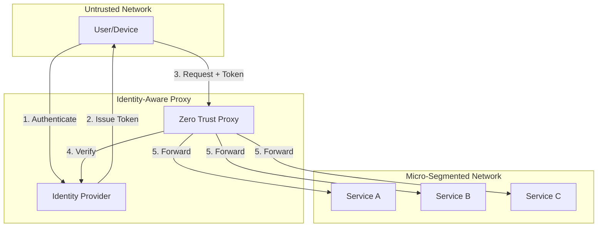
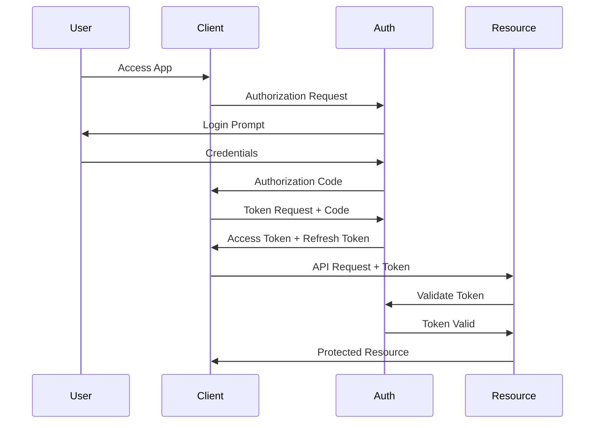
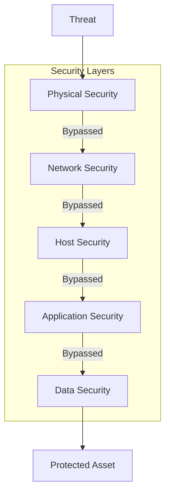

# AD-013: Security Architecture Design

## 1. Architecture Overview

### 1.1 Definition and Philosophy

Security architecture defines the security controls, policies, and mechanisms that protect an organization's information assets. A defense-in-depth approach ensures multiple layers of security controls throughout the system.

**Core Security Principles (CIA Triad + Extended):**

| Principle | Description | Implementation |
|-----------|-------------|----------------|
| **Confidentiality** | Prevent unauthorized access | Encryption, access controls |
| **Integrity** | Prevent unauthorized modification | Hashing, digital signatures |
| **Availability** | Ensure system accessibility | Redundancy, DDoS protection |
| **Authenticity** | Verify identity | Authentication mechanisms |
| **Non-repudiation** | Prevent denial of actions | Audit logs, signatures |
| **Accountability** | Trace actions to users | Logging, monitoring |

### 1.2 Defense in Depth Layers

```
┌─────────────────────────────────────────────────────────────────────────────┐
│                    DEFENSE IN DEPTH ARCHITECTURE                             │
├─────────────────────────────────────────────────────────────────────────────┤
│                                                                             │
│  Layer 7: Application Security                                               │
│  ┌─────────────────────────────────────────────────────────────────────┐   │
│  │  • Input validation    • Output encoding   • Business logic auth    │   │
│  │  • Session management  • Secure API design   • Rate limiting        │   │
│  └─────────────────────────────────────────────────────────────────────┘   │
│                                    │                                        │
│  Layer 6: Identity & Access Management                                       │
│  ┌─────────────────────────────────────────────────────────────────────┐   │
│  │  • Authentication (MFA)  • Authorization (RBAC/ABAC)  • SSO/OIDC    │   │
│  │  • Identity federation   • Privileged access management             │   │
│  └─────────────────────────────────────────────────────────────────────┘   │
│                                    │                                        │
│  Layer 5: Data Security                                                      │
│  ┌─────────────────────────────────────────────────────────────────────┐   │
│  │  • Encryption at rest (AES-256)  • Encryption in transit (TLS 1.3)  │   │
│  │  • Key management (HSM/KMS)      • Data masking/tokenization        │   │
│  │  • Database encryption           • Secret management                │   │
│  └─────────────────────────────────────────────────────────────────────┘   │
│                                    │                                        │
│  Layer 4: Network Security                                                   │
│  ┌─────────────────────────────────────────────────────────────────────┐   │
│  │  • Firewall (WAF)      • Network segmentation    • VPN/ZTNA         │   │
│  │  • DDoS protection     • Intrusion detection     • API Gateway      │   │
│  └─────────────────────────────────────────────────────────────────────┘   │
│                                    │                                        │
│  Layer 3: Compute Security                                                   │
│  ┌─────────────────────────────────────────────────────────────────────┐   │
│  │  • Container security  • Runtime protection      • Sandboxing       │   │
│  │  • Vulnerability mgmt  • Secure boot             • Patch management │   │
│  └─────────────────────────────────────────────────────────────────────┘   │
│                                    │                                        │
│  Layer 2: Infrastructure Security                                            │
│  ┌─────────────────────────────────────────────────────────────────────┐   │
│  │  • Cloud security posture  • Infrastructure as Code scanning        │   │
│  │  • Secure configuration    • Hardware security modules              │   │
│  └─────────────────────────────────────────────────────────────────────┘   │
│                                    │                                        │
│  Layer 1: Physical & Environmental Security                                  │
│  ┌─────────────────────────────────────────────────────────────────────┐   │
│  │  • Data center access control  • Biometric authentication           │   │
│  │  • Surveillance                • Environmental controls             │   │
│  └─────────────────────────────────────────────────────────────────────┘   │
│                                                                             │
└─────────────────────────────────────────────────────────────────────────────┘
```

---

## 2. Security Patterns

### 2.1 Authentication Patterns

#### 2.1.1 JWT-based Authentication

```go
package auth

import (
    "context"
    "crypto/rsa"
    "fmt"
    "time"

    "github.com/golang-jwt/jwt/v5"
    "golang.org/x/crypto/bcrypt"
)

// JWTManager handles JWT token creation and validation
type JWTManager struct {
    privateKey *rsa.PrivateKey
    publicKey  *rsa.PublicKey
    issuer     string

    // Token configuration
    accessTokenTTL  time.Duration
    refreshTokenTTL time.Duration
}

// TokenClaims represents custom JWT claims
type TokenClaims struct {
    jwt.RegisteredClaims
    UserID      string   `json:"user_id"`
    Username    string   `json:"username"`
    Roles       []string `json:"roles"`
    Permissions []string `json:"permissions"`
    SessionID   string   `json:"session_id"`
    MFAVerified bool     `json:"mfa_verified"`
}

// GenerateAccessToken creates a new access token
func (jm *JWTManager) GenerateAccessToken(user User, sessionID string) (string, error) {
    claims := TokenClaims{
        RegisteredClaims: jwt.RegisteredClaims{
            ExpiresAt: jwt.NewNumericDate(time.Now().Add(jm.accessTokenTTL)),
            IssuedAt:  jwt.NewNumericDate(time.Now()),
            NotBefore: jwt.NewNumericDate(time.Now()),
            Issuer:    jm.issuer,
            Subject:   user.ID,
            ID:        uuid.New().String(),
        },
        UserID:      user.ID,
        Username:    user.Username,
        Roles:       user.Roles,
        Permissions: user.Permissions,
        SessionID:   sessionID,
        MFAVerified: user.MFAEnabled,
    }

    token := jwt.NewWithClaims(jwt.SigningMethodRS256, claims)
    return token.SignedString(jm.privateKey)
}

// ValidateToken validates and parses a JWT token
func (jm *JWTManager) ValidateToken(tokenString string) (*TokenClaims, error) {
    token, err := jwt.ParseWithClaims(tokenString, &TokenClaims{}, func(token *jwt.Token) (interface{}, error) {
        // Verify signing method
        if _, ok := token.Method.(*jwt.SigningMethodRSA); !ok {
            return nil, fmt.Errorf("unexpected signing method: %v", token.Header["alg"])
        }
        return jm.publicKey, nil
    })

    if err != nil {
        return nil, fmt.Errorf("invalid token: %w", err)
    }

    if claims, ok := token.Claims.(*TokenClaims); ok && token.Valid {
        return claims, nil
    }

    return nil, fmt.Errorf("invalid token claims")
}

// RefreshToken rotation with token family
func (jm *JWTManager) RotateRefreshToken(ctx context.Context, oldRefreshToken string) (*TokenPair, error) {
    // Verify old refresh token
    claims, err := jm.ValidateRefreshToken(oldRefreshToken)
    if err != nil {
        return nil, err
    }

    // Check if token family is valid (detect token reuse)
    family, err := jm.tokenStore.GetTokenFamily(ctx, claims.TokenFamilyID)
    if err != nil {
        return nil, err
    }

    // If this isn't the most recent token in the family, possible theft
    if family.CurrentToken != oldRefreshToken {
        // Revoke entire token family
        jm.tokenStore.RevokeTokenFamily(ctx, claims.TokenFamilyID)
        return nil, ErrTokenReuseDetected
    }

    // Generate new token pair
    newPair, err := jm.GenerateTokenPair(claims.UserID)
    if err != nil {
        return nil, err
    }

    // Update token family
    family.CurrentToken = newPair.RefreshToken
    family.Sequence++
    jm.tokenStore.UpdateTokenFamily(ctx, family)

    // Revoke old refresh token
    jm.tokenStore.RevokeToken(ctx, oldRefreshToken)

    return newPair, nil
}
```

#### 2.1.2 OAuth2/OIDC Implementation

```go
// OAuth2 Server Implementation
package oauth

import (
    "context"
    "crypto/sha256"
    "encoding/base64"
    "net/http"
    "time"
)

// AuthorizationServer implements OAuth2 flows
type AuthorizationServer struct {
    clientStore     ClientStore
    tokenStore      TokenStore
    authCodeStore   AuthorizationCodeStore

    // Configuration
    authCodeTTL     time.Duration
    accessTokenTTL  time.Duration
    refreshTokenTTL time.Duration

    // PKCE support
    requirePKCE     bool
}

// AuthorizationRequest represents OAuth2 authorization request
type AuthorizationRequest struct {
    ResponseType string   // code, token
    ClientID     string
    RedirectURI  string
    Scope        []string
    State        string
    CodeChallenge string   // PKCE
    CodeChallengeMethod string // S256, plain
}

// HandleAuthorizationRequest processes authorization requests
func (as *AuthorizationServer) HandleAuthorizationRequest(ctx context.Context, req AuthorizationRequest, user User) (*AuthorizationResponse, error) {
    // Validate client
    client, err := as.clientStore.GetClient(ctx, req.ClientID)
    if err != nil {
        return nil, ErrInvalidClient
    }

    // Validate redirect URI
    if !client.IsValidRedirectURI(req.RedirectURI) {
        return nil, ErrInvalidRedirectURI
    }

    // Check scopes
    if !client.HasScopes(req.Scope) {
        return nil, ErrInvalidScope
    }

    // PKCE validation for public clients
    if client.IsPublic() && as.requirePKCE && req.CodeChallenge == "" {
        return nil, ErrPKCERequired
    }

    // Generate authorization code
    code := generateSecureCode()
    authCode := AuthorizationCode{
        Code:                code,
        ClientID:            req.ClientID,
        UserID:              user.ID,
        RedirectURI:         req.RedirectURI,
        Scope:               req.Scope,
        ExpiresAt:           time.Now().Add(as.authCodeTTL),
        CodeChallenge:       req.CodeChallenge,
        CodeChallengeMethod: req.CodeChallengeMethod,
    }

    if err := as.authCodeStore.Save(ctx, authCode); err != nil {
        return nil, err
    }

    return &AuthorizationResponse{
        Code:        code,
        State:       req.State,
        RedirectURI: req.RedirectURI,
    }, nil
}

// TokenRequest handles token exchange
func (as *AuthorizationServer) TokenRequest(ctx context.Context, req TokenRequest) (*TokenResponse, error) {
    switch req.GrantType {
    case "authorization_code":
        return as.handleAuthorizationCodeGrant(ctx, req)
    case "refresh_token":
        return as.handleRefreshTokenGrant(ctx, req)
    case "client_credentials":
        return as.handleClientCredentialsGrant(ctx, req)
    case "password":
        return as.handlePasswordGrant(ctx, req)
    default:
        return nil, ErrUnsupportedGrantType
    }
}

func (as *AuthorizationServer) handleAuthorizationCodeGrant(ctx context.Context, req TokenRequest) (*TokenResponse, error) {
    // Validate authorization code
    authCode, err := as.authCodeStore.GetAndDelete(ctx, req.Code)
    if err != nil {
        return nil, ErrInvalidGrant
    }

    if authCode.IsExpired() {
        return nil, ErrInvalidGrant
    }

    // Verify client
    if authCode.ClientID != req.ClientID {
        return nil, ErrInvalidClient
    }

    // Verify redirect URI
    if authCode.RedirectURI != req.RedirectURI {
        return nil, ErrInvalidGrant
    }

    // PKCE verification
    if authCode.CodeChallenge != "" {
        if err := verifyPKCE(authCode, req.CodeVerifier); err != nil {
            return nil, err
        }
    }

    // Generate tokens
    return as.generateTokenResponse(ctx, authCode.UserID, authCode.Scope, authCode.ClientID)
}

func verifyPKCE(authCode AuthorizationCode, codeVerifier string) error {
    switch authCode.CodeChallengeMethod {
    case "S256":
        hash := sha256.Sum256([]byte(codeVerifier))
        challenge := base64.RawURLEncoding.EncodeToString(hash[:])
        if challenge != authCode.CodeChallenge {
            return ErrInvalidGrant
        }
    case "plain":
        if codeVerifier != authCode.CodeChallenge {
            return ErrInvalidGrant
        }
    default:
        return ErrInvalidGrant
    }
    return nil
}
```

### 2.2 Authorization Patterns

#### 2.2.1 RBAC with Permission Hierarchy

```go
package rbac

import (
    "context"
    "fmt"
    "strings"
)

// RBACManager manages role-based access control
type RBACManager struct {
    roleStore       RoleStore
    userStore       UserStore
    permissionStore PermissionStore

    // Cache for performance
    roleCache       *cache.Cache
    permissionCache *cache.Cache
}

// Role definition with hierarchy
type Role struct {
    ID          string
    Name        string
    Description string
    Permissions []Permission
    ParentRoles []string  // Role inheritance
    Metadata    map[string]interface{}
}

// Permission with resource and action
type Permission struct {
    ID       string
    Resource string   // e.g., "order", "user", "report"
    Action   string   // e.g., "read", "write", "delete", "admin"
    Effect   string   // "allow" or "deny"
    Conditions []Condition // Optional conditions
}

// CheckPermission checks if user has permission
func (rm *RBACManager) CheckPermission(ctx context.Context, userID string, resource, action string, context map[string]interface{}) (bool, error) {
    // Get user roles
    userRoles, err := rm.GetUserEffectiveRoles(ctx, userID)
    if err != nil {
        return false, err
    }

    // Check each role's permissions
    for _, role := range userRoles {
        allowed, err := rm.checkRolePermission(role, resource, action, context)
        if err != nil {
            return false, err
        }
        if allowed {
            return true, nil
        }
    }

    return false, nil
}

func (rm *RBACManager) GetUserEffectiveRoles(ctx context.Context, userID string) ([]Role, error) {
    // Check cache
    cacheKey := fmt.Sprintf("user_roles:%s", userID)
    if cached, ok := rm.roleCache.Get(cacheKey); ok {
        return cached.([]Role), nil
    }

    // Get direct roles
    directRoles, err := rm.userStore.GetUserRoles(ctx, userID)
    if err != nil {
        return nil, err
    }

    // Expand inherited roles
    var allRoles []Role
    visited := make(map[string]bool)

    var expandRoles func(roleIDs []string) error
    expandRoles = func(roleIDs []string) error {
        for _, roleID := range roleIDs {
            if visited[roleID] {
                continue
            }
            visited[roleID] = true

            role, err := rm.roleStore.GetRole(ctx, roleID)
            if err != nil {
                return err
            }

            allRoles = append(allRoles, *role)

            // Recursively expand parent roles
            if len(role.ParentRoles) > 0 {
                if err := expandRoles(role.ParentRoles); err != nil {
                    return err
                }
            }
        }
        return nil
    }

    roleIDs := make([]string, len(directRoles))
    for i, r := range directRoles {
        roleIDs[i] = r.ID
    }

    if err := expandRoles(roleIDs); err != nil {
        return nil, err
    }

    // Cache result
    rm.roleCache.Set(cacheKey, allRoles, cache.DefaultExpiration)

    return allRoles, nil
}

// Middleware for HTTP authorization
func (rm *RBACManager) Authorize(permission string) func(http.Handler) http.Handler {
    return func(next http.Handler) http.Handler {
        return http.HandlerFunc(func(w http.ResponseWriter, r *http.Request) {
            // Extract user from context (set by authentication middleware)
            user, ok := GetUserFromContext(r.Context())
            if !ok {
                http.Error(w, "Unauthorized", http.StatusUnauthorized)
                return
            }

            // Parse permission
            parts := strings.Split(permission, ":")
            if len(parts) != 2 {
                http.Error(w, "Invalid permission format", http.StatusInternalServerError)
                return
            }
            resource, action := parts[0], parts[1]

            // Check permission
            allowed, err := rm.CheckPermission(r.Context(), user.ID, resource, action, nil)
            if err != nil {
                http.Error(w, "Authorization error", http.StatusInternalServerError)
                return
            }

            if !allowed {
                http.Error(w, "Forbidden", http.StatusForbidden)
                return
            }

            next.ServeHTTP(w, r)
        })
    }
}
```

#### 2.2.2 ABAC (Attribute-Based Access Control)

```go
package abac

import (
    "context"
    "encoding/json"
    "fmt"
)

// ABACPolicy defines attribute-based policies
type ABACPolicy struct {
    ID          string
    Name        string
    Description string

    // Subject attributes (user)
    SubjectAttributes SubjectCondition

    // Resource attributes
    ResourceAttributes ResourceCondition

    // Action
    Action string // read, write, delete, execute

    // Environment attributes
    EnvironmentAttributes EnvironmentCondition

    // Decision
    Effect string // permit, deny

    // Obligations (actions to take after decision)
    Obligations []Obligation
}

type SubjectCondition struct {
    Roles       []string
    Department  string
    Clearance   int
    Custom      map[string]interface{}
}

type ResourceCondition struct {
    Type        string
    Owner       string
    Sensitivity string // public, internal, confidential, restricted
    Tags        []string
    Custom      map[string]interface{}
}

type EnvironmentCondition struct {
    TimeOfDay   TimeRange
    DayOfWeek   []int
    Location    []string
    DeviceTrust string
    MFARequired bool
}

// PolicyEngine evaluates ABAC policies
type PolicyEngine struct {
    policies []ABACPolicy
}

func (pe *PolicyEngine) Evaluate(ctx context.Context, subject Subject, resource Resource, action string, env Environment) (Decision, error) {
    decisions := []Decision{}

    for _, policy := range pe.policies {
        if policy.Action != action && policy.Action != "*" {
            continue
        }

        // Check subject attributes
        if !pe.matchSubject(policy.SubjectAttributes, subject) {
            continue
        }

        // Check resource attributes
        if !pe.matchResource(policy.ResourceAttributes, resource) {
            continue
        }

        // Check environment attributes
        if !pe.matchEnvironment(policy.EnvironmentAttributes, env) {
            continue
        }

        decisions = append(decisions, Decision{
            PolicyID:      policy.ID,
            Effect:        policy.Effect,
            Obligations:   policy.Obligations,
        })
    }

    // Combine decisions (deny overrides)
    return pe.combineDecisions(decisions), nil
}

func (pe *PolicyEngine) matchSubject(condition SubjectCondition, subject Subject) bool {
    // Check role membership
    if len(condition.Roles) > 0 {
        hasRole := false
        for _, requiredRole := range condition.Roles {
            for _, userRole := range subject.Roles {
                if requiredRole == userRole {
                    hasRole = true
                    break
                }
            }
        }
        if !hasRole {
            return false
        }
    }

    // Check clearance level
    if condition.Clearance > 0 && subject.Clearance < condition.Clearance {
        return false
    }

    // Check department
    if condition.Department != "" && subject.Department != condition.Department {
        return false
    }

    return true
}

func (pe *PolicyEngine) matchResource(condition ResourceCondition, resource Resource) bool {
    // Check resource type
    if condition.Type != "" && resource.Type != condition.Type {
        return false
    }

    // Check sensitivity level
    if condition.Sensitivity != "" {
        if !pe.sensitivityAllows(condition.Sensitivity, resource.Sensitivity) {
            return false
        }
    }

    // Check ownership
    if condition.Owner != "" {
        if condition.Owner == "self" && resource.OwnerID != resource.AccessingUserID {
            return false
        }
    }

    return true
}

func (pe *PolicyEngine) matchEnvironment(condition EnvironmentCondition, env Environment) bool {
    // Check time restrictions
    if condition.TimeOfDay.Start != "" && condition.TimeOfDay.End != "" {
        if !pe.isWithinTimeRange(env.CurrentTime, condition.TimeOfDay) {
            return false
        }
    }

    // Check day of week
    if len(condition.DayOfWeek) > 0 {
        weekday := int(env.CurrentTime.Weekday())
        found := false
        for _, allowed := range condition.DayOfWeek {
            if allowed == weekday {
                found = true
                break
            }
        }
        if !found {
            return false
        }
    }

    // Check MFA requirement
    if condition.MFARequired && !env.MFAVerified {
        return false
    }

    return true
}

func (pe *PolicyEngine) combineDecisions(decisions []Decision) Decision {
    // Deny overrides permit
    for _, d := range decisions {
        if d.Effect == "deny" {
            return d
        }
    }

    // Return first permit
    for _, d := range decisions {
        if d.Effect == "permit" {
            return d
        }
    }

    // Default deny
    return Decision{Effect: "deny"}
}
```

### 2.3 API Security Patterns

```go
// API Security Middleware
package security

import (
    "context"
    "crypto/subtle"
    "net/http"
    "strings"
    "time"
)

// SecureMiddleware chain
type SecureMiddleware struct {
    rateLimiter    RateLimiter
    authenticator  Authenticator
    authorizer     Authorizer
    auditLogger    AuditLogger
}

// Apply all security middlewares
func (sm *SecureMiddleware) Apply(next http.Handler) http.Handler {
    return sm.SecurityHeaders(
        sm.RateLimit(
            sm.Authenticate(
                sm.Authorize(
                    sm.AuditLog(next),
                ),
            ),
        ),
    )
}

// SecurityHeaders adds security-related HTTP headers
func (sm *SecureMiddleware) SecurityHeaders(next http.Handler) http.Handler {
    return http.HandlerFunc(func(w http.ResponseWriter, r *http.Request) {
        // Prevent MIME type sniffing
        w.Header().Set("X-Content-Type-Options", "nosniff")

        // Prevent clickjacking
        w.Header().Set("X-Frame-Options", "DENY")

        // XSS protection
        w.Header().Set("X-XSS-Protection", "1; mode=block")

        // Content Security Policy
        w.Header().Set("Content-Security-Policy",
            "default-src 'self'; " +
            "script-src 'self'; " +
            "style-src 'self' 'unsafe-inline'; " +
            "img-src 'self' data: https:; " +
            "font-src 'self'; " +
            "connect-src 'self'; " +
            "frame-ancestors 'none'; " +
            "base-uri 'self'; " +
            "form-action 'self';")

        // Strict Transport Security
        w.Header().Set("Strict-Transport-Security", "max-age=31536000; includeSubDomains; preload")

        // Referrer Policy
        w.Header().Set("Referrer-Policy", "strict-origin-when-cross-origin")

        // Permissions Policy
        w.Header().Set("Permissions-Policy", "geolocation=(), microphone=(), camera=()")

        next.ServeHTTP(w, r)
    })
}

// RateLimit implements token bucket algorithm
func (sm *SecureMiddleware) RateLimit(next http.Handler) http.Handler {
    return http.HandlerFunc(func(w http.ResponseWriter, r *http.Request) {
        // Identify client
        clientID := sm.identifyClient(r)

        // Check rate limit
        allowed, remaining, resetTime, err := sm.rateLimiter.Allow(r.Context(), clientID)
        if err != nil {
            http.Error(w, "Rate limit error", http.StatusInternalServerError)
            return
        }

        // Set rate limit headers
        w.Header().Set("X-RateLimit-Limit", string(sm.rateLimiter.GetLimit()))
        w.Header().Set("X-RateLimit-Remaining", string(remaining))
        w.Header().Set("X-RateLimit-Reset", string(resetTime.Unix()))

        if !allowed {
            w.Header().Set("Retry-After", string(resetTime.Unix()))
            http.Error(w, "Rate limit exceeded", http.StatusTooManyRequests)
            return
        }

        next.ServeHTTP(w, r)
    })
}

// Input validation middleware
func (sm *SecureMiddleware) ValidateInput(validator InputValidator) func(http.Handler) http.Handler {
    return func(next http.Handler) http.Handler {
        return http.HandlerFunc(func(w http.ResponseWriter, r *http.Request) {
            // Validate query parameters
            for key, values := range r.URL.Query() {
                for _, value := range values {
                    if !validator.IsValidParam(key, value) {
                        http.Error(w, fmt.Sprintf("Invalid parameter: %s", key), http.StatusBadRequest)
                        return
                    }
                }
            }

            // Validate body (if applicable)
            if r.Body != nil && r.ContentLength > 0 {
                if r.ContentLength > validator.MaxBodySize() {
                    http.Error(w, "Request body too large", http.StatusRequestEntityTooLarge)
                    return
                }

                // Additional validation based on content type
                contentType := r.Header.Get("Content-Type")
                if strings.Contains(contentType, "application/json") {
                    if err := validator.ValidateJSON(r.Body); err != nil {
                        http.Error(w, "Invalid JSON", http.StatusBadRequest)
                        return
                    }
                }
            }

            next.ServeHTTP(w, r)
        })
    }
}

// API Key authentication
func (sm *SecureMiddleware) APIKeyAuth(next http.Handler) http.Handler {
    return http.HandlerFunc(func(w http.ResponseWriter, r *http.Request) {
        apiKey := r.Header.Get("X-API-Key")
        if apiKey == "" {
            http.Error(w, "API key required", http.StatusUnauthorized)
            return
        }

        // Validate API key
        client, err := sm.authenticator.ValidateAPIKey(r.Context(), apiKey)
        if err != nil {
            http.Error(w, "Invalid API key", http.StatusUnauthorized)
            return
        }

        // Check API key expiration
        if client.APIKeyExpiresAt.Before(time.Now()) {
            http.Error(w, "API key expired", http.StatusUnauthorized)
            return
        }

        // Add client to context
        ctx := WithClient(r.Context(), client)
        next.ServeHTTP(w, r.WithContext(ctx))
    })
}
```

---

## 3. Scalability Analysis

### 3.1 Security Performance Impact

| Security Control | Latency Impact | Throughput Impact |
|-----------------|----------------|-------------------|
| TLS Handshake | 1-2 RTT | Minimal |
| JWT Validation | < 1ms | None |
| Rate Limiting | < 1ms | None |
| Request Signing | 2-5ms | ~5% |
| WAF Inspection | 5-20ms | ~10% |
| Encryption at Rest | 0ms (async) | None |

---

## 4. Technology Stack

| Component | Technology |
|-----------|------------|
| **Authentication** | Keycloak, Auth0, Okta |
| **Authorization** | OPA, Casbin |
| **Secrets** | Vault, AWS Secrets Manager |
| **WAF** | ModSecurity, AWS WAF |
| **DDoS** | Cloudflare, AWS Shield |
| **SIEM** | Splunk, ELK Stack |

---

## 5. Case Studies

### 5.1 Zero Trust Architecture

**Principles:**

- Never trust, always verify
- Assume breach
- Verify explicitly
- Use least privilege

**Implementation:**

- Identity-aware proxy
- Device trust
- Continuous verification

### 5.2 Financial Services Security

**Requirements:**

- PCI DSS compliance
- End-to-end encryption
- Comprehensive audit trails
- Multi-factor authentication

---

## 6. Visual Representations

### 6.1 Zero Trust Architecture



### 6.2 OAuth2 Flow



### 6.3 Defense in Depth



---

## 7. Anti-Patterns

| Anti-Pattern | Problem | Solution |
|--------------|---------|----------|
| **Hardcoded Secrets** | Security breach | Secret management |
| **No Rate Limiting** | DoS vulnerability | Implement throttling |
| **Weak Passwords** | Account takeover | Strong password policy |
| **No HTTPS** | Man-in-the-middle | TLS everywhere |
| **Verbose Errors** | Information leakage | Generic error messages |

---

*Document Version: 1.0*
*Last Updated: 2026-04-02*
*Classification: S-Level Technical Reference*
