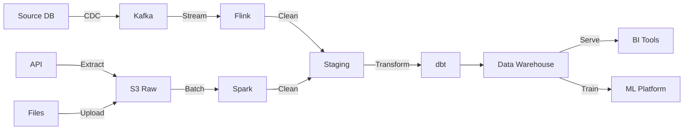
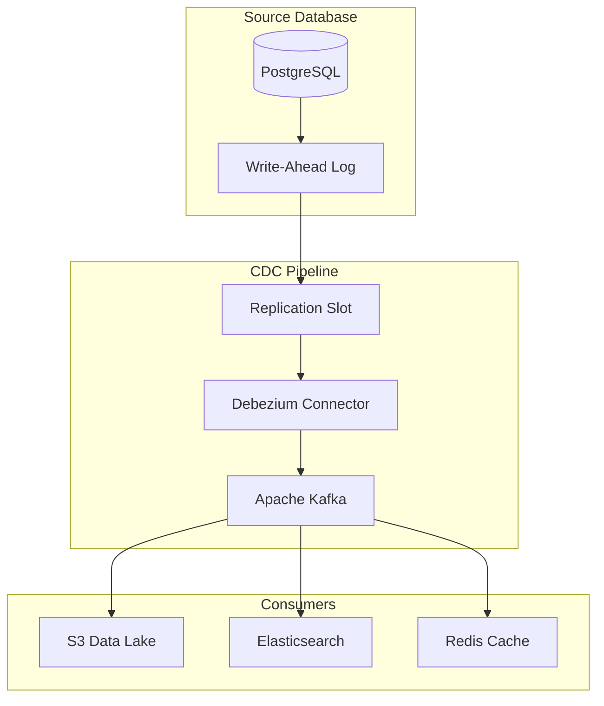
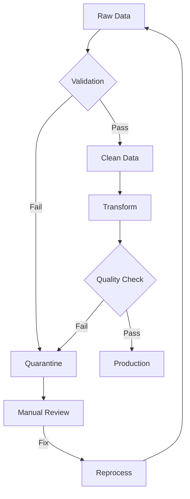

# AD-014: Data Pipeline Architecture

## 1. Architecture Overview

### 1.1 Definition and Philosophy

Data pipelines are automated processes that move and transform data from source to destination systems. They form the backbone of data-driven organizations, enabling:

- **Data Integration**: Combining data from disparate sources
- **Data Transformation**: Converting raw data into usable formats
- **Data Quality**: Ensuring accuracy, completeness, and consistency
- **Data Governance**: Managing data access, lineage, and compliance

**Pipeline Types:**

| Type | Latency | Use Case |
|------|---------|----------|
| **Batch** | Hours to days | Historical analysis, reporting |
| **Micro-batch** | Minutes | Near real-time analytics |
| **Streaming** | Seconds to milliseconds | Real-time monitoring, alerts |
| **Lambda** | Combined | Both batch and real-time views |
| **Kappa** | Streaming only | Simplified unified processing |

### 1.2 Data Pipeline Architecture

```
┌─────────────────────────────────────────────────────────────────────────────┐
│                      DATA PIPELINE ARCHITECTURE                              │
├─────────────────────────────────────────────────────────────────────────────┤
│                                                                             │
│  ┌─────────────────────────────────────────────────────────────────────┐   │
│  │                         DATA SOURCES                                 │   │
│  │  ┌─────────┐  ┌─────────┐  ┌─────────┐  ┌─────────┐  ┌─────────┐   │   │
│  │  │   DB    │  │   API   │  │  Files  │  │ Streams │  │  IoT    │   │   │
│  │  │MySQL/PG │  │ REST/   │  │ CSV/    │  │ Kafka/  │  │ Sensors │   │   │
│  │  │Mongo/etc│  │ GraphQL │  │ JSON/   │  │ Kinesis │  │ Devices │   │   │
│  │  └────┬────┘  └────┬────┘  └────┬────┘  └────┬────┘  └────┬────┘   │   │
│  │       └─────────────┴─────────────┴─────────────┴─────────────┘      │   │
│  └──────────────────────────────────┬──────────────────────────────────┘   │
│                                     │                                       │
│                              ┌──────┴──────┐                                │
│                              │   INGESTION  │                                │
│                              │    LAYER     │                                │
│                              │              │                                │
│                              │ • Connectors │                                │
│                              │ • CDC        │                                │
│                              │ • Streaming  │                                │
│                              └──────┬──────┘                                │
│                                     │                                       │
│                    ┌────────────────┼────────────────┐                      │
│                    │                │                │                      │
│                    ▼                ▼                ▼                      │
│           ┌──────────────┐  ┌──────────────┐  ┌──────────────┐              │
│           │    BATCH     │  │   STREAM     │  │   CHANGE     │              │
│           │  PROCESSING  │  │  PROCESSING  │  │  DATA CAPTURE│              │
│           │              │  │              │  │              │              │
│           │ Spark/Flink  │  │ Kafka/Flink  │  │ Debezium/    │              │
│           │ MapReduce    │  │ Storm/KStreams│ │ DMS/etc      │              │
│           └──────┬───────┘  └──────┬───────┘  └──────┬───────┘              │
│                  │                 │                 │                      │
│                  └─────────────────┼─────────────────┘                      │
│                                    │                                        │
│                           ┌────────┴────────┐                               │
│                           │  TRANSFORMATION  │                              │
│                           │                  │                              │
│                           │ • Cleaning       │                              │
│                           │ • Validation     │                              │
│                           │ • Enrichment     │                              │
│                           │ • Aggregation    │                              │
│                           │ • Normalization  │                              │
│                           └────────┬────────┘                               │
│                                    │                                        │
│                    ┌───────────────┼───────────────┐                        │
│                    ▼               ▼               ▼                        │
│           ┌──────────────┐ ┌──────────────┐ ┌──────────────┐              │
│           │   DATA LAKE  │ │   DATA WARE- │ │  DATA MARTS  │              │
│           │   (Raw)      │ │   HOUSE      │ │  (Analytics) │              │
│           │              │ │  (Structured)│ │              │              │
│           │ S3/Delta/    │ │  Snowflake/  │ │  ClickHouse/ │              │
│           │ Iceberg      │ │  BigQuery    │ │  Druid       │              │
│           └──────────────┘ └──────────────┘ └──────────────┘              │
│                                    │                                        │
│                                    ▼                                        │
│                           ┌─────────────────┐                               │
│                           │  ORCHESTRATION   │                              │
│                           │                  │                              │
│                           │ Airflow/Prefect/ │                              │
│                           │ Dagster/Kubeflow │                              │
│                           └─────────────────┘                               │
│                                                                             │
│                           ┌─────────────────┐                               │
│                           │  CONSUMPTION     │                              │
│                           │  BI/ML/Apps     │                              │
│                           └─────────────────┘                               │
│                                                                             │
└─────────────────────────────────────────────────────────────────────────────┘
```

---

## 2. Design Patterns

### 2.1 ETL vs ELT Patterns

```go
// ETL (Extract-Transform-Load) - Traditional approach
package etl

import (
    "context"
    "database/sql"
    "fmt"
)

// ETLPipeline performs transformation before loading
type ETLPipeline struct {
    source      DataSource
    transformer Transformer
    destination DataDestination

    // Configuration
    batchSize   int
    workers     int
}

func (p *ETLPipeline) Execute(ctx context.Context) error {
    // Extract
    rawData, err := p.source.Extract(ctx, ExtractConfig{
        BatchSize: p.batchSize,
    })
    if err != nil {
        return fmt.Errorf("extract failed: %w", err)
    }

    // Transform
    transformedData, err := p.transformer.Transform(ctx, rawData, TransformConfig{
        ValidationRules: p.getValidationRules(),
        Enrichments:     p.getEnrichments(),
    })
    if err != nil {
        return fmt.Errorf("transform failed: %w", err)
    }

    // Load
    if err := p.destination.Load(ctx, transformedData, LoadConfig{
        Mode:       LoadModeUpsert,
        ConflictKey: "id",
    }); err != nil {
        return fmt.Errorf("load failed: %w", err)
    }

    return nil
}

// ELT (Extract-Load-Transform) - Modern cloud approach
package elt

// ELTPipeline loads raw data first, transforms in destination
type ELTPipeline struct {
    source      DataSource
    destination DataWarehouse
    dbtRunner   *dbt.Runner
}

func (p *ELTPipeline) Execute(ctx context.Context) error {
    // Extract and Load raw data (staging)
    if err := p.loadToStaging(ctx); err != nil {
        return err
    }

    // Transform in data warehouse using dbt
    if err := p.dbtRunner.Run(ctx, dbt.RunConfig{
        Models:    []string{"staging", "intermediate", "marts"},
        FullRefresh: false,
    }); err != nil {
        return fmt.Errorf("dbt transform failed: %w", err)
    }

    return nil
}

func (p *ELTPipeline) loadToStaging(ctx context.Context) error {
    // Stream data directly to warehouse staging tables
    // No transformation during load - maximum speed
    stream, err := p.source.Stream(ctx)
    if err != nil {
        return err
    }
    defer stream.Close()

    batch := make([]Record, 0, 10000)

    for stream.Next() {
        record := stream.Record()
        batch = append(batch, record)

        if len(batch) >= 10000 {
            if err := p.destination.BulkInsert(ctx, "staging.raw_data", batch); err != nil {
                return err
            }
            batch = batch[:0]
        }
    }

    // Insert remaining
    if len(batch) > 0 {
        return p.destination.BulkInsert(ctx, "staging.raw_data", batch)
    }

    return nil
}
```

### 2.2 Change Data Capture (CDC)

```go
package cdc

import (
    "context"
    "encoding/json"
    "fmt"

    "github.com/debezium/debezium-connector-go"
)

// CDCConsumer captures database changes
type CDCConsumer struct {
    connector  *debezium.Connector
    processor  ChangeProcessor
    offsetStore OffsetStore

    // Configuration
    includeTables []string
    excludeTables []string
}

type ChangeEvent struct {
    Source    SourceInfo    `json:"source"`
    Op        string        `json:"op"`        // c=create, u=update, d=delete, r=read
    TsMs      int64         `json:"ts_ms"`
    Before    json.RawMessage `json:"before,omitempty"`
    After     json.RawMessage `json:"after,omitempty"`
    Transaction TransactionInfo `json:"transaction,omitempty"`
}

type SourceInfo struct {
    Version   string `json:"version"`
    Connector string `json:"connector"`
    Name      string `json:"name"`
    TsMs      int64  `json:"ts_ms"`
    Database  string `json:"db"`
    Schema    string `json:"schema"`
    Table     string `json:"table"`
    ChangeLsn string `json:"change_lsn"`
}

func (c *CDCConsumer) Start(ctx context.Context) error {
    config := debezium.Config{
        ConnectorClass:   "io.debezium.connector.postgresql.PostgresConnector",
        DatabaseHostname: "postgres.example.com",
        DatabasePort:     5432,
        DatabaseUser:     "cdc_user",
        DatabasePassword: "password",
        DatabaseDbname:   "production",
        PluginName:       "pgoutput",
        SlotName:         "debezium_slot",
        PublicationName:  "dbz_publication",
        TableIncludeList: c.includeTables,
        TableExcludeList: c.excludeTables,
        SnapshotMode:     "initial",
    }

    connector, err := debezium.NewConnector(config)
    if err != nil {
        return err
    }

    c.connector = connector

    // Start consuming changes
    return connector.Start(ctx, c.handleChangeEvent)
}

func (c *CDCConsumer) handleChangeEvent(ctx context.Context, event ChangeEvent) error {
    // Log the change
    c.logChange(event)

    // Route to appropriate processor
    switch event.Op {
    case "c": // Create
        return c.processor.HandleInsert(ctx, event)
    case "u": // Update
        return c.processor.HandleUpdate(ctx, event)
    case "d": // Delete
        return c.processor.HandleDelete(ctx, event)
    case "r": // Read (snapshot)
        return c.processor.HandleSnapshot(ctx, event)
    default:
        return fmt.Errorf("unknown operation: %s", event.Op)
    }
}

func (c *CDCConsumer) HandleInsert(ctx context.Context, event ChangeEvent) error {
    // Parse the new record
    var record map[string]interface{}
    if err := json.Unmarshal(event.After, &record); err != nil {
        return err
    }

    // Enrich with metadata
    record["_cdc_timestamp"] = event.TsMs
    record["_cdc_source"] = event.Source.Name

    // Publish to data lake
    return c.publishToDataLake(ctx, event.Source.Table, record)
}

func (c *CDCConsumer) HandleUpdate(ctx context.Context, event ChangeEvent) error {
    // Parse before and after
    var before, after map[string]interface{}
    if err := json.Unmarshal(event.Before, &before); err != nil {
        return err
    }
    if err := json.Unmarshal(event.After, &after); err != nil {
        return err
    }

    // Calculate diff
    diff := calculateDiff(before, after)

    // Publish change record
    changeRecord := map[string]interface{}{
        "_cdc_timestamp": event.TsMs,
        "_cdc_operation": "UPDATE",
        "_cdc_table":     event.Source.Table,
        "_cdc_diff":      diff,
        "record":         after,
    }

    return c.publishToDataLake(ctx, event.Source.Table+"_changes", changeRecord)
}

func calculateDiff(before, after map[string]interface{}) map[string]interface{} {
    diff := make(map[string]interface{})

    for key, afterVal := range after {
        beforeVal, exists := before[key]
        if !exists {
            diff[key] = map[string]interface{}{"from": nil, "to": afterVal}
        } else if beforeVal != afterVal {
            diff[key] = map[string]interface{}{"from": beforeVal, "to": afterVal}
        }
    }

    return diff
}
```

### 2.3 Data Quality Framework

```go
package dataquality

import (
    "context"
    "fmt"
    "regexp"
)

// DataQualityEngine validates data against rules
type DataQualityEngine struct {
    rules      []ValidationRule
    actions    map[Severity]ErrorAction
    reporter   QualityReporter
}

type ValidationRule struct {
    ID          string
    Name        string
    Description string
    Severity    Severity
    Condition   ValidationCondition
    Action      ErrorAction
}

type Severity int

const (
    SeverityInfo Severity = iota
    SeverityWarning
    SeverityError
    SeverityCritical
)

type ValidationCondition interface {
    Validate(record map[string]interface{}) (bool, string)
}

// NotNull validates field is not null
type NotNull struct {
    Field string
}

func (n NotNull) Validate(record map[string]interface{}) (bool, string) {
    val, exists := record[n.Field]
    if !exists || val == nil {
        return false, fmt.Sprintf("Field '%s' is null", n.Field)
    }
    return true, ""
}

// RegexPattern validates field matches pattern
type RegexPattern struct {
    Field   string
    Pattern *regexp.Regexp
}

func (r RegexPattern) Validate(record map[string]interface{}) (bool, string) {
    val, exists := record[r.Field]
    if !exists {
        return false, fmt.Sprintf("Field '%s' not found", r.Field)
    }

    strVal, ok := val.(string)
    if !ok {
        return false, fmt.Sprintf("Field '%s' is not a string", r.Field)
    }

    if !r.Pattern.MatchString(strVal) {
        return false, fmt.Sprintf("Field '%s' does not match pattern", r.Field)
    }

    return true, ""
}

// RangeCheck validates numeric range
type RangeCheck struct {
    Field string
    Min   float64
    Max   float64
}

func (r RangeCheck) Validate(record map[string]interface{}) (bool, string) {
    val, exists := record[r.Field]
    if !exists {
        return false, fmt.Sprintf("Field '%s' not found", r.Field)
    }

    numVal, ok := toFloat64(val)
    if !ok {
        return false, fmt.Sprintf("Field '%s' is not numeric", r.Field)
    }

    if numVal < r.Min || numVal > r.Max {
        return false, fmt.Sprintf("Field '%s' value %.2f outside range [%.2f, %.2f]",
            r.Field, numVal, r.Min, r.Max)
    }

    return true, ""
}

// ReferentialIntegrity validates foreign key
type ReferentialIntegrity struct {
    Field         string
    ReferenceTable string
    ReferenceField string
    lookupCache   map[interface{}]bool
}

func (ri *ReferentialIntegrity) Validate(record map[string]interface{}) (bool, string) {
    val, exists := record[ri.Field]
    if !exists || val == nil {
        return true, "" // Null is acceptable
    }

    if ri.lookupCache == nil {
        // Load reference data
        ri.loadReferenceData()
    }

    if !ri.lookupCache[val] {
        return false, fmt.Sprintf("Field '%s' value '%v' not found in reference table",
            ri.Field, val)
    }

    return true, ""
}

func (ri *ReferentialIntegrity) loadReferenceData() {
    // Load valid values from reference table
    ri.lookupCache = make(map[interface{}]bool)
    // ... database query
}

func (qe *DataQualityEngine) Validate(ctx context.Context, dataset DataSet) (*ValidationResult, error) {
    result := &ValidationResult{
        TotalRecords: dataset.Count(),
        StartTime:    time.Now(),
    }

    for record := range dataset.Records() {
        recordResult := qe.validateRecord(record)

        // Aggregate results
        result.ValidRecords += recordResult.ValidFields
        result.InvalidRecords += recordResult.InvalidFields
        result.Errors = append(result.Errors, recordResult.Errors...)

        // Check if critical error
        if recordResult.HasCriticalError {
            if action, ok := qe.actions[SeverityCritical]; ok {
                if err := action.Execute(ctx, record, recordResult.Errors); err != nil {
                    return result, err
                }
            }
        }
    }

    result.EndTime = time.Now()

    // Generate report
    if err := qe.reporter.Report(ctx, result); err != nil {
        return result, err
    }

    return result, nil
}

func (qe *DataQualityEngine) validateRecord(record map[string]interface{}) RecordValidationResult {
    result := RecordValidationResult{
        RecordID: getRecordID(record),
    }

    for _, rule := range qe.rules {
        valid, message := rule.Condition.Validate(record)

        if !valid {
            error := ValidationError{
                RuleID:      rule.ID,
                RuleName:    rule.Name,
                Severity:    rule.Severity,
                Message:     message,
                RecordID:    result.RecordID,
            }

            result.Errors = append(result.Errors, error)
            result.InvalidFields++

            if rule.Severity == SeverityCritical {
                result.HasCriticalError = true
            }
        } else {
            result.ValidFields++
        }
    }

    return result
}

// Quarantine invalid records
type QuarantineAction struct {
    storage QuarantineStorage
}

func (qa *QuarantineAction) Execute(ctx context.Context, record map[string]interface{}, errors []ValidationError) error {
    quarantineRecord := QuarantineRecord{
        OriginalRecord: record,
        Errors:         errors,
        QuarantineTime: time.Now(),
        Status:         "pending",
    }

    return qa.storage.Save(ctx, quarantineRecord)
}
```

---

## 3. Orchestration Patterns

### 3.1 Airflow DAG Design

```python
# Modern data pipeline orchestration with Apache Airflow
from airflow import DAG
from airflow.operators.python import PythonOperator
from airflow.providers.amazon.aws.transfers.s3_to_redshift import S3ToRedshiftOperator
from airflow.providers.dbt.cloud.operators.dbt import DbtCloudRunJobOperator
from airflow.utils.task_group import TaskGroup
from airflow.models import Variable
from datetime import datetime, timedelta

# Default arguments
default_args = {
    'owner': 'data-engineering',
    'depends_on_past': False,
    'email_on_failure': True,
    'email_on_retry': False,
    'retries': 1,
    'retry_delay': timedelta(minutes=5),
    'sla': timedelta(hours=2),
}

# Data quality check function
def check_data_quality(**context):
    """Validate data quality before proceeding"""
    from data_quality import DataQualityEngine

    engine = DataQualityEngine()
    table = context['params']['table']

    results = engine.validate_table(
        table=table,
        rules=[
            {'type': 'not_null', 'column': 'id'},
            {'type': 'unique', 'column': 'id'},
            {'type': 'range', 'column': 'amount', 'min': 0, 'max': 1000000},
        ]
    )

    if results['failed'] > 0:
        raise ValueError(f"Data quality checks failed: {results}")

    return results

# Main DAG
default_args = {
    'owner': 'data-engineering',
    'depends_on_past': False,
    'email_on_failure': True,
    'retries': 1,
    'retry_delay': timedelta(minutes=5),
}

with DAG(
    'etl_daily_pipeline',
    default_args=default_args,
    description='Daily ETL pipeline with data quality checks',
    schedule_interval='0 2 * * *',  # Run at 2 AM daily
    start_date=datetime(2024, 1, 1),
    catchup=False,
    tags=['etl', 'daily', 'critical'],
    max_active_runs=1,
) as dag:

    # Extract from multiple sources
    with TaskGroup("extract_sources") as extract_group:

        extract_orders = PythonOperator(
            task_id='extract_orders',
            python_callable=extract_from_postgres,
            op_kwargs={'table': 'orders', 'date': '{{ ds }}'},
        )

        extract_customers = PythonOperator(
            task_id='extract_customers',
            python_callable=extract_from_api,
            op_kwargs={'endpoint': '/customers', 'date': '{{ ds }}'},
        )

        extract_events = PythonOperator(
            task_id='extract_events',
            python_callable=extract_from_kafka,
            op_kwargs={'topic': 'user-events', 'date': '{{ ds }}'},
        )

    # Data quality checks for raw data
    with TaskGroup("quality_checks_raw") as quality_raw:

        check_orders = PythonOperator(
            task_id='check_orders_quality',
            python_callable=check_data_quality,
            params={'table': 'staging.orders'},
        )

        check_customers = PythonOperator(
            task_id='check_customers_quality',
            python_callable=check_data_quality,
            params={'table': 'staging.customers'},
        )

    # Transform using dbt
    dbt_run = DbtCloudRunJobOperator(
        task_id='dbt_transform',
        job_id=12345,
        wait_for_termination=True,
        timeout=3600,
    )

    # Data quality checks for transformed data
    check_marts = PythonOperator(
        task_id='check_marts_quality',
        python_callable=check_data_quality,
        params={'table': 'marts.daily_metrics'},
    )

    # Load to data warehouse
    load_to_warehouse = S3ToRedshiftOperator(
        task_id='load_to_redshift',
        schema='analytics',
        table='daily_metrics',
        s3_bucket='data-lake-prod',
        s3_key='marts/daily_metrics/{{ ds }}',
        redshift_conn_id='redshift_default',
        copy_options=["FORMAT AS PARQUET"],
    )

    # Refresh BI cache
    refresh_cache = PythonOperator(
        task_id='refresh_bi_cache',
        python_callable=refresh_cache,
        op_kwargs={'cache_key': 'daily_metrics'},
    )

    # Send notification
    notify_success = PythonOperator(
        task_id='notify_success',
        python_callable=send_slack_notification,
        op_kwargs={'message': 'Daily ETL completed successfully'},
        trigger_rule='all_success',
    )

    # Define dependencies
    extract_group >> quality_raw >> dbt_run >> check_marts >> load_to_warehouse >> refresh_cache >> notify_success
```

---

## 4. Scalability Analysis

### 4.1 Pipeline Scaling Strategies

| Strategy | Use Case | Implementation |
|----------|----------|----------------|
| **Horizontal Scaling** | High volume processing | Add worker nodes |
| **Partitioning** | Parallel processing | Partition by date/key |
| **Incremental Processing** | Large datasets | Process only changes |
| **Pushdown Processing** | Data warehouse | Compute near storage |

### 4.2 Performance Metrics

| Metric | Target | Measurement |
|--------|--------|-------------|
| **Latency** | SLA dependent | End-to-end pipeline time |
| **Throughput** | GB/hour | Data volume processed |
| **Data Freshness** | < 1 hour | Age of latest data |
| **Error Rate** | < 0.1% | Failed records / total |
| **Recovery Time** | < 30 min | Time to recover from failure |

---

## 5. Technology Stack

| Component | Batch | Streaming |
|-----------|-------|-----------|
| **Orchestration** | Airflow, Prefect, Dagster | Kafka, Flink |
| **Processing** | Spark, dbt | Flink, Kafka Streams |
| **Storage** | S3, Delta Lake | Kafka, Redis |
| **Warehouse** | Snowflake, BigQuery | ClickHouse, Druid |
| **Quality** | Great Expectations, Soda | Custom validators |

---

## 6. Visual Representations

### 6.1 Data Pipeline Flow



### 6.2 CDC Architecture



### 6.3 Data Quality Framework



---

## 7. Anti-Patterns

| Anti-Pattern | Problem | Solution |
|--------------|---------|----------|
| **Big Bang ETL** | Long processing windows | Incremental processing |
| **No Data Quality** | Garbage in, garbage out | Validation at every stage |
| **Hardcoded Configs** | Deployment issues | Configuration management |
| **No Monitoring** | Silent failures | Comprehensive observability |
| **Single Point of Failure** | Pipeline outages | Redundancy and failover |

---

*Document Version: 1.0*
*Last Updated: 2026-04-02*
*Classification: S-Level Technical Reference*
