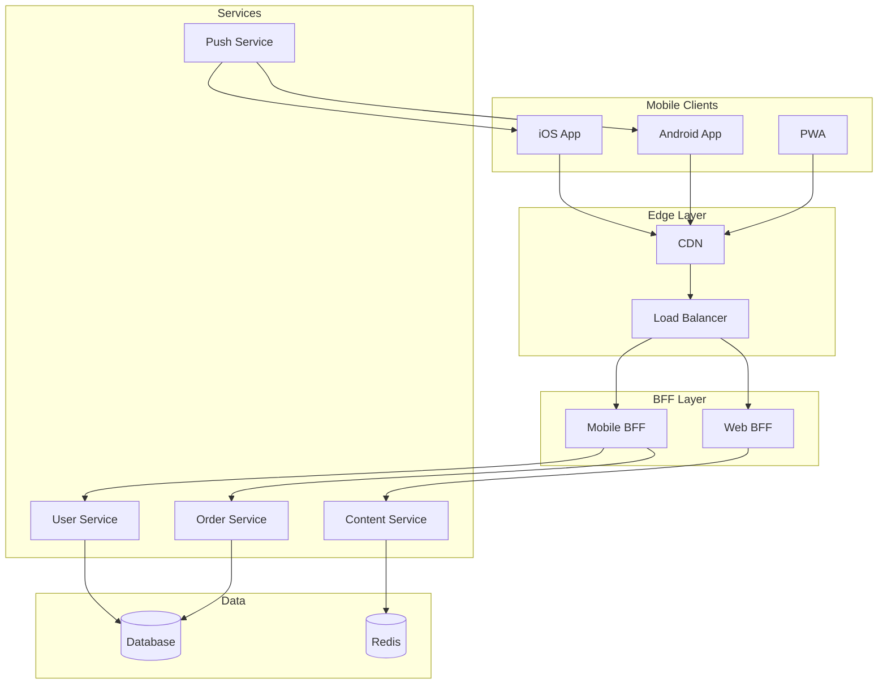
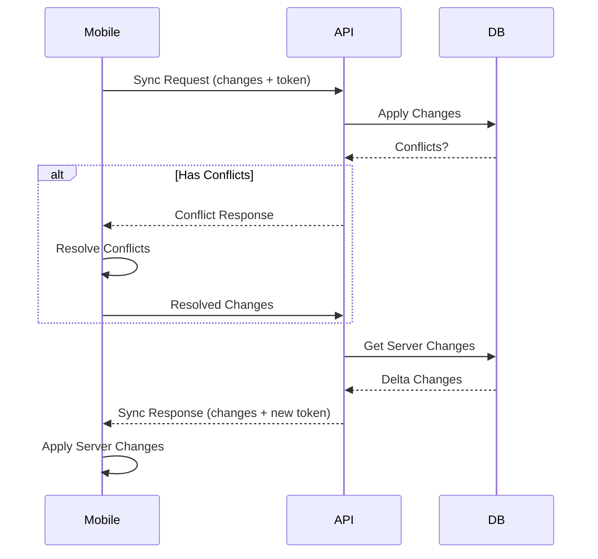
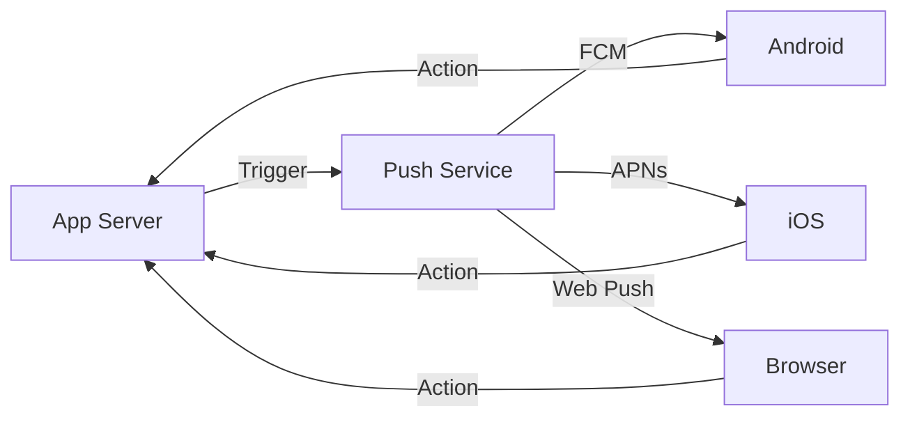

# AD-015: Mobile Backend Design

## 1. Architecture Overview

### 1.1 Definition and Philosophy

Mobile backend architecture provides the server-side infrastructure to support mobile applications. Key considerations include:

- **Network Efficiency**: Mobile networks are slower and less reliable
- **Battery Conservation**: Minimize radio usage and background activity
- **Offline Support**: Apps should work with intermittent connectivity
- **Scalability**: Handle millions of concurrent devices
- **Security**: Protect data on potentially compromised devices

### 1.2 Mobile Backend Architecture

```
┌─────────────────────────────────────────────────────────────────────────────┐
│                    MOBILE BACKEND ARCHITECTURE                               │
├─────────────────────────────────────────────────────────────────────────────┤
│                                                                             │
│  ┌─────────────────────────────────────────────────────────────────────┐   │
│  │                      CLIENT LAYER                                    │   │
│  │  ┌─────────────┐  ┌─────────────┐  ┌─────────────┐                  │   │
│  │  │   iOS App   │  │ Android App │  │   Web App   │                  │   │
│  │  │   (Swift)   │  │   (Kotlin)  │  │  (PWA)      │                  │   │
│  │  └──────┬──────┘  └──────┬──────┘  └──────┬──────┘                  │   │
│  │         │                │                │                         │   │
│  │         └────────────────┴────────────────┘                         │   │
│  │                          │                                          │   │
│  │         ┌────────────────┴────────────────┐                         │   │
│  │         │  • Local Database (SQLite/Room) │                         │   │
│  │         │  • Caching Layer              │                         │   │
│  │         │  • Sync Engine                │                         │   │
│  │         │  • Offline Queue              │                         │   │
│  │         └─────────────────────────────────┘                         │   │
│  └─────────────────────────────────────────────────────────────────────┘   │
│                                    │                                        │
│  ┌─────────────────────────────────┼─────────────────────────────────────┐ │
│  │                         NETWORK LAYER                                 │ │
│  │  ┌─────────────┐  ┌─────────────┐  ┌─────────────┐  ┌─────────────┐ │ │
│  │  │  REST API   │  │ GraphQL API │  │ WebSocket   │  │   gRPC      │ │ │
│  │  │  (JSON)     │  │  (Flexible) │  │ (Real-time) │  │ (Binary)    │ │ │
│  │  └─────────────┘  └─────────────┘  └─────────────┘  └─────────────┘ │ │
│  │                                                                     │ │
│  │  Protocol Optimization:                                             │ │
│  │  • HTTP/2 or HTTP/3 (QUIC) for multiplexing                         │ │
│  │  • Protocol Buffers or MessagePack for serialization                │ │
│  │  • Compression (Brotli/Gzip)                                        │ │
│  │  • Request bundling for efficiency                                  │ │
│  └─────────────────────────────────┼─────────────────────────────────────┘ │
│                                    │                                        │
│                                    ▼                                        │
│  ┌─────────────────────────────────────────────────────────────────────┐   │
│  │                         EDGE LAYER                                   │   │
│  │  ┌─────────────┐  ┌─────────────┐  ┌─────────────┐  ┌─────────────┐ │   │
│  │  │    CDN      │  │   WAF       │  │  DDoS       │  │  Geo-DNS    │ │   │
│  │  │  (Static)   │  │  (Rules)    │  │  Protection │  │  (Routing)  │ │   │
│  │  └─────────────┘  └─────────────┘  └─────────────┘  └─────────────┘ │   │
│  └─────────────────────────────────────────────────────────────────────┘   │
│                                    │                                        │
│                                    ▼                                        │
│  ┌─────────────────────────────────────────────────────────────────────┐   │
│  │                         GATEWAY LAYER                                │   │
│  │  ┌─────────────────────────────────────────────────────────────┐    │   │
│  │  │                    API Gateway (BFF)                         │    │   │
│  │  │  ┌───────────┐ ┌───────────┐ ┌───────────┐ ┌───────────┐   │    │   │
│  │  │  │ Mobile    │ │  Web      │ │  Partner  │ │ Internal  │   │    │   │
│  │  │  │   BFF     │ │   BFF     │ │   BFF     │ │   API     │   │    │   │
│  │  │  └───────────┘ └───────────┘ └───────────┘ └───────────┘   │    │   │
│  │  │                                                             │    │   │
│  │  │  Capabilities:                                              │    │   │
│  │  │  • Device-aware responses    • Response aggregation         │    │   │
│  │  │  • Protocol translation      • Mobile-optimized payloads    │    │   │
│  │  │  • Rate limiting             • Authentication               │    │   │
│  │  └─────────────────────────────────────────────────────────────┘    │   │
│  └─────────────────────────────────────────────────────────────────────┘   │
│                                    │                                        │
│                                    ▼                                        │
│  ┌─────────────────────────────────────────────────────────────────────┐   │
│  │                      SERVICE LAYER                                   │   │
│  │  ┌─────────────┐  ┌─────────────┐  ┌─────────────┐  ┌─────────────┐ │   │
│  │  │    User     │  │    Push     │  │    Sync     │  │   Content   │ │   │
│  │  │   Service   │  │  Notification│  │   Service   │  │   Service   │ │   │
│  │  ├─────────────┤  ├─────────────┤  ├─────────────┤  ├─────────────┤ │   │
│  │  │   Order     │  │   Payment   │  │   Search    │  │  Analytics  │ │   │
│  │  │   Service   │  │   Service   │  │   Service   │  │   Service   │ │   │
│  │  └─────────────┘  └─────────────┘  └─────────────┘  └─────────────┘ │   │
│  └─────────────────────────────────────────────────────────────────────┘   │
│                                    │                                        │
│                                    ▼                                        │
│  ┌─────────────────────────────────────────────────────────────────────┐   │
│  │                        DATA LAYER                                    │   │
│  │  ┌─────────────┐  ┌─────────────┐  ┌─────────────┐  ┌─────────────┐ │   │
│  │  │  PostgreSQL │  │    Redis    │  │ Elasticsearch│  │     S3      │ │   │
│  │  │  (Primary)  │  │   (Cache)   │  │   (Search)  │  │  (Media)    │ │   │
│  │  └─────────────┘  └─────────────┘  └─────────────┘  └─────────────┘ │   │
│  └─────────────────────────────────────────────────────────────────────┘   │
│                                                                             │
└─────────────────────────────────────────────────────────────────────────────┘
```

---

## 2. Design Patterns

### 2.1 Backend for Frontend (BFF) Pattern

```go
package bff

import (
    "context"
    "encoding/json"
    "net/http"
    "sync"
    "time"
)

// MobileBFF provides mobile-optimized API endpoints
type MobileBFF struct {
    userClient     UserClient
    orderClient    OrderClient
    productClient  ProductClient
    recommendationClient RecommendationClient

    // Caching
    cache          Cache
    cacheTTL       time.Duration
}

// HomeScreenResponse optimized for mobile home screen
type HomeScreenResponse struct {
    UserProfile     *UserProfileSummary    `json:"user,omitempty"`
    RecentOrders    []*OrderSummary        `json:"recent_orders,omitempty"`
    Recommendations []*ProductRecommendation `json:"recommendations,omitempty"`
    Notifications   []*Notification        `json:"notifications,omitempty"`
    Promotions      []*Promotion           `json:"promotions,omitempty"`
}

// GetHomeScreen aggregates data for mobile home screen
func (b *MobileBFF) GetHomeScreen(ctx context.Context, userID string) (*HomeScreenResponse, error) {
    var wg sync.WaitGroup
    errChan := make(chan error, 5)

    var result HomeScreenResponse

    // Fetch user profile
    wg.Add(1)
    go func() {
        defer wg.Done()

        cacheKey := fmt.Sprintf("user:%s:profile", userID)
        if cached, ok := b.cache.Get(cacheKey); ok {
            result.UserProfile = cached.(*UserProfileSummary)
            return
        }

        profile, err := b.userClient.GetProfileSummary(ctx, userID)
        if err != nil {
            errChan <- err
            return
        }

        b.cache.Set(cacheKey, profile, b.cacheTTL)
        result.UserProfile = profile
    }()

    // Fetch recent orders (mobile-optimized: last 3 only)
    wg.Add(1)
    go func() {
        defer wg.Done()

        orders, err := b.orderClient.GetRecentOrders(ctx, userID, GetOrdersRequest{
            Limit:          3,
            IncludeDetails: false, // Minimal fields
            Fields: []string{"id", "status", "total", "created_at", "item_count"},
        })
        if err != nil {
            errChan <- err
            return
        }

        result.RecentOrders = orders
    }()

    // Fetch personalized recommendations
    wg.Add(1)
    go func() {
        defer wg.Done()

        recs, err := b.recommendationClient.GetPersonalized(ctx, userID, RecommendationRequest{
            Limit:           10,
            IncludeImages:   true,
            ImageSize:       "medium", // Mobile-optimized size
            Context:         "home_screen",
        })
        if err != nil {
            // Non-critical, don't fail
            return
        }

        result.Recommendations = recs
    }()

    // Wait for all requests
    wg.Wait()
    close(errChan)

    // Check for critical errors
    for err := range errChan {
        if err != nil {
            return nil, err
        }
    }

    return &result, nil
}

// OrderDetailResponse optimized for mobile order details
type OrderDetailResponse struct {
    OrderID        string            `json:"order_id"`
    Status         string            `json:"status"`
    StatusHistory  []StatusUpdate    `json:"status_history"`
    Items          []OrderItemDetail `json:"items"`
    Total          Money             `json:"total"`
    Shipping       *ShippingInfo     `json:"shipping,omitempty"`
    Payment        *PaymentInfo      `json:"payment,omitempty"`
    Actions        []OrderAction     `json:"actions"` // Available actions
}

func (b *MobileBFF) GetOrderDetail(ctx context.Context, userID, orderID string) (*OrderDetailResponse, error) {
    // Single optimized query instead of multiple round-trips
    order, err := b.orderClient.GetOrderDetail(ctx, orderID, OrderDetailOptions{
        IncludeItems:   true,
        IncludeShipping: true,
        IncludePayment: true,
        IncludeHistory: true,
    })
    if err != nil {
        return nil, err
    }

    // Verify ownership
    if order.UserID != userID {
        return nil, ErrUnauthorized
    }

    // Determine available actions based on order state
    actions := b.determineOrderActions(order)

    return &OrderDetailResponse{
        OrderID:       order.ID,
        Status:        order.Status,
        StatusHistory: simplifyHistory(order.History), // Mobile-optimized
        Items:         optimizeItemImages(order.Items, "large"),
        Total:         order.Total,
        Shipping:      simplifyShipping(order.Shipping),
        Payment:       maskPaymentInfo(order.Payment),
        Actions:       actions,
    }, nil
}

func (b *MobileBFF) determineOrderActions(order *Order) []OrderAction {
    var actions []OrderAction

    switch order.Status {
    case "pending":
        actions = append(actions,
            OrderAction{Type: "cancel", Label: "Cancel Order", Icon: "close"},
            OrderAction{Type: "modify", Label: "Modify Items", Icon: "edit"},
        )
    case "shipped":
        actions = append(actions,
            OrderAction{Type: "track", Label: "Track Package", Icon: "location"},
            OrderAction{Type: "contact", Label: "Contact Courier", Icon: "phone"},
        )
    case "delivered":
        actions = append(actions,
            OrderAction{Type: "return", Label: "Return Items", Icon: "undo"},
            OrderAction{Type: "review", Label: "Write Review", Icon: "star"},
        )
    }

    return actions
}
```

### 2.2 Data Synchronization Pattern

```go
package sync

import (
    "context"
    "time"
)

// SyncEngine handles bidirectional data synchronization
type SyncEngine struct {
    localDB     LocalDatabase
    remoteAPI   RemoteAPI
    conflictResolver ConflictResolver

    syncInterval time.Duration
    batchSize    int
}

// SyncRequest represents a sync operation from client
type SyncRequest struct {
    DeviceID       string                 `json:"device_id"`
    LastSyncToken  string                 `json:"last_sync_token"`
    ClientChanges  []ClientChange         `json:"client_changes"`
    RequestedTypes []string               `json:"requested_types"`
    ClientTimestamp int64                 `json:"client_timestamp"`
}

type ClientChange struct {
    ID         string                 `json:"id"`
    Type       string                 `json:"type"`        // upsert, delete
    EntityType string                 `json:"entity_type"`
    EntityID   string                 `json:"entity_id"`
    Data       map[string]interface{} `json:"data"`
    Timestamp  int64                  `json:"timestamp"`
    Checksum   string                 `json:"checksum"`
}

// SyncResponse represents server response to sync
type SyncResponse struct {
    SyncToken      string          `json:"sync_token"`
    ServerChanges  []ServerChange  `json:"server_changes"`
    Conflicts      []Conflict      `json:"conflicts"`
    NextSyncToken  string          `json:"next_sync_token,omitempty"`
    HasMore        bool            `json:"has_more"`
}

// Sync performs bidirectional synchronization
func (se *SyncEngine) Sync(ctx context.Context, req SyncRequest) (*SyncResponse, error) {
    response := &SyncResponse{
        ServerChanges: make([]ServerChange, 0),
    }

    // 1. Apply client changes
    if len(req.ClientChanges) > 0 {
        conflicts, err := se.applyClientChanges(ctx, req.DeviceID, req.ClientChanges)
        if err != nil {
            return nil, err
        }
        response.Conflicts = conflicts
    }

    // 2. Get server changes since last sync
    serverChanges, newToken, err := se.getServerChanges(ctx, req.LastSyncToken, req.RequestedTypes)
    if err != nil {
        return nil, err
    }

    // 3. Paginate if too many changes
    if len(serverChanges) > se.batchSize {
        response.ServerChanges = serverChanges[:se.batchSize]
        response.HasMore = true
        response.NextSyncToken = newToken
    } else {
        response.ServerChanges = serverChanges
        response.SyncToken = newToken
    }

    return response, nil
}

func (se *SyncEngine) applyClientChanges(ctx context.Context, deviceID string, changes []ClientChange) ([]Conflict, error) {
    var conflicts []Conflict

    for _, change := range changes {
        // Check for conflicts
        existing, err := se.localDB.GetEntity(ctx, change.EntityType, change.EntityID)
        if err != nil && !IsNotFound(err) {
            return nil, err
        }

        if existing != nil {
            // Check if server has newer version
            if existing.ModifiedAt > change.Timestamp {
                // Conflict detected
                resolution := se.conflictResolver.Resolve(change, existing)

                if resolution.Strategy == ConflictStrategyServerWins {
                    // Skip client change, add to conflicts
                    conflicts = append(conflicts, Conflict{
                        EntityType: change.EntityType,
                        EntityID:   change.EntityID,
                        ClientData: change.Data,
                        ServerData: existing.Data,
                        Resolution: "server_wins",
                    })
                    continue
                } else if resolution.Strategy == ConflictStrategyMerge {
                    // Merge data
                    change.Data = resolution.MergedData
                }
                // ClientWins: proceed with client change
            }
        }

        // Apply change
        switch change.Type {
        case "upsert":
            if err := se.localDB.Upsert(ctx, change.EntityType, change.EntityID, change.Data); err != nil {
                return nil, err
            }
        case "delete":
            if err := se.localDB.Delete(ctx, change.EntityType, change.EntityID); err != nil {
                return nil, err
            }
        }

        // Record sync operation
        if err := se.localDB.RecordSyncOperation(ctx, deviceID, change); err != nil {
            return nil, err
        }
    }

    return conflicts, nil
}

// DeltaSync provides incremental updates
type DeltaSync struct {
    entityType string
    baseVersion int64
    targetVersion int64
    changes []DeltaChange
}

func (se *SyncEngine) CalculateDelta(ctx context.Context, entityType string, baseVersion, targetVersion int64) (*DeltaSync, error) {
    // Get changes between versions
    changes, err := se.localDB.GetChangesBetweenVersions(ctx, entityType, baseVersion, targetVersion)
    if err != nil {
        return nil, err
    }

    // Optimize delta
    delta := se.optimizeDelta(changes)

    return &DeltaSync{
        entityType:    entityType,
        baseVersion:   baseVersion,
        targetVersion: targetVersion,
        changes:       delta,
    }, nil
}

// optimizeDelta removes redundant changes
func (se *SyncEngine) optimizeDelta(changes []Change) []DeltaChange {
    // Keep only last change per entity
    latestChanges := make(map[string]Change)

    for _, change := range changes {
        key := fmt.Sprintf("%s:%s", change.EntityType, change.EntityID)
        existing, exists := latestChanges[key]
        if !exists || change.Timestamp > existing.Timestamp {
            latestChanges[key] = change
        }
    }

    // Convert to delta changes
    var deltas []DeltaChange
    for _, change := range latestChanges {
        deltas = append(deltas, DeltaChange{
            EntityType: change.EntityType,
            EntityID:   change.EntityID,
            Operation:  change.Operation,
            Data:       change.Data,
        })
    }

    return deltas
}
```

### 2.3 Push Notification System

```go
package push

import (
    "context"
    "encoding/json"
    "fmt"

    firebase "firebase.google.com/go/v4/messaging"
)

// PushNotificationService handles multi-platform push notifications
type PushNotificationService struct {
    firebaseClient *firebase.Client
    apnsClient     *APNSClient
    webPushClient  *WebPushClient

    tokenStore     DeviceTokenStore
    metrics        MetricsCollector
}

type Notification struct {
    ID          string                 `json:"id"`
    Title       string                 `json:"title"`
    Body        string                 `json:"body"`
    Data        map[string]string      `json:"data,omitempty"`
    ImageURL    string                 `json:"image_url,omitempty"`
    Sound       string                 `json:"sound,omitempty"`
    Badge       int                    `json:"badge,omitempty"`
    Priority    string                 `json:"priority,omitempty"` // high, normal
    Platform    Platform               `json:"platform"`

    // Platform-specific
    Android     *AndroidConfig         `json:"android,omitempty"`
    IOS         *IOSConfig             `json:"ios,omitempty"`
    Web         *WebConfig             `json:"web,omitempty"`
}

type Platform string

const (
    PlatformAndroid Platform = "android"
    PlatformIOS     Platform = "ios"
    PlatformWeb     Platform = "web"
)

// SendNotification sends push to specific device
func (pns *PushNotificationService) SendNotification(ctx context.Context, userID string, notif Notification) error {
    // Get user's device tokens
    tokens, err := pns.tokenStore.GetUserTokens(ctx, userID)
    if err != nil {
        return err
    }

    var lastErr error
    successCount := 0

    for _, token := range tokens {
        if err := pns.sendToDevice(ctx, token, notif); err != nil {
            // Handle token invalidation
            if IsInvalidToken(err) {
                pns.tokenStore.RemoveToken(ctx, token.Value)
            }
            lastErr = err
        } else {
            successCount++
        }
    }

    pns.metrics.RecordPushMetrics(userID, len(tokens), successCount)

    if successCount == 0 && lastErr != nil {
        return lastErr
    }

    return nil
}

func (pns *PushNotificationService) sendToDevice(ctx context.Context, token DeviceToken, notif Notification) error {
    switch token.Platform {
    case PlatformAndroid:
        return pns.sendToAndroid(ctx, token.Value, notif)
    case PlatformIOS:
        return pns.sendToIOS(ctx, token.Value, notif)
    case PlatformWeb:
        return pns.sendToWeb(ctx, token.Value, notif)
    default:
        return fmt.Errorf("unsupported platform: %s", token.Platform)
    }
}

func (pns *PushNotificationService) sendToAndroid(ctx context.Context, token string, notif Notification) error {
    message := &firebase.MulticastMessage{
        Tokens: []string{token},
        Notification: &firebase.Notification{
            Title:    notif.Title,
            Body:     notif.Body,
            ImageURL: notif.ImageURL,
        },
        Data: notif.Data,
        Android: &firebase.AndroidConfig{
            Priority: notif.Priority,
            Notification: &firebase.AndroidNotification{
                ChannelID: "default_channel",
                Sound:     notif.Sound,
                Icon:      "ic_notification",
                Color:     "#2196F3",
            },
        },
    }

    response, err := pns.firebaseClient.SendMulticast(ctx, message)
    if err != nil {
        return err
    }

    if response.FailureCount > 0 {
        return fmt.Errorf("failed to send: %v", response.Responses[0].Error)
    }

    return nil
}

// Topic-based notifications
func (pns *PushNotificationService) SubscribeToTopic(ctx context.Context, tokens []string, topic string) error {
    response, err := pns.firebaseClient.SubscribeToTopic(ctx, tokens, topic)
    if err != nil {
        return err
    }

    if response.FailureCount > 0 {
        return fmt.Errorf("failed to subscribe %d tokens", response.FailureCount)
    }

    return nil
}

func (pns *PushNotificationService) SendToTopic(ctx context.Context, topic string, notif Notification) error {
    message := &firebase.Message{
        Topic: topic,
        Notification: &firebase.Notification{
            Title:    notif.Title,
            Body:     notif.Body,
            ImageURL: notif.ImageURL,
        },
        Data: notif.Data,
    }

    _, err := pns.firebaseClient.Send(ctx, message)
    return err
}

// Notification batching for efficiency
func (pns *PushNotificationService) SendBatch(ctx context.Context, notifications []NotificationRequest) error {
    // Group by platform for efficient sending
    platformGroups := make(map[Platform][]NotificationRequest)

    for _, req := range notifications {
        platformGroups[req.Platform] = append(platformGroups[req.Platform], req)
    }

    // Send in batches of 500 (FCM limit)
    for platform, reqs := range platformGroups {
        batches := chunk(reqs, 500)

        for _, batch := range batches {
            if err := pns.sendPlatformBatch(ctx, platform, batch); err != nil {
                return err
            }
        }
    }

    return nil
}
```

---

## 3. Scalability Analysis

### 3.1 Mobile-Specific Optimizations

```
┌─────────────────────────────────────────────────────────────────────────────┐
│                    MOBILE OPTIMIZATION STRATEGIES                            │
├─────────────────────────────────────────────────────────────────────────────┤
│                                                                             │
│  ┌─────────────────────────────────────────────────────────────────────┐   │
│  │                    NETWORK OPTIMIZATION                              │   │
│  │                                                                      │   │
│  │  • Response Compression (Brotli > Gzip)                              │   │
│  │  • Image Optimization (WebP, responsive sizes)                       │   │
│  │  • Request Batching (bundle multiple requests)                       │   │
│  │  • Delta Sync (send only changes)                                    │   │
│  │  • HTTP/2 or HTTP/3 Server Push                                      │   │
│  │  • Connection Pooling and Keep-Alive                                 │   │
│  └─────────────────────────────────────────────────────────────────────┘   │
│                                                                             │
│  ┌─────────────────────────────────────────────────────────────────────┐   │
│  │                    PAYLOAD OPTIMIZATION                              │   │
│  │                                                                      │   │
│  │  Before:                            After:                           │   │
│  │  {                                    {                              │   │
│  │    "user_id": "12345",                  "u": "12345",                │   │
│  │    "user_name": "John Doe",             "n": "John Doe",             │   │
│  │    "email_address": "john@ex.com",      "e": "john@ex.com",          │   │
│  │    "phone_number": "+1234567890"        "p": "+1234567890"           │   │
│  │  }                                    }                              │   │
│  │                                                                      │   │
│  │  ~150 bytes → ~70 bytes (53% reduction)                              │   │
│  │                                                                      │   │
│  │  Protocol Buffers vs JSON: ~50-70% smaller                           │   │
│  └─────────────────────────────────────────────────────────────────────┘   │
│                                                                             │
│  ┌─────────────────────────────────────────────────────────────────────┐   │
│  │                    OFFLINE STRATEGY                                  │   │
│  │                                                                      │   │
│  │  ┌─────────────┐    ┌─────────────┐    ┌─────────────┐              │   │
│  │  │   Online    │    │    Sync     │    │   Offline   │              │   │
│  │  │             │◄──►│   Engine    │◄──►│    Mode     │              │   │
│  │  │ • Real-time │    │ • Queue     │    │ • Local DB  │              │   │
│  │  │ • Live data │    │ • Conflict  │    │ • Cached    │              │   │
│  │  │ • Full API  │    │   resolution│    │   content   │              │   │
│  │  └─────────────┘    └─────────────┘    └─────────────┘              │   │
│  │                                                                      │   │
│  │  Queue Types:                                                        │   │
│  │  • READ queue: Retry on connection restore                           │   │
│  │  • WRITE queue: Sync when online, optimistic UI                      │   │
│  │  • SYNC queue: Background synchronization                            │   │
│  └─────────────────────────────────────────────────────────────────────┘   │
│                                                                             │
└─────────────────────────────────────────────────────────────────────────────┘
```

### 3.2 Scaling Targets

| Metric | Target |
|--------|--------|
| **API Response Time** | < 200ms (p95) |
| **Push Delivery** | < 5 seconds |
| **Sync Time** | < 3 seconds for 1000 items |
| **Concurrent Users** | 1M+ per region |
| **Battery Impact** | < 1% per hour (background) |

---

## 4. Technology Stack

| Component | Technology |
|-----------|------------|
| **BFF** | Node.js/Express, Go/Gin |
| **Sync** | Firebase, Realm, PouchDB |
| **Push** | Firebase FCM, AWS SNS |
| **Cache** | Redis, CDN |
| **API Protocol** | GraphQL, gRPC, REST |

---

## 5. Visual Representations

### 5.1 Mobile Backend Architecture



### 5.2 Data Sync Flow



### 5.3 Push Notification Flow



---

*Document Version: 1.0*
*Last Updated: 2026-04-02*
*Classification: S-Level Technical Reference*
