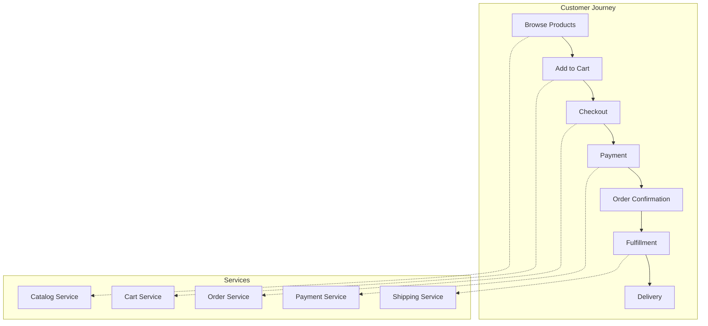
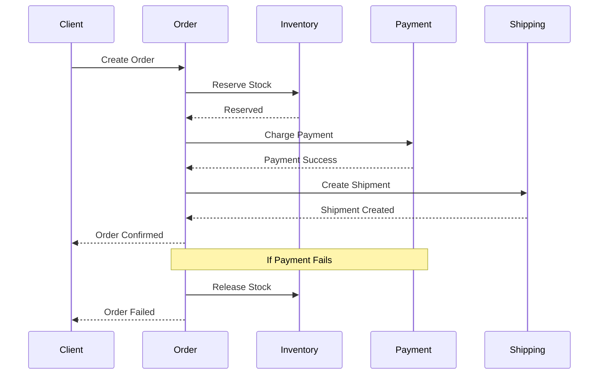
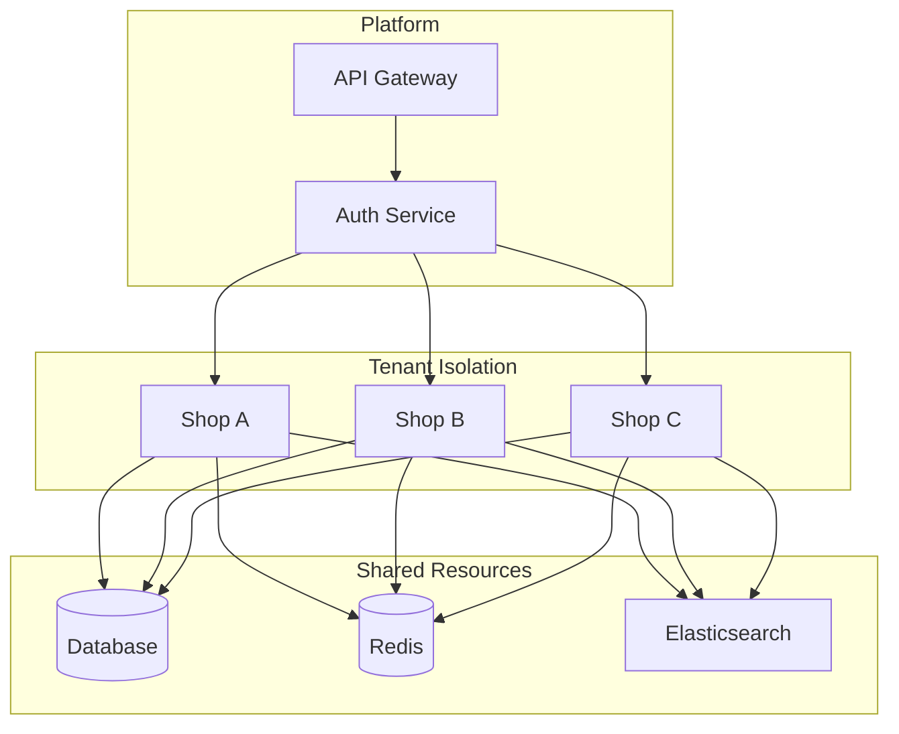

# AD-016: E-commerce System Design

## 1. Architecture Overview

### 1.1 Definition and Philosophy

E-commerce systems handle online transactions, product catalog management, inventory control, payment processing, and order fulfillment. These systems require:

- **High Availability**: 24/7 operation during peak traffic
- **Scalability**: Handle flash sales and seasonal spikes
- **Consistency**: Accurate inventory and pricing
- **Security**: PCI DSS compliance, fraud prevention
- **Performance**: Sub-second page loads

### 1.2 E-commerce System Architecture

```
┌─────────────────────────────────────────────────────────────────────────────┐
│                     E-COMMERCE SYSTEM ARCHITECTURE                           │
├─────────────────────────────────────────────────────────────────────────────┤
│                                                                             │
│  ┌─────────────────────────────────────────────────────────────────────┐   │
│  │                        CLIENT LAYER                                  │   │
│  │  ┌─────────────┐  ┌─────────────┐  ┌─────────────┐  ┌─────────────┐ │   │
│  │  │    Web      │  │   Mobile    │  │   Admin     │  │  Partner    │ │   │
│  │  │   Store     │  │    Apps     │  │   Portal    │  │    APIs     │ │   │
│  │  │  (Next.js)  │  │(iOS/Android)│  │  (React)    │  │  (REST)     │ │   │
│  │  └──────┬──────┘  └──────┬──────┘  └──────┬──────┘  └──────┬──────┘ │   │
│  │         └────────────────┴────────────────┴────────────────┘        │   │
│  └──────────────────────────────────┬──────────────────────────────────┘   │
│                                     │                                       │
│  ┌──────────────────────────────────┼────────────────────────────────────┐ │
│  │                         EDGE LAYER                                      │ │
│  │  ┌─────────────┐  ┌─────────────┐  ┌─────────────┐  ┌─────────────┐   │ │
│  │  │    CDN      │  │     WAF     │  │   DDoS      │  │    Bot      │   │ │
│  │  │  (Static)   │  │  (Rules)    │  │  Protection │  │  Management │   │ │
│  │  └─────────────┘  └─────────────┘  └─────────────┘  └─────────────┘   │ │
│  └──────────────────────────────────┼────────────────────────────────────┘ │
│                                     │                                       │
│                                    ▼                                        │
│  ┌─────────────────────────────────────────────────────────────────────┐   │
│  │                        API GATEWAY LAYER                             │   │
│  │  ┌─────────────────────────────────────────────────────────────┐    │   │
│  │  │                    API Gateway (Kong/AWS)                    │    │   │
│  │  │  ┌───────────┐ ┌───────────┐ ┌───────────┐ ┌───────────┐   │    │   │
│  │  │  │   Auth    │ │  Rate     │ │  Routing  │ │  Caching  │   │    │   │
│  │  │  │ (OAuth2)  │ │  Limit    │ │ (Service) │ │ (Redis)   │   │    │   │
│  │  │  └───────────┘ └───────────┘ └───────────┘ └───────────┘   │    │   │
│  │  └─────────────────────────────────────────────────────────────┘    │   │
│  └─────────────────────────────────────────────────────────────────────┘   │
│                                    │                                        │
│                                    ▼                                        │
│  ┌─────────────────────────────────────────────────────────────────────┐   │
│  │                     SERVICE LAYER (Microservices)                    │   │
│  │                                                                      │   │
│  │  Core Services:                                                      │   │
│  │  ┌─────────────┐  ┌─────────────┐  ┌─────────────┐  ┌─────────────┐ │   │
│  │  │    User     │  │   Product   │  │    Cart     │  │    Order    │ │   │
│  │  │   Service   │  │   Catalog   │  │   Service   │  │   Service   │ │   │
│  │  │  (Auth/     │  │  (Search/   │  │  (Session)  │  │  (Workflow) │ │   │
│  │  │   Profile)  │  │  Inventory) │  │             │  │             │ │   │
│  │  └─────────────┘  └─────────────┘  └─────────────┘  └─────────────┘ │   │
│  │                                                                      │   │
│  │  Supporting Services:                                                │   │
│  │  ┌─────────────┐  ┌─────────────┐  ┌─────────────┐  ┌─────────────┐ │   │
│  │  │   Payment   │  │   Pricing   │  │  Inventory  │  │  Shipping   │ │   │
│  │  │   Service   │  │   Engine    │  │   Service   │  │   Service   │ │   │
│  │  │ (PCI DSS)   │  │ (Rules/Promo)│  │ (Stock Mgmt)│  │ (Fulfillment)│ │   │
│  │  ├─────────────┤  ├─────────────┤  ├─────────────┤  ├─────────────┤ │   │
│  │  │Notification │  │   Search    │  │Analytics/Seg│  │   Review    │ │   │
│  │  │   Service   │  │   Service   │  │  mentation  │  │   Service   │ │   │
│  │  └─────────────┘  └─────────────┘  └─────────────┘  └─────────────┘ │   │
│  │                                                                      │   │
│  └─────────────────────────────────────────────────────────────────────┘   │
│                                    │                                        │
│                                    ▼                                        │
│  ┌─────────────────────────────────────────────────────────────────────┐   │
│  │                        DATA LAYER                                    │   │
│  │  ┌─────────────┐  ┌─────────────┐  ┌─────────────┐  ┌─────────────┐ │   │
│  │  │  PostgreSQL │  │    Redis    │  │Elasticsearch│  │    Kafka    │ │   │
│  │  │ (Orders/    │  │   (Cache/   │  │   (Product  │  │  (Events/   │ │   │
│  │  │  Users)     │  │  Sessions)  │  │   Search)   │  │  Messaging) │ │   │
│  │  ├─────────────┤  ├─────────────┤  ├─────────────┤  ├─────────────┤ │   │
│  │  │   MongoDB   │  │ ClickHouse/ │  │     S3      │  │    MinIO    │ │   │
│  │  │ (Catalog/   │  │   BigQuery  │  │  (Images/   │  │  (Object)   │ │   │
│  │  │  Content)   │  │ (Analytics) │  │   Files)    │  │             │ │   │
│  │  └─────────────┘  └─────────────┘  └─────────────┘  └─────────────┘ │   │
│  └─────────────────────────────────────────────────────────────────────┘   │
│                                                                             │
│  ┌─────────────────────────────────────────────────────────────────────┐   │
│  │                     EXTERNAL INTEGRATIONS                            │   │
│  │  ┌─────────────┐  ┌─────────────┐  ┌─────────────┐  ┌─────────────┐ │   │
│  │  │   Stripe/   │  │    PayPal   │  │   UPS/FedEx │  │   TaxJar/   │ │   │
│  │  │   Adyen     │  │             │  │   Shipping  │  │   Avalara   │ │   │
│  │  └─────────────┘  └─────────────┘  └─────────────┘  └─────────────┘ │   │
│  └─────────────────────────────────────────────────────────────────────┘   │
│                                                                             │
└─────────────────────────────────────────────────────────────────────────────┘
```

---

## 2. Core Services Design

### 2.1 Product Catalog Service

```go
package catalog

import (
    "context"
    "encoding/json"
    "fmt"
    "time"

    "github.com/elastic/go-elasticsearch/v8"
    "go.mongodb.org/mongo-driver/bson"
    "go.mongodb.org/mongo-driver/mongo"
)

// ProductCatalogService manages product information
type ProductCatalogService struct {
    mongoDB      *mongo.Database
    esClient     *elasticsearch.Client
    redisClient  *redis.Client
    cache        Cache
}

// Product represents a catalog product
type Product struct {
    ID              string                 `bson:"_id" json:"id"`
    SKU             string                 `bson:"sku" json:"sku"`
    Name            string                 `bson:"name" json:"name"`
    Description     string                 `bson:"description" json:"description"`
    Brand           string                 `bson:"brand" json:"brand"`
    Categories      []string               `bson:"categories" json:"categories"`
    Price           Price                  `bson:"price" json:"price"`
    Inventory       Inventory              `bson:"inventory" json:"inventory"`
    Attributes      map[string]interface{} `bson:"attributes" json:"attributes"`
    Images          []Image                `bson:"images" json:"images"`
    Variants        []Variant              `bson:"variants" json:"variants,omitempty"`
    Status          string                 `bson:"status" json:"status"`
    CreatedAt       time.Time              `bson:"created_at" json:"created_at"`
    UpdatedAt       time.Time              `bson:"updated_at" json:"updated_at"`
    SearchMetadata  SearchMetadata         `bson:"search_metadata" json:"-"`
}

type Price struct {
    Base          float64 `bson:"base" json:"base"`
    Currency      string  `bson:"currency" json:"currency"`
    SalePrice     float64 `bson:"sale_price,omitempty" json:"sale_price,omitempty"`
    SaleStart     *time.Time `bson:"sale_start,omitempty" json:"sale_start,omitempty"`
    SaleEnd       *time.Time `bson:"sale_end,omitempty" json:"sale_end,omitempty"`
}

type Inventory struct {
    Quantity      int    `bson:"quantity" json:"quantity"`
    Reserved      int    `bson:"reserved" json:"reserved"`
    Available     int    `bson:"available" json:"available"`
    WarehouseID   string `bson:"warehouse_id" json:"warehouse_id"`
    LowStockThreshold int `bson:"low_stock_threshold" json:"low_stock_threshold"`
}

// GetProduct retrieves product by ID with caching
func (s *ProductCatalogService) GetProduct(ctx context.Context, productID string) (*Product, error) {
    // Check cache
    cacheKey := fmt.Sprintf("product:%s", productID)
    if cached, ok := s.cache.Get(cacheKey); ok {
        return cached.(*Product), nil
    }

    // Get from MongoDB
    var product Product
    err := s.mongoDB.Collection("products").FindOne(ctx, bson.M{"_id": productID}).Decode(&product)
    if err != nil {
        return nil, err
    }

    // Calculate available quantity
    product.Inventory.Available = product.Inventory.Quantity - product.Inventory.Reserved

    // Cache result
    s.cache.Set(cacheKey, &product, 5*time.Minute)

    return &product, nil
}

// SearchProducts performs faceted search
func (s *ProductCatalogService) SearchProducts(ctx context.Context, query SearchQuery) (*SearchResult, error) {
    // Build Elasticsearch query
    esQuery := map[string]interface{}{
        "bool": map[string]interface{}{
            "must": []map[string]interface{}{},
            "filter": []map[string]interface{}{},
        },
    }

    // Full-text search
    if query.Keyword != "" {
        esQuery["bool"]["must"] = append(esQuery["bool"]["must"].([]map[string]interface{}), map[string]interface{}{
            "multi_match": map[string]interface{}{
                "query":  query.Keyword,
                "fields": []string{"name^3", "description", "brand^2", "tags"},
                "type":   "best_fields",
                "fuzziness": "AUTO",
            },
        })
    }

    // Category filter
    if len(query.Categories) > 0 {
        esQuery["bool"]["filter"] = append(esQuery["bool"]["filter"].([]map[string]interface{}), map[string]interface{}{
            "terms": map[string]interface{}{"categories": query.Categories},
        })
    }

    // Price range filter
    if query.MinPrice > 0 || query.MaxPrice > 0 {
        priceRange := map[string]interface{}{}
        if query.MinPrice > 0 {
            priceRange["gte"] = query.MinPrice
        }
        if query.MaxPrice > 0 {
            priceRange["lte"] = query.MaxPrice
        }
        esQuery["bool"]["filter"] = append(esQuery["bool"]["filter"].([]map[string]interface{}), map[string]interface{}{
            "range": map[string]interface{}{"price.base": priceRange},
        })
    }

    // In-stock filter
    if query.InStockOnly {
        esQuery["bool"]["filter"] = append(esQuery["bool"]["filter"].([]map[string]interface{}), map[string]interface{}{
            "range": map[string]interface{}{"inventory.available": map[string]interface{}{"gt": 0}},
        })
    }

    // Facets
    aggs := map[string]interface{}{
        "categories": map[string]interface{}{
            "terms": map[string]interface{}{"field": "categories.keyword", "size": 20},
        },
        "brands": map[string]interface{}{
            "terms": map[string]interface{}{"field": "brand.keyword", "size": 50},
        },
        "price_ranges": map[string]interface{}{
            "histogram": map[string]interface{}{
                "field":    "price.base",
                "interval": 50,
            },
        },
        "avg_rating": map[string]interface{}{
            "avg": map[string]interface{}{"field": "ratings.average"},
        },
    }

    // Execute search
    searchBody, _ := json.Marshal(map[string]interface{}{
        "query": esQuery,
        "aggs":  aggs,
        "from":  query.Offset,
        "size":  query.Limit,
        "sort":  s.buildSort(query.SortBy, query.SortOrder),
    })

    res, err := s.esClient.Search(
        s.esClient.Search.WithContext(ctx),
        s.esClient.Search.WithIndex("products"),
        s.esClient.Search.WithBody(strings.NewReader(string(searchBody))),
    )
    if err != nil {
        return nil, err
    }
    defer res.Body.Close()

    return s.parseSearchResult(res)
}
```

### 2.2 Shopping Cart Service

```go
package cart

import (
    "context"
    "encoding/json"
    "fmt"
    "time"

    "github.com/go-redis/redis/v8"
)

// CartService manages shopping carts
type CartService struct {
    redis       *redis.Client
    productSvc  ProductService
    pricingSvc  PricingService
    inventorySvc InventoryService
}

// Cart represents a shopping cart
type Cart struct {
    ID          string      `json:"id"`
    UserID      string      `json:"user_id,omitempty"`
    SessionID   string      `json:"session_id,omitempty"`
    Items       []CartItem  `json:"items"`
    Subtotal    float64     `json:"subtotal"`
    Discount    float64     `json:"discount"`
    Tax         float64     `json:"tax"`
    Total       float64     `json:"total"`
    Currency    string      `json:"currency"`
    Coupons     []string    `json:"coupons,omitempty"`
    UpdatedAt   time.Time   `json:"updated_at"`
    ExpiresAt   time.Time   `json:"expires_at"`
}

type CartItem struct {
    ProductID   string  `json:"product_id"`
    SKU         string  `json:"sku"`
    Name        string  `json:"name"`
    Quantity    int     `json:"quantity"`
    UnitPrice   float64 `json:"unit_price"`
    TotalPrice  float64 `json:"total_price"`
    ImageURL    string  `json:"image_url,omitempty"`
    VariantData map[string]string `json:"variant_data,omitempty"`
}

const cartTTL = 30 * 24 * time.Hour // 30 days

// GetCart retrieves cart by ID
func (s *CartService) GetCart(ctx context.Context, cartID string) (*Cart, error) {
    key := fmt.Sprintf("cart:%s", cartID)

    data, err := s.redis.Get(ctx, key).Result()
    if err == redis.Nil {
        // Return empty cart
        return &Cart{
            ID:        cartID,
            Items:     []CartItem{},
            Currency:  "USD",
            UpdatedAt: time.Now(),
            ExpiresAt: time.Now().Add(cartTTL),
        }, nil
    }
    if err != nil {
        return nil, err
    }

    var cart Cart
    if err := json.Unmarshal([]byte(data), &cart); err != nil {
        return nil, err
    }

    // Refresh expiration
    s.redis.Expire(ctx, key, cartTTL)

    return &cart, nil
}

// AddItem adds item to cart
func (s *CartService) AddItem(ctx context.Context, cartID string, req AddItemRequest) (*Cart, error) {
    // Get cart
    cart, err := s.GetCart(ctx, cartID)
    if err != nil {
        return nil, err
    }

    // Validate product
    product, err := s.productSvc.GetProduct(ctx, req.ProductID)
    if err != nil {
        return nil, ErrProductNotFound
    }

    // Check inventory
    available, err := s.inventorySvc.CheckAvailability(ctx, req.ProductID, req.Quantity)
    if err != nil {
        return nil, err
    }
    if !available {
        return nil, ErrInsufficientInventory
    }

    // Get pricing
    price, err := s.pricingSvc.GetPrice(ctx, req.ProductID, req.Quantity)
    if err != nil {
        return nil, err
    }

    // Check if item already exists
    found := false
    for i, item := range cart.Items {
        if item.ProductID == req.ProductID &&
           jsonEqual(item.VariantData, req.VariantData) {
            // Update quantity
            newQty := item.Quantity + req.Quantity

            // Re-check inventory
            available, _ = s.inventorySvc.CheckAvailability(ctx, req.ProductID, newQty)
            if !available {
                return nil, ErrInsufficientInventory
            }

            cart.Items[i].Quantity = newQty
            cart.Items[i].TotalPrice = float64(newQty) * item.UnitPrice
            found = true
            break
        }
    }

    // Add new item
    if !found {
        cart.Items = append(cart.Items, CartItem{
            ProductID:   req.ProductID,
            SKU:         product.SKU,
            Name:        product.Name,
            Quantity:    req.Quantity,
            UnitPrice:   price,
            TotalPrice:  price * float64(req.Quantity),
            ImageURL:    product.Images[0].URL,
            VariantData: req.VariantData,
        })
    }

    // Recalculate totals
    if err := s.recalculateCart(ctx, cart); err != nil {
        return nil, err
    }

    // Save cart
    if err := s.saveCart(ctx, cart); err != nil {
        return nil, err
    }

    return cart, nil
}

// recalculateCart computes cart totals with discounts and tax
func (s *CartService) recalculateCart(ctx context.Context, cart *Cart) error {
    var subtotal float64
    for _, item := range cart.Items {
        subtotal += item.TotalPrice
    }

    cart.Subtotal = subtotal

    // Apply coupons
    discount, err := s.pricingSvc.CalculateDiscount(ctx, cart.Coupons, subtotal)
    if err != nil {
        // Log error but continue
        discount = 0
    }
    cart.Discount = discount

    // Calculate tax
    tax, err := s.pricingSvc.CalculateTax(ctx, cart.Subtotal-cart.Discount, cart.Currency)
    if err != nil {
        tax = 0
    }
    cart.Tax = tax

    cart.Total = cart.Subtotal - cart.Discount + cart.Tax
    cart.UpdatedAt = time.Now()

    return nil
}

// MergeCarts merges anonymous cart into user cart
func (s *CartService) MergeCarts(ctx context.Context, sessionCartID, userCartID string) (*Cart, error) {
    sessionCart, err := s.GetCart(ctx, sessionCartID)
    if err != nil {
        return nil, err
    }

    if len(sessionCart.Items) == 0 {
        return s.GetCart(ctx, userCartID)
    }

    userCart, err := s.GetCart(ctx, userCartID)
    if err != nil {
        return nil, err
    }

    // Merge items
    for _, item := range sessionCart.Items {
        // Add each item
        _, _ = s.AddItem(ctx, userCartID, AddItemRequest{
            ProductID:   item.ProductID,
            Quantity:    item.Quantity,
            VariantData: item.VariantData,
        })
    }

    // Delete session cart
    s.redis.Del(ctx, fmt.Sprintf("cart:%s", sessionCartID))

    return s.GetCart(ctx, userCartID)
}
```

### 2.3 Order Processing with Saga Pattern

```go
package order

import (
    "context"
    "fmt"
    "time"
)

// OrderService handles order lifecycle
type OrderService struct {
    repo         OrderRepository
    inventorySvc InventoryService
    paymentSvc   PaymentService
    shippingSvc  ShippingService
    eventBus     EventBus
}

// OrderSaga orchestrates distributed order transaction
type OrderSaga struct {
    orderID      string
    steps        []SagaStep
    compensations []func() error
}

type SagaStep struct {
    Name       string
    Execute    func() error
    Compensate func() error
}

// CreateOrder creates new order using saga pattern
func (s *OrderService) CreateOrder(ctx context.Context, req CreateOrderRequest) (*Order, error) {
    // 1. Create order record
    order := &Order{
        ID:         generateOrderID(),
        UserID:     req.UserID,
        Status:     OrderStatusPending,
        Items:      req.Items,
        Shipping:   req.ShippingAddress,
        CreatedAt:  time.Now(),
    }

    // Calculate totals
    for _, item := range order.Items {
        order.Subtotal += item.TotalPrice
    }
    order.Total = order.Subtotal + order.Tax - order.Discount

    // Save order
    if err := s.repo.Create(ctx, order); err != nil {
        return nil, err
    }

    // Execute saga
    saga := s.buildOrderSaga(order, req.PaymentMethod)

    if err := saga.Execute(); err != nil {
        // Saga failed, order will be in failed state
        order.Status = OrderStatusFailed
        s.repo.Update(ctx, order)
        return nil, err
    }

    return order, nil
}

func (s *OrderService) buildOrderSaga(order *Order, paymentMethod string) *OrderSaga {
    saga := &OrderSaga{orderID: order.ID}

    // Step 1: Reserve Inventory
    saga.AddStep(SagaStep{
        Name: "ReserveInventory",
        Execute: func() error {
            for _, item := range order.Items {
                if err := s.inventorySvc.Reserve(ctx, item.ProductID, item.Quantity, order.ID); err != nil {
                    return err
                }
            }
            return nil
        },
        Compensate: func() error {
            return s.inventorySvc.ReleaseReservation(ctx, order.ID)
        },
    })

    // Step 2: Process Payment
    saga.AddStep(SagaStep{
        Name: "ProcessPayment",
        Execute: func() error {
            payment, err := s.paymentSvc.Charge(ctx, PaymentRequest{
                OrderID:       order.ID,
                UserID:        order.UserID,
                Amount:        order.Total,
                Currency:      order.Currency,
                PaymentMethod: paymentMethod,
                Description:   fmt.Sprintf("Order %s", order.ID),
            })
            if err != nil {
                return err
            }
            order.PaymentID = payment.ID
            order.PaymentStatus = PaymentStatusCompleted
            return s.repo.Update(ctx, order)
        },
        Compensate: func() error {
            if order.PaymentID != "" {
                return s.paymentSvc.Refund(ctx, order.PaymentID)
            }
            return nil
        },
    })

    // Step 3: Create Shipment
    saga.AddStep(SagaStep{
        Name: "CreateShipment",
        Execute: func() error {
            shipment, err := s.shippingSvc.CreateShipment(ctx, ShipmentRequest{
                OrderID:   order.ID,
                Items:     order.Items,
                Address:   order.Shipping,
                Service:   order.ShippingMethod,
            })
            if err != nil {
                return err
            }
            order.ShipmentID = shipment.ID
            order.Status = OrderStatusConfirmed
            return s.repo.Update(ctx, order)
        },
        Compensate: func() error {
            if order.ShipmentID != "" {
                return s.shippingSvc.CancelShipment(ctx, order.ShipmentID)
            }
            return nil
        },
    })

    // Step 4: Send Notifications
    saga.AddStep(SagaStep{
        Name: "SendNotifications",
        Execute: func() error {
            // Fire and forget - no compensation needed
            s.eventBus.Publish(ctx, OrderConfirmedEvent{
                OrderID:    order.ID,
                UserID:     order.UserID,
                Total:      order.Total,
                Timestamp:  time.Now(),
            })
            return nil
        },
        Compensate: nil, // No compensation for notifications
    })

    return saga
}

func (s *OrderSaga) Execute() error {
    for i, step := range s.steps {
        if err := step.Execute(); err != nil {
            // Execute compensations in reverse order
            for j := i - 1; j >= 0; j-- {
                if s.steps[j].Compensate != nil {
                    if compErr := s.steps[j].Compensate(); compErr != nil {
                        // Log compensation failure - requires manual intervention
                        fmt.Printf("Compensation failed for step %s: %v\n", s.steps[j].Name, compErr)
                    }
                }
            }
            return fmt.Errorf("saga failed at step %s: %w", step.Name, err)
        }
    }
    return nil
}

func (s *OrderSaga) AddStep(step SagaStep) {
    s.steps = append(s.steps, step)
}
```

---

## 3. Scalability Analysis

### 3.1 Handling Peak Traffic

```
┌─────────────────────────────────────────────────────────────────────────────┐
│                    E-COMMERCE SCALING STRATEGIES                             │
├─────────────────────────────────────────────────────────────────────────────┤
│                                                                             │
│  Normal Traffic                    Peak Traffic (Flash Sale)                │
│  ─────────────                     ─────────────────────────                │
│                                                                             │
│  ┌──────────┐                      ┌──────────────────────────────┐         │
│  │  1000    │                      │         CDN Cache            │         │
│  │  RPS     │                      │    ┌─────┐ ┌─────┐ ┌─────┐  │         │
│  └────┬─────┘                      │    │ PoP │ │ PoP │ │ PoP │  │         │
│       │                            │    └─────┘ └─────┘ └─────┘  │         │
│       ▼                            └──────────────┬──────────────┘         │
│  ┌──────────┐                                     │                        │
│  │ 10 Web   │                                     ▼                        │
│  │ Servers  │                            ┌─────────────────┐               │
│  └────┬─────┘                            │   Rate Limiter  │               │
│       │                                  │   (Queue)       │               │
│       ▼                                  └────────┬────────┘               │
│  ┌──────────┐                                     │                        │
│  │  2 DB    │                                     ▼                        │
│  │ Servers  │                            ┌─────────────────┐               │
│  └──────────┘                            │  Auto-scaled    │               │
│                                          │  Web Servers    │               │
│                                          │  (100+ pods)    │               │
│                                          └────────┬────────┘               │
│                                                   │                        │
│                                                   ▼                        │
│                                          ┌─────────────────┐               │
│                                          │  Read Replicas  │               │
│                                          │  (10+ replicas) │               │
│                                          └─────────────────┘               │
│                                                                             │
│  Strategies:                                                                │
│  • Static asset caching (CDN) - 95% cache hit rate                          │
│  • Database read replicas for product catalog                               │
│  • Redis caching for hot products                                           │
│  • Queue-based inventory reservation                                        │
│  • Circuit breakers for external services                                   │
│  • Graceful degradation (disable recommendations)                           │
│                                                                             │
└─────────────────────────────────────────────────────────────────────────────┘
```

---

## 4. Technology Stack

| Component | Technology |
|-----------|------------|
| **Frontend** | Next.js, React Native |
| **API Gateway** | Kong, AWS API Gateway |
| **Services** | Go, Node.js |
| **Database** | PostgreSQL, MongoDB |
| **Search** | Elasticsearch |
| **Cache** | Redis Cluster |
| **Queue** | Apache Kafka |
| **Storage** | S3, CloudFront |

---

## 5. Case Studies

### 5.1 Amazon Architecture Principles

- **Service-oriented architecture**: 1000+ microservices
- **Two-pizza teams**: Small, autonomous teams
- **API-first**: All functionality exposed via APIs
- **Customer obsession**: Metrics-driven decisions

### 5.2 Shopify Scale

- 1M+ merchants
- Black Friday: 3M+ requests/minute
- Checkout: Distributed saga pattern
- Multi-tenant with tenant isolation

---

## 6. Visual Representations

### 6.1 E-commerce System Flow



### 6.2 Order Processing Saga



### 6.3 Multi-Tenant Architecture



---

## 7. Anti-Patterns

| Anti-Pattern | Problem | Solution |
|--------------|---------|----------|
| **Over-fetching** | Slow API responses | GraphQL or field selection |
| **Inventory Oversell** | Double-booking | Pessimistic locking |
| **Synchronous Inventory** | Slow checkout | Async reservation |
| **Single Database** | Scalability bottleneck | Read replicas, sharding |
| **No Idempotency** | Duplicate orders | Idempotency keys |

---

*Document Version: 1.0*
*Last Updated: 2026-04-02*
*Classification: S-Level Technical Reference*
