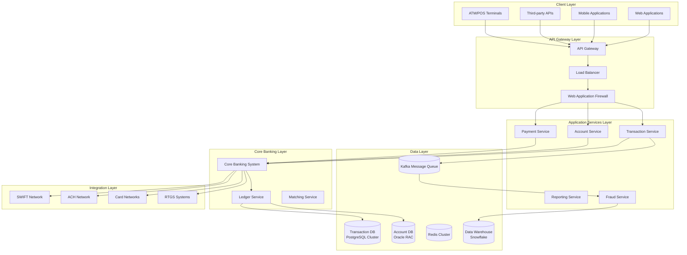
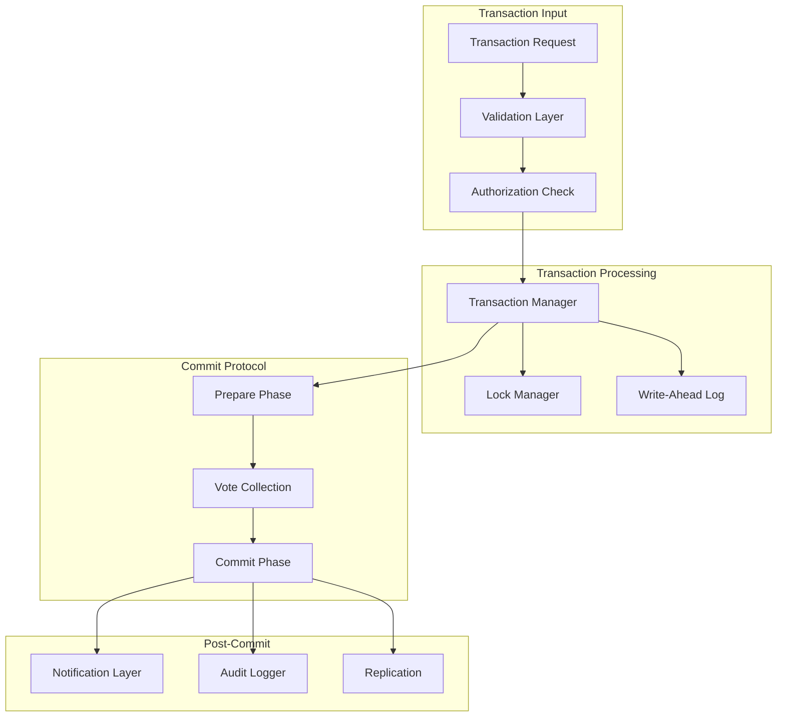
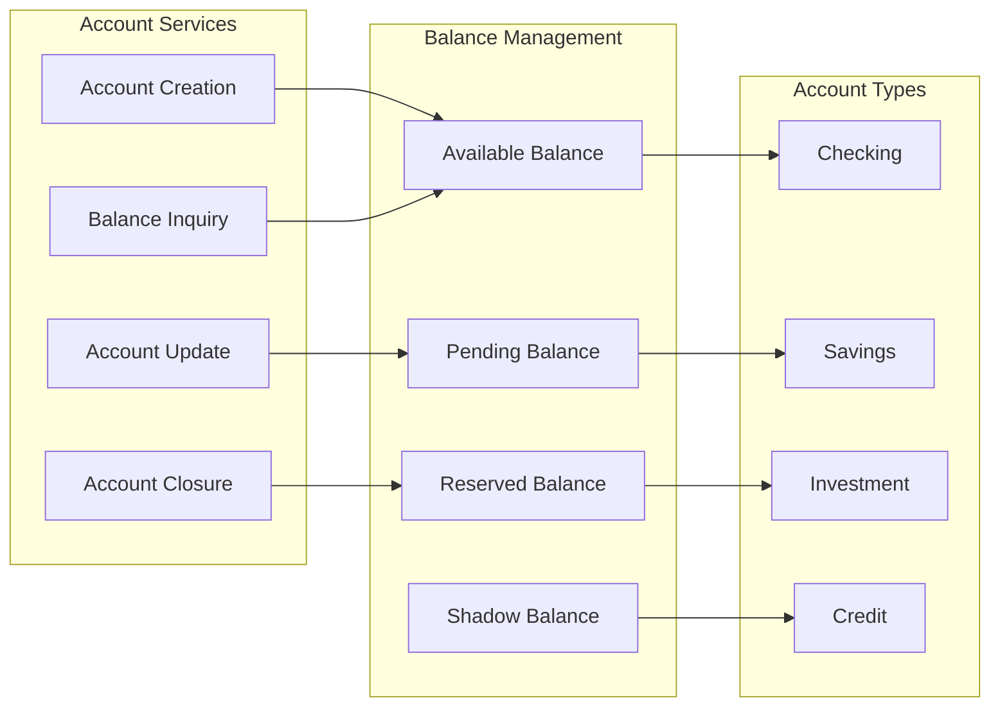
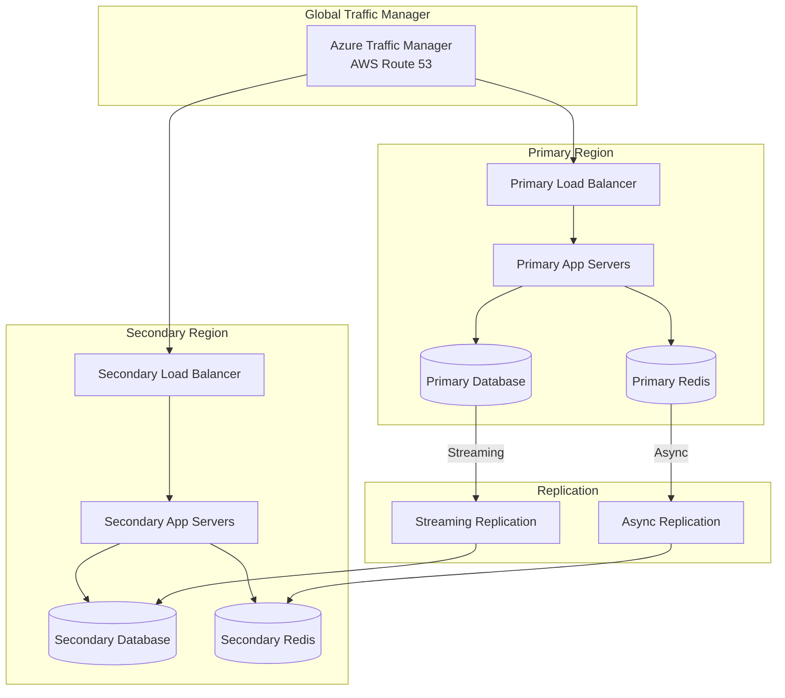

# AD-017: Financial System Design

## Overview

Financial systems represent one of the most demanding application domains in software engineering, requiring extreme reliability, strong consistency, comprehensive audit trails, and strict regulatory compliance. These systems handle monetary transactions, securities trading, banking operations, insurance processing, and payment processing - where errors can have significant financial and legal consequences.

## 1. Domain-Specific Requirements Analysis

### 1.1 Core Functional Requirements

#### Transaction Processing

- **Atomicity**: All transactions must be atomic - either fully complete or fully rolled back
- **Consistency**: Account balances must always remain consistent across all operations
- **Idempotency**: Duplicate transaction submissions must not result in duplicate processing
- **Reversibility**: Support for transaction reversal and compensation mechanisms
- **Batch Processing**: High-volume batch transaction processing capabilities
- **Real-time Processing**: Sub-millisecond transaction validation and execution

#### Account Management

- **Multi-currency Support**: Handle transactions in multiple currencies with exchange rate management
- **Account Types**: Support various account types (checking, savings, investment, credit)
- **Balance Tracking**: Real-time balance calculation with pending transaction handling
- **Account Hierarchy**: Support for sub-accounts and account aggregation
- **Statement Generation**: Automated periodic statement generation and delivery

#### Compliance and Reporting

- **Audit Trails**: Complete immutable audit logs of all financial operations
- **Regulatory Reporting**: Automated generation of regulatory reports (SAR, CTR, KYC)
- **Tax Reporting**: Tax document generation and reporting capabilities
- **Risk Assessment**: Real-time risk scoring and exposure calculation

### 1.2 Non-Functional Requirements

#### Performance Requirements

| Metric | Target | Criticality |
|--------|--------|-------------|
| Transaction Latency | < 50ms (p99) | Critical |
| Throughput | > 10,000 TPS | Critical |
| Query Response | < 100ms | High |
| Report Generation | < 5 minutes | Medium |
| System Availability | 99.999% (5-nines) | Critical |

#### Security Requirements

- **Encryption**: All data at rest and in transit must be encrypted
- **Authentication**: Multi-factor authentication with strong password policies
- **Authorization**: Role-based access control (RBAC) with principle of least privilege
- **Fraud Detection**: Real-time fraud detection and prevention
- **Data Masking**: Sensitive data masking in non-production environments

#### Compliance Requirements

- **PCI DSS**: Payment Card Industry Data Security Standard compliance
- **SOX**: Sarbanes-Oxley Act compliance for financial reporting
- **GDPR**: General Data Protection Regulation compliance
- **KYC/AML**: Know Your Customer and Anti-Money Laundering regulations
- **Basel III**: Banking regulatory framework compliance

## 2. Architecture Formalization

### 2.1 System Architecture Overview



### 2.2 Component Architecture

#### Transaction Processing Engine



#### Account Management System



## 3. Scalability and Performance Considerations

### 3.1 Horizontal Scaling Strategies

#### Database Sharding

```go
// Sharding strategy based on account ID
type ShardManager struct {
    shards []*Shard
    hasher consistent.Hasher
}

type Shard struct {
    ID       int
    DB       *sql.DB
    ReadOnly bool
}

func (sm *ShardManager) GetShard(accountID string) (*Shard, error) {
    shardID := sm.hasher.GetShard(accountID)
    if shardID >= len(sm.shards) {
        return nil, fmt.Errorf("invalid shard ID: %d", shardID)
    }
    return sm.shards[shardID], nil
}

// Consistent hashing for shard selection
type ConsistentHasher struct {
    ring *consistent.Consistent
}

func (ch *ConsistentHasher) GetShard(key string) int {
    member, _ := ch.ring.Get(key)
    shardID, _ := strconv.Atoi(member)
    return shardID
}
```

#### Read Replicas

```go
type DBCluster struct {
    master   *sql.DB
    replicas []*sql.DB
    counter  uint64
}

func (c *DBCluster) GetReadDB() *sql.DB {
    // Round-robin selection
    idx := atomic.AddUint64(&c.counter, 1) % uint64(len(c.replicas))
    return c.replicas[idx]
}

func (c *DBCluster) GetWriteDB() *sql.DB {
    return c.master
}
```

### 3.2 Caching Strategies

#### Multi-Level Caching

```go
type CacheManager struct {
    l1Cache *ristretto.Cache      // In-memory L1
    l2Cache *redis.Client         // Redis L2
    l3Cache *bigcache.BigCache    // Off-heap cache
}

func (cm *CacheManager) Get(ctx context.Context, key string) (interface{}, error) {
    // Try L1 cache first
    if val, found := cm.l1Cache.Get(key); found {
        metrics.CacheHits.WithLabelValues("l1").Inc()
        return val, nil
    }

    // Try L2 cache
    val, err := cm.l2Cache.Get(ctx, key).Result()
    if err == nil {
        // Backfill L1
        cm.l1Cache.Set(key, val, 0)
        metrics.CacheHits.WithLabelValues("l2").Inc()
        return val, nil
    }

    // Try L3 cache
    if entry, err := cm.l3Cache.Get(key); err == nil {
        // Backfill L1 and L2
        cm.l1Cache.Set(key, entry, 0)
        cm.l2Cache.Set(ctx, key, entry, 0)
        metrics.CacheHits.WithLabelValues("l3").Inc()
        return entry, nil
    }

    metrics.CacheMisses.Inc()
    return nil, ErrCacheMiss
}
```

### 3.3 Performance Optimization

#### Connection Pooling

```go
type DBConfig struct {
    MaxOpenConns    int
    MaxIdleConns    int
    ConnMaxLifetime time.Duration
    ConnMaxIdleTime time.Duration
}

func NewDBPool(cfg DBConfig) (*sql.DB, error) {
    db, err := sql.Open("postgres", cfg.DSN)
    if err != nil {
        return nil, err
    }

    db.SetMaxOpenConns(cfg.MaxOpenConns)
    db.SetMaxIdleConns(cfg.MaxIdleConns)
    db.SetConnMaxLifetime(cfg.ConnMaxLifetime)
    db.SetConnMaxIdleTime(cfg.ConnMaxIdleTime)

    return db, nil
}
```

#### Async Processing

```go
type AsyncProcessor struct {
    workerPool chan struct{}
    taskQueue  chan Task
    wg         sync.WaitGroup
}

type Task struct {
    ID      string
    Type    string
    Payload interface{}
    Handler func(context.Context, interface{}) error
}

func (ap *AsyncProcessor) Submit(ctx context.Context, task Task) error {
    select {
    case ap.taskQueue <- task:
        return nil
    case <-ctx.Done():
        return ctx.Err()
    }
}

func (ap *AsyncProcessor) Start(workers int) {
    for i := 0; i < workers; i++ {
        ap.wg.Add(1)
        go ap.worker()
    }
}
```

## 4. Technology Stack Recommendations

### 4.1 Core Technologies

| Layer | Technology | Purpose |
|-------|-----------|---------|
| Language | Go 1.21+ | High-performance backend services |
| Framework | Gin/Fiber | HTTP API framework |
| gRPC | Protocol Buffers | Inter-service communication |
| Database | PostgreSQL 15+ | Primary transaction database |
| Database | Oracle RAC | Core banking records |
| Cache | Redis Cluster | High-speed caching |
| Message Queue | Apache Kafka | Event streaming |
| Search | Elasticsearch | Transaction search |
| Monitoring | Prometheus/Grafana | Metrics and alerting |
| Tracing | Jaeger/Zipkin | Distributed tracing |

### 4.2 Go Libraries

```go
// Core dependencies
go get github.com/gin-gonic/gin
go get github.com/jackc/pgx/v5
go get github.com/redis/go-redis/v9
go get github.com/IBM/sarama
go get github.com/olivere/elastic/v7
go get go.uber.org/zap
go get github.com/prometheus/client_golang
go get github.com/hashicorp/vault/api
go get github.com/golang-jwt/jwt/v5
```

### 4.3 Infrastructure

| Component | Technology |
|-----------|-----------|
| Container Orchestration | Kubernetes |
| Service Mesh | Istio |
| API Gateway | Kong/AWS API Gateway |
| Load Balancer | NGINX/HAProxy |
| Secrets Management | HashiCorp Vault |
| CI/CD | GitLab CI/GitHub Actions |

## 5. Industry Case Studies

### 5.1 Case Study: Robinhood Trading Platform

**Challenge**: Build a commission-free trading platform capable of handling millions of concurrent users with sub-second trade execution.

**Architecture**:

- Microservices architecture with 200+ services
- Event-driven architecture using Kafka
- PostgreSQL for primary data storage
- Redis for caching and session management
- Custom matching engine in Go

**Results**:

- 22 million funded accounts
- Peak of 4.3 million daily active users
- Sub-100ms order execution time
- 99.99% uptime

**Lessons Learned**:

1. Importance of circuit breakers during market volatility
2. Need for comprehensive chaos engineering
3. Real-time monitoring is critical
4. Database connection pooling optimization

### 5.2 Case Study: Wise (formerly TransferWise) Payment System

**Challenge**: Build a cross-border payment platform supporting 50+ currencies with transparent fees and real exchange rates.

**Architecture**:

- Microservices with bounded contexts
- Event sourcing for transaction history
- PostgreSQL with read replicas
- Kafka for event streaming
- React frontend with Go backend

**Results**:

- £10+ billion monthly transactions
- 10 million+ customers
- 99.9% transaction success rate
- Average transfer time: 2-3 seconds

**Key Innovations**:

1. Peer-to-peer matching engine
2. Real-time fraud detection
3. Multi-currency ledger system
4. Regulatory compliance automation

### 5.3 Case Study: Goldman Sachs Transaction Banking

**Challenge**: Modernize legacy transaction banking platform to handle $5+ trillion in daily transaction volume.

**Architecture**:

- Cloud-native microservices
- Apache Kafka for event streaming
- Cassandra for time-series data
- Redis for caching
- Go-based payment processing engine

**Results**:

- 50% reduction in processing time
- 99.999% availability
- $2B+ cost savings over 5 years
- Zero data loss incidents

## 6. Go Implementation Examples

### 6.1 Transaction Processing Service

```go
package transaction

import (
    "context"
    "database/sql"
    "encoding/json"
    "fmt"
    "time"

    "github.com/google/uuid"
    "github.com/shopspring/decimal"
    "go.uber.org/zap"
)

// Transaction represents a financial transaction
type Transaction struct {
    ID            string          `json:"id"`
    AccountID     string          `json:"account_id"`
    Type          TransactionType `json:"type"`
    Amount        decimal.Decimal `json:"amount"`
    Currency      string          `json:"currency"`
    Status        Status          `json:"status"`
    ReferenceID   string          `json:"reference_id"`
    Description   string          `json:"description"`
    CreatedAt     time.Time       `json:"created_at"`
    UpdatedAt     time.Time       `json:"updated_at"`
    ProcessedAt   *time.Time      `json:"processed_at,omitempty"`
    Metadata      json.RawMessage `json:"metadata,omitempty"`
}

type TransactionType string

const (
    TxnTypeDebit   TransactionType = "DEBIT"
    TxnTypeCredit  TransactionType = "CREDIT"
    TxnTypeTransfer TransactionType = "TRANSFER"
)

type Status string

const (
    StatusPending   Status = "PENDING"
    StatusProcessing Status = "PROCESSING"
    StatusCompleted Status = "COMPLETED"
    StatusFailed    Status = "FAILED"
    StatusReversed  Status = "REVERSED"
)

// TransactionService handles transaction processing
type TransactionService struct {
    db          *sql.DB
    ledger      LedgerService
    auditor     AuditService
    fraudChecker FraudService
    logger      *zap.Logger
    metrics     *Metrics
}

// ProcessTransaction processes a financial transaction with ACID guarantees
func (s *TransactionService) ProcessTransaction(ctx context.Context, txn *Transaction) error {
    // Generate transaction ID
    txn.ID = uuid.New().String()
    txn.Status = StatusPending
    txn.CreatedAt = time.Now()

    // Start distributed transaction
    tx, err := s.db.BeginTx(ctx, &sql.TxOptions{
        Isolation: sql.LevelSerializable,
        ReadOnly:  false,
    })
    if err != nil {
        s.logger.Error("failed to begin transaction", zap.Error(err))
        return fmt.Errorf("begin transaction: %w", err)
    }
    defer tx.Rollback()

    // Fraud check
    riskScore, err := s.fraudChecker.Evaluate(ctx, txn)
    if err != nil {
        s.logger.Error("fraud check failed", zap.Error(err), zap.String("txn_id", txn.ID))
        return fmt.Errorf("fraud check: %w", err)
    }

    if riskScore > 0.8 {
        txn.Status = StatusFailed
        s.logTransaction(ctx, txn, "FRAUD_DETECTED")
        return fmt.Errorf("transaction flagged as fraudulent: score=%f", riskScore)
    }

    // Update account balance
    if err := s.updateBalance(ctx, tx, txn); err != nil {
        s.logger.Error("balance update failed", zap.Error(err), zap.String("txn_id", txn.ID))
        return fmt.Errorf("update balance: %w", err)
    }

    // Insert transaction record
    if err := s.insertTransaction(ctx, tx, txn); err != nil {
        s.logger.Error("transaction insert failed", zap.Error(err), zap.String("txn_id", txn.ID))
        return fmt.Errorf("insert transaction: %w", err)
    }

    // Update ledger
    if err := s.ledger.Record(ctx, tx, txn); err != nil {
        s.logger.Error("ledger update failed", zap.Error(err), zap.String("txn_id", txn.ID))
        return fmt.Errorf("ledger record: %w", err)
    }

    // Commit transaction
    if err := tx.Commit(); err != nil {
        s.logger.Error("transaction commit failed", zap.Error(err), zap.String("txn_id", txn.ID))
        return fmt.Errorf("commit transaction: %w", err)
    }

    // Update status
    now := time.Now()
    txn.Status = StatusCompleted
    txn.ProcessedAt = &now

    // Async audit logging
    go s.auditor.LogTransaction(context.Background(), txn)

    // Update metrics
    s.metrics.TransactionProcessed.WithLabelValues(string(txn.Type), string(txn.Status)).Inc()
    s.metrics.TransactionAmount.WithLabelValues(string(txn.Type)).Add(txn.Amount.InexactFloat64())

    return nil
}

func (s *TransactionService) updateBalance(ctx context.Context, tx *sql.Tx, txn *Transaction) error {
    query := `
        UPDATE accounts
        SET balance = balance + $1,
            available_balance = available_balance + $1,
            last_transaction_at = $2,
            version = version + 1,
            updated_at = $2
        WHERE id = $3 AND version = $4
        RETURNING version
    `

    amount := txn.Amount
    if txn.Type == TxnTypeDebit || txn.Type == TxnTypeTransfer {
        amount = amount.Neg()
    }

    var newVersion int
    err := tx.QueryRowContext(ctx, query, amount, time.Now(), txn.AccountID, txn.Version).Scan(&newVersion)
    if err == sql.ErrNoRows {
        return fmt.Errorf("concurrent modification detected")
    }
    if err != nil {
        return err
    }

    txn.Version = newVersion
    return nil
}

func (s *TransactionService) insertTransaction(ctx context.Context, tx *sql.Tx, txn *Transaction) error {
    query := `
        INSERT INTO transactions (
            id, account_id, type, amount, currency, status,
            reference_id, description, metadata, created_at, updated_at
        ) VALUES ($1, $2, $3, $4, $5, $6, $7, $8, $9, $10, $11)
    `

    _, err := tx.ExecContext(ctx, query,
        txn.ID, txn.AccountID, txn.Type, txn.Amount, txn.Currency,
        txn.Status, txn.ReferenceID, txn.Description, txn.Metadata,
        txn.CreatedAt, txn.UpdatedAt,
    )
    return err
}
```

### 6.2 Account Service with Optimistic Locking

```go
package account

import (
    "context"
    "database/sql"
    "fmt"
    "time"

    "github.com/shopspring/decimal"
)

// Account represents a bank account
type Account struct {
    ID               string          `json:"id"`
    CustomerID       string          `json:"customer_id"`
    Type             AccountType     `json:"type"`
    Status           AccountStatus   `json:"status"`
    Currency         string          `json:"currency"`
    Balance          decimal.Decimal `json:"balance"`
    AvailableBalance decimal.Decimal `json:"available_balance"`
    HoldAmount       decimal.Decimal `json:"hold_amount"`
    DailyLimit       decimal.Decimal `json:"daily_limit"`
    MonthlyLimit     decimal.Decimal `json:"monthly_limit"`
    Version          int             `json:"version"`
    CreatedAt        time.Time       `json:"created_at"`
    UpdatedAt        time.Time       `json:"updated_at"`
}

type AccountType string

const (
    AccountTypeChecking  AccountType = "CHECKING"
    AccountTypeSavings   AccountType = "SAVINGS"
    AccountTypeInvestment AccountType = "INVESTMENT"
    AccountTypeCredit    AccountType = "CREDIT"
)

type AccountStatus string

const (
    AccountStatusActive    AccountStatus = "ACTIVE"
    AccountStatusInactive  AccountStatus = "INACTIVE"
    AccountStatusSuspended AccountStatus = "SUSPENDED"
    AccountStatusClosed    AccountStatus = "CLOSED"
)

// AccountService provides account management operations
type AccountService struct {
    db      *sql.DB
    cache   Cache
    logger  *zap.Logger
    metrics *Metrics
}

// Transfer performs an account-to-account transfer
func (s *AccountService) Transfer(ctx context.Context, fromAccountID, toAccountID string, amount decimal.Decimal) (*TransferResult, error) {
    if amount.LessThanOrEqual(decimal.Zero) {
        return nil, fmt.Errorf("transfer amount must be positive")
    }

    transferID := uuid.New().String()

    tx, err := s.db.BeginTx(ctx, &sql.TxOptions{
        Isolation: sql.LevelSerializable,
    })
    if err != nil {
        return nil, fmt.Errorf("begin transaction: %w", err)
    }
    defer tx.Rollback()

    // Lock and validate source account
    fromAccount, err := s.getAccountForUpdate(ctx, tx, fromAccountID)
    if err != nil {
        return nil, fmt.Errorf("get source account: %w", err)
    }

    if fromAccount.Status != AccountStatusActive {
        return nil, fmt.Errorf("source account is not active")
    }

    if fromAccount.AvailableBalance.LessThan(amount) {
        return nil, fmt.Errorf("insufficient funds: available=%s, required=%s",
            fromAccount.AvailableBalance.String(), amount.String())
    }

    // Check daily limit
    dailySpent, err := s.getDailySpent(ctx, tx, fromAccountID)
    if err != nil {
        return nil, fmt.Errorf("get daily spent: %w", err)
    }

    if fromAccount.DailyLimit.GreaterThan(decimal.Zero) {
        if dailySpent.Add(amount).GreaterThan(fromAccount.DailyLimit) {
            return nil, fmt.Errorf("daily limit exceeded: spent=%s, limit=%s",
                dailySpent.String(), fromAccount.DailyLimit.String())
        }
    }

    // Lock and validate destination account
    toAccount, err := s.getAccountForUpdate(ctx, tx, toAccountID)
    if err != nil {
        return nil, fmt.Errorf("get destination account: %w", err)
    }

    if toAccount.Status != AccountStatusActive {
        return nil, fmt.Errorf("destination account is not active")
    }

    if fromAccount.Currency != toAccount.Currency {
        // Handle currency conversion
        convertedAmount, err := s.convertCurrency(ctx, amount, fromAccount.Currency, toAccount.Currency)
        if err != nil {
            return nil, fmt.Errorf("currency conversion: %w", err)
        }
        amount = convertedAmount
    }

    // Debit source account
    if err := s.debitAccount(ctx, tx, fromAccount, amount); err != nil {
        return nil, fmt.Errorf("debit source account: %w", err)
    }

    // Credit destination account
    if err := s.creditAccount(ctx, tx, toAccount, amount); err != nil {
        return nil, fmt.Errorf("credit destination account: %w", err)
    }

    // Create transfer record
    transfer := &Transfer{
        ID:            transferID,
        FromAccountID: fromAccountID,
        ToAccountID:   toAccountID,
        Amount:        amount,
        Currency:      fromAccount.Currency,
        Status:        TransferStatusCompleted,
        CreatedAt:     time.Now(),
    }

    if err := s.insertTransfer(ctx, tx, transfer); err != nil {
        return nil, fmt.Errorf("insert transfer: %w", err)
    }

    if err := tx.Commit(); err != nil {
        return nil, fmt.Errorf("commit transaction: %w", err)
    }

    // Invalidate cache
    s.cache.Delete(ctx, fmt.Sprintf("account:%s", fromAccountID))
    s.cache.Delete(ctx, fmt.Sprintf("account:%s", toAccountID))

    s.metrics.TransfersCompleted.Inc()

    return &TransferResult{
        TransferID: transferID,
        Status:     TransferStatusCompleted,
        FromBalance: fromAccount.Balance.Sub(amount),
        ToBalance:   toAccount.Balance.Add(amount),
    }, nil
}

func (s *AccountService) getAccountForUpdate(ctx context.Context, tx *sql.Tx, accountID string) (*Account, error) {
    query := `
        SELECT id, customer_id, type, status, currency, balance,
               available_balance, hold_amount, daily_limit, monthly_limit,
               version, created_at, updated_at
        FROM accounts
        WHERE id = $1
        FOR UPDATE
    `

    account := &Account{}
    err := tx.QueryRowContext(ctx, query, accountID).Scan(
        &account.ID, &account.CustomerID, &account.Type, &account.Status,
        &account.Currency, &account.Balance, &account.AvailableBalance,
        &account.HoldAmount, &account.DailyLimit, &account.MonthlyLimit,
        &account.Version, &account.CreatedAt, &account.UpdatedAt,
    )
    if err != nil {
        return nil, err
    }
    return account, nil
}
```

### 6.3 Idempotency and Duplicate Prevention

```go
package idempotency

import (
    "context"
    "crypto/sha256"
    "encoding/hex"
    "encoding/json"
    "fmt"
    "time"

    "github.com/redis/go-redis/v9"
)

// KeyStore provides idempotency key management
type KeyStore struct {
    redis *redis.Client
    ttl   time.Duration
}

// Key represents an idempotency key record
type Key struct {
    Key       string          `json:"key"`
    Request   json.RawMessage `json:"request"`
    Response  json.RawMessage `json:"response"`
    Status    string          `json:"status"`
    CreatedAt time.Time       `json:"created_at"`
}

// CheckAndStore checks if a key exists and stores it if not
func (s *KeyStore) CheckAndStore(ctx context.Context, key string, request interface{}) (*Key, bool, error) {
    // Check if key exists
    existing, err := s.Get(ctx, key)
    if err == nil && existing != nil {
        return existing, true, nil
    }

    // Store new key
    requestData, _ := json.Marshal(request)
    k := &Key{
        Key:       key,
        Request:   requestData,
        Status:    "PROCESSING",
        CreatedAt: time.Now(),
    }

    if err := s.Store(ctx, k); err != nil {
        return nil, false, err
    }

    return k, false, nil
}

// Store saves an idempotency key
func (s *KeyStore) Store(ctx context.Context, key *Key) error {
    data, err := json.Marshal(key)
    if err != nil {
        return err
    }

    return s.redis.Set(ctx, fmt.Sprintf("idempotency:%s", key.Key), data, s.ttl).Err()
}

// Get retrieves an idempotency key
func (s *KeyStore) Get(ctx context.Context, key string) (*Key, error) {
    data, err := s.redis.Get(ctx, fmt.Sprintf("idempotency:%s", key)).Result()
    if err != nil {
        return nil, err
    }

    var k Key
    if err := json.Unmarshal([]byte(data), &k); err != nil {
        return nil, err
    }

    return &k, nil
}

// UpdateResponse updates the response for an idempotency key
func (s *KeyStore) UpdateResponse(ctx context.Context, key string, response interface{}) error {
    data, _ := json.Marshal(response)

    k, err := s.Get(ctx, key)
    if err != nil {
        return err
    }

    k.Response = data
    k.Status = "COMPLETED"

    return s.Store(ctx, k)
}

// GenerateKey creates an idempotency key from request parameters
func GenerateKey(params interface{}) string {
    data, _ := json.Marshal(params)
    hash := sha256.Sum256(data)
    return hex.EncodeToString(hash[:])
}

// Middleware for HTTP handlers
type Middleware struct {
    store *KeyStore
}

func (m *Middleware) Handler(next http.Handler) http.Handler {
    return http.HandlerFunc(func(w http.ResponseWriter, r *http.Request) {
        idempotencyKey := r.Header.Get("Idempotency-Key")
        if idempotencyKey == "" {
            http.Error(w, "Idempotency-Key header required", http.StatusBadRequest)
            return
        }

        // Add to context
        ctx := context.WithValue(r.Context(), "idempotency_key", idempotencyKey)
        next.ServeHTTP(w, r.WithContext(ctx))
    })
}
```

## 7. Security and Compliance

### 7.1 Data Encryption

```go
package security

import (
    "crypto/aes"
    "crypto/cipher"
    "crypto/rand"
    "encoding/base64"
    "io"
)

// EncryptionService handles data encryption
type EncryptionService struct {
    gcm cipher.AEAD
}

// NewEncryptionService creates a new encryption service
func NewEncryptionService(key []byte) (*EncryptionService, error) {
    block, err := aes.NewCipher(key)
    if err != nil {
        return nil, err
    }

    gcm, err := cipher.NewGCM(block)
    if err != nil {
        return nil, err
    }

    return &EncryptionService{gcm: gcm}, nil
}

// Encrypt encrypts plaintext using AES-GCM
func (s *EncryptionService) Encrypt(plaintext []byte) (string, error) {
    nonce := make([]byte, s.gcm.NonceSize())
    if _, err := io.ReadFull(rand.Reader, nonce); err != nil {
        return "", err
    }

    ciphertext := s.gcm.Seal(nonce, nonce, plaintext, nil)
    return base64.StdEncoding.EncodeToString(ciphertext), nil
}

// Decrypt decrypts ciphertext using AES-GCM
func (s *EncryptionService) Decrypt(ciphertext string) ([]byte, error) {
    data, err := base64.StdEncoding.DecodeString(ciphertext)
    if err != nil {
        return nil, err
    }

    nonceSize := s.gcm.NonceSize()
    if len(data) < nonceSize {
        return nil, fmt.Errorf("ciphertext too short")
    }

    nonce, ciphertext := data[:nonceSize], data[nonceSize:]
    return s.gcm.Open(nil, nonce, ciphertext, nil)
}

// Field-level encryption for sensitive data
type FieldEncryption struct {
    service *EncryptionService
}

func (fe *FieldEncryption) EncryptPAN(pan string) (string, error) {
    return fe.service.Encrypt([]byte(pan))
}

func (fe *FieldEncryption) MaskPAN(pan string) string {
    if len(pan) < 10 {
        return "****"
    }
    return pan[:4] + " **** **** " + pan[len(pan)-4:]
}
```

### 7.2 Audit Logging

```go
package audit

import (
    "context"
    "encoding/json"
    "time"

    "github.com/google/uuid"
    "go.uber.org/zap"
)

// AuditEvent represents an audit log entry
type AuditEvent struct {
    ID            string          `json:"id"`
    Timestamp     time.Time       `json:"timestamp"`
    EventType     string          `json:"event_type"`
    ActorID       string          `json:"actor_id"`
    ActorType     string          `json:"actor_type"`
    ResourceType  string          `json:"resource_type"`
    ResourceID    string          `json:"resource_id"`
    Action        string          `json:"action"`
    BeforeState   json.RawMessage `json:"before_state,omitempty"`
    AfterState    json.RawMessage `json:"after_state,omitempty"`
    Metadata      json.RawMessage `json:"metadata,omitempty"`
    IPAddress     string          `json:"ip_address"`
    UserAgent     string          `json:"user_agent"`
    Result        string          `json:"result"`
    ErrorMessage  string          `json:"error_message,omitempty"`
}

// Logger provides audit logging capabilities
type Logger struct {
    storage Storage
    logger  *zap.Logger
}

// Log records an audit event
func (l *Logger) Log(ctx context.Context, event *AuditEvent) error {
    event.ID = uuid.New().String()
    event.Timestamp = time.Now().UTC()

    // Validate required fields
    if err := l.validate(event); err != nil {
        return err
    }

    // Store event
    if err := l.storage.Store(ctx, event); err != nil {
        l.logger.Error("failed to store audit event",
            zap.Error(err),
            zap.String("event_type", event.EventType),
        )
        return err
    }

    return nil
}

func (l *Logger) validate(event *AuditEvent) error {
    if event.EventType == "" {
        return fmt.Errorf("event_type is required")
    }
    if event.ActorID == "" {
        return fmt.Errorf("actor_id is required")
    }
    if event.ResourceType == "" {
        return fmt.Errorf("resource_type is required")
    }
    return nil
}

// Immutable storage using append-only log
type ImmutableStorage struct {
    kafka   KafkaProducer
    db      *sql.DB
    archive ArchiveStorage
}

func (s *ImmutableStorage) Store(ctx context.Context, event *AuditEvent) error {
    // Serialize event
    data, err := json.Marshal(event)
    if err != nil {
        return err
    }

    // Write to Kafka for real-time processing
    if err := s.kafka.Produce(ctx, "audit-events", event.ID, data); err != nil {
        return fmt.Errorf("kafka produce: %w", err)
    }

    // Write to database for querying
    query := `
        INSERT INTO audit_log (
            id, timestamp, event_type, actor_id, actor_type,
            resource_type, resource_id, action, before_state,
            after_state, metadata, ip_address, user_agent, result
        ) VALUES ($1, $2, $3, $4, $5, $6, $7, $8, $9, $10, $11, $12, $13, $14)
    `

    _, err = s.db.ExecContext(ctx, query,
        event.ID, event.Timestamp, event.EventType, event.ActorID,
        event.ActorType, event.ResourceType, event.ResourceID, event.Action,
        event.BeforeState, event.AfterState, event.Metadata,
        event.IPAddress, event.UserAgent, event.Result,
    )

    return err
}
```

### 7.3 PCI DSS Compliance

```go
package compliance

import (
    "context"
    "regexp"
    "strings"
)

// PCIValidator provides PCI DSS validation
type PCIValidator struct {
    rules []ValidationRule
}

type ValidationRule struct {
    Name        string
    Description string
    Validator   func(interface{}) error
}

// Validate performs PCI DSS validation
func (v *PCIValidator) Validate(data interface{}) []ValidationError {
    var errors []ValidationError

    for _, rule := range v.rules {
        if err := rule.Validator(data); err != nil {
            errors = append(errors, ValidationError{
                Rule:    rule.Name,
                Message: err.Error(),
            })
        }
    }

    return errors
}

// PAN validation
var panRegex = regexp.MustCompile(`^\d{13,19}$`)

func ValidatePAN(pan string) error {
    // Remove spaces and dashes
    pan = strings.ReplaceAll(pan, " ", "")
    pan = strings.ReplaceAll(pan, "-", "")

    if !panRegex.MatchString(pan) {
        return fmt.Errorf("invalid PAN format")
    }

    // Luhn algorithm validation
    if !luhnCheck(pan) {
        return fmt.Errorf("PAN failed Luhn check")
    }

    return nil
}

func luhnCheck(pan string) bool {
    sum := 0
    alternate := false

    for i := len(pan) - 1; i >= 0; i-- {
        digit := int(pan[i] - '0')

        if alternate {
            digit *= 2
            if digit > 9 {
                digit -= 9
            }
        }

        sum += digit
        alternate = !alternate
    }

    return sum%10 == 0
}

// CVV validation
func ValidateCVV(cvv string) error {
    if len(cvv) < 3 || len(cvv) > 4 {
        return fmt.Errorf("CVV must be 3 or 4 digits")
    }

    for _, r := range cvv {
        if r < '0' || r > '9' {
            return fmt.Errorf("CVV must contain only digits")
        }
    }

    return nil
}

// Tokenization service
type TokenizationService struct {
    vault VaultClient
}

func (s *TokenizationService) Tokenize(ctx context.Context, pan string) (string, error) {
    // Generate unique token
    token := generateSecureToken()

    // Store mapping in vault
    if err := s.vault.Store(ctx, token, pan); err != nil {
        return "", err
    }

    return token, nil
}

func (s *TokenizationService) Detokenize(ctx context.Context, token string) (string, error) {
    // Retrieve PAN from vault
    pan, err := s.vault.Retrieve(ctx, token)
    if err != nil {
        return "", err
    }

    return pan, nil
}
```

## 8. Disaster Recovery and Business Continuity

### 8.1 Multi-Region Architecture



### 8.2 Backup Strategy

```go
package backup

import (
    "context"
    "fmt"
    "os"
    "time"

    "github.com/aws/aws-sdk-go-v2/service/s3"
)

// BackupManager handles database backups
type BackupManager struct {
    db     *sql.DB
    s3     *s3.Client
    bucket string
    logger *zap.Logger
}

// FullBackup performs a full database backup
func (bm *BackupManager) FullBackup(ctx context.Context) error {
    timestamp := time.Now().UTC().Format("20060102-150405")
    backupFile := fmt.Sprintf("backup-full-%s.sql", timestamp)

    // Create backup
    cmd := exec.CommandContext(ctx, "pg_dump",
        "-h", bm.dbHost,
        "-U", bm.dbUser,
        "-d", bm.dbName,
        "-F", "custom",
        "-f", backupFile,
    )

    if err := cmd.Run(); err != nil {
        return fmt.Errorf("pg_dump failed: %w", err)
    }

    // Upload to S3
    file, err := os.Open(backupFile)
    if err != nil {
        return err
    }
    defer file.Close()

    key := fmt.Sprintf("backups/full/%s", backupFile)
    _, err = bm.s3.PutObject(ctx, &s3.PutObjectInput{
        Bucket: &bm.bucket,
        Key:    &key,
        Body:   file,
    })

    if err != nil {
        return fmt.Errorf("s3 upload failed: %w", err)
    }

    // Cleanup local file
    os.Remove(backupFile)

    bm.logger.Info("full backup completed", zap.String("file", key))
    return nil
}

// Point-in-Time Recovery setup
func (bm *BackupManager) SetupPITR(ctx context.Context) error {
    // Enable WAL archiving
    _, err := bm.db.ExecContext(ctx, `
        ALTER SYSTEM SET archive_mode = 'on';
        ALTER SYSTEM SET archive_command = 'aws s3 cp %p s3://bucket/wal/%f';
        ALTER SYSTEM SET wal_level = 'replica';
        SELECT pg_reload_conf();
    `)
    return err
}
```

## 9. Monitoring and Observability

### 9.1 Key Metrics

```go
package metrics

import (
    "github.com/prometheus/client_golang/prometheus"
    "github.com/prometheus/client_golang/prometheus/promauto"
)

var (
    TransactionProcessed = promauto.NewCounterVec(prometheus.CounterOpts{
        Name: "financial_transactions_processed_total",
        Help: "Total number of transactions processed",
    }, []string{"type", "status"})

    TransactionAmount = promauto.NewCounterVec(prometheus.CounterOpts{
        Name: "financial_transaction_amount_total",
        Help: "Total transaction amount",
    }, []string{"type"})

    TransactionLatency = promauto.NewHistogramVec(prometheus.HistogramOpts{
        Name:    "financial_transaction_duration_seconds",
        Help:    "Transaction processing latency",
        Buckets: prometheus.DefBuckets,
    }, []string{"type"})

    ActiveAccounts = promauto.NewGauge(prometheus.GaugeOpts{
        Name: "financial_active_accounts",
        Help: "Number of active accounts",
    })

    TransfersCompleted = promauto.NewCounter(prometheus.CounterOpts{
        Name: "financial_transfers_completed_total",
        Help: "Total number of completed transfers",
    })

    CacheHits = promauto.NewCounterVec(prometheus.CounterOpts{
        Name: "financial_cache_hits_total",
        Help: "Cache hits by level",
    }, []string{"level"})

    CacheMisses = promauto.NewCounter(prometheus.CounterOpts{
        Name: "financial_cache_misses_total",
        Help: "Cache misses",
    })

    FraudDetected = promauto.NewCounter(prometheus.CounterOpts{
        Name: "financial_fraud_detected_total",
        Help: "Number of fraud cases detected",
    })
)
```

### 9.2 Distributed Tracing

```go
package tracing

import (
    "context"

    "go.opentelemetry.io/otel"
    "go.opentelemetry.io/otel/attribute"
    "go.opentelemetry.io/otel/trace"
)

var tracer = otel.Tracer("financial-system")

// TracedOperation wraps an operation with tracing
func TracedOperation(ctx context.Context, operation string, fn func(context.Context) error) error {
    ctx, span := tracer.Start(ctx, operation)
    defer span.End()

    err := fn(ctx)
    if err != nil {
        span.RecordError(err)
        span.SetAttributes(attribute.Bool("error", true))
    }

    return err
}

// WithTransaction adds transaction context to span
func WithTransaction(ctx context.Context, txnID, accountID string) context.Context {
    span := trace.SpanFromContext(ctx)
    span.SetAttributes(
        attribute.String("transaction.id", txnID),
        attribute.String("transaction.account_id", accountID),
    )
    return ctx
}
```

## 10. Conclusion

Financial system design requires a comprehensive approach combining robust architecture, strict security, regulatory compliance, and high-performance engineering. Key takeaways:

1. **Consistency is paramount**: Use ACID transactions and distributed consensus for critical operations
2. **Security by design**: Implement encryption, audit logging, and fraud detection from the start
3. **Compliance-first**: Build regulatory requirements into the architecture
4. **Scalability planning**: Design for horizontal scaling using sharding and read replicas
5. **Observability**: Implement comprehensive monitoring, logging, and tracing
6. **Resilience**: Plan for failure with circuit breakers, bulkheads, and disaster recovery

The Go programming language is particularly well-suited for financial systems due to its strong typing, excellent concurrency support, predictable performance, and robust standard library. By following the patterns and practices outlined in this document, you can build financial systems that meet the stringent requirements of the industry while maintaining high performance and reliability.

---

*Document Version: 1.0*
*Last Updated: 2026-04-02*
*Classification: Technical Reference*
