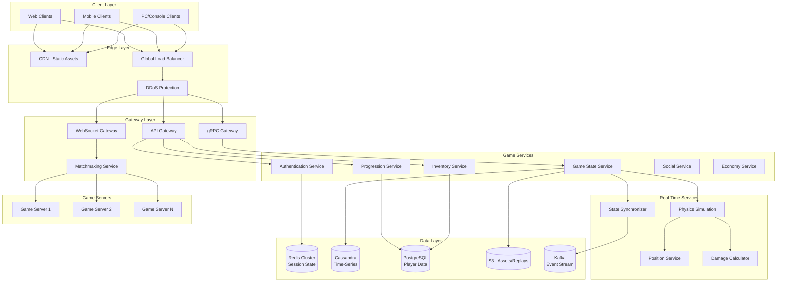
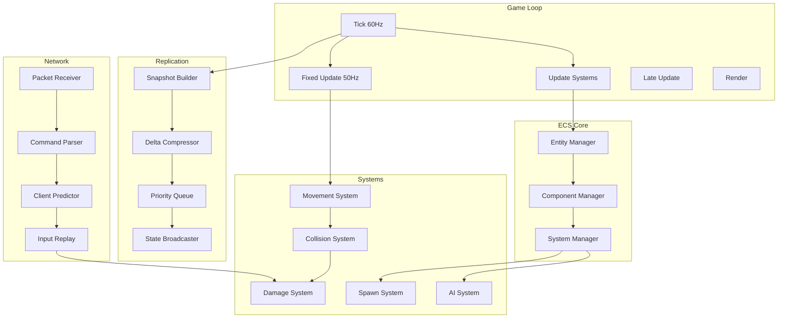
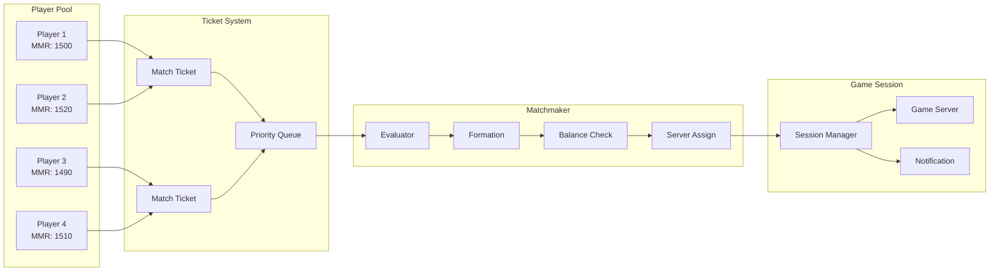

# AD-018: Gaming Backend Design

## Overview

Gaming backends represent one of the most technically challenging domains in software engineering, requiring ultra-low latency, massive concurrent user support, real-time state synchronization, and complex matchmaking algorithms. These systems must handle millions of concurrent players, process billions of events per day, and maintain sub-50ms response times while ensuring fair gameplay and preventing cheating.

## 1. Domain-Specific Requirements Analysis

### 1.1 Core Functional Requirements

#### Real-Time Multiplayer
- **State Synchronization**: Sub-50ms latency for player state updates
- **Authority Management**: Server-authoritative gameplay with client prediction
- **Interest Management**: Efficient filtering of relevant game state per player
- **Lag Compensation**: Rewinding and replaying hit detection for fairness
- **Snapshot Interpolation**: Smooth state interpolation between server ticks

#### Matchmaking System
- **Skill-Based Matching**: ELO/Glicko-2 rating systems for balanced matches
- **Latency-Based Matching**: Geographic proximity optimization
- **Party Support**: Group matchmaking with flexible constraints
- **Queue Management**: Priority queues, role-based queues, flexible MMR ranges
- **Match Quality Optimization**: Minimizing skill disparity and wait times

#### Game State Management
- **Entity-Component-System (ECS)**: High-performance game object management
- **Spatial Partitioning**: Efficient collision detection and queries
- **Event Sourcing**: Complete game history for replay and validation
- **Checkpointing**: Periodic state snapshots for recovery
- **Replication**: Selective state replication based on relevance

#### Player Progression
- **Experience Systems**: XP calculation, leveling, rewards distribution
- **Inventory Management**: Item storage, trading, crafting systems
- **Achievement Tracking**: Progress tracking, unlock conditions
- **Leaderboards**: Global, regional, and friend-based rankings
- **Battle Pass**: Seasonal progression with tiered rewards

### 1.2 Non-Functional Requirements

#### Performance Requirements
| Metric | Target | Criticality |
|--------|--------|-------------|
| Input Latency | < 20ms | Critical |
| State Broadcast | < 50ms (p99) | Critical |
| Matchmaking | < 30 seconds | High |
| Login/Auth | < 500ms | High |
| Concurrent Players | > 100,000/region | Critical |
| System Availability | 99.99% | Critical |

#### Scalability Requirements
- Horizontal scaling across multiple game server instances
- Dynamic server allocation based on demand
- Regional deployment for latency optimization
- Cross-region player migration support

#### Security Requirements
- **Anti-Cheat**: Client integrity verification, behavioral analysis
- **DDoS Protection**: Rate limiting, traffic filtering
- **Secure Communication**: TLS 1.3, certificate pinning
- **Economy Protection**: Fraud detection, duping prevention

## 2. Architecture Formalization

### 2.1 System Architecture Overview



### 2.2 Game Server Architecture



### 2.3 Matchmaking Architecture



## 3. Scalability and Performance Considerations

### 3.1 Spatial Partitioning for Large Worlds

```go
package spatial

import (
    "sync"
)

// SpatialHash provides efficient spatial queries
type SpatialHash struct {
    cellSize float64
    cells    map[CellCoord]map[EntityID]*Entity
    mu       sync.RWMutex
}

type CellCoord struct {
    X, Y, Z int
}

type EntityID uint64

type Entity struct {
    ID       EntityID
    Position Vector3
    Radius   float64
    Data     interface{}
}

type Vector3 struct {
    X, Y, Z float64
}

// NewSpatialHash creates a new spatial hash grid
func NewSpatialHash(cellSize float64) *SpatialHash {
    return &SpatialHash{
        cellSize: cellSize,
        cells:    make(map[CellCoord]map[EntityID]*Entity),
    }
}

// Insert adds an entity to the spatial hash
func (sh *SpatialHash) Insert(entity *Entity) {
    sh.mu.Lock()
    defer sh.mu.Unlock()
    
    cells := sh.getOverlappingCells(entity)
    for _, cell := range cells {
        if sh.cells[cell] == nil {
            sh.cells[cell] = make(map[EntityID]*Entity)
        }
        sh.cells[cell][entity.ID] = entity
    }
}

// QueryCircle returns all entities within radius of position
func (sh *SpatialHash) QueryCircle(center Vector3, radius float64) []*Entity {
    sh.mu.RLock()
    defer sh.mu.RUnlock()
    
    result := make([]*Entity, 0)
    seen := make(map[EntityID]bool)
    
    // Calculate affected cells
    minCell := sh.worldToCell(Vector3{
        X: center.X - radius,
        Y: center.Y - radius,
        Z: center.Z - radius,
    })
    maxCell := sh.worldToCell(Vector3{
        X: center.X + radius,
        Y: center.Y + radius,
        Z: center.Z + radius,
    })
    
    radiusSq := radius * radius
    
    for x := minCell.X; x <= maxCell.X; x++ {
        for y := minCell.Y; y <= maxCell.Y; y++ {
            for z := minCell.Z; z <= maxCell.Z; z++ {
                cell := CellCoord{X: x, Y: y, Z: z}
                for _, entity := range sh.cells[cell] {
                    if seen[entity.ID] {
                        continue
                    }
                    seen[entity.ID] = true
                    
                    if distanceSquared(center, entity.Position) <= radiusSq {
                        result = append(result, entity)
                    }
                }
            }
        }
    }
    
    return result
}

func (sh *SpatialHash) worldToCell(pos Vector3) CellCoord {
    return CellCoord{
        X: int(pos.X / sh.cellSize),
        Y: int(pos.Y / sh.cellSize),
        Z: int(pos.Z / sh.cellSize),
    }
}

func (sh *SpatialHash) getOverlappingCells(entity *Entity) []CellCoord {
    min := sh.worldToCell(Vector3{
        X: entity.Position.X - entity.Radius,
        Y: entity.Position.Y - entity.Radius,
        Z: entity.Position.Z - entity.Radius,
    })
    max := sh.worldToCell(Vector3{
        X: entity.Position.X + entity.Radius,
        Y: entity.Position.Y + entity.Radius,
        Z: entity.Position.Z + entity.Radius,
    })
    
    cells := make([]CellCoord, 0)
    for x := min.X; x <= max.X; x++ {
        for y := min.Y; y <= max.Y; y++ {
            for z := min.Z; z <= max.Z; z++ {
                cells = append(cells, CellCoord{X: x, Y: y, Z: z})
            }
        }
    }
    return cells
}

func distanceSquared(a, b Vector3) float64 {
    dx := a.X - b.X
    dy := a.Y - b.Y
    dz := a.Z - b.Z
    return dx*dx + dy*dy + dz*dz
}
```

### 3.2 Event Sourcing for Game State

```go
package eventsource

import (
    "context"
    "encoding/json"
    "time"
    
    "github.com/google/uuid"
)

// Event represents a game event
type Event struct {
    ID        string          `json:"id"`
    Type      string          `json:"type"`
    Timestamp time.Time       `json:"timestamp"`
    Tick      uint64          `json:"tick"`
    PlayerID  string          `json:"player_id"`
    Data      json.RawMessage `json:"data"`
}

// EventStore handles event persistence
type EventStore struct {
    cassandra *gocql.Session
    kafka     KafkaProducer
}

// Append adds an event to the store
func (es *EventStore) Append(ctx context.Context, event *Event) error {
    if event.ID == "" {
        event.ID = uuid.New().String()
    }
    if event.Timestamp.IsZero() {
        event.Timestamp = time.Now().UTC()
    }
    
    // Write to Cassandra
    query := `
        INSERT INTO game_events (game_id, tick, event_id, type, timestamp, player_id, data)
        VALUES (?, ?, ?, ?, ?, ?, ?)
    `
    
    if err := es.cassandra.Query(query,
        event.GameID, event.Tick, event.ID, event.Type,
        event.Timestamp, event.PlayerID, event.Data,
    ).WithContext(ctx).Exec(); err != nil {
        return err
    }
    
    // Publish to Kafka for real-time consumers
    data, _ := json.Marshal(event)
    if err := es.kafka.Produce(ctx, "game-events", event.ID, data); err != nil {
        // Log but don't fail - Cassandra is source of truth
        log.Printf("failed to publish event: %v", err)
    }
    
    return nil
}

// GetEvents retrieves events for a time range
func (es *EventStore) GetEvents(ctx context.Context, gameID string, fromTick, toTick uint64) ([]*Event, error) {
    query := `
        SELECT event_id, tick, type, timestamp, player_id, data
        FROM game_events
        WHERE game_id = ? AND tick >= ? AND tick <= ?
        ORDER BY tick ASC
    `
    
    iter := es.cassandra.Query(query, gameID, fromTick, toTick).WithContext(ctx).Iter()
    
    var events []*Event
    var event Event
    
    for iter.Scan(&event.ID, &event.Tick, &event.Type, &event.Timestamp, &event.PlayerID, &event.Data) {
        event.GameID = gameID
        events = append(events, &event)
        event = Event{} // Reset for next iteration
    }
    
    if err := iter.Close(); err != nil {
        return nil, err
    }
    
    return events, nil
}

// Replay reconstructs game state from events
func (es *EventStore) Replay(ctx context.Context, gameID string, targetTick uint64) (*GameState, error) {
    events, err := es.GetEvents(ctx, gameID, 0, targetTick)
    if err != nil {
        return nil, err
    }
    
    state := NewGameState()
    
    for _, event := range events {
        if err := state.Apply(event); err != nil {
            return nil, fmt.Errorf("apply event %s: %w", event.ID, err)
        }
    }
    
    return state, nil
}
```

### 3.3 Interest Management System

```go
package interest

import (
    "math"
    "sync"
)

// InterestManager filters entities based on player relevance
type InterestManager struct {
    players     map[PlayerID]*PlayerInterest
    entities    map[EntityID]*Entity
    mu          sync.RWMutex
    cellSize    float64
    relevanceFn RelevanceFunction
}

type PlayerID uint64
type EntityID uint64

type PlayerInterest struct {
    ID          PlayerID
    Position    Vector3
    ViewRadius  float64
    ViewAngle   float64
    Orientation Vector3
    VisibleSet  map[EntityID]bool
}

type Entity struct {
    ID       EntityID
    Position Vector3
    Type     string
    Priority int
}

type RelevanceFunction func(player *PlayerInterest, entity *Entity) float64

// NewInterestManager creates an interest manager
func NewInterestManager(cellSize float64) *InterestManager {
    return &InterestManager{
        players:  make(map[PlayerID]*PlayerInterest),
        entities: make(map[EntityID]*Entity),
        cellSize: cellSize,
        relevanceFn: DefaultRelevance,
    }
}

// UpdatePlayer updates a player's position and calculates visible entities
func (im *InterestManager) UpdatePlayer(playerID PlayerID, pos Vector3, orientation Vector3) []EntityID {
    im.mu.Lock()
    defer im.mu.Unlock()
    
    player, exists := im.players[playerID]
    if !exists {
        player = &PlayerInterest{
            ID:         playerID,
            ViewRadius: 100.0,
            ViewAngle:  math.Pi / 2,
            VisibleSet: make(map[EntityID]bool),
        }
        im.players[playerID] = player
    }
    
    player.Position = pos
    player.Orientation = orientation
    
    // Calculate new visible set
    newVisible := make(map[EntityID]bool)
    relevanceList := make([]struct {
        id        EntityID
        relevance float64
    }, 0)
    
    for _, entity := range im.entities {
        relevance := im.relevanceFn(player, entity)
        if relevance > 0 {
            relevanceList = append(relevanceList, struct {
                id        EntityID
                relevance float64
            }{entity.ID, relevance})
            newVisible[entity.ID] = true
        }
    }
    
    // Sort by relevance (descending)
    sort.Slice(relevanceList, func(i, j int) bool {
        return relevanceList[i].relevance > relevanceList[j].relevance
    })
    
    // Limit to top N most relevant
    maxVisible := 100
    if len(relevanceList) > maxVisible {
        relevanceList = relevanceList[:maxVisible]
        newVisible = make(map[EntityID]bool)
        for _, item := range relevanceList {
            newVisible[item.id] = true
        }
    }
    
    // Calculate deltas
    entered := make([]EntityID, 0)
    exited := make([]EntityID, 0)
    
    for id := range newVisible {
        if !player.VisibleSet[id] {
            entered = append(entered, id)
        }
    }
    
    for id := range player.VisibleSet {
        if !newVisible[id] {
            exited = append(exited, id)
        }
    }
    
    player.VisibleSet = newVisible
    
    // Return entities that need updates
    updates := make([]EntityID, 0, len(newVisible))
    for id := range newVisible {
        updates = append(updates, id)
    }
    
    return updates
}

// DefaultRelevance calculates default relevance score
func DefaultRelevance(player *PlayerInterest, entity *Entity) float64 {
    distance := distance(player.Position, entity.Position)
    if distance > player.ViewRadius {
        return 0
    }
    
    // Distance factor (closer = more relevant)
    distanceFactor := 1.0 - (distance / player.ViewRadius)
    
    // View angle factor
    toEntity := normalize(subtract(entity.Position, player.Position))
    angle := math.Acos(dot(player.Orientation, toEntity))
    angleFactor := 1.0
    if angle > player.ViewAngle/2 {
        angleFactor = 0.5 // Still visible but less relevant
    }
    
    // Priority factor
    priorityFactor := float64(entity.Priority) / 10.0
    
    return distanceFactor * angleFactor * priorityFactor
}

func distance(a, b Vector3) float64 {
    dx := a.X - b.X
    dy := a.Y - b.Y
    dz := a.Z - b.Z
    return math.Sqrt(dx*dx + dy*dy + dz*dz)
}

func normalize(v Vector3) Vector3 {
    d := math.Sqrt(v.X*v.X + v.Y*v.Y + v.Z*v.Z)
    if d == 0 {
        return Vector3{}
    }
    return Vector3{X: v.X / d, Y: v.Y / d, Z: v.Z / d}
}

func subtract(a, b Vector3) Vector3 {
    return Vector3{X: a.X - b.X, Y: a.Y - b.Y, Z: a.Z - b.Z}
}

func dot(a, b Vector3) float64 {
    return a.X*b.X + a.Y*b.Y + a.Z*b.Z
}
```

## 4. Technology Stack Recommendations

### 4.1 Core Technologies

| Layer | Technology | Purpose |
|-------|-----------|---------|
| Language | Go 1.21+ | High-performance game services |
| Game Engine | Unity/Unreal | Client-side game engine |
| Networking | gRPC-WebSocket | Bi-directional communication |
| Database | ScyllaDB/Cassandra | Time-series game data |
| Cache | Redis Cluster | Session and hot data |
| Message Queue | Apache Kafka | Event streaming |
| Search | Elasticsearch | Player search, leaderboards |
| Monitoring | Prometheus/Grafana | Metrics and alerting |

### 4.2 Go Libraries

```go
// Core dependencies
go get github.com/panjf2000/gnet       // High-performance networking
go get github.com/cloudwego/kitex      // RPC framework
go get github.com/gocql/gocql          // Cassandra driver
go get github.com/redis/go-redis/v9    // Redis client
go get github.com/pion/webrtc/v3       // WebRTC for voice chat
go get github.com/xtaci/kcp-go         // Reliable UDP
go get github.com/emirpasic/gods       // Data structures
go get github.com/bits-and-blooms/bloom/v3 // Bloom filters
```

### 4.3 Infrastructure

| Component | Technology |
|-----------|-----------|
| Orchestration | Kubernetes with custom operators |
| Service Mesh | Istio with gaming optimizations |
| Edge Computing | Cloudflare/AWS Global Accelerator |
| Game Servers | Agones on Kubernetes |
| CDN | Cloudflare/Amazon CloudFront |

## 5. Industry Case Studies

### 5.1 Case Study: Fortnite Backend (Epic Games)

**Challenge**: Support 125 million players with 50v50 battles, cross-platform play, and real-time building mechanics.

**Architecture**:
- Microservices architecture with 100+ services
- Custom networking protocol on top of UDP
- SpatialOS for persistent world simulation
- AWS for global infrastructure
- Custom matchmaking with skill and latency optimization

**Results**:
- 10.7 million concurrent players (record)
- 1.3 million peak concurrent viewers
- 50ms average latency globally
- 99.99% uptime during events

**Key Innovations**:
1. Custom netcode with client-side prediction
2. Dynamic cloud scaling based on events
3. Regional server deployment
4. Anti-cheat with kernel-level detection

### 5.2 Case Study: League of Legends (Riot Games)

**Challenge**: Handle 8 million concurrent players with competitive integrity requirements.

**Architecture**:
- Java-based game servers (migrating to Go)
- MySQL for player data
- Redis for session management
- Kafka for event streaming
- Custom matchmaking algorithm

**Results**:
- 100 million monthly players
- 27 million daily players
- 8 million peak concurrent
- < 30ms server tick time

**Key Innovations**:
1. Deterministic simulation with lockstep
2. Advanced matchmaking with behavioral analysis
3. Comprehensive replay system
4. Regional server federation

### 5.3 Case Study: Pokemon GO (Niantic)

**Challenge**: Real-world location-based gaming with 1 billion downloads.

**Architecture**:
- Google Cloud Platform
- Cloud Spanner for global consistency
- Bigtable for time-series data
- Kubernetes for orchestration
- Custom mapping integration

**Results**:
- 147 million monthly active users
- 5 billion friend connections
- 2 billion battles
- 99.95% uptime

## 6. Go Implementation Examples

### 6.1 High-Performance Game Server

```go
package gameserver

import (
    "context"
    "sync"
    "sync/atomic"
    "time"
)

// GameServer manages a single game instance
type GameServer struct {
    id          string
    tickRate    int
    gameState   *GameState
    players     map[PlayerID]*Player
    systems     []System
    eventQueue  chan *GameEvent
    snapshotBuf []*Snapshot
    
    // Synchronization
    tick        uint64
    running     int32
    wg          sync.WaitGroup
    mu          sync.RWMutex
    
    // Networking
    broadcaster *StateBroadcaster
    receiver    *CommandReceiver
    
    // Metrics
    metrics     *ServerMetrics
}

// GameState represents the complete game state
type GameState struct {
    Entities    *EntityManager
    Physics     *PhysicsWorld
    Rules       *GameRules
    StartTime   time.Time
    Duration    time.Duration
}

type Player struct {
    ID          PlayerID
    Connection  Connection
    Latency     time.Duration
    LastInput   time.Time
    InputBuffer []*PlayerInput
}

// Start begins the game loop
func (gs *GameServer) Start(ctx context.Context) error {
    if !atomic.CompareAndSwapInt32(&gs.running, 0, 1) {
        return fmt.Errorf("server already running")
    }
    
    gs.wg.Add(3)
    
    // Game loop
    go gs.gameLoop()
    
    // Network receiver
    go gs.networkLoop()
    
    // Snapshot broadcaster
    go gs.broadcastLoop()
    
    // Wait for shutdown
    <-ctx.Done()
    
    atomic.StoreInt32(&gs.running, 0)
    gs.wg.Wait()
    
    return nil
}

func (gs *GameServer) gameLoop() {
    defer gs.wg.Done()
    
    ticker := time.NewTicker(time.Second / time.Duration(gs.tickRate))
    defer ticker.Stop()
    
    for atomic.LoadInt32(&gs.running) == 1 {
        select {
        case <-ticker.C:
            gs.tick++
            gs.update()
        }
    }
}

func (gs *GameServer) update() {
    start := time.Now()
    
    // Process inputs
    gs.processInputs()
    
    // Update all systems
    for _, system := range gs.systems {
        system.Update(gs.gameState, gs.tick)
    }
    
    // Build snapshot
    snapshot := gs.buildSnapshot()
    
    // Queue for broadcasting
    select {
    case gs.broadcaster.Queue <- snapshot:
    default:
        gs.metrics.DroppedSnapshots.Inc()
    }
    
    // Record metrics
    elapsed := time.Since(start)
    gs.metrics.TickDuration.Observe(elapsed.Seconds())
}

func (gs *GameServer) processInputs() {
    gs.mu.RLock()
    defer gs.mu.RUnlock()
    
    for _, player := range gs.players {
        // Process buffered inputs up to current tick
        for len(player.InputBuffer) > 0 {
            input := player.InputBuffer[0]
            if input.Tick > gs.tick {
                break // Future input
            }
            
            gs.applyInput(player.ID, input)
            player.InputBuffer = player.InputBuffer[1:]
        }
    }
}

func (gs *GameServer) applyInput(playerID PlayerID, input *PlayerInput) {
    entity := gs.gameState.Entities.GetPlayerEntity(playerID)
    if entity == nil {
        return
    }
    
    switch input.Type {
    case InputTypeMove:
        gs.gameState.Physics.ApplyMovement(entity, input.Data)
    case InputTypeAction:
        gs.handleAction(playerID, input.Data)
    case InputTypeUseAbility:
        gs.handleAbilityUse(playerID, input.Data)
    }
}

func (gs *GameServer) buildSnapshot() *Snapshot {
    gs.mu.RLock()
    defer gs.mu.RUnlock()
    
    snapshot := &Snapshot{
        Tick:      gs.tick,
        Timestamp: time.Now(),
        Entities:  make([]EntityState, 0, gs.gameState.Entities.Count()),
    }
    
    for _, entity := range gs.gameState.Entities.All() {
        state := EntityState{
            ID:       entity.ID,
            Type:     entity.Type,
            Position: entity.Position,
            Rotation: entity.Rotation,
            Health:   entity.Health,
            // ... other state
        }
        snapshot.Entities = append(snapshot.Entities, state)
    }
    
    return snapshot
}
```

### 6.2 Matchmaking Service

```go
package matchmaking

import (
    "context"
    "math"
    "sort"
    "sync"
    "time"
)

// Matchmaker handles player matchmaking
type Matchmaker struct {
    pools       map[GameMode]*PlayerPool
    tickets     chan *MatchTicket
    matches     chan *Match
    
    config      *Config
    evaluator   *MatchEvaluator
    
    mu          sync.RWMutex
    running     bool
}

type PlayerPool struct {
    Players     []*QueuedPlayer
    LastUpdated time.Time
    mu          sync.RWMutex
}

type QueuedPlayer struct {
    PlayerID    string
    MMR         float64
    PartySize   int
    QueueTime   time.Time
    Preferences MatchPreferences
    Latency     map[string]time.Duration // Region -> latency
}

type MatchTicket struct {
    ID          string
    Players     []*QueuedPlayer
    GameMode    GameMode
    CreatedAt   time.Time
}

type Match struct {
    ID          string
    Teams       [][]*QueuedPlayer
    GameMode    GameMode
    ServerRegion string
    Quality     float64
}

// Start begins the matchmaking process
func (m *Matchmaker) Start(ctx context.Context) {
    m.running = true
    
    ticker := time.NewTicker(time.Second)
    defer ticker.Stop()
    
    for m.running {
        select {
        case <-ctx.Done():
            return
        case ticket := <-m.tickets:
            m.addToPool(ticket)
        case <-ticker.C:
            m.processPools()
        }
    }
}

func (m *Matchmaker) processPools() {
    for mode, pool := range m.pools {
        if pool.Size() < mode.MinPlayers {
            continue
        }
        
        matches := m.findMatches(mode, pool)
        for _, match := range matches {
            m.matches <- match
            m.removePlayers(pool, match)
        }
    }
}

func (m *Matchmaker) findMatches(mode GameMode, pool *PlayerPool) []*Match {
    var matches []*Match
    
    pool.mu.RLock()
    players := make([]*QueuedPlayer, len(pool.Players))
    copy(players, pool.Players)
    pool.mu.RUnlock()
    
    // Sort by wait time (longest waiting first for priority)
    sort.Slice(players, func(i, j int) bool {
        return players[i].QueueTime.Before(players[j].QueueTime)
    })
    
    used := make(map[string]bool)
    
    for _, player := range players {
        if used[player.PlayerID] {
            continue
        }
        
        // Find compatible players
        candidates := m.findCandidates(player, players, used, mode)
        
        if len(candidates) >= mode.MinPlayers-1 {
            // Form a match
            matchPlayers := append([]*QueuedPlayer{player}, candidates[:mode.MinPlayers-1]...)
            
            // Balance teams if applicable
            teams := m.balanceTeams(matchPlayers, mode)
            
            // Calculate quality
            quality := m.evaluator.CalculateQuality(teams, mode)
            
            // Select optimal server region
            region := m.selectServerRegion(matchPlayers)
            
            match := &Match{
                ID:           generateID(),
                Teams:        teams,
                GameMode:     mode,
                ServerRegion: region,
                Quality:      quality,
            }
            
            matches = append(matches, match)
            
            // Mark players as used
            used[player.PlayerID] = true
            for _, p := range candidates[:mode.MinPlayers-1] {
                used[p.PlayerID] = true
            }
        }
    }
    
    return matches
}

func (m *Matchmaker) findCandidates(player *QueuedPlayer, players []*QueuedPlayer, used map[string]bool, mode GameMode) []*QueuedPlayer {
    var candidates []*QueuedPlayer
    
    waitTime := time.Since(player.QueueTime)
    mmrRange := m.calculateMMRRange(waitTime, mode)
    
    for _, candidate := range players {
        if used[candidate.PlayerID] || candidate.PlayerID == player.PlayerID {
            continue
        }
        
        // Check MMR compatibility
        mmrDiff := math.Abs(candidate.MMR - player.MMR)
        if mmrDiff > mmrRange {
            continue
        }
        
        // Check party compatibility
        if candidate.PartySize != player.PartySize {
            continue
        }
        
        // Check latency compatibility
        if !m.isLatencyCompatible(player, candidate) {
            continue
        }
        
        candidates = append(candidates, candidate)
    }
    
    // Sort by MMR similarity
    sort.Slice(candidates, func(i, j int) bool {
        diffI := math.Abs(candidates[i].MMR - player.MMR)
        diffJ := math.Abs(candidates[j].MMR - player.MMR)
        return diffI < diffJ
    })
    
    return candidates
}

func (m *Matchmaker) balanceTeams(players []*QueuedPlayer, mode GameMode) [][]*QueuedPlayer {
    if mode.TeamSize <= 1 {
        return [][]*QueuedPlayer{players}
    }
    
    numTeams := len(players) / mode.TeamSize
    teams := make([][]*QueuedPlayer, numTeams)
    
    // Sort by MMR
    sort.Slice(players, func(i, j int) bool {
        return players[i].MMR > players[j].MMR
    })
    
    // Snake draft for balance
    for i, player := range players {
        teamIdx := i / mode.TeamSize
        if teamIdx%2 == 1 {
            teamIdx = numTeams - 1 - teamIdx
        }
        teams[teamIdx] = append(teams[teamIdx], player)
    }
    
    return teams
}

func (m *Matchmaker) calculateMMRRange(waitTime time.Duration, mode GameMode) float64 {
    baseRange := 100.0
    expansionRate := 50.0 // MMR points per minute
    
    minutes := waitTime.Minutes()
    range_ := baseRange + (expansionRate * minutes)
    
    // Cap at maximum range
    if range_ > 1000 {
        range_ = 1000
    }
    
    return range_
}

func (m *Matchmaker) selectServerRegion(players []*QueuedPlayer) string {
    regions := make(map[string]time.Duration)
    
    for _, player := range players {
        for region, latency := range player.Latency {
            regions[region] += latency
        }
    }
    
    // Find region with lowest average latency
    var bestRegion string
    var bestLatency time.Duration = time.Hour
    
    for region, totalLatency := range regions {
        avgLatency := totalLatency / time.Duration(len(players))
        if avgLatency < bestLatency {
            bestLatency = avgLatency
            bestRegion = region
        }
    }
    
    return bestRegion
}
```

### 6.3 Anti-Cheat System

```go
package anticheat

import (
    "context"
    "math"
    "time"
)

// AntiCheatEngine detects and prevents cheating
type AntiCheatEngine struct {
    analyzers   []Analyzer
    reporters   []Reporter
    banManager  *BanManager
    
    threshold   float64
}

type Analyzer interface {
    Analyze(ctx context.Context, event *GameEvent) (*AnalysisResult, error)
    Name() string
}

type AnalysisResult struct {
    CheaterID   string
    Confidence  float64
    Violation   string
    Evidence    map[string]interface{}
    Timestamp   time.Time
}

// SpeedHackAnalyzer detects unnatural movement speeds
type SpeedHackAnalyzer struct {
    maxSpeed     float64
    history      map[string][]*PositionSample
    historySize  int
}

type PositionSample struct {
    Position  Vector3
    Timestamp time.Time
    Tick      uint64
}

func (a *SpeedHackAnalyzer) Analyze(ctx context.Context, event *GameEvent) (*AnalysisResult, error) {
    if event.Type != EventTypePositionUpdate {
        return nil, nil
    }
    
    playerID := event.PlayerID
    sample := &PositionSample{
        Position:  event.Position,
        Timestamp: event.Timestamp,
        Tick:      event.Tick,
    }
    
    // Add to history
    a.history[playerID] = append(a.history[playerID], sample)
    if len(a.history[playerID]) > a.historySize {
        a.history[playerID] = a.history[playerID][1:]
    }
    
    // Need at least 2 samples
    if len(a.history[playerID]) < 2 {
        return nil, nil
    }
    
    // Calculate speed
    samples := a.history[playerID]
    prev := samples[len(samples)-2]
    curr := samples[len(samples)-1]
    
    distance := distance(prev.Position, curr.Position)
    timeDiff := curr.Timestamp.Sub(prev.Timestamp).Seconds()
    
    if timeDiff == 0 {
        return nil, nil
    }
    
    speed := distance / timeDiff
    
    // Check against maximum allowed speed
    if speed > a.maxSpeed*1.5 { // Allow 50% tolerance
        confidence := math.Min(1.0, (speed-a.maxSpeed)/a.maxSpeed)
        
        return &AnalysisResult{
            CheaterID:  playerID,
            Confidence: confidence,
            Violation:  "SPEED_HACK",
            Evidence: map[string]interface{}{
                "detected_speed": speed,
                "max_speed":      a.maxSpeed,
                "position_delta": distance,
                "time_delta":     timeDiff,
            },
            Timestamp: time.Now(),
        }, nil
    }
    
    return nil, nil
}

// AimbotAnalyzer detects unnatural aiming patterns
type AimbotAnalyzer struct {
    maxSnapAngle    float64
    minConsistency  float64
    aimHistory      map[string][]*AimSample
}

type AimSample struct {
    Rotation    Vector3
    Target      Vector3
    HasTarget   bool
    Timestamp   time.Time
}

func (a *AimbotAnalyzer) Analyze(ctx context.Context, event *GameEvent) (*AnalysisResult, error) {
    if event.Type != EventTypeAim {
        return nil, nil
    }
    
    playerID := event.PlayerID
    sample := &AimSample{
        Rotation:  event.Rotation,
        Target:    event.Target,
        HasTarget: event.HasTarget,
        Timestamp: event.Timestamp,
    }
    
    a.aimHistory[playerID] = append(a.aimHistory[playerID], sample)
    
    // Keep last 100 aim samples
    if len(a.aimHistory[playerID]) > 100 {
        a.aimHistory[playerID] = a.aimHistory[playerID][1:]
    }
    
    // Analyze only if we have enough samples
    if len(a.aimHistory[playerID]) < 20 {
        return nil, nil
    }
    
    samples := a.aimHistory[playerID]
    
    // Calculate aim consistency when targeting
    var snapAngles []float64
    for i := 1; i < len(samples); i++ {
        if samples[i].HasTarget && samples[i-1].HasTarget {
            angle := angleBetween(samples[i-1].Rotation, samples[i].Rotation)
            snapAngles = append(snapAngles, angle)
        }
    }
    
    if len(snapAngles) < 10 {
        return nil, nil
    }
    
    // Calculate consistency (low variance suggests aimbot)
    mean, variance := calculateStats(snapAngles)
    stdDev := math.Sqrt(variance)
    
    // Detect instant snaps
    instantSnaps := 0
    for _, angle := range snapAngles {
        if angle > a.maxSnapAngle && angle < math.Pi {
            instantSnaps++
        }
    }
    
    snapRatio := float64(instantSnaps) / float64(len(snapAngles))
    
    if stdDev < 0.1 && snapRatio > 0.3 { // Low variance and many snaps
        confidence := (1.0 - stdDev*10) * snapRatio
        
        return &AnalysisResult{
            CheaterID:  playerID,
            Confidence: math.Min(1.0, confidence),
            Violation:  "AIMBOT",
            Evidence: map[string]interface{}{
                "std_deviation":  stdDev,
                "snap_ratio":     snapRatio,
                "mean_angle":     mean,
                "instant_snaps":  instantSnaps,
            },
            Timestamp: time.Now(),
        }, nil
    }
    
    return nil, nil
}

func angleBetween(a, b Vector3) float64 {
    dot := a.X*b.X + a.Y*b.Y + a.Z*b.Z
    magA := math.Sqrt(a.X*a.X + a.Y*a.Y + a.Z*a.Z)
    magB := math.Sqrt(b.X*b.X + b.Y*b.Y + b.Z*b.Z)
    
    if magA == 0 || magB == 0 {
        return 0
    }
    
    cos := dot / (magA * magB)
    if cos > 1 {
        cos = 1
    } else if cos < -1 {
        cos = -1
    }
    
    return math.Acos(cos)
}

func calculateStats(values []float64) (mean, variance float64) {
    if len(values) == 0 {
        return 0, 0
    }
    
    sum := 0.0
    for _, v := range values {
        sum += v
    }
    mean = sum / float64(len(values))
    
    sumSq := 0.0
    for _, v := range values {
        diff := v - mean
        sumSq += diff * diff
    }
    variance = sumSq / float64(len(values))
    
    return mean, variance
}
```

## 7. Security and Compliance

### 7.1 Client Integrity Verification

```go
package security

import (
    "crypto/sha256"
    "encoding/hex"
)

// IntegrityChecker verifies client integrity
type IntegrityChecker struct {
    expectedHashes map[string]string
}

// VerifyClient checks if the client has been modified
func (ic *IntegrityChecker) VerifyClient(clientData []byte) (bool, error) {
    // Calculate hash of client executable
    hash := sha256.Sum256(clientData)
    hashStr := hex.EncodeToString(hash[:])
    
    // Compare with expected hash
    expectedHash, exists := ic.expectedHashes["client.exe"]
    if !exists {
        return false, fmt.Errorf("no expected hash for client")
    }
    
    return hashStr == expectedHash, nil
}

// VerifyAssets checks game asset integrity
func (ic *IntegrityChecker) VerifyAssets(assetHashes map[string]string) (bool, []string) {
    var modified []string
    
    for file, expectedHash := range ic.expectedHashes {
        actualHash, exists := assetHashes[file]
        if !exists {
            modified = append(modified, file)
            continue
        }
        
        if actualHash != expectedHash {
            modified = append(modified, file)
        }
    }
    
    return len(modified) == 0, modified
}
```

### 7.2 Secure Communication

```go
package security

import (
    "crypto/rand"
    "crypto/rsa"
    "crypto/x509"
    "encoding/pem"
)

// SecureChannel provides encrypted communication
type SecureChannel struct {
    privateKey *rsa.PrivateKey
    sessions   map[string]*Session
}

type Session struct {
    SessionID   string
    SharedKey   []byte
    Established time.Time
    LastActivity time.Time
}

// EstablishSession creates a secure session with key exchange
func (sc *SecureChannel) EstablishSession(clientPublicKey *rsa.PublicKey) (*Session, error) {
    // Generate session key
    sessionKey := make([]byte, 32)
    if _, err := rand.Read(sessionKey); err != nil {
        return nil, err
    }
    
    // Encrypt session key with client's public key
    encryptedKey, err := rsa.EncryptPKCS1v15(rand.Reader, clientPublicKey, sessionKey)
    if err != nil {
        return nil, err
    }
    
    session := &Session{
        SessionID:    generateSessionID(),
        SharedKey:    sessionKey,
        Established:  time.Now(),
        LastActivity: time.Now(),
    }
    
    sc.sessions[session.SessionID] = session
    
    return session, nil
}

// Encrypt encrypts data using session key
func (sc *SecureChannel) Encrypt(sessionID string, plaintext []byte) ([]byte, error) {
    session, exists := sc.sessions[sessionID]
    if !exists {
        return nil, fmt.Errorf("session not found")
    }
    
    // Use AES-GCM with session key
    // Implementation...
    
    session.LastActivity = time.Now()
    return ciphertext, nil
}
```

## 8. Conclusion

Gaming backend design requires a unique combination of ultra-low latency networking, massive concurrency handling, and complex real-time state management. Key takeaways:

1. **Latency is everything**: Optimize every millisecond from client to server and back
2. **State synchronization**: Use server authority with client prediction for responsive gameplay
3. **Scalability**: Design for horizontal scaling with regional deployment
4. **Fairness**: Implement comprehensive anti-cheat from day one
5. **Matchmaking**: Balance skill, latency, and wait time for optimal player experience
6. **Observability**: Monitor everything - ticks, latency, packet loss, player behavior

The Go programming language is excellent for gaming backends due to its efficient concurrency model, low garbage collection pauses, and strong networking capabilities. By following the patterns outlined in this document, you can build gaming backends that support millions of players while maintaining competitive integrity.

---

*Document Version: 1.0*
*Last Updated: 2026-04-02*
*Classification: Technical Reference*
