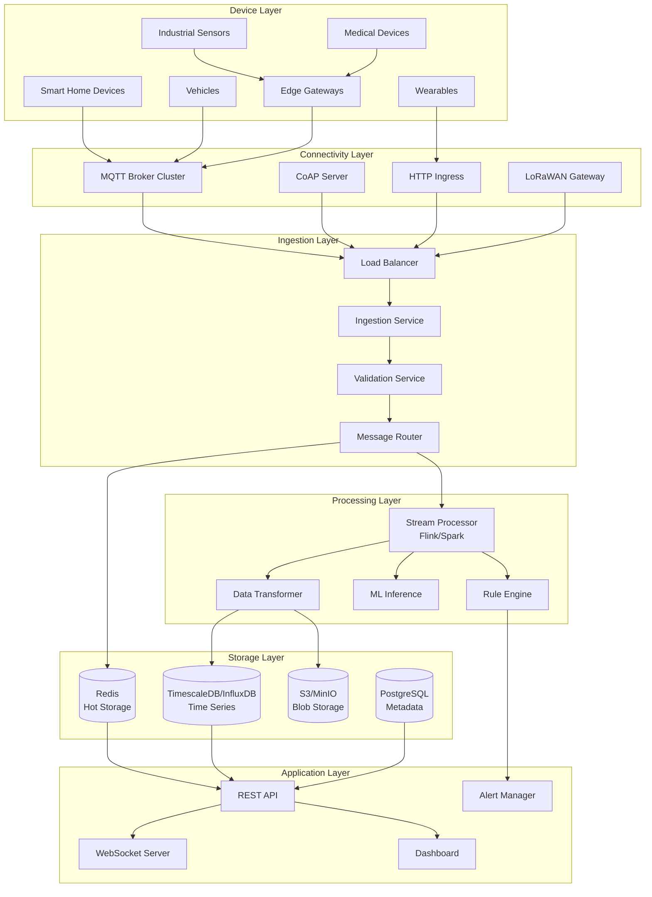
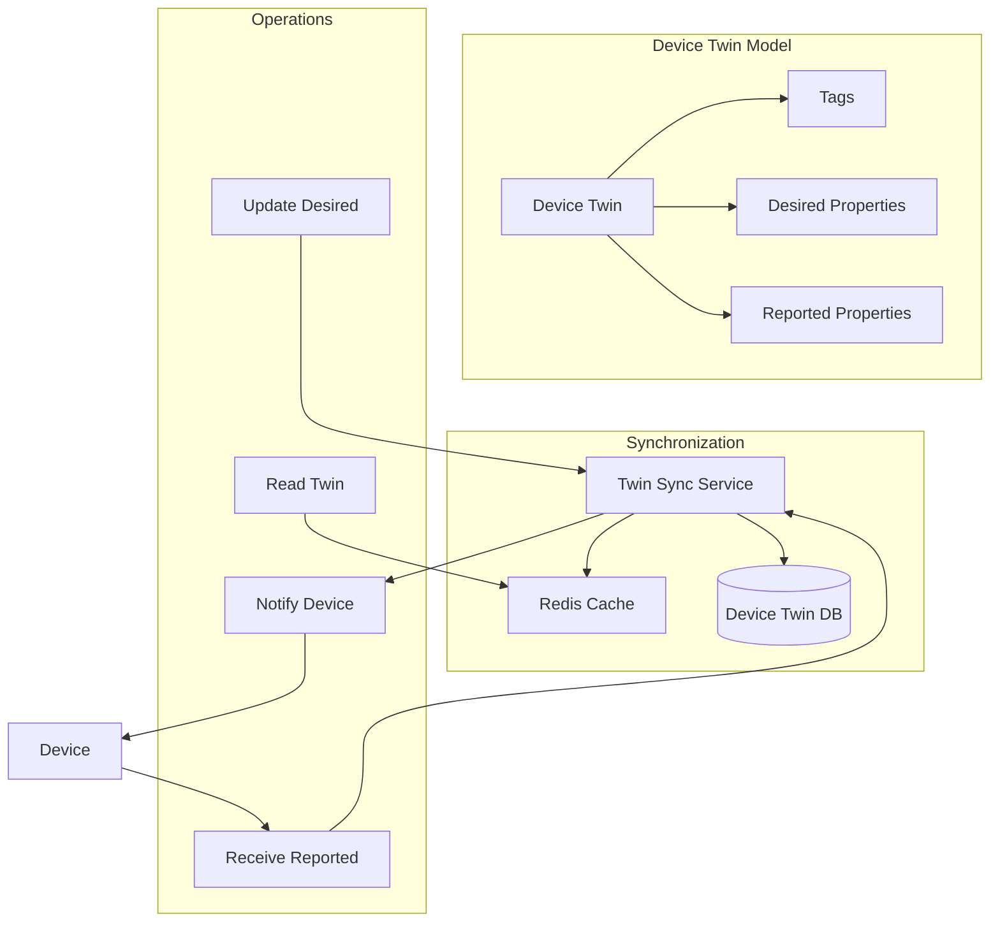
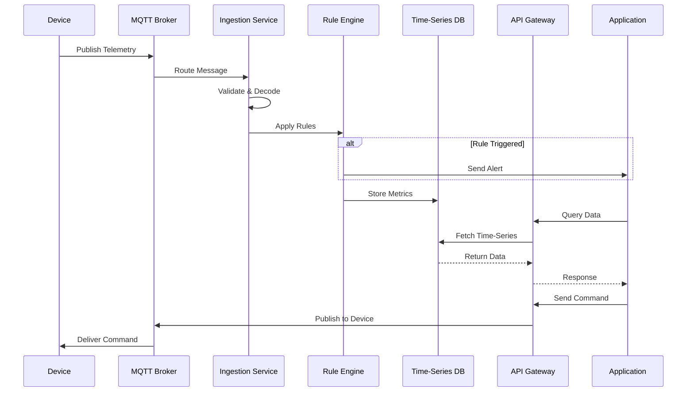

# AD-019: IoT Platform Design

## Overview

Internet of Things (IoT) platforms enable the connection, management, and data processing of billions of physical devices worldwide. These platforms must handle massive-scale device connectivity, process high-velocity telemetry streams, and support diverse device capabilities while maintaining security, reliability, and real-time responsiveness.

## 1. Domain-Specific Requirements Analysis

### 1.1 Core Functional Requirements

#### Device Connectivity

- **Protocol Support**: MQTT, CoAP, HTTP, WebSocket, LoRaWAN
- **Authentication**: X.509 certificates, SAS tokens, OAuth 2.0
- **Connection Management**: Keep-alive handling, graceful disconnection
- **Message Routing**: Rule-based routing to various endpoints
- **Device Twins**: Digital representation with desired and reported properties

#### Telemetry Processing

- **Ingestion**: Millions of messages per second from distributed devices
- **Time-Series Storage**: Efficient storage and querying of sensor data
- **Real-time Analytics**: Stream processing for immediate insights
- **Batch Processing**: Historical analysis and ML model training
- **Data Transformation**: Protocol translation and format normalization

#### Device Management

- **Provisioning**: Automated device registration and configuration
- **Lifecycle Management**: Deployment, updates, retirement workflows
- **Remote Configuration**: Over-the-air (OTA) firmware and settings updates
- **Monitoring**: Health checks, diagnostics, performance metrics
- **Grouping**: Hierarchical organization by location, type, or custom attributes

#### Command and Control

- **Direct Methods**: Synchronous command execution
- **Cloud-to-Device Messaging**: Asynchronous command delivery
- **Job Scheduling**: Bulk operations across device fleets
- **Response Handling**: Correlation of commands with device responses

### 1.2 Non-Functional Requirements

#### Scale Requirements

| Metric | Target | Criticality |
|--------|--------|-------------|
| Connected Devices | > 10 million/region | Critical |
| Message Ingestion | > 1 million/second | Critical |
| End-to-End Latency | < 100ms (p99) | High |
| Device Registration | > 1000/second | High |
| System Availability | 99.99% | Critical |
| Data Retention | 1+ years | Medium |

#### Device Constraints

- **Limited Compute**: Support for microcontrollers with KB of RAM
- **Power Constraints**: Battery-efficient protocols and sleep modes
- **Intermittent Connectivity**: Handle unreliable network conditions
- **Legacy Support**: Integration with existing industrial protocols

## 2. Architecture Formalization

### 2.1 System Architecture Overview



### 2.2 Device Twin Architecture



### 2.3 Message Flow Architecture



## 3. Scalability and Performance Considerations

### 3.1 Horizontal Partitioning

```go
package partition

import (
    "hash/fnv"
    "sync"
)

// DevicePartitioner manages device routing across shards
type DevicePartitioner struct {
    shards []*Shard
    mu     sync.RWMutex
}

type Shard struct {
    ID       int
    Endpoint string
    Weight   int
}

// NewDevicePartitioner creates a partitioner with consistent hashing
func NewDevicePartitioner(shards []*Shard) *DevicePartitioner {
    return &DevicePartitioner{
        shards: shards,
    }
}

// GetShard returns the shard for a device
func (p *DevicePartitioner) GetShard(deviceID string) *Shard {
    hash := fnv.New32a()
    hash.Write([]byte(deviceID))

    p.mu.RLock()
    defer p.mu.RUnlock()

    totalWeight := 0
    for _, shard := range p.shards {
        totalWeight += shard.Weight
    }

    hashValue := hash.Sum32()
    target := int(hashValue) % totalWeight

    current := 0
    for _, shard := range p.shards {
        current += shard.Weight
        if target < current {
            return shard
        }
    }

    return p.shards[0]
}

// Rebalance redistributes devices when adding/removing shards
func (p *DevicePartitioner) Rebalance(devices []string) map[string]*Shard {
    p.mu.Lock()
    defer p.mu.Unlock()

    mapping := make(map[string]*Shard)
    for _, deviceID := range devices {
        shard := p.GetShard(deviceID)
        mapping[deviceID] = shard
    }

    return mapping
}
```

### 3.2 High-Throughput Ingestion

```go
package ingestion

import (
    "context"
    "sync"
    "sync/atomic"
    "time"

    "github.com/IBM/sarama"
)

// IngestionService handles high-volume message ingestion
type IngestionService struct {
    producers    []sarama.AsyncProducer
    currentProd  uint64
    validator    *MessageValidator
    transformer  *MessageTransformer
    metrics      *Metrics

    batchSize    int
    flushTimeout time.Duration
    bufferPool   sync.Pool
}

// Message represents an incoming device message
type Message struct {
    DeviceID    string
    Timestamp   time.Time
    Payload     []byte
    ContentType string
    Metadata    map[string]string
}

// Process ingests a batch of messages
func (s *IngestionService) Process(ctx context.Context, messages []*Message) error {
    start := time.Now()

    // Validate messages in parallel
    validMessages := s.validateBatch(messages)

    // Transform to internal format
    transformed := s.transformBatch(validMessages)

    // Partition by device for ordered delivery
    partitions := s.partitionByDevice(transformed)

    // Produce to Kafka
    for _, batch := range partitions {
        if err := s.produceBatch(ctx, batch); err != nil {
            s.metrics.ProducerErrors.Inc()
            return err
        }
    }

    s.metrics.IngestionLatency.Observe(time.Since(start).Seconds())
    s.metrics.MessagesIngested.Add(float64(len(messages)))

    return nil
}

func (s *IngestionService) validateBatch(messages []*Message) []*Message {
    var wg sync.WaitGroup
    results := make(chan *Message, len(messages))

    // Process in parallel
    semaphore := make(chan struct{}, 100)

    for _, msg := range messages {
        wg.Add(1)
        semaphore <- struct{}{}

        go func(m *Message) {
            defer wg.Done()
            defer func() { <-semaphore }()

            if s.validator.Validate(m) {
                results <- m
            } else {
                s.metrics.ValidationFailures.Inc()
            }
        }(msg)
    }

    go func() {
        wg.Wait()
        close(results)
    }()

    var valid []*Message
    for msg := range results {
        valid = append(valid, msg)
    }

    return valid
}

func (s *IngestionService) transformBatch(messages []*Message) []*InternalMessage {
    transformed := make([]*InternalMessage, 0, len(messages))

    for _, msg := range messages {
        internal, err := s.transformer.Transform(msg)
        if err != nil {
            s.metrics.TransformErrors.Inc()
            continue
        }
        transformed = append(transformed, internal)
    }

    return transformed
}

func (s *IngestionService) partitionByDevice(messages []*InternalMessage) [][]*InternalMessage {
    partitions := make(map[string][]*InternalMessage)

    for _, msg := range messages {
        partitionKey := msg.DeviceID
        partitions[partitionKey] = append(partitions[partitionKey], msg)
    }

    result := make([][]*InternalMessage, 0, len(partitions))
    for _, batch := range partitions {
        result = append(result, batch)
    }

    return result
}

func (s *IngestionService) produceBatch(ctx context.Context, messages []*InternalMessage) error {
    // Round-robin producer selection
    idx := atomic.AddUint64(&s.currentProd, 1) % uint64(len(s.producers))
    producer := s.producers[idx]

    for _, msg := range messages {
        producer.Input() <- &sarama.ProducerMessage{
            Topic:     s.getTopic(msg),
            Key:       sarama.StringEncoder(msg.DeviceID),
            Value:     sarama.ByteEncoder(msg.Payload),
            Timestamp: msg.Timestamp,
            Headers:   s.toKafkaHeaders(msg.Metadata),
        }
    }

    return nil
}
```

### 3.3 Time-Series Optimization

```go
package storage

import (
    "context"
    "fmt"
    "time"
)

// TimeSeriesStore handles time-series data storage
type TimeSeriesStore struct {
    db     *pgxpool.Pool
    config *TSConfig
}

type TSConfig struct {
    PartitionInterval time.Duration
    RetentionPeriod   time.Duration
    ChunkSize         time.Duration
}

// WriteBatch writes metrics in batch
func (s *TimeSeriesStore) WriteBatch(ctx context.Context, metrics []*Metric) error {
    batch := &pgx.Batch{}

    for _, m := range metrics {
        batch.Queue(`
            INSERT INTO device_metrics (time, device_id, metric_name, value, tags)
            VALUES ($1, $2, $3, $4, $5)
            ON CONFLICT (time, device_id, metric_name) DO UPDATE SET
                value = EXCLUDED.value,
                tags = EXCLUDED.tags
        `, m.Timestamp, m.DeviceID, m.Name, m.Value, m.Tags)
    }

    br := s.db.SendBatch(ctx, batch)
    defer br.Close()

    for i := 0; i < len(metrics); i++ {
        if _, err := br.Exec(); err != nil {
            return fmt.Errorf("batch write error at index %d: %w", i, err)
        }
    }

    return br.Close()
}

// QueryRange retrieves metrics for a time range
func (s *TimeSeriesStore) QueryRange(ctx context.Context, deviceID string, metric string, start, end time.Time, interval time.Duration) ([]*DataPoint, error) {
    query := `
        SELECT time_bucket($1, time) AS bucket,
               avg(value) as avg_value,
               min(value) as min_value,
               max(value) as max_value,
               count(*) as sample_count
        FROM device_metrics
        WHERE device_id = $2
          AND metric_name = $3
          AND time BETWEEN $4 AND $5
        GROUP BY bucket
        ORDER BY bucket ASC
    `

    rows, err := s.db.Query(ctx, query, interval, deviceID, metric, start, end)
    if err != nil {
        return nil, err
    }
    defer rows.Close()

    var points []*DataPoint
    for rows.Next() {
        var p DataPoint
        if err := rows.Scan(&p.Timestamp, &p.Avg, &p.Min, &p.Max, &p.Count); err != nil {
            return nil, err
        }
        points = append(points, &p)
    }

    return points, rows.Err()
}

// Downsample aggregates old data to save storage
func (s *TimeSeriesStore) Downsample(ctx context.Context, metric string, olderThan time.Duration, targetInterval time.Duration) error {
    cutoff := time.Now().Add(-olderThan)

    query := `
        INSERT INTO device_metrics_downsampled (time, device_id, metric_name, avg_value, min_value, max_value, sample_count)
        SELECT time_bucket($1, time) AS bucket,
               device_id,
               metric_name,
               avg(value) as avg_value,
               min(value) as min_value,
               max(value) as max_value,
               count(*) as sample_count
        FROM device_metrics
        WHERE metric_name = $2
          AND time < $3
        GROUP BY bucket, device_id, metric_name
        ON CONFLICT DO NOTHING
    `

    _, err := s.db.Exec(ctx, query, targetInterval, metric, cutoff)
    if err != nil {
        return err
    }

    // Delete original data
    deleteQuery := `
        DELETE FROM device_metrics
        WHERE metric_name = $1
          AND time < $2
    `

    _, err = s.db.Exec(ctx, deleteQuery, metric, cutoff)
    return err
}
```

## 4. Technology Stack Recommendations

### 4.1 Core Technologies

| Layer | Technology | Purpose |
|-------|-----------|---------|
| Language | Go 1.21+ | High-performance services |
| MQTT Broker | EMQX/HiveMQ | Device messaging |
| Message Queue | Apache Kafka | Event streaming |
| Time-Series | TimescaleDB/InfluxDB | Metrics storage |
| Cache | Redis Cluster | Hot data, sessions |
| Database | PostgreSQL | Device metadata |
| Stream Processing | Apache Flink | Real-time analytics |
| Object Storage | MinIO/S3 | File/blob storage |

### 4.2 Go Libraries

```go
// Core dependencies
go get github.com/eclipse/paho.mqtt.golang
go get github.com/IBM/sarama
go get github.com/jackc/pgx/v5
go get github.com/redis/go-redis/v9
go get github.com/timescale/timescaledb
go get github.com/prometheus/client_golang
go get github.com/robfig/cron/v3
```

## 5. Industry Case Studies

### 5.1 Case Study: AWS IoT Core

**Architecture**:

- MQTT broker cluster with millions of concurrent connections
- Device Shadow for state management
- Rules Engine for message routing
- Integration with 200+ AWS services

**Scale**:

- Billions of messages per day
- Millions of connected devices
- Sub-100ms latency globally

**Key Features**:

1. Just-in-time device provisioning
2. Device Defender for security monitoring
3. Fleet indexing for search
4. ML-based anomaly detection

### 5.2 Case Study: Azure IoT Hub

**Architecture**:

- Cloud gateway with protocol translation
- Device Twin with JSON-based state
- Direct methods for command invocation
- Message routing to various endpoints

**Scale**:

- 1 million connected devices per hub
- Millions of messages per day
- 99.9% SLA

### 5.3 Case Study: Tesla Fleet

**Challenge**: Manage hundreds of thousands of connected vehicles worldwide.

**Architecture**:

- Custom MQTT-based communication
- Edge computing in vehicles
- Over-the-air updates
- Real-time telemetry processing

**Results**:

- 500K+ connected vehicles
- 4.5M+ data points per vehicle per day
- Sub-minute OTA deployment
- Predictive maintenance alerts

## 6. Go Implementation Examples

### 6.1 MQTT Message Handler

```go
package mqtt

import (
    "context"
    "encoding/json"
    "fmt"
    "time"

    mqtt "github.com/eclipse/paho.mqtt.golang"
)

// Handler processes MQTT messages from devices
type Handler struct {
    client     mqtt.Client
    ingestion  *ingestion.IngestionService
    deviceRepo *DeviceRepository
    metrics    *Metrics
}

// MessageHandler implements mqtt.MessageHandler
func (h *Handler) MessageHandler(client mqtt.Client, msg mqtt.Message) {
    start := time.Now()

    // Extract device ID from topic
    deviceID, err := extractDeviceID(msg.Topic())
    if err != nil {
        h.metrics.InvalidTopic.Inc()
        return
    }

    // Parse message
    var telemetry TelemetryMessage
    if err := json.Unmarshal(msg.Payload(), &telemetry); err != nil {
        h.metrics.ParseErrors.Inc()
        return
    }

    // Enrich with device metadata
    device, err := h.deviceRepo.Get(context.Background(), deviceID)
    if err != nil {
        h.metrics.DeviceLookupErrors.Inc()
        return
    }

    // Create internal message
    message := &ingestion.Message{
        DeviceID:    deviceID,
        Timestamp:   time.Now(),
        Payload:     msg.Payload(),
        ContentType: "application/json",
        Metadata: map[string]string{
            "device_type":   device.Type,
            "location":      device.Location,
            "firmware":      device.FirmwareVersion,
            "mqtt_topic":    msg.Topic(),
            "qos":           fmt.Sprintf("%d", msg.Qos()),
        },
    }

    // Process
    if err := h.ingestion.Process(context.Background(), []*ingestion.Message{message}); err != nil {
        h.metrics.IngestionErrors.Inc()
        return
    }

    h.metrics.ProcessingLatency.Observe(time.Since(start).Seconds())
    h.metrics.MessagesProcessed.Inc()

    // Acknowledge
    msg.Ack()
}

// Start begins message consumption
func (h *Handler) Start(ctx context.Context) error {
    topics := map[string]byte{
        "devices/+/telemetry": 1,
        "devices/+/events": 1,
        "devices/+/status": 0,
    }

    if token := h.client.SubscribeMultiple(topics, h.MessageHandler); token.Wait() && token.Error() != nil {
        return token.Error()
    }

    <-ctx.Done()

    h.client.Unsubscribe("devices/+/telemetry", "devices/+/events", "devices/+/status")
    return nil
}

type TelemetryMessage struct {
    Timestamp   int64                  `json:"ts"`
    Values      map[string]interface{} `json:"values"`
    Sequence    int64                  `json:"seq"`
}

func extractDeviceID(topic string) (string, error) {
    // Parse device ID from topic pattern: devices/{device_id}/telemetry
    // Implementation...
    return "", nil
}
```

### 6.2 Device Twin Service

```go
package twin

import (
    "context"
    "encoding/json"
    "fmt"
    "time"

    "github.com/redis/go-redis/v9"
)

// Service manages device twins
type Service struct {
    redis *redis.Client
    db    *sql.DB
    bus   EventBus
}

// DeviceTwin represents the digital twin of a device
type DeviceTwin struct {
    DeviceID          string                 `json:"device_id"`
    Tags              map[string]string      `json:"tags"`
    DesiredProperties map[string]interface{} `json:"desired"`
    ReportedProperties map[string]interface{} `json:"reported"`
    Version           int64                  `json:"version"`
    LastUpdated       time.Time              `json:"last_updated"`
    ConnectionState   string                 `json:"connection_state"`
    LastActivity      time.Time              `json:"last_activity"`
}

// Get retrieves a device twin
func (s *Service) Get(ctx context.Context, deviceID string) (*DeviceTwin, error) {
    // Try cache first
    cached, err := s.redis.Get(ctx, twinKey(deviceID)).Result()
    if err == nil {
        var twin DeviceTwin
        if err := json.Unmarshal([]byte(cached), &twin); err == nil {
            return &twin, nil
        }
    }

    // Fall back to database
    twin, err := s.getFromDB(ctx, deviceID)
    if err != nil {
        return nil, err
    }

    // Cache for future reads
    data, _ := json.Marshal(twin)
    s.redis.Set(ctx, twinKey(deviceID), data, 5*time.Minute)

    return twin, nil
}

// UpdateDesired updates desired properties
func (s *Service) UpdateDesired(ctx context.Context, deviceID string, properties map[string]interface{}) (*DeviceTwin, error) {
    // Optimistic locking
    for retry := 0; retry < 3; retry++ {
        twin, err := s.Get(ctx, deviceID)
        if err != nil {
            return nil, err
        }

        // Update properties
        for k, v := range properties {
            twin.DesiredProperties[k] = v
        }
        twin.Version++
        twin.LastUpdated = time.Now()

        // Update database with version check
        result, err := s.db.ExecContext(ctx, `
            UPDATE device_twins
            SET desired_properties = $1, version = $2, last_updated = $3
            WHERE device_id = $4 AND version = $5
        `, twin.DesiredProperties, twin.Version, twin.LastUpdated, deviceID, twin.Version-1)

        if err != nil {
            return nil, err
        }

        rows, _ := result.RowsAffected()
        if rows > 0 {
            // Success - invalidate cache
            s.redis.Del(ctx, twinKey(deviceID))

            // Notify device
            s.bus.Publish(ctx, &TwinUpdateEvent{
                DeviceID: deviceID,
                Desired:  properties,
                Version:  twin.Version,
            })

            return twin, nil
        }

        // Conflict - retry
        time.Sleep(time.Millisecond * 10)
    }

    return nil, fmt.Errorf("concurrent update conflict")
}

// UpdateReported handles reported property updates from device
func (s *Service) UpdateReported(ctx context.Context, deviceID string, properties map[string]interface{}) (*DeviceTwin, error) {
    // Get current twin
    twin, err := s.getFromDB(ctx, deviceID)
    if err != nil {
        return nil, err
    }

    // Update reported properties
    for k, v := range properties {
        twin.ReportedProperties[k] = v

        // Check if this resolves any desired property
        if desired, exists := twin.DesiredProperties[k]; exists {
            if fmt.Sprintf("%v", desired) == fmt.Sprintf("%v", v) {
                delete(twin.DesiredProperties, k)
            }
        }
    }

    twin.Version++
    twin.LastActivity = time.Now()
    twin.ConnectionState = "Connected"

    // Update database
    _, err = s.db.ExecContext(ctx, `
        UPDATE device_twins
        SET reported_properties = $1,
            desired_properties = $2,
            version = $3,
            last_activity = $4,
            connection_state = $5
        WHERE device_id = $6
    `, twin.ReportedProperties, twin.DesiredProperties, twin.Version,
       twin.LastActivity, twin.ConnectionState, deviceID)

    if err != nil {
        return nil, err
    }

    // Invalidate cache
    s.redis.Del(ctx, twinKey(deviceID))

    return twin, nil
}

func twinKey(deviceID string) string {
    return fmt.Sprintf("twin:%s", deviceID)
}
```

### 6.3 Rule Engine

```go
package rules

import (
    "context"
    "encoding/json"
    "fmt"
    "time"
)

// Engine evaluates rules against incoming messages
type Engine struct {
    rules      map[string]*Rule
    actions    map[string]Action
    evaluation chan *EvaluationRequest
}

// Rule defines a condition-action pair
type Rule struct {
    ID          string                 `json:"id"`
    Name        string                 `json:"name"`
    Description string                 `json:"description"`
    Enabled     bool                   `json:"enabled"`
    Priority    int                    `json:"priority"`
    Condition   *Condition             `json:"condition"`
    Actions     []ActionConfig         `json:"actions"`
    CreatedAt   time.Time              `json:"created_at"`
}

type Condition struct {
    Type       string                 `json:"type"` // AND, OR, COMPARISON
    Field      string                 `json:"field,omitempty"`
    Operator   string                 `json:"operator,omitempty"` // eq, gt, lt, contains, etc.
    Value      interface{}            `json:"value,omitempty"`
    Conditions []*Condition           `json:"conditions,omitempty"`
}

type EvaluationRequest struct {
    Message    *Message
    Rule       *Rule
    ResultChan chan *EvaluationResult
}

type EvaluationResult struct {
    RuleID    string
    Matched   bool
    Actions   []ActionResult
    Duration  time.Duration
}

// Evaluate checks if a message matches a rule
func (e *Engine) Evaluate(ctx context.Context, msg *Message) ([]*EvaluationResult, error) {
    var results []*EvaluationResult

    // Sort rules by priority
    sortedRules := e.getSortedRules()

    for _, rule := range sortedRules {
        if !rule.Enabled {
            continue
        }

        start := time.Now()
        matched := e.evaluateCondition(rule.Condition, msg)

        result := &EvaluationResult{
            RuleID:   rule.ID,
            Matched:  matched,
            Duration: time.Since(start),
        }

        if matched {
            // Execute actions
            for _, actionConfig := range rule.Actions {
                action, exists := e.actions[actionConfig.Type]
                if !exists {
                    continue
                }

                actionResult, err := action.Execute(ctx, msg, actionConfig.Config)
                result.Actions = append(result.Actions, actionResult)

                if err != nil {
                    log.Printf("Action execution failed: %v", err)
                }
            }
        }

        results = append(results, result)
    }

    return results, nil
}

func (e *Engine) evaluateCondition(condition *Condition, msg *Message) bool {
    switch condition.Type {
    case "AND":
        for _, c := range condition.Conditions {
            if !e.evaluateCondition(c, msg) {
                return false
            }
        }
        return true

    case "OR":
        for _, c := range condition.Conditions {
            if e.evaluateCondition(c, msg) {
                return true
            }
        }
        return false

    case "COMPARISON":
        value := e.extractField(condition.Field, msg)
        return e.compare(value, condition.Operator, condition.Value)

    default:
        return false
    }
}

func (e *Engine) extractField(field string, msg *Message) interface{} {
    // Support dot notation: telemetry.temperature
    parts := strings.Split(field, ".")
    data := msg.Payload

    for _, part := range parts {
        if m, ok := data.(map[string]interface{}); ok {
            data = m[part]
        } else {
            return nil
        }
    }

    return data
}

func (e *Engine) compare(actual interface{}, operator string, expected interface{}) bool {
    switch operator {
    case "eq":
        return fmt.Sprintf("%v", actual) == fmt.Sprintf("%v", expected)
    case "ne":
        return fmt.Sprintf("%v", actual) != fmt.Sprintf("%v", expected)
    case "gt":
        return compareNumeric(actual, expected) > 0
    case "gte":
        return compareNumeric(actual, expected) >= 0
    case "lt":
        return compareNumeric(actual, expected) < 0
    case "lte":
        return compareNumeric(actual, expected) <= 0
    case "contains":
        str, ok := actual.(string)
        return ok && strings.Contains(str, fmt.Sprintf("%v", expected))
    default:
        return false
    }
}
```

## 7. Security and Compliance

### 7.1 Device Authentication

```go
package security

import (
    "context"
    "crypto/x509"
    "fmt"
)

// Authenticator handles device authentication
type Authenticator struct {
    certStore    CertificateStore
    sasValidator SASValidator
    deviceRepo   DeviceRepository
}

// AuthenticateX509 authenticates using X.509 certificates
func (a *Authenticator) AuthenticateX509(ctx context.Context, cert *x509.Certificate) (*Device, error) {
    // Verify certificate chain
    if err := a.certStore.Verify(cert); err != nil {
        return nil, fmt.Errorf("certificate verification failed: %w", err)
    }

    // Extract device ID from certificate
    deviceID := extractDeviceIDFromCert(cert)

    // Verify device exists and is enabled
    device, err := a.deviceRepo.Get(ctx, deviceID)
    if err != nil {
        return nil, fmt.Errorf("device not found: %w", err)
    }

    if !device.Enabled {
        return nil, fmt.Errorf("device is disabled")
    }

    // Check certificate thumbprint matches registered device
    if device.CertThumbprint != certThumbprint(cert) {
        return nil, fmt.Errorf("certificate mismatch")
    }

    // Update connection status
    device.LastConnected = time.Now()
    a.deviceRepo.Update(ctx, device)

    return device, nil
}

// AuthenticateSAS validates Shared Access Signature tokens
func (a *Authenticator) AuthenticateSAS(ctx context.Context, token string) (*Device, error) {
    // Parse and validate SAS token
    claims, err := a.sasValidator.Validate(token)
    if err != nil {
        return nil, fmt.Errorf("invalid SAS token: %w", err)
    }

    deviceID := claims["did"]

    device, err := a.deviceRepo.Get(ctx, deviceID)
    if err != nil {
        return nil, err
    }

    // Verify token signature with device key
    if !verifySignature(token, device.PrimaryKey) {
        return nil, fmt.Errorf("signature verification failed")
    }

    return device, nil
}
```

### 7.2 Encryption

```go
package security

import (
    "crypto/aes"
    "crypto/cipher"
    "crypto/rand"
    "io"
)

// MessageEncryptor handles end-to-end encryption
type MessageEncryptor struct {
    keyStore KeyStore
}

// Encrypt encrypts a message for a device
func (e *MessageEncryptor) Encrypt(deviceID string, plaintext []byte) ([]byte, error) {
    // Get device key
    key, err := e.keyStore.GetDeviceKey(deviceID)
    if err != nil {
        return nil, err
    }

    block, err := aes.NewCipher(key)
    if err != nil {
        return nil, err
    }

    gcm, err := cipher.NewGCM(block)
    if err != nil {
        return nil, err
    }

    nonce := make([]byte, gcm.NonceSize())
    if _, err := io.ReadFull(rand.Reader, nonce); err != nil {
        return nil, err
    }

    ciphertext := gcm.Seal(nonce, nonce, plaintext, nil)
    return ciphertext, nil
}

// Decrypt decrypts a message from a device
func (e *MessageEncryptor) Decrypt(deviceID string, ciphertext []byte) ([]byte, error) {
    key, err := e.keyStore.GetDeviceKey(deviceID)
    if err != nil {
        return nil, err
    }

    block, err := aes.NewCipher(key)
    if err != nil {
        return nil, err
    }

    gcm, err := cipher.NewGCM(block)
    if err != nil {
        return nil, err
    }

    nonceSize := gcm.NonceSize()
    if len(ciphertext) < nonceSize {
        return nil, fmt.Errorf("ciphertext too short")
    }

    nonce, ciphertext := ciphertext[:nonceSize], ciphertext[nonceSize:]
    return gcm.Open(nil, nonce, ciphertext, nil)
}
```

## 8. Conclusion

IoT platform design requires handling massive scale, diverse device constraints, and real-time processing requirements. Key takeaways:

1. **Protocol flexibility**: Support multiple protocols for different device capabilities
2. **Scale-first design**: Build for horizontal scaling from day one
3. **Device twin pattern**: Maintain digital representation for state management
4. **Time-series optimization**: Efficient storage and querying of sensor data
5. **Security by design**: Certificate-based authentication and end-to-end encryption
6. **Edge computing**: Process data closer to devices when possible

The Go programming language excels in IoT platforms due to its efficient resource usage, excellent concurrency model, and strong networking capabilities. By following the patterns in this document, you can build IoT platforms that connect and manage millions of devices reliably.

---

*Document Version: 1.0*
*Last Updated: 2026-04-02*
*Classification: Technical Reference*
