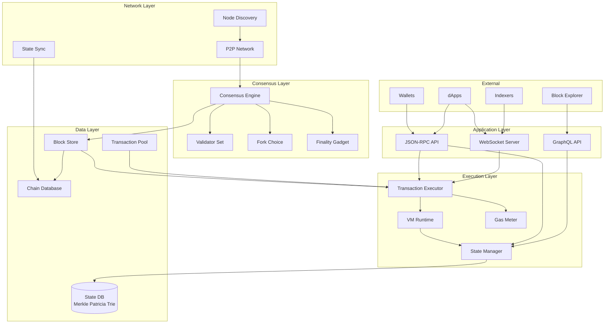
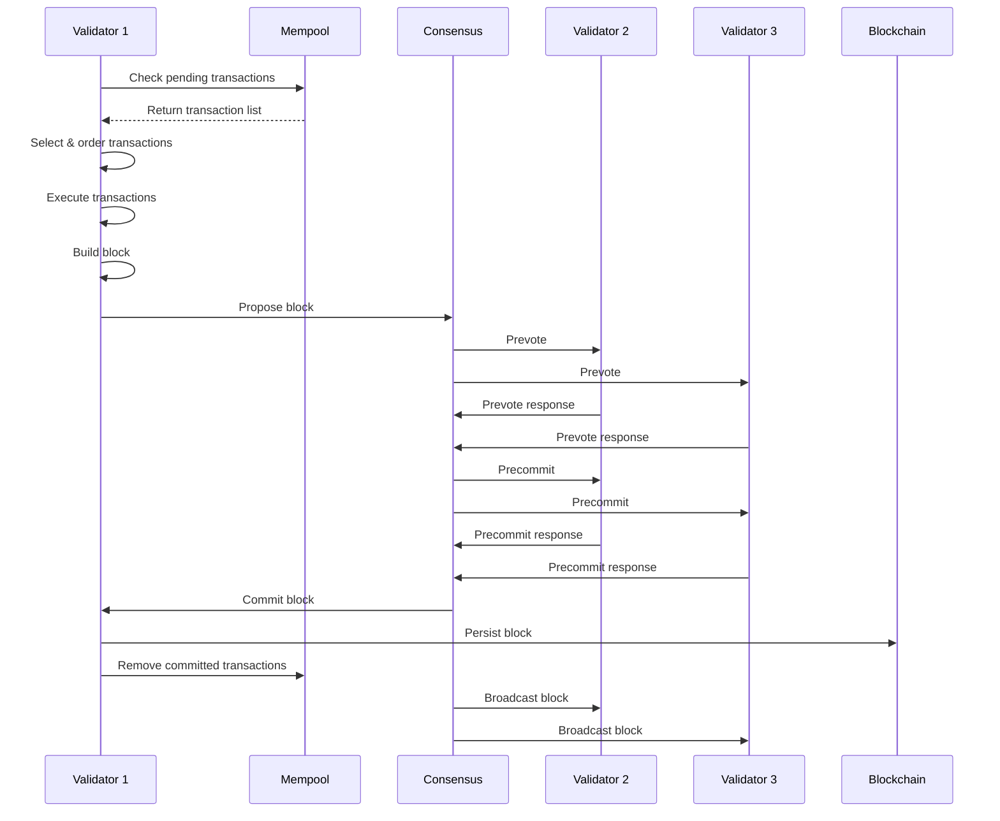

# AD-020: Blockchain System Design

## Overview

Blockchain systems provide decentralized, immutable, and trustless distributed ledgers that enable peer-to-peer value transfer, smart contract execution, and decentralized application (dApp) platforms. These systems must achieve consensus among distributed nodes, maintain data consistency, ensure Byzantine fault tolerance, and provide cryptographic security guarantees.

## 1. Domain-Specific Requirements Analysis

### 1.1 Core Functional Requirements

#### Consensus Mechanism

- **Block Production**: Deterministic block generation with fair leader election
- **Transaction Ordering**: Consistent ordering of transactions across nodes
- **Finality**: Probabilistic or absolute finality guarantees
- **Fork Resolution**: Handling chain reorganizations and selecting canonical chain
- **Validator Rotation**: Fair rotation of block proposers and validators

#### Transaction Processing

- **Signature Verification**: Cryptographic validation of transaction signatures
- **Nonce Management**: Replay attack prevention through sequence numbers
- **Gas/Economics**: Resource metering and fee market mechanisms
- **State Transition**: Deterministic state machine execution
- **Mempool Management**: Efficient transaction pool with prioritization

#### Smart Contract Platform

- **Turing Completeness**: Support for general-purpose computation
- **Deterministic Execution**: Same input produces same output on all nodes
- **Isolated Execution**: Sandboxed runtime environment
- **State Access**: Efficient read/write to contract storage
- **Event Logging**: Indexed event emission for off-chain consumers

#### Data Availability

- **Block Propagation**: Efficient dissemination of block data
- **Transaction Broadcasting**: P2P network message routing
- **State Sync**: Fast synchronization for new nodes
- **Archival**: Historical data retention and pruning strategies

### 1.2 Non-Functional Requirements

#### Performance Requirements

| Metric | Target | Criticality |
|--------|--------|-------------|
| Block Time | 1-15 seconds | High |
| TPS (Layer 1) | > 1,000 | High |
| TPS (Layer 2) | > 10,000 | Medium |
| Block Propagation | < 2 seconds | Critical |
| Sync Time (Full) | < 24 hours | Medium |
| Finality Time | < 1 minute | High |

#### Security Requirements

- **Byzantine Fault Tolerance**: Tolerate up to 1/3 malicious validators
- **Cryptographic Security**: Collision-resistant hashing, secure signatures
- **Economic Security**: Cost of attack exceeds potential gain
- **Censorship Resistance**: No single point of transaction blocking
- **Front-running Protection**: Fair ordering mechanisms

#### Decentralization Requirements

- **Validator Distribution**: Geographically and organizationally diverse
- **Client Diversity**: Multiple independent implementations
- **Governance**: On-chain or off-chain upgrade mechanisms
- **Permissionless**: Open participation without authorization

## 2. Architecture Formalization

### 2.1 System Architecture Overview



### 2.2 Block Production Flow



### 2.3 Transaction Lifecycle

```mermaid
graph LR
    subgraph "Submission"
        SUB[User Submit]
        SIGN[Sign Transaction]
        SEND[Send to Node]
    end

    subgraph "Validation"
        VALID[Validate Signature]
        NONCE[Check Nonce]
        BALANCE[Check Balance]
    end

    subgraph "Mempool"
        MEM[Add to Mempool]
        PROP[Propagate to Peers]
        PRIO[Priority Queue]
    end

    subgraph "Execution"
        EXEC[Execute Transaction]
        GAS[Deduct Gas]
        STATE[Update State]
        RECEIPT[Generate Receipt]
    end

    subgraph "Finalization"
        MINE[Include in Block]
        CONF[Confirmation]
        FINAL[Finality]
    end

    SUB --> SIGN
    SIGN --> SEND
    SEND --> VALID
    VALID --> NONCE
    NONCE --> BALANCE
    BALANCE --> MEM
    MEM --> PROP
    MEM --> PRIO
    PRIO --> EXEC
    EXEC --> GAS
    GAS --> STATE
    STATE --> RECEIPT
    RECEIPT --> MINE
    MINE --> CONF
    CONF --> FINAL
```



## 3. Scalability and Performance Considerations

### 3.1 Merkle Patricia Trie Optimization

```go
package state

import (
    "bytes"
    "hash"
    "sync"

    "golang.org/x/crypto/sha3"
)

// Trie implements a Merkle Patricia Trie for state storage
type Trie struct {
    root     Node
    db       Database
    hasher   hash.Hash
    cache    *Cache
    mu       sync.RWMutex
}

type Node interface {
    Hash() []byte
    Cache() (Node, bool)
}

type FullNode struct {
    Children [16]Node
    Value    []byte
    hash     []byte
    dirty    bool
}

type ShortNode struct {
    Key   []byte
    Val   Node
    hash  []byte
    dirty bool
}

type ValueNode struct {
    Data []byte
}

// NewTrie creates a new trie
func NewTrie(db Database, root []byte) (*Trie, error) {
    trie := &Trie{
        db:     db,
        hasher: sha3.NewLegacyKeccak256(),
        cache:  NewCache(10000),
    }

    if len(root) > 0 {
        node, err := trie.resolveHash(root)
        if err != nil {
            return nil, err
        }
        trie.root = node
    }

    return trie, nil
}

// Get retrieves a value from the trie
func (t *Trie) Get(key []byte) ([]byte, error) {
    t.mu.RLock()
    defer t.mu.RUnlock()

    k := keybytesToHex(key)
    _, node := t.get(t.root, k, 0)

    if node == nil {
        return nil, nil
    }

    if vn, ok := node.(*ValueNode); ok {
        return vn.Data, nil
    }

    return nil, nil
}

func (t *Trie) get(orig Node, key []byte, pos int) (bool, Node) {
    switch n := orig.(type) {
    case nil:
        return false, nil
    case *ValueNode:
        return true, n
    case *ShortNode:
        if len(key)-pos < len(n.Key) || !bytes.Equal(n.Key, key[pos:pos+len(n.Key)]) {
            return false, nil
        }
        t.cache.incNodeCount()
        _, child := t.get(n.Val, key, pos+len(n.Key))
        return true, child
    case *FullNode:
        t.cache.incNodeCount()
        _, child := t.get(n.Children[key[pos]], key, pos+1)
        return true, child
    default:
        panic("invalid node type")
    }
}

// Update inserts or updates a value
func (t *Trie) Update(key, value []byte) error {
    t.mu.Lock()
    defer t.mu.Unlock()

    k := keybytesToHex(key)

    if len(value) == 0 {
        t.root = t.delete(t.root, k, 0)
    } else {
        t.root = t.insert(t.root, k, value, 0)
    }

    return nil
}

func (t *Trie) insert(n Node, prefix, value []byte, pos int) Node {
    if len(prefix) == pos {
        return &ValueNode{Data: value}
    }

    switch n := n.(type) {
    case nil:
        return &ShortNode{
            Key: prefix[pos:],
            Val: &ValueNode{Data: value},
        }
    case *ShortNode:
        // Handle key divergence
        matchLen := prefixLen(prefix[pos:], n.Key)

        if matchLen == len(n.Key) {
            // Full match, recurse
            return &ShortNode{
                Key: n.Key,
                Val: t.insert(n.Val, prefix, value, pos+matchLen),
            }
        }

        // Partial match, create branch
        branch := &FullNode{}
        branch.Children[n.Key[matchLen]] = n.Val

        if matchLen == len(prefix)-pos {
            branch.Value = value
        } else {
            branch.Children[prefix[pos+matchLen]] = &ShortNode{
                Key: prefix[pos+matchLen+1:],
                Val: &ValueNode{Data: value},
            }
        }

        if matchLen == 0 {
            return branch
        }

        return &ShortNode{
            Key: prefix[pos : pos+matchLen],
            Val: branch,
        }

    case *FullNode:
        n.Children[prefix[pos]] = t.insert(n.Children[prefix[pos]], prefix, value, pos+1)
        n.dirty = true
        return n

    default:
        panic("invalid node type")
    }
}

// Hash returns the root hash
func (t *Trie) Hash() []byte {
    t.mu.RLock()
    defer t.mu.RUnlock()

    if t.root == nil {
        return emptyRoot.Bytes()
    }

    return t.hashNode(t.root)
}

func (t *Trie) hashNode(n Node) []byte {
    switch node := n.(type) {
    case *ShortNode:
        return t.hashShortNode(node)
    case *FullNode:
        return t.hashFullNode(node)
    case *ValueNode:
        return t.hasher.Sum(node.Data)
    default:
        return nil
    }
}

func (t *Trie) hashShortNode(n *ShortNode) []byte {
    if n.hash != nil && !n.dirty {
        return n.hash
    }

    t.hasher.Reset()

    // Encode node type + key + value hash
    t.hasher.Write([]byte{0x02}) // Short node type
    t.hasher.Write(n.Key)
    t.hasher.Write(t.hashNode(n.Val))

    n.hash = t.hasher.Sum(nil)
    n.dirty = false

    return n.hash
}

func keybytesToHex(str []byte) []byte {
    l := len(str) * 2
    res := make([]byte, l)
    for i, b := range str {
        res[i*2] = b / 16
        res[i*2+1] = b % 16
    }
    return res
}

func prefixLen(a, b []byte) int {
    var i, length = 0, len(a)
    if len(b) < length {
        length = len(b)
    }
    for ; i < length; i++ {
        if a[i] != b[i] {
            break
        }
    }
    return i
}
```

### 3.2 Transaction Pool Management

```go
package txpool

import (
    "container/heap"
    "context"
    "math/big"
    "sync"
    "time"
)

// TxPool manages pending transactions
type TxPool struct {
    pending     map[common.Address]*txList
    queue       map[common.Address]*txList
    all         map[common.Hash]*types.Transaction
    priced      *txPricedList

    config      Config
    chain       BlockChain
    gasPrice    *big.Int

    mu          sync.RWMutex
    wg          sync.WaitGroup

    reqResetCh  chan *txpoolResetRequest
    reqPromoteCh chan *accountSet
    quitCh      chan struct{}
}

type Config struct {
    Locals        []common.Address
    NoLocals      bool
    Journal       string
    Rejournal     time.Duration
    PriceLimit    uint64
    PriceBump     uint64
    AccountSlots  uint64
    GlobalSlots   uint64
    AccountQueue  uint64
    GlobalQueue   uint64
    Lifetime      time.Duration
}

type txList struct {
    txs       map[uint64]*types.Transaction // nonce -> tx
    strict    bool
    totalcost *big.Int
}

// Add adds a transaction to the pool
func (pool *TxPool) Add(tx *types.Transaction, local bool) error {
    pool.mu.Lock()
    defer pool.mu.Unlock()

    // Validate transaction
    if err := pool.validateTx(tx, local); err != nil {
        return err
    }

    // Add to pool
    return pool.add(tx, local)
}

func (pool *TxPool) validateTx(tx *types.Transaction, local bool) error {
    // Check size
    if uint64(tx.Size()) > txMaxSize {
        return ErrOversizedData
    }

    // Check transaction value
    if tx.Value().Sign() < 0 {
        return ErrNegativeValue
    }

    // Ensure the transaction doesn't exceed the current block limit
    if pool.gasPrice.Cmp(tx.GasPrice()) > 0 {
        return ErrUnderpriced
    }

    // Ensure the transaction adheres to nonce ordering
    from, _ := types.Sender(pool.signer, tx)

    currentState := pool.currentState()
    if currentState.GetNonce(from) > tx.Nonce() {
        return ErrNonceTooLow
    }

    // Ensure the transactor has enough funds
    if currentState.GetBalance(from).Cmp(tx.Cost()) < 0 {
        return ErrInsufficientFunds
    }

    // Ensure the transaction has more gas than the basic tx fee
    intrinsicGas, err := IntrinsicGas(tx.Data(), tx.AccessList(), tx.To() == nil, true, pool.istanbul)
    if err != nil {
        return err
    }
    if tx.Gas() < intrinsicGas {
        return ErrIntrinsicGas
    }

    return nil
}

func (pool *TxPool) add(tx *types.Transaction, local bool) error {
    // If the transaction is already known, discard it
    hash := tx.Hash()
    if pool.all[hash] != nil {
        log.Trace("Discarding already known transaction", "hash", hash)
        return nil
    }

    from, _ := types.Sender(pool.signer, tx)

    // Try to replace an existing transaction
    if list := pool.pending[from]; list != nil && list.txs[tx.Nonce()] != nil {
        // Transaction with same nonce already exists
        old := list.txs[tx.Nonce()]
        if old.GasPrice().Cmp(tx.GasPrice()) >= 0 {
            return ErrReplaceUnderpriced
        }

        // Replace the old transaction
        pool.all[old.Hash()] = nil
        list.txs[tx.Nonce()] = tx
        pool.all[hash] = tx
        pool.priced.Put(tx)

        log.Trace("Replaced old transaction", "old", old.Hash(), "new", hash)
        return nil
    }

    // New transaction, add to pending or queue
    replace, err := pool.enqueueTx(hash, tx, local)
    if err != nil {
        return err
    }

    // If we added a new transaction, run promotion checks
    if !replace {
        pool.promoteExecutables([]common.Address{from})
    }

    return nil
}

// Pending retrieves all pending transactions
func (pool *TxPool) Pending(enforceTips bool) map[common.Address]types.Transactions {
    pool.mu.Lock()
    defer pool.mu.Unlock()

    pending := make(map[common.Address]types.Transactions)
    for addr, list := range pool.pending {
        txs := list.Flatten()

        // If tip enforcement is enabled, filter transactions
        if enforceTips && !pool.locals.contains(addr) {
            for i, tx := range txs {
                if tx.EffectiveGasTipIntCmp(pool.gasPrice, pool.prices.EffectiveBaseFee()) < 0 {
                    txs = txs[:i]
                    break
                }
            }
        }

        if len(txs) > 0 {
            pending[addr] = txs
        }
    }

    return pending
}

// txPricedList sorts transactions by gas price
type txPricedList struct {
    all              *txLookup
    txs              []*types.Transaction
    stale            int
    effectiveTipCap  bool
}

func (l *txPricedList) Put(tx *types.Transaction) {
    heap.Push(l, tx)
}

func (l *txPricedList) Len() int {
    return len(l.txs) - l.stale
}

func (l *txPricedList) Less(i, j int) bool {
    return l.txs[i].GasPrice().Cmp(l.txs[j].GasPrice()) < 0
}

func (l *txPricedList) Swap(i, j int) {
    l.txs[i], l.txs[j] = l.txs[j], l.txs[i]
}

func (l *txPricedList) Push(x interface{}) {
    l.txs = append(l.txs, x.(*types.Transaction))
}

func (l *txPricedList) Pop() interface{} {
    old := l.txs
    n := len(old)
    x := old[n-1]
    l.txs = old[0 : n-1]
    return x
}
```

## 4. Technology Stack Recommendations

### 4.1 Core Technologies

| Layer | Technology | Purpose |
|-------|-----------|---------|
| Language | Go 1.21+ | High-performance node implementation |
| Consensus | Tendermint/BFT | Byzantine fault-tolerant consensus |
| Cryptography | secp256k1, BLS | Digital signatures |
| Database | LevelDB/RocksDB | Chain and state storage |
| Networking | libp2p | Peer-to-peer networking |
| RPC | gRPC/JSON-RPC | External API |
| Metrics | Prometheus/Grafana | Monitoring |

### 4.2 Go Libraries

```go
// Core dependencies
go get github.com/ethereum/go-ethereum
go get github.com/tendermint/tendermint
go get github.com/libp2p/go-libp2p
go get github.com/syndtr/goleveldb
go get github.com/cockroachdb/pebble
go get github.com/minio/sha256-simd
go get github.com/supranational/blst
go get github.com/prometheus/client_golang
```

## 5. Industry Case Studies

### 5.1 Case Study: Ethereum 2.0 (Consensus Layer)

**Architecture**:

- Proof of Stake with Casper FFG
- Sharded execution with 64 shards
- Beacon Chain coordination
- Libp2p networking

**Scale**:

- 400K+ validators
- 12-second slot time
- 128 committees per slot
- 32 ETH minimum stake

**Key Innovations**:

1. Slashing conditions for security
2. Weak subjectivity checkpoints
3. Proposer-builder separation
4. Danksharding for data availability

### 5.2 Case Study: Solana

**Architecture**:

- Proof of History for time synchronization
- Gulf Stream: mempool-less forwarding
- Sealevel: parallel smart contract runtime
- Tower BFT consensus

**Performance**:

- 400ms block time
- 65,000+ TPS theoretical
- 3-4 second finality
- Sub-cent transaction costs

### 5.3 Case Study: Cosmos Hub

**Architecture**:

- Tendermint BFT consensus
- IBC cross-chain protocol
- SDK for custom chains
- Hub-and-spoke topology

**Features**:

- 1-2 second finality
- 150+ validator set
- Inter-blockchain communication
- Governance-based upgrades

## 6. Go Implementation Examples

### 6.1 Block Producer

```go
package miner

import (
    "context"
    "math/big"
    "time"
)

// Producer creates new blocks
type Producer struct {
    ethAPI       *ethapi.BlockChainAPI
    txPool       *txpool.TxPool
    consensus    ConsensusEngine
    coinbase     common.Address

    mu           sync.Mutex
    running      int32
    resultCh     chan *types.Block

    config       *params.ChainConfig
    engine       consensus.Engine
}

// Produce creates a new block
func (p *Producer) Produce(timestamp int64) (*types.Block, error) {
    p.mu.Lock()
    defer p.mu.Unlock()

    parent := p.ethAPI.CurrentBlock()
    num := new(big.Int).Add(parent.Number(), big.NewInt(1))

    // Get pending transactions
    pending := p.txPool.Pending(true)

    // Build transaction list
    txs := make([]*types.Transaction, 0, len(pending))
    for _, list := range pending {
        txs = append(txs, list...)
    }

    // Sort by effective tip
    sortTransactions(txs)

    // Build block
    header := &types.Header{
        ParentHash: parent.Hash(),
        Number:     num,
        GasLimit:   CalcGasLimit(parent.GasLimit(), p.config),
        Time:       uint64(timestamp),
        Coinbase:   p.coinbase,
    }

    // Apply transactions
    statedb, err := p.ethAPI.StateAt(parent.Root())
    if err != nil {
        return nil, err
    }

    gasPool := new(GasPool).AddGas(header.GasLimit)

    var receipts []*types.Receipt
    var usedGas uint64

    for _, tx := range txs {
        statedb.Prepare(tx.Hash(), len(receipts))

        receipt, err := ApplyTransaction(p.config, p.ethAPI, gasPool, statedb, header, tx, &usedGas)
        if err != nil {
            // Skip invalid transactions
            continue
        }

        receipts = append(receipts, receipt)
    }

    // Finalize block
    header.GasUsed = usedGas
    header.Root = statedb.IntermediateRoot(p.config.IsEIP158(num))

    // Build block
    block := types.NewBlock(header, txs, nil, receipts, trie.NewStackTrie(nil))

    // Seal block (consensus-specific)
    result, err := p.engine.Seal(p.chain, block, nil)
    if err != nil {
        return nil, err
    }

    return <-result, nil
}

func ApplyTransaction(config *params.ChainConfig, bc ChainContext, gp *GasPool, statedb *state.StateDB, header *types.Header, tx *types.Transaction, usedGas *uint64) (*types.Receipt, error) {
    msg, err := tx.AsMessage(types.MakeSigner(config, header.Number), header.BaseFee)
    if err != nil {
        return nil, err
    }

    // Create a new context
    ctx := NewEVMContext(msg, header, bc, nil)
    vmenv := vm.NewEVM(ctx, statedb, config, vm.Config{})

    // Apply the transaction
    result, err := ApplyMessage(vmenv, msg, gp)
    if err != nil {
        return nil, err
    }

    *usedGas += result.UsedGas

    // Create receipt
    receipt := &types.Receipt{
        Type:              tx.Type(),
        PostState:         statedb.IntermediateRoot(config.IsEIP158(header.Number)).Bytes(),
        CumulativeGasUsed: *usedGas,
        Bloom:             types.CreateBloom(types.Receipts{}),
        Logs:              statedb.GetLogs(tx.Hash(), header.Number.Uint64(), header.Hash()),
        TxHash:            tx.Hash(),
        ContractAddress:   nil,
        GasUsed:           result.UsedGas,
    }

    if msg.To() == nil {
        receipt.ContractAddress = crypto.CreateAddress(vmenv.Context.Origin, tx.Nonce())
    }

    receipt.Bloom = types.CreateBloom(types.Receipts{receipt})
    receipt.Status = types.ReceiptStatusSuccessful
    if result.Failed() {
        receipt.Status = types.ReceiptStatusFailed
    }

    return receipt, nil
}
```

### 6.2 Smart Contract Execution

```go
package vm

import (
    "math/big"
    "sync/atomic"
)

// EVM is the Ethereum Virtual Machine
type EVM struct {
    Context     BlockContext
    TxContext   TxContext
    StateDB     StateDB
    depth       int
    chainConfig *params.ChainConfig
    chainRules  params.Rules

    interpreter *EVMInterpreter
    abort       int32
    callGasTemp uint64
}

// Call executes a contract call
func (evm *EVM) Call(caller ContractRef, addr common.Address, input []byte, gas uint64, value *big.Int) (ret []byte, leftOverGas uint64, err error) {
    if evm.depth > int(params.CallCreateDepth) {
        return nil, gas, ErrDepth
    }

    if value.Sign() != 0 && !evm.Context.CanTransfer(evm.StateDB, caller.Address(), value) {
        return nil, gas, ErrInsufficientBalance
    }

    snapshot := evm.StateDB.Snapshot()
    p, isPrecompile := evm.precompile(addr)

    if !evm.StateDB.Exist(addr) {
        if !isPrecompile && evm.chainRules.IsEIP158 && value.Sign() == 0 {
            return nil, gas, nil
        }
        evm.StateDB.CreateAccount(addr)
    }

    evm.Context.Transfer(evm.StateDB, caller.Address(), addr, value)

    if isPrecompile {
        ret, gas, err = RunPrecompiledContract(p, input, gas)
    } else {
        code := evm.StateDB.GetCode(addr)
        if len(code) == 0 {
            ret, err = nil, nil // no code, no error
        } else {
            addrCopy := addr
            contract := NewContract(caller, AccountRef(addrCopy), value, gas)
            contract.SetCallCode(&addrCopy, evm.StateDB.GetCodeHash(addrCopy), code)
            ret, err = evm.interpreter.Run(contract, input, false)
            gas = contract.Gas
        }
    }

    if err != nil {
        evm.StateDB.RevertToSnapshot(snapshot)
        if err != ErrExecutionReverted {
            gas = 0
        }
    }

    return ret, gas, err
}

// Create creates a new contract
func (evm *EVM) Create(caller ContractRef, code []byte, gas uint64, value *big.Int) (ret []byte, contractAddr common.Address, leftOverGas uint64, err error) {
    contractAddr = crypto.CreateAddress(caller.Address(), evm.StateDB.GetNonce(caller.Address()))
    return evm.create(caller, &codeAndHash{code: code}, gas, value, contractAddr, CREATE)
}

func (evm *EVM) create(caller ContractRef, codeAndHash *codeAndHash, gas uint64, value *big.Int, address common.Address, typ OpCode) ([]byte, common.Address, uint64, error) {
    if evm.depth > int(params.CallCreateDepth) {
        return nil, common.Address{}, gas, ErrDepth
    }

    if !evm.Context.CanTransfer(evm.StateDB, caller.Address(), value) {
        return nil, common.Address{}, gas, ErrInsufficientBalance
    }

    nonce := evm.StateDB.GetNonce(caller.Address())
    evm.StateDB.SetNonce(caller.Address(), nonce+1)

    snapshot := evm.StateDB.Snapshot()
    evm.StateDB.CreateAccount(address)

    if evm.chainRules.IsEIP158 {
        evm.StateDB.SetNonce(address, 1)
    }

    evm.Context.Transfer(evm.StateDB, caller.Address(), address, value)

    contract := NewContract(caller, AccountRef(address), value, gas)
    contract.SetCodeOptionalHash(&address, codeAndHash)

    if evm.chainRules.IsHomestead && typ == CREATE {
        // Contract creation gas limit
        gas -= gas / 64
    }

    ret, err := evm.interpreter.Run(contract, nil, false)

    // Check max code size
    maxCodeSize := params.MaxCodeSize
    if evm.chainRules.IsShanghai {
        maxCodeSize = params.MaxInitCodeSize
    }

    if err == nil && len(ret) > maxCodeSize {
        err = ErrMaxCodeSizeExceeded
    }

    if err != nil {
        evm.StateDB.RevertToSnapshot(snapshot)
        if err != ErrExecutionReverted {
            contract.UseGas(contract.Gas)
        }
    }

    return ret, address, contract.Gas, err
}

// Stop halts the EVM
func (evm *EVM) Stop() {
    atomic.StoreInt32(&evm.abort, 1)
}
```

## 7. Security and Compliance

### 7.1 Signature Verification

```go
package crypto

import (
    "crypto/ecdsa"
    "crypto/elliptic"
    "crypto/rand"
    "math/big"

    "github.com/ethereum/go-ethereum/common"
    "github.com/ethereum/go-ethereum/crypto/secp256k1"
)

// Sign signs the hash with the private key
func Sign(hash []byte, prv *ecdsa.PrivateKey) ([]byte, error) {
    if len(hash) != 32 {
        return nil, fmt.Errorf("hash is required to be exactly 32 bytes (%d)", len(hash))
    }

    seckey := math.PaddedBigBytes(prv.D, prv.Params().BitSize/8)
    defer zeroBytes(seckey)

    return secp256k1.Sign(hash, seckey)
}

// VerifySignature checks that the given public key created signature over hash
func VerifySignature(pubkey, hash, signature []byte) bool {
    return secp256k1.VerifySignature(pubkey, hash, signature)
}

// PubkeyToAddress converts a public key to an Ethereum address
func PubkeyToAddress(p ecdsa.PublicKey) common.Address {
    pubBytes := FromECDSAPub(&p)
    return common.BytesToAddress(Keccak256(pubBytes[1:])[12:])
}

// CreateAddress creates an Ethereum address from a sender and nonce
func CreateAddress(b common.Address, nonce uint64) common.Address {
    data, _ := rlp.EncodeToBytes([]interface{}{b, nonce})
    return common.BytesToAddress(Keccak256(data)[12:])
}

// CreateAddress2 creates an Ethereum address using the CREATE2 opcode
func CreateAddress2(b common.Address, salt [32]byte, inithash []byte) common.Address {
    return common.BytesToAddress(Keccak256([]byte{0xff}, b.Bytes(), salt[:], inithash)[12:])
}

func zeroBytes(bytes []byte) {
    for i := range bytes {
        bytes[i] = 0
    }
}
```

## 8. Conclusion

Blockchain system design requires a deep understanding of distributed systems, cryptography, and game theory. Key takeaways:

1. **Consensus is critical**: Choose the right consensus mechanism for your use case
2. **State management**: Efficient trie structures are essential for performance
3. **Economic incentives**: Design tokenomics that align validator behavior
4. **Upgrade path**: Plan for protocol evolution from the beginning
5. **Security-first**: Every component must be resilient to attacks
6. **Decentralization**: Avoid centralization vectors in design and implementation

The Go programming language is widely used in blockchain development due to its performance characteristics, excellent concurrency support, and strong standard library. By following the patterns outlined in this document, you can build blockchain systems that are secure, scalable, and decentralized.

---

*Document Version: 1.0*
*Last Updated: 2026-04-02*
*Classification: Technical Reference*
