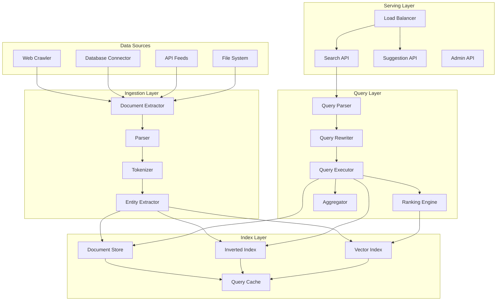
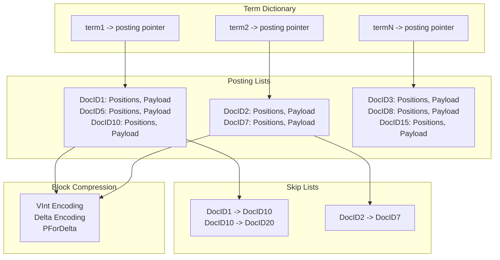
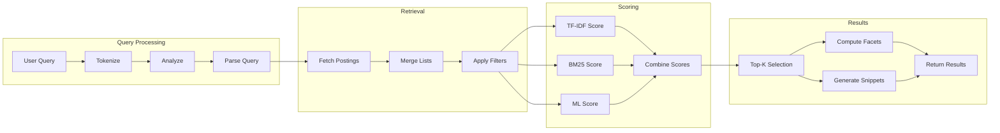

# AD-021: Search Engine Design

## Overview

Search engines are complex distributed systems that index, store, and retrieve information from massive document collections. They must handle billions of documents, process thousands of queries per second, and return relevant results in milliseconds while continuously crawling and updating their indices.

## 1. Domain-Specific Requirements Analysis

### 1.1 Core Functional Requirements

#### Crawling and Indexing
- **Web Crawling**: Distributed crawling at web scale
- **Document Processing**: Parsing, tokenization, and text extraction
- **Index Building**: Inverted index construction with positional information
- **Real-time Indexing**: Near real-time document availability
- **Index Updates**: Incremental updates and deletions

#### Query Processing
- **Query Parsing**: Natural language understanding and query interpretation
- **Boolean Retrieval**: AND, OR, NOT operations
- **Phrase Queries**: Exact phrase matching with positions
- **Proximity Queries**: Terms within specified distance
- **Wildcard Queries**: Prefix, suffix, and regex matching

#### Ranking and Relevance
- **TF-IDF Scoring**: Term frequency-inverse document frequency
- **Vector Space Model**: Cosine similarity computation
- **BM25**: Probabilistic relevance scoring
- **Machine Learning**: Learned ranking models
- **Personalization**: User-specific result ranking

#### Faceted Search
- **Dynamic Facets**: Category extraction and counting
- **Filter Operations**: Range, term, and boolean filters
- **Aggregation**: Statistics and histogram computation
- **Drill-down**: Hierarchical navigation

### 1.2 Non-Functional Requirements

#### Performance Requirements
| Metric | Target | Criticality |
|--------|--------|-------------|
| Query Latency | < 100ms (p99) | Critical |
| Indexing Latency | < 1 second | High |
| Document Count | > 10 billion | Critical |
| Query QPS | > 10,000 | Critical |
| System Availability | 99.99% | Critical |
| Index Update Time | < 5 minutes | Medium |

#### Scalability Requirements
- Horizontal scaling for both indexing and querying
- Partition tolerance for distributed operations
- Efficient resource utilization
- Automatic rebalancing and recovery

## 2. Architecture Formalization

### 2.1 System Architecture Overview



### 2.2 Inverted Index Architecture



### 2.3 Query Execution Flow



## 3. Scalability and Performance Considerations

### 3.1 Distributed Indexing

```go
package index

import (
    "context"
    "hash/fnv"
    "sync"
    
    "github.com/google/uuid"
)

// DistributedIndex manages sharded inverted index
type DistributedIndex struct {
    shards    []*IndexShard
    router    *ShardRouter
    merger    *IndexMerger
    config    *IndexConfig
}

type IndexShard struct {
    ID       string
    Index    *InvertedIndex
    Document map[string]*Document
    mu       sync.RWMutex
}

// AddDocument indexes a document across shards
func (di *DistributedIndex) AddDocument(ctx context.Context, doc *Document) error {
    // Route to appropriate shard
    shard := di.router.GetShard(doc.ID)
    
    shard.mu.Lock()
    defer shard.mu.Unlock()
    
    // Extract terms
    terms := di.analyze(doc.Content)
    
    // Update inverted index
    for pos, term := range terms {
        shard.Index.AddPosting(term, doc.ID, pos, doc)
    }
    
    // Store document
    shard.Document[doc.ID] = doc
    
    return nil
}

// Search executes a distributed search
func (di *DistributedIndex) Search(ctx context.Context, query *Query) (*SearchResult, error) {
    // Parse query
    queryPlan := di.parseQuery(query)
    
    // Distribute to all shards
    resultsCh := make(chan *ShardResult, len(di.shards))
    var wg sync.WaitGroup
    
    for _, shard := range di.shards {
        wg.Add(1)
        go func(s *IndexShard) {
            defer wg.Done()
            result := di.searchShard(ctx, s, queryPlan)
            resultsCh <- result
        }(shard)
    }
    
    // Close channel when done
    go func() {
        wg.Wait()
        close(resultsCh)
    }()
    
    // Merge results
    var allDocs []*ScoredDocument
    for result := range resultsCh {
        allDocs = append(allDocs, result.Docs...)
    }
    
    // Global top-k
    topDocs := di.selectTopK(allDocs, query.Limit)
    
    return &SearchResult{
        Documents: topDocs,
        Total:     len(allDocs),
    }, nil
}

func (di *DistributedIndex) searchShard(ctx context.Context, shard *IndexShard, plan *QueryPlan) *ShardResult {
    shard.mu.RLock()
    defer shard.mu.RUnlock()
    
    var docs []*ScoredDocument
    
    for _, term := range plan.Terms {
        postings := shard.Index.GetPostings(term)
        
        for _, posting := range postings {
            doc := shard.Document[posting.DocID]
            if doc == nil {
                continue
            }
            
            score := di.score(doc, plan)
            docs = append(docs, &ScoredDocument{
                Document: doc,
                Score:    score,
            })
        }
    }
    
    return &ShardResult{Docs: docs}
}

// ShardRouter routes documents to shards
type ShardRouter struct {
    shards []*IndexShard
}

func (sr *ShardRouter) GetShard(docID string) *IndexShard {
    h := fnv.New32a()
    h.Write([]byte(docID))
    idx := h.Sum32() % uint32(len(sr.shards))
    return sr.shards[idx]
}
```

### 3.2 Query Optimization

```go
package query

import (
    "context"
    "sort"
)

// Optimizer optimizes query execution plans
type Optimizer struct {
    stats      *IndexStatistics
    costModel  *CostModel
}

// Optimize creates an optimal execution plan
func (o *Optimizer) Optimize(query *Query) *ExecutionPlan {
    plan := &ExecutionPlan{
        Query: query,
    }
    
    // Rewrite query
    rewritten := o.rewrite(query)
    
    // Generate candidate plans
    candidates := o.generatePlans(rewritten)
    
    // Select best plan based on cost
    bestPlan := o.selectBestPlan(candidates)
    
    return bestPlan
}

func (o *Optimizer) rewrite(query *Query) *Query {
    // Apply rewrite rules
    
    // 1. Boolean simplification
    query = o.simplifyBoolean(query)
    
    // 2. Term expansion (synonyms, stemming)
    query = o.expandTerms(query)
    
    // 3. Phrase optimization
    query = o.optimizePhrases(query)
    
    // 4. Filter pushdown
    query = o.pushdownFilters(query)
    
    return query
}

func (o *Optimizer) generatePlans(query *Query) []*ExecutionPlan {
    var plans []*ExecutionPlan
    
    // Generate different join orders for boolean queries
    if booleanQuery, ok := query.(*BooleanQuery); ok {
        clauses := booleanQuery.Clauses
        
        // Generate permutations for small number of clauses
        if len(clauses) <= 5 {
            permutations := generatePermutations(clauses)
            for _, perm := range permutations {
                plans = append(plans, &ExecutionPlan{
                    JoinOrder: perm,
                })
            }
        }
    }
    
    // Add default plan
    plans = append(plans, &ExecutionPlan{
        JoinOrder: query.Clauses,
    })
    
    return plans
}

func (o *Optimizer) selectBestPlan(candidates []*ExecutionPlan) *ExecutionPlan {
    var bestPlan *ExecutionPlan
    bestCost := float64(1<<63 - 1)
    
    for _, plan := range candidates {
        cost := o.estimateCost(plan)
        if cost < bestCost {
            bestCost = cost
            bestPlan = plan
        }
    }
    
    return bestPlan
}

func (o *Optimizer) estimateCost(plan *ExecutionPlan) float64 {
    var totalCost float64
    
    for _, op := range plan.Operations {
        switch op.Type {
        case "TERM_SCAN":
            // Cost proportional to posting list size
            docFreq := o.stats.GetDocFreq(op.Term)
            totalCost += float64(docFreq) * o.costModel.ReadPostingCost
            
        case "BOOLEAN_AND":
            // Cost proportional to smaller posting list
            totalCost += float64(min(op.LeftSize, op.RightSize)) * o.costModel.IntersectCost
            
        case "BOOLEAN_OR":
            // Cost proportional to sum minus intersection
            totalCost += float64(op.LeftSize+op.RightSize) * o.costModel.UnionCost
            
        case "FILTER":
            totalCost += float64(op.InputSize) * o.costModel.FilterCost
        }
    }
    
    return totalCost
}
```

### 3.3 Caching Strategy

```go
package cache

import (
    "context"
    "hash/fnv"
    "time"
    
    "github.com/allegro/bigcache"
)

// QueryCache caches query results
type QueryCache struct {
    hotCache   *bigcache.BigCache
    warmCache  *redis.Client
    
    hitCount   uint64
    missCount  uint64
}

// Get retrieves cached results
func (qc *QueryCache) Get(ctx context.Context, query *Query) (*CachedResult, bool) {
    key := qc.computeKey(query)
    
    // Try hot cache first
    if data, err := qc.hotCache.Get(key); err == nil {
        var result CachedResult
        if err := json.Unmarshal(data, &result); err == nil {
            atomic.AddUint64(&qc.hitCount, 1)
            return &result, true
        }
    }
    
    // Try warm cache
    data, err := qc.warmCache.Get(ctx, key).Result()
    if err == nil {
        var result CachedResult
        if err := json.Unmarshal([]byte(data), &result); err == nil {
            // Backfill hot cache
            qc.hotCache.Set(key, []byte(data))
            atomic.AddUint64(&qc.hitCount, 1)
            return &result, true
        }
    }
    
    atomic.AddUint64(&qc.missCount, 1)
    return nil, false
}

// Set stores query results in cache
func (qc *QueryCache) Set(ctx context.Context, query *Query, result *CachedResult, ttl time.Duration) {
    key := qc.computeKey(query)
    data, _ := json.Marshal(result)
    
    // Store in both caches
    qc.hotCache.Set(key, data)
    qc.warmCache.Set(ctx, key, data, ttl)
}

func (qc *QueryCache) computeKey(query *Query) string {
    // Hash query to cache key
    h := fnv.New64a()
    h.Write([]byte(query.String()))
    
    // Include filter state
    for k, v := range query.Filters {
        h.Write([]byte(k))
        h.Write([]byte(fmt.Sprintf("%v", v)))
    }
    
    return strconv.FormatUint(h.Sum64(), 36)
}

// computeCacheTier determines which cache tier to use
func (qc *QueryCache) computeCacheTier(query *Query) CacheTier {
    // Simple query with no filters -> Hot cache
    if len(query.Filters) == 0 && query.IsSimple() {
        return TierHot
    }
    
    // Complex query with filters -> Warm cache
    return TierWarm
}
```

## 4. Technology Stack Recommendations

### 4.1 Core Technologies

| Layer | Technology | Purpose |
|-------|-----------|---------|
| Language | Go 1.21+ | High-performance services |
| Search | Elasticsearch/OpenSearch | Full-text search |
| Vector DB | Milvus/Pinecone | Semantic search |
| Cache | Redis Cluster | Query and result caching |
| Message Queue | Apache Kafka | Index updates |
| Storage | S3/MinIO | Document storage |
| ML | TensorFlow/PyTorch | Learned ranking |

### 4.2 Go Libraries

```go
// Core dependencies
go get github.com/blevesearch/bleve/v2
go get github.com/elastic/go-elasticsearch/v8
go get github.com/redis/go-redis/v9
go get github.com/IBM/sarama
go get github.com/allegro/bigcache/v3
go get github.com/prometheus/client_golang
```

## 5. Industry Case Studies

### 5.1 Case Study: Elasticsearch Architecture

**Architecture**:
- Distributed inverted index
- Shard-based horizontal scaling
- Master-eligible nodes for cluster management
- Ingest nodes for document processing

**Scale**:
- Petabytes of data
- Millions of documents per second
- Sub-second query latency

**Key Features**:
1. Automatic sharding and replication
2. Near real-time search
3. Complex aggregation framework
4. Machine learning integration

### 5.2 Case Study: Google Search Infrastructure

**Architecture**:
- Custom indexing system (Caffeine)
- Serving system with massive replication
- ML-based ranking (RankBrain, BERT)
- Knowledge Graph integration

**Scale**:
- Trillions of web pages
- Billions of queries per day
- < 200ms average response time

### 5.3 Case Study: Meilisearch

**Architecture**:
- Rust-based search engine
- Memory-mapped indices
- Incremental indexing
- Typo-tolerant search

**Performance**:
- < 50ms search latency
- < 1 second indexing latency
- Single-binary deployment

## 6. Go Implementation Examples

### 6.1 Inverted Index Implementation

```go
package index

import (
    "encoding/binary"
    "sort"
    "sync"
)

// InvertedIndex stores term to document mappings
type InvertedIndex struct {
    dictionary map[string]*PostingList
    docCount   uint64
    mu         sync.RWMutex
}

type PostingList struct {
    Postings []*Posting
    DocFreq  uint64
    TotalTermFreq uint64
}

type Posting struct {
    DocID      string
    Positions  []uint32
    TermFreq   uint32
    Payload    []byte
}

// AddPosting adds a posting to the index
func (idx *InvertedIndex) AddPosting(term string, docID string, pos uint32, doc *Document) {
    idx.mu.Lock()
    defer idx.mu.Unlock()
    
    if idx.dictionary[term] == nil {
        idx.dictionary[term] = &PostingList{
            Postings: make([]*Posting, 0),
        }
    }
    
    list := idx.dictionary[term]
    
    // Find or create posting for this document
    var posting *Posting
    for _, p := range list.Postings {
        if p.DocID == docID {
            posting = p
            break
        }
    }
    
    if posting == nil {
        posting = &Posting{
            DocID:     docID,
            Positions: make([]uint32, 0),
        }
        list.Postings = append(list.Postings, posting)
        list.DocFreq++
        idx.docCount++
    }
    
    posting.Positions = append(posting.Positions, pos)
    posting.TermFreq++
    list.TotalTermFreq++
}

// GetPostings retrieves postings for a term
func (idx *InvertedIndex) GetPostings(term string) []*Posting {
    idx.mu.RLock()
    defer idx.mu.RUnlock()
    
    list := idx.dictionary[term]
    if list == nil {
        return nil
    }
    
    return list.Postings
}

// Intersect performs AND operation on posting lists
func Intersect(list1, list2 []*Posting) []*Posting {
    result := make([]*Posting, 0)
    
    i, j := 0, 0
    for i < len(list1) && j < len(list2) {
        cmp := compareDocID(list1[i].DocID, list2[j].DocID)
        
        if cmp == 0 {
            result = append(result, list1[i])
            i++
            j++
        } else if cmp < 0 {
            i++
        } else {
            j++
        }
    }
    
    return result
}

// Union performs OR operation on posting lists
func Union(list1, list2 []*Posting) []*Posting {
    result := make([]*Posting, 0, len(list1)+len(list2))
    
    i, j := 0, 0
    for i < len(list1) && j < len(list2) {
        cmp := compareDocID(list1[i].DocID, list2[j].DocID)
        
        if cmp == 0 {
            result = append(result, list1[i])
            i++
            j++
        } else if cmp < 0 {
            result = append(result, list1[i])
            i++
        } else {
            result = append(result, list2[j])
            j++
        }
    }
    
    // Append remaining
    for i < len(list1) {
        result = append(result, list1[i])
        i++
    }
    for j < len(list2) {
        result = append(result, list2[j])
        j++
    }
    
    return result
}

func compareDocID(a, b string) int {
    if a < b {
        return -1
    } else if a > b {
        return 1
    }
    return 0
}

// Compress compresses a posting list using delta encoding
func (pl *PostingList) Compress() []byte {
    var buf bytes.Buffer
    
    // Write doc freq
    binary.Write(&buf, binary.BigEndian, pl.DocFreq)
    
    // Delta encode docIDs and positions
    var lastDocID uint64
    for _, posting := range pl.Postings {
        docID := parseDocID(posting.DocID)
        delta := docID - lastDocID
        binary.PutUvarint(&buf, delta)
        lastDocID = docID
        
        // Term frequency
        binary.PutUvarint(&buf, uint64(posting.TermFreq))
        
        // Delta encode positions
        var lastPos uint32
        for _, pos := range posting.Positions {
            binary.PutUvarint(&buf, uint64(pos-lastPos))
            lastPos = pos
        }
    }
    
    return buf.Bytes()
}
```

### 6.2 BM25 Scoring

```go
package scoring

import (
    "math"
)

// BM25Scorer implements BM25 ranking
type BM25Scorer struct {
    K1 float64
    B  float64
}

// NewBM25Scorer creates a new BM25 scorer with default parameters
func NewBM25Scorer() *BM25Scorer {
    return &BM25Scorer{
        K1: 1.2,
        B:  0.75,
    }
}

// Score calculates BM25 score for a document
func (s *BM25Scorer) Score(doc *Document, query *Query, stats *IndexStats) float64 {
    score := 0.0
    
    docLen := float64(len(doc.Tokens))
    avgDocLen := stats.AvgDocLength()
    
    for _, term := range query.Terms {
        tf := float64(doc.TermFreq(term))
        df := stats.DocFreq(term)
        N := float64(stats.TotalDocs())
        
        // IDF
        idf := math.Log((N - df + 0.5) / (df + 0.5))
        
        // Term frequency normalization
        tfNorm := tf * (s.K1 + 1) / (tf + s.K1*(1-s.B+s.B*docLen/avgDocLen))
        
        score += idf * tfNorm
    }
    
    return score
}

// ScorePosting calculates score from posting data
func (s *BM25Scorer) ScorePosting(posting *Posting, docLen float64, avgDocLen float64, idf float64) float64 {
    tf := float64(posting.TermFreq)
    
    tfNorm := tf * (s.K1 + 1) / (tf + s.K1*(1-s.B+s.B*docLen/avgDocLen))
    
    return idf * tfNorm
}
```

### 6.3 Query Parser

```go
package query

import (
    "fmt"
    "strings"
    "unicode"
)

// Parser parses search queries
type Parser struct {
    analyzer *Analyzer
}

// Parse parses a query string into a Query AST
func (p *Parser) Parse(input string) (Query, error) {
    lexer := NewLexer(input)
    tokens := lexer.Tokenize()
    
    parser := &queryParser{
        tokens: tokens,
        pos:    0,
    }
    
    return parser.parse()
}

type queryParser struct {
    tokens []*Token
    pos    int
}

func (qp *queryParser) parse() (Query, error) {
    return qp.parseExpression()
}

func (qp *queryParser) parseExpression() (Query, error) {
    left, err := qp.parseTerm()
    if err != nil {
        return nil, err
    }
    
    for qp.peek() != nil {
        switch qp.peek().Type {
        case TokenAND:
            qp.consume()
            right, err := qp.parseTerm()
            if err != nil {
                return nil, err
            }
            left = &BooleanQuery{
                Op:    AND,
                Left:  left,
                Right: right,
            }
            
        case TokenOR:
            qp.consume()
            right, err := qp.parseTerm()
            if err != nil {
                return nil, err
            }
            left = &BooleanQuery{
                Op:    OR,
                Left:  left,
                Right: right,
            }
            
        case TokenNOT:
            qp.consume()
            right, err := qp.parseTerm()
            if err != nil {
                return nil, err
            }
            left = &BooleanQuery{
                Op:    NOT,
                Left:  left,
                Right: right,
            }
            
        default:
            return left, nil
        }
    }
    
    return left, nil
}

func (qp *queryParser) parseTerm() (Query, error) {
    token := qp.peek()
    if token == nil {
        return nil, fmt.Errorf("unexpected end of input")
    }
    
    switch token.Type {
    case TokenPHRASE:
        qp.consume()
        return &PhraseQuery{
            Phrase: strings.Trim(token.Value, `"`),
        }, nil
        
    case TokenTERM:
        qp.consume()
        return &TermQuery{
            Term: token.Value,
        }, nil
        
    case TokenWILDCARD:
        qp.consume()
        return &WildcardQuery{
            Pattern: token.Value,
        }, nil
        
    case TokenLPAREN:
        qp.consume()
        query, err := qp.parseExpression()
        if err != nil {
            return nil, err
        }
        if qp.peek() == nil || qp.peek().Type != TokenRPAREN {
            return nil, fmt.Errorf("expected closing parenthesis")
        }
        qp.consume()
        return query, nil
        
    case TokenFIELD:
        qp.consume()
        field := token.Value
        
        if qp.peek() == nil || qp.peek().Type != TokenCOLON {
            return nil, fmt.Errorf("expected colon after field name")
        }
        qp.consume()
        
        value, err := qp.parseTerm()
        if err != nil {
            return nil, err
        }
        
        return &FieldQuery{
            Field: field,
            Query: value,
        }, nil
        
    default:
        return nil, fmt.Errorf("unexpected token: %v", token)
    }
}

func (qp *queryParser) peek() *Token {
    if qp.pos >= len(qp.tokens) {
        return nil
    }
    return qp.tokens[qp.pos]
}

func (qp *queryParser) consume() *Token {
    token := qp.peek()
    if token != nil {
        qp.pos++
    }
    return token
}
```

## 7. Security and Compliance

### 7.1 Query Sanitization

```go
package security

import (
    "regexp"
    "strings"
)

// QuerySanitizer sanitizes user queries
type QuerySanitizer struct {
    maxLength      int
    allowedChars   *regexp.Regexp
    forbiddenTerms []string
}

// Sanitize cleans a user query
func (qs *QuerySanitizer) Sanitize(query string) (string, error) {
    // Check length
    if len(query) > qs.maxLength {
        return "", fmt.Errorf("query too long: %d > %d", len(query), qs.maxLength)
    }
    
    // Remove control characters
    query = qs.removeControlChars(query)
    
    // Check for forbidden terms
    lowerQuery := strings.ToLower(query)
    for _, term := range qs.forbiddenTerms {
        if strings.Contains(lowerQuery, term) {
            return "", fmt.Errorf("query contains forbidden term: %s", term)
        }
    }
    
    // Escape special Lucene/syntax characters if needed
    query = qs.escapeSpecialChars(query)
    
    return query, nil
}

func (qs *QuerySanitizer) removeControlChars(query string) string {
    return strings.Map(func(r rune) rune {
        if unicode.IsControl(r) && r != '\n' && r != '\t' {
            return -1
        }
        return r
    }, query)
}

func (qs *QuerySanitizer) escapeSpecialChars(query string) string {
    // Escape Lucene special characters
    special := []string{
        "\\", "+", "-", "&&", "||", "!", "(", ")",
        "{", "}", "[", "]", "^", "\"", "~", "*", "?", ":",
    }
    
    result := query
    for _, char := range special {
        result = strings.ReplaceAll(result, char, "\\"+char)
    }
    
    return result
}
```

## 8. Conclusion

Search engine design requires deep understanding of information retrieval, distributed systems, and performance optimization. Key takeaways:

1. **Inverted index is fundamental**: Efficient term-to-document mapping
2. **Query optimization matters**: Plan selection significantly impacts performance
3. **Caching is essential**: Query and result caching reduce latency
4. **Distributed architecture**: Horizontal scaling for both indexing and search
5. **Relevance is key**: Ranking algorithms determine result quality
6. **Real-time indexing**: Near real-time document availability

The Go programming language is well-suited for search engines due to its performance, concurrency model, and efficient memory management. By following the patterns in this document, you can build search systems that handle billions of documents with sub-100ms query latency.

---

*Document Version: 1.0*
*Last Updated: 2026-04-02*
*Classification: Technical Reference*
