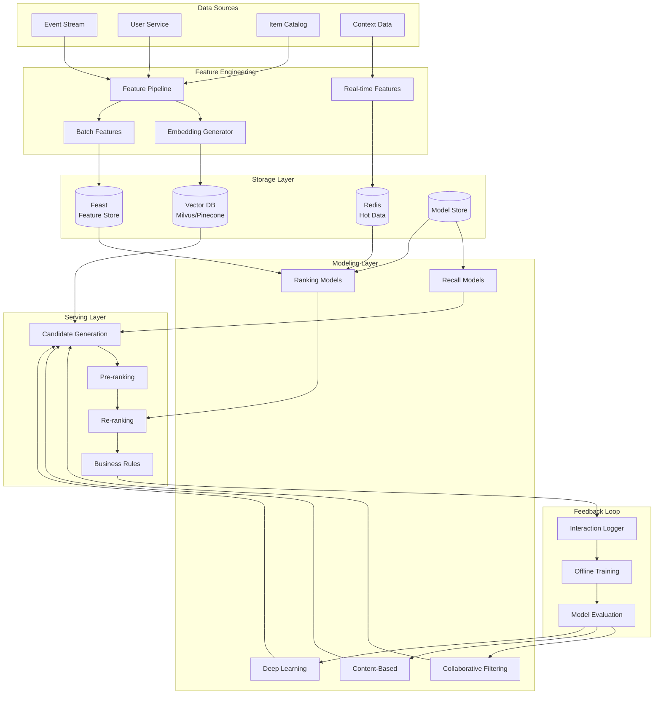
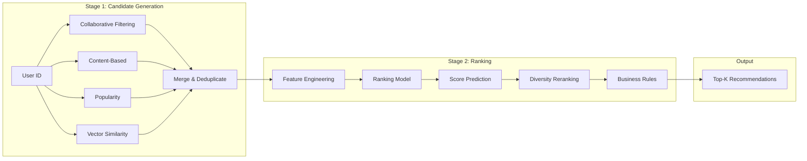
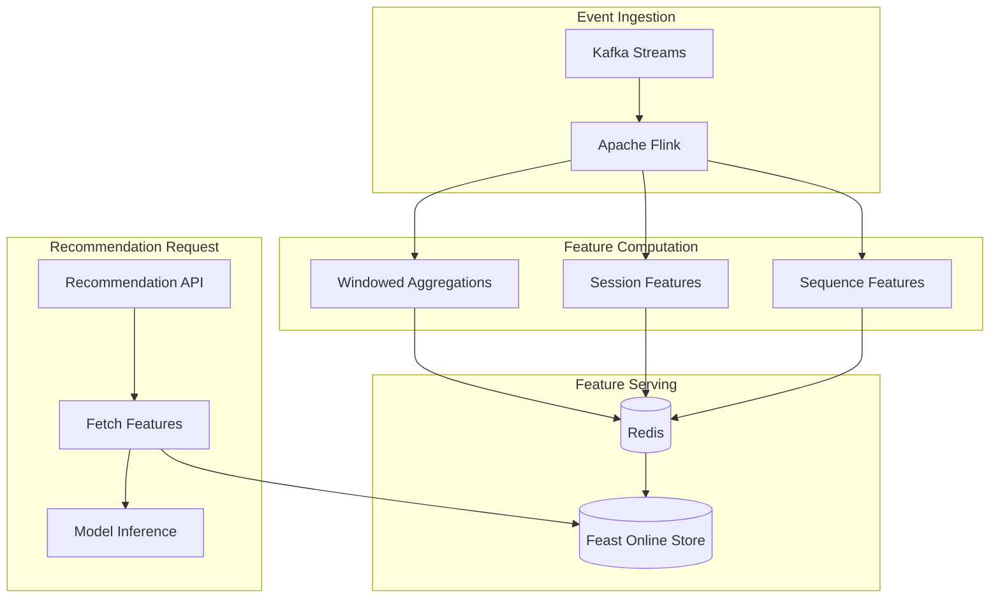

# AD-022: Recommendation System Design

## Overview

Recommendation systems power personalized content discovery across e-commerce, streaming media, social networks, and digital platforms. These systems must process massive user interaction data, build comprehensive user profiles, and generate relevant recommendations in milliseconds while handling cold-start problems and maintaining diversity in suggestions.

## 1. Domain-Specific Requirements Analysis

### 1.1 Core Functional Requirements

#### User Profiling

- **Behavioral Tracking**: Click, view, purchase, rating interactions
- **Implicit Feedback**: Dwell time, scroll patterns, skip behavior
- **Explicit Feedback**: Ratings, reviews, likes, follows
- **Demographic Data**: Age, location, preferences (with privacy controls)
- **Real-time Updates**: Profile updates from recent interactions

#### Content Understanding

- **Item Attributes**: Category, tags, metadata extraction
- **Content Analysis**: Text, image, video feature extraction
- **Embedding Generation**: Vector representations of items
- **Freshness Scoring**: Recency and trending calculations
- **Quality Scoring**: Content quality and relevance metrics

#### Recommendation Generation

- **Collaborative Filtering**: User-user and item-item similarity
- **Content-Based Filtering**: Item attribute matching
- **Matrix Factorization**: Latent factor models
- **Deep Learning**: Neural collaborative filtering
- **Context-Aware**: Time, location, device context

#### Ranking and Personalization

- **Multi-objective Optimization**: Engagement, diversity, freshness
- **A/B Testing Framework**: Experimentation infrastructure
- **Business Rules**: Filtering, boosting, and pinning
- **Diversity Control**: Avoid filter bubbles
- **Serendipity**: Novel and unexpected recommendations

### 1.2 Non-Functional Requirements

#### Performance Requirements

| Metric | Target | Criticality |
|--------|--------|-------------|
| Recommendation Latency | < 100ms (p99) | Critical |
| Model Training | < 4 hours | High |
| Feature Computation | < 50ms | High |
| Serving QPS | > 50,000 | Critical |
| Freshness | < 5 minutes | Medium |
| System Availability | 99.99% | Critical |

#### Scale Requirements

- Users: 100 million+
- Items: 10 million+
- Daily interactions: 1 billion+
- Feature store: 10+ TB

## 2. Architecture Formalization

### 2.1 System Architecture Overview



### 2.2 Two-Stage Architecture



### 2.3 Real-time Feature Pipeline



## 3. Scalability and Performance Considerations

### 3.1 Approximate Nearest Neighbor Search

```go
package ann

import (
    "container/heap"
    "math"
    "sync"
)

// HNSWIndex implements Hierarchical Navigable Small World graph
type HNSWIndex struct {
    vectors      [][]float32
    levels       [][]*HNSWNode
    maxLevel     int
    M            int
    efConstruction int
    entryPoint   *HNSWNode
    mu           sync.RWMutex
}

type HNSWNode struct {
    ID       int
    Vector   []float32
    Level    int
    Neighbors [][]*HNSWNode
}

type Item struct {
    Node     *HNSWNode
    Distance float32
}

type PriorityQueue []Item

func (pq PriorityQueue) Len() int { return len(pq) }
func (pq PriorityQueue) Less(i, j int) bool { return pq[i].Distance < pq[j].Distance }
func (pq PriorityQueue) Swap(i, j int) { pq[i], pq[j] = pq[j], pq[i] }
func (pq *PriorityQueue) Push(x interface{}) { *pq = append(*pq, x.(Item)) }
func (pq *PriorityQueue) Pop() interface{} {
    old := *pq
    n := len(old)
    item := old[n-1]
    *pq = old[0 : n-1]
    return item
}

// Insert adds a vector to the index
func (idx *HNSWIndex) Insert(id int, vector []float32) {
    idx.mu.Lock()
    defer idx.mu.Unlock()

    node := &HNSWNode{
        ID:       id,
        Vector:   vector,
        Level:    idx.randomLevel(),
        Neighbors: make([][]*HNSWNode, idx.maxLevel+1),
    }

    // Insert at each level
    for level := idx.maxLevel; level >= 0; level-- {
        if level > node.Level {
            continue
        }

        // Search for nearest neighbors at this level
        neighbors := idx.searchLevel(vector, idx.entryPoint, level, idx.M)
        node.Neighbors[level] = neighbors

        // Update bidirectional connections
        for _, neighbor := range neighbors {
            if neighbor.Level >= level {
                neighbor.Neighbors[level] = idx.connectBidirectional(neighbor, node, level)
            }
        }
    }

    // Update entry point if necessary
    if idx.entryPoint == nil || node.Level > idx.entryPoint.Level {
        idx.entryPoint = node
    }

    idx.vectors = append(idx.vectors, vector)
}

// Search finds k nearest neighbors
func (idx *HNSWIndex) Search(query []float32, k int) ([]int, []float32) {
    idx.mu.RLock()
    defer idx.mu.RUnlock()

    if idx.entryPoint == nil {
        return nil, nil
    }

    // Search from top level to level 1
    current := idx.entryPoint
    for level := idx.maxLevel; level > 0; level-- {
        if current.Level >= level {
            candidates := idx.searchLevel(query, current, level, 1)
            if len(candidates) > 0 {
                current = candidates[0]
            }
        }
    }

    // Search at level 0 with larger ef
    candidates := idx.searchLevel(query, current, 0, k*2)

    // Return top k
    var ids []int
    var distances []float32

    for i := 0; i < min(k, len(candidates)); i++ {
        ids = append(ids, candidates[i].ID)
        distances = append(distances, idx.distance(query, candidates[i].Vector))
    }

    return ids, distances
}

func (idx *HNSWIndex) searchLevel(query []float32, entry *HNSWNode, level, ef int) []*HNSWNode {
    visited := make(map[int]bool)
    candidates := &PriorityQueue{}
    heap.Init(candidates)

    results := &PriorityQueue{}
    heap.Init(results)

    dist := idx.distance(query, entry.Vector)
    heap.Push(candidates, Item{entry, dist})
    heap.Push(results, Item{entry, dist})
    visited[entry.ID] = true

    for candidates.Len() > 0 {
        current := heap.Pop(candidates).(Item)

        // Early termination
        if results.Len() >= ef {
            worstResult := (*results)[results.Len()-1]
            if current.Distance > worstResult.Distance {
                break
            }
        }

        // Explore neighbors
        for _, neighbor := range current.Node.Neighbors[level] {
            if visited[neighbor.ID] {
                continue
            }
            visited[neighbor.ID] = true

            dist = idx.distance(query, neighbor.Vector)

            if results.Len() < ef {
                heap.Push(results, Item{neighbor, dist})
                heap.Push(candidates, Item{neighbor, dist})
            } else if dist < (*results)[results.Len()-1].Distance {
                heap.Pop(results)
                heap.Push(results, Item{neighbor, dist})
                heap.Push(candidates, Item{neighbor, dist})
            }
        }
    }

    // Extract results
    var nodes []*HNSWNode
    for results.Len() > 0 {
        item := heap.Pop(results).(Item)
        nodes = append([]*HNSWNode{item.Node}, nodes...)
    }

    return nodes
}

func (idx *HNSWIndex) distance(a, b []float32) float32 {
    var sum float32
    for i := range a {
        diff := a[i] - b[i]
        sum += diff * diff
    }
    return float32(math.Sqrt(float64(sum)))
}

func (idx *HNSWIndex) randomLevel() int {
    level := 0
    for rand.Float64() < 0.5 && level < idx.maxLevel {
        level++
    }
    return level
}

func (idx *HNSWIndex) connectBidirectional(a, b *HNSWNode, level int) []*HNSWNode {
    neighbors := append(a.Neighbors[level], b)

    // Keep only M closest neighbors
    if len(neighbors) > idx.M {
        // Sort by distance to a
        sort.Slice(neighbors, func(i, j int) bool {
            di := idx.distance(a.Vector, neighbors[i].Vector)
            dj := idx.distance(a.Vector, neighbors[j].Vector)
            return di < dj
        })
        neighbors = neighbors[:idx.M]
    }

    return neighbors
}
```

### 3.2 Feature Store

```go
package feature

import (
    "context"
    "fmt"
    "time"

    "github.com/feast-dev/feast/sdk/go"
    "github.com/redis/go-redis/v9"
)

// FeatureStore manages feature serving
type FeatureStore struct {
    client      *feast.Client
    redis       *redis.Client
    entityTTL   time.Duration
}

// FeatureVector represents features for an entity
type FeatureVector struct {
    EntityID   string
    Timestamp  time.Time
    Features   map[string]interface{}
}

// GetOnlineFeatures retrieves real-time features
func (fs *FeatureStore) GetOnlineFeatures(ctx context.Context, entityIDs []string, featureNames []string) ([]*FeatureVector, error) {
    // Try cache first
    cached := fs.getFromCache(ctx, entityIDs, featureNames)

    // Find missing features
    missingEntities := fs.findMissing(cached, entityIDs)

    if len(missingEntities) > 0 {
        // Fetch from Feast
        features, err := fs.client.GetOnlineFeatures(ctx, &feast.GetOnlineFeaturesRequest{
            FeatureRefs: featureNames,
            Entities:    fs.buildEntityRows(missingEntities),
        })
        if err != nil {
            return nil, err
        }

        // Cache results
        fs.cacheFeatures(ctx, features)

        // Merge with cached
        cached = append(cached, features...)
    }

    return cached, nil
}

func (fs *FeatureStore) getFromCache(ctx context.Context, entityIDs []string, featureNames []string) []*FeatureVector {
    var results []*FeatureVector

    pipe := fs.redis.Pipeline()

    keys := make([]*redis.StringCmd, len(entityIDs))
    for i, id := range entityIDs {
        key := fmt.Sprintf("features:%s", id)
        keys[i] = pipe.Get(ctx, key)
    }

    pipe.Exec(ctx)

    for i, cmd := range keys {
        data, err := cmd.Result()
        if err != nil {
            continue
        }

        var vector FeatureVector
        if err := json.Unmarshal([]byte(data), &vector); err != nil {
            continue
        }

        // Filter requested features
        filtered := make(map[string]interface{})
        for _, name := range featureNames {
            if val, ok := vector.Features[name]; ok {
                filtered[name] = val
            }
        }
        vector.Features = filtered
        vector.EntityID = entityIDs[i]

        results = append(results, &vector)
    }

    return results
}

func (fs *FeatureStore) cacheFeatures(ctx context.Context, vectors []*FeatureVector) {
    pipe := fs.redis.Pipeline()

    for _, vector := range vectors {
        key := fmt.Sprintf("features:%s", vector.EntityID)
        data, _ := json.Marshal(vector)
        pipe.Set(ctx, key, data, fs.entityTTL)
    }

    pipe.Exec(ctx)
}

// MaterializeFeatures triggers offline to online materialization
func (fs *FeatureStore) MaterializeFeatures(ctx context.Context, start, end time.Time, featureViews []string) error {
    for _, view := range featureViews {
        job, err := fs.client.CreateMaterializationJob(ctx, &feast.MaterializationJob{
            FeatureView: view,
            StartDate:   start,
            EndDate:     end,
        })
        if err != nil {
            return fmt.Errorf("materialize %s: %w", view, err)
        }

        // Wait for completion
        if err := job.Wait(ctx); err != nil {
            return err
        }
    }

    return nil
}
```

### 3.3 Model Serving

```go
package serving

import (
    "context"
    "fmt"
    "sync"

    "github.com/gin-gonic/gin"
    "go.uber.org/zap"

    tf "github.com/tensorflow/tensorflow/tensorflow/go"
)

// ServingService serves recommendation models
type ServingService struct {
    models      map[string]*Model
    featureStore *feature.FeatureStore
    logger      *zap.Logger
    mu          sync.RWMutex
}

type Model struct {
    Name        string
    Version     string
    Session     *tf.Session
    Graph       *tf.Graph
    InputOps    map[string]*tf.Operation
    OutputOps   map[string]*tf.Operation
}

// Recommend generates recommendations for a user
func (s *ServingService) Recommend(ctx context.Context, req *RecommendRequest) (*RecommendResponse, error) {
    start := time.Now()

    // Fetch user features
    userFeatures, err := s.featureStore.GetOnlineFeatures(ctx, []string{req.UserID}, req.FeatureNames)
    if err != nil {
        s.logger.Error("failed to fetch user features", zap.Error(err))
        return nil, err
    }

    // Candidate generation
    candidates, err := s.generateCandidates(ctx, req.UserID, req.NumCandidates)
    if err != nil {
        s.logger.Error("candidate generation failed", zap.Error(err))
        return nil, err
    }

    // Fetch item features
    itemIDs := make([]string, len(candidates))
    for i, c := range candidates {
        itemIDs[i] = c.ItemID
    }

    itemFeatures, err := s.featureStore.GetOnlineFeatures(ctx, itemIDs, req.ItemFeatureNames)
    if err != nil {
        s.logger.Error("failed to fetch item features", zap.Error(err))
        return nil, err
    }

    // Score candidates
    scores, err := s.scoreCandidates(ctx, userFeatures[0], itemFeatures, req.ModelName)
    if err != nil {
        s.logger.Error("scoring failed", zap.Error(err))
        return nil, err
    }

    // Rank by score
    ranked := s.rankCandidates(candidates, scores)

    // Apply diversity reranking
    diversified := s.diversify(ranked, req.NumResults)

    // Apply business rules
    final := s.applyBusinessRules(diversified, req)

    s.logger.Info("recommendation generated",
        zap.String("user_id", req.UserID),
        zap.Int("candidates", len(candidates)),
        zap.Int("results", len(final)),
        zap.Duration("latency", time.Since(start)),
    )

    return &RecommendResponse{
        UserID:    req.UserID,
        Items:     final,
        LatencyMs: time.Since(start).Milliseconds(),
    }, nil
}

func (s *ServingService) scoreCandidates(ctx context.Context, userFeatures *feature.FeatureVector, itemFeatures []*feature.FeatureVector, modelName string) ([]float32, error) {
    s.mu.RLock()
    model := s.models[modelName]
    s.mu.RUnlock()

    if model == nil {
        return nil, fmt.Errorf("model not found: %s", modelName)
    }

    // Build input tensors
    userTensor, err := s.buildUserTensor(userFeatures)
    if err != nil {
        return nil, err
    }

    itemTensor, err := s.buildItemTensor(itemFeatures)
    if err != nil {
        return nil, err
    }

    // Run inference
    outputs, err := model.Session.Run(
        map[tf.Output]*tf.Tensor{
            model.InputOps["user"].Output(0): userTensor,
            model.InputOps["item"].Output(0): itemTensor,
        },
        []tf.Output{
            model.OutputOps["score"].Output(0),
        },
        nil,
    )
    if err != nil {
        return nil, err
    }

    // Extract scores
    scores := outputs[0].Value().([][]float32)
    result := make([]float32, len(scores))
    for i, s := range scores {
        result[i] = s[0]
    }

    return result, nil
}

func (s *ServingService) diversify(candidates []*Candidate, n int) []*Candidate {
    if len(candidates) <= n {
        return candidates
    }

    selected := make([]*Candidate, 0, n)
    categories := make(map[string]int)

    for _, c := range candidates {
        // Max 2 items per category for diversity
        if categories[c.Category] < 2 {
            selected = append(selected, c)
            categories[c.Category]++

            if len(selected) >= n {
                break
            }
        }
    }

    // Fill remaining slots
    for _, c := range candidates {
        if !contains(selected, c) {
            selected = append(selected, c)
            if len(selected) >= n {
                break
            }
        }
    }

    return selected
}

func (s *ServingService) applyBusinessRules(items []*Candidate, req *RecommendRequest) []*Candidate {
    result := make([]*Candidate, 0, len(items))

    for _, item := range items {
        // Apply filters
        if req.MinPrice > 0 && item.Price < req.MinPrice {
            continue
        }
        if req.MaxPrice > 0 && item.Price > req.MaxPrice {
            continue
        }
        if len(req.ExcludedCategories) > 0 && contains(req.ExcludedCategories, item.Category) {
            continue
        }

        // Apply boosts
        if contains(req.PromotedItems, item.ItemID) {
            item.Score *= 1.5
        }

        result = append(result, item)
    }

    // Re-sort after boosting
    sort.Slice(result, func(i, j int) bool {
        return result[i].Score > result[j].Score
    })

    return result
}
```

## 4. Technology Stack Recommendations

### 4.1 Core Technologies

| Layer | Technology | Purpose |
|-------|-----------|---------|
| Language | Go 1.21+ | High-performance services |
| Feature Store | Feast/Tecton | Feature management |
| Vector DB | Milvus/Pinecone | ANN search |
| ML Platform | TensorFlow/PyTorch | Model training |
| Model Serving | Triton/TF Serving | Model inference |
| Cache | Redis Cluster | Feature caching |
| Message Queue | Kafka | Event streaming |
| Data Lake | Delta Lake/Iceberg | Feature storage |

### 4.2 Go Libraries

```go
// Core dependencies
go get github.com/feast-dev/feast/sdk/go
go get github.com/milvus-io/milvus-sdk-go/v2
go get github.com/tensorflow/tensorflow/tensorflow/go
go get github.com/redis/go-redis/v9
go get github.com/IBM/sarama
go get github.com/gin-gonic/gin
go get go.uber.org/zap
```

## 5. Industry Case Studies

### 5.1 Case Study: Netflix Recommendation

**Architecture**:

- Two-stage ranking (candidate generation + ranking)
- Contextual bandits for exploration
- Page-level optimization
- A/B testing at scale

**Scale**:

- 200M+ subscribers
- 80% of watched content from recommendations
- < 100ms latency

**Key Innovations**:

1. Multi-armed bandit algorithms
2. Sequential recommendation optimization
3. Deep learning models (NCF, Transformers)

### 5.2 Case Study: YouTube Recommendation

**Architecture**:

- Deep neural networks for ranking
- Candidate generation from multiple sources
- Watch time optimization
- Multi-objective optimization

**Scale**:

- 2 billion+ users
- 1 billion+ hours watched daily
- < 50ms serving latency

### 5.3 Case Study: Amazon Product Recommendation

**Architecture**:

- Item-item collaborative filtering
- Session-based recommendations
- Real-time personalization
- Multi-objective ranking

**Results**:

- 35% of revenue from recommendations
- Diverse recommendation types
- Cross-category suggestions

## 6. Go Implementation Examples

### 6.1 Collaborative Filtering

```go
package cf

import (
    "math"
    "sync"
)

// ItemCF implements item-based collaborative filtering
type ItemCF struct {
    itemFactors  map[string][]float32
    itemNorms    map[string]float32
    mu           sync.RWMutex
}

// Fit trains the model
func (cf *ItemCF) Fit(interactions []*Interaction, factors int, epochs int, lr float32) {
    // Initialize item factors
    cf.itemFactors = make(map[string][]float32)

    for _, inter := range interactions {
        if cf.itemFactors[inter.ItemID] == nil {
            cf.itemFactors[inter.ItemID] = randomVector(factors)
        }
    }

    // ALS optimization
    for epoch := 0; epoch < epochs; epoch++ {
        for _, inter := range interactions {
            cf.updateFactors(inter, lr)
        }
    }

    // Precompute norms
    cf.computeNorms()
}

func (cf *ItemCF) updateFactors(inter *Interaction, lr float32) {
    itemVec := cf.itemFactors[inter.ItemID]

    // Compute prediction
    pred := float32(0)
    for i := range itemVec {
        pred += itemVec[i] * itemVec[i]
    }

    // Error
    err := inter.Rating - pred

    // Gradient update
    for i := range itemVec {
        itemVec[i] += lr * err * itemVec[i]
    }
}

func (cf *ItemCF) computeNorms() {
    cf.itemNorms = make(map[string]float32)

    for itemID, factors := range cf.itemFactors {
        norm := float32(0)
        for _, v := range factors {
            norm += v * v
        }
        cf.itemNorms[itemID] = float32(math.Sqrt(float64(norm)))
    }
}

// SimilarItems finds items similar to the given item
func (cf *ItemCF) SimilarItems(itemID string, n int) ([]*ItemScore, error) {
    cf.mu.RLock()
    defer cf.mu.RUnlock()

    targetVec := cf.itemFactors[itemID]
    if targetVec == nil {
        return nil, fmt.Errorf("item not found: %s", itemID)
    }

    targetNorm := cf.itemNorms[itemID]

    // Compute similarity with all items
    scores := make([]*ItemScore, 0)

    for otherID, otherVec := range cf.itemFactors {
        if otherID == itemID {
            continue
        }

        // Cosine similarity
        dot := float32(0)
        for i := range targetVec {
            dot += targetVec[i] * otherVec[i]
        }

        similarity := dot / (targetNorm * cf.itemNorms[otherID])

        scores = append(scores, &ItemScore{
            ItemID:     otherID,
            Score:      similarity,
        })
    }

    // Sort by score
    sort.Slice(scores, func(i, j int) bool {
        return scores[i].Score > scores[j].Score
    })

    // Return top n
    if len(scores) > n {
        scores = scores[:n]
    }

    return scores, nil
}

// Recommend recommends items for a user
func (cf *ItemCF) Recommend(userHistory []string, n int) ([]*ItemScore, error) {
    // Aggregate similar items
    scores := make(map[string]float32)

    for _, itemID := range userHistory {
        similar, err := cf.SimilarItems(itemID, 50)
        if err != nil {
            continue
        }

        for _, sim := range similar {
            scores[sim.ItemID] += sim.Score
        }
    }

    // Convert to slice
    var result []*ItemScore
    for itemID, score := range scores {
        result = append(result, &ItemScore{
            ItemID: itemID,
            Score:  score,
        })
    }

    // Sort
    sort.Slice(result, func(i, j int) bool {
        return result[i].Score > result[j].Score
    })

    // Return top n
    if len(result) > n {
        result = result[:n]
    }

    return result, nil
}
```

### 6.2 A/B Testing Framework

```go
package experiment

import (
    "context"
    "hash/fnv"
    "math/rand"
)

// ExperimentManager manages A/B tests
type ExperimentManager struct {
    experiments map[string]*Experiment
    assignments map[string]map[string]string // userID -> expID -> variant
}

type Experiment struct {
    ID          string
    Name        string
    Status      string // RUNNING, PAUSED, STOPPED
    Variants    []*Variant
    TrafficSplit map[string]float64
    StartTime   time.Time
    EndTime     time.Time
    Metrics     []string
}

type Variant struct {
    ID          string
    Name        string
    Config      map[string]interface{}
    Traffic     float64
}

// Assign assigns a user to an experiment variant
func (em *ExperimentManager) Assign(ctx context.Context, userID string, expID string) (*Variant, error) {
    exp := em.experiments[expID]
    if exp == nil {
        return nil, fmt.Errorf("experiment not found: %s", expID)
    }

    if exp.Status != "RUNNING" {
        return nil, fmt.Errorf("experiment not running")
    }

    // Check if already assigned
    if variantID, ok := em.assignments[userID][expID]; ok {
        for _, v := range exp.Variants {
            if v.ID == variantID {
                return v, nil
            }
        }
    }

    // Deterministic assignment based on user ID
    variant := em.deterministicAssign(userID, exp)

    // Store assignment
    if em.assignments[userID] == nil {
        em.assignments[userID] = make(map[string]string)
    }
    em.assignments[userID][expID] = variant.ID

    // Log assignment
    em.logAssignment(ctx, userID, exp, variant)

    return variant, nil
}

func (em *ExperimentManager) deterministicAssign(userID string, exp *Experiment) *Variant {
    // Hash user ID to deterministic value
    h := fnv.New64a()
    h.Write([]byte(userID))
    h.Write([]byte(exp.ID))
    hash := h.Sum64()

    // Map to variant based on traffic split
    threshold := float64(hash%1000) / 1000.0
    cumulative := 0.0

    for _, variant := range exp.Variants {
        cumulative += variant.Traffic
        if threshold < cumulative {
            return variant
        }
    }

    return exp.Variants[len(exp.Variants)-1]
}

// GetExperimentMetrics retrieves metrics for an experiment
func (em *ExperimentManager) GetExperimentMetrics(ctx context.Context, expID string) (*ExperimentMetrics, error) {
    // Query metrics store
    // Implementation...

    return &ExperimentMetrics{
        ExperimentID: expID,
        VariantMetrics: map[string]*VariantMetrics{
            "control": {
                Users:        10000,
                Conversions:  500,
                ConversionRate: 0.05,
            },
            "treatment": {
                Users:        10000,
                Conversions:  600,
                ConversionRate: 0.06,
            },
        },
    }, nil
}
```

## 7. Security and Compliance

### 7.1 Privacy-Preserving Recommendations

```go
package privacy

import (
    "crypto/sha256"
    "encoding/hex"
)

// PrivacyGuard implements privacy controls
type PrivacyGuard struct {
    salt       string
    minHistory int
}

// AnonymizeUser anonymizes user identifier
func (pg *PrivacyGuard) AnonymizeUser(userID string) string {
    h := sha256.New()
    h.Write([]byte(userID + pg.salt))
    return hex.EncodeToString(h.Sum(nil))[:16]
}

// FilterSensitiveItems removes sensitive content
func (pg *PrivacyGuard) FilterSensitiveItems(items []*Candidate, userAge int) []*Candidate {
    filtered := make([]*Candidate, 0, len(items))

    for _, item := range items {
        // Age-gated content
        if item.MinAge > 0 && userAge < item.MinAge {
            continue
        }

        // Content warnings
        if item.ContentWarning && userAge < 18 {
            continue
        }

        filtered = append(filtered, item)
    }

    return filtered
}

// DifferentialPrivacy adds noise to aggregated data
func (pg *PrivacyGuard) DifferentialPrivacy(value float64, epsilon float64) float64 {
    // Laplace mechanism
    scale := 1.0 / epsilon
    noise := pg.laplaceNoise(scale)
    return value + noise
}

func (pg *PrivacyGuard) laplaceNoise(scale float64) float64 {
    u := rand.Float64() - 0.5
    return -scale * math.Copysign(1, u) * math.Log(1-2*math.Abs(u))
}
```

## 8. Conclusion

Recommendation system design requires balancing multiple objectives: relevance, diversity, freshness, and business goals. Key takeaways:

1. **Two-stage architecture**: Efficient candidate generation followed by precise ranking
2. **Feature engineering is critical**: Rich features drive model performance
3. **Real-time matters**: Fresh features and models improve relevance
4. **Diversity matters**: Avoid filter bubbles with diversification
5. **Measure everything**: Comprehensive metrics and A/B testing
6. **Privacy first**: Build privacy controls into the system

The Go programming language is excellent for recommendation systems due to its performance characteristics and excellent support for concurrent data processing. By following the patterns outlined in this document, you can build recommendation systems that serve millions of users with personalized, relevant content.

---

*Document Version: 1.0*
*Last Updated: 2026-04-02*
*Classification: Technical Reference*
