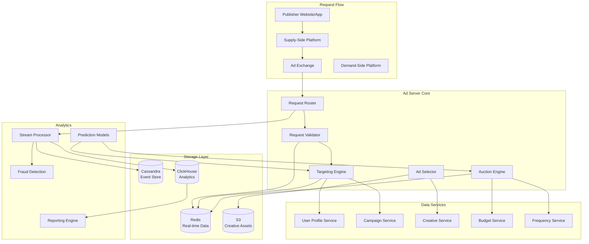
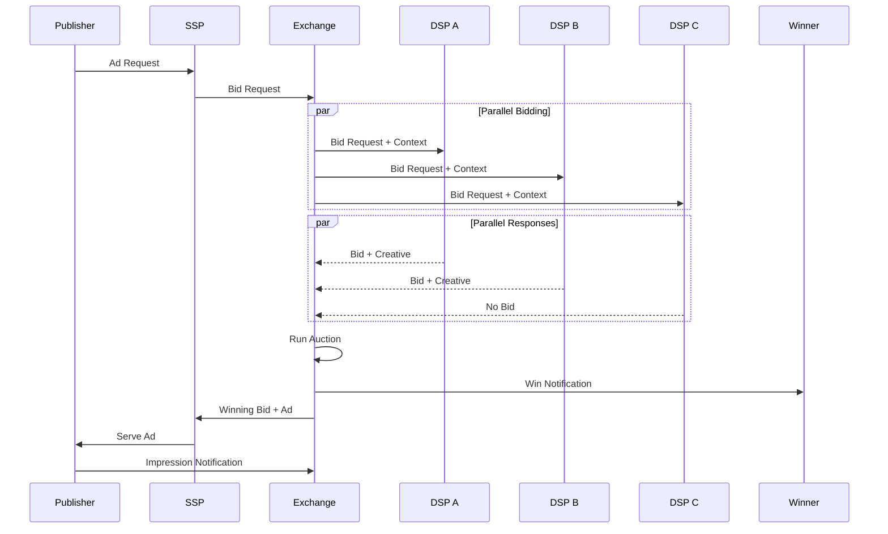
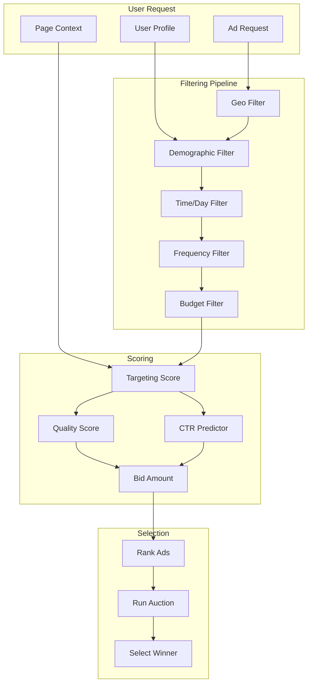

# AD-023: Ad Serving Platform Design

## Overview

Ad serving platforms are high-throughput, low-latency systems that match advertisements with user impressions in real-time. These systems must process billions of ad requests daily, perform complex targeting and bidding computations, and deliver ads within milliseconds while optimizing for advertiser ROI, publisher revenue, and user experience.

## 1. Domain-Specific Requirements Analysis

### 1.1 Core Functional Requirements

#### Ad Request Processing

- **Real-time Bidding (RTB)**: Sub-100ms auction completion
- **Ad Selection**: Targeted ad matching based on user profile
- **Frequency Capping**: Prevent ad fatigue per user/campaign
- **Budget Pacing**: Smooth spend across campaign duration
- **Creative Rendering**: Ad format adaptation and serving

#### Targeting and Segmentation

- **Demographic Targeting**: Age, gender, location
- **Behavioral Targeting**: Interest categories, browsing history
- **Contextual Targeting**: Content category, keywords
- **Retargeting**: Site visitors, cart abandoners
- **Lookalike Audiences**: Similar user expansion

#### Campaign Management

- **Flight Management**: Start/end dates, dayparting
- **Budget Controls**: Daily budgets, lifetime budgets
- **Bid Management**: CPC, CPM, CPA bidding
- **Creative Rotation**: A/B testing, performance optimization
- **Reporting**: Real-time campaign metrics

#### Auction Mechanics

- **Second-Price Auction**: Vickrey auction mechanism
- **Bid Ranking**: Quality score + bid combination
- **Reserve Prices**: Publisher minimum CPM requirements
- **Deal IDs**: Private marketplace transactions
- **Header Bidding**: Client-side auction pre-processing

### 1.2 Non-Functional Requirements

#### Performance Requirements

| Metric | Target | Criticality |
|--------|--------|-------------|
| Ad Decision Latency | < 50ms (p99) | Critical |
| Auction Completion | < 100ms | Critical |
| QPS | > 1 million | Critical |
| Data Ingestion | > 1 million events/sec | High |
| System Availability | 99.99% | Critical |
| Reporting Latency | < 5 minutes | Medium |

#### Business Requirements

- Fraud detection and prevention
- Brand safety controls
- Privacy compliance (GDPR, CCPA)
- Viewability measurement
- Attribution tracking

## 2. Architecture Formalization

### 2.1 System Architecture Overview



### 2.2 Real-Time Bidding Flow



### 2.3 Campaign Matching Architecture



## 3. Scalability and Performance Considerations

### 3.1 High-Throughput Ad Server

```go
package adserver

import (
    "context"
    "sync"
    "sync/atomic"
    "time"
)

// AdServer handles ad serving requests
type AdServer struct {
    targeting    *TargetingEngine
    auction      *AuctionEngine
    userService  *UserService
    cache        *CacheManager

    reqCounter   uint64
    latencies    *metrics.Histogram
}

// AdRequest represents an incoming ad request
type AdRequest struct {
    RequestID     string
    UserID        string
    DeviceType    string
    Geo           GeoInfo
    Context       PageContext
    AdSlot        SlotInfo
    Timestamp     time.Time
}

type GeoInfo struct {
    Country   string
    Region    string
    City      string
    Latitude  float64
    Longitude float64
}

type PageContext struct {
    URL         string
    Domain      string
    Category    []string
    Keywords    []string
    ContentType string
}

type SlotInfo struct {
    ID          string
    Size        string
    Position    string
    FloorPrice  float64
}

// ServeAd processes an ad request and returns an ad
func (s *AdServer) ServeAd(ctx context.Context, req *AdRequest) (*AdResponse, error) {
    start := time.Now()
    atomic.AddUint64(&s.reqCounter, 1)

    // Fetch user profile
    profile, err := s.userService.GetProfile(ctx, req.UserID)
    if err != nil {
        // Use anonymous profile
        profile = AnonymousProfile
    }

    // Find eligible campaigns
    candidates, err := s.targeting.FindCandidates(ctx, req, profile)
    if err != nil {
        return nil, err
    }

    // Filter by frequency caps
    candidates = s.applyFrequencyCaps(ctx, req.UserID, candidates)

    // Check budgets
    candidates = s.checkBudgets(ctx, candidates)

    if len(candidates) == 0 {
        return &AdResponse{
            RequestID: req.RequestID,
            Status:    "NO_FILL",
        }, nil
    }

    // Score candidates
    scored := s.scoreCandidates(candidates, req, profile)

    // Run auction
    winner := s.auction.Run(scored, req.Slot.FloorPrice)

    if winner == nil {
        return &AdResponse{
            RequestID: req.RequestID,
            Status:    "NO_BID",
        }, nil
    }

    // Record impression
    s.recordImpression(ctx, req, winner)

    latency := time.Since(start)
    s.latencies.Observe(latency.Seconds())

    return &AdResponse{
        RequestID:   req.RequestID,
        Status:      "SUCCESS",
        Ad:          winner.Ad,
        CreativeURL: winner.CreativeURL,
        Price:       winner.Price,
        LatencyMs:   latency.Milliseconds(),
    }, nil
}

func (s *AdServer) applyFrequencyCaps(ctx context.Context, userID string, campaigns []*Campaign) []*Campaign {
    // Check Redis for frequency data
    key := fmt.Sprintf("freq:%s", userID)

    counts, err := s.cache.HGetAll(ctx, key)
    if err != nil {
        return campaigns
    }

    filtered := make([]*Campaign, 0, len(campaigns))

    for _, camp := range campaigns {
        count, _ := strconv.Atoi(counts[camp.ID])

        // Check daily cap
        if camp.FrequencyCap.Daily > 0 && count >= camp.FrequencyCap.Daily {
            continue
        }

        filtered = append(filtered, camp)
    }

    return filtered
}

func (s *AdServer) checkBudgets(ctx context.Context, campaigns []*Campaign) []*Campaign {
    // Check campaign budgets in parallel
    var wg sync.WaitGroup
    results := make(chan *Campaign, len(campaigns))

    semaphore := make(chan struct{}, 50)

    for _, camp := range campaigns {
        wg.Add(1)
        semaphore <- struct{}{}

        go func(c *Campaign) {
            defer wg.Done()
            defer func() { <-semaphore }()

            // Check daily budget
            spent := s.budgetService.GetDailySpend(ctx, c.ID)
            if spent >= c.Budget.Daily {
                return
            }

            // Check lifetime budget
            if c.Budget.Lifetime > 0 && spent >= c.Budget.Lifetime {
                return
            }

            results <- c
        }(camp)
    }

    go func() {
        wg.Wait()
        close(results)
    }()

    var filtered []*Campaign
    for camp := range results {
        filtered = append(filtered, camp)
    }

    return filtered
}

func (s *AdServer) scoreCandidates(campaigns []*Campaign, req *AdRequest, profile *UserProfile) []*ScoredCampaign {
    scored := make([]*ScoredCampaign, len(campaigns))

    for i, camp := range campaigns {
        score := 0.0

        // Targeting match score
        score += s.calculateTargetingScore(camp, req, profile)

        // Predicted CTR
        ctr := s.predictCTR(camp, req, profile)
        score += ctr * 100

        // Bid amount
        score += camp.BidAmount * 10

        // Quality score
        score += camp.QualityScore * 5

        scored[i] = &ScoredCampaign{
            Campaign:  camp,
            Score:     score,
            PredictedCTR: ctr,
        }
    }

    // Sort by score
    sort.Slice(scored, func(i, j int) bool {
        return scored[i].Score > scored[j].Score
    })

    return scored
}

func (s *AdServer) recordImpression(ctx context.Context, req *AdRequest, winner *ScoredCampaign) {
    event := &ImpressionEvent{
        RequestID:   req.RequestID,
        UserID:      req.UserID,
        CampaignID:  winner.Campaign.ID,
        AdID:        winner.Campaign.AdID,
        Price:       winner.Price,
        Timestamp:   time.Now(),
        Geo:         req.Geo,
        Device:      req.DeviceType,
    }

    // Publish to Kafka
    s.eventProducer.Produce(ctx, "impressions", req.RequestID, event)

    // Update frequency counter
    freqKey := fmt.Sprintf("freq:%s", req.UserID)
    s.cache.HIncrBy(ctx, freqKey, winner.Campaign.ID, 1)
    s.cache.Expire(ctx, freqKey, 24*time.Hour)

    // Update budget
    s.budgetService.RecordSpend(ctx, winner.Campaign.ID, winner.Price)
}
```

### 3.2 Predictive Budget Pacing

```go
package pacing

import (
    "context"
    "math"
    "time"
)

// BudgetPacer controls campaign spend rate
type BudgetPacer struct {
    budgetService *BudgetService
    forecast      *ForecastService
}

// PacingStatus represents current pacing state
type PacingStatus struct {
    CampaignID      string
    DailyBudget     float64
    SpentToday      float64
    Remaining       float64
    PacingRate      float64 // 0-1, 1 = on pace, < 1 = behind, > 1 = ahead
    ShouldThrottle  bool
    CurrentCPM      float64
    ProjectedSpend  float64
}

// GetPacingStatus calculates current pacing status
func (p *BudgetPacer) GetPacingStatus(ctx context.Context, campaignID string) (*PacingStatus, error) {
    budget, err := p.budgetService.GetBudget(ctx, campaignID)
    if err != nil {
        return nil, err
    }

    spent, err := p.budgetService.GetDailySpend(ctx, campaignID)
    if err != nil {
        return nil, err
    }

    remaining := budget.Daily - spent

    // Calculate expected spend at this time
    now := time.Now()
    dayProgress := float64(now.Hour()*3600+now.Minute()*60+now.Second()) / 86400.0
    expectedSpend := budget.Daily * dayProgress

    // Pacing rate: 1.0 = on pace, < 1 = behind, > 1 = ahead
    var pacingRate float64
    if expectedSpend > 0 {
        pacingRate = spent / expectedSpend
    }

    // Get traffic forecast
    forecast := p.forecast.GetTrafficForecast(campaignID, now)

    // Project final spend
    hoursRemaining := 24 - float64(now.Hour()) - float64(now.Minute())/60
    avgSpendRate := spent / (dayProgress * 24)
    projectedSpend := spent + avgSpendRate*hoursRemaining

    // Determine if throttling needed
    shouldThrottle := pacingRate > 1.2 || projectedSpend > budget.Daily*1.1

    return &PacingStatus{
        CampaignID:     campaignID,
        DailyBudget:    budget.Daily,
        SpentToday:     spent,
        Remaining:      remaining,
        PacingRate:     pacingRate,
        ShouldThrottle: shouldThrottle,
        ProjectedSpend: projectedSpend,
        Forecast:       forecast,
    }, nil
}

// CalculateBidModifier returns a bid modifier based on pacing
func (p *BudgetPacer) CalculateBidModifier(status *PacingStatus) float64 {
    if !status.ShouldThrottle {
        // Ahead of pace, can bid more aggressively
        if status.PacingRate < 0.8 {
            return 1.2
        }
        return 1.0
    }

    // Behind pace, need to throttle
    if status.PacingRate > 2.0 {
        return 0.1 // Severe throttling
    } else if status.PacingRate > 1.5 {
        return 0.3
    } else if status.PacingRate > 1.2 {
        return 0.6
    }

    return 0.8
}
```

### 3.3 Fraud Detection

```go
package fraud

import (
    "context"
    "time"
)

// FraudDetector detects invalid traffic
type FraudDetector struct {
    rules      []FraudRule
    mlModel    *FraudMLModel
    history    *ClickHistoryStore
}

type FraudRule struct {
    Name        string
    Description string
    Score       float64
    Check       func(*AdEvent) bool
}

type FraudScore struct {
    Score       float64
    Flags       []string
    Confidence  float64
}

// Evaluate checks if traffic is fraudulent
func (fd *FraudDetector) Evaluate(ctx context.Context, event *AdEvent) (*FraudScore, error) {
    var score float64
    var flags []string

    // Apply rules
    for _, rule := range fd.rules {
        if rule.Check(event) {
            score += rule.Score
            flags = append(flags, rule.Name)
        }
    }

    // ML model score
    mlScore := fd.mlModel.Predict(event)
    score += mlScore * 50 // Weight ML score

    // Calculate confidence
    confidence := fd.calculateConfidence(event, score)

    return &FraudScore{
        Score:      score,
        Flags:      flags,
        Confidence: confidence,
    }, nil
}

// GetRules returns default fraud detection rules
func GetRules() []FraudRule {
    return []FraudRule{
        {
            Name:        "RAPID_CLICKS",
            Description: "Multiple clicks from same IP in short time",
            Score:       30,
            Check: func(e *AdEvent) bool {
                // Check if > 5 clicks from same IP in 1 minute
                return e.ClicksFromIP > 5 && e.TimeSinceLastClick < time.Minute
            },
        },
        {
            Name:        "SUSPICIOUS_USER_AGENT",
            Description: "Known bot user agent",
            Score:       50,
            Check: func(e *AdEvent) bool {
                bots := []string{"bot", "crawler", "spider", "scrape"}
                ua := strings.ToLower(e.UserAgent)
                for _, bot := range bots {
                    if strings.Contains(ua, bot) {
                        return true
                    }
                }
                return false
            },
        },
        {
            Name:        "GEO_MISMATCH",
            Description: "IP geo doesn't match declared geo",
            Score:       20,
            Check: func(e *AdEvent) bool {
                return e.IPGeo != e.DeclaredGeo
            },
        },
        {
            Name:        "NO_COOKIE",
            Description: "Request without cookie",
            Score:       10,
            Check: func(e *AdEvent) bool {
                return !e.HasCookie
            },
        },
        {
            Name:        "DATACENTER_IP",
            Description: "Traffic from known datacenter",
            Score:       40,
            Check: func(e *AdEvent) bool {
                return e.IsDatacenterIP
            },
        },
    }
}
```

## 4. Technology Stack Recommendations

### 4.1 Core Technologies

| Layer | Technology | Purpose |
|-------|-----------|---------|
| Language | Go 1.21+ | High-performance ad serving |
| Cache | Redis Cluster | User profiles, frequency |
| Time-Series | ClickHouse | Analytics and reporting |
| Message Queue | Apache Kafka | Event streaming |
| ML | TensorFlow | CTR prediction |
| Data Lake | S3/Delta Lake | Historical data |
| CDN | Fastly/CloudFlare | Creative delivery |

### 4.2 Go Libraries

```go
// Core dependencies
go get github.com/redis/go-redis/v9
go get github.com/IBM/sarama
go get github.com/ClickHouse/clickhouse-go/v2
go get github.com/tensorflow/tensorflow/tensorflow/go
go get github.com/gin-gonic/gin
go get github.com/prometheus/client_golang
```

## 5. Industry Case Studies

### 5.1 Case Study: Google Ad Manager

**Architecture**:

- Global edge deployment
- Real-time bidding integration
- Predictive pricing
- Brand safety controls

**Scale**:

- 30 billion+ impressions daily
- < 50ms ad decision
- 99.99% availability

### 5.2 Case Study: The Trade Desk

**Architecture**:

- Unified ID 2.0
- CTV/OTT focus
- First-party data integration
- Cross-device targeting

**Scale**:

- 1 trillion+ queries daily
- 900+ DSP integrations
- Global footprint

### 5.3 Case Study: Prebid.js

**Architecture**:

- Open-source header bidding
- Client-side auctions
- Multiple adapter support
- Analytics integration

**Adoption**:

- Used by 70%+ of top publishers
- Reduced latency significantly
- Increased publisher revenue

## 6. Go Implementation Examples

### 6.1 Auction Engine

```go
package auction

import (
    "context"
    "sort"
)

// AuctionEngine runs ad auctions
type AuctionEngine struct {
    qualityScorer *QualityScorer
}

// AuctionResult contains auction outcome
type AuctionResult struct {
    Winner     *Bid
    Price      float64 // Clearing price
    SecondBid  *Bid
    AllBids    []*Bid
}

// Run executes a second-price auction
func (ae *AuctionEngine) Run(bids []*Bid, floorPrice float64) *AuctionResult {
    if len(bids) == 0 {
        return nil
    }

    // Score bids
    scored := ae.scoreBids(bids)

    // Sort by score descending
    sort.Slice(scored, func(i, j int) bool {
        return scored[i].Score > scored[j].Score
    })

    // Filter below floor
    eligible := make([]*ScoredBid, 0)
    for _, bid := range scored {
        if bid.BidAmount >= floorPrice {
            eligible = append(eligible, bid)
        }
    }

    if len(eligible) == 0 {
        return nil
    }

    winner := eligible[0]

    // Calculate clearing price (second price + epsilon)
    var clearingPrice float64
    if len(eligible) >= 2 {
        clearingPrice = eligible[1].BidAmount + 0.01
    } else {
        clearingPrice = floorPrice
    }

    // Winner pays max(clearing price, reserve price)
    if clearingPrice < winner.ReservePrice {
        clearingPrice = winner.ReservePrice
    }

    return &AuctionResult{
        Winner:    winner.Bid,
        Price:     clearingPrice,
        SecondBid: eligible[1].Bid,
        AllBids:   bids,
    }
}

func (ae *AuctionEngine) scoreBids(bids []*Bid) []*ScoredBid {
    scored := make([]*ScoredBid, len(bids))

    for i, bid := range bids {
        // Quality score based on historical performance
        qualityScore := ae.qualityScorer.GetScore(bid.AdvertiserID, bid.CreativeID)

        // Rank score = bid * quality_score
        rankScore := bid.Amount * qualityScore

        scored[i] = &ScoredBid{
            Bid:          bid,
            Score:        rankScore,
            QualityScore: qualityScore,
        }
    }

    return scored
}
```

### 6.2 Targeting Engine

```go
package targeting

import (
    "context"
)

// TargetingEngine matches ads to users
type TargetingEngine struct {
    index      *TargetingIndex
    segmentDB  *SegmentDatabase
}

// TargetingIndex for fast lookups
type TargetingIndex struct {
    geoIndex     map[string][]string // country -> campaign IDs
    demoIndex    map[string][]string // demo_key -> campaign IDs
    contextIndex map[string][]string // category -> campaign IDs
}

// FindCandidates finds matching campaigns
func (te *TargetingEngine) FindCandidates(ctx context.Context, req *AdRequest, profile *UserProfile) ([]*Campaign, error) {
    // Collect potential campaigns from indexes
    candidateSet := make(map[string]bool)

    // Geo targeting
    if campaigns, ok := te.index.geoIndex[req.Geo.Country]; ok {
        for _, id := range campaigns {
            candidateSet[id] = true
        }
    }

    // Demographic targeting
    demoKey := fmt.Sprintf("%s_%s_%d", profile.Gender, req.DeviceType, profile.Age/10*10)
    if campaigns, ok := te.index.demoIndex[demoKey]; ok {
        for _, id := range campaigns {
            candidateSet[id] = true
        }
    }

    // Contextual targeting
    for _, category := range req.Context.Category {
        if campaigns, ok := te.index.contextIndex[category]; ok {
            for _, id := range campaigns {
                candidateSet[id] = true
            }
        }
    }

    // Fetch full campaigns
    var candidates []*Campaign
    for id := range candidateSet {
        camp, err := te.getCampaign(ctx, id)
        if err != nil {
            continue
        }

        // Detailed targeting check
        if te.matches(camp, req, profile) {
            candidates = append(candidates, camp)
        }
    }

    return candidates, nil
}

func (te *TargetingEngine) matches(camp *Campaign, req *AdRequest, profile *UserProfile) bool {
    // Check geo
    if len(camp.Targeting.Geo.Countries) > 0 {
        if !contains(camp.Targeting.Geo.Countries, req.Geo.Country) {
            return false
        }
    }

    // Check device
    if len(camp.Targeting.Devices) > 0 {
        if !contains(camp.Targeting.Devices, req.DeviceType) {
            return false
        }
    }

    // Check dayparting
    if !te.checkDayparting(camp.Targeting.Dayparting, time.Now()) {
        return false
    }

    // Check frequency
    // (Handled separately due to Redis lookup)

    return true
}

func (te *TargetingEngine) checkDayparting(dayparting *Dayparting, now time.Time) bool {
    if dayparting == nil {
        return true
    }

    weekday := now.Weekday().String()
    hour := now.Hour()

    schedule, ok := dayparting.Schedule[weekday]
    if !ok {
        return false
    }

    for _, slot := range schedule {
        if hour >= slot.Start && hour < slot.End {
            return true
        }
    }

    return false
}
```

## 7. Security and Compliance

### 7.1 Privacy Controls

```go
package privacy

import (
    "context"
    "crypto/sha256"
    "encoding/hex"
)

// PrivacyController enforces privacy policies
type PrivacyController struct {
    consentStore *ConsentStore
    gdprEnabled  bool
    ccpaEnabled  bool
}

// CheckConsent verifies user consent for data processing
func (pc *PrivacyController) CheckConsent(ctx context.Context, userID string, purpose string) (bool, error) {
    consent, err := pc.consentStore.Get(ctx, userID)
    if err != nil {
        return false, err
    }

    // Check if consent given for purpose
    for _, p := range consent.Purposes {
        if p == purpose {
            return true, nil
        }
    }

    return false, nil
}

// Anonymize anonymizes user identifier
func (pc *PrivacyController) Anonymize(userID string, salt string) string {
    h := sha256.New()
    h.Write([]byte(userID + salt))
    return hex.EncodeToString(h.Sum(nil))[:16]
}

// ApplyPrivacyRules applies privacy rules to ad request
func (pc *PrivacyController) ApplyPrivacyRules(req *AdRequest, profile *UserProfile) (*AdRequest, *UserProfile) {
    // GDPR: Check if user in EU
    if pc.gdprEnabled && pc.isEUCountry(req.Geo.Country) {
        // Check consent
        hasConsent, _ := pc.CheckConsent(context.Background(), req.UserID, "TARGETING")
        if !hasConsent {
            // Remove personal data
            profile.Interests = nil
            profile.Demographics = nil
            req.UserID = pc.Anonymize(req.UserID, "gdpr_salt")
        }
    }

    // CCPA: Check if user opted out
    if pc.ccpaEnabled && req.Geo.Country == "US" && req.Geo.Region == "CA" {
        if pc.isOptedOut(req.UserID) {
            profile.Interests = nil
        }
    }

    return req, profile
}
```

## 8. Conclusion

Ad serving platform design requires balancing advertiser goals, publisher revenue, and user experience at massive scale. Key takeaways:

1. **Latency is critical**: Sub-100ms response times are essential
2. **Real-time auctions**: Fair and efficient auction mechanisms
3. **Fraud prevention**: Comprehensive invalid traffic detection
4. **Privacy compliance**: GDPR, CCPA, and future regulations
5. **Machine learning**: CTR prediction and audience targeting
6. **Global scale**: Edge deployment for worldwide coverage

The Go programming language is ideal for ad serving due to its performance characteristics and excellent concurrency support. By following the patterns in this document, you can build ad platforms that handle billions of requests with low latency and high reliability.

---

*Document Version: 1.0*
*Last Updated: 2026-04-02*
*Classification: Technical Reference*
