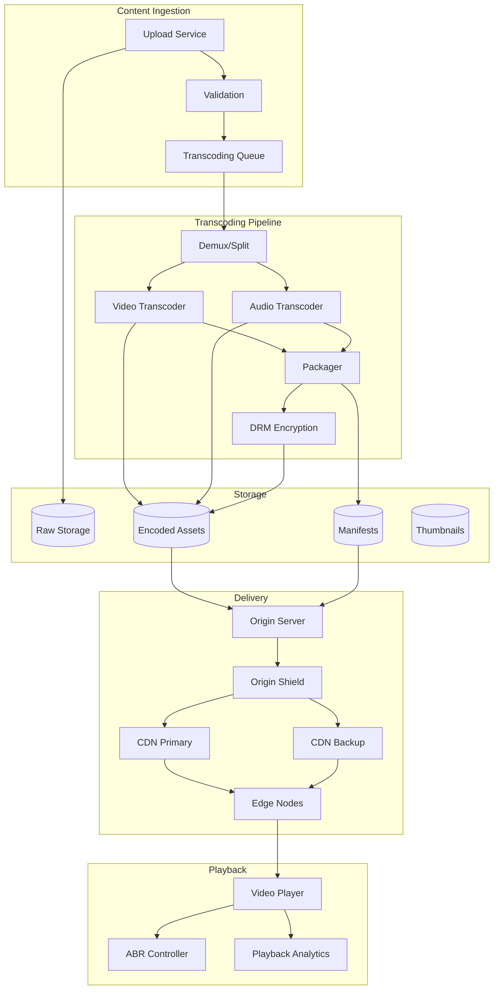
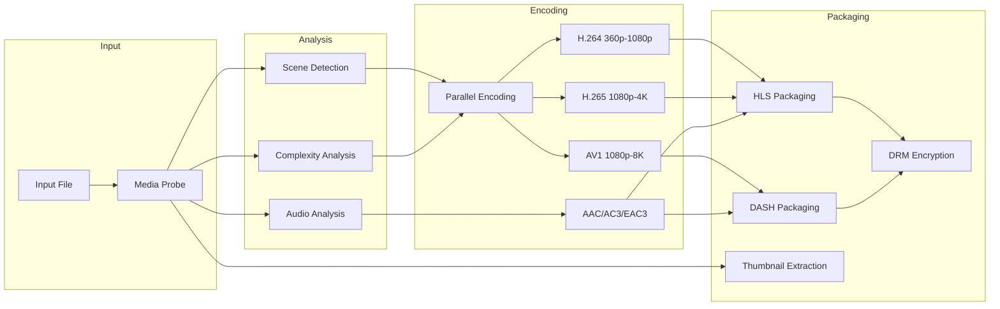
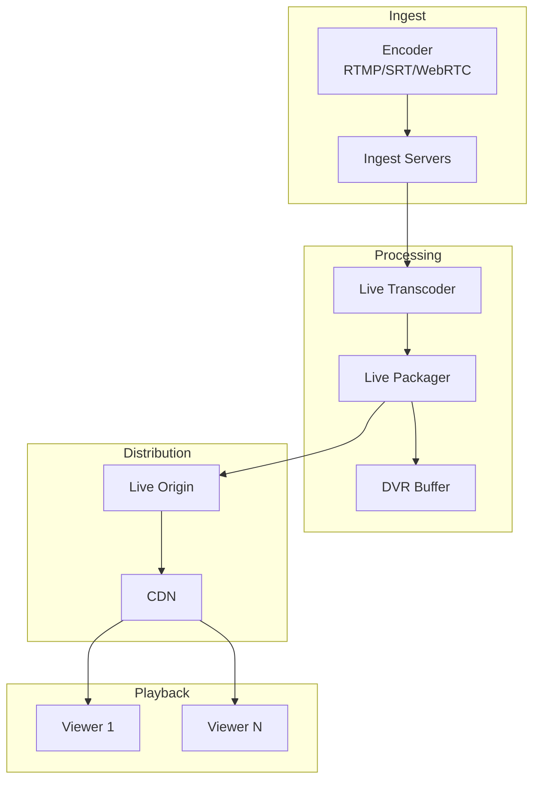

# AD-024: Video Streaming Platform Design

## Overview

Video streaming platforms deliver on-demand and live video content to millions of concurrent viewers across diverse devices and network conditions. These systems must handle massive storage requirements, adaptive bitrate streaming, content delivery at scale, and real-time analytics while ensuring high availability and low latency.

## 1. Domain-Specific Requirements Analysis

### 1.1 Core Functional Requirements

#### Content Ingestion

- **Video Upload**: Multi-part upload with resume capability
- **Format Support**: MP4, MOV, AVI, MKV, WebM input formats
- **Codec Transcoding**: H.264, H.265 (HEVC), VP9, AV1 output
- **Resolution Ladder**: 144p to 4K/8K encoding
- **Audio Processing**: Multiple audio tracks, subtitle extraction

#### Adaptive Streaming

- **ABR Algorithms**: HLS (HTTP Live Streaming), DASH (Dynamic Adaptive Streaming)
- **Bitrate Ladder**: Optimized encoding profiles
- **Segment Delivery**: 2-10 second segments
- **Manifest Generation**: M3U8 (HLS) and MPD (DASH) files
- **DRM Integration**: Widevine, FairPlay, PlayReady

#### Content Delivery

- **CDN Integration**: Multi-CDN strategy
- **Edge Caching**: Hot content at edge locations
- **Origin Shield**: Reduce origin load
- **Geographic Routing**: Optimal POP selection
- **Failover**: Automatic CDN switching

#### Live Streaming

- **Low Latency**: HLS Low-Latency, DASH-LL, WebRTC
- **RTMP Ingest**: Professional encoder support
- **SRT/WebRTC**: Contribution protocols
- **DVR Functionality**: Time-shifted viewing
- **Simulive**: Pre-recorded as live

### 1.2 Non-Functional Requirements

#### Performance Requirements

| Metric | Target | Criticality |
|--------|--------|-------------|
| Video Start Time | < 2 seconds | Critical |
| Rebuffer Ratio | < 0.5% | Critical |
| Bitrate Switch | < 200ms | High |
| Live Latency | < 5 seconds (LL) | High |
| Transcoding Time | < 2x video duration | Medium |
| System Availability | 99.99% | Critical |

#### Scale Requirements

- Concurrent viewers: 10 million+
- Video library: 100 million+ titles
- Daily uploads: 1 million+ hours
- Storage: 100+ PB
- CDN traffic: 10+ Tbps

## 2. Architecture Formalization

### 2.1 System Architecture Overview



### 2.2 Transcoding Pipeline



### 2.3 Live Streaming Architecture



## 3. Scalability and Performance Considerations

### 3.1 Distributed Transcoding

```go
package transcoding

import (
    "context"
    "fmt"
    "os/exec"
    "path/filepath"
    "time"
)

// Transcoder manages video transcoding jobs
type Transcoder struct {
    workerPool chan struct{}
    jobQueue   chan *TranscodeJob
    storage    StorageBackend
    metrics    *Metrics
}

type TranscodeJob struct {
    ID          string
    InputPath   string
    OutputPath  string
    Profile     *TranscodeProfile
    CallbackURL string
}

type TranscodeProfile struct {
    Name        string
    Resolution  string
    Bitrate     int
    Codec       string
    AudioCodec  string
    Container   string
}

// Submit submits a transcoding job
func (t *Transcoder) Submit(ctx context.Context, job *TranscodeJob) error {
    select {
    case t.jobQueue <- job:
        t.metrics.JobsSubmitted.Inc()
        return nil
    case <-ctx.Done():
        return ctx.Err()
    }
}

// Start starts the transcoding workers
func (t *Transcoder) Start(workers int) {
    for i := 0; i < workers; i++ {
        go t.worker()
    }
}

func (t *Transcoder) worker() {
    for job := range t.jobQueue {
        ctx, cancel := context.WithTimeout(context.Background(), 4*time.Hour)
        err := t.processJob(ctx, job)
        cancel()

        if err != nil {
            t.metrics.JobsFailed.Inc()
            t.notifyFailure(job, err)
        } else {
            t.metrics.JobsCompleted.Inc()
            t.notifySuccess(job)
        }
    }
}

func (t *Transcoder) processJob(ctx context.Context, job *TranscodeJob) error {
    start := time.Now()

    // Download input
    localInput := filepath.Join("/tmp", job.ID+"_input")
    if err := t.storage.Download(ctx, job.InputPath, localInput); err != nil {
        return fmt.Errorf("download input: %w", err)
    }
    defer os.Remove(localInput)

    // Probe input
    probe, err := t.probeMedia(localInput)
    if err != nil {
        return fmt.Errorf("probe media: %w", err)
    }

    // Build ffmpeg command
    localOutput := filepath.Join("/tmp", job.ID+"_output."+job.Profile.Container)
    cmd := t.buildFFmpegCommand(localInput, localOutput, job.Profile, probe)

    // Execute transcoding
    if err := t.runFFmpeg(ctx, cmd, job.ID); err != nil {
        return fmt.Errorf("transcode: %w", err)
    }
    defer os.Remove(localOutput)

    // Upload output
    if err := t.storage.Upload(ctx, localOutput, job.OutputPath); err != nil {
        return fmt.Errorf("upload output: %w", err)
    }

    t.metrics.TranscodingDuration.Observe(time.Since(start).Seconds())

    return nil
}

func (t *Transcoder) buildFFmpegCommand(input, output string, profile *TranscodeProfile, probe *MediaInfo) *exec.Cmd {
    args := []string{
        "-i", input,
        "-c:v", profile.Codec,
        "-b:v", fmt.Sprintf("%d", profile.Bitrate),
        "-s", profile.Resolution,
        "-c:a", profile.AudioCodec,
        "-b:a", "128k",
        "-movflags", "+faststart", // Web optimization
        "-pix_fmt", "yuv420p", // Compatibility
        "-preset", "medium", // Speed/quality balance
        "-crf", "23",
        "-y", // Overwrite output
        output,
    }

    return exec.Command("ffmpeg", args...)
}

func (t *Transcoder) runFFmpeg(ctx context.Context, cmd *exec.Cmd, jobID string) error {
    // Monitor progress
    pipe, _ := cmd.StderrPipe()

    if err := cmd.Start(); err != nil {
        return err
    }

    // Parse progress
    go t.parseProgress(pipe, jobID)

    return cmd.Wait()
}
```

### 3.2 Adaptive Bitrate Selection

```go
package player

import (
    "math"
    "time"
)

// ABRController manages adaptive bitrate selection
type ABRController struct {
    bufferLevel      float64 // seconds
    lastThroughput   float64 // bits per second
    currentBitrate   int
    availableLevels  []*BitrateLevel

    // Configuration
    bufferTarget     float64
    bufferMin        float64
    switchUpDelay    time.Duration

    // State
    throughputHistory []float64
    lastSwitchTime   time.Time
}

type BitrateLevel struct {
    Bitrate   int
    Width     int
    Height    int
    Codec     string
}

// SelectBitrate determines optimal bitrate for next segment
func (abr *ABRController) SelectBitrate() int {
    // Buffer-based approach
    if abr.bufferLevel < abr.bufferMin {
        // Emergency - switch to lowest
        return abr.availableLevels[0].Bitrate
    }

    if abr.bufferLevel > abr.bufferTarget*1.5 {
        // Buffer is healthy, can increase quality
        return abr.selectHigherBitrate()
    }

    if abr.bufferLevel < abr.bufferTarget*0.5 {
        // Buffer running low, reduce quality
        return abr.selectLowerBitrate()
    }

    // Throughput-based approach
    safeThroughput := abr.estimateSafeThroughput()

    // Find highest bitrate under safe throughput
    selected := abr.availableLevels[0].Bitrate
    for _, level := range abr.availableLevels {
        if float64(level.Bitrate)*1.2 < safeThroughput {
            selected = level.Bitrate
        }
    }

    // Respect switch up delay
    if selected > abr.currentBitrate &&
       time.Since(abr.lastSwitchTime) < abr.switchUpDelay {
        selected = abr.currentBitrate
    }

    return selected
}

func (abr *ABRController) selectHigherBitrate() int {
    // Find next higher bitrate level
    for i, level := range abr.availableLevels {
        if level.Bitrate == abr.currentBitrate && i < len(abr.availableLevels)-1 {
            return abr.availableLevels[i+1].Bitrate
        }
    }
    return abr.currentBitrate
}

func (abr *ABRController) selectLowerBitrate() int {
    // Find next lower bitrate level
    for i, level := range abr.availableLevels {
        if level.Bitrate == abr.currentBitrate && i > 0 {
            return abr.availableLevels[i-1].Bitrate
        }
    }
    return abr.currentBitrate
}

func (abr *ABRController) estimateSafeThroughput() float64 {
    if len(abr.throughputHistory) == 0 {
        return abr.lastThroughput
    }

    // Use harmonic mean for more conservative estimate
    var sumInverse float64
    for _, t := range abr.throughputHistory {
        sumInverse += 1.0 / t
    }
    harmonicMean := float64(len(abr.throughputHistory)) / sumInverse

    // Apply safety margin
    return harmonicMean * 0.8
}

// ReportSegmentDownload reports download statistics
func (abr *ABRController) ReportSegmentDownload(segmentSize int64, duration time.Duration) {
    throughput := float64(segmentSize*8) / duration.Seconds()
    abr.throughputHistory = append(abr.throughputHistory, throughput)

    // Keep last 5 measurements
    if len(abr.throughputHistory) > 5 {
        abr.throughputHistory = abr.throughputHistory[1:]
    }

    abr.lastThroughput = throughput
}

// ReportBufferLevel updates current buffer level
func (abr *ABRController) ReportBufferLevel(level float64) {
    abr.bufferLevel = level
}
```

### 3.3 Multi-CDN Load Balancing

```go
package cdn

import (
    "context"
    "sync"
    "time"
)

// CDNManager manages multiple CDN providers
type CDNManager struct {
    cdns       []*CDNProvider
    selector   SelectorStrategy
    healthChecker *HealthChecker

    mu         sync.RWMutex
}

type CDNProvider struct {
    Name        string
    BaseURL     string
    Priority    int
    Weight      int

    // Health metrics
    LastChecked time.Time
    Healthy     bool
    AvgLatency  time.Duration
    ErrorRate   float64
}

type SelectorStrategy interface {
    Select(cdns []*CDNProvider, userLocation GeoInfo) *CDNProvider
}

// GeoBasedSelector selects CDN based on user location
type GeoBasedSelector struct {
    cdnLocations map[string]GeoInfo
}

func (s *GeoBasedSelector) Select(cdns []*CDNProvider, user GeoInfo) *CDNProvider {
    var best *CDNProvider
    bestDistance := float64(1<<63 - 1)

    for _, cdn := range cdns {
        if !cdn.Healthy {
            continue
        }

        cdnLoc := s.cdnLocations[cdn.Name]
        distance := haversineDistance(user.Latitude, user.Longitude, cdnLoc.Latitude, cdnLoc.Longitude)

        if distance < bestDistance {
            bestDistance = distance
            best = cdn
        }
    }

    return best
}

// PerformanceBasedSelector selects based on performance metrics
type PerformanceBasedSelector struct{}

func (s *PerformanceBasedSelector) Select(cdns []*CDNProvider, user GeoInfo) *CDNProvider {
    var best *CDNProvider
    bestScore := float64(1<<63 - 1)

    for _, cdn := range cdns {
        if !cdn.Healthy {
            continue
        }

        // Score = latency * (1 + error_rate * 10)
        score := float64(cdn.AvgLatency) * (1 + cdn.ErrorRate*10)

        if score < bestScore {
            bestScore = score
            best = cdn
        }
    }

    return best
}

// GetStreamingURL returns the best CDN URL for content
func (cm *CDNManager) GetStreamingURL(ctx context.Context, contentID string, user Geo GeoInfo) (string, error) {
    cm.mu.RLock()
    defer cm.mu.RUnlock()

    // Select best CDN
    cdn := cm.selector.Select(cm.cdns, user)
    if cdn == nil {
        return "", fmt.Errorf("no healthy CDN available")
    }

    // Build URL
    url := fmt.Sprintf("%s/%s/manifest.m3u8", cdn.BaseURL, contentID)

    return url, nil
}

// HealthCheck performs health checks on all CDNs
func (cm *CDNManager) HealthCheck() {
    ticker := time.NewTicker(30 * time.Second)
    defer ticker.Stop()

    for range ticker.C {
        var wg sync.WaitGroup

        for _, cdn := range cm.cdns {
            wg.Add(1)
            go func(c *CDNProvider) {
                defer wg.Done()
                cm.checkCDN(c)
            }(cdn)
        }

        wg.Wait()
    }
}

func (cm *CDNManager) checkCDN(cdn *CDNProvider) {
    start := time.Now()

    // Make test request
    resp, err := http.Get(cdn.BaseURL + "/health")
    latency := time.Since(start)

    cm.mu.Lock()
    defer cm.mu.Unlock()

    cdn.LastChecked = time.Now()

    if err != nil || resp.StatusCode != 200 {
        cdn.Healthy = false
        cdn.ErrorRate = min(cdn.ErrorRate+0.1, 1.0)
    } else {
        cdn.Healthy = true
        cdn.AvgLatency = (cdn.AvgLatency + latency) / 2
        cdn.ErrorRate = max(cdn.ErrorRate-0.05, 0)
    }

    if resp != nil {
        resp.Body.Close()
    }
}

func haversineDistance(lat1, lon1, lat2, lon2 float64) float64 {
    const R = 6371 // Earth's radius in km

    lat1Rad := lat1 * math.Pi / 180
    lat2Rad := lat2 * math.Pi / 180
    deltaLat := (lat2 - lat1) * math.Pi / 180
    deltaLon := (lon2 - lon1) * math.Pi / 180

    a := math.Sin(deltaLat/2)*math.Sin(deltaLat/2) +
        math.Cos(lat1Rad)*math.Cos(lat2Rad)*
            math.Sin(deltaLon/2)*math.Sin(deltaLon/2)
    c := 2 * math.Atan2(math.Sqrt(a), math.Sqrt(1-a))

    return R * c
}
```

## 4. Technology Stack Recommendations

### 4.1 Core Technologies

| Layer | Technology | Purpose |
|-------|-----------|---------|
| Language | Go 1.21+ | High-performance services |
| Transcoding | FFmpeg | Video encoding |
| Streaming | HLS/DASH | ABR protocols |
| Storage | S3/MinIO | Object storage |
| CDN | CloudFront/Fastly | Content delivery |
| Database | PostgreSQL | Metadata |
| Cache | Redis | Session/state |
| Message Queue | Kafka | Event streaming |

### 4.2 Go Libraries

```go
// Core dependencies
go get github.com/aws/aws-sdk-go-v2
go get github.com/redis/go-redis/v9
go get github.com/IBM/sarama
go get github.com/pion/webrtc/v3
go get github.com/gin-gonic/gin
go get github.com/minio/minio-go/v7
```

## 5. Industry Case Studies

### 5.1 Case Study: Netflix Streaming

**Architecture**:

- Custom Open Connect CDN
- 17,000+ servers worldwide
- Predictive content placement
- Per-title encoding optimization

**Scale**:

- 260+ million subscribers
- 450 million+ devices
- 15% of global internet traffic

**Innovations**:

1. Per-title and per-scene encoding
2. Custom container formats
3. Chaos engineering
4. Global content distribution

### 5.2 Case Study: YouTube Infrastructure

**Architecture**:

- Google global infrastructure
- VP9 and AV1 adoption
- DASH and HLS delivery
- Live streaming support

**Scale**:

- 2+ billion users
- 1 billion+ hours watched daily
- 500+ hours uploaded per minute

### 5.3 Case Study: Twitch Live Streaming

**Architecture**:

- RTMP and WebRTC ingest
- Low-latency HLS
- Transcoding ladder
- Chat integration

**Scale**:

- 140+ million monthly users
- 2.5+ million concurrent viewers
- 30 million+ daily visitors

## 6. Go Implementation Examples

### 6.1 Video Packager

```go
package packaging

import (
    "fmt"
    "os"
    "path/filepath"
)

// Packager creates HLS/DASH manifests
type Packager struct {
    outputDir string
}

// CreateHLS creates HLS manifest and segments
func (p *Packager) CreateHLS(inputDir string, variants []*VideoVariant) error {
    // Create master playlist
    masterPlaylist := &HLSMasterPlaylist{
        Version: 4,
    }

    for _, variant := range variants {
        // Create variant playlist
        variantPlaylist := &HLSMediaPlaylist{
            TargetDuration: 6,
            Sequence:       0,
            Version:        4,
        }

        // Add segments
        segments := p.getSegments(inputDir, variant)
        for _, seg := range segments {
            variantPlaylist.Segments = append(variantPlaylist.Segments, &HLSSegment{
                Duration: seg.Duration,
                URI:      seg.Filename,
            })
        }

        // Write variant playlist
        variantPath := filepath.Join(p.outputDir, fmt.Sprintf("%s.m3u8", variant.Name))
        if err := p.writeMediaPlaylist(variantPath, variantPlaylist); err != nil {
            return err
        }

        // Add to master
        masterPlaylist.Variants = append(masterPlaylist.Variants, &HLSVariant{
            Bandwidth: variant.Bitrate,
            Resolution: fmt.Sprintf("%dx%d", variant.Width, variant.Height),
            Codecs:    variant.Codecs,
            URI:       fmt.Sprintf("%s.m3u8", variant.Name),
        })
    }

    // Write master playlist
    masterPath := filepath.Join(p.outputDir, "master.m3u8")
    return p.writeMasterPlaylist(masterPath, masterPlaylist)
}

func (p *Packager) writeMasterPlaylist(path string, playlist *HLSMasterPlaylist) error {
    f, err := os.Create(path)
    if err != nil {
        return err
    }
    defer f.Close()

    fmt.Fprintln(f, "#EXTM3U")
    fmt.Fprintln(f, "#EXT-X-VERSION:", playlist.Version)

    for _, variant := range playlist.Variants {
        fmt.Fprintf(f, "#EXT-X-STREAM-INF:BANDWIDTH=%d,RESOLUTION=%s,CODECS=\"%s\"\n",
            variant.Bandwidth, variant.Resolution, variant.Codecs)
        fmt.Fprintln(f, variant.URI)
    }

    return nil
}

func (p *Packager) writeMediaPlaylist(path string, playlist *HLSMediaPlaylist) error {
    f, err := os.Create(path)
    if err != nil {
        return err
    }
    defer f.Close()

    fmt.Fprintln(f, "#EXTM3U")
    fmt.Fprintln(f, "#EXT-X-VERSION:", playlist.Version)
    fmt.Fprintln(f, "#EXT-X-TARGETDURATION:", playlist.TargetDuration)
    fmt.Fprintln(f, "#EXT-X-MEDIA-SEQUENCE:", playlist.Sequence)

    for _, seg := range playlist.Segments {
        fmt.Fprintf(f, "#EXTINF:%.3f,\n", seg.Duration)
        fmt.Fprintln(f, seg.URI)
    }

    fmt.Fprintln(f, "#EXT-X-ENDLIST")

    return nil
}
```

### 6.2 DRM Integration

```go
package drm

import (
    "crypto/aes"
    "crypto/cipher"
    "encoding/base64"
)

// DRMManager handles content encryption
type DRMManager struct {
    widevine  *WidevineClient
    fairplay  *FairPlayClient
    playready *PlayReadyClient
}

// EncryptCENC encrypts content for multiple DRM systems
func (drm *DRMManager) EncryptCENC(inputPath, outputPath string, keys *ContentKeys) error {
    // Generate encryption keys
    keyID := generateKeyID()
    key := generateKey()

    // Encrypt content
    if err := drm.encryptCTR(inputPath, outputPath, key); err != nil {
        return err
    }

    // Generate licenses for each DRM
    widevineLicense, err := drm.widevine.GenerateLicense(keyID, key)
    if err != nil {
        return err
    }

    fairplayLicense, err := drm.fairplay.GenerateLicense(keyID, key)
    if err != nil {
        return err
    }

    // Create PSSH boxes
    pssh := &PSSHBox{
        KeyID: keyID,
        Widevine: widevineLicense,
        FairPlay: fairplayLicense,
    }

    // Insert PSSH into manifest
    if err := drm.insertPSSH(outputPath, pssh); err != nil {
        return err
    }

    return nil
}

func (drm *DRMManager) encryptCTR(input, output string, key []byte) error {
    // Read input file
    data, err := os.ReadFile(input)
    if err != nil {
        return err
    }

    // Create AES-CTR cipher
    block, err := aes.NewCipher(key)
    if err != nil {
        return err
    }

    iv := make([]byte, aes.BlockSize)
    stream := cipher.NewCTR(block, iv)

    // Encrypt in place
    stream.XORKeyStream(data, data)

    // Write output
    return os.WriteFile(output, data, 0644)
}

// LicenseRequest handles license requests from clients
type LicenseRequest struct {
    DRMType   string
    KeyID     string
    Token     string
    DeviceInfo DeviceInfo
}

func (drm *DRMManager) ProcessLicenseRequest(ctx context.Context, req *LicenseRequest) (*LicenseResponse, error) {
    // Verify token
    if err := drm.verifyToken(req.Token); err != nil {
        return nil, err
    }

    // Get key
    key, err := drm.keyStore.GetKey(ctx, req.KeyID)
    if err != nil {
        return nil, err
    }

    // Generate license based on DRM type
    switch req.DRMType {
    case "widevine":
        return drm.widevine.CreateLicense(key, req.DeviceInfo)
    case "fairplay":
        return drm.fairplay.CreateLicense(key, req.DeviceInfo)
    case "playready":
        return drm.playready.CreateLicense(key, req.DeviceInfo)
    default:
        return nil, fmt.Errorf("unsupported DRM type: %s", req.DRMType)
    }
}
```

## 7. Security and Compliance

### 7.1 Content Protection

```go
package security

import (
    "crypto/hmac"
    "crypto/sha256"
    "encoding/base64"
    "net/url"
    "time"
)

// URLSigner creates signed URLs for content access
type URLSigner struct {
    secretKey []byte
    keyID     string
}

// SignURL creates a signed URL with expiration
func (s *URLSigner) SignURL(originalURL string, expires time.Time) (string, error) {
    u, err := url.Parse(originalURL)
    if err != nil {
        return "", err
    }

    // Add expiration parameter
    query := u.Query()
    query.Set("expires", fmt.Sprintf("%d", expires.Unix()))
    u.RawQuery = query.Encode()

    // Create signature
    mac := hmac.New(sha256.New, s.secretKey)
    mac.Write([]byte(u.String()))
    signature := base64.URLEncoding.EncodeToString(mac.Sum(nil))

    // Add signature to URL
    query.Set("signature", signature)
    query.Set("key_id", s.keyID)
    u.RawQuery = query.Encode()

    return u.String(), nil
}

// VerifyURL verifies a signed URL
func (s *URLSigner) VerifyURL(signedURL string) (bool, error) {
    u, err := url.Parse(signedURL)
    if err != nil {
        return false, err
    }

    query := u.Query()
    signature := query.Get("signature")
    expires := query.Get("expires")

    // Check expiration
    expTime, _ := strconv.ParseInt(expires, 10, 64)
    if time.Now().Unix() > expTime {
        return false, fmt.Errorf("URL expired")
    }

    // Remove signature for verification
    query.Del("signature")
    query.Del("key_id")
    u.RawQuery = query.Encode()

    // Verify signature
    mac := hmac.New(sha256.New, s.secretKey)
    mac.Write([]byte(u.String()))
    expectedSig := base64.URLEncoding.EncodeToString(mac.Sum(nil))

    return hmac.Equal([]byte(signature), []byte(expectedSig)), nil
}
```

## 8. Conclusion

Video streaming platform design requires balancing quality, latency, and cost at massive scale. Key takeaways:

1. **Adaptive streaming is essential**: ABR for varying network conditions
2. **Multi-codec support**: H.264, H.265, VP9, AV1 for different devices
3. **Multi-CDN strategy**: Ensure availability and performance
4. **DRM integration**: Content protection across platforms
5. **Live streaming**: Low-latency protocols for real-time content
6. **Analytics-driven**: Use playback data to optimize delivery

The Go programming language is well-suited for video streaming infrastructure due to its performance and concurrency capabilities. By following the patterns in this document, you can build video platforms that serve millions of concurrent viewers with high quality and reliability.

---

*Document Version: 1.0*
*Last Updated: 2026-04-02*
*Classification: Technical Reference*
