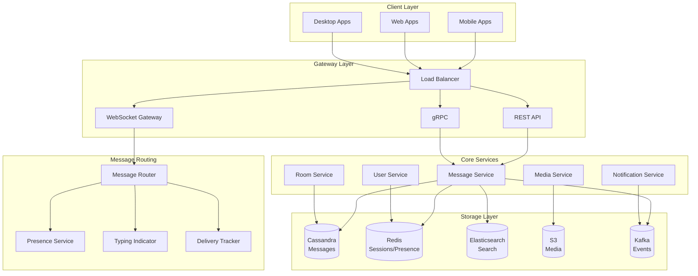
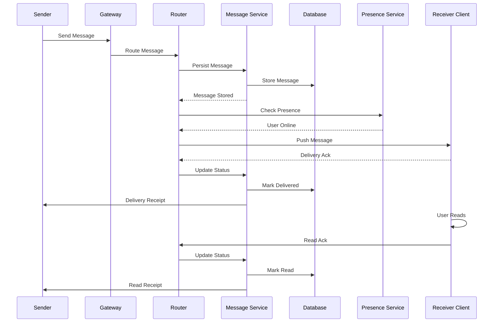
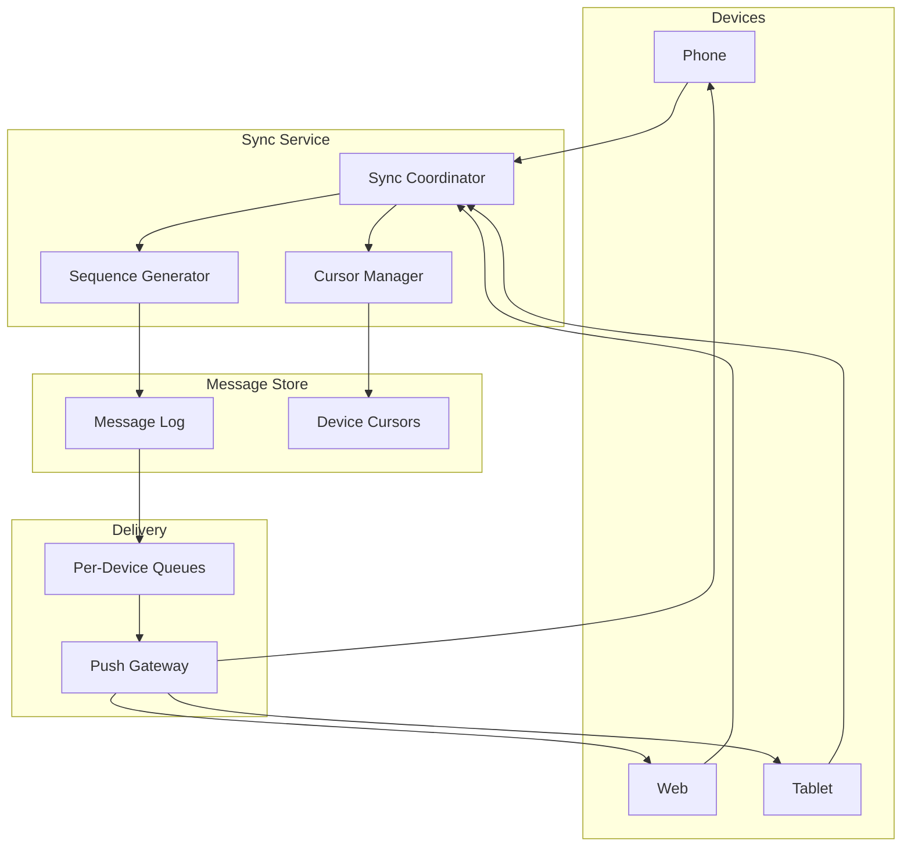

# AD-025: Chat Application Design

## Overview

Chat applications enable real-time messaging between users across various devices and network conditions. These systems must handle millions of concurrent connections, deliver messages reliably with low latency, support rich media content, and provide features like presence, typing indicators, and message history while maintaining data consistency and security.

## 1. Domain-Specific Requirements Analysis

### 1.1 Core Functional Requirements

#### Real-Time Messaging

- **One-to-One Chat**: Direct messaging between users
- **Group Chat**: Multi-user conversations
- **Channels/Rooms**: Topic-based public/private conversations
- **Message Types**: Text, image, video, file, voice, location
- **Message Status**: Sent, delivered, read receipts
- **Typing Indicators**: Real-time typing status
- **Presence**: Online/offline/away status

#### Message Reliability

- **Delivery Guarantees**: At-least-once delivery semantics
- **Ordering**: Causal ordering within conversations
- **Persistence**: Message history with search
- **Offline Support**: Queue messages for offline users
- **Message Sync**: Multi-device synchronization
- **Edit/Delete**: Message modification and recall

#### Media Handling

- **File Upload**: Multi-part uploads with resume
- **Media Processing**: Image/video compression
- **CDN Delivery**: Optimized media serving
- **Preview Generation**: Thumbnails and link previews
- **Encryption**: End-to-end encryption for sensitive content

#### Advanced Features

- **Reactions**: Emoji reactions to messages
- **Replies/Threads**: Threaded conversations
- **Mentions**: User and channel mentions
- **Search**: Full-text search across messages
- **Moderation**: Content filtering and spam detection
- **Bots**: Automated assistants and integrations

### 1.2 Non-Functional Requirements

#### Performance Requirements

| Metric | Target | Criticality |
|--------|--------|-------------|
| Message Delivery | < 100ms | Critical |
| Connection Establishment | < 200ms | High |
| Message History Load | < 500ms | High |
| Media Upload | < 5 seconds | Medium |
| Concurrent Connections | > 1 million | Critical |
| System Availability | 99.99% | Critical |

#### Scale Requirements

- Daily active users: 100 million+
- Messages per day: 10 billion+
- Concurrent rooms: 1 million+
- Storage: 10+ PB

## 2. Architecture Formalization

### 2.1 System Architecture Overview



### 2.2 Message Flow Architecture



### 2.3 Multi-Device Sync Architecture



## 3. Scalability and Performance Considerations

### 3.1 Connection Management

```go
package gateway

import (
    "context"
    "sync"
    "time"

    "github.com/gorilla/websocket"
)

// ConnectionManager manages WebSocket connections
type ConnectionManager struct {
    connections map[string]*ClientConnection
    userIndex   map[string]map[string]bool // userID -> connectionIDs
    mu          sync.RWMutex

    upgrader    websocket.Upgrader
    messageBus  MessageBus
}

type ClientConnection struct {
    ID       string
    UserID   string
    DeviceID string
    Conn     *websocket.Conn
    Send     chan []byte

    lastPing time.Time
    mu       sync.Mutex
}

// HandleConnection handles a new WebSocket connection
func (cm *ConnectionManager) HandleConnection(w http.ResponseWriter, r *http.Request) {
    // Upgrade HTTP to WebSocket
    conn, err := cm.upgrader.Upgrade(w, r, nil)
    if err != nil {
        return
    }

    // Authenticate
    userID, deviceID, err := cm.authenticate(r)
    if err != nil {
        conn.Close()
        return
    }

    // Create connection
    client := &ClientConnection{
        ID:       generateConnectionID(),
        UserID:   userID,
        DeviceID: deviceID,
        Conn:     conn,
        Send:     make(chan []byte, 256),
        lastPing: time.Now(),
    }

    // Register
    cm.register(client)

    // Start goroutines
    go cm.writePump(client)
    go cm.readPump(client)

    // Send connection acknowledgment
    ack := &Message{
        Type: "connected",
        Data: map[string]interface{}{
            "connection_id": client.ID,
            "user_id":       userID,
        },
    }
    client.Send <- encodeMessage(ack)
}

func (cm *ConnectionManager) register(client *ClientConnection) {
    cm.mu.Lock()
    defer cm.mu.Unlock()

    cm.connections[client.ID] = client

    if cm.userIndex[client.UserID] == nil {
        cm.userIndex[client.UserID] = make(map[string]bool)
    }
    cm.userIndex[client.UserID][client.ID] = true

    // Update presence
    cm.updatePresence(client.UserID, "online")
}

func (cm *ConnectionManager) unregister(client *ClientConnection) {
    cm.mu.Lock()
    defer cm.mu.Unlock()

    if _, ok := cm.connections[client.ID]; ok {
        delete(cm.connections, client.ID)
        close(client.Send)

        if cm.userIndex[client.UserID] != nil {
            delete(cm.userIndex[client.UserID], client.ID)

            // Check if last connection
            if len(cm.userIndex[client.UserID]) == 0 {
                delete(cm.userIndex, client.UserID)
                cm.updatePresence(client.UserID, "offline")
            }
        }
    }
}

func (cm *ConnectionManager) readPump(client *ClientConnection) {
    defer func() {
        cm.unregister(client)
        client.Conn.Close()
    }()

    client.Conn.SetReadDeadline(time.Now().Add(60 * time.Second))
    client.Conn.SetPongHandler(func(string) error {
        client.Conn.SetReadDeadline(time.Now().Add(60 * time.Second))
        client.mu.Lock()
        client.lastPing = time.Now()
        client.mu.Unlock()
        return nil
    })

    for {
        _, message, err := client.Conn.ReadMessage()
        if err != nil {
            if websocket.IsUnexpectedCloseError(err, websocket.CloseGoingAway, websocket.CloseAbnormalClosure) {
                log.Printf("WebSocket error: %v", err)
            }
            break
        }

        // Process message
        cm.handleMessage(client, message)
    }
}

func (cm *ConnectionManager) writePump(client *ClientConnection) {
    ticker := time.NewTicker(54 * time.Second)
    defer func() {
        ticker.Stop()
        client.Conn.Close()
    }()

    for {
        select {
        case message, ok := <-client.Send:
            client.Conn.SetWriteDeadline(time.Now().Add(10 * time.Second))
            if !ok {
                client.Conn.WriteMessage(websocket.CloseMessage, []byte{})
                return
            }

            client.Conn.WriteMessage(websocket.TextMessage, message)

        case <-ticker.C:
            client.Conn.SetWriteDeadline(time.Now().Add(10 * time.Second))
            if err := client.Conn.WriteMessage(websocket.PingMessage, nil); err != nil {
                return
            }
        }
    }
}

// BroadcastToUser sends message to all user's connections
func (cm *ConnectionManager) BroadcastToUser(userID string, message []byte) {
    cm.mu.RLock()
    defer cm.mu.RUnlock()

    if connections, ok := cm.userIndex[userID]; ok {
        for connID := range connections {
            if client, ok := cm.connections[connID]; ok {
                select {
                case client.Send <- message:
                default:
                    // Channel full, close connection
                    close(client.Send)
                    delete(cm.connections, connID)
                }
            }
        }
    }
}
```

### 3.2 Message Ordering and Delivery

```go
package messaging

import (
    "context"
    "fmt"
    "time"

    "github.com/gocql/gocql"
)

// MessageService handles message operations
type MessageService struct {
    session   *gocql.Session
    sequencer *Sequencer
    cache     *RedisCache
}

type Message struct {
    ID          string
    RoomID      string
    SenderID    string
    Content     string
    Type        string // text, image, file
    Sequence    int64
    Timestamp   time.Time
    EditedAt    *time.Time
    DeletedAt   *time.Time
    ReplyTo     *string
    Mentions    []string
    Reactions   map[string][]string // emoji -> userIDs
}

// SendMessage sends a message to a room
func (s *MessageService) SendMessage(ctx context.Context, msg *Message) (*Message, error) {
    // Generate message ID
    msg.ID = gocql.TimeUUID().String()
    msg.Timestamp = time.Now()

    // Get sequence number
    seq, err := s.sequencer.Next(ctx, msg.RoomID)
    if err != nil {
        return nil, err
    }
    msg.Sequence = seq

    // Store message
    query := `
        INSERT INTO messages (room_id, sequence, id, sender_id, content, type, timestamp, reply_to, mentions)
        VALUES (?, ?, ?, ?, ?, ?, ?, ?, ?)
    `

    if err := s.session.Query(query,
        msg.RoomID, msg.Sequence, msg.ID, msg.SenderID,
        msg.Content, msg.Type, msg.Timestamp, msg.ReplyTo, msg.Mentions,
    ).WithContext(ctx).Exec(); err != nil {
        return nil, err
    }

    // Update room metadata
    s.updateRoomActivity(ctx, msg.RoomID, msg.Timestamp)

    // Publish to message bus
    s.publishMessage(ctx, msg)

    return msg, nil
}

// GetMessages retrieves messages for a room
func (s *MessageService) GetMessages(ctx context.Context, roomID string, beforeSeq int64, limit int) ([]*Message, error) {
    // Try cache first
    cached := s.cache.GetMessages(ctx, roomID, beforeSeq, limit)
    if len(cached) == limit {
        return cached, nil
    }

    // Query from database
    query := `
        SELECT sequence, id, sender_id, content, type, timestamp, reply_to, mentions
        FROM messages
        WHERE room_id = ? AND sequence < ?
        ORDER BY sequence DESC
        LIMIT ?
    `

    iter := s.session.Query(query, roomID, beforeSeq, limit).WithContext(ctx).Iter()

    var messages []*Message
    var msg Message

    for iter.Scan(&msg.Sequence, &msg.ID, &msg.SenderID, &msg.Content,
                  &msg.Type, &msg.Timestamp, &msg.ReplyTo, &msg.Mentions) {
        msg.RoomID = roomID
        messages = append(messages, &msg)
        msg = Message{}
    }

    if err := iter.Close(); err != nil {
        return nil, err
    }

    // Cache results
    s.cache.SetMessages(ctx, roomID, messages)

    return messages, nil
}

// MarkDelivered marks a message as delivered to a user
func (s *MessageService) MarkDelivered(ctx context.Context, messageID, userID string) error {
    query := `
        UPDATE message_status
        SET delivered_at = ?
        WHERE message_id = ? AND user_id = ?
    `

    return s.session.Query(query, time.Now(), messageID, userID).WithContext(ctx).Exec()
}

// MarkRead marks a message as read by a user
func (s *MessageService) MarkRead(ctx context.Context, messageID, userID string) error {
    query := `
        UPDATE message_status
        SET read_at = ?
        WHERE message_id = ? AND user_id = ?
    `

    return s.session.Query(query, time.Now(), messageID, userID).WithContext(ctx).Exec()
}

// GetUnreadCount gets unread message count for a user in a room
func (s *MessageService) GetUnreadCount(ctx context.Context, roomID, userID string) (int64, error) {
    // Get user's last read sequence
    var lastRead int64
    err := s.session.Query(
        "SELECT last_read_seq FROM room_members WHERE room_id = ? AND user_id = ?",
        roomID, userID,
    ).WithContext(ctx).Scan(&lastRead)

    if err != nil {
        return 0, err
    }

    // Count messages after last read
    var count int64
    err = s.session.Query(
        "SELECT COUNT(*) FROM messages WHERE room_id = ? AND sequence > ?",
        roomID, lastRead,
    ).WithContext(ctx).Scan(&count)

    return count, err
}
```

### 3.3 Presence Service

```go
package presence

import (
    "context"
    "time"

    "github.com/redis/go-redis/v9"
)

// PresenceService manages user presence
type PresenceService struct {
    redis *redis.Client
    pubsub *redis.PubSub
}

type PresenceStatus struct {
    UserID    string
    Status    string // online, away, offline
    LastSeen  time.Time
    Devices   []DeviceInfo
}

type DeviceInfo struct {
    DeviceID   string
    Platform   string
    LastActive time.Time
}

// UpdateStatus updates user presence status
func (ps *PresenceService) UpdateStatus(ctx context.Context, userID, status string) error {
    key := fmt.Sprintf("presence:%s", userID)

    data := map[string]interface{}{
        "status":    status,
        "last_seen": time.Now().Unix(),
    }

    // Store in Redis with expiration
    pipe := ps.redis.Pipeline()
    pipe.HSet(ctx, key, data)
    pipe.Expire(ctx, key, 5*time.Minute)

    _, err := pipe.Exec(ctx)
    if err != nil {
        return err
    }

    // Publish status change
    ps.publishStatusChange(ctx, userID, status)

    return nil
}

// GetStatus retrieves user presence status
func (ps *PresenceService) GetStatus(ctx context.Context, userID string) (*PresenceStatus, error) {
    key := fmt.Sprintf("presence:%s", userID)

    data, err := ps.redis.HGetAll(ctx, key).Result()
    if err != nil {
        return nil, err
    }

    if len(data) == 0 {
        return &PresenceStatus{
            UserID:   userID,
            Status:   "offline",
            LastSeen: time.Time{},
        }, nil
    }

    lastSeen, _ := strconv.ParseInt(data["last_seen"], 10, 64)

    return &PresenceStatus{
        UserID:   userID,
        Status:   data["status"],
        LastSeen: time.Unix(lastSeen, 0),
    }, nil
}

// GetBulkStatus retrieves presence for multiple users
func (ps *PresenceService) GetBulkStatus(ctx context.Context, userIDs []string) (map[string]*PresenceStatus, error) {
    pipe := ps.redis.Pipeline()

    keys := make([]*redis.StringStringMapCmd, len(userIDs))
    for i, userID := range userIDs {
        keys[i] = pipe.HGetAll(ctx, fmt.Sprintf("presence:%s", userID))
    }

    _, err := pipe.Exec(ctx)
    if err != nil {
        return nil, err
    }

    results := make(map[string]*PresenceStatus)
    for i, cmd := range keys {
        data, _ := cmd.Result()
        userID := userIDs[i]

        if len(data) == 0 {
            results[userID] = &PresenceStatus{
                UserID: userID,
                Status: "offline",
            }
        } else {
            lastSeen, _ := strconv.ParseInt(data["last_seen"], 10, 64)
            results[userID] = &PresenceStatus{
                UserID:   userID,
                Status:   data["status"],
                LastSeen: time.Unix(lastSeen, 0),
            }
        }
    }

    return results, nil
}

// SubscribeToPresence subscribes to presence updates
func (ps *PresenceService) SubscribeToPresence(ctx context.Context, userIDs []string) (chan *PresenceUpdate, error) {
    channels := make([]string, len(userIDs))
    for i, userID := range userIDs {
        channels[i] = fmt.Sprintf("presence:%s", userID)
    }

    pubsub := ps.redis.Subscribe(ctx, channels...)
    ch := make(chan *PresenceUpdate)

    go func() {
        defer close(ch)

        for msg := range pubsub.Channel() {
            update := &PresenceUpdate{
                UserID:    extractUserIDFromChannel(msg.Channel),
                Status:    msg.Payload,
                Timestamp: time.Now(),
            }

            select {
            case ch <- update:
            case <-ctx.Done():
                return
            }
        }
    }()

    return ch, nil
}

func (ps *PresenceService) publishStatusChange(ctx context.Context, userID, status string) {
    channel := fmt.Sprintf("presence:%s", userID)
    ps.redis.Publish(ctx, channel, status)
}
```

## 4. Technology Stack Recommendations

### 4.1 Core Technologies

| Layer | Technology | Purpose |
|-------|-----------|---------|
| Language | Go 1.21+ | High-performance services |
| WebSocket | Gorilla/WebSocket | Real-time connections |
| Database | Cassandra | Message storage |
| Cache | Redis | Sessions, presence |
| Search | Elasticsearch | Message search |
| Queue | Kafka | Event streaming |
| Storage | S3 | Media files |

### 4.2 Go Libraries

```go
// Core dependencies
go get github.com/gorilla/websocket
go get github.com/gocql/gocql
go get github.com/redis/go-redis/v9
go get github.com/elastic/go-elasticsearch/v8
go get github.com/IBM/sarama
go get github.com/aws/aws-sdk-go-v2
```

## 5. Industry Case Studies

### 5.1 Case Study: WhatsApp Architecture

**Architecture**:

- Erlang/Elixir for messaging
- Custom XMPP protocol
- E2E encryption (Signal Protocol)
- RocksDB for message storage

**Scale**:

- 2+ billion users
- 100+ billion messages daily
- 100+ million group chats

**Key Features**:

1. End-to-end encryption
2. Multi-device support
3. Status/presence
4. Media sharing

### 5.2 Case Study: Discord Architecture

**Architecture**:

- Elixir/Erlang for gateways
- ScyllaDB for messages
- Cassandra for persistence
- Kafka for event streaming

**Scale**:

- 150+ million monthly users
- 19 million active servers
- 4 billion messages daily

**Key Features**:

1. Voice/video calls
2. Low-latency messaging
3. Rich embeds/previews
4. Bot ecosystem

### 5.3 Case Study: Slack Architecture

**Architecture**:

- PHP/Hacklang (migrating to Java)
- MySQL Vitess for sharding
- Redis for caching
- Kafka for messaging

**Scale**:

- 20+ million daily active users
- 1.5 billion messages weekly
- 3+ hour search retention

## 6. Go Implementation Examples

### 6.1 Message Router

```go
package router

import (
    "context"
    "encoding/json"
)

// MessageRouter routes messages to recipients
type MessageRouter struct {
    presence   *presence.PresenceService
    gateway    *gateway.ConnectionManager
    offlineQueue *OfflineQueue
}

// RouteMessage routes a message to its recipients
func (r *MessageRouter) RouteMessage(ctx context.Context, msg *Message) error {
    // Get room members
    members, err := r.getRoomMembers(ctx, msg.RoomID)
    if err != nil {
        return err
    }

    // Get presence for all members
    userIDs := make([]string, len(members))
    for i, m := range members {
        userIDs[i] = m.UserID
    }

    presences, err := r.presence.GetBulkStatus(ctx, userIDs)
    if err != nil {
        return err
    }

    // Route to online users
    for _, member := range members {
        if member.UserID == msg.SenderID {
            continue // Don't send to sender
        }

        presence := presences[member.UserID]
        messageData := encodeMessage(msg)

        if presence.Status == "online" {
            // Send via WebSocket
            r.gateway.BroadcastToUser(member.UserID, messageData)
        } else {
            // Queue for offline delivery
            r.offlineQueue.Enqueue(ctx, member.UserID, msg)

            // Send push notification
            r.sendPushNotification(ctx, member.UserID, msg)
        }
    }

    return nil
}

func (r *MessageRouter) sendPushNotification(ctx context.Context, userID string, msg *Message) error {
    // Get user's push tokens
    tokens, err := r.getPushTokens(ctx, userID)
    if err != nil {
        return err
    }

    // Build notification
    notification := &PushNotification{
        Title: fmt.Sprintf("%s", msg.SenderName),
        Body:  truncate(msg.Content, 100),
        Data: map[string]string{
            "room_id":    msg.RoomID,
            "message_id": msg.ID,
        },
    }

    // Send to all devices
    for _, token := range tokens {
        switch token.Platform {
        case "ios":
            r.sendAPNS(ctx, token.Token, notification)
        case "android":
            r.sendFCM(ctx, token.Token, notification)
        case "web":
            r.sendWebPush(ctx, token.Token, notification)
        }
    }

    return nil
}
```

### 6.2 Search Service

```go
package search

import (
    "context"
    "strings"
)

// SearchService provides message search capabilities
type SearchService struct {
    es *elasticsearch.Client
}

// SearchMessages searches messages in a room
func (s *SearchService) SearchMessages(ctx context.Context, req *SearchRequest) (*SearchResult, error) {
    // Build query
    query := map[string]interface{}{
        "query": map[string]interface{}{
            "bool": map[string]interface{}{
                "must": []map[string]interface{}{
                    {
                        "match": map[string]interface{}{
                            "content": req.Query,
                        },
                    },
                    {
                        "term": map[string]interface{}{
                            "room_id": req.RoomID,
                        },
                    },
                },
            },
        },
        "sort": []map[string]interface{}{
            {
                "timestamp": map[string]interface{}{
                    "order": "desc",
                },
            },
        },
        "from": req.Offset,
        "size": req.Limit,
        "highlight": map[string]interface{}{
            "fields": map[string]interface{}{
                "content": map[string]interface{}{},
            },
        },
    }

    // Add filters
    if req.SenderID != "" {
        query["query"].(map[string]interface{})["bool"].(map[string]interface{})["must"] =
            append(query["query"].(map[string]interface{})["bool"].(map[string]interface{})["must"].([]map[string]interface{}),
                map[string]interface{}{
                    "term": map[string]interface{}{
                        "sender_id": req.SenderID,
                    },
                },
            )
    }

    if req.After != nil {
        query["query"].(map[string]interface{})["bool"].(map[string]interface{})["must"] =
            append(query["query"].(map[string]interface{})["bool"].(map[string]interface{})["must"].([]map[string]interface{}),
                map[string]interface{}{
                    "range": map[string]interface{}{
                        "timestamp": map[string]interface{}{
                            "gte": req.After.Format(time.RFC3339),
                        },
                    },
                },
            )
    }

    // Execute search
    res, err := s.es.Search(
        s.es.Search.WithIndex("messages"),
        s.es.Search.WithBody(esutil.NewJSONReader(query)),
        s.es.Search.WithContext(ctx),
    )
    if err != nil {
        return nil, err
    }
    defer res.Body.Close()

    // Parse results
    var result SearchResult
    // ... parse response

    return &result, nil
}

// IndexMessage indexes a message for search
func (s *SearchService) IndexMessage(ctx context.Context, msg *Message) error {
    doc := map[string]interface{}{
        "id":         msg.ID,
        "room_id":    msg.RoomID,
        "sender_id":  msg.SenderID,
        "content":    msg.Content,
        "timestamp":  msg.Timestamp,
        "type":       msg.Type,
    }

    _, err := s.es.Index(
        "messages",
        strings.NewReader(toJSON(doc)),
        s.es.Index.WithDocumentID(msg.ID),
        s.es.Index.WithContext(ctx),
    )

    return err
}
```

## 7. Security and Compliance

### 7.1 End-to-End Encryption

```go
package crypto

import (
    "crypto/aes"
    "crypto/cipher"
    "crypto/rand"
    "crypto/rsa"
    "crypto/sha256"
    "crypto/x509"
    "encoding/pem"
)

// E2EEManager manages end-to-end encryption
type E2EEManager struct {
    keyStore *KeyStore
}

// GenerateKeyPair generates RSA key pair for a user
func (e *E2EEManager) GenerateKeyPair(userID string) (*KeyPair, error) {
    privateKey, err := rsa.GenerateKey(rand.Reader, 2048)
    if err != nil {
        return nil, err
    }

    // Encode private key
    privKeyPEM := pem.EncodeToMemory(&pem.Block{
        Type:  "RSA PRIVATE KEY",
        Bytes: x509.MarshalPKCS1PrivateKey(privateKey),
    })

    // Encode public key
    pubKeyPEM := pem.EncodeToMemory(&pem.Block{
        Type:  "RSA PUBLIC KEY",
        Bytes: x509.MarshalPKCS1PublicKey(&privateKey.PublicKey),
    })

    // Store keys
    keyPair := &KeyPair{
        UserID:     userID,
        PrivateKey: string(privKeyPEM),
        PublicKey:  string(pubKeyPEM),
    }

    if err := e.keyStore.Store(keyPair); err != nil {
        return nil, err
    }

    return keyPair, nil
}

// EncryptMessage encrypts a message for a recipient
func (e *E2EEManager) EncryptMessage(plaintext []byte, recipientPubKey *rsa.PublicKey) (*EncryptedMessage, error) {
    // Generate AES key
    aesKey := make([]byte, 32)
    if _, err := rand.Read(aesKey); err != nil {
        return nil, err
    }

    // Encrypt plaintext with AES
    block, err := aes.NewCipher(aesKey)
    if err != nil {
        return nil, err
    }

    gcm, err := cipher.NewGCM(block)
    if err != nil {
        return nil, err
    }

    nonce := make([]byte, gcm.NonceSize())
    if _, err := rand.Read(nonce); err != nil {
        return nil, err
    }

    ciphertext := gcm.Seal(nonce, nonce, plaintext, nil)

    // Encrypt AES key with RSA
    encryptedKey, err := rsa.EncryptOAEP(sha256.New(), rand.Reader, recipientPubKey, aesKey, nil)
    if err != nil {
        return nil, err
    }

    return &EncryptedMessage{
        Ciphertext:   ciphertext,
        EncryptedKey: encryptedKey,
    }, nil
}

// DecryptMessage decrypts a message
func (e *E2EEManager) DecryptMessage(encrypted *EncryptedMessage, recipientPrivKey *rsa.PrivateKey) ([]byte, error) {
    // Decrypt AES key
    aesKey, err := rsa.DecryptOAEP(sha256.New(), rand.Reader, recipientPrivKey, encrypted.EncryptedKey, nil)
    if err != nil {
        return nil, err
    }

    // Decrypt ciphertext
    block, err := aes.NewCipher(aesKey)
    if err != nil {
        return nil, err
    }

    gcm, err := cipher.NewGCM(block)
    if err != nil {
        return nil, err
    }

    nonceSize := gcm.NonceSize()
    if len(encrypted.Ciphertext) < nonceSize {
        return nil, fmt.Errorf("ciphertext too short")
    }

    nonce, ciphertext := encrypted.Ciphertext[:nonceSize], encrypted.Ciphertext[nonceSize:]
    return gcm.Open(nil, nonce, ciphertext, nil)
}
```

## 8. Conclusion

Chat application design requires balancing real-time performance, reliability, and feature richness at scale. Key takeaways:

1. **Connection management**: Efficient WebSocket handling for millions of connections
2. **Message reliability**: At-least-once delivery with ordering guarantees
3. **Multi-device sync**: Seamless experience across all user devices
4. **Presence and typing**: Real-time state synchronization
5. **Media handling**: Efficient upload, processing, and delivery
6. **Security**: End-to-end encryption and secure authentication

The Go programming language is excellent for chat applications due to its goroutine-based concurrency model, efficient memory usage, and strong networking capabilities. By following the patterns in this document, you can build chat applications that serve millions of users with real-time messaging capabilities.

---

*Document Version: 1.0*
*Last Updated: 2026-04-02*
*Classification: Technical Reference*
