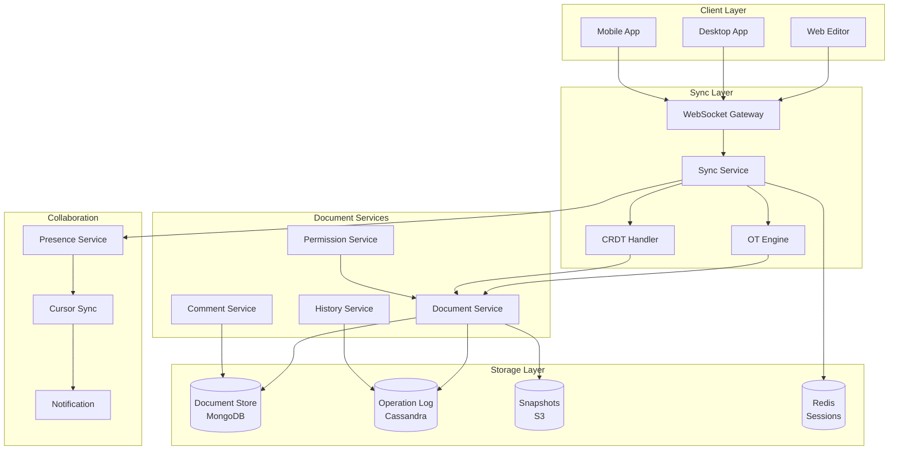
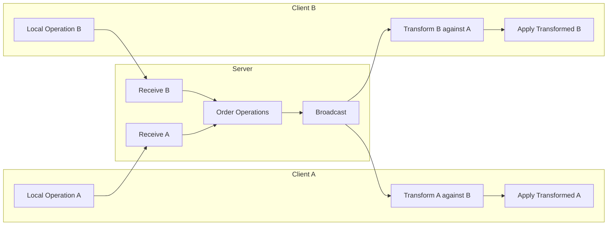
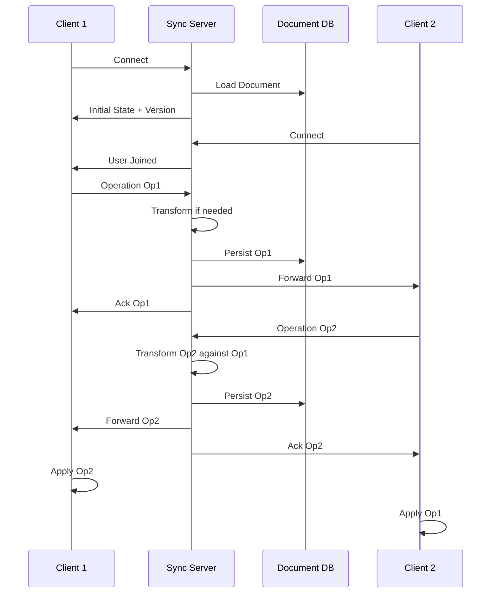

# AD-026: Collaborative Editing System Design

## Overview

Collaborative editing systems enable multiple users to simultaneously edit documents, spreadsheets, or other content types with real-time synchronization and conflict resolution. These systems must handle concurrent modifications, maintain document consistency, provide low-latency updates, and ensure data persistence while supporting offline editing and seamless reconnection.

## 1. Domain-Specific Requirements Analysis

### 1.1 Core Functional Requirements

#### Real-Time Collaboration

- **Concurrent Editing**: Multiple users editing simultaneously
- **Operational Transformation**: Conflict-free collaborative editing
- **CRDT Support**: Conflict-free Replicated Data Types
- **Cursor Tracking**: Real-time cursor and selection positions
- **User Awareness**: Active user list and presence indicators

#### Document Management

- **Document Creation**: New document workflows
- **Version History**: Complete edit history with rollback
- **Snapshots**: Periodic document checkpoints
- **Import/Export**: Support for various formats
- **Templates**: Pre-defined document structures

#### Access Control

- **Permissions**: Read, comment, edit, admin roles
- **Sharing**: Public, link-based, or invite-only access
- **Approval Workflows**: Review and approval processes
- **Audit Logging**: Complete activity history

#### Offline Support

- **Offline Editing**: Edit without network connectivity
- **Conflict Resolution**: Merge offline changes
- **Sync Protocol**: Efficient change synchronization
- **Storage**: Local document caching

### 1.2 Non-Functional Requirements

#### Performance Requirements

| Metric | Target | Criticality |
|--------|--------|-------------|
| Operation Latency | < 50ms | Critical |
| Sync Latency | < 100ms | Critical |
| Document Load | < 500ms | High |
| Concurrent Users | > 100/doc | High |
| Document Size | > 10MB | Medium |
| System Availability | 99.99% | Critical |

#### Consistency Requirements

- Eventual consistency across clients
- Causal ordering of operations
- Conflict-free concurrent edits
- Atomic operation batches

## 2. Architecture Formalization

### 2.1 System Architecture Overview



### 2.2 Operational Transformation Flow



### 2.3 Document Sync Architecture



## 3. Scalability and Performance Considerations

### 3.1 Operational Transformation Engine

```go
package ot

import (
    "fmt"
)

// Operation represents a document operation
type Operation struct {
    Type      string      // insert, delete, retain
    Position  int
    Content   interface{} // string for insert, int for retain/delete
    Attributes map[string]interface{}
}

// OTEngine performs operational transformation
type OTEngine struct {
    document *Document
}

// Transform transforms two operations against each other
func (ot *OTEngine) Transform(op1, op2 *Operation) (*Operation, *Operation) {
    switch op1.Type {
    case "insert":
        return ot.transformInsert(op1, op2)
    case "delete":
        return ot.transformDelete(op1, op2)
    case "retain":
        return ot.transformRetain(op1, op2)
    default:
        return op1, op2
    }
}

func (ot *OTEngine) transformInsert(insert, other *Operation) (*Operation, *Operation) {
    switch other.Type {
    case "insert":
        if insert.Position <= other.Position {
            // insert before other
            other.Position += len(insert.Content.(string))
            return insert, other
        }
        // insert after other
        insert.Position += len(other.Content.(string))
        return insert, other

    case "delete":
        if insert.Position <= other.Position {
            // insert before delete
            other.Position += len(insert.Content.(string))
            return insert, other
        }
        // insert after delete
        insert.Position -= other.Content.(int)
        return insert, other

    case "retain":
        if insert.Position <= other.Position {
            // insert before retain
            other.Position += len(insert.Content.(string))
            return insert, other
        }
        // insert after retain
        insert.Position += other.Content.(int)
        return insert, other
    }

    return insert, other
}

func (ot *OTEngine) transformDelete(del, other *Operation) (*Operation, *Operation) {
    switch other.Type {
    case "insert":
        if del.Position <= other.Position {
            // delete before insert
            other.Position -= del.Content.(int)
            return del, other
        }
        // delete after insert
        del.Position += len(other.Content.(string))
        return del, other

    case "delete":
        // Simplified: assumes non-overlapping deletes
        if del.Position <= other.Position {
            other.Position -= del.Content.(int)
            return del, other
        }
        del.Position -= other.Content.(int)
        return del, other

    case "retain":
        if del.Position <= other.Position {
            other.Position -= del.Content.(int)
            return del, other
        }
        del.Position += other.Content.(int)
        return del, other
    }

    return del, other
}

// Compose combines two operations into one
func (ot *OTEngine) Compose(op1, op2 *Operation) *Operation {
    // Simplified composition
    // In practice, this would handle complex operation sequences
    return &Operation{
        Type:     "composite",
        Position: op1.Position,
    }
}

// Apply applies an operation to the document
func (ot *OTEngine) Apply(op *Operation) error {
    switch op.Type {
    case "insert":
        return ot.document.Insert(op.Position, op.Content.(string))
    case "delete":
        return ot.document.Delete(op.Position, op.Content.(int))
    case "retain":
        // No-op for document state
        return nil
    default:
        return fmt.Errorf("unknown operation type: %s", op.Type)
    }
}

// Document represents the collaborative document
type Document struct {
    Content string
    Version int
    mu      sync.RWMutex
}

func (d *Document) Insert(pos int, text string) error {
    d.mu.Lock()
    defer d.mu.Unlock()

    if pos < 0 || pos > len(d.Content) {
        return fmt.Errorf("invalid position: %d", pos)
    }

    d.Content = d.Content[:pos] + text + d.Content[pos:]
    d.Version++
    return nil
}

func (d *Document) Delete(pos, length int) error {
    d.mu.Lock()
    defer d.mu.Unlock()

    if pos < 0 || pos+length > len(d.Content) {
        return fmt.Errorf("invalid range: %d-%d", pos, pos+length)
    }

    d.Content = d.Content[:pos] + d.Content[pos+length:]
    d.Version++
    return nil
}
```

### 3.2 CRDT Implementation

```go
package crdt

import (
    "fmt"
    "sort"
    "sync"
    "time"
)

// LWWRegister is a Last-Write-Wins register
type LWWRegister struct {
    Value     interface{}
    Timestamp int64
    ReplicaID string
}

func (r *LWWRegister) Merge(other *LWWRegister) *LWWRegister {
    if other.Timestamp > r.Timestamp {
        return other
    }
    if other.Timestamp == r.Timestamp && other.ReplicaID > r.ReplicaID {
        return other
    }
    return r
}

// GCounter is a grow-only counter
type GCounter struct {
    counts map[string]int64
    mu     sync.RWMutex
}

func (c *GCounter) Increment(replicaID string) {
    c.mu.Lock()
    defer c.mu.Unlock()
    c.counts[replicaID]++
}

func (c *GCounter) Value() int64 {
    c.mu.RLock()
    defer c.mu.RUnlock()

    var total int64
    for _, v := range c.counts {
        total += v
    }
    return total
}

func (c *GCounter) Merge(other *GCounter) {
    c.mu.Lock()
    defer c.mu.Unlock()

    for replicaID, count := range other.counts {
        if current, ok := c.counts[replicaID]; !ok || count > current {
            c.counts[replicaID] = count
        }
    }
}

// PNCounter is a counter that supports increments and decrements
type PNCounter struct {
    inc *GCounter
    dec *GCounter
}

func (c *PNCounter) Increment(replicaID string) {
    c.inc.Increment(replicaID)
}

func (c *PNCounter) Decrement(replicaID string) {
    c.dec.Increment(replicaID)
}

func (c *PNCounter) Value() int64 {
    return c.inc.Value() - c.dec.Value()
}

func (c *PNCounter) Merge(other *PNCounter) {
    c.inc.Merge(other.inc)
    c.dec.Merge(other.dec)
}

// RGA (Replicated Growable Array) for collaborative text editing
type RGA struct {
    nodes    map[string]*RGANode
    head     *RGANode
    replicaID string
    mu       sync.RWMutex
}

type RGANode struct {
    ID       string
    Content  string
    Visible  bool
    ParentID string
    Timestamp int64
    Next     *RGANode
}

func (rga *RGA) Insert(pos int, content string) error {
    rga.mu.Lock()
    defer rga.mu.Unlock()

    node := &RGANode{
        ID:        fmt.Sprintf("%s-%d", rga.replicaID, time.Now().UnixNano()),
        Content:   content,
        Visible:   true,
        Timestamp: time.Now().UnixNano(),
    }

    // Find insertion point
    if pos == 0 {
        node.Next = rga.head
        rga.head = node
    } else {
        current := rga.head
        for i := 0; i < pos-1 && current != nil; i++ {
            current = current.Next
        }

        if current == nil {
            return fmt.Errorf("invalid position: %d", pos)
        }

        node.Next = current.Next
        current.Next = node
    }

    rga.nodes[node.ID] = node
    return nil
}

func (rga *RGA) Delete(pos int) error {
    rga.mu.Lock()
    defer rga.mu.Unlock()

    if pos == 0 && rga.head != nil {
        rga.head.Visible = false
        return nil
    }

    current := rga.head
    for i := 0; i < pos && current != nil; i++ {
        current = current.Next
    }

    if current == nil {
        return fmt.Errorf("invalid position: %d", pos)
    }

    current.Visible = false
    return nil
}

func (rga *RGA) ToString() string {
    rga.mu.RLock()
    defer rga.mu.RUnlock()

    var result string
    current := rga.head

    for current != nil {
        if current.Visible {
            result += current.Content
        }
        current = current.Next
    }

    return result
}

func (rga *RGA) Merge(other *RGA) {
    rga.mu.Lock()
    defer rga.mu.Unlock()

    // Merge nodes from other RGA
    for id, node := range other.nodes {
        if existing, ok := rga.nodes[id]; ok {
            // Tombstone wins
            if !node.Visible {
                existing.Visible = false
            }
        } else {
            // Add new node
            rga.nodes[id] = node
        }
    }

    // Rebuild linked list based on timestamps
    rga.rebuildList()
}

func (rga *RGA) rebuildList() {
    // Convert to slice for sorting
    var nodes []*RGANode
    for _, node := range rga.nodes {
        nodes = append(nodes, node)
    }

    // Sort by timestamp
    sort.Slice(nodes, func(i, j int) bool {
        return nodes[i].Timestamp < nodes[j].Timestamp
    })

    // Rebuild linked list
    rga.head = nil
    var prev *RGANode
    for _, node := range nodes {
        if rga.head == nil {
            rga.head = node
        } else {
            prev.Next = node
        }
        prev = node
        prev.Next = nil
    }
}
```

### 3.3 Connection Manager

```go
package sync

import (
    "context"
    "encoding/json"
    "sync"
    "time"

    "github.com/gorilla/websocket"
)

// ConnectionManager manages client connections
type ConnectionManager struct {
    documents map[string]*DocumentSession
    mu        sync.RWMutex
}

type DocumentSession struct {
    DocumentID  string
    Clients     map[string]*Client
    OperationLog []*Operation
    LastVersion int
    mu          sync.RWMutex
}

type Client struct {
    ID         string
    UserID     string
    Connection *websocket.Conn
    Send       chan []byte
    Cursor     *CursorPosition
}

type CursorPosition struct {
    Position int
    SelectionStart int
    SelectionEnd   int
}

// Join adds a client to a document session
func (cm *ConnectionManager) Join(docID, clientID, userID string, conn *websocket.Conn) (*DocumentSession, error) {
    cm.mu.Lock()
    defer cm.mu.Unlock()

    session, exists := cm.documents[docID]
    if !exists {
        session = &DocumentSession{
            DocumentID:   docID,
            Clients:      make(map[string]*Client),
            OperationLog: make([]*Operation, 0),
        }
        cm.documents[docID] = session
    }

    session.mu.Lock()
    defer session.mu.Unlock()

    client := &Client{
        ID:         clientID,
        UserID:     userID,
        Connection: conn,
        Send:       make(chan []byte, 256),
        Cursor:     &CursorPosition{},
    }

    session.Clients[clientID] = client

    // Notify other clients
    cm.broadcastPresence(session, client, "join")

    return session, nil
}

// Leave removes a client from a document session
func (cm *ConnectionManager) Leave(docID, clientID string) {
    cm.mu.Lock()
    defer cm.mu.Unlock()

    session, exists := cm.documents[docID]
    if !exists {
        return
    }

    session.mu.Lock()
    defer session.mu.Unlock()

    client, exists := session.Clients[clientID]
    if !exists {
        return
    }

    delete(session.Clients, clientID)
    close(client.Send)

    // Notify other clients
    cm.broadcastPresence(session, client, "leave")

    // Clean up empty sessions
    if len(session.Clients) == 0 {
        delete(cm.documents, docID)
    }
}

// BroadcastOperation broadcasts an operation to all clients except sender
func (cm *ConnectionManager) BroadcastOperation(docID, senderID string, op *Operation) {
    cm.mu.RLock()
    session, exists := cm.documents[docID]
    cm.mu.RUnlock()

    if !exists {
        return
    }

    session.mu.RLock()
    defer session.mu.RUnlock()

    // Add to operation log
    session.OperationLog = append(session.OperationLog, op)
    session.LastVersion = op.Version

    // Broadcast to other clients
    data, _ := json.Marshal(map[string]interface{}{
        "type": "operation",
        "data": op,
    })

    for id, client := range session.Clients {
        if id != senderID {
            select {
            case client.Send <- data:
            default:
                // Client send buffer full, disconnect
                close(client.Send)
                delete(session.Clients, id)
            }
        }
    }
}

// UpdateCursor broadcasts cursor position update
func (cm *ConnectionManager) UpdateCursor(docID, clientID string, cursor *CursorPosition) {
    cm.mu.RLock()
    session, exists := cm.documents[docID]
    cm.mu.RUnlock()

    if !exists {
        return
    }

    session.mu.Lock()
    client, exists := session.Clients[clientID]
    if exists {
        client.Cursor = cursor
    }
    session.mu.Unlock()

    if !exists {
        return
    }

    // Broadcast cursor update
    data, _ := json.Marshal(map[string]interface{}{
        "type": "cursor",
        "client_id": clientID,
        "user_id":   client.UserID,
        "cursor":    cursor,
    })

    session.mu.RLock()
    defer session.mu.RUnlock()

    for id, c := range session.Clients {
        if id != clientID {
            select {
            case c.Send <- data:
            default:
            }
        }
    }
}

func (cm *ConnectionManager) broadcastPresence(session *DocumentSession, client *Client, event string) {
    data, _ := json.Marshal(map[string]interface{}{
        "type":     "presence",
        "event":    event,
        "client_id": client.ID,
        "user_id":   client.UserID,
    })

    for id, c := range session.Clients {
        if id != client.ID {
            select {
            case c.Send <- data:
            default:
            }
        }
    }
}
```

## 4. Technology Stack Recommendations

### 4.1 Core Technologies

| Layer | Technology | Purpose |
|-------|-----------|---------|
| Language | Go 1.21+ | High-performance services |
| WebSocket | Gorilla/WebSocket | Real-time sync |
| Database | MongoDB | Document storage |
| Event Log | Cassandra | Operation history |
| Cache | Redis | Sessions, presence |
| Storage | S3 | Snapshots, exports |
| Search | Elasticsearch | Full-text search |

### 4.2 Go Libraries

```go
// Core dependencies
go get github.com/gorilla/websocket
go get go.mongodb.org/mongo-driver/mongo
go get github.com/gocql/gocql
go get github.com/redis/go-redis/v9
go get github.com/elastic/go-elasticsearch/v8
```

## 5. Industry Case Studies

### 5.1 Case Study: Google Docs

**Architecture**:

- Operational Transformation for conflict resolution
- Jupiter system for OT
- Snapshot-based persistence
- Real-time collaboration

**Scale**:

- 2+ billion users
- 5+ billion documents
- Real-time editing for 100+ users per doc

**Key Features**:

1. Offline editing with sync
2. Comment and suggestion mode
3. Version history
4. Real-time presence

### 5.2 Case Study: Notion

**Architecture**:

- Block-based document structure
- Real-time WebSocket sync
- Incremental updates
- Offline support

**Scale**:

- 30+ million users
- 4+ million paying customers
- Enterprise collaboration

### 5.3 Case Study: Figma

**Architecture**:

- CRDT-based synchronization
- Multiplayer engine in Rust
- Vector graphics collaboration
- Real-time cursor tracking

**Scale**:

- 10+ million users
- Real-time design collaboration
- Cross-platform support

## 6. Go Implementation Examples

### 6.1 Document Service

```go
package document

import (
    "context"
    "time"

    "go.mongodb.org/mongo-driver/bson"
    "go.mongodb.org/mongo-driver/mongo"
)

// Service manages document operations
type Service struct {
    collection *mongo.Collection
    otEngine   *ot.OTEngine
    snapshotter *Snapshotter
}

// Document represents a collaborative document
type Document struct {
    ID        string                 `bson:"_id"`
    Title     string                 `bson:"title"`
    Content   string                 `bson:"content"`
    Version   int                    `bson:"version"`
    OwnerID   string                 `bson:"owner_id"`
    CreatedAt time.Time              `bson:"created_at"`
    UpdatedAt time.Time              `bson:"updated_at"`
    Metadata  map[string]interface{} `bson:"metadata"`
}

// Create creates a new document
func (s *Service) Create(ctx context.Context, ownerID, title string) (*Document, error) {
    doc := &Document{
        ID:        generateID(),
        Title:     title,
        Content:   "",
        Version:   0,
        OwnerID:   ownerID,
        CreatedAt: time.Now(),
        UpdatedAt: time.Now(),
    }

    _, err := s.collection.InsertOne(ctx, doc)
    if err != nil {
        return nil, err
    }

    return doc, nil
}

// Get retrieves a document
func (s *Service) Get(ctx context.Context, docID string) (*Document, error) {
    var doc Document
    err := s.collection.FindOne(ctx, bson.M{"_id": docID}).Decode(&doc)
    if err != nil {
        return nil, err
    }

    return &doc, nil
}

// ApplyOperation applies an operation to a document
func (s *Service) ApplyOperation(ctx context.Context, docID string, op *ot.Operation) error {
    // Get document
    doc, err := s.Get(ctx, docID)
    if err != nil {
        return err
    }

    // Apply operation using OT engine
    if err := s.otEngine.Apply(op); err != nil {
        return err
    }

    // Update document
    _, err = s.collection.UpdateOne(ctx,
        bson.M{"_id": docID, "version": doc.Version},
        bson.M{
            "$set": bson.M{
                "content":    s.otEngine.GetContent(),
                "version":    doc.Version + 1,
                "updated_at": time.Now(),
            },
        },
    )

    return err
}

// GetVersionAt retrieves document at a specific version
func (s *Service) GetVersionAt(ctx context.Context, docID string, version int) (*Document, error) {
    // Get current document
    doc, err := s.Get(ctx, docID)
    if err != nil {
        return nil, err
    }

    if doc.Version == version {
        return doc, nil
    }

    // Get operations from snapshot to target version
    operations, err := s.getOperations(ctx, docID, version, doc.Version)
    if err != nil {
        return nil, err
    }

    // Reconstruct document by applying operations
    reconstructed := &Document{
        ID:      doc.ID,
        Title:   doc.Title,
        Version: version,
    }

    // Apply operations in reverse to get to target version
    for i := len(operations) - 1; i >= 0; i-- {
        // Inverse operation logic
        // ...
    }

    return reconstructed, nil
}

func (s *Service) getOperations(ctx context.Context, docID string, from, to int) ([]*ot.Operation, error) {
    // Query operation log
    // Implementation...
    return nil, nil
}

// CreateSnapshot creates a point-in-time snapshot
func (s *Service) CreateSnapshot(ctx context.Context, docID string) error {
    doc, err := s.Get(ctx, docID)
    if err != nil {
        return err
    }

    return s.snapshotter.Create(ctx, doc)
}
```

### 6.2 Version History

```go
package history

import (
    "context"
    "time"
)

// HistoryService manages document version history
type HistoryService struct {
    opLog    *OperationLog
    snapshots *SnapshotStore
}

// GetHistory retrieves edit history for a document
func (h *HistoryService) GetHistory(ctx context.Context, docID string, limit int) (*History, error) {
    // Get operations
    operations, err := h.opLog.GetOperations(ctx, docID, 0, limit)
    if err != nil {
        return nil, err
    }

    // Group into edits
    edits := h.groupIntoEdits(operations)

    return &History{
        DocumentID: docID,
        Edits:      edits,
    }, nil
}

// RestoreVersion restores document to a specific version
func (h *HistoryService) RestoreVersion(ctx context.Context, docID string, version int) error {
    // Get current version
    current, err := h.getCurrentVersion(ctx, docID)
    if err != nil {
        return err
    }

    if current == version {
        return nil // Already at target version
    }

    // Find nearest snapshot
    snapshot := h.snapshots.FindNearest(docID, version)

    // Get operations from snapshot to target version
    var ops []*Operation
    if snapshot != nil {
        ops, err = h.opLog.GetOperationsRange(ctx, docID, snapshot.Version, version)
    } else {
        ops, err = h.opLog.GetOperationsRange(ctx, docID, 0, version)
    }
    if err != nil {
        return err
    }

    // Apply operations to reconstruct version
    content := ""
    if snapshot != nil {
        content = snapshot.Content
    }

    for _, op := range ops {
        content = h.applyOperation(content, op)
    }

    // Save as new version
    return h.saveVersion(ctx, docID, content, version)
}

// CompareVersions compares two document versions
func (h *HistoryService) CompareVersions(ctx context.Context, docID string, v1, v2 int) (*VersionDiff, error) {
    // Get both versions
    doc1, err := h.getVersion(ctx, docID, v1)
    if err != nil {
        return nil, err
    }

    doc2, err := h.getVersion(ctx, docID, v2)
    if err != nil {
        return nil, err
    }

    // Compute diff
    diff := computeDiff(doc1.Content, doc2.Content)

    return &VersionDiff{
        Version1: v1,
        Version2: v2,
        Changes:  diff,
    }, nil
}

type Edit struct {
    ID        string
    UserID    string
    UserName  string
    Timestamp time.Time
    Changes   []Change
    Version   int
}

type Change struct {
    Type     string // insert, delete, format
    Position int
    Content  string
    Length   int
}

func (h *HistoryService) groupIntoEdits(operations []*Operation) []*Edit {
    // Group consecutive operations by user within time window
    var edits []*Edit
    var currentEdit *Edit

    timeWindow := 5 * time.Minute

    for _, op := range operations {
        if currentEdit == nil ||
           currentEdit.UserID != op.UserID ||
           op.Timestamp.Sub(currentEdit.Timestamp) > timeWindow {

            currentEdit = &Edit{
                ID:        generateID(),
                UserID:    op.UserID,
                UserName:  op.UserName,
                Timestamp: op.Timestamp,
                Version:   op.Version,
            }
            edits = append(edits, currentEdit)
        }

        currentEdit.Changes = append(currentEdit.Changes, Change{
            Type:     op.Type,
            Position: op.Position,
            Content:  op.Content,
            Length:   op.Length,
        })
    }

    return edits
}
```

## 7. Security and Compliance

### 7.1 Permission System

```go
package auth

import (
    "context"
    "fmt"
)

// PermissionService manages document permissions
type PermissionService struct {
    store PermissionStore
}

type Permission struct {
    DocumentID string
    UserID     string
    Role       Role // owner, editor, commenter, viewer
    GrantedAt  time.Time
    GrantedBy  string
}

type Role string

const (
    RoleOwner     Role = "owner"
    RoleEditor    Role = "editor"
    RoleCommenter Role = "commenter"
    RoleViewer    Role = "viewer"
)

var rolePermissions = map[Role][]string{
    RoleOwner:     {"read", "write", "delete", "share", "comment", "manage"},
    RoleEditor:    {"read", "write", "comment", "share"},
    RoleCommenter: {"read", "comment"},
    RoleViewer:    {"read"},
}

// CheckPermission checks if a user has a specific permission
func (ps *PermissionService) CheckPermission(ctx context.Context, docID, userID, action string) (bool, error) {
    // Get user's role
    perm, err := ps.store.Get(ctx, docID, userID)
    if err != nil {
        // Check if document is public
        isPublic, _ := ps.store.IsPublic(ctx, docID)
        if isPublic && action == "read" {
            return true, nil
        }
        return false, err
    }

    // Check if role has permission
    permissions, ok := rolePermissions[perm.Role]
    if !ok {
        return false, nil
    }

    for _, p := range permissions {
        if p == action {
            return true, nil
        }
    }

    return false, nil
}

// ShareDocument shares a document with a user
func (ps *PermissionService) ShareDocument(ctx context.Context, docID, ownerID, targetUserID string, role Role) error {
    // Check if owner has manage permission
    ok, err := ps.CheckPermission(ctx, docID, ownerID, "manage")
    if err != nil || !ok {
        return fmt.Errorf("insufficient permissions")
    }

    // Create or update permission
    perm := &Permission{
        DocumentID: docID,
        UserID:     targetUserID,
        Role:       role,
        GrantedAt:  time.Now(),
        GrantedBy:  ownerID,
    }

    return ps.store.Save(ctx, perm)
}

// GetDocumentUsers returns all users with access to a document
func (ps *PermissionService) GetDocumentUsers(ctx context.Context, docID string) ([]*Permission, error) {
    return ps.store.GetByDocument(ctx, docID)
}
```

## 8. Conclusion

Collaborative editing system design requires balancing real-time synchronization, conflict resolution, and data consistency. Key takeaways:

1. **OT or CRDT**: Choose the right consistency model for your use case
2. **Connection management**: Handle WebSocket connections at scale
3. **Operational transformation**: Correctly transform concurrent operations
4. **Offline support**: Enable editing without connectivity
5. **Version history**: Complete audit trail with restore capability
6. **Access control**: Granular permissions for collaboration

The Go programming language is excellent for collaborative editing systems due to its concurrency model and performance characteristics. By following the patterns in this document, you can build collaborative editing systems that support real-time collaboration for millions of users.

---

*Document Version: 1.0*
*Last Updated: 2026-04-02*
*Classification: Technical Reference*
