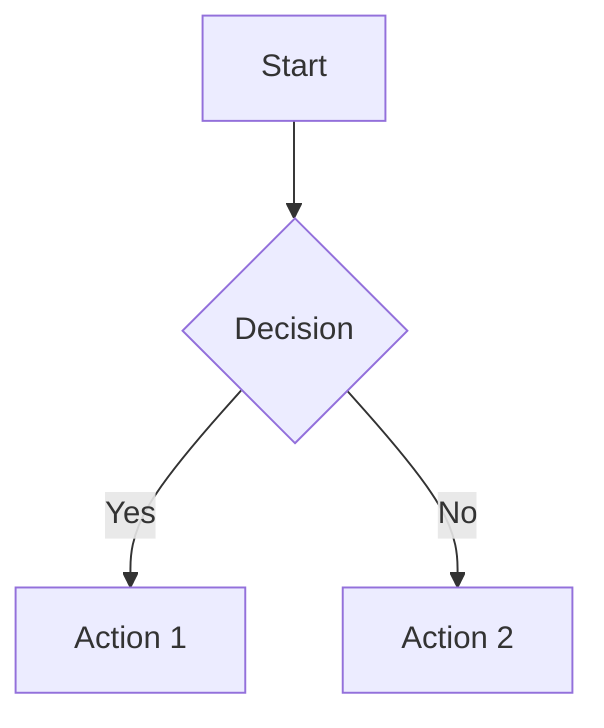

# Frequently Asked Questions (FAQ)

> **Version**: 1.0 S-Level
> **Created**: 2026-04-02
> **Status**: Active
> **Last Updated**: 2026-04-02

---

## Table of Contents

- [Frequently Asked Questions (FAQ)](#frequently-asked-questions-faq)
  - [Table of Contents](#table-of-contents)
  - [General Questions](#general-questions)
    - [What is the Go Knowledge Base?](#what-is-the-go-knowledge-base)
    - [Who is this for?](#who-is-this-for)
    - [Is this free to use?](#is-this-free-to-use)
    - [How is this different from Go's official documentation?](#how-is-this-different-from-gos-official-documentation)
  - [Getting Started](#getting-started)
    - [How do I start learning Go with this knowledge base?](#how-do-i-start-learning-go-with-this-knowledge-base)
    - [What's the fastest way to find a specific topic?](#whats-the-fastest-way-to-find-a-specific-topic)
    - [What should I read first?](#what-should-i-read-first)
    - [Are there video or interactive versions?](#are-there-video-or-interactive-versions)
  - [Navigation \& Usage](#navigation--usage)
    - [How do I navigate between related topics?](#how-do-i-navigate-between-related-topics)
    - [What's the difference between dimensions?](#whats-the-difference-between-dimensions)
    - [How do I use the learning paths?](#how-do-i-use-the-learning-paths)
    - [Can I download this for offline use?](#can-i-download-this-for-offline-use)
  - [Content Questions](#content-questions)
    - [What do S/A/B/C levels mean?](#what-do-sabc-levels-mean)
    - [Why do some documents have numbers (EC-001, FT-002)?](#why-do-some-documents-have-numbers-ec-001-ft-002)
    - [Are the code examples tested?](#are-the-code-examples-tested)
    - [How often is content updated?](#how-often-is-content-updated)
    - [What if I find an error?](#what-if-i-find-an-error)
  - [Contributing](#contributing)
    - [Can I contribute content?](#can-i-contribute-content)
    - [What types of contributions are needed?](#what-types-of-contributions-are-needed)
    - [Do I need to be a Go expert to contribute?](#do-i-need-to-be-a-go-expert-to-contribute)
    - [How long does review take?](#how-long-does-review-take)
    - [Will I get credit for my contributions?](#will-i-get-credit-for-my-contributions)
  - [Quality \& Standards](#quality--standards)
    - [How is content quality ensured?](#how-is-content-quality-ensured)
    - [Why are some documents so long?](#why-are-some-documents-so-long)
    - [Can I request a topic be covered?](#can-i-request-a-topic-be-covered)
    - [What's the difference between a topic and a pattern?](#whats-the-difference-between-a-topic-and-a-pattern)
  - [Technical Questions](#technical-questions)
    - [Why use Markdown instead of a wiki or website?](#why-use-markdown-instead-of-a-wiki-or-website)
    - [How are visual diagrams created?](#how-are-visual-diagrams-created)
  - [Knowledge Base Structure](#knowledge-base-structure)
    - [Why 5 dimensions?](#why-5-dimensions)
    - [Why are some topics in multiple places?](#why-are-some-topics-in-multiple-places)
    - [How do I find the "source of truth" for a concept?](#how-do-i-find-the-source-of-truth-for-a-concept)
    - [What's the difference between FT and LD documents?](#whats-the-difference-between-ft-and-ld-documents)
  - [Still Have Questions?](#still-have-questions)
    - [Contact \& Support](#contact--support)
    - [Related Documents](#related-documents)
  - [Document History](#document-history)

---

## General Questions

### What is the Go Knowledge Base?

The **Go Knowledge Base** is a comprehensive, production-grade technical documentation system covering the complete spectrum of Go development—from formal theory to practical engineering patterns.

```
┌─────────────────────────────────────────────────────────────────┐
│                    GO KNOWLEDGE BASE AT A GLANCE                │
├─────────────────────────────────────────────────────────────────┤
│                                                                  │
│   📚 567+ Documents         5 Dimensions of knowledge           │
│   📊 S/A/B/C Quality Levels  Complete Go 1.26 coverage          │
│   🔗 Extensive cross-refs   Theory + Practice combined          │
│   🎨 300+ Visualizations    Production-ready examples           │
│                                                                  │
└─────────────────────────────────────────────────────────────────┘
```

### Who is this for?

| Audience | Recommended Starting Point |
|----------|---------------------------|
| **Beginners** | [QUICK-START.md](./QUICK-START.md), [learning-paths/go-specialist.md](./learning-paths/go-specialist.md) |
| **Intermediate** | [INDEX.md](./INDEX.md) by topic, dimension 3-4 |
| **Advanced** | S-Level documents in dimensions 1-2, formal theory |
| **Engineers** | Pattern documents (EC-###), best practices |
| **Researchers** | Formal theory (FT-###), academic references |

### Is this free to use?

Yes! The Go Knowledge Base is provided under [Creative Commons Attribution-ShareAlike 4.0](https://creativecommons.org/licenses/by-sa/4.0/). You are free to:

- ✅ Use for personal or commercial purposes
- ✅ Share and redistribute
- ✅ Create derivative works
- ✅ Use in teaching and training

**Requirements**: Attribution and ShareAlike.

### How is this different from Go's official documentation?

| Aspect | Official Go Docs | Go Knowledge Base |
|--------|-----------------|-------------------|
| **Scope** | Language reference | Complete ecosystem |
| **Depth** | API documentation | Theory + practice |
| **Examples** | Minimal | Production-ready |
| **Cross-references** | Package-level | Full knowledge graph |
| **Formal content** | None | Mathematical foundations |
| **Patterns** | Not covered | Extensive |

**Relationship**: This knowledge base complements (does not replace) official documentation.

---

## Getting Started

### How do I start learning Go with this knowledge base?

**Recommended Path for Beginners**:

```
Week 1-2: Foundations
├── Read: QUICK-START.md
├── Read: 02-Language-Design/02-Language-Features/01-Type-System.md
├── Read: 02-Language-Design/02-Language-Features/03-Goroutines.md
└── Practice: examples/task-scheduler/

Week 3-4: Standard Library
├── Read: 04-Technology-Stack/01-Core-Library/04-Context-Package.md
├── Read: 04-Technology-Stack/01-Core-Library/03-HTTP-Package.md
└── Build: Simple HTTP service

Week 5-6: Patterns
├── Read: 03-Engineering-CloudNative/01-Methodology/
└── Read: EC-001 through EC-010
```

### What's the fastest way to find a specific topic?

**Three approaches**:

1. **By Index**: [INDEX.md](./INDEX.md) - Complete alphabetical listing
2. **By Topic**: [indices/by-topic.md](./indices/by-topic.md) - Organized by category
3. **By Difficulty**: [indices/by-difficulty.md](./indices/by-difficulty.md) - By skill level

### What should I read first?

**Choose based on your goal**:

```
Goal                      →  Start With
─────────────────────────────────────────
Learn Go basics           →  QUICK-START.md
Understand concurrency    →  02-Language-Design/02-Language-Features/03-Goroutines.md
Build microservices       →  EC-001-Microservices.md
Learn distributed systems →  01-Formal-Theory/FT-001-Distributed-Systems-Foundation-Formal.md
Prepare for interviews    →  05-Application-Domains/AD-010-System-Design-Interview.md
Find a specific pattern   →  indices/by-topic.md
```

### Are there video or interactive versions?

Currently, the knowledge base is text-based. However:

- Code examples are runnable (see `examples/`)
- Visual diagrams use Mermaid (renderable in many tools)
- Learning paths include hands-on exercises

**Future plans**: Video companions and interactive examples are on the [roadmap](./ROADMAP.md).

---

## Navigation & Usage

### How do I navigate between related topics?

Every document includes:

1. **Cross-References section** - Links to related documents
2. **Prerequisites** - What to read first
3. **Next Steps** - Where to go after
4. **See Also** - Related concepts

**Navigation Example**:

```markdown
## Cross-References

### Prerequisites
- [Go Memory Model](../02-Language-Design/LD-001-Go-Memory-Model-Formal.md)

### Related Topics
- [Channels](../02-Language-Features/04-Channels.md)
- [Select Statement](../02-Language-Features/12-Select-Statement.md)

### Next Steps
- [Advanced Concurrency Patterns](../EC-013-Concurrent-Patterns.md)
```

### What's the difference between dimensions?

| Dimension | Focus | Documents | Example Topics |
|-----------|-------|-----------|----------------|
| **01-Formal-Theory** | Mathematical foundations | 45 | CSP, consensus, type theory |
| **02-Language-Design** | Go internals | 42 | Runtime, scheduler, GC |
| **03-Engineering-CloudNative** | Patterns & practices | 320 | Microservices, resilience |
| **04-Technology-Stack** | Tools & libraries | 68 | Databases, frameworks |
| **05-Application-Domains** | Real-world domains | 52 | System design, security |

### How do I use the learning paths?

Learning paths ([learning-paths/](./learning-paths/)) are curated sequences:

```markdown
# Backend Engineer Path

## Phase 1: Foundations (Weeks 1-4)
1. [Document 1](../path) - Read and complete exercises
2. [Document 2](../path) - Focus on code examples
3. [Project](../path) - Build sample application

## Phase 2: Core Skills (Weeks 5-12)
...
```

**Tip**: Don't rush. Each phase builds on the previous.

### Can I download this for offline use?

Yes! The knowledge base is a Git repository:

```bash
# Clone for offline access
git clone https://github.com/[repo]/go-knowledge-base.git

# Or download as ZIP from GitHub
```

All documents are Markdown files viewable in any text editor or Markdown viewer.

---

## Content Questions

### What do S/A/B/C levels mean?

| Level | Size | Depth | Use For |
|-------|------|-------|---------|
| **S (Supreme)** | >15KB | Formal, proven | Reference, research |
| **A (Advanced)** | >10KB | Deep analysis | Professional learning |
| **B (Basic)** | >5KB | Solid coverage | Practical guidance |
| **C (Concise)** | >2KB | Basic info | Quick reference |

See [QUALITY-STANDARDS.md](./QUALITY-STANDARDS.md) for complete details.

### Why do some documents have numbers (EC-001, FT-002)?

These are **document identifiers**:

```
Format: XX-###-Descriptive-Name.md

XX   = Dimension prefix
###  = Sequential number
Name = Descriptive title

Examples:
- FT-002 = Formal Theory document #2
- LD-001 = Language Design document #1
- EC-007 = Engineering Cloud-Native document #7
- TS-001 = Technology Stack document #1
- AD-003 = Application Domains document #3
```

### Are the code examples tested?

**Quality-based testing**:

| Level | Code Testing |
|-------|--------------|
| S-Level | ✅ Production-tested with CI |
| A-Level | ✅ Runnable, manually verified |
| B-Level | ⚪ Basic examples, spot-checked |
| C-Level | ❌ May not include code |

**Running examples**:

```bash
# Most code examples in examples/ are complete projects
cd examples/task-scheduler
go mod download
go test ./...
```

### How often is content updated?

| Update Type | Frequency |
|-------------|-----------|
| Corrections | As needed |
| Go version updates | Within 2 weeks of release |
| Major content additions | Monthly |
| Quality upgrades | Quarterly |
| Full review | Yearly |

See [CHANGELOG.md](./CHANGELOG.md) for update history.

### What if I find an error?

1. **Small errors**: Open an issue with details
2. **Major errors**: Submit a PR with fix
3. **Missing content**: Suggest via issue or contribute

See [CONTRIBUTING.md](./CONTRIBUTING.md) for details.

---

## Contributing

### Can I contribute content?

Absolutely! We welcome contributions. See [CONTRIBUTING.md](./CONTRIBUTING.md) for:

- Content standards
- Document templates
- Review process
- Style guidelines

**Quick contribution guide**:

```
1. Check INDEX.md for existing coverage
2. Choose a quality level (S/A/B/C)
3. Use TEMPLATES.md for structure
4. Write following METHODOLOGY.md
5. Submit PR with quality checklist
```

### What types of contributions are needed?

| Priority | Need | Examples |
|----------|------|----------|
| 🔴 High | B→A upgrades | Expand basic documents |
| 🔴 High | Missing topics | Go 1.27 features, new libraries |
| 🟡 Medium | Code examples | Test existing examples |
| 🟡 Medium | Cross-references | Link related documents |
| 🟢 Low | C→B upgrades | Expand stub documents |

### Do I need to be a Go expert to contribute?

**No!** Different skill levels can contribute differently:

| Skill Level | Contribution Types |
|-------------|-------------------|
| **Beginner** | Typos, clarifications, beginner guides |
| **Intermediate** | Pattern documentation, tool guides |
| **Advanced** | Deep dives, architecture docs |
| **Expert** | Formal theory, verified benchmarks |

### How long does review take?

| Document Level | Review Time |
|----------------|-------------|
| C-Level | 2-3 days |
| B-Level | 3-5 days |
| A-Level | 5-7 days |
| S-Level | 1-2 weeks |

Urgent fixes (broken links, errors) are reviewed faster.

### Will I get credit for my contributions?

Yes! Contributors are:

- Listed in commit history
- Recognized in release notes
- Featured in [CONTRIBUTING.md](./CONTRIBUTING.md) (regular contributors)

---

## Quality & Standards

### How is content quality ensured?

**Four-gate quality system**:

```
┌──────────┐    ┌──────────┐    ┌──────────┐    ┌──────────┐
│ Automated│───►│  Peer    │───►│  Expert  │───►│  Final   │
│  Checks  │    │  Review  │    │  Review  │    │  Approval│
└──────────┘    └──────────┘    └──────────┘    └──────────┘
     │               │               │               │
     ▼               ▼               ▼               ▼
 Links, format   General check   Domain expert   Maintainer
 Size validation Content review  Technical check   sign-off
```

### Why are some documents so long?

S-Level documents (>15KB) include:

- Formal definitions and proofs
- Multiple visual representations
- Extensive code examples
- Real-world case studies
- Comprehensive cross-references

**Example**: FT-002-Raft-Consensus-Formal.md includes TLA+ specifications, proof sketches, complete implementation, and comparison with Paxos.

### Can I request a topic be covered?

Yes! Open an issue with:

- Topic description
- Why it should be covered
- Suggested level (S/A/B)
- Your willingness to contribute (if any)

### What's the difference between a topic and a pattern?

| Aspect | Topic | Pattern |
|--------|-------|---------|
| **Definition** | Subject matter | Reusable solution |
| **Examples** | "Go Garbage Collector" | "Circuit Breaker Pattern" |
| **Content** | How it works | How to solve problem |
| **Level** | Any | Usually A-Level or above |

---

## Technical Questions

### Why use Markdown instead of a wiki or website?

**Markdown advantages**:

- ✅ Version controlled (Git)
- ✅ Offline accessible
- ✅ Universal format
- ✅ Diff-friendly (easy reviews)
- ✅ Tooling ecosystem
- ✅ Long-term archival

**Future**: Website generation from Markdown is on the roadmap.

### How are visual diagrams created?

**Two formats**:

1. **ASCII Art** - Plain text diagrams (universal)
2. **Mermaid** - Markdown-compatible diagrams

```markdown


```

See [VISUAL-TEMPLATES.md](./VISUAL-TEMPLATES.md) for templates.

### Can I use this content in my project/presentation/course?

Yes, under these conditions:

| Use | Allowed | Requirement |
|-----|---------|-------------|
| Personal learning | ✅ Yes | None |
| Commercial project | ✅ Yes | Attribution |
| Teaching course | ✅ Yes | Attribution + ShareAlike |
| Book/publication | ✅ Yes | Attribution + ShareAlike |
| Derivative work | ✅ Yes | Same license |

**Attribution format**:
```

Content from Go Knowledge Base (<https://github.com/[repo>])
Licensed under CC BY-SA 4.0

```

### Is there an API or programmatic access?

Not yet. The content is plain Markdown files. However:

```bash
# You can parse locally
find go-knowledge-base -name "*.md" -exec grep -l "topic" {} \;

# Or use standard Markdown tools
cat file.md | pandoc -f markdown -t html
```

**Future**: REST API and search endpoint are planned (see [ROADMAP.md](./ROADMAP.md)).

---

## Knowledge Base Structure

### Why 5 dimensions?

The five dimensions represent distinct knowledge categories:

```
┌─────────────────────────────────────────────────────────────────┐
│                    KNOWLEDGE DIMENSIONS                          │
├─────────────────────────────────────────────────────────────────┤
│                                                                  │
│  01-Formal-Theory         Theoretical foundations               │
│       ↓                   (Why things work)                      │
│  02-Language-Design       Language internals                    │
│       ↓                   (How Go works)                         │
│  03-Engineering-CloudNative  Engineering practices              │
│       ↓                   (How to build systems)                 │
│  04-Technology-Stack      Tools and libraries                   │
│       ↓                   (What to use)                          │
│  05-Application-Domains   Real-world domains                    │
│                           (Where to apply)                       │
│                                                                  │
└─────────────────────────────────────────────────────────────────┘
```

### Why are some topics in multiple places?

Some concepts appear in multiple dimensions with different perspectives:

| Topic | Dimension 1 (Theory) | Dimension 2 (Language) | Dimension 3 (Engineering) |
|-------|---------------------|----------------------|--------------------------|
| **Channels** | CSP formal semantics | Channel implementation | Concurrent patterns |
| **Context** | Cancellation theory | context package | Request handling |
| **GC** | Memory management theory | Garbage collector | Performance tuning |

Cross-references link these perspectives together.

### How do I find the "source of truth" for a concept?

**Primary documents by concept type**:

| Concept Type | Primary Source | Example |
|--------------|----------------|---------|
| **Language feature** | Go Specification | GoSpec for channels |
| **Runtime behavior** | Source code + LD docs | runtime/proc.go + LD-002 |
| **Pattern** | Pattern document | EC-007 for circuit breaker |
| **Algorithm** | Academic paper + implementation | [Ongaro14] + FT-002 |

### What's the difference between FT and LD documents?

| Aspect | FT (Formal Theory) | LD (Language Design) |
|--------|-------------------|---------------------|
| **Focus** | Mathematical foundations | Go implementation |
| **Content** | Proofs, theorems, formalisms | Internals, algorithms |
| **Audience** | Researchers, theorists | Advanced practitioners |
| **Examples** | FT-002 (Raft formal) | LD-002 (GMP scheduler) |

---

## Still Have Questions?

### Contact & Support

| Channel | Best For |
|---------|----------|
| **GitHub Issues** | Bug reports, content errors |
| **GitHub Discussions** | Questions, suggestions |
| **Pull Requests** | Content contributions |

### Related Documents

- [README.md](./README.md) - Overview
- [CONTRIBUTING.md](./CONTRIBUTING.md) - How to contribute
- [QUALITY-STANDARDS.md](./QUALITY-STANDARDS.md) - Quality definitions
- [GLOSSARY.md](./GLOSSARY.md) - Terminology
- [INDEX.md](./INDEX.md) - Complete document list

---

## Document History

| Version | Date | Changes | Author |
|---------|------|---------|--------|
| 1.0 | 2026-04-02 | Initial comprehensive FAQ | Knowledge Base Team |

---

*Can't find your question? Open an issue and we'll add it!*
