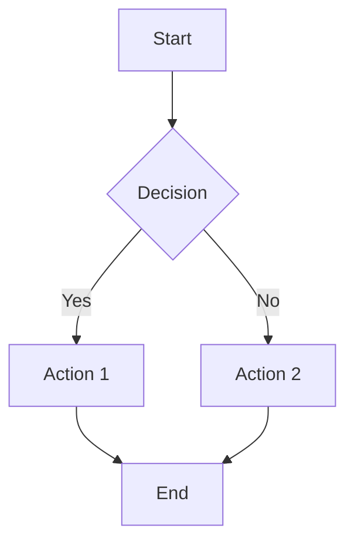

# Documentation Methodology

> **Version**: 1.0 S-Level
> **Created**: 2026-04-02
> **Status**: Active
> **Applies to**: All Documentation

---

## Table of Contents

1. [Methodology Overview](#methodology-overview)
2. [Research Methodology](#research-methodology)
3. [Writing Methodology](#writing-methodology)
4. [Review Methodology](#review-methodology)
5. [Visual Representation Methodology](#visual-representation-methodology)
6. [Quality Assurance Methodology](#quality-assurance-methodology)
7. [Maintenance Methodology](#maintenance-methodology)
8. [Tooling & Automation](#tooling--automation)

---

## Methodology Overview

### Documentation Philosophy

```
┌─────────────────────────────────────────────────────────────────┐
│              DOCUMENTATION PHILOSOPHY                           │
├─────────────────────────────────────────────────────────────────┤
│                                                                  │
│   "Documentation is not an afterthought—it is a first-class     │
│   artifact that requires the same rigor as code."               │
│                                                                  │
│   Principles:                                                   │
│   ├── Evidence-Based: Every claim requires a source            │
│   ├── Progressive Disclosure: Complexity revealed gradually    │
│   ├── Multi-Modal: Text, code, and visuals work together       │
│   ├── Interconnected: Concepts link to related knowledge       │
│   └── Living: Continuously updated and improved                │
│                                                                  │
└─────────────────────────────────────────────────────────────────┘
```

### Methodology Framework

```
Documentation Lifecycle:

┌──────────┐    ┌──────────┐    ┌──────────┐    ┌──────────┐
│ RESEARCH │───►│  WRITE   │───►│  REVIEW  │───►│ PUBLISH  │
└────┬─────┘    └────┬─────┘    └────┬─────┘    └────┬─────┘
     │               │               │               │
     ▼               ▼               ▼               ▼
┌──────────┐    ┌──────────┐    ┌──────────┐    ┌──────────┐
│ Sources  │    │ Draft    │    │ Feedback │    │ Monitor  │
│ Analysis │    │ Iterate  │    │ Revise   │    │ Update   │
└──────────┘    └──────────┘    └──────────┘    └──────────┘
```

---

## Research Methodology

### Source Hierarchy

```
Source Reliability Pyramid:

                    ┌─────────┐
                    │Primary  │  Go source code, language spec
                    │Sources  │  RFCs, academic papers
                    ├─────────┤
                    │Official │  Go blog, documentation,
                    │Channels │  maintainer talks
                    ├─────────┤
                    │Expert   │  Books by language creators
                    │Authors  │  Verified expert blogs
                    ├─────────┤
                    │Community│  Well-maintained projects
                    │Verified │  Community consensus
                    ├─────────┤
                    │Reference│  Stack Overflow, tutorials
                    │Materials│  (cross-verify before use)
                    └─────────┘
```

### Research Process

```
Research Workflow:

1. DEFINE
   └── Scope the topic boundaries
   └── Identify key questions
   └── Set quality target (S/A/B/C)

2. GATHER
   └── Collect primary sources
   └── Find academic references
   └── Review official documentation
   └── Examine implementation code

3. VERIFY
   └── Cross-reference claims
   └── Test code examples
   └── Validate benchmarks
   └── Check version compatibility

4. SYNTHESIZE
   └── Organize findings
   └── Identify patterns
   └── Note contradictions
   └── Form conclusions

5. DOCUMENT
   └── Record sources
   └── Note confidence levels
   └── Flag areas needing review
```

### Source Documentation

**Citation Format**:

```markdown
## References

### Primary Sources
[1] Go Language Specification. https://go.dev/ref/spec
[2] Go Memory Model. https://go.dev/ref/mem

### Academic
[3] Griesemer, R., et al. (2020). Featherweight Go. OOPSLA.

### Official
[4] Go Team. (2026). Go 1.26 Release Notes. Go Blog.

### Implementation
[5] Go Source: runtime/proc.go (go1.26.1)
```

### Research Checklist

| Stage | Task | Verification |
|-------|------|--------------|
| **Gather** | Find 3+ primary sources | Source list documented |
| **Verify** | Cross-check key facts | Against 2+ sources |
| **Test** | Run all code | In specified Go version |
| **Measure** | Validate benchmarks | With reproducible method |
| **Document** | Record all sources | In References section |

---

## Writing Methodology

### Document Structure Method

```
Progressive Disclosure Pattern:

Level 1: Executive Summary (TL;DR)
    │
    ▼
Level 2: Core Concepts (Must know)
    │
    ▼
Level 3: Detailed Explanation (Should know)
    │
    ▼
Level 4: Advanced Topics (Nice to know)
    │
    ▼
Level 5: Formal Theory (Deep dive)
```

### Writing Process

```
Drafting Iterations:

Draft 1: Structure     Draft 2: Content      Draft 3: Polish
┌──────────────┐      ┌──────────────┐      ┌──────────────┐
│ • Outline    │      │ • Full text  │      │ • Refine     │
│ • Headers    │─────►│ • Examples   │─────►│ • Visuals    │
│ • Key points │      │ • Citations  │      │ • Cross-refs │
└──────────────┘      └──────────────┘      └──────────────┘
       │                     │                     │
       ▼                     ▼                     ▼
   10% complete          60% complete          90% complete
```

### Content Development Checklist

**Per Section**:

```markdown
- [ ] Clear heading hierarchy
- [ ] Opening paragraph states purpose
- [ ] Key concepts defined on first use
- [ ] Visual representation included
- [ ] Code example (if applicable)
- [ ] Connection to previous sections
- [ ] Transition to next section
```

### Writing Style Guidelines

| Aspect | Guideline | Example |
|--------|-----------|---------|
| **Sentence Length** | <25 words average | "Go uses goroutines." not "Go uses a mechanism called goroutines which are lightweight threads managed by the Go runtime." |
| **Paragraph Length** | 3-5 sentences | Keep focused on single idea |
| **Active Voice** | 80%+ active | "The scheduler assigns..." not "Assignment is done by..." |
| **Technical Terms** | Define on first use | "Goroutine (lightweight concurrent execution unit)" |
| **Examples** | Concrete before abstract | Show code, then explain theory |

### Section Templates

**Introduction Template**:

```markdown
## Introduction

[What this document covers in 1-2 sentences]

### Who Should Read This

- [Audience 1 with prerequisite]
- [Audience 2 with prerequisite]

### What You'll Learn

1. [Key takeaway 1]
2. [Key takeaway 2]
3. [Key takeaway 3]

### Prerequisites

- [Required knowledge]
- [Required knowledge]
```

**Concept Explanation Template**:

```markdown
## [Concept Name]

### Definition

[Formal or precise definition]

### Why It Matters

[Practical importance]

### How It Works

[Explanation with visual]

```

[ASCII or Mermaid diagram]

```

### Example

```go
[Runnable code example]
```

### Common Patterns

| Pattern | Use Case | Example |
|---------|----------|---------|

```

---

## Review Methodology

### Review Stages

```

Review Pipeline:

┌─────────────┐    ┌─────────────┐    ┌─────────────┐    ┌─────────────┐
│   Author    │───►│   Peer      │───►│   Expert    │───►│   Final     │
│   Self      │    │   Review    │    │   Review    │    │   Approval  │
│   Review    │    │             │    │             │    │             │
└─────────────┘    └─────────────┘    └─────────────┘    └─────────────┘
      │                  │                  │                  │
      ▼                  ▼                  ▼                  ▼
   Checklist         Feedback           Validation         Merge
   Automated         (2 reviewers)      (domain expert)    decision

```

### Review Checklist

**Content Accuracy (40%)**:

```markdown
- [ ] Technical claims verified against sources
- [ ] Code examples compile and run
- [ ] Benchmarks reproducible
- [ ] Version information accurate
- [ ] No outdated practices
```

**Structure & Flow (20%)**:

```markdown
- [ ] Logical progression of ideas
- [ ] Clear section hierarchy
- [ ] Adequate transitions
- [ ] TOC matches content
- [ ] Appropriate depth for level
```

**Presentation (25%)**:

```markdown
- [ ] Visuals clear and relevant
- [ ] Code properly formatted
- [ ] Tables used appropriately
- [ ] Consistent formatting
- [ ] Readable on mobile
```

**Completeness (15%)**:

```markdown
- [ ] All promised topics covered
- [ ] Cross-references included
- [ ] References complete
- [ ] Examples sufficient
- [ ] Edge cases addressed
```

### Review Types

| Type | Focus | When Required | Timeline |
|------|-------|---------------|----------|
| **Automated** | Links, format, size | Every PR | Immediate |
| **Peer** | General quality, clarity | All docs | 2-3 days |
| **Technical** | Accuracy, depth | S-level, complex | 5-7 days |
| **Final** | Overall approval | Before merge | 1 day |

---

## Visual Representation Methodology

### Visual Selection Framework

```
Visual Selection Decision Tree:

What do you need to show?
│
├── Static Structure?
│   ├── Hierarchical → Tree/层次图
│   ├── Components → Box diagram
│   └── Relationships → Concept map
│
├── Dynamic Process?
│   ├── Sequence → Sequence diagram
│   ├── Flow → Flowchart
│   └── State → State machine
│
├── Comparison?
│   ├── Multiple items → Comparison matrix
│   ├── Decision → Decision tree
│   └── Ranking → Chart
│
└── Data?
    ├── Trends → Line chart
    ├── Distribution → Bar/histogram
    └── Proportions → Pie chart
```

### Visual Standards

**ASCII Art Guidelines**:

```
✓ Use box-drawing characters for clarity
✓ Keep width ≤80 characters
✓ Use consistent spacing
✓ Label all components
✗ Avoid complex ASCII when Mermaid available
```

**Mermaid Guidelines**:

```markdown


```

### Visual Requirements by Level

| Level | Minimum Visuals | Types Required |
|-------|-----------------|----------------|
| **S** | 3 | Concept map + 2 others |
| **A** | 2 | Any two types |
| **B** | 1 | Any type |
| **C** | 0 | Optional |

---

## Quality Assurance Methodology

### Quality Gates

```

Quality Gate Pipeline:

PR Opened
    │
    ▼
┌─────────────┐
│  Gate 1:    │───Fail──► Request changes
│  Automated  │
│  Checks     │───Pass──►
└─────────────┘           │
                          ▼
                   ┌─────────────┐
                   │  Gate 2:    │───Fail──► Request changes
                   │  Peer       │
                   │  Review     │
                   └─────────────┘───Pass──►
                                     │
                                     ▼
                              ┌─────────────┐
                              │  Gate 3:    │───Fail──► Request changes
                              │  Expert     │
                              │  Review     │
                              └─────────────┘───Pass──►
                                                    │
                                                    ▼
                                             ┌─────────────┐
                                             │  Gate 4:    │───Fail──► Request changes
                                             │  Final      │
                                             │  Approval   │
                                             └─────────────┘───Pass──► Merge

```

### Quality Metrics

| Metric | Target | Measurement |
|--------|--------|-------------|
| **Accuracy** | 99% | Expert review |
| **Completeness** | 100% of outline | Checklist |
| **Clarity** | 4.5/5 | Reader survey |
| **Technical Depth** | Appropriate for level | Reviewer rating |
| **Visual Quality** | 4/5 | Reviewer rating |

### Continuous Improvement

```

Improvement Cycle:

     ┌───────────┐
     │  Measure  │
     │  Quality  │
     └─────┬─────┘
           │
           ▼
     ┌───────────┐
     │  Identify │
     │  Issues   │
     └─────┬─────┘
           │
           ▼
     ┌───────────┐
     │  Prioritize│
     │  Fixes    │
     └─────┬─────┘
           │
           ▼
     ┌───────────┐
     │  Implement│
     │  Changes  │
     └─────┬─────┘
           │
           └────────► Repeat

```

---

## Maintenance Methodology

### Maintenance Categories

| Type | Frequency | Action |
|------|-----------|--------|
| **Active** | As needed | Content updates, fixes |
| **Scheduled** | Monthly | Link checking, freshness |
| **Periodic** | Quarterly | Quality audits, reviews |
| **Major** | Yearly | Restructuring, deprecations |

### Content Freshness

```

Freshness Levels:

🔴 Stale (>2 years)     🟡 Aging (1-2 years)     🟢 Current (<1 year)

```

**Review Triggers**:
- New Go version released
- Dependency major update
- Community reports error
- Automated freshness alert

### Update Process

```

Content Update Workflow:

1. IDENTIFY
   └── Trigger: Version change / Error report / Scheduled review
   └── Scope: Single doc or category

2. ASSESS
   └── What's outdated?
   └── What's missing?
   └── What can be improved?

3. PLAN
   └── Changes needed
   └── Resources required
   └── Timeline

4. UPDATE
   └── Make changes
   └── Update examples
   └── Refresh visuals

5. VERIFY
   └── Test code
   └── Review changes
   └── Update metadata

6. PUBLISH
   └── PR creation
   └── Review
   └── Merge

```

---

## Tooling & Automation

### Documentation Tools

| Tool | Purpose | Usage |
|------|---------|-------|
| **Markdown** | Source format | All documents |
| **Mermaid** | Diagrams | Visual representations |
| **Go Playground** | Code testing | Example verification |
| **Lychee** | Link checking | CI validation |
| **Vale** | Style linting | Writing consistency |

### Automation Pipeline

```

CI/CD Pipeline:

Push to PR
    │
    ▼
┌──────────────┐
│ Lint Markdown │───► Vale style checks
└──────────────┘
    │
    ▼
┌──────────────┐
│ Check Links  │───► Lychee link validation
└──────────────┘
    │
    ▼
┌──────────────┐
│ Test Code    │───► Run code examples
└──────────────┘
    │
    ▼
┌──────────────┐
│ Size Check   │───► Verify level requirements
└──────────────┘
    │
    ▼
┌──────────────┐
│ Report       │───► Post results to PR
└──────────────┘

```

### Quality Automation

```yaml
# Example CI configuration
quality_checks:
  - name: markdown-lint
    tool: markdownlint
    config: .markdownlint.json

  - name: link-check
    tool: lychee
    args: --timeout 30

  - name: code-test
    tool: go test
    path: examples/

  - name: size-check
    script: scripts/check-size.sh
```

---

## Document History

| Version | Date | Changes | Author |
|---------|------|---------|--------|
| 1.0 | 2026-04-02 | Initial S-level methodology document | Knowledge Base Team |

---

*This methodology is applied to all documents in the knowledge base. For contribution guidelines, see [CONTRIBUTING.md](./CONTRIBUTING.md).*
