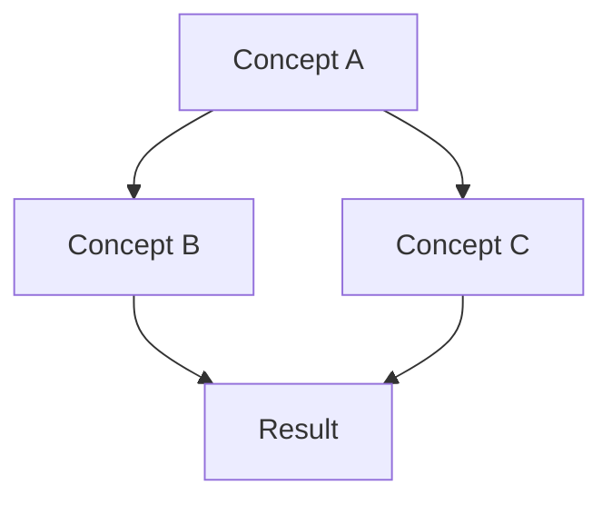
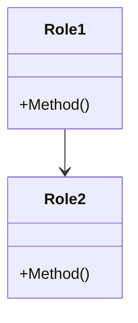

# Document Templates

> **Version**: 1.0 S-Level
> **Created**: 2026-04-02
> **Status**: Active
> **Applies to**: All New Documentation

---

## Table of Contents

1. [Template Overview](#template-overview)
2. [Theory Document Template](#theory-document-template)
3. [Pattern Document Template](#pattern-document-template)
4. [Technology Guide Template](#technology-guide-template)
5. [Comparison Document Template](#comparison-document-template)
6. [Tutorial Template](#tutorial-template)
7. [Header Templates](#header-templates)
8. [Section Templates](#section-templates)
9. [Visual Templates](#visual-templates)

---

## Template Overview

### Template Selection Guide

```
Template Selection Decision Tree:

What type of content are you creating?
│
├── Mathematical concept, formal system, or proof?
│   └── Use: Theory Document Template
│
├── Design pattern, architecture approach, or best practice?
│   └── Use: Pattern Document Template
│
├── Specific tool, library, or technology?
│   └── Use: Technology Guide Template
│
├── Comparing multiple options or approaches?
│   └── Use: Comparison Document Template
│
└── Step-by-step learning material?
    └── Use: Tutorial Template
```

### Template Structure Overview

| Template | Best For | Target Level | Min Size |
|----------|----------|--------------|----------|
| Theory | Formal concepts, proofs | S | 15KB |
| Pattern | Design patterns, practices | A | 10KB |
| Technology | Tools, libraries | A | 10KB |
| Comparison | Technology choices | B | 5KB |
| Tutorial | Learning material | B | 5KB |

---

## Theory Document Template

**Purpose**: Formal theory, mathematical foundations, proofs

**Target**: S-Level (15KB+)

```markdown
# [Concept Name] Formal Specification

> **Version**: 1.0 S-Level
> **Created**: YYYY-MM-DD
> **Status**: Complete
> **Prerequisites**: [List prerequisites]
> **Estimated Reading Time**: XX minutes

---

## Table of Contents

1. [Executive Summary](#executive-summary)
2. [Introduction](#introduction)
3. [Formal Definitions](#formal-definitions)
4. [Theorems and Proofs](#theorems-and-proofs)
5. [Applications](#applications)
6. [Visual Representations](#visual-representations)
7. [Implementation](#implementation)
8. [Related Work](#related-work)
9. [Cross-References](#cross-references)
10. [References](#references)

---

## Executive Summary

[2-3 paragraph overview for experts who want the key points quickly]

**Key Insights**:
- [Key point 1]
- [Key point 2]
- [Key point 3]

---

## Introduction

### Motivation

[Why this concept matters]

### Scope

[What this document covers and doesn't cover]

### Prerequisites

- [Required knowledge with links]
- [Required knowledge with links]

---

## Formal Definitions

### Definition 1.1: [Concept Name]

[Formal mathematical definition]

```

[Concept] = ⟨[Property 1], [Property 2], ...⟩

where:

- [Property 1] ∈ [Domain]: [Explanation]
- [Property 2] ∈ [Domain]: [Explanation]

```

### Definition 1.2: [Related Concept]

[Additional definitions as needed]

### Notation

| Symbol | Meaning |
|--------|---------|
| [Symbol] | [Meaning] |
| [Symbol] | [Meaning] |

---

## Theorems and Proofs

### Theorem 2.1: [Theorem Name]

**Statement**: [Formal theorem statement]

**Proof**:

1. [Step 1 with justification]
2. [Step 2 with justification]
   - [Sub-step if needed]
   - [Sub-step if needed]
3. [Step 3 with justification]

Therefore, [conclusion]. ∎

### Theorem 2.2: [Theorem Name]

[Additional theorems as needed]

---

## Applications

### Application 1: [Use Case]

[How this theory applies in practice]

```go
// Code example demonstrating application
```

### Application 2: [Use Case]

[Additional applications]

---

## Visual Representations

### Concept Map

```
[ASCII concept map showing relationships]
```

### Formal Diagram



### Comparison Matrix

| Property | Approach A | Approach B | Approach C |
|----------|------------|------------|------------|
| Property 1 | Value | Value | Value |
| Property 2 | Value | Value | Value |

---

## Implementation

### Algorithm

```go
// Production-ready implementation
package example

// [Function name] implements [concept].
//
// Time complexity: O(?)
// Space complexity: O(?)
func Implementation(params) (Result, error) {
    // Implementation with comments
}
```

### Testing

```go
// Comprehensive test suite
func TestImplementation(t *testing.T) {
    // Test cases
}
```

---

## Related Work

### Alternative Approaches

| Approach | Paper/Source | Key Difference |
|----------|--------------|----------------|
| [Name] | [Citation] | [Difference] |

### Historical Development

1. [Year]: [Milestone]

---

## Cross-References

### Prerequisites

- [Prerequisite 1](../path)
- [Prerequisite 2](../path)

### Related Topics

- [Related 1](../path) - [Brief description]
- [Related 2](../path) - [Brief description]

### Next Steps

- [Follow-up 1](../path)
- [Follow-up 2](../path)

---

## References

### Primary Sources

[1] [Author]. ([Year]). [Title]. [Venue/Source].
[2] [Go Specification/Reference]. [URL]

### Implementation References

[3] [Go Source File]. [Line numbers if applicable]
[4] [Library Documentation]. [URL]

### Further Reading

[5] [Related book/paper]

---

## Document History

| Version | Date | Changes | Author |
|---------|------|---------|--------|
| 1.0 | YYYY-MM-DD | Initial S-level document | [Name] |

```

---

## Pattern Document Template

**Purpose**: Design patterns, architecture patterns, best practices

**Target**: A-Level (10KB+)

```markdown
# [Pattern Name]

> **Version**: 1.0 A-Level
> **Type**: [Creational/Structural/Behavioral/Architectural]
> **Difficulty**: [Beginner/Intermediate/Advanced]
> **Status**: Complete

---

## Table of Contents

1. [Intent](#intent)
2. [Motivation](#motivation)
3. [Applicability](#applicability)
4. [Structure](#structure)
5. [Implementation](#implementation)
6. [Examples](#examples)
7. [Considerations](#considerations)
8. [Related Patterns](#related-patterns)

---

## Intent

[One-paragraph statement of the pattern's purpose]

**Also Known As**: [Alternative names]

---

## Motivation

### Problem

[Describe the problem this pattern solves]

### Solution

[How this pattern solves the problem]

### Consequences

**Benefits**:
- [Benefit 1]
- [Benefit 2]

**Trade-offs**:
- [Trade-off 1]
- [Trade-off 2]

---

## Applicability

### When to Use

- [Use case 1]
- [Use case 2]

### When Not to Use

- [Anti-use case 1]
- [Anti-use case 2]

### Decision Tree

```

Should you use [Pattern]?
│
├── Do you have [condition]?
│   ├── Yes → [Pattern] may help
│   └── No → Consider [alternative]
│
└── Is [constraint] important?
    ├── Yes → [Pattern] is recommended
    └── No → [Alternative] might be simpler

```

---

## Structure

### Participants

| Role | Responsibility |
|------|----------------|
| [Role 1] | [What it does] |
| [Role 2] | [What it does] |

### Collaboration

```

[ASCII sequence diagram or collaboration diagram]

```

### Architecture



---

## Implementation

### Basic Implementation

```go
// Minimal working example
package pattern

// [Component] represents [role]
type Component struct {
    // fields
}

// Method implements [behavior]
func (c *Component) Method() {
    // implementation
}
```

### Production Implementation

```go
// Full-featured implementation
package pattern

// With error handling, configuration, etc.
```

### Variations

#### Variation 1: [Name]

[Description and code]

#### Variation 2: [Name]

[Description and code]

---

## Examples

### Example 1: [Scenario]

[Description of real-world use case]

```go
// Complete example
```

### Example 2: [Scenario]

[Additional example]

---

## Considerations

### Performance

| Metric | Value | Notes |
|--------|-------|-------|
| Time Complexity | O(?) | [Explanation] |
| Space Complexity | O(?) | [Explanation] |

### Concurrency

[Thread-safety considerations]

### Testing

[How to test this pattern]

### Common Pitfalls

1. [Pitfall 1] - [Solution]
2. [Pitfall 2] - [Solution]

---

## Related Patterns

### Similar Patterns

| Pattern | Difference | When to Choose |
|---------|------------|----------------|
| [Pattern A] | [Difference] | [Guidance] |
| [Pattern B] | [Difference] | [Guidance] |

### Complementary Patterns

- [Pattern X](../path) - [How they work together]
- [Pattern Y](../path) - [How they work together]

---

## References

1. [Design Patterns Book]
2. [Go-specific reference]

---

## Document History

| Version | Date | Changes | Author |
|---------|------|---------|--------|
| 1.0 | YYYY-MM-DD | Initial A-level document | [Name] |

```

---

## Technology Guide Template

**Purpose**: Tools, libraries, frameworks

**Target**: A-Level (10KB+)

```markdown
# [Technology Name] Guide

> **Version**: X.Y (Technology version)
> **Document Version**: 1.0 A-Level
> **Category**: [Database/Web/Framework/etc]
> **Status**: Complete

---

## Table of Contents

1. [Overview](#overview)
2. [Installation](#installation)
3. [Core Concepts](#core-concepts)
4. [API Reference](#api-reference)
5. [Best Practices](#best-practices)
6. [Performance](#performance)
7. [Integration](#integration)
8. [Troubleshooting](#troubleshooting)

---

## Overview

### What is [Technology]?

[1-2 paragraph description]

### When to Use

- [Use case 1]
- [Use case 2]

### When Not to Use

- [Anti-use case 1]
- [Anti-use case 2]

### Alternatives

| Technology | Use When |
|------------|----------|
| [Alternative 1] | [Scenario] |
| [Alternative 2] | [Scenario] |

---

## Installation

### Requirements

- Go 1.XX or higher
- [Other requirements]

### Setup

```bash
go get [package]
```

### Configuration

```go
// Configuration example
```

### Verification

```bash
# Test installation
```

---

## Core Concepts

### Concept 1: [Name]

[Explanation with example]

```go
// Example code
```

### Concept 2: [Name]

[Explanation with example]

---

## API Reference

### Type: [TypeName]

```go
type TypeName struct {
    Field Type
}
```

| Field | Type | Description |
|-------|------|-------------|
| Field | Type | Description |

### Function: [FunctionName]

```go
func FunctionName(param Type) (Result, error)
```

**Parameters**:

- `param`: [Description]

**Returns**:

- `Result`: [Description]
- `error`: [When error occurs]

**Example**:

```go
// Usage example
```

---

## Best Practices

### Do's

1. **[Practice 1]**
   - [Explanation]
   - [Code example]

2. **[Practice 2]**
   - [Explanation]
   - [Code example]

### Don'ts

1. **[Anti-pattern 1]**
   - [Why it's bad]
   - [Better alternative]

---

## Performance

### Benchmarks

| Operation | Time | Memory |
|-----------|------|--------|
| Operation 1 | X ms | Y MB |
| Operation 2 | X ms | Y MB |

### Tuning

[Performance optimization tips]

### Scalability

[How it scales with load]

---

## Integration

### With [Related Technology]

```go
// Integration example
```

### Common Patterns

[Integration patterns]

---

## Troubleshooting

### Common Issues

| Issue | Cause | Solution |
|-------|-------|----------|
| [Issue 1] | [Cause] | [Solution] |
| [Issue 2] | [Cause] | [Solution] |

### Debugging

[Debugging tips]

---

## References

1. [Official Documentation](https://)
2. [GitHub Repository](https://)
3. [Go Doc](https://pkg.go.dev/)

---

## Document History

| Version | Date | Changes | Author |
|---------|------|---------|--------|
| 1.0 | YYYY-MM-DD | Initial guide | [Name] |

```

---

## Comparison Document Template

**Purpose**: Technology/approach comparisons

**Target**: B-Level (5KB+)

```markdown
# [Topic] Comparison: [Option A] vs [Option B]

> **Version**: 1.0 B-Level
> **Status**: Complete
> **Last Updated**: YYYY-MM-DD

---

## Table of Contents

1. [Executive Summary](#executive-summary)
2. [Overview](#overview)
3. [Detailed Comparison](#detailed-comparison)
4. [Decision Guide](#decision-guide)
5. [Recommendations](#recommendations)
6. [References](#references)

---

## Executive Summary

[2-3 sentence summary of which to choose when]

---

## Overview

### [Option A]

[1 paragraph description]

**Best For**: [Use cases]

### [Option B]

[1 paragraph description]

**Best For**: [Use cases]

---

## Detailed Comparison

### Comparison Matrix

| Dimension | [Option A] | [Option B] | Winner |
|-----------|------------|------------|--------|
| **Performance** | [Assessment] | [Assessment] | [A/B/Tie] |
| **Ease of Use** | [Assessment] | [Assessment] | [A/B/Tie] |
| **Flexibility** | [Assessment] | [Assessment] | [A/B/Tie] |
| **Community** | [Assessment] | [Assessment] | [A/B/Tie] |
| **Maturity** | [Assessment] | [Assessment] | [A/B/Tie] |

### Feature Comparison

| Feature | [Option A] | [Option B] |
|---------|------------|------------|
| Feature 1 | ✅ | ✅ |
| Feature 2 | ✅ | ❌ |
| Feature 3 | ⚠️ Partial | ✅ |

### Performance Comparison

```

Benchmark Results:

[Option A]  ████████████████░░░░  150ms
[Option B]  ████████████░░░░░░░░  120ms

[Option A]  ████████░░░░░░░░░░░░  50MB
[Option B]  ████████████░░░░░░░░  80MB

```

### Code Comparison

#### Option A

```go
// Option A code example
```

#### Option B

```go
// Option B code example
```

---

## Decision Guide

### Choose [Option A] When

- [Condition 1]
- [Condition 2]
- [Condition 3]

### Choose [Option B] When

- [Condition 1]
- [Condition 2]
- [Condition 3]

### Decision Tree

```
Which to choose?
│
├── Is [factor] critical?
│   ├── Yes → [Option A]
│   └── No → Continue
│
├── Do you need [feature]?
│   ├── Yes → [Option B]
│   └── No → Continue
│
└── Default recommendation → [Option A]
```

---

## Recommendations

### For Beginners

[Recommendation with reasoning]

### For Production

[Recommendation with reasoning]

### For [Specific Use Case]

[Recommendation with reasoning]

---

## References

1. [Option A Documentation](https://)
2. [Option B Documentation](https://)
3. [Benchmark Source](https://)

---

## Document History

| Version | Date | Changes | Author |
|---------|------|---------|--------|
| 1.0 | YYYY-MM-DD | Initial comparison | [Name] |

```

---

## Tutorial Template

**Purpose**: Step-by-step learning material

**Target**: B-Level (5KB+)

```markdown
# [Topic] Tutorial

> **Version**: 1.0 B-Level
> **Difficulty**: [Beginner/Intermediate/Advanced]
> **Time**: XX minutes
> **Prerequisites**: [Required knowledge]

---

## Table of Contents

1. [Introduction](#introduction)
2. [Prerequisites](#prerequisites)
3. [Step-by-Step Guide](#step-by-step-guide)
4. [Complete Example](#complete-example)
5. [Exercises](#exercises)
6. [Next Steps](#next-steps)

---

## Introduction

### What You'll Build

[Description of final result]

### What You'll Learn

- [Learning objective 1]
- [Learning objective 2]

---

## Prerequisites

### Required Knowledge

- [Prerequisite 1]
- [Prerequisite 2]

### Setup

```bash
# Setup commands
```

---

## Step-by-Step Guide

### Step 1: [Action]

[Explanation of what and why]

```go
// Code for step 1
```

**Expected Output**:

```
Output here
```

### Step 2: [Action]

[Explanation]

```go
// Code for step 2
```

### Step 3: [Action]

[Explanation]

---

## Complete Example

### Final Code

```go
// Complete, working example
```

### Running the Example

```bash
# Commands to run
```

**Expected Output**:

```
Complete output
```

---

## Exercises

### Exercise 1: [Task]

[Description]

<details>
<summary>Hint</summary>
[Hint text]
</details>

<details>
<summary>Solution</summary>

```go
// Solution code
```

</details>

### Exercise 2: [Task]

[Description]

---

## Next Steps

- [Advanced topic to learn next](../path)
- [Related tutorial](../path)
- [Reference documentation](../path)

---

## Document History

| Version | Date | Changes | Author |
|---------|------|---------|--------|
| 1.0 | YYYY-MM-DD | Initial tutorial | [Name] |

```

---

## Header Templates

### S-Level Header

```markdown
# [Title]

> **Version**: 1.0 S-Level
> **Created**: YYYY-MM-DD
> **Status**: Complete/Draft/Review
> **Prerequisites**: [List]
> **Estimated Reading Time**: XX minutes
> **Formal Verification**: [If applicable]

---

## Table of Contents

1. [Executive Summary](#executive-summary)
2. [Introduction](#introduction)
3. [Formal Definitions](#formal-definitions)
4. [Theorems and Proofs](#theorems-and-proofs)
5. [Applications](#applications)
6. [Visual Representations](#visual-representations)
7. [Implementation](#implementation)
8. [Cross-References](#cross-references)
9. [References](#references)
```

### A-Level Header

```markdown
# [Title]

> **Version**: 1.0 A-Level
> **Created**: YYYY-MM-DD
> **Status**: Complete/Draft/Review
> **Prerequisites**: [List]
> **Estimated Reading Time**: XX minutes

---

## Table of Contents

1. [Introduction](#introduction)
2. [Core Concepts](#core-concepts)
3. [Deep Dive](#deep-dive)
4. [Implementation](#implementation)
5. [Best Practices](#best-practices)
6. [Cross-References](#cross-references)
7. [References](#references)
```

### B-Level Header

```markdown
# [Title]

> **Version**: 1.0 B-Level
> **Created**: YYYY-MM-DD
> **Status**: Complete

---

## Overview

[Brief overview]

## Main Content

### Section 1

### Section 2

## References
```

---

## Section Templates

### Definition Section

```markdown
## [Concept] Definition

### Informal Definition

[Accessible explanation]

### Formal Definition

```

[Formal notation]

```

### Example

```go
// Code example
```

### Key Properties

| Property | Description |
|----------|-------------|
| Property 1 | Description |

```

### Comparison Section

```markdown
## Comparison: [A] vs [B]

| Aspect | [A] | [B] |
|--------|-----|-----|
| Aspect 1 | Value | Value |
| Aspect 2 | Value | Value |

### When to Choose [A]

- [Condition 1]
- [Condition 2]

### When to Choose [B]

- [Condition 1]
- [Condition 2]
```

---

## Document History

| Version | Date | Changes | Author |
|---------|------|---------|--------|
| 1.0 | 2026-04-02 | Initial S-level templates | Knowledge Base Team |

---

*For visual templates, see [VISUAL-TEMPLATES.md](./VISUAL-TEMPLATES.md).*
