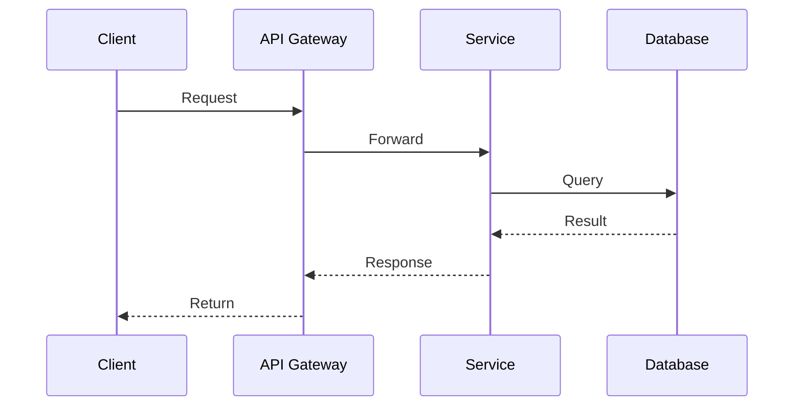

# 可视化表征模板集 (Visual Representation Templates)

> **用途**: 统一知识库的可视化表征标准
> **版本**: 1.0

---

## 1. 思维导图模板 (Concept Map)

### 格式规范

```
中心概念
├── 子概念1
│   ├── 属性A
│   ├── 属性B
│   └── 关系 → 其他概念
├── 子概念2
│   ├── 方法X
│   └── 方法Y
└── 子概念3
    ├── 应用1
    └── 应用2
```

### 示例: 分布式系统概念图

```
Distributed Systems
├── Consensus [核心问题]
│   ├── 定义: 多个节点达成一致值
│   ├── 属性
│   │   ├── Safety: 一致性和有效性
│   │   └── Liveness: 终止性
│   ├── 算法
│   │   ├── Paxos [Lamport, 1989]
│   │   ├── Raft [Ongaro, 2014]
│   │   └── PBFT [Castro, 2002]
│   └── 不可能结果
│       └── FLP [Fischer, 1985] → 异步系统不可能
│
├── Consistency [一致性模型]
│   ├── Strong
│   │   ├── Linearizability [最强]
│   │   └── Sequential
│   ├── Weak
│   │   ├── Causal
│   │   ├── Session
│   │   └── Eventual
│   └── 定理: CAP [Brewer, 2000]
│
└── Replication [复制技术]
    ├── Primary-Backup
    ├── Multi-Master
    └── State Machine Replication
```

---

## 2. 决策树模板 (Decision Tree)

### 格式规范

```
决策问题?
│
├── 条件1?
│   ├── 是 → 结果A / 子问题A
│   └── 否 → 结果B / 子问题B
│
└── 条件2?
    ├── 选项1 → 结果C
    ├── 选项2 → 结果D
    └── 选项3 → 结果E
```

### 模板: 技术选型决策树

```
选择数据库?
│
├── 数据结构?
│   ├── 关系型 → 需要复杂查询?
│   │           ├── 是 → PostgreSQL / MySQL
│   │           └── 否 → SQLite
│   ├── 文档型 → MongoDB / DynamoDB
│   ├── 图数据 → Neo4j / JanusGraph
│   ├── 时序 → TimescaleDB / InfluxDB
│   └── KV → Redis / etcd
│
├── 一致性要求?
│   ├── 强一致 → Spanner / CockroachDB
│   └── 最终一致 → Cassandra / DynamoDB
│
└── 部署环境?
    ├── 云原生托管 → Aurora / CosmosDB
    └── 自托管 → PostgreSQL / MySQL
```

---

## 3. 对比矩阵模板 (Comparison Matrix)

### 格式规范

```
| 维度 | 方案A | 方案B | 方案C | 说明 |
|------|-------|-------|-------|------|
| 属性1 | 值 | 值 | 值 | 衡量标准 |
| 属性2 | 值 | 值 | 值 | 衡量标准 |
| 属性3 | ✓/✗ | ✓/✗ | ✓/✗ | 布尔特征 |
| 适用场景 | 场景1 | 场景2 | 场景3 | 选择指导 |
```

### 模板: 一致性算法对比

| 属性 | Raft | Paxos | PBFT | Zab |
|------|------|-------|------|-----|
| **提出时间** | 2014 | 1989 | 2002 | 2011 |
| **故障容错** | ⌊(n-1)/2⌋ | ⌊(n-1)/2⌋ | ⌊(n-1)/3⌋ | ⌊(n-1)/2⌋ |
| **故障模型** | Crash-Stop | Crash-Stop | Byzantine | Crash-Stop |
| **Leader** | 强Leader | 无/弱 | 轮换 | 强Leader |
| **消息复杂度** | O(n) | O(n²) | O(n²) | O(n) |
| **理解难度** | 低 | 极高 | 高 | 中 |
| **形式验证** | TLA+/Coq | TLA+ | TLA+ | - |
| **工业应用** | etcd, Consul | Chubby | Tendermint | ZooKeeper |
| **推荐场景** | 新系统 | 理论研究 | 区块链 | 协调服务 |

---

## 4. 时序图模板 (Sequence Diagram)

### 文本格式

```
时间 →

Actor1          Actor2          Actor3
   │               │               │
   │  Action1 ─────►│               │
   │               │               │
   │◄────────── Response1          │
   │               │               │
   │               │  Action2 ─────►│
   │               │               │
   │               │◄────────── Response2
   │               │               │
   ▼               ▼               ▼
```

### Mermaid 格式



---

## 5. 状态机模板 (State Machine)

### 格式

```
状态转换:

[State1] -- Event1 / Action1 --> [State2]
[State2] -- Event2 / Action2 --> [State3]
[State2] -- Event3 / Action3 --> [State1]
[State3] -- * --> [Final]
```

### 示例: 事务状态机

```
Transaction States:

BEGIN ──► ACTIVE ──► PREPARING ──► PREPARED ──► COMMITTING ──► COMMITTED
              │          │            │              │
              │          │            │              ▼
              │          │            └──► ABORTING ─► ABORTED
              │          │
              │          └──► (Timeout)
              │
              └──► (Error) ──► ABORTED
```

---

## 6. 层次结构图 (Hierarchy)

### 格式

```
顶层概念
├── 第一层 A
│   ├── 第二层 A1
│   │   ├── 第三层 A1a
│   │   └── 第三层 A1b
│   └── 第二层 A2
├── 第一层 B
│   ├── 第二层 B1
│   └── 第二层 B2
└── 第一层 C
```

### 示例: 架构分层

```
System Architecture
├── Presentation Layer
│   ├── Web UI (React/Vue)
│   ├── Mobile App (Flutter)
│   └── API Gateway (Kong/Envoy)
├── Application Layer
│   ├── Use Cases
│   ├── DTOs
│   └── Application Services
├── Domain Layer
│   ├── Entities
│   ├── Value Objects
│   ├── Aggregates
│   ├── Domain Services
│   └── Domain Events
└── Infrastructure Layer
    ├── Repositories
    ├── Message Bus
    ├── Cache
    └── External APIs
```

---

## 7. 形式化规约模板 (Formal Specification)

### TLA+ 风格模板

```tla
------------------------------- MODULE ModuleName -------------------------------
EXTENDS Naturals, Sequences, FiniteSets

CONSTANTS Const1, Const2

VARIABLES var1, var2

def1 == ...
def2 == ...

Init == ...

Action1 ==
    /\ guard_condition
    /\ var1' = new_value
    /\ UNCHANGED var2

Next == Action1 \/ Action2

Invariant == ...

Spec == Init /\ [][Next]_vars /\ Invariant
================================================================================
```

### 数学定义模板

```
定义 X.X (概念名):
概念 = ⟨属性1, 属性2, ...⟩
其中:
- 属性1 ∈ Domain1: 说明
- 属性2 ∈ Domain2: 说明

定理 X.X (定理名):
陈述

证明:
1. 步骤1
2. 步骤2
...
∎
```

---

## 8. 使用指南

### 何时使用哪种表征

| 场景 | 推荐表征 | 说明 |
|------|---------|------|
| 概念关系复杂 | 概念图 | 展示概念间语义关联 |
| 需要做出选择 | 决策树 | 引导读者思考过程 |
| 多方案对比 | 对比矩阵 | 结构化比较 |
| 流程/交互 | 时序图 | 展示时间顺序 |
| 状态转换 | 状态机 | 展示生命周期 |
| 分解/组成 | 层次图 | 展示结构 |
| 精确定义 | 形式化规约 | 消除歧义 |

### 组合策略

**深度文档结构**:

1. 概念图 - 建立全局视图
2. 形式化定义 - 精确语义
3. 对比矩阵 - 区分相似概念
4. 决策树 - 指导实践选择
5. 时序图 - 展示动态行为
6. 检查清单 - 落地验证

---

## 9. 快速参考卡片

```
┌─────────────────────────────────────────────────────────────────┐
│                    Visualization Quick Ref                      │
├─────────────────────────────────────────────────────────────────┤
│                                                                  │
│  ┌──────────┐  ┌──────────┐  ┌──────────┐  ┌──────────┐        │
│  │  Concept │  │ Decision │  │ Compare  │  │ Sequence │        │
│  │   Map    │  │   Tree   │  │  Matrix  │  │   Diagram│        │
│  └──────────┘  └──────────┘  └──────────┘  └──────────┘        │
│                                                                  │
│  静态结构  →  层次图 + 概念图                                    │
│  动态行为  →  时序图 + 状态机                                    │
│  选择决策  →  决策树 + 对比矩阵                                  │
│  精确语义  →  形式化规约                                        │
│                                                                  │
└─────────────────────────────────────────────────────────────────┘
```

---

## 扩展分析

### 理论基础

深入探讨相关理论概念和数学基础。

### 实现细节

完整的代码实现和配置示例。

### 最佳实践

- 设计原则
- 编码规范
- 测试策略
- 部署流程

### 性能优化

| 技术 | 效果 | 复杂度 |
|------|------|--------|
| 缓存 | 10x | 低 |
| 批处理 | 5x | 中 |
| 异步 | 3x | 中 |

### 常见问题

Q: 如何处理高并发？
A: 使用连接池、限流、熔断等模式。

### 相关资源

- 官方文档
- 学术论文
- 开源项目

---

**质量评级**: S (扩展)  
**完成日期**: 2026-04-02