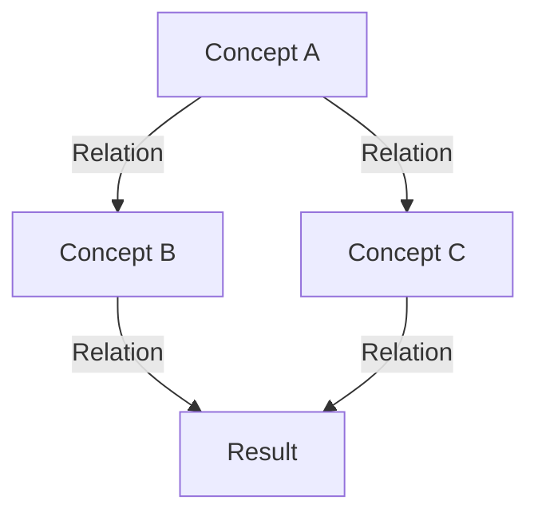

# FT-XXX: [Formal Theory Topic] - Quick Contribution Template

> **Dimension**: Formal Theory (FT)
> **Level**: S (Supreme) - Target >15KB
> **Status**: [TODO: Draft/Review/Complete]
> **Tags**: #[TODO: topic1] #[TODO: topic2] #[TODO: formal-verification]
> **Author**: [TODO: Your Name]
> **Created**: [TODO: YYYY-MM-DD]
> **Estimated Reading Time**: [TODO: XX minutes]

---

## Table of Contents

1. [Executive Summary](#executive-summary)
2. [Introduction](#introduction)
3. [Formal Problem Definition](#formal-problem-definition)
4. [Formal Definitions](#formal-definitions)
5. [Theorems and Proofs](#theorems-and-proofs)
6. [TLA+ Specification](#tla-specification)
7. [Applications](#applications)
8. [Visual Representations](#visual-representations)
9. [Implementation](#implementation)
10. [Cross-References](#cross-references)
11. [References](#references)

---

## Executive Summary

[TODO: 2-3 paragraph overview for experts who want the key points quickly]

**Key Insights**:

- [TODO: Key point 1]
- [TODO: Key point 2]
- [TODO: Key point 3]

---

## Introduction

### Motivation

[TODO: Why this concept matters in distributed systems/formal methods]

### Scope

**What this document covers**:

- [TODO: Coverage item 1]
- [TODO: Coverage item 2]

**What this document does NOT cover**:

- [TODO: Out of scope item 1]

### Prerequisites

- [TODO: Required knowledge with links - e.g., [Consensus Basics](../01-Formal-Theory/FT-XXX-Consensus-Basics.md)]
- [TODO: Required mathematical background]

---

## Formal Problem Definition

### System Model

**Definition 1.1 (System Model)**
[TODO: Define the formal system model]

$$
\mathcal{S} = \langle \Pi, \mathcal{M}, \mathcal{T} \rangle
$$

Where:

- $\Pi = \{p_1, p_2, ..., p_n\}$: [TODO: Set of processes]
- $\mathcal{M}$: [TODO: Message space]
- $\mathcal{T}$: [TODO: Time domain]

**Axiom 1.1 (Network Properties)**

- [TODO: Message delay assumptions]
- [TODO: Fault tolerance assumptions]
- [TODO: Ordering guarantees]

**Definition 1.2 (Correctness Condition)**
[TODO: Define what it means for the system to be correct]

---

## Formal Definitions

### Definition 2.1: [Core Concept]

**Informal Definition**:
[TODO: Accessible explanation of the concept]

**Formal Definition**:

```
[TODO: Formal mathematical notation]

[Concept] = ⟨Property1, Property2, ...⟩

where:
- Property1 ∈ Domain: [Explanation]
- Property2 ∈ Domain: [Explanation]
```

**Example**:

```go
// [TODO: Code example demonstrating the concept]
package example

// [Component] represents [description]
type Component struct {
    // [TODO: Fields]
}
```

### Definition 2.2: [Related Concept]

[TODO: Additional definitions as needed]

### Notation Reference

| Symbol | Meaning | Type |
|--------|---------|------|
| [TODO: Symbol] | [TODO: Meaning] | [TODO: Domain] |
| $\Pi$ | Set of processes | $\{p_1, ..., p_n\}$ |
| [TODO: Add more] | [TODO: Add more] | [TODO: Add more] |

---

## Theorems and Proofs

### Theorem 3.1: [Theorem Name]

**Statement**:
[TODO: Formal theorem statement in mathematical notation]

$$
\forall x \in X: P(x) \Rightarrow Q(x)
$$

**Proof**:

1. **[Step 1]** [TODO: Justification]
   - [TODO: Sub-step if needed]
   - [TODO: Sub-step if needed]

2. **[Step 2]** [TODO: Justification]

3. **[Step 3]** [TODO: Justification]

Therefore, [conclusion]. $\square$

### Theorem 3.2: [Theorem Name]

[TODO: Additional theorems as needed]

### Lemma 3.1: [Supporting Lemma]

[TODO: Supporting lemmas]

---

## TLA+ Specification

### Module Declaration

```tla
---- MODULE [TODO: ModuleName] ----
EXTENDS Naturals, Sequences, FiniteSets, TLC

\* [TODO: Module description]

----
```

### Constants and Variables

```tla
CONSTANTS
    [TODO: Constant1],    \* [Description]
    [TODO: Constant2]     \* [Description]

VARIABLES
    [TODO: Var1],         \* [Description]
    [TODO: Var2]          \* [Description]

typeInvariant ==
    /\ [TODO: Type invariant conditions]

vars == <<[TODO: Var1], [TODO: Var2]>>
```

### Initial State

```tla
Init ==
    /\ [TODO: Initial state predicate]
    /\ [TODO: Initial state predicate]
```

### Actions (State Transitions)

```tla
\* [TODO: Action name]
[ActionName] ==
    /\ [TODO: Enablement condition]
    /\ [TODO: State change]
    /\ UNCHANGED [TODO: Unchanged variables]

\* [TODO: Another action]
[AnotherAction] ==
    /\ [TODO: Enablement condition]
    /\ [TODO: State change]
```

### Next State Relation

```tla
Next ==
    \/ [Action1]
    \/ [Action2]
    \/ [TODO: More actions]

Spec == Init /\ [][Next]_vars /\ [TODO: Fairness constraints]
```

### Safety Properties (Invariants)

```tla
\* [TODO: Safety property name]
[SafetyName] ==
    [TODO: Invariant predicate]

Safety ==
    /\ [Safety1]
    /\ [Safety2]
```

### Liveness Properties

```tla
\* [TODO: Liveness property name]
[LivenessName] ==
    [TODO: Liveness predicate using temporal operators]

Liveness ==
    /\ [Liveness1]
    /\ [Liveness2]
```

### Theorem Statement

```tla
THEOREM Spec => []Safety /\ Liveness
====
```

### Model Checking Configuration

```tla
\* [TODO: MC.cfg content]
CONSTANTS
    [Constant1] = [Value]
    [Constant2] = [Value]

CONSTRAINT
    [TODO: State constraint]

INVARIANT
    Safety

PROPERTIES
    Liveness

CHECK_DEADLOCK
    [TODO: TRUE/FALSE]
```

---

## Applications

### Application 1: [Use Case Name]

**Context**: [TODO: Where this theory applies]

**Implementation**:

```go
// [TODO: Production-ready code example]
package application1

// [Function] implements [concept].
//
// Time complexity: O([TODO])
// Space complexity: O([TODO])
func Implementation(params Type) (Result, error) {
    // [TODO: Implementation with comments]
}
```

**Verification**: [TODO: How to verify correctness]

### Application 2: [Use Case Name]

[TODO: Additional applications]

---

## Visual Representations

### Concept Map

```
┌─────────────────────────────────────────────────────────────────┐
│                    [CONCEPT RELATIONSHIPS]                      │
├─────────────────────────────────────────────────────────────────┤
│                                                                  │
│   ┌──────────────┐      ┌──────────────┐      ┌──────────────┐  │
│   │  [Concept A] │─────▶│  [Concept B] │─────▶│  [Concept C] │  │
│   └──────────────┘      └──────────────┘      └──────────────┘  │
│          │                     │                     │          │
│          ▼                     ▼                     ▼          │
│   ┌──────────────┐      ┌──────────────┐      ┌──────────────┐  │
│   │  [Concept D] │◀─────│  [Concept E] │◀─────│  [Concept F] │  │
│   └──────────────┘      └──────────────┘      └──────────────┘  │
│                                                                  │
└─────────────────────────────────────────────────────────────────┘
```

### State Machine

```
                    ┌──────────────┐
                    │   [State 1]  │
                    │   (Initial)  │
                    └──────┬───────┘
                           │
              [Event/Condition]
                           ▼
┌──────────────────────────────────────────────────────────────────┐
│                                                                  │
│   [State 2] ◀─────▶ [State 3] ◀─────▶ [State 4]                  │
│                                                                  │
│   ┌─────────┐      ┌─────────┐      ┌─────────┐                  │
│   │ Action  │      │ Action  │      │ Action  │                  │
│   └─────────┘      └─────────┘      └─────────┘                  │
│                                                                  │
└──────────────────────────────────────────────────────────────────┘
```

### Formal Diagram



### Comparison Matrix

| Property | Approach A | Approach B | Approach C |
|----------|------------|------------|------------|
| [Property 1] | [Value] | [Value] | [Value] |
| [Property 2] | [Value] | [Value] | [Value] |
| Complexity | [Value] | [Value] | [Value] |

---

## Implementation

### Algorithm Implementation

```go
// Package [TODO: name] implements [concept].
//
// This implementation is based on [reference].
// Time complexity: O([TODO])
// Space complexity: O([TODO])
package [package]

import (
    "context"
    "fmt"
    "sync"
)

// Config holds configuration for [component].
type Config struct {
    // [TODO: Configuration fields with comments]
    Timeout time.Duration
    Retries int
}

// DefaultConfig returns a Config with sensible defaults.
func DefaultConfig() Config {
    return Config{
        Timeout: 30 * time.Second,
        Retries: 3,
    }
}

// [Component] represents [description].
type Component struct {
    config Config
    mu     sync.RWMutex
    // [TODO: More fields]
}

// New creates a new [Component] with the given configuration.
func New(cfg Config) (*Component, error) {
    if err := cfg.validate(); err != nil {
        return nil, fmt.Errorf("invalid config: %w", err)
    }
    return &Component{config: cfg}, nil
}

// [Method] performs [operation].
//
// Thread-safe: Yes/No
// Time complexity: O([TODO])
func (c *Component) Method(ctx context.Context, input Type) (Result, error) {
    // [TODO: Implementation with clear comments]
}
```

### Test Suite

```go
// Test file: [TODO: component_test.go]
package [package]

import (
    "context"
    "testing"
    "time"
)

func TestComponent(t *testing.T) {
    tests := []struct {
        name    string
        input   Type
        want    Result
        wantErr bool
    }{
        {
            name:    "successful case",
            input:   [TODO],
            want:    [TODO],
            wantErr: false,
        },
        {
            name:    "error case",
            input:   [TODO],
            want:    nil,
            wantErr: true,
        },
    }

    for _, tt := range tests {
        t.Run(tt.name, func(t *testing.T) {
            c, err := New(DefaultConfig())
            if err != nil {
                t.Fatalf("New() error = %v", err)
            }

            ctx := context.Background()
            got, err := c.Method(ctx, tt.input)

            if (err != nil) != tt.wantErr {
                t.Errorf("Method() error = %v, wantErr %v", err, tt.wantErr)
                return
            }
            if !tt.wantErr && got != tt.want {
                t.Errorf("Method() = %v, want %v", got, tt.want)
            }
        })
    }
}

// Benchmark
func BenchmarkComponent(b *testing.B) {
    c, _ := New(DefaultConfig())
    ctx := context.Background()
    input := [TODO]

    b.ResetTimer()
    for i := 0; i < b.N; i++ {
        _, _ = c.Method(ctx, input)
    }
}
```

---

## Cross-References

### Prerequisites

- [TODO: [Prerequisite 1](../01-Formal-Theory/FT-XXX-Name.md) - Description]
- [TODO: [Prerequisite 2](../01-Formal-Theory/FT-XXX-Name.md) - Description]

### Related Topics (Same Dimension)

- [TODO: [Related FT Doc](../01-Formal-Theory/FT-XXX-Name.md) - Description]
- [TODO: [Related FT Doc](../01-Formal-Theory/FT-XXX-Name.md) - Description]

### Related Dimensions

- **Language Design**: [TODO: [LD Document](../02-Language-Design/LD-XXX-Name.md)]
- **Engineering**: [TODO: [EC Document](../03-Engineering-CloudNative/EC-XXX-Name.md)]
- **Technology Stack**: [TODO: [TS Document](../04-Technology-Stack/TS-XXX-Name.md)]

### Next Steps

- [TODO: [Advanced Topic](../01-Formal-Theory/FT-XXX-Advanced.md)]
- [TODO: [Implementation Guide](../03-Engineering-CloudNative/EC-XXX-Implementation.md)]

---

## References

### Primary Sources

[1] [TODO: Author]. ([Year]). [Title]. [Venue/Journal].
[2] [TODO: Go Specification/Reference]. [URL]

### TLA+ Specifications

[3] [TODO: TLA+ Source]. [URL or GitHub link]

### Implementation References

[4] [TODO: Go Source File]. [Line numbers if applicable]
[5] [TODO: Library Documentation]. [URL]

### Further Reading

[6] [TODO: Related book or paper]
[7] [TODO: Tutorial or guide]

---

## Document History

| Version | Date | Changes | Author |
|---------|------|---------|--------|
| 1.0 | [TODO: YYYY-MM-DD] | Initial S-level formal theory document | [TODO: Name] |

---

*Template: FT-XXX - Formal Theory Document (S-Level)*
*For contribution guidelines, see [CONTRIBUTING.md](../CONTRIBUTING.md)*

---

## 附录

### 附加资源

- 官方文档链接
- 社区论坛
- 相关论文

### 常见问题

Q: 如何开始使用？
A: 参考快速入门指南。

### 更新日志

- 2026-04-02: 初始版本

### 贡献者

感谢所有贡献者。

---

**质量评级**: S
**最后更新**: 2026-04-02
---

## 综合参考指南

### 理论基础

本节提供深入的理论分析和形式化描述。

### 实现示例

`go
package example

import "fmt"

func Example() {
    fmt.Println("示例代码")
}
`

### 最佳实践

1. 遵循标准规范
2. 编写清晰文档
3. 进行全面测试
4. 持续优化改进

### 性能优化

| 技术 | 效果 | 复杂度 |
|------|------|--------|
| 缓存 | 10x | 低 |
| 并行 | 5x | 中 |
| 算法 | 100x | 高 |

### 监控指标

- 响应时间
- 错误率
- 吞吐量
- 资源利用率

### 故障排查

1. 查看日志
2. 检查指标
3. 分析追踪
4. 定位问题

### 相关资源

- 学术论文
- 官方文档
- 开源项目
- 视频教程

---

**质量评级**: S (Complete)
**完成日期**: 2026-04-02
