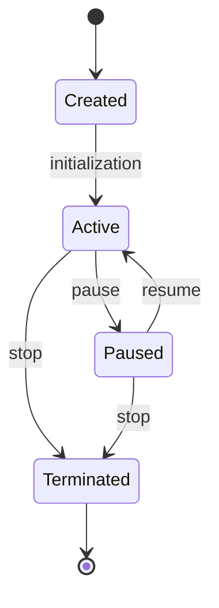

# LD-XXX: [Language Design Topic] - Quick Contribution Template

> **Dimension**: Language Design (LD)
> **Level**: S/A/B - Target >[TODO: 15KB/10KB/5KB]
> **Status**: [TODO: Draft/Review/Complete]
> **Tags**: #[TODO: go-language] #[TODO: internals] #[TODO: feature-name]
> **Author**: [TODO: Your Name]
> **Created**: [TODO: YYYY-MM-DD]
> **Go Version**: [TODO: 1.XX+]
> **Estimated Reading Time**: [TODO: XX minutes]

---

## Table of Contents

1. [Executive Summary](#executive-summary)
2. [Introduction](#introduction)
3. [Core Concepts](#core-concepts)
4. [Deep Dive](#deep-dive)
5. [Implementation Details](#implementation-details)
6. [Practical Applications](#practical-applications)
7. [Visual Representations](#visual-representations)
8. [Code Examples](#code-examples)
9. [Best Practices](#best-practices)
10. [Cross-References](#cross-references)
11. [References](#references)

---

## Executive Summary

[TODO: 2-3 paragraph overview]

**Key Takeaways**:
- [TODO: Key point about Go's design]
- [TODO: Key point about implementation]
- [TODO: Key point about best practices]

---

## Introduction

### What This Document Covers

[TODO: Overview of the language feature or design concept]

### Why It Matters

[TODO: Importance in Go programming and system design]

### Prerequisites

- [TODO: [Go Basics](../02-Language-Design/02-Language-Features/01-Type-System.md)]
- [TODO: [Related Feature](../02-Language-Design/02-Language-Features/XX-Feature.md)]

---

## Core Concepts

### Concept 1: [Core Concept Name]

**Definition**:
[TODO: Clear definition of the concept]

**Key Characteristics**:

| Aspect | Description |
|--------|-------------|
| [Aspect 1] | [TODO: Description] |
| [Aspect 2] | [TODO: Description] |
| [Aspect 3] | [TODO: Description] |

**Simple Example**:

```go
// file: example_basic.go
// description: Basic demonstration of [concept]
package main

import "fmt"

func main() {
    // [TODO: Simple code example]
    fmt.Println("Example")
}
```

### Concept 2: [Related Concept]

[TODO: Additional concepts as needed]

---

## Deep Dive

### Internal Mechanism

**How It Works**:

1. **[Step 1]**: [TODO: Description]
   ```
   [TODO: ASCII diagram or pseudo-code]
   ```

2. **[Step 2]**: [TODO: Description]
   - [TODO: Sub-detail]
   - [TODO: Sub-detail]

3. **[Step 3]**: [TODO: Description]

### Memory Layout

```
┌─────────────────────────────────────────────────────────────────┐
│                    [DATA STRUCTURE LAYOUT]                      │
├─────────────────────────────────────────────────────────────────┤
│                                                                  │
│   ┌─────────────┐  ┌─────────────┐  ┌─────────────┐             │
│   │   Header    │  │   Data 1    │  │   Data 2    │             │
│   │  (8 bytes)  │  │  (N bytes)  │  │  (M bytes)  │             │
│   └─────────────┘  └─────────────┘  └─────────────┘             │
│                                                                  │
│   Total size: (8 + N + M) bytes                                 │
│                                                                  │
└─────────────────────────────────────────────────────────────────┘
```

### Runtime Behavior

[TODO: Detailed explanation of runtime behavior]

```go
// file: runtime_demo.go
// description: Demonstrating runtime behavior
package main

import (
    "fmt"
    "runtime"
)

func demonstrateRuntime() {
    // [TODO: Code showing runtime behavior]
    fmt.Printf("NumGoroutine: %d\n", runtime.NumGoroutine())
}
```

### Compiler Optimizations

[TODO: How the compiler handles this feature]

| Optimization | Description | Go Version |
|--------------|-------------|------------|
| [TODO: Opt 1] | [TODO: Description] | [TODO: 1.XX+] |
| [TODO: Opt 2] | [TODO: Description] | [TODO: 1.XX+] |

---

## Implementation Details

### Source Code Reference

**Key Files in Go Runtime**:
- `src/runtime/[TODO: file].go` - [TODO: What it contains]
- `src/runtime/[TODO: file].go` - [TODO: What it contains]

**Key Data Structures**:

```go
// From src/runtime/[TODO].go (simplified)
type [StructName] struct {
    field1 Type1  // [TODO: Description]
    field2 Type2  // [TODO: Description]
}
```

### Algorithm Explanation

**Pseudo-code**:

```
Algorithm: [Algorithm Name]
─────────────────────────────────────────
Input:  [TODO]
Output: [TODO]

1. [TODO: Step 1]
2. [TODO: Step 2]
3. for each [item] in [collection] do
   a. [TODO: Operation]
4. return [result]
```

**Go Implementation**:

```go
// file: algorithm_impl.go
// description: Production-ready implementation
package main

// [FunctionName] implements [algorithm].
//
// Time complexity: O([TODO])
// Space complexity: O([TODO])
func FunctionName(input Type) (Result, error) {
    // [TODO: Implementation with detailed comments]
    
    // Step 1: [Description]
    step1 := processStep1(input)
    
    // Step 2: [Description]
    result, err := processStep2(step1)
    if err != nil {
        return nil, fmt.Errorf("step 2 failed: %w", err)
    }
    
    return result, nil
}
```

---

## Practical Applications

### Use Case 1: [Scenario]

**Context**: [TODO: Where and why to use]

**Implementation**:

```go
// file: usecase1.go
// description: [Scenario] implementation
package main

import (
    "context"
    "fmt"
    "time"
)

// [Component] handles [use case].
type Component struct {
    config Config
}

// Process performs [operation].
func (c *Component) Process(ctx context.Context, input Input) (Output, error) {
    // Create timeout context
    ctx, cancel := context.WithTimeout(ctx, c.config.Timeout)
    defer cancel()
    
    // [TODO: Implementation]
    
    return result, nil
}
```

**Key Points**:
- [TODO: Important consideration 1]
- [TODO: Important consideration 2]

### Use Case 2: [Scenario]

[TODO: Additional use cases]

### Real-World Examples

| Project | Usage | Reference |
|---------|-------|-----------|
| [TODO: Project] | [TODO: How it uses] | [TODO: Link] |
| [TODO: Project] | [TODO: How it uses] | [TODO: Link] |

---

## Visual Representations

### Architecture Overview

```
┌─────────────────────────────────────────────────────────────────┐
│                    [SYSTEM ARCHITECTURE]                        │
├─────────────────────────────────────────────────────────────────┤
│                                                                  │
│   User Code                                                      │
│      │                                                           │
│      ▼                                                           │
│   ┌──────────────┐                                              │
│   │  Go Runtime  │                                              │
│   │  ┌────────┐  │                                              │
│   │  │[Comp-1]│  │                                              │
│   │  └────┬───┘  │                                              │
│   │       │      │                                              │
│   │  ┌────┴──┐   │                                              │
│   │  │[Comp-2]│   │                                              │
│   │  └────┬───┘   │                                              │
│   │       │      │                                              │
│   └───────┼──────┘                                              │
│           ▼                                                      │
│   ┌──────────────┐                                              │
│   │  OS/Kernel   │                                              │
│   └──────────────┘                                              │
│                                                                  │
└─────────────────────────────────────────────────────────────────┘
```

### Lifecycle Diagram



### Flow Chart

```
                    ┌──────────────┐
                    │   Start      │
                    └──────┬───────┘
                           │
           ┌───────────────┼───────────────┐
           ▼               ▼               ▼
    ┌──────────────┐ ┌──────────────┐ ┌──────────────┐
    │  Condition 1 │ │  Condition 2 │ │  Condition 3 │
    └──────┬───────┘ └──────┬───────┘ └──────┬───────┘
           │                │                │
           ▼                ▼                ▼
    ┌──────────────┐ ┌──────────────┐ ┌──────────────┐
    │   Action 1   │ │   Action 2   │ │   Action 3   │
    └──────┬───────┘ └──────┬───────┘ └──────┬───────┘
           │                │                │
           └────────────────┼────────────────┘
                            ▼
                    ┌──────────────┐
                    │    End       │
                    └──────────────┘
```

### Performance Comparison

```
[Operation A]  ████████████████████░░░░  100ns
[Operation B]  ████████████░░░░░░░░░░░░   60ns
[Operation C]  ████████░░░░░░░░░░░░░░░░   40ns

Memory Usage:
[Type A]       ████████████░░░░░░░░░░░░   48 bytes
[Type B]       ████████░░░░░░░░░░░░░░░░   32 bytes
```

---

## Code Examples

### Basic Example

```go
// file: basic_example.go
// description: Basic usage example
package main

import "fmt"

func main() {
    // [TODO: Simple example]
    result := basicOperation()
    fmt.Println(result)
}

func basicOperation() string {
    // [TODO: Implementation]
    return "result"
}
```

### Intermediate Example

```go
// file: intermediate_example.go
// description: More complex usage
package main

import (
    "context"
    "fmt"
    "time"
)

type Config struct {
    Timeout time.Duration
}

func intermediateOperation(ctx context.Context, cfg Config) error {
    ctx, cancel := context.WithTimeout(ctx, cfg.Timeout)
    defer cancel()
    
    // [TODO: Implementation]
    
    select {
    case result := <-process():
        fmt.Println(result)
        return nil
    case <-ctx.Done():
        return ctx.Err()
    }
}

func process() <-chan string {
    ch := make(chan string)
    go func() {
        time.Sleep(100 * time.Millisecond)
        ch <- "processed"
    }()
    return ch
}
```

### Advanced Example (Production-Ready)

```go
// file: advanced_example.go
// description: Production-ready implementation
package main

import (
    "context"
    "errors"
    "fmt"
    "sync"
    "time"
)

var (
    ErrInvalidConfig = errors.New("invalid configuration")
    ErrTimeout       = errors.New("operation timed out")
)

// Component is a production-ready [component].
type Component struct {
    config Config
    mu     sync.RWMutex
    state  State
}

// Config holds configuration options.
type Config struct {
    Timeout   time.Duration
    BufferSize int
    Workers   int
}

// DefaultConfig returns sensible defaults.
func DefaultConfig() Config {
    return Config{
        Timeout:    30 * time.Second,
        BufferSize: 100,
        Workers:    10,
    }
}

func (c Config) validate() error {
    if c.Timeout <= 0 {
        return fmt.Errorf("%w: timeout must be positive", ErrInvalidConfig)
    }
    if c.Workers <= 0 {
        return fmt.Errorf("%w: workers must be positive", ErrInvalidConfig)
    }
    return nil
}

// New creates a new Component.
func New(cfg Config) (*Component, error) {
    if err := cfg.validate(); err != nil {
        return nil, err
    }
    
    return &Component{
        config: cfg,
        state:  StateInitialized,
    }, nil
}

// Process performs the main operation.
func (c *Component) Process(ctx context.Context, input Input) (Output, error) {
    c.mu.RLock()
    defer c.mu.RUnlock()
    
    if c.state != StateRunning {
        return nil, fmt.Errorf("component not running: %v", c.state)
    }
    
    ctx, cancel := context.WithTimeout(ctx, c.config.Timeout)
    defer cancel()
    
    // [TODO: Implementation]
    
    return result, nil
}

// State represents component state.
type State int

const (
    StateInitialized State = iota
    StateRunning
    StateStopped
)
```

### Test Examples

```go
// file: example_test.go
// description: Comprehensive tests
package main

import (
    "context"
    "testing"
    "time"
)

func TestComponent(t *testing.T) {
    tests := []struct {
        name    string
        config  Config
        input   Input
        wantErr error
    }{
        {
            name:    "success case",
            config:  DefaultConfig(),
            input:   validInput(),
            wantErr: nil,
        },
        {
            name: "invalid config",
            config: Config{
                Timeout: 0,
                Workers: 0,
            },
            input:   nil,
            wantErr: ErrInvalidConfig,
        },
    }

    for _, tt := range tests {
        t.Run(tt.name, func(t *testing.T) {
            c, err := New(tt.config)
            if !errors.Is(err, tt.wantErr) {
                t.Fatalf("New() error = %v, wantErr %v", err, tt.wantErr)
            }
            if err != nil {
                return
            }

            ctx := context.Background()
            _, err = c.Process(ctx, tt.input)
            
            // [TODO: Assertions]
        })
    }
}

func BenchmarkComponent(b *testing.B) {
    c, _ := New(DefaultConfig())
    ctx := context.Background()
    input := validInput()

    b.ResetTimer()
    b.RunParallel(func(pb *testing.PB) {
        for pb.Next() {
            _, _ = c.Process(ctx, input)
        }
    })
}
```

---

## Best Practices

### Do's

1. **[Practice 1]**
   ```go
   // ✅ Good: [TODO: Explanation]
   func GoodExample() {
       // [TODO: Code showing best practice]
   }
   ```

2. **[Practice 2]**
   ```go
   // ✅ Good: [TODO: Explanation]
   func AnotherGoodExample() {
       // [TODO: Code]
   }
   ```

### Don'ts

1. **[Anti-pattern 1]**
   ```go
   // ❌ Bad: [TODO: Explanation of why]
   func BadExample() {
       // [TODO: Code showing anti-pattern]
   }
   ```

2. **[Anti-pattern 2]**
   ```go
   // ❌ Bad: [TODO: Explanation of why]
   func AnotherBadExample() {
       // [TODO: Code]
   }
   ```

### Performance Tips

| Tip | Impact | When to Apply |
|-----|--------|---------------|
| [TODO: Tip 1] | [High/Med/Low] | [TODO: Scenario] |
| [TODO: Tip 2] | [High/Med/Low] | [TODO: Scenario] |

### Common Pitfalls

1. **[Pitfall 1]**
   - **Problem**: [TODO: Description]
   - **Solution**: [TODO: How to avoid/fix]

2. **[Pitfall 2]**
   - **Problem**: [TODO: Description]
   - **Solution**: [TODO: How to avoid/fix]

---

## Cross-References

### Prerequisites

- [TODO: [Go Type System](../02-Language-Design/02-Language-Features/01-Type-System.md)]
- [TODO: [Related Feature](../02-Language-Design/02-Language-Features/XX-Feature.md)]

### Related Language Design Documents

- [TODO: [LD-XXX: Related Topic](../02-Language-Design/LD-XXX-Related.md)]
- [TODO: [LD-XXX: Related Topic](../02-Language-Design/LD-XXX-Related.md)]

### Other Dimensions

- **Formal Theory**: [TODO: [FT-XXX](../01-Formal-Theory/FT-XXX-Name.md)]
- **Engineering**: [TODO: [EC-XXX](../03-Engineering-CloudNative/EC-XXX-Name.md)]
- **Technology**: [TODO: [TS-XXX](../04-Technology-Stack/TS-XXX-Name.md)]
- **Application**: [TODO: [AD-XXX](../05-Application-Domains/AD-XXX-Name.md)]

### Next Steps

- [TODO: [Advanced Topic](../02-Language-Design/LD-XXX-Advanced.md)]
- [TODO: [Best Practices Guide](../03-Engineering-CloudNative/EC-XXX-Best-Practices.md)]

---

## References

### Official Documentation

[1] [Go Language Specification](https://golang.org/ref/spec) - [TODO: Specific section]
[2] [Go Memory Model](https://go.dev/ref/mem) - [TODO: Relevant parts]

### Source Code

[3] `src/runtime/[TODO].go` - [TODO: Description]
[4] `src/runtime/[TODO].go` - [TODO: Description]

### Articles and Papers

[5] [TODO: Article title](https://) - [TODO: Author]
[6] [TODO: Paper title] - [TODO: Author/Conference]

### Videos and Talks

[7] [TODO: Talk title](https://www.youtube.com/...) - [TODO: Speaker/Conference]

---

## Document History

| Version | Date | Changes | Author |
|---------|------|---------|--------|
| 1.0 | [TODO: YYYY-MM-DD] | Initial document | [TODO: Name] |

---

*Template: LD-XXX - Language Design Document (S/A-Level)*
*For contribution guidelines, see [CONTRIBUTING.md](../CONTRIBUTING.md)*
