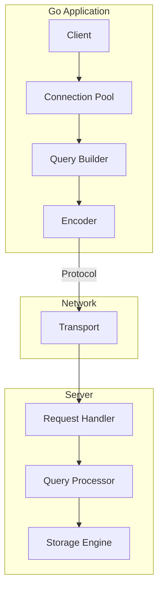

# TS-XXX: [Technology Name] - Quick Contribution Template

> **Dimension**: Technology Stack (TS)
> **Level**: S/A/B - Target >[TODO: 15KB/10KB/5KB]
> **Status**: [TODO: Draft/Review/Complete]
> **Tags**: #[TODO: database] #[TODO: go] #[TODO: technology]
> **Author**: [TODO: Your Name]
> **Created**: [TODO: YYYY-MM-DD]
> **Technology Version**: [TODO: X.Y.Z]
> **Go Version Required**: [TODO: 1.XX+]
> **Estimated Reading Time**: [TODO: XX minutes]

---

## Table of Contents

1. [Executive Summary](#executive-summary)
2. [Overview](#overview)
3. [Installation & Setup](#installation--setup)
4. [Core Concepts](#core-concepts)
5. [API Reference](#api-reference)
6. [Best Practices](#best-practices)
7. [Performance](#performance)
8. [Visual Representations](#visual-representations)
9. [Code Examples](#code-examples)
10. [Integration](#integration)
11. [Troubleshooting](#troubleshooting)
12. [Cross-References](#cross-references)
13. [References](#references)

---

## Executive Summary

[TODO: 2-3 paragraph overview]

**Key Points**:
- [TODO: What this technology does]
- [TODO: When to use it in Go projects]
- [TODO: Key differentiators]

---

## Overview

### What is [Technology]?

[TODO: 1-2 paragraph description of the technology]

**Key Features**:
- [TODO: Feature 1]
- [TODO: Feature 2]
- [TODO: Feature 3]

### When to Use

**Best For**:
- [TODO: Use case 1]
- [TODO: Use case 2]
- [TODO: Use case 3]

**Not Recommended For**:
- [TODO: Anti-use case 1]
- [TODO: Anti-use case 2]

### Alternatives Comparison

| Technology | Best For | Trade-off | Go Support |
|------------|----------|-----------|------------|
| [Technology A] | [TODO] | [TODO] | [TODO] |
| **[This Technology]** | [TODO] | [TODO] | [TODO] |
| [Technology B] | [TODO] | [TODO] | [TODO] |

---

## Installation & Setup

### Requirements

- Go 1.[TODO].XX or higher
- [TODO: Other system requirements]

### Installation

```bash
# Install the Go package
go get [TODO: package path]
```

### Configuration

```go
// file: config.go
// description: Basic configuration setup
package main

import (
    "[TODO: package]"
)

func setup() (*Client, error) {
    config := &Config{
        Host:     getEnv("HOST", "localhost"),
        Port:     getEnvInt("PORT", 5432),
        Username: getEnv("USER", "admin"),
        Password: getEnv("PASSWORD", ""),
        Database: getEnv("DB", "mydb"),
        
        // Pool configuration
        MaxConnections: 100,
        MinConnections: 10,
        MaxIdleTime:    30 * time.Minute,
    }
    
    return New(config)
}
```

### Verification

```go
// file: verify.go
// description: Verify installation
package main

import (
    "context"
    "fmt"
    "log"
)

func main() {
    client, err := setup()
    if err != nil {
        log.Fatal(err)
    }
    defer client.Close()
    
    // Health check
    if err := client.Ping(context.Background()); err != nil {
        log.Fatal(err)
    }
    
    fmt.Println("✅ Connection successful!")
}
```

---

## Core Concepts

### Concept 1: [Core Concept]

**Description**: [TODO: Explanation]

```go
// file: concept1.go
// description: Demonstrating [concept]
package main

func demonstrateConcept1() {
    // [TODO: Code example]
}
```

**Key Points**:
- [TODO: Important point 1]
- [TODO: Important point 2]

### Concept 2: [Core Concept]

**Description**: [TODO: Explanation]

```go
// file: concept2.go
// description: Demonstrating [concept]
package main

func demonstrateConcept2() {
    // [TODO: Code example]
}
```

### Architecture Overview

```
┌─────────────────────────────────────────────────────────────────┐
│                    [TECHNOLOGY] ARCHITECTURE                    │
├─────────────────────────────────────────────────────────────────┤
│                                                                  │
│   Go Application                                                 │
│   ┌──────────────────────────────────────────┐                  │
│   │          Go Client Library               │                  │
│   │  ┌──────────┐ ┌──────────┐ ┌──────────┐  │                  │
│   │  │ Connection │ │  Pool   │ │  Query  │  │                  │
│   │  │   Mgr    │ │ Manager │ │ Builder │  │                  │
│   │  └────┬─────┘ └────┬─────┘ └────┬─────┘  │                  │
│   │       └────────────┴────────────┘        │                  │
│   └─────────────────┬────────────────────────┘                  │
│                     │                                            │
│              Network Protocol                                   │
│                     │                                            │
│   ┌─────────────────┴────────────────────────┐                  │
│   │         [Technology] Server              │                  │
│   │  ┌──────────┐ ┌──────────┐ ┌──────────┐  │                  │
│   │  │  Query   │ │  Cache   │ │ Storage │  │                  │
│   │  │ Processor│ │  Layer   │ │  Engine │  │                  │
│   │  └──────────┘ └──────────┘ └──────────┘  │                  │
│   └──────────────────────────────────────────┘                  │
│                                                                  │
└─────────────────────────────────────────────────────────────────┘
```

---

## API Reference

### Types

#### Type: [TypeName]

```go
type TypeName struct {
    Field1 Type1  // [TODO: Description]
    Field2 Type2  // [TODO: Description]
    Field3 Type3  // [TODO: Description]
}
```

| Field | Type | Required | Description |
|-------|------|----------|-------------|
| Field1 | Type1 | Yes | [TODO] |
| Field2 | Type2 | No | [TODO] |

### Functions

#### Function: [FunctionName]

```go
func FunctionName(ctx context.Context, param1 Type1, param2 Type2) (Result, error)
```

**Parameters**:

| Parameter | Type | Description |
|-----------|------|-------------|
| ctx | `context.Context` | Context for cancellation/timeout |
| param1 | `Type1` | [TODO: Description] |
| param2 | `Type2` | [TODO: Description] |

**Returns**:

| Return | Type | Description |
|--------|------|-------------|
| result | `Result` | [TODO: Description] |
| error | `error` | [TODO: Error conditions] |

**Example**:

```go
// file: func_example.go
// description: Usage example
package main

func exampleFunctionName() {
    ctx, cancel := context.WithTimeout(context.Background(), 5*time.Second)
    defer cancel()
    
    result, err := FunctionName(ctx, param1, param2)
    if err != nil {
        log.Printf("Error: %v", err)
        return
    }
    
    fmt.Printf("Result: %+v\n", result)
}
```

### Methods

#### Method: [MethodName]

```go
func (c *Client) MethodName(ctx context.Context, input Input) (Output, error)
```

[TODO: Description]

---

## Best Practices

### Do's ✅

1. **[Practice 1]**
   ```go
   // ✅ Good: [TODO: Explanation]
   func GoodExample() {
       // [TODO: Code]
   }
   ```

2. **[Practice 2]**
   ```go
   // ✅ Good: [TODO: Explanation]
   func AnotherGoodExample() {
       // [TODO: Code]
   }
   ```

3. **[Practice 3]**
   ```go
   // ✅ Good: [TODO: Explanation]
   func YetAnotherGoodExample() {
       // [TODO: Code]
   }
   ```

### Don'ts ❌

1. **[Anti-pattern 1]**
   ```go
   // ❌ Bad: [TODO: Explanation of why]
   func BadExample() {
       // [TODO: Code]
   }
   ```

2. **[Anti-pattern 2]**
   ```go
   // ❌ Bad: [TODO: Explanation of why]
   func AnotherBadExample() {
       // [TODO: Code]
   }
   ```

### Configuration Best Practices

| Setting | Development | Production | Reason |
|---------|-------------|------------|--------|
| MaxConnections | 10 | 100 | [TODO] |
| Timeout | 5s | 30s | [TODO] |
| [TODO] | [TODO] | [TODO] | [TODO] |

---

## Performance

### Benchmarks

| Operation | Time | Memory | Notes |
|-----------|------|--------|-------|
| [Operation 1] | [TODO] μs | [TODO] KB | [TODO] |
| [Operation 2] | [TODO] μs | [TODO] KB | [TODO] |
| [Operation 3] | [TODO] μs | [TODO] KB | [TODO] |

```
Benchmark Results:

[Operation 1]  ████████████████░░░░  [TODO] μs/op
[Operation 2]  ████████████░░░░░░░░  [TODO] μs/op
[Operation 3]  ██████████░░░░░░░░░░  [TODO] μs/op
```

### Optimization Tips

1. **Connection Pooling**
   ```go
   // ✅ Good: Configure connection pool
   config := &Config{
       MaxConnections: 100,
       MinConnections: 10,
       MaxIdleTime:    30 * time.Minute,
   }
   ```

2. **Batching**
   ```go
   // ✅ Good: Batch operations when possible
   batch := client.NewBatch()
   for _, item := range items {
       batch.Add(item)
   }
   results, err := batch.Execute(ctx)
   ```

3. **Caching**
   ```go
   // ✅ Good: Cache frequently accessed data
   cache := NewCache(5 * time.Minute)
   result, err := cache.GetOrCompute(key, computeFunc)
   ```

### Scalability

| Metric | Single Node | Cluster |
|--------|-------------|---------|
| Throughput | [TODO] ops/sec | [TODO] ops/sec |
| Latency (p99) | [TODO] ms | [TODO] ms |
| Max Data | [TODO] GB | [TODO] TB |

---

## Visual Representations

### Data Flow

```
┌─────────────────────────────────────────────────────────────────┐
│                      DATA FLOW DIAGRAM                          │
├─────────────────────────────────────────────────────────────────┤
│                                                                  │
│   Application                                                    │
│      │                                                           │
│      │ 1. Query                                                  │
│      ▼                                                           │
│   ┌──────────────┐                                              │
│   │    Client    │                                              │
│   └──────┬───────┘                                              │
│          │ 2. Encode                                             │
│          ▼                                                       │
│   ┌──────────────┐                                              │
│   │   Network    │                                              │
│   └──────┬───────┘                                              │
│          │ 3. Protocol                                           │
│          ▼                                                       │
│   ┌──────────────┐                                              │
│   │    Server    │                                              │
│   │  ┌────────┐  │                                              │
│   │  │Process │  │                                              │
│   │  └────┬───┘  │                                              │
│   │       │      │                                              │
│   │  ┌────┴──┐   │                                              │
│   │  │Storage│   │                                              │
│   │  └───────┘   │                                              │
│   └──────────────┘                                              │
│          │                                                       │
│          │ 4. Response                                           │
│          ▼                                                       │
│      [Result]                                                   │
│                                                                  │
└─────────────────────────────────────────────────────────────────┘
```

### Component Diagram



### Performance Comparison

```
Latency Distribution (ms):

p50   ████████████░░░░░░░░░░   [TODO]
p90   ██████████████████░░░░   [TODO]
p95   ████████████████████░░   [TODO]
p99   ██████████████████████   [TODO]
```

---

## Code Examples

### Basic CRUD Operations

```go
// file: crud.go
// description: Basic CRUD operations
package main

import (
    "context"
    "fmt"
    "log"
    "time"
)

// Create
func createItem(ctx context.Context, client *Client, item *Item) error {
    ctx, cancel := context.WithTimeout(ctx, 5*time.Second)
    defer cancel()
    
    result, err := client.Create(ctx, item)
    if err != nil {
        return fmt.Errorf("create failed: %w", err)
    }
    
    log.Printf("Created: %+v", result)
    return nil
}

// Read
func getItem(ctx context.Context, client *Client, id string) (*Item, error) {
    ctx, cancel := context.WithTimeout(ctx, 5*time.Second)
    defer cancel()
    
    item, err := client.Get(ctx, id)
    if err != nil {
        return nil, fmt.Errorf("get failed: %w", err)
    }
    
    return item, nil
}

// Update
func updateItem(ctx context.Context, client *Client, item *Item) error {
    ctx, cancel := context.WithTimeout(ctx, 5*time.Second)
    defer cancel()
    
    if err := client.Update(ctx, item); err != nil {
        return fmt.Errorf("update failed: %w", err)
    }
    
    return nil
}

// Delete
func deleteItem(ctx context.Context, client *Client, id string) error {
    ctx, cancel := context.WithTimeout(ctx, 5*time.Second)
    defer cancel()
    
    if err := client.Delete(ctx, id); err != nil {
        return fmt.Errorf("delete failed: %w", err)
    }
    
    return nil
}
```

### Advanced Patterns

```go
// file: advanced.go
// description: Advanced usage patterns
package main

import (
    "context"
    "fmt"
    "sync"
    "time"
)

// Transaction Pattern
func withTransaction(ctx context.Context, client *Client, fn func(Tx) error) error {
    tx, err := client.Begin(ctx)
    if err != nil {
        return fmt.Errorf("begin transaction: %w", err)
    }
    
    defer func() {
        if err != nil {
            tx.Rollback()
            return
        }
        err = tx.Commit()
    }()
    
    if err = fn(tx); err != nil {
        return err
    }
    
    return nil
}

// Connection Pool Management
type PoolManager struct {
    client *Client
    mu     sync.RWMutex
    stats  PoolStats
}

func (pm *PoolManager) Monitor(ctx context.Context) {
    ticker := time.NewTicker(30 * time.Second)
    defer ticker.Stop()
    
    for {
        select {
        case <-ctx.Done():
            return
        case <-ticker.C:
            stats := pm.client.PoolStats()
            pm.mu.Lock()
            pm.stats = stats
            pm.mu.Unlock()
            
            // Log or export metrics
            log.Printf("Pool stats: %+v", stats)
        }
    }
}

// Retry with Exponential Backoff
func retryWithBackoff(ctx context.Context, operation func() error) error {
    backoff := 100 * time.Millisecond
    maxRetries := 3
    
    for i := 0; i < maxRetries; i++ {
        err := operation()
        if err == nil {
            return nil
        }
        
        if !isRetryable(err) {
            return err
        }
        
        select {
        case <-time.After(backoff):
            backoff *= 2
        case <-ctx.Done():
            return ctx.Err()
        }
    }
    
    return fmt.Errorf("max retries exceeded")
}

func isRetryable(err error) bool {
    // [TODO: Implement retryable error detection]
    return true
}
```

### Testing Examples

```go
// file: example_test.go
// description: Testing patterns
package main

import (
    "context"
    "testing"
    "time"

    "github.com/stretchr/testify/assert"
    "github.com/stretchr/testify/require"
)

func TestCRUD(t *testing.T) {
    if testing.Short() {
        t.Skip("skipping integration test")
    }
    
    ctx := context.Background()
    client := setupTestClient(t)
    defer client.Close()
    
    t.Run("create and get", func(t *testing.T) {
        item := &Item{
            Name:  "Test",
            Value: 42,
        }
        
        err := createItem(ctx, client, item)
        require.NoError(t, err)
        assert.NotEmpty(t, item.ID)
        
        fetched, err := getItem(ctx, client, item.ID)
        require.NoError(t, err)
        assert.Equal(t, item.Name, fetched.Name)
    })
    
    t.Run("update", func(t *testing.T) {
        // [TODO: Update test]
    })
    
    t.Run("delete", func(t *testing.T) {
        // [TODO: Delete test]
    })
}

func BenchmarkRead(b *testing.B) {
    ctx := context.Background()
    client := setupBenchmarkClient(b)
    defer client.Close()
    
    b.ResetTimer()
    b.RunParallel(func(pb *testing.PB) {
        for pb.Next() {
            _, _ = client.Get(ctx, "test-id")
        }
    })
}
```

---

## Integration

### With Web Frameworks

```go
// file: web_integration.go
// description: Integration with Gin/Echo/Fiber
package main

import (
    "net/http"
    
    "github.com/gin-gonic/gin"
)

func setupRoutes(r *gin.Engine, client *Client) {
    handler := &Handler{client: client}
    
    r.GET("/api/items/:id", handler.GetItem)
    r.POST("/api/items", handler.CreateItem)
    r.PUT("/api/items/:id", handler.UpdateItem)
    r.DELETE("/api/items/:id", handler.DeleteItem)
}

type Handler struct {
    client *Client
}

func (h *Handler) GetItem(c *gin.Context) {
    id := c.Param("id")
    
    item, err := h.client.Get(c.Request.Context(), id)
    if err != nil {
        c.JSON(http.StatusInternalServerError, gin.H{"error": err.Error()})
        return
    }
    
    c.JSON(http.StatusOK, item)
}

// [TODO: Other handlers]
```

### With Observability

```go
// file: observability.go
// description: Adding metrics and tracing
package main

import (
    "context"
    "time"
    
    "github.com/prometheus/client_golang/prometheus"
    "go.opentelemetry.io/otel"
    "go.opentelemetry.io/otel/trace"
)

var (
    operationDuration = prometheus.NewHistogramVec(
        prometheus.HistogramOpts{
            Name: "tech_operation_duration_seconds",
            Help: "Duration of operations",
        },
        []string{"operation", "status"},
    )
)

type InstrumentedClient struct {
    client *Client
    tracer trace.Tracer
}

func (ic *InstrumentedClient) Get(ctx context.Context, id string) (*Item, error) {
    ctx, span := ic.tracer.Start(ctx, "client.Get")
    defer span.End()
    
    start := time.Now()
    item, err := ic.client.Get(ctx, id)
    duration := time.Since(start).Seconds()
    
    status := "success"
    if err != nil {
        status = "error"
        span.RecordError(err)
    }
    
    operationDuration.WithLabelValues("get", status).Observe(duration)
    
    return item, err
}
```

---

## Troubleshooting

### Common Issues

| Issue | Symptoms | Cause | Solution |
|-------|----------|-------|----------|
| Connection refused | `dial error` | Server not running | Start server |
| Timeout | `context deadline exceeded` | Slow network | Increase timeout |
| Pool exhausted | `max connections reached` | Too many concurrent | Increase pool size |
| [TODO] | [TODO] | [TODO] | [TODO] |

### Debugging

```go
// Enable debug logging
client, err := New(&Config{
    // ... other config
    LogLevel: LogLevelDebug,
})

// Enable metrics
go func() {
    http.Handle("/metrics", promhttp.Handler())
    log.Fatal(http.ListenAndServe(":9090", nil))
}()
```

---

## Cross-References

### Prerequisites

- [TODO: [Go Context](../04-Technology-Stack/01-Core-Library/04-Context-Package.md)]
- [TODO: [Go Testing](../02-Language-Design/02-Language-Features/09-Testing-Patterns.md)]

### Related Technologies

- [TODO: [Related Tech](../04-Technology-Stack/TS-XXX-Related.md)]
- [TODO: [Related Tech](../04-Technology-Stack/TS-XXX-Related.md)]

### Other Dimensions

- **Formal Theory**: [TODO: [FT-XXX](../01-Formal-Theory/FT-XXX-Name.md)]
- **Language Design**: [TODO: [LD-XXX](../02-Language-Design/LD-XXX-Name.md)]
- **Engineering**: [TODO: [EC-XXX](../03-Engineering-CloudNative/EC-XXX-Name.md)]
- **Application**: [TODO: [AD-XXX](../05-Application-Domains/AD-XXX-Name.md)]

---

## References

### Official Documentation

[1] [Official Documentation](https://) - [TODO: Description]
[2] [GitHub Repository](https://github.com/) - Source code

### Go Libraries

[3] [Package Documentation](https://pkg.go.dev/) - Go API reference

### Articles

[4] [TODO: Article Title](https://) - [TODO: Description]

### Tools

[5] [TODO: Tool Name](https://) - [TODO: Description]

---

## Document History

| Version | Date | Changes | Author |
|---------|------|---------|--------|
| 1.0 | [TODO: YYYY-MM-DD] | Initial technology guide | [TODO: Name] |

---

*Template: TS-XXX - Technology Stack Guide (S/A-Level)*
*For contribution guidelines, see [CONTRIBUTING.md](../CONTRIBUTING.md)*
