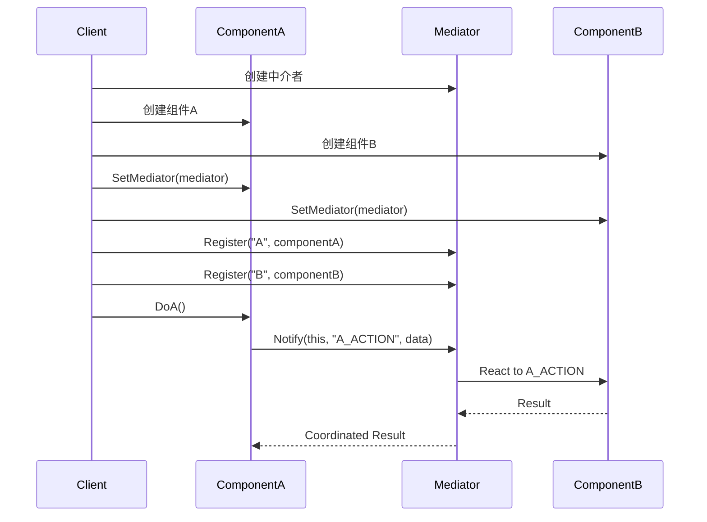
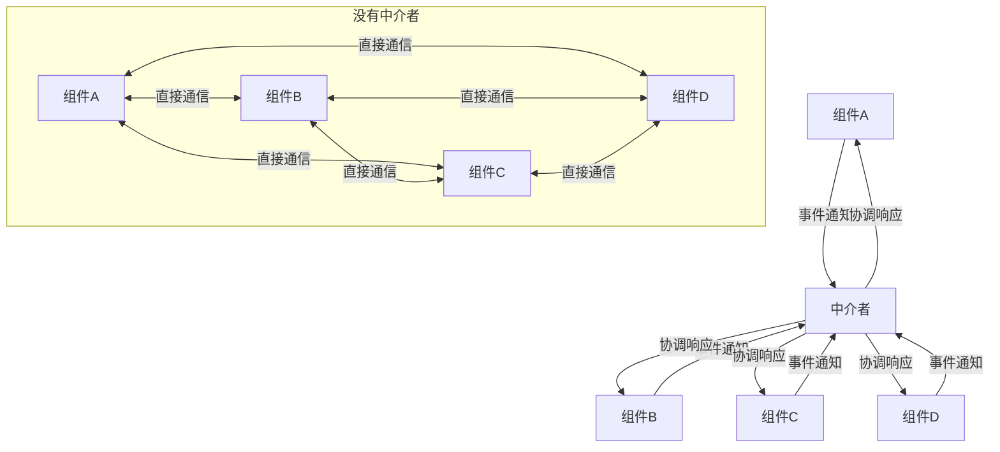

# 中介者模式 (Mediator Pattern)

## 目录

- [中介者模式 (Mediator Pattern)](#中介者模式-mediator-pattern)
  - [目录](#目录)
  - [1. 概述](#1-概述)
    - [1.1 模式定义](#11-模式定义)
    - [1.2 核心思想](#12-核心思想)
  - [2. 形式化定义](#2-形式化定义)
    - [2.1 数学定义](#21-数学定义)
    - [2.2 中介者代数](#22-中介者代数)
    - [2.3 中介者公理](#23-中介者公理)
  - [3. 结构分析](#3-结构分析)
    - [3.1 UML类图](#31-uml类图)
    - [3.2 时序图](#32-时序图)
    - [3.3 中介者通信流图](#33-中介者通信流图)
    - [3.4 中介者类型分析](#34-中介者类型分析)
  - [4. Golang实现](#4-golang实现)
    - [4.1 基本实现](#41-基本实现)
    - [4.2 事件驱动中介者](#42-事件驱动中介者)
    - [4.3 协调者中介者](#43-协调者中介者)
    - [4.4 中介者与通道结合](#44-中介者与通道结合)
  - [5. 性能分析](#5-性能分析)
    - [5.1 时间复杂度分析](#51-时间复杂度分析)
    - [5.2 空间复杂度分析](#52-空间复杂度分析)
    - [5.3 性能优化策略](#53-性能优化策略)
    - [5.4 基准测试](#54-基准测试)
  - [6. 应用场景](#6-应用场景)
    - [6.1 图形用户界面](#61-图形用户界面)
    - [6.2 聊天系统](#62-聊天系统)
    - [6.3 交通控制系统](#63-交通控制系统)
    - [6.4 前端框架](#64-前端框架)
  - [7. 最佳实践](#7-最佳实践)
    - [7.1 设计原则](#71-设计原则)
    - [7.2 实现建议](#72-实现建议)
    - [7.3 常见陷阱](#73-常见陷阱)
    - [7.4 与其他模式的关系](#74-与其他模式的关系)
  - [8. 案例分析](#8-案例分析)
    - [8.1 智能家居控制系统](#81-智能家居控制系统)
    - [8.2 聊天服务器](#82-聊天服务器)
    - [8.3 空中交通管制系统](#83-空中交通管制系统)

## 1. 概述

### 1.1 模式定义

中介者模式是一种行为型设计模式，它通过封装一系列对象之间的交互，使得这些对象不需要显式地相互引用，从而使其耦合松散。中介者模式通过使用一个中介对象来集中处理多个对象之间的通信，从而避免对象之间的直接依赖关系。

### 1.2 核心思想

- **集中通信**：将对象间的通信集中在中介者对象中处理
- **松散耦合**：减少对象之间的直接依赖关系
- **替换依赖**：将对象间的多对多关系转变为一对多关系
- **封装交互**：将复杂的交互逻辑封装在中介者中
- **单一职责**：中介者负责协调，组件负责自身业务逻辑

## 2. 形式化定义

### 2.1 数学定义

设 $M$ 为中介者集合，$C$ 为组件集合，定义中介者系统：

$$\mathcal{M} = (M, C, \Gamma, \Omega, \Phi)$$

其中：

- $\Gamma: C \times M \rightarrow M$ 为组件到中介者的通信函数
- $\Omega: M \times C \rightarrow C$ 为中介者到组件的通信函数
- $\Phi: M \times C \times C \rightarrow C$ 为中介者协调函数

### 2.2 中介者代数

定义中介者代数：

$$(M, C, \oplus, \otimes, \oslash)$$

其中：

- $\oplus: M \times M \rightarrow M$ 为中介者组合操作
- $\otimes: C \times M \rightarrow C$ 为组件注册操作
- $\oslash: C \times M \times C \rightarrow C$ 为组件通信操作

### 2.3 中介者公理

**公理1（通信传递）**：
$$\forall c_1, c_2 \in C, m \in M: c_1 \oslash m \oslash c_2 = \Phi(m, c_1, c_2)$$

**公理2（组件注册）**：
$$\forall c \in C, m \in M: c \otimes m = c'$$

**公理3（中介者更新）**：
$$\forall c \in C, m \in M: \Gamma(c, m) = m'$$

## 3. 结构分析

### 3.1 UML类图

```mermaid
classDiagram
    class Mediator {
        <<interface>>
        +Notify(sender Component, event string, data interface{})
    }
    
    class ConcreteMediator {
        -components map[string]Component
        +Register(name string, component Component)
        +Notify(sender Component, event string, data interface{})
    }
    
    class Component {
        <<interface>>
        +SetMediator(mediator Mediator)
        +GetName() string
    }
    
    class ConcreteComponentA {
        -mediator Mediator
        -name string
        +SetMediator(mediator Mediator)
        +GetName() string
        +DoA()
        +NotifyChanged()
    }
    
    class ConcreteComponentB {
        -mediator Mediator
        -name string
        +SetMediator(mediator Mediator)
        +GetName() string
        +DoB()
        +NotifyChanged()
    }
    
    Mediator <|.. ConcreteMediator
    Component <|.. ConcreteComponentA
    Component <|.. ConcreteComponentB
    ConcreteMediator --> Component : manages
    ConcreteComponentA --> Mediator : uses
    ConcreteComponentB --> Mediator : uses
```

### 3.2 时序图



### 3.3 中介者通信流图



### 3.4 中介者类型分析

中介者模式可以分为以下几种类型：

1. **集中式中介者**：所有组件只与一个中介者通信
2. **分布式中介者**：多个中介者协同工作，各自负责部分组件
3. **事件驱动中介者**：基于事件和订阅的中介者实现
4. **协调者中介者**：专注于协调组件状态而非通信的中介者
5. **智能中介者**：包含大量业务逻辑的中介者
6. **哑巴中介者**：仅提供简单路由功能的中介者

## 4. Golang实现

### 4.1 基本实现

```go
// Mediator 中介者接口
type Mediator interface {
    Notify(sender Component, event string, data interface{})
}

// Component 组件接口
type Component interface {
    SetMediator(mediator Mediator)
    GetName() string
}

// ConcreteMediator 具体中介者
type ConcreteMediator struct {
    components map[string]Component
}

// NewConcreteMediator 创建中介者
func NewConcreteMediator() *ConcreteMediator {
    return &ConcreteMediator{
        components: make(map[string]Component),
    }
}

// Register 注册组件
func (m *ConcreteMediator) Register(name string, component Component) {
    m.components[name] = component
    component.SetMediator(m)
}

// Notify 通知事件
func (m *ConcreteMediator) Notify(sender Component, event string, data interface{}) {
    switch event {
    case "A_EVENT":
        if component, exists := m.components["B"]; exists {
            fmt.Printf("Mediator reacting on %s and triggering B's action\n", event)
            if buttonB, ok := component.(*ConcreteComponentB); ok {
                buttonB.ReactToA(data.(string))
            }
        }
    case "B_EVENT":
        if component, exists := m.components["A"]; exists {
            fmt.Printf("Mediator reacting on %s and triggering A's action\n", event)
            if buttonA, ok := component.(*ConcreteComponentA); ok {
                buttonA.ReactToB(data.(int))
            }
        }
    }
}

// ConcreteComponentA 具体组件A
type ConcreteComponentA struct {
    mediator Mediator
    name     string
    state    string
}

// NewConcreteComponentA 创建组件A
func NewConcreteComponentA(name string) *ConcreteComponentA {
    return &ConcreteComponentA{
        name:  name,
        state: "Idle",
    }
}

// SetMediator 设置中介者
func (c *ConcreteComponentA) SetMediator(mediator Mediator) {
    c.mediator = mediator
}

// GetName 获取组件名称
func (c *ConcreteComponentA) GetName() string {
    return c.name
}

// DoA 组件A的操作
func (c *ConcreteComponentA) DoA() {
    fmt.Printf("Component A (%s) does A operation\n", c.name)
    c.mediator.Notify(c, "A_EVENT", "A has been clicked")
}

// ReactToB 响应组件B的事件
func (c *ConcreteComponentA) ReactToB(data int) {
    c.state = fmt.Sprintf("Reacting to B: %d", data)
    fmt.Printf("Component A now has state: %s\n", c.state)
}

// ConcreteComponentB 具体组件B
type ConcreteComponentB struct {
    mediator Mediator
    name     string
    count    int
}

// NewConcreteComponentB 创建组件B
func NewConcreteComponentB(name string) *ConcreteComponentB {
    return &ConcreteComponentB{
        name:  name,
        count: 0,
    }
}

// SetMediator 设置中介者
func (c *ConcreteComponentB) SetMediator(mediator Mediator) {
    c.mediator = mediator
}

// GetName 获取组件名称
func (c *ConcreteComponentB) GetName() string {
    return c.name
}

// DoB 组件B的操作
func (c *ConcreteComponentB) DoB() {
    fmt.Printf("Component B (%s) does B operation\n", c.name)
    c.count++
    c.mediator.Notify(c, "B_EVENT", c.count)
}

// ReactToA 响应组件A的事件
func (c *ConcreteComponentB) ReactToA(data string) {
    fmt.Printf("Component B reacts to A with data: %s\n", data)
    if data == "A has been clicked" {
        c.DoB()
    }
}
```

### 4.2 事件驱动中介者

```go
// EventMediator 事件驱动中介者
type EventMediator struct {
    subscribers map[string][]func(interface{})
    mutex       sync.RWMutex
}

// NewEventMediator 创建事件驱动中介者
func NewEventMediator() *EventMediator {
    return &EventMediator{
        subscribers: make(map[string][]func(interface{})),
    }
}

// Subscribe 订阅事件
func (m *EventMediator) Subscribe(event string, fn func(interface{})) {
    m.mutex.Lock()
    defer m.mutex.Unlock()
    
    m.subscribers[event] = append(m.subscribers[event], fn)
}

// Publish 发布事件
func (m *EventMediator) Publish(event string, data interface{}) {
    m.mutex.RLock()
    subscribers, exists := m.subscribers[event]
    m.mutex.RUnlock()
    
    if exists {
        for _, fn := range subscribers {
            go fn(data)
        }
    }
}

// EventComponent 事件组件
type EventComponent struct {
    mediator *EventMediator
    name     string
}

// NewEventComponent 创建事件组件
func NewEventComponent(name string, mediator *EventMediator) *EventComponent {
    return &EventComponent{
        name:     name,
        mediator: mediator,
    }
}

// SendEvent 发送事件
func (c *EventComponent) SendEvent(event string, data interface{}) {
    fmt.Printf("Component %s sending event: %s\n", c.name, event)
    c.mediator.Publish(event, data)
}

// RegisterHandler 注册事件处理器
func (c *EventComponent) RegisterHandler(event string, handler func(interface{})) {
    wrappedHandler := func(data interface{}) {
        fmt.Printf("Component %s handling event: %s\n", c.name, event)
        handler(data)
    }
    c.mediator.Subscribe(event, wrappedHandler)
}
```

### 4.3 协调者中介者

```go
// StateMediator 状态协调中介者
type StateMediator struct {
    components map[string]StateComponent
    states     map[string]interface{}
    mutex      sync.RWMutex
}

// NewStateMediator 创建状态协调中介者
func NewStateMediator() *StateMediator {
    return &StateMediator{
        components: make(map[string]StateComponent),
        states:     make(map[string]interface{}),
    }
}

// Register 注册组件
func (m *StateMediator) Register(name string, component StateComponent) {
    m.components[name] = component
}

// SetState 设置状态
func (m *StateMediator) SetState(key string, value interface{}) {
    m.mutex.Lock()
    defer m.mutex.Unlock()
    
    m.states[key] = value
    
    // 通知所有依赖该状态的组件
    for _, component := range m.components {
        if component.DependsOnState(key) {
            component.OnStateChanged(key, value)
        }
    }
}

// GetState 获取状态
func (m *StateMediator) GetState(key string) (interface{}, bool) {
    m.mutex.RLock()
    defer m.mutex.RUnlock()
    
    value, exists := m.states[key]
    return value, exists
}

// StateComponent 状态组件接口
type StateComponent interface {
    DependsOnState(key string) bool
    OnStateChanged(key string, value interface{})
}

// UserComponent 用户组件
type UserComponent struct {
    mediator    *StateMediator
    name        string
    dependencies []string
    userData    map[string]interface{}
}

// NewUserComponent 创建用户组件
func NewUserComponent(name string, mediator *StateMediator, dependencies []string) *UserComponent {
    component := &UserComponent{
        mediator:     mediator,
        name:         name,
        dependencies: dependencies,
        userData:     make(map[string]interface{}),
    }
    mediator.Register(name, component)
    return component
}

// DependsOnState 是否依赖状态
func (c *UserComponent) DependsOnState(key string) bool {
    for _, dep := range c.dependencies {
        if dep == key {
            return true
        }
    }
    return false
}

// OnStateChanged 状态改变时的回调
func (c *UserComponent) OnStateChanged(key string, value interface{}) {
    fmt.Printf("Component %s received state update for %s: %v\n", c.name, key, value)
    c.userData[key] = value
    
    // 根据状态更新执行操作
    if key == "theme" {
        fmt.Printf("Component %s updated theme to: %v\n", c.name, value)
    } else if key == "language" {
        fmt.Printf("Component %s updated language to: %v\n", c.name, value)
    }
}
```

### 4.4 中介者与通道结合

```go
// ChannelMediator 基于通道的中介者
type ChannelMediator struct {
    eventChan  chan Event
    components map[string]ChannelComponent
    done       chan struct{}
}

// Event 事件结构
type Event struct {
    Type    string
    Source  string
    Target  string
    Payload interface{}
}

// NewChannelMediator 创建基于通道的中介者
func NewChannelMediator() *ChannelMediator {
    mediator := &ChannelMediator{
        eventChan:  make(chan Event, 10),
        components: make(map[string]ChannelComponent),
        done:       make(chan struct{}),
    }
    
    // 启动事件处理循环
    go mediator.eventLoop()
    
    return mediator
}

// eventLoop 事件处理循环
func (m *ChannelMediator) eventLoop() {
    for {
        select {
        case event := <-m.eventChan:
            m.handleEvent(event)
        case <-m.done:
            return
        }
    }
}

// handleEvent 处理事件
func (m *ChannelMediator) handleEvent(event Event) {
    if event.Target == "" {
        // 广播事件
        for name, component := range m.components {
            if name != event.Source {
                component.HandleEvent(event)
            }
        }
    } else if component, exists := m.components[event.Target]; exists {
        // 发送给特定组件
        component.HandleEvent(event)
    }
}

// Register 注册组件
func (m *ChannelMediator) Register(name string, component ChannelComponent) {
    m.components[name] = component
}

// SendEvent 发送事件
func (m *ChannelMediator) SendEvent(event Event) {
    m.eventChan <- event
}

// Stop 停止中介者
func (m *ChannelMediator) Stop() {
    close(m.done)
}

// ChannelComponent 通道组件接口
type ChannelComponent interface {
    HandleEvent(event Event)
    GetName() string
}

// ConcreteChannelComponent 具体通道组件
type ConcreteChannelComponent struct {
    mediator *ChannelMediator
    name     string
}

// NewConcreteChannelComponent 创建具体通道组件
func NewConcreteChannelComponent(name string, mediator *ChannelMediator) *ConcreteChannelComponent {
    component := &ConcreteChannelComponent{
        mediator: mediator,
        name:     name,
    }
    mediator.Register(name, component)
    return component
}

// HandleEvent 处理事件
func (c *ConcreteChannelComponent) HandleEvent(event Event) {
    fmt.Printf("Component %s received event %s from %s with payload: %v\n",
        c.name, event.Type, event.Source, event.Payload)
}

// GetName 获取组件名称
func (c *ConcreteChannelComponent) GetName() string {
    return c.name
}

// SendEvent 发送事件
func (c *ConcreteChannelComponent) SendEvent(eventType string, target string, payload interface{}) {
    event := Event{
        Type:    eventType,
        Source:  c.name,
        Target:  target,
        Payload: payload,
    }
    c.mediator.SendEvent(event)
}
```

## 5. 性能分析

### 5.1 时间复杂度分析

- **组件注册**：$O(1)$，使用哈希表进行存储
- **事件分发**：$O(n)$，其中 $n$ 是接收事件的组件数量
- **状态更新**：$O(n)$，其中 $n$ 是依赖该状态的组件数量
- **组件查询**：$O(1)$，哈希表查找
- **事件订阅**：$O(1)$，添加到订阅列表

### 5.2 空间复杂度分析

- **中介者**：$O(n + m)$，其中 $n$ 是组件数量，$m$ 是状态/事件数量
- **组件引用**：$O(1)$，每个组件只存储一个中介者引用
- **事件缓冲区**：$O(k)$，其中 $k$ 是缓冲区容量
- **状态存储**：$O(s)$，其中 $s$ 是状态键值对数量

### 5.3 性能优化策略

1. **分片存储**：将组件分组管理，减少单个中介者的负担
2. **局部中介者**：使用多个专用中介者，而非单一全局中介者
3. **惰性通知**：只在真正需要时才通知组件
4. **事件过滤**：只处理关注的事件，减少不必要的处理
5. **批量更新**：将多次状态更新批量处理，减少通知次数

```go
// BatchMediator 批量处理更新的中介者
type BatchMediator struct {
    components map[string]Component
    updates    map[string]interface{}
    mutex      sync.Mutex
    batchSize  int
    ticker     *time.Ticker
    done       chan struct{}
}

// NewBatchMediator 创建批量处理中介者
func NewBatchMediator(batchInterval time.Duration) *BatchMediator {
    m := &BatchMediator{
        components: make(map[string]Component),
        updates:    make(map[string]interface{}),
        batchSize:  0,
        ticker:     time.NewTicker(batchInterval),
        done:       make(chan struct{}),
    }
    
    // 启动批处理协程
    go m.batchProcess()
    
    return m
}

// batchProcess 批量处理更新
func (m *BatchMediator) batchProcess() {
    for {
        select {
        case <-m.ticker.C:
            m.flushUpdates()
        case <-m.done:
            m.ticker.Stop()
            return
        }
    }
}

// flushUpdates 刷新更新
func (m *BatchMediator) flushUpdates() {
    m.mutex.Lock()
    defer m.mutex.Unlock()
    
    if m.batchSize == 0 {
        return
    }
    
    updates := m.updates
    m.updates = make(map[string]interface{})
    m.batchSize = 0
    
    // 通知组件
    for k, v := range updates {
        for _, c := range m.components {
            c.HandleUpdate(k, v)
        }
    }
}

// QueueUpdate 添加更新到队列
func (m *BatchMediator) QueueUpdate(key string, value interface{}) {
    m.mutex.Lock()
    defer m.mutex.Unlock()
    
    m.updates[key] = value
    m.batchSize++
    
    // 如果批量过大，立即刷新
    if m.batchSize >= 100 {
        go m.flushUpdates()
    }
}
```

### 5.4 基准测试

```go
func BenchmarkBasicMediator(b *testing.B) {
    mediator := NewConcreteMediator()
    componentA := NewConcreteComponentA("A")
    componentB := NewConcreteComponentB("B")
    
    mediator.Register("A", componentA)
    mediator.Register("B", componentB)
    
    b.ResetTimer()
    for i := 0; i < b.N; i++ {
        componentA.DoA()
    }
}

func BenchmarkChannelMediator(b *testing.B) {
    mediator := NewChannelMediator()
    componentA := NewConcreteChannelComponent("A", mediator)
    componentB := NewConcreteChannelComponent("B", mediator)
    
    b.ResetTimer()
    for i := 0; i < b.N; i++ {
        componentA.SendEvent("test", "B", i)
    }
    
    mediator.Stop()
}
```

## 6. 应用场景

### 6.1 图形用户界面

- **窗口管理**：协调不同窗口、对话框之间的交互
- **控件交互**：处理按钮、文本框、下拉菜单等控件间的通信
- **拖放操作**：管理拖放源与目标之间的交互
- **视图控制器**：协调模型和视图之间的数据流

### 6.2 聊天系统

- **消息路由**：将消息从发送者路由到接收者
- **用户状态**：管理用户在线状态并通知相关方
- **房间管理**：处理聊天室中用户的加入和退出
- **通知系统**：发送系统通知给相关用户

### 6.3 交通控制系统

- **信号灯协调**：协调不同路口的信号灯状态
- **车辆调度**：协调不同车辆的行驶路径和调度
- **拥堵检测**：接收拥堵信息并通知相关车辆
- **紧急响应**：处理紧急情况下的交通调控

### 6.4 前端框架

- **组件通信**：React/Vue中组件间的通信管理
- **状态管理**：Redux/Vuex等状态管理工具
- **事件总线**：处理跨组件事件传递
- **服务定位**：依赖注入和服务定位功能

## 7. 最佳实践

### 7.1 设计原则

1. **单一职责**：每个组件只处理自己的业务逻辑，中介者负责协调
2. **开闭原则**：添加新组件不需要修改现有组件，只需要更新中介者
3. **接口隔离**：中介者接口应该是小而精确的
4. **依赖倒置**：组件应该依赖于抽象中介者接口
5. **最少知识**：组件只需要知道中介者，不需要知道其他组件

### 7.2 实现建议

1. **避免过度集中**：不要让中介者变成上帝对象
2. **分解大型中介者**：将大型中介者拆分为多个专用中介者
3. **异步处理**：使用通道或消息队列进行异步通信
4. **类型安全**：使用泛型或接口约束提高类型安全性
5. **中介者层次结构**：为不同类型的中介者建立层次结构

### 7.3 常见陷阱

1. **中介者膨胀**：中介者承担过多职责，变成上帝对象
2. **循环依赖**：中介者和组件之间形成循环依赖
3. **性能瓶颈**：所有通信都通过中介者，可能成为性能瓶颈
4. **类型转换过多**：频繁的类型断言或转换降低了类型安全性
5. **缺少封装**：中介者直接访问组件的内部状态

### 7.4 与其他模式的关系

- **观察者模式**：中介者常使用观察者模式实现组件间的通信
- **外观模式**：中介者为复杂子系统提供了简化的接口
- **命令模式**：命令可以通过中介者发送给适当的接收者
- **策略模式**：中介者可以根据情况选择不同的组件交互策略
- **状态模式**：中介者可以根据状态改变组件的行为

## 8. 案例分析

### 8.1 智能家居控制系统

在智能家居控制系统中，中介者模式可以用于协调不同设备之间的通信和状态同步。

```go
// HomeDevice 家居设备接口
type HomeDevice interface {
    GetID() string
    GetType() string
    GetStatus() map[string]interface{}
    UpdateStatus(key string, value interface{})
    Execute(command string, params map[string]interface{}) error
}

// SmartHomeMediator 智能家居中介者
type SmartHomeMediator struct {
    devices       map[string]HomeDevice
    devicesByType map[string][]HomeDevice
    scenes        map[string][]DeviceCommand
    mutex         sync.RWMutex
}

// DeviceCommand 设备命令
type DeviceCommand struct {
    DeviceID string
    Command  string
    Params   map[string]interface{}
}

// NewSmartHomeMediator 创建智能家居中介者
func NewSmartHomeMediator() *SmartHomeMediator {
    return &SmartHomeMediator{
        devices:       make(map[string]HomeDevice),
        devicesByType: make(map[string][]HomeDevice),
        scenes:        make(map[string][]DeviceCommand),
    }
}

// RegisterDevice 注册设备
func (m *SmartHomeMediator) RegisterDevice(device HomeDevice) {
    m.mutex.Lock()
    defer m.mutex.Unlock()
    
    deviceID := device.GetID()
    deviceType := device.GetType()
    
    m.devices[deviceID] = device
    m.devicesByType[deviceType] = append(m.devicesByType[deviceType], device)
    
    fmt.Printf("Device registered: %s (Type: %s)\n", deviceID, deviceType)
}

// ExecuteCommand 执行设备命令
func (m *SmartHomeMediator) ExecuteCommand(deviceID, command string, params map[string]interface{}) error {
    m.mutex.RLock()
    device, exists := m.devices[deviceID]
    m.mutex.RUnlock()
    
    if !exists {
        return fmt.Errorf("device not found: %s", deviceID)
    }
    
    // 执行命令
    err := device.Execute(command, params)
    if err != nil {
        return err
    }
    
    // 检查是否需要协调其他设备
    m.coordinateDevices(device, command, params)
    
    return nil
}

// coordinateDevices 协调设备
func (m *SmartHomeMediator) coordinateDevices(triggerDevice HomeDevice, command string, params map[string]interface{}) {
    // 根据触发设备的命令协调其他设备
    deviceType := triggerDevice.GetType()
    deviceID := triggerDevice.GetID()
    
    switch deviceType {
    case "MotionSensor":
        if command == "motion_detected" {
            // 如果动作传感器检测到动作，打开相关房间的灯
            room := params["room"].(string)
            m.turnOnLightsInRoom(room)
        }
    case "TemperatureSensor":
        if command == "temperature_change" {
            // 如果温度传感器检测到温度变化，调整空调
            temp := params["temperature"].(float64)
            m.adjustAirConditioners(temp)
        }
    case "LightSwitch":
        if command == "turn_off" {
            // 如果关闭了灯，检查房间是否空闲
            room := params["room"].(string)
            m.checkRoomVacancy(room, deviceID)
        }
    }
}

// turnOnLightsInRoom 打开房间的灯
func (m *SmartHomeMediator) turnOnLightsInRoom(room string) {
    m.mutex.RLock()
    defer m.mutex.RUnlock()
    
    // 查找特定房间的灯
    for _, device := range m.devicesByType["Light"] {
        status := device.GetStatus()
        if deviceRoom, ok := status["room"].(string); ok && deviceRoom == room {
            device.Execute("turn_on", map[string]interface{}{
                "brightness": 80,
            })
            fmt.Printf("Turned on light in room %s due to motion detection\n", room)
        }
    }
}

// adjustAirConditioners 调整空调
func (m *SmartHomeMediator) adjustAirConditioners(temperature float64) {
    m.mutex.RLock()
    defer m.mutex.RUnlock()
    
    // 根据温度调整空调
    for _, device := range m.devicesByType["AirConditioner"] {
        if temperature > 26 {
            device.Execute("set_mode", map[string]interface{}{
                "mode": "cooling",
                "temperature": 24,
            })
        } else if temperature < 20 {
            device.Execute("set_mode", map[string]interface{}{
                "mode": "heating",
                "temperature": 22,
            })
        }
    }
}

// checkRoomVacancy 检查房间是否空闲
func (m *SmartHomeMediator) checkRoomVacancy(room string, excludeDeviceID string) {
    m.mutex.RLock()
    defer m.mutex.RUnlock()
    
    // 检查该房间的其他灯是否都已关闭
    allLightsOff := true
    for _, device := range m.devicesByType["Light"] {
        if device.GetID() == excludeDeviceID {
            continue
        }
        
        status := device.GetStatus()
        if deviceRoom, ok := status["room"].(string); ok && deviceRoom == room {
            if isOn, ok := status["is_on"].(bool); ok && isOn {
                allLightsOff = false
                break
            }
        }
    }
    
    // 如果所有灯都已关闭，则关闭其他设备
    if allLightsOff {
        for _, device := range m.devicesByType["AirConditioner"] {
            status := device.GetStatus()
            if deviceRoom, ok := status["room"].(string); ok && deviceRoom == room {
                device.Execute("set_power", map[string]interface{}{
                    "power": false,
                })
                fmt.Printf("Turned off air conditioner in room %s as it appears vacant\n", room)
            }
        }
    }
}

// ActivateScene 激活场景
func (m *SmartHomeMediator) ActivateScene(sceneName string) error {
    m.mutex.RLock()
    commands, exists := m.scenes[sceneName]
    m.mutex.RUnlock()
    
    if !exists {
        return fmt.Errorf("scene not found: %s", sceneName)
    }
    
    // 执行场景中的所有命令
    for _, cmd := range commands {
        m.ExecuteCommand(cmd.DeviceID, cmd.Command, cmd.Params)
    }
    
    fmt.Printf("Activated scene: %s\n", sceneName)
    return nil
}

// CreateScene 创建场景
func (m *SmartHomeMediator) CreateScene(sceneName string, commands []DeviceCommand) {
    m.mutex.Lock()
    defer m.mutex.Unlock()
    
    m.scenes[sceneName] = commands
    fmt.Printf("Created scene: %s with %d commands\n", sceneName, len(commands))
}
```

这个智能家居中介者案例展示了中介者模式如何在复杂的设备协调系统中发挥作用：

1. 各设备仅需关注自身功能，不需要知道其他设备的存在
2. 中介者负责协调不同设备的状态，处理设备间的联动
3. 通过场景功能，可以实现复杂的设备组合控制
4. 设备可以随时添加或移除，不影响系统的整体运行

### 8.2 聊天服务器

聊天服务器是中介者模式的典型应用场景，服务器作为中介者协调多个客户端之间的通信。

```go
// ChatServer 聊天服务器中介者
type ChatServer struct {
    clients    map[string]*ChatClient
    rooms      map[string]map[string]*ChatClient
    mutex      sync.RWMutex
    msgHistory map[string][]ChatMessage
}

// ChatMessage 聊天消息
type ChatMessage struct {
    From    string
    To      string
    Room    string
    Content string
    Time    time.Time
}

// NewChatServer 创建聊天服务器
func NewChatServer() *ChatServer {
    return &ChatServer{
        clients:    make(map[string]*ChatClient),
        rooms:      make(map[string]map[string]*ChatClient),
        msgHistory: make(map[string][]ChatMessage),
    }
}

// Register 注册客户端
func (s *ChatServer) Register(client *ChatClient) {
    s.mutex.Lock()
    defer s.mutex.Unlock()
    
    s.clients[client.ID] = client
    fmt.Printf("Client registered: %s (%s)\n", client.ID, client.Name)
}

// Unregister 注销客户端
func (s *ChatServer) Unregister(clientID string) {
    s.mutex.Lock()
    defer s.mutex.Unlock()
    
    // 从所有房间中移除
    for roomName, room := range s.rooms {
        if _, exists := room[clientID]; exists {
            delete(room, clientID)
            fmt.Printf("Client %s removed from room %s\n", clientID, roomName)
        }
    }
    
    // 从客户端列表中移除
    delete(s.clients, clientID)
    fmt.Printf("Client unregistered: %s\n", clientID)
}

// JoinRoom 加入房间
func (s *ChatServer) JoinRoom(clientID, roomName string) {
    s.mutex.Lock()
    defer s.mutex.Unlock()
    
    client, exists := s.clients[clientID]
    if !exists {
        return
    }
    
    // 如果房间不存在，创建它
    if _, exists := s.rooms[roomName]; !exists {
        s.rooms[roomName] = make(map[string]*ChatClient)
    }
    
    // 将客户端添加到房间
    s.rooms[roomName][clientID] = client
    fmt.Printf("Client %s joined room %s\n", clientID, roomName)
    
    // 向房间内所有人发送通知
    joinMsg := ChatMessage{
        From:    "System",
        To:      "",
        Room:    roomName,
        Content: fmt.Sprintf("User %s joined the room", client.Name),
        Time:    time.Now(),
    }
    
    s.broadcastToRoom(joinMsg)
}

// LeaveRoom 离开房间
func (s *ChatServer) LeaveRoom(clientID, roomName string) {
    s.mutex.Lock()
    defer s.mutex.Unlock()
    
    client, exists := s.clients[clientID]
    if !exists {
        return
    }
    
    room, exists := s.rooms[roomName]
    if !exists {
        return
    }
    
    // 将客户端从房间移除
    delete(room, clientID)
    fmt.Printf("Client %s left room %s\n", clientID, roomName)
    
    // 向房间内所有人发送通知
    leaveMsg := ChatMessage{
        From:    "System",
        To:      "",
        Room:    roomName,
        Content: fmt.Sprintf("User %s left the room", client.Name),
        Time:    time.Now(),
    }
    
    s.broadcastToRoom(leaveMsg)
}

// SendMessage 发送消息
func (s *ChatServer) SendMessage(msg ChatMessage) {
    s.mutex.Lock()
    defer s.mutex.Unlock()
    
    if msg.Room != "" {
        // 房间消息
        s.broadcastToRoom(msg)
    } else if msg.To != "" {
        // 私聊消息
        s.directMessage(msg)
    } else {
        // 全局消息
        s.broadcastToAll(msg)
    }
    
    // 保存消息历史
    if msg.Room != "" {
        s.msgHistory[msg.Room] = append(s.msgHistory[msg.Room], msg)
    }
}

// broadcastToRoom 广播消息到房间
func (s *ChatServer) broadcastToRoom(msg ChatMessage) {
    room, exists := s.rooms[msg.Room]
    if !exists {
        return
    }
    
    for _, client := range room {
        client.ReceiveMessage(msg)
    }
}

// directMessage 发送私聊消息
func (s *ChatServer) directMessage(msg ChatMessage) {
    // 发送给接收者
    if recipient, exists := s.clients[msg.To]; exists {
        recipient.ReceiveMessage(msg)
    }
    
    // 如果发送者不是系统，也发送给发送者（确认消息已发送）
    if msg.From != "System" {
        if sender, exists := s.clients[msg.From]; exists {
            sender.ReceiveMessage(msg)
        }
    }
}

// broadcastToAll 广播消息给所有客户端
func (s *ChatServer) broadcastToAll(msg ChatMessage) {
    for _, client := range s.clients {
        client.ReceiveMessage(msg)
    }
}

// GetRoomHistory 获取房间消息历史
func (s *ChatServer) GetRoomHistory(roomName string) []ChatMessage {
    s.mutex.RLock()
    defer s.mutex.RUnlock()
    
    return s.msgHistory[roomName]
}

// ChatClient 聊天客户端
type ChatClient struct {
    ID       string
    Name     string
    server   *ChatServer
    msgQueue chan ChatMessage
}

// NewChatClient 创建聊天客户端
func NewChatClient(id, name string, server *ChatServer) *ChatClient {
    client := &ChatClient{
        ID:       id,
        Name:     name,
        server:   server,
        msgQueue: make(chan ChatMessage, 100),
    }
    
    server.Register(client)
    
    // 启动消息处理
    go client.processMessages()
    
    return client
}

// processMessages 处理消息队列
func (c *ChatClient) processMessages() {
    for msg := range c.msgQueue {
        fmt.Printf("[%s] %s in %s: %s\n", 
            msg.Time.Format("15:04:05"),
            msg.From,
            msg.Room,
            msg.Content,
        )
        
        // 处理实际客户端UI更新或其他逻辑
    }
}

// ReceiveMessage 接收消息
func (c *ChatClient) ReceiveMessage(msg ChatMessage) {
    select {
    case c.msgQueue <- msg:
        // 成功发送到队列
    default:
        // 队列已满，消息被丢弃
        fmt.Printf("Message queue full for client %s, message dropped\n", c.ID)
    }
}

// SendMessage 发送消息
func (c *ChatClient) SendMessage(to, room, content string) {
    msg := ChatMessage{
        From:    c.ID,
        To:      to,
        Room:    room,
        Content: content,
        Time:    time.Now(),
    }
    
    c.server.SendMessage(msg)
}

// JoinRoom 加入房间
func (c *ChatClient) JoinRoom(roomName string) {
    c.server.JoinRoom(c.ID, roomName)
}

// LeaveRoom 离开房间
func (c *ChatClient) LeaveRoom(roomName string) {
    c.server.LeaveRoom(c.ID, roomName)
}

// Disconnect 断开连接
func (c *ChatClient) Disconnect() {
    close(c.msgQueue)
    c.server.Unregister(c.ID)
}
```

这个聊天服务器中介者案例展示了中介者模式在通信系统中的应用：

1. 聊天服务器作为中介者，客户端之间不直接通信
2. 中介者负责消息路由、房间管理、历史记录等协调功能
3. 客户端只需发送和接收消息，不需要知道其他客户端的实现细节
4. 添加新功能（如私聊、文件传输）只需修改中介者，不影响客户端核心逻辑

### 8.3 空中交通管制系统

空中交通管制系统是中介者模式的理想应用场景，这里管制塔作为中介者协调多架飞机的飞行路线和降落顺序。

```go
// AirTrafficControl 空中交通管制中心（中介者）
type AirTrafficControl struct {
    aircraft          map[string]*Aircraft
    runways           map[string]*Runway
    approachQueue     []string
    departureQueue    []string
    weatherConditions string
    mutex             sync.RWMutex
}

// NewAirTrafficControl 创建空中交通管制中心
func NewAirTrafficControl() *AirTrafficControl {
    return &AirTrafficControl{
        aircraft:          make(map[string]*Aircraft),
        runways:           make(map[string]*Runway),
        approachQueue:     []string{},
        departureQueue:    []string{},
        weatherConditions: "Clear",
    }
}

// RegisterAircraft 注册飞机
func (atc *AirTrafficControl) RegisterAircraft(aircraft *Aircraft) {
    atc.mutex.Lock()
    defer atc.mutex.Unlock()
    
    atc.aircraft[aircraft.ID] = aircraft
    fmt.Printf("Aircraft %s registered with ATC\n", aircraft.ID)
}

// RegisterRunway 注册跑道
func (atc *AirTrafficControl) RegisterRunway(runway *Runway) {
    atc.mutex.Lock()
    defer atc.mutex.Unlock()
    
    atc.runways[runway.ID] = runway
    fmt.Printf("Runway %s registered with ATC\n", runway.ID)
}

// RequestLanding 请求降落
func (atc *AirTrafficControl) RequestLanding(aircraftID string) {
    atc.mutex.Lock()
    defer atc.mutex.Unlock()
    
    aircraft, exists := atc.aircraft[aircraftID]
    if !exists {
        return
    }
    
    fmt.Printf("Aircraft %s requesting landing\n", aircraftID)
    
    // 添加到降落队列
    atc.approachQueue = append(atc.approachQueue, aircraftID)
    
    // 指示飞机进入等待模式
    aircraft.ReceiveInstruction("HOLD", map[string]interface{}{
        "altitude": 10000,
        "position": "approach pattern",
        "queue":    len(atc.approachQueue),
    })
    
    // 尝试为队列中的飞机分配跑道
    atc.assignRunways()
}

// RequestTakeoff 请求起飞
func (atc *AirTrafficControl) RequestTakeoff(aircraftID string) {
    atc.mutex.Lock()
    defer atc.mutex.Unlock()
    
    aircraft, exists := atc.aircraft[aircraftID]
    if !exists {
        return
    }
    
    fmt.Printf("Aircraft %s requesting takeoff\n", aircraftID)
    
    // 添加到起飞队列
    atc.departureQueue = append(atc.departureQueue, aircraftID)
    
    // 指示飞机准备起飞
    aircraft.ReceiveInstruction("PREPARE", map[string]interface{}{
        "queue": len(atc.departureQueue),
    })
    
    // 尝试为队列中的飞机分配跑道
    atc.assignRunways()
}

// assignRunways 分配跑道
func (atc *AirTrafficControl) assignRunways() {
    // 处理降落请求（优先）
    for len(atc.approachQueue) > 0 {
        // 寻找可用跑道
        var availableRunway *Runway
        var runwayID string
        
        for id, runway := range atc.runways {
            if !runway.InUse {
                availableRunway = runway
                runwayID = id
                break
            }
        }
        
        if availableRunway == nil {
            // 没有可用跑道
            break
        }
        
        // 分配跑道给队首飞机
        aircraftID := atc.approachQueue[0]
        atc.approachQueue = atc.approachQueue[1:] // 移除队首
        
        aircraft := atc.aircraft[aircraftID]
        availableRunway.InUse = true
        
        // 通知飞机降落
        aircraft.ReceiveInstruction("CLEAR_TO_LAND", map[string]interface{}{
            "runway": runwayID,
            "heading": availableRunway.Heading,
            "wind": atc.weatherConditions,
        })
        
        // 启动跑道计时器
        go func(runway *Runway, aircraftID string) {
            // 模拟着陆时间
            time.Sleep(3 * time.Minute)
            
            atc.mutex.Lock()
            defer atc.mutex.Unlock()
            
            // 标记跑道为可用
            runway.InUse = false
            fmt.Printf("Aircraft %s completed landing, runway %s now available\n", 
                aircraftID, runway.ID)
            
            // 尝试为队列中的飞机分配跑道
            atc.assignRunways()
        }(availableRunway, aircraftID)
    }
    
    // 处理起飞请求
    for len(atc.departureQueue) > 0 {
        // 寻找可用跑道
        var availableRunway *Runway
        var runwayID string
        
        for id, runway := range atc.runways {
            if !runway.InUse {
                availableRunway = runway
                runwayID = id
                break
            }
        }
        
        if availableRunway == nil {
            // 没有可用跑道
            break
        }
        
        // 分配跑道给队首飞机
        aircraftID := atc.departureQueue[0]
        atc.departureQueue = atc.departureQueue[1:] // 移除队首
        
        aircraft := atc.aircraft[aircraftID]
        availableRunway.InUse = true
        
        // 通知飞机起飞
        aircraft.ReceiveInstruction("CLEAR_FOR_TAKEOFF", map[string]interface{}{
            "runway": runwayID,
            "heading": availableRunway.Heading,
            "wind": atc.weatherConditions,
        })
        
        // 启动跑道计时器
        go func(runway *Runway, aircraftID string) {
            // 模拟起飞时间
            time.Sleep(2 * time.Minute)
            
            atc.mutex.Lock()
            defer atc.mutex.Unlock()
            
            // 标记跑道为可用
            runway.InUse = false
            fmt.Printf("Aircraft %s completed takeoff, runway %s now available\n", 
                aircraftID, runway.ID)
            
            // 尝试为队列中的飞机分配跑道
            atc.assignRunways()
        }(availableRunway, aircraftID)
    }
}

// UpdateWeather 更新天气状况
func (atc *AirTrafficControl) UpdateWeather(conditions string) {
    atc.mutex.Lock()
    defer atc.mutex.Unlock()
    
    atc.weatherConditions = conditions
    fmt.Printf("Weather conditions updated to: %s\n", conditions)
    
    // 广播天气变化给所有飞机
    for _, aircraft := range atc.aircraft {
        aircraft.ReceiveInstruction("WEATHER_UPDATE", map[string]interface{}{
            "conditions": conditions,
        })
    }
}

// Aircraft 飞机
type Aircraft struct {
    ID           string
    Type         string
    Status       string
    Altitude     int
    atc          *AirTrafficControl
    instructions chan map[string]interface{}
}

// NewAircraft 创建飞机
func NewAircraft(id, aircraftType string, atc *AirTrafficControl) *Aircraft {
    aircraft := &Aircraft{
        ID:           id,
        Type:         aircraftType,
        Status:       "En Route",
        Altitude:     30000,
        atc:          atc,
        instructions: make(chan map[string]interface{}, 10),
    }
    
    atc.RegisterAircraft(aircraft)
    
    // 启动指令处理
    go aircraft.processInstructions()
    
    return aircraft
}

// processInstructions 处理指令
func (a *Aircraft) processInstructions() {
    for instruction := range a.instructions {
        command := instruction["command"].(string)
        fmt.Printf("Aircraft %s processing instruction: %s\n", a.ID, command)
        
        switch command {
        case "HOLD":
            a.Status = "Holding"
            a.Altitude = instruction["altitude"].(int)
        case "CLEAR_TO_LAND":
            a.Status = "Landing"
            fmt.Printf("Aircraft %s beginning landing approach on runway %s\n", 
                a.ID, instruction["runway"].(string))
        case "CLEAR_FOR_TAKEOFF":
            a.Status = "Taking Off"
            fmt.Printf("Aircraft %s beginning takeoff from runway %s\n", 
                a.ID, instruction["runway"].(string))
        case "WEATHER_UPDATE":
            fmt.Printf("Aircraft %s acknowledges weather update: %s\n", 
                a.ID, instruction["conditions"].(string))
        }
    }
}

// ReceiveInstruction 接收指令
func (a *Aircraft) ReceiveInstruction(command string, params map[string]interface{}) {
    instruction := map[string]interface{}{
        "command": command,
    }
    
    // 合并参数
    for k, v := range params {
        instruction[k] = v
    }
    
    select {
    case a.instructions <- instruction:
        // 成功发送指令
    default:
        fmt.Printf("Warning: instruction queue full for aircraft %s\n", a.ID)
    }
}

// RequestLanding 请求降落
func (a *Aircraft) RequestLanding() {
    a.atc.RequestLanding(a.ID)
}

// RequestTakeoff 请求起飞
func (a *Aircraft) RequestTakeoff() {
    a.atc.RequestTakeoff(a.ID)
}

// Runway 跑道
type Runway struct {
    ID      string
    Length  int
    Heading int
    InUse   bool
}

// NewRunway 创建跑道
func NewRunway(id string, length, heading int, atc *AirTrafficControl) *Runway {
    runway := &Runway{
        ID:      id,
        Length:  length,
        Heading: heading,
        InUse:   false,
    }
    
    atc.RegisterRunway(runway)
    return runway
}
```

这个空中交通管制系统案例展示了中介者模式在协调多个实体复杂交互时的应用：

1. 空中交通管制中心作为中介者，协调飞机和跑道的分配
2. 飞机只需向管制中心请求，不需要了解跑道分配细节
3. 管制中心负责优先级队列、天气通知、资源分配等复杂逻辑
4. 系统可以轻松扩展新功能，如紧急着陆优先级或特殊天气程序
