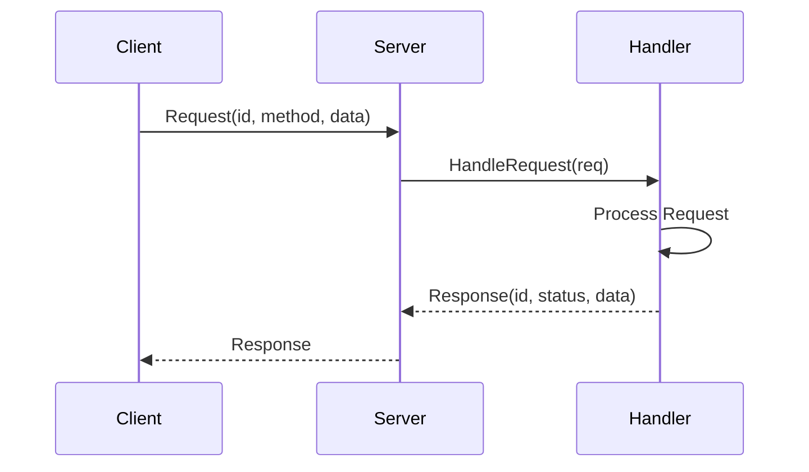
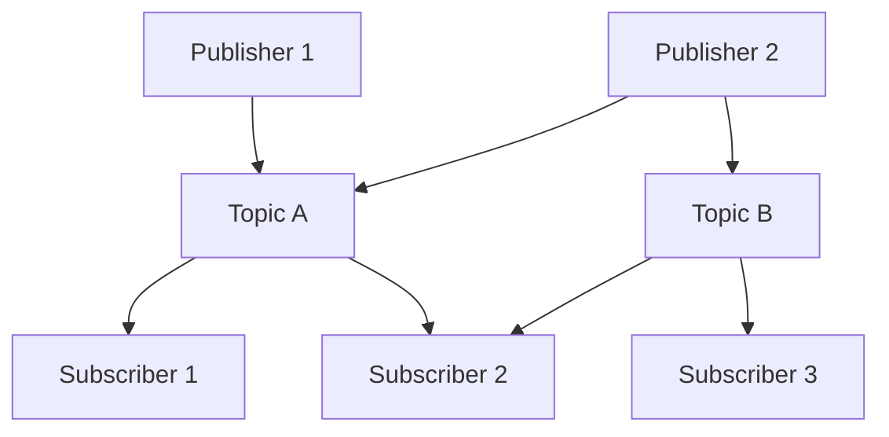
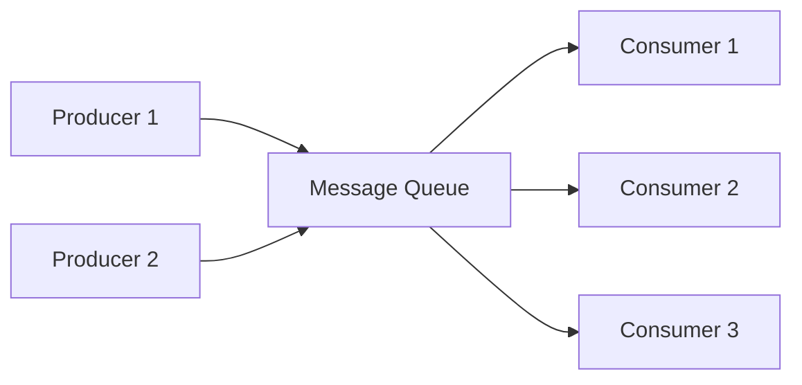
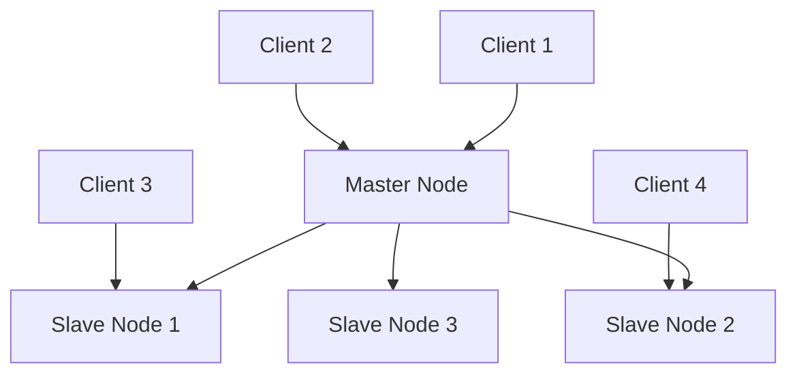
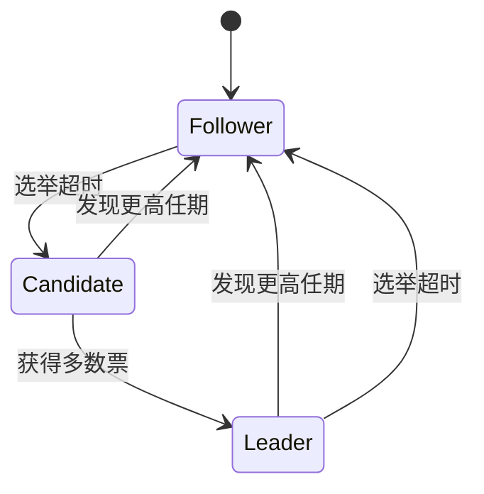

# 分布式系统设计模式 - Golang实现与分析

## 目录

- [分布式系统设计模式 - Golang实现与分析](#分布式系统设计模式---golang实现与分析)
  - [目录](#目录)
  - [1. 分布式通信模式](#1-分布式通信模式)
    - [1.1 请求-响应模式](#11-请求-响应模式)
      - [概念定义](#概念定义)
      - [优缺点分析](#优缺点分析)
      - [时序图](#时序图)
      - [相关开源组件](#相关开源组件)
    - [1.2 发布-订阅模式](#12-发布-订阅模式)
      - [1.2.1 概念定义](#121-概念定义)
      - [1.2.2 优缺点分析](#122-优缺点分析)
      - [架构图](#架构图)
      - [1.2.3 相关开源组件](#123-相关开源组件)
    - [1.3 消息队列模式](#13-消息队列模式)
      - [1.3.1 概念定义](#131-概念定义)
      - [1.3.2 优缺点分析](#132-优缺点分析)
      - [流程图](#流程图)
      - [1.3.3 相关开源组件](#133-相关开源组件)
  - [2. 一致性与复制模式](#2-一致性与复制模式)
    - [2.1 主从复制](#21-主从复制)
      - [2.1.1 概念定义](#211-概念定义)
      - [2.1.2 优缺点分析](#212-优缺点分析)
      - [2.1.3 架构图](#213-架构图)
      - [2.1.4 相关开源组件](#214-相关开源组件)
    - [2.4 分布式共识（Raft）](#24-分布式共识raft)
      - [2.4.1 概念定义](#241-概念定义)
      - [2.4.2 优缺点分析](#242-优缺点分析)
      - [2.4.3 状态转换图](#243-状态转换图)
      - [2.4.4 相关开源组件](#244-相关开源组件)
  - [9. 形式化定义与数学证明](#9-形式化定义与数学证明)
    - [9.1 分布式系统形式化模型](#91-分布式系统形式化模型)
    - [9.2 最终一致性形式化定义](#92-最终一致性形式化定义)
    - [9.3 CAP定理形式化](#93-cap定理形式化)
  - [10. Golang实现与开源组件](#10-golang实现与开源组件)
    - [10.1 核心开源组件](#101-核心开源组件)
      - [etcd](#etcd)
      - [Consul](#consul)
      - [gRPC](#grpc)
    - [10.2 性能优化最佳实践](#102-性能优化最佳实践)
      - [连接池管理](#连接池管理)
      - [负载均衡](#负载均衡)
  - [11. 性能分析与最佳实践](#11-性能分析与最佳实践)
    - [11.1 性能指标](#111-性能指标)
      - [延迟（Latency）](#延迟latency)
      - [吞吐量（Throughput）](#吞吐量throughput)
      - [可用性（Availability）](#可用性availability)
    - [11.2 监控与可观测性](#112-监控与可观测性)
      - [指标收集](#指标收集)
      - [分布式追踪](#分布式追踪)
    - [11.3 错误处理策略](#113-错误处理策略)
      - [重试机制](#重试机制)
      - [熔断器模式](#熔断器模式)
  - [12. 参考文献与外部链接](#12-参考文献与外部链接)
    - [12.1 学术论文](#121-学术论文)
    - [12.2 开源项目](#122-开源项目)
    - [12.3 技术文档](#123-技术文档)
    - [12.4 最佳实践指南](#124-最佳实践指南)

## 1. 分布式通信模式

### 1.1 请求-响应模式

#### 概念定义

**定义**：客户端发送请求，服务器处理并返回响应的通信模式。可以是同步的也可以是异步的。

**形式化定义**：
设 $R$ 为请求集合，$S$ 为响应集合，$f: R \rightarrow S$ 为处理函数，则请求-响应模式可表示为：

$$(r, s) \in R \times S \text{ 且 } s = f(r)$$

**Golang实现**：

```go
package requestresponse

import (
    "context"
    "encoding/json"
    "fmt"
    "net/http"
    "time"
)

// Request 请求结构
type Request struct {
    ID        string                 `json:"id"`
    Method    string                 `json:"method"`
    Data      map[string]interface{} `json:"data"`
    Timestamp time.Time              `json:"timestamp"`
}

// Response 响应结构
type Response struct {
    ID        string                 `json:"id"`
    Status    string                 `json:"status"`
    Data      map[string]interface{} `json:"data"`
    Error     string                 `json:"error,omitempty"`
    Timestamp time.Time              `json:"timestamp"`
}

// RequestResponseHandler 请求-响应处理器
type RequestResponseHandler struct {
    handlers map[string]func(Request) (Response, error)
}

// NewRequestResponseHandler 创建处理器
func NewRequestResponseHandler() *RequestResponseHandler {
    return &RequestResponseHandler{
        handlers: make(map[string]func(Request) (Response, error)),
    }
}

// RegisterHandler 注册处理器
func (h *RequestResponseHandler) RegisterHandler(method string, handler func(Request) (Response, error)) {
    h.handlers[method] = handler
}

// HandleRequest 处理请求
func (h *RequestResponseHandler) HandleRequest(req Request) (Response, error) {
    handler, exists := h.handlers[req.Method]
    if !exists {
        return Response{
            ID:        req.ID,
            Status:    "error",
            Error:     "method not found",
            Timestamp: time.Now(),
        }, fmt.Errorf("method %s not found", req.Method)
    }
    
    return handler(req)
}

// HTTP服务器实现
func (h *RequestResponseHandler) ServeHTTP(w http.ResponseWriter, r *http.Request) {
    var req Request
    if err := json.NewDecoder(r.Body).Decode(&req); err != nil {
        http.Error(w, err.Error(), http.StatusBadRequest)
        return
    }
    
    req.Timestamp = time.Now()
    
    resp, err := h.HandleRequest(req)
    if err != nil {
        resp.Status = "error"
        resp.Error = err.Error()
    }
    
    resp.Timestamp = time.Now()
    json.NewEncoder(w).Encode(resp)
}
```

#### 优缺点分析

**优点**：

- 简单直观，易于实现和理解
- 适合请求-响应类型的交互
- 可以集成重试、超时等机制

**缺点**：

- 紧耦合：客户端必须等待响应
- 可能导致阻塞
- 难以扩展到复杂的交互模式

#### 时序图



#### 相关开源组件

- **Gin**: 高性能HTTP Web框架
- **gRPC**: 高性能RPC框架
- **Go-Kit**: 微服务工具包

### 1.2 发布-订阅模式

#### 1.2.1 概念定义

**定义**：发布者将消息发送到主题，订阅者接收感兴趣主题的消息，实现松耦合的异步通信。

**形式化定义**：
设 $P$ 为发布者集合，$S$ 为订阅者集合，$T$ 为主题集合，$M$ 为消息集合，则发布-订阅模式可表示为：

$$\text{PubSub} = \{(p, t, m) \in P \times T \times M\} \cup \{(s, t) \in S \times T\}$$

**Golang实现**：

```go
package pubsub

import (
    "context"
    "sync"
    "time"
)

// Message 消息结构
type Message struct {
    ID        string                 `json:"id"`
    Topic     string                 `json:"topic"`
    Data      map[string]interface{} `json:"data"`
    Timestamp time.Time              `json:"timestamp"`
}

// Subscriber 订阅者接口
type Subscriber interface {
    ID() string
    OnMessage(msg Message)
}

// Publisher 发布者接口
type Publisher interface {
    Publish(topic string, data map[string]interface{}) error
}

// PubSubSystem 发布-订阅系统
type PubSubSystem struct {
    subscribers map[string][]Subscriber
    mutex       sync.RWMutex
}

// NewPubSubSystem 创建发布-订阅系统
func NewPubSubSystem() *PubSubSystem {
    return &PubSubSystem{
        subscribers: make(map[string][]Subscriber),
    }
}

// Subscribe 订阅主题
func (ps *PubSubSystem) Subscribe(topic string, subscriber Subscriber) {
    ps.mutex.Lock()
    defer ps.mutex.Unlock()
    
    ps.subscribers[topic] = append(ps.subscribers[topic], subscriber)
}

// Unsubscribe 取消订阅
func (ps *PubSubSystem) Unsubscribe(topic string, subscriberID string) {
    ps.mutex.Lock()
    defer ps.mutex.Unlock()
    
    subscribers, exists := ps.subscribers[topic]
    if !exists {
        return
    }
    
    for i, sub := range subscribers {
        if sub.ID() == subscriberID {
            ps.subscribers[topic] = append(subscribers[:i], subscribers[i+1:]...)
            break
        }
    }
}

// Publish 发布消息
func (ps *PubSubSystem) Publish(topic string, data map[string]interface{}) error {
    ps.mutex.RLock()
    subscribers, exists := ps.subscribers[topic]
    ps.mutex.RUnlock()
    
    if !exists {
        return nil
    }
    
    msg := Message{
        ID:        generateID(),
        Topic:     topic,
        Data:      data,
        Timestamp: time.Now(),
    }
    
    // 异步发送消息给所有订阅者
    for _, subscriber := range subscribers {
        go func(sub Subscriber) {
            sub.OnMessage(msg)
        }(subscriber)
    }
    
    return nil
}

// 简单的订阅者实现
type SimpleSubscriber struct {
    id     string
    topics []string
}

func NewSimpleSubscriber(id string) *SimpleSubscriber {
    return &SimpleSubscriber{
        id:     id,
        topics: make([]string, 0),
    }
}

func (s *SimpleSubscriber) ID() string {
    return s.id
}

func (s *SimpleSubscriber) OnMessage(msg Message) {
    // 处理接收到的消息
    fmt.Printf("Subscriber %s received message on topic %s: %+v\n", s.id, msg.Topic, msg.Data)
}
```

#### 1.2.2 优缺点分析

**优点**：

- 松耦合：发布者和订阅者互不依赖
- 可扩展：易于添加新的发布者和订阅者
- 异步通信：提高系统响应性

**缺点**：

- 消息可能丢失
- 难以保证消息顺序
- 调试和测试复杂

#### 架构图



#### 1.2.3 相关开源组件

- **NATS**: 轻量级消息系统
- **Redis Pub/Sub**: Redis发布订阅
- **Apache Kafka**: 分布式流处理平台

### 1.3 消息队列模式

#### 1.3.1 概念定义

**定义**：生产者将消息发送到队列，消费者从队列中获取消息进行处理，实现异步消息传递。

**形式化定义**：
设 $Q$ 为队列，$M$ 为消息集合，$P$ 为生产者集合，$C$ 为消费者集合，则消息队列模式可表示为：

$$Q = \{m_1, m_2, ..., m_n\} \text{ 其中 } m_i \in M$$

**Golang实现**：

```go
package messagequeue

import (
    "context"
    "sync"
    "time"
)

// Message 消息结构
type Message struct {
    ID        string                 `json:"id"`
    Queue     string                 `json:"queue"`
    Data      map[string]interface{} `json:"data"`
    Priority  int                    `json:"priority"`
    Timestamp time.Time              `json:"timestamp"`
}

// Queue 消息队列
type Queue struct {
    name     string
    messages chan Message
    mutex    sync.RWMutex
}

// NewQueue 创建队列
func NewQueue(name string, capacity int) *Queue {
    return &Queue{
        name:     name,
        messages: make(chan Message, capacity),
    }
}

// Enqueue 入队
func (q *Queue) Enqueue(msg Message) error {
    select {
    case q.messages <- msg:
        return nil
    default:
        return fmt.Errorf("queue %s is full", q.name)
    }
}

// Dequeue 出队
func (q *Queue) Dequeue(ctx context.Context) (Message, error) {
    select {
    case msg := <-q.messages:
        return msg, nil
    case <-ctx.Done():
        return Message{}, ctx.Err()
    }
}

// Producer 生产者
type Producer struct {
    queue *Queue
}

func NewProducer(queue *Queue) *Producer {
    return &Producer{queue: queue}
}

func (p *Producer) SendMessage(data map[string]interface{}, priority int) error {
    msg := Message{
        ID:        generateID(),
        Queue:     p.queue.name,
        Data:      data,
        Priority:  priority,
        Timestamp: time.Now(),
    }
    
    return p.queue.Enqueue(msg)
}

// Consumer 消费者
type Consumer struct {
    queue    *Queue
    handler  func(Message) error
    workers  int
    stopChan chan struct{}
}

func NewConsumer(queue *Queue, handler func(Message) error, workers int) *Consumer {
    return &Consumer{
        queue:    queue,
        handler:  handler,
        workers:  workers,
        stopChan: make(chan struct{}),
    }
}

func (c *Consumer) Start(ctx context.Context) {
    for i := 0; i < c.workers; i++ {
        go c.worker(ctx, i)
    }
}

func (c *Consumer) worker(ctx context.Context, id int) {
    for {
        select {
        case <-ctx.Done():
            return
        case <-c.stopChan:
            return
        default:
            msg, err := c.queue.Dequeue(ctx)
            if err != nil {
                continue
            }
            
            if err := c.handler(msg); err != nil {
                // 处理错误，可以选择重试或发送到死信队列
                fmt.Printf("Worker %d failed to process message %s: %v\n", id, msg.ID, err)
            }
        }
    }
}

func (c *Consumer) Stop() {
    close(c.stopChan)
}
```

#### 1.3.2 优缺点分析

**优点**：

- 异步处理：提高系统响应性
- 削峰填谷：处理流量波动
- 解耦：生产者和消费者独立

**缺点**：

- 增加系统复杂性
- 消息可能重复或丢失
- 需要处理死信队列

#### 流程图



#### 1.3.3 相关开源组件

- **RabbitMQ**: 消息代理
- **Apache ActiveMQ**: 消息中间件
- **Redis Streams**: Redis流数据结构

## 2. 一致性与复制模式

### 2.1 主从复制

#### 2.1.1 概念定义

**定义**：一个主节点处理写操作，多个从节点复制主节点的数据，处理读操作。

**形式化定义**：
设 $M$ 为主节点，$S = \{s_1, s_2, ..., s_n\}$ 为从节点集合，$D$ 为数据集合，则主从复制可表示为：

$$\forall s_i \in S, \text{Replicate}(M, s_i) \text{ 且 } \text{Read}(s_i) \subseteq \text{Read}(M)$$

**Golang实现**：

```go
package replication

import (
    "context"
    "sync"
    "time"
)

// Node 节点接口
type Node interface {
    ID() string
    IsMaster() bool
    Write(key string, value interface{}) error
    Read(key string) (interface{}, error)
}

// MasterNode 主节点
type MasterNode struct {
    id       string
    data     map[string]interface{}
    slaves   []*SlaveNode
    mutex    sync.RWMutex
    log      []LogEntry
}

type LogEntry struct {
    Index   int64
    Term    int64
    Command string
    Key     string
    Value   interface{}
    Time    time.Time
}

func NewMasterNode(id string) *MasterNode {
    return &MasterNode{
        id:     id,
        data:   make(map[string]interface{}),
        slaves: make([]*SlaveNode, 0),
        log:    make([]LogEntry, 0),
    }
}

func (m *MasterNode) ID() string {
    return m.id
}

func (m *MasterNode) IsMaster() bool {
    return true
}

func (m *MasterNode) Write(key string, value interface{}) error {
    m.mutex.Lock()
    defer m.mutex.Unlock()
    
    // 写入本地数据
    m.data[key] = value
    
    // 记录日志
    entry := LogEntry{
        Index:   int64(len(m.log)),
        Term:    1, // 简化版本
        Command: "SET",
        Key:     key,
        Value:   value,
        Time:    time.Now(),
    }
    m.log = append(m.log, entry)
    
    // 复制到从节点
    for _, slave := range m.slaves {
        go func(s *SlaveNode) {
            s.Replicate(entry)
        }(slave)
    }
    
    return nil
}

func (m *MasterNode) Read(key string) (interface{}, error) {
    m.mutex.RLock()
    defer m.mutex.RUnlock()
    
    value, exists := m.data[key]
    if !exists {
        return nil, fmt.Errorf("key %s not found", key)
    }
    
    return value, nil
}

func (m *MasterNode) AddSlave(slave *SlaveNode) {
    m.mutex.Lock()
    defer m.mutex.Unlock()
    
    m.slaves = append(m.slaves, slave)
}

// SlaveNode 从节点
type SlaveNode struct {
    id     string
    data   map[string]interface{}
    master *MasterNode
    mutex  sync.RWMutex
    log    []LogEntry
}

func NewSlaveNode(id string, master *MasterNode) *SlaveNode {
    return &SlaveNode{
        id:     id,
        data:   make(map[string]interface{}),
        master: master,
        log:    make([]LogEntry, 0),
    }
}

func (s *SlaveNode) ID() string {
    return s.id
}

func (s *SlaveNode) IsMaster() bool {
    return false
}

func (s *SlaveNode) Write(key string, value interface{}) error {
    // 从节点不能直接写入，需要转发给主节点
    return s.master.Write(key, value)
}

func (s *SlaveNode) Read(key string) (interface{}, error) {
    s.mutex.RLock()
    defer s.mutex.RUnlock()
    
    value, exists := s.data[key]
    if !exists {
        return nil, fmt.Errorf("key %s not found", key)
    }
    
    return value, nil
}

func (s *SlaveNode) Replicate(entry LogEntry) error {
    s.mutex.Lock()
    defer s.mutex.Unlock()
    
    // 应用日志条目
    switch entry.Command {
    case "SET":
        s.data[entry.Key] = entry.Value
    case "DELETE":
        delete(s.data, entry.Key)
    }
    
    s.log = append(s.log, entry)
    return nil
}
```

#### 2.1.2 优缺点分析

**优点**：

- 读写分离：提高读性能
- 高可用：主节点故障时可切换
- 简单易实现

**缺点**：

- 单点故障：主节点故障影响写操作
- 数据一致性：主从延迟可能导致数据不一致
- 扩展性限制：写操作仍受主节点限制

#### 2.1.3 架构图



#### 2.1.4 相关开源组件

- **MySQL**: 主从复制
- **PostgreSQL**: 流复制
- **Redis**: 主从复制

### 2.4 分布式共识（Raft）

#### 2.4.1 概念定义

**定义**：Raft是一种分布式一致性算法，通过领导者选举和日志复制保证多个节点间的一致性。

**形式化定义**：
设 $N$ 为节点集合，$L$ 为日志集合，$T$ 为任期集合，则Raft算法可表示为：

$$\text{Raft} = \{\text{LeaderElection}, \text{LogReplication}, \text{Safety}\}$$

其中：

- $\text{LeaderElection}: N \rightarrow N \times T$
- $\text{LogReplication}: L \times N \rightarrow L$
- $\text{Safety}: \forall i, j \in N, \text{Log}_i = \text{Log}_j$

**Golang实现**：

```go
package raft

import (
    "context"
    "sync"
    "time"
)

// NodeState 节点状态
type NodeState int

const (
    Follower NodeState = iota
    Candidate
    Leader
)

// LogEntry 日志条目
type LogEntry struct {
    Index   int64
    Term    int64
    Command string
    Data    interface{}
}

// RaftNode Raft节点
type RaftNode struct {
    id        string
    state     NodeState
    term      int64
    votedFor  string
    log       []LogEntry
    commitIndex int64
    lastApplied int64
    
    // 领导者相关
    nextIndex  map[string]int64
    matchIndex map[string]int64
    
    // 网络相关
    peers      map[string]*RaftNode
    mutex      sync.RWMutex
    
    // 定时器
    electionTimer  *time.Timer
    heartbeatTimer *time.Timer
}

func NewRaftNode(id string) *RaftNode {
    node := &RaftNode{
        id:         id,
        state:      Follower,
        term:       0,
        votedFor:   "",
        log:        make([]LogEntry, 0),
        commitIndex: 0,
        lastApplied: 0,
        nextIndex:   make(map[string]int64),
        matchIndex:  make(map[string]int64),
        peers:       make(map[string]*RaftNode),
    }
    
    // 初始化日志
    node.log = append(node.log, LogEntry{
        Index:   0,
        Term:    0,
        Command: "NOOP",
        Data:    nil,
    })
    
    return node
}

// StartElection 开始选举
func (r *RaftNode) StartElection() {
    r.mutex.Lock()
    r.state = Candidate
    r.term++
    r.votedFor = r.id
    r.mutex.Unlock()
    
    // 发送投票请求
    votes := 1 // 自己的一票
    for peerID, peer := range r.peers {
        go func(id string, p *RaftNode) {
            if p.RequestVote(r.term, r.id, len(r.log)-1, r.log[len(r.log)-1].Term) {
                votes++
                if votes > len(r.peers)/2 {
                    r.BecomeLeader()
                }
            }
        }(peerID, peer)
    }
    
    // 重置选举定时器
    r.resetElectionTimer()
}

// RequestVote 请求投票
func (r *RaftNode) RequestVote(term int64, candidateID string, lastLogIndex int64, lastLogTerm int64) bool {
    r.mutex.Lock()
    defer r.mutex.Unlock()
    
    if term < r.term {
        return false
    }
    
    if term > r.term {
        r.term = term
        r.state = Follower
        r.votedFor = ""
    }
    
    if r.votedFor == "" || r.votedFor == candidateID {
        // 检查日志是否至少和自己一样新
        if lastLogTerm > r.log[len(r.log)-1].Term ||
            (lastLogTerm == r.log[len(r.log)-1].Term && lastLogIndex >= int64(len(r.log)-1)) {
            r.votedFor = candidateID
            r.resetElectionTimer()
            return true
        }
    }
    
    return false
}

// BecomeLeader 成为领导者
func (r *RaftNode) BecomeLeader() {
    r.mutex.Lock()
    defer r.mutex.Unlock()
    
    r.state = Leader
    
    // 初始化领导者状态
    for peerID := range r.peers {
        r.nextIndex[peerID] = int64(len(r.log))
        r.matchIndex[peerID] = 0
    }
    
    // 发送心跳
    r.sendHeartbeat()
    
    // 启动心跳定时器
    r.heartbeatTimer = time.AfterFunc(100*time.Millisecond, func() {
        r.sendHeartbeat()
    })
}

// sendHeartbeat 发送心跳
func (r *RaftNode) sendHeartbeat() {
    for peerID, peer := range r.peers {
        go func(id string, p *RaftNode) {
            p.AppendEntries(r.term, r.id, r.commitIndex, []LogEntry{})
        }(peerID, peer)
    }
}

// AppendEntries 追加日志条目
func (r *RaftNode) AppendEntries(term int64, leaderID string, prevLogIndex int64, prevLogTerm int64, entries []LogEntry, leaderCommit int64) bool {
    r.mutex.Lock()
    defer r.mutex.Unlock()
    
    if term < r.term {
        return false
    }
    
    if term > r.term {
        r.term = term
        r.state = Follower
        r.votedFor = ""
    }
    
    r.resetElectionTimer()
    
    // 检查日志一致性
    if prevLogIndex >= int64(len(r.log)) || r.log[prevLogIndex].Term != prevLogTerm {
        return false
    }
    
    // 追加新条目
    for i, entry := range entries {
        logIndex := prevLogIndex + int64(i) + 1
        if logIndex < int64(len(r.log)) {
            if r.log[logIndex].Term != entry.Term {
                // 截断日志
                r.log = r.log[:logIndex]
            }
        }
        if logIndex >= int64(len(r.log)) {
            r.log = append(r.log, entry)
        }
    }
    
    // 更新提交索引
    if leaderCommit > r.commitIndex {
        r.commitIndex = min(leaderCommit, int64(len(r.log)-1))
        r.applyLogs()
    }
    
    return true
}

// applyLogs 应用日志
func (r *RaftNode) applyLogs() {
    for r.lastApplied < r.commitIndex {
        r.lastApplied++
        // 应用日志条目到状态机
        entry := r.log[r.lastApplied]
        r.applyCommand(entry.Command, entry.Data)
    }
}

// applyCommand 应用命令
func (r *RaftNode) applyCommand(command string, data interface{}) {
    // 这里实现具体的状态机逻辑
    fmt.Printf("Node %s applying command: %s, data: %v\n", r.id, command, data)
}

func (r *RaftNode) resetElectionTimer() {
    if r.electionTimer != nil {
        r.electionTimer.Stop()
    }
    r.electionTimer = time.AfterFunc(150*time.Millisecond+time.Duration(rand.Intn(150))*time.Millisecond, func() {
        r.StartElection()
    })
}

func min(a, b int64) int64 {
    if a < b {
        return a
    }
    return b
}
```

#### 2.4.2 优缺点分析

**优点**：

- 易于理解：比Paxos更简单
- 工程实现成熟：etcd、Consul等广泛使用
- 强一致性保证

**缺点**：

- 对网络分区敏感
- 领导者选举可能产生脑裂
- 性能受领导者限制

#### 2.4.3 状态转换图



#### 2.4.4 相关开源组件

- **etcd**: 分布式键值存储
- **Consul**: 服务发现和配置
- **TiKV**: 分布式事务数据库

## 9. 形式化定义与数学证明

### 9.1 分布式系统形式化模型

**定义**：分布式系统是一个五元组 $(N, S, M, T, \delta)$，其中：

- $N$ 是节点集合
- $S$ 是状态集合
- $M$ 是消息集合
- $T$ 是时间集合
- $\delta: N \times S \times M \rightarrow S$ 是状态转换函数

**定理**：在异步网络中，不可能同时满足以下三个属性：

1. 终止性（Termination）
2. 一致性（Agreement）
3. 有效性（Validity）

**证明**：这是著名的FLP不可能性定理，证明在异步网络中，即使只有一个节点可能崩溃，也无法实现共识。

### 9.2 最终一致性形式化定义

**定义**：最终一致性可表示为：

$$\forall i, j \in N, \lim_{t \to \infty} S_i(t) = S_j(t)$$

其中 $S_i(t)$ 表示节点 $i$ 在时间 $t$ 的状态。

### 9.3 CAP定理形式化

**定理**：分布式系统最多只能同时满足CAP中的两个属性：

- 一致性（Consistency）
- 可用性（Availability）
- 分区容错性（Partition tolerance）

**形式化表达**：
$$\text{Consistency} \land \text{Availability} \land \text{Partition Tolerance} = \text{False}$$

## 10. Golang实现与开源组件

### 10.1 核心开源组件

#### etcd

- **用途**：分布式键值存储，服务发现
- **特点**：基于Raft算法，强一致性
- **Golang集成**：

```go
import "go.etcd.io/etcd/client/v3"

func connectEtcd() (*clientv3.Client, error) {
    return clientv3.New(clientv3.Config{
        Endpoints:   []string{"localhost:2379"},
        DialTimeout: 5 * time.Second,
    })
}
```

#### Consul

- **用途**：服务发现、配置管理、健康检查
- **特点**：支持多数据中心
- **Golang集成**：

```go
import "github.com/hashicorp/consul/api"

func connectConsul() (*api.Client, error) {
    return api.NewClient(&api.Config{
        Address: "localhost:8500",
    })
}
```

#### gRPC

- **用途**：高性能RPC框架
- **特点**：基于HTTP/2，支持流式传输
- **Golang集成**：

```go
import (
    "google.golang.org/grpc"
    pb "path/to/proto"
)

func createGRPCServer() *grpc.Server {
    server := grpc.NewServer()
    pb.RegisterServiceServer(server, &MyService{})
    return server
}
```

### 10.2 性能优化最佳实践

#### 连接池管理

```go
type ConnectionPool struct {
    connections chan net.Conn
    factory     func() (net.Conn, error)
    maxConn     int
    mutex       sync.Mutex
}

func (p *ConnectionPool) Get() (net.Conn, error) {
    select {
    case conn := <-p.connections:
        return conn, nil
    default:
        return p.factory()
    }
}

func (p *ConnectionPool) Put(conn net.Conn) {
    select {
    case p.connections <- conn:
    default:
        conn.Close()
    }
}
```

#### 负载均衡

```go
type LoadBalancer struct {
    servers []string
    current int
    mutex   sync.Mutex
}

func (lb *LoadBalancer) Next() string {
    lb.mutex.Lock()
    defer lb.mutex.Unlock()
    
    server := lb.servers[lb.current]
    lb.current = (lb.current + 1) % len(lb.servers)
    return server
}
```

## 11. 性能分析与最佳实践

### 11.1 性能指标

#### 延迟（Latency）

- **定义**：请求从发送到接收响应的时间
- **测量**：使用histogram统计分布
- **优化**：连接复用、异步处理、缓存

#### 吞吐量（Throughput）

- **定义**：单位时间内处理的请求数量
- **测量**：QPS（Queries Per Second）
- **优化**：并发处理、负载均衡、资源池化

#### 可用性（Availability）

- **定义**：系统正常运行时间的比例
- **测量**：$A = \frac{MTBF}{MTBF + MTTR}$
- **优化**：冗余设计、故障转移、监控告警

### 11.2 监控与可观测性

#### 指标收集

```go
import "github.com/prometheus/client_golang/prometheus"

var (
    requestDuration = prometheus.NewHistogramVec(
        prometheus.HistogramOpts{
            Name: "request_duration_seconds",
            Help: "Request duration in seconds",
        },
        []string{"method", "endpoint"},
    )
    
    requestCount = prometheus.NewCounterVec(
        prometheus.CounterOpts{
            Name: "request_total",
            Help: "Total number of requests",
        },
        []string{"method", "endpoint", "status"},
    )
)
```

#### 分布式追踪

```go
import "go.opentelemetry.io/otel/trace"

func tracedHandler(ctx context.Context, req Request) (Response, error) {
    ctx, span := trace.SpanFromContext(ctx).TracerProvider().Tracer("").Start(ctx, "handler")
    defer span.End()
    
    // 处理请求
    return processRequest(ctx, req)
}
```

### 11.3 错误处理策略

#### 重试机制

```go
func retryWithBackoff(operation func() error, maxRetries int) error {
    for i := 0; i < maxRetries; i++ {
        if err := operation(); err == nil {
            return nil
        }
        
        // 指数退避
        backoff := time.Duration(1<<uint(i)) * time.Second
        time.Sleep(backoff)
    }
    return fmt.Errorf("operation failed after %d retries", maxRetries)
}
```

#### 熔断器模式

```go
type CircuitBreaker struct {
    state       State
    failureCount int
    threshold   int
    timeout     time.Duration
    lastFailure time.Time
    mutex       sync.Mutex
}

type State int

const (
    Closed State = iota
    Open
    HalfOpen
)

func (cb *CircuitBreaker) Execute(operation func() error) error {
    cb.mutex.Lock()
    defer cb.mutex.Unlock()
    
    switch cb.state {
    case Open:
        if time.Since(cb.lastFailure) > cb.timeout {
            cb.state = HalfOpen
        } else {
            return fmt.Errorf("circuit breaker is open")
        }
    case HalfOpen:
        // 允许一个请求通过
    case Closed:
        // 正常状态
    }
    
    if err := operation(); err != nil {
        cb.failureCount++
        cb.lastFailure = time.Now()
        
        if cb.failureCount >= cb.threshold {
            cb.state = Open
        }
        return err
    }
    
    // 成功，重置状态
    cb.failureCount = 0
    cb.state = Closed
    return nil
}
```

## 12. 参考文献与外部链接

### 12.1 学术论文

- [Raft论文](https://raft.github.io/raft.pdf)
- [Paxos论文](https://lamport.azurewebsites.net/pubs/paxos-simple.pdf)
- [CAP定理论文](https://www.glassbeam.com/sites/all/themes/glassbeam/images/blog/10.1.1.67.6951.pdf)

### 12.2 开源项目

- [etcd](https://github.com/etcd-io/etcd)
- [Consul](https://github.com/hashicorp/consul)
- [gRPC](https://github.com/grpc/grpc-go)
- [NATS](https://github.com/nats-io/nats.go)

### 12.3 技术文档

- [Go官方文档](https://golang.org/doc/)
- [Kubernetes文档](https://kubernetes.io/docs/)
- [Docker文档](https://docs.docker.com/)

### 12.4 最佳实践指南

- [Google SRE](https://sre.google/)
- [Netflix Chaos Engineering](https://netflixtechblog.com/tagged/chaos-engineering)
- [AWS Well-Architected Framework](https://aws.amazon.com/architecture/well-architected/)

---

*本文档持续更新，反映分布式系统设计模式的最新发展和Golang生态系统的最佳实践。*
